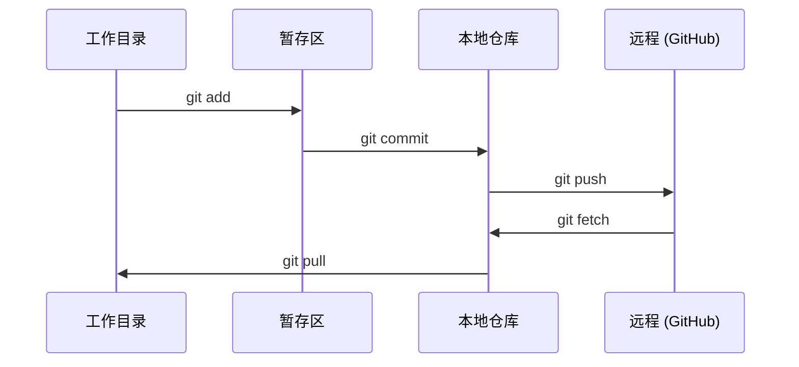

# Git 与协作

> 版本控制不是可选的。你在这里构建的每个实验、每个模型、每节课都会被追踪。

**类型：** 学习
**语言：** --
**前置要求：** 第 0 阶段，第 01 课
**时间：** 约 30 分钟

## 学习目标

- 配置 git 身份并使用日常的工作流程：添加、提交和推送
- 创建和合并分支，用于隔离实验而不破坏主分支
- 编写 `.gitignore`，排除模型检查点和大二进制文件
- 使用 `git log` 浏览提交历史，了解项目演进

## 问题背景

你将在 20 个阶段中编写数百个代码文件。没有版本控制，你会丢失工作，破坏无法撤销的东西，并且无法与他人协作。

Git 是工具。GitHub 是代码托管的地方。这节课涵盖本课程所需的内容，仅此而已。

## 概念讲解



记住三件事：
1. 经常保存 (`git commit`)
2. 推送到远程 (`git push`)
3. 为实验创建分支 (`git checkout -b experiment`)

## 动手实践

### 步骤 1：配置 git

```bash
git config --global user.name "你的名字"
git config --global user.email "you@example.com"
```

### 步骤 2：日常工作流程

```bash
git status
git add file.py
git commit -m "添加感知器实现"
git push origin main
```

### 步骤 3：为实验创建分支

```bash
git checkout -b experiment/new-optimizer

# ... 进行修改，提交 ...

git checkout main
git merge experiment/new-optimizer
```

### 步骤 4：使用本课程仓库

```bash
git clone https://github.com/rohitg00/ai-engineering-from-scratch.git
cd ai-engineering-from-scratch

git checkout -b my-progress
# 学习课程，提交你的代码
git push origin my-progress
```

## 实际应用

对于本课程，你只需要这些命令：

| 命令 | 使用场景 |
|------|----------|
| `git clone` | 获取课程仓库 |
| `git add` + `git commit` | 保存你的工作 |
| `git push` | 备份到 GitHub |
| `git checkout -b` | 尝试新功能而不破坏主分支 |
| `git log --oneline` | 查看你做了什么 |

就这些。本课程不需要 rebase、cherry-pick 或子模块。

## 练习题

1. 克隆本仓库，创建一个名为 `my-progress` 的分支，创建一个文件，提交并推送
2. 创建一个 `.gitignore`，排除模型检查点文件 (`.pt`、`.pth`、`.safetensors`)
3. 使用 `git log --oneline` 查看本仓库的提交历史，了解课程是如何添加的

## 关键术语

| 术语 | 人们怎么说 | 实际含义 |
|------|------------|----------|
| Commit | "保存" | 项目在某个时间点的完整快照 |
| Branch | "一个副本" | 指向提交的指针，随工作推进而移动 |
| Merge | "合并代码" | 将更改从一个分支应用到另一个分支 |
| Remote | "云端" | 托管在其他地方（GitHub、GitLab）的仓库副本 |
