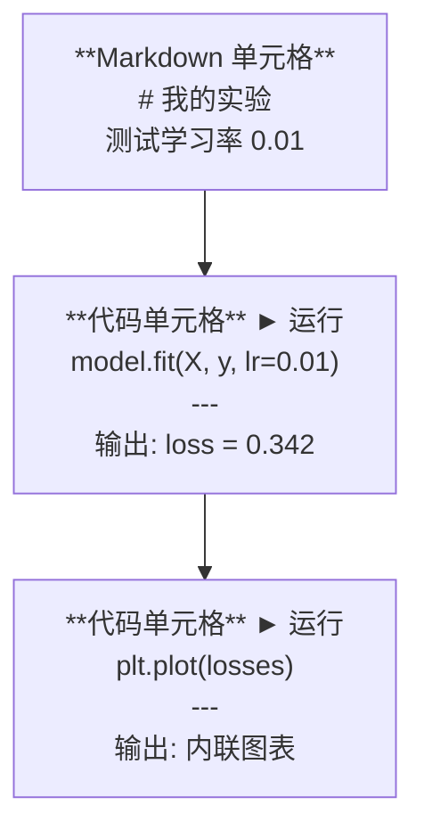
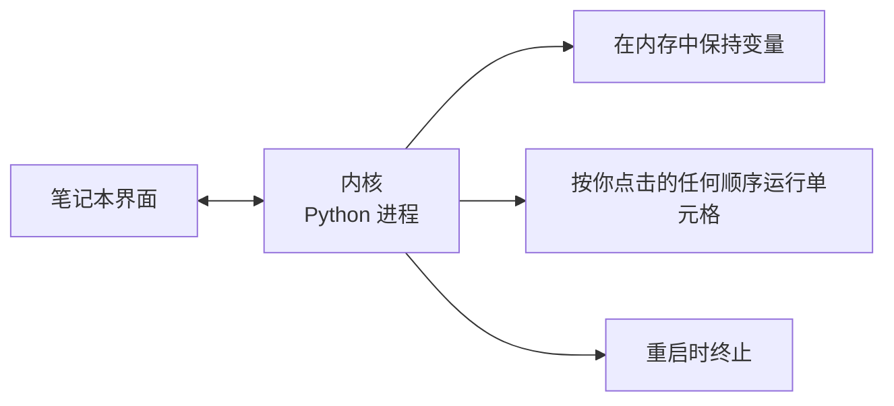

# Jupyter 笔记本

> 笔记本是 AI 工程的实验台。你在这里做原型，然后把能用的移到生产环境。

**类型：** 构建
**语言：** Python
**前置要求：** 第 0 阶段，第 01 课
**时间：** 约 30 分钟

## 学习目标

- 安装并启动 JupyterLab、Jupyter Notebook 或带 Jupyter 扩展的 VS Code
- 使用魔法命令（`%timeit`、`%%time`、`%matplotlib inline`）进行内联基准测试和可视化
- 区分何时使用笔记本与脚本，并应用"在笔记本中探索，在脚本中交付"的工作流程
- 识别并避免常见的笔记本陷阱：乱序执行、隐藏状态和内存泄漏

## 问题背景

每篇 AI 论文、教程和 Kaggle 竞赛都使用 Jupyter 笔记本。它们让你分段运行代码、内联查看输出、混合代码与解释，并快速迭代。如果你尝试不使用笔记本学习 AI，就像做数学作业没有草稿纸。

但笔记本有真正的陷阱。人们把它们用于所有事情，包括它们不适合的事情。知道何时使用笔记本、何时使用脚本，会让你免于日后的调试噩梦。

## 概念讲解

笔记本是一个单元格列表。每个单元格要么是代码，要么是文本。



内核是一个在后台运行的 Python 进程。当你运行单元格时，它将代码发送到内核，内核执行代码并返回结果。所有单元格共享同一个内核，所以变量在单元格之间持久存在。



那个"按你点击的任何顺序"既是超能力，也是陷阱。

## 动手实践

### 步骤 1：选择你的界面

三个选项，一种格式：

| 界面 | 安装 | 最适合 |
|------|------|--------|
| JupyterLab | `pip install jupyterlab` 然后 `jupyter lab` | 完整 IDE 体验，多标签页，文件浏览器，终端 |
| Jupyter Notebook | `pip install notebook` 然后 `jupyter notebook` | 简单、轻量，一次一个笔记本 |
| VS Code | 安装 "Jupyter" 扩展 | 已在编辑器中，git 集成，调试 |

三者都读写相同的 `.ipynb` 文件。选你喜欢的。JupyterLab 在 AI 工作中最常见。

```bash
pip install jupyterlab
jupyter lab
```

### 步骤 2：重要的键盘快捷键

你在两种模式下操作。按 `Escape` 进入命令模式（左侧蓝色条），`Enter` 进入编辑模式（绿色条）。

**命令模式（最常用）：**

| 按键 | 操作 |
|------|------|
| `Shift+Enter` | 运行单元格，移动到下一个 |
| `A` | 在上方插入单元格 |
| `B` | 在下方插入单元格 |
| `DD` | 删除单元格 |
| `M` | 转换为 markdown |
| `Y` | 转换为代码 |
| `Z` | 撤销单元格操作 |
| `Ctrl+Shift+H` | 显示所有快捷键 |

**编辑模式：**

| 按键 | 操作 |
|------|------|
| `Tab` | 自动补全 |
| `Shift+Tab` | 显示函数签名 |
| `Ctrl+/` | 切换注释 |

`Shift+Enter` 是你每天会用一千次的。先学它。

### 步骤 3：单元格类型

**代码单元格** 运行 Python 并显示输出：

```python
import numpy as np
data = np.random.randn(1000)
data.mean(), data.std()
```

输出：`(0.0032, 0.9987)`

**Markdown 单元格** 渲染格式化文本。用它们记录你在做什么以及为什么。支持标题、粗体、斜体、LaTeX 数学（`$E = mc^2$`）、表格和图片。

### 步骤 4：魔法命令

这些不是 Python。它们是 Jupyter 特定命令，以 `%`（行魔法）或 `%%`（单元格魔法）开头。

**给代码计时：**

```python
%timeit np.random.randn(10000)
```

输出：`45.2 us +/- 1.3 us per loop`

```python
%%time
model.fit(X_train, y_train, epochs=10)
```

输出：`Wall time: 2.34 s`

`%timeit` 多次运行代码并取平均。`%%time` 只运行一次。微基准测试用 `%timeit`，训练运行用 `%%time`。

**启用内联图表：**

```python
%matplotlib inline
```

现在每个 `plt.plot()` 或 `plt.show()` 都直接在笔记本中渲染。

**不离开笔记本安装包：**

```python
!pip install scikit-learn
```

`!` 前缀运行任何 shell 命令。

**检查环境变量：**

```python
%env CUDA_VISIBLE_DEVICES
```

### 步骤 5：内联显示富输出

笔记本自动显示单元格中的最后一个表达式。但你可以控制它：

```python
import pandas as pd

df = pd.DataFrame({
    "model": ["Linear", "Random Forest", "Neural Net"],
    "accuracy": [0.72, 0.89, 0.94],
    "training_time": [0.1, 2.3, 45.6]
})
df
```

这渲染格式化的 HTML 表格，而不是文本转储。图表也一样：

```python
import matplotlib.pyplot as plt

plt.figure(figsize=(8, 4))
plt.plot([1, 2, 3, 4], [1, 4, 2, 3])
plt.title("内联图表")
plt.show()
```

图表出现在单元格正下方。这就是笔记本主导 AI 工作的原因。你可以同时看到数据、图表和代码。

图片：

```python
from IPython.display import Image, display
display(Image(filename="architecture.png"))
```

### 步骤 6：Google Colab

Colab 是云端的免费 Jupyter 笔记本。它给你 GPU、预装库和 Google Drive 集成。无需设置。

1. 访问 [colab.research.google.com](https://colab.research.google.com)
2. 从此课程上传任何 `.ipynb` 文件
3. 运行时 > 更改运行时类型 > T4 GPU（免费）

Colab 与本地 Jupyter 的区别：
- 会话之间文件不持久（保存到 Drive 或下载）
- 预装：numpy、pandas、matplotlib、torch、tensorflow、sklearn
- `from google.colab import files` 用于上传/下载文件
- `from google.colab import drive; drive.mount('/content/drive')` 用于持久存储
- 会话在 90 分钟不活动后超时（免费层）

## 实际应用

### 笔记本 vs 脚本：何时使用

| 使用笔记本 | 使用脚本 |
|------------|----------|
| 探索数据集 | 训练管道 |
| 原型模型 | 可复用工具 |
| 可视化结果 | 带 `if __name__` 的任何东西 |
| 解释你的工作 | 定时运行的代码 |
| 快速实验 | 生产代码 |
| 课程练习 | 包和库 |

规则：**在笔记本中探索，在脚本中交付**。

AI 中的常见工作流程：
1. 在笔记本中探索数据
2. 在笔记本中原型你的模型
3. 一旦能用，把代码移到 `.py` 文件
4. 把这些 `.py` 文件导回笔记本做进一步实验

### 常见陷阱

**乱序执行。** 你运行单元格 5，然后单元格 2，然后单元格 7。笔记本在你的机器上能用，但当有人从上到下运行时就坏了。修复：分享前执行 内核 > 重启并全部运行。

**隐藏状态。** 你删除了一个单元格，但它创建的变量仍在内存中。笔记本看起来很干净，但依赖于幽灵单元格。修复：定期重启内核。

**内存泄漏。** 加载 4GB 数据集，训练模型，加载另一个数据集。什么都没释放。修复：`del variable_name` 和 `gc.collect()`，或重启内核。

## 产出成果

本节课生成：
- `outputs/prompt-notebook-helper.md` 用于调试笔记本问题

## 练习题

1. 打开 JupyterLab，创建一个笔记本，使用 `%timeit` 比较列表推导式与 numpy 创建 100,000 个随机数数组
2. 创建一个同时包含 markdown 和代码单元格的笔记本，加载 CSV，显示 dataframe，并绘制图表。然后运行 内核 > 重启并全部运行 验证它能从上到下工作
3. 把 `code/notebook_tips.py` 中的代码粘贴到 Colab 笔记本中，用免费 GPU 运行它

## 关键术语

| 术语 | 人们怎么说 | 实际含义 |
|------|------------|----------|
| 内核 | "运行我代码的东西" | 独立 Python 进程，执行单元格并在内存中保持变量 |
| 单元格 | "代码块" | 笔记本中独立可运行的单元，要么是代码要么是 markdown |
| 魔法命令 | "Jupyter 技巧" | 以 `%` 或 `%%` 为前缀的特殊命令，控制笔记本环境 |
| `.ipynb` | "笔记本文件" | 包含单元格、输出和元数据的 JSON 文件。代表 IPython Notebook |

## 延伸阅读

- [JupyterLab 文档](https://jupyterlab.readthedocs.io/) 了解完整功能集
- [Google Colab FAQ](https://research.google.com/colaboratory/faq.html) 了解 Colab 特定的限制和功能
- [28 个 Jupyter Notebook 技巧](https://www.dataquest.io/blog/jupyter-notebook-tips-tricks-shortcuts/) 了解高级用户快捷键
