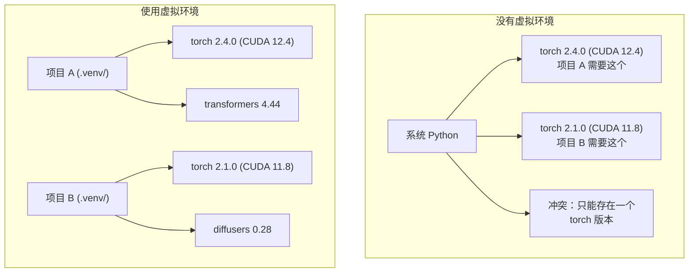

# Python 环境

> 依赖地狱是真实存在的。虚拟环境是解药。

**类型：** 构建
**语言：** Python
**前置要求：** 第 0 阶段，第 01 课
**时间：** 约 30 分钟

## 学习目标

- 使用 `uv`、`venv` 或 `conda` 创建隔离的虚拟环境
- 编写带可选依赖组的 `pyproject.toml` 并生成锁文件以确保可复现性
- 诊断和修复常见陷阱：全局安装、pip/conda 混用、CUDA 版本不匹配
- 为依赖冲突的项目实施按阶段的环境策略

## 问题背景

你为微调项目安装了 PyTorch 2.4。下周，另一个项目需要 PyTorch 2.1，因为它的 CUDA 构建是固定的。你全局升级，第一个项目就坏了。你降级，第二个又坏了。

这就是依赖地狱。在 AI/ML 工作中经常发生，因为：

- PyTorch、JAX 和 TensorFlow 各自自带 CUDA 绑定
- 模型库固定特定的框架版本
- 全局 `pip install` 覆盖之前存在的任何东西
- CUDA 11.8 构建无法在 CUDA 12.x 驱动上运行（反之亦然）

解决方案：每个项目都有自己的隔离环境和自己的包。

## 概念讲解



## 动手实践

### 选项 1：uv venv（推荐）

`uv` 是最快的 Python 包管理器（比 pip 快 10-100 倍）。它在一个工具中处理虚拟环境、Python 版本和依赖解析。

```bash
curl -LsSf https://astral.sh/uv/install.sh | sh

uv python install 3.12

cd your-project
uv venv
source .venv/bin/activate
```

安装包：

```bash
uv pip install torch numpy
```

一步创建带 `pyproject.toml` 的项目：

```bash
uv init my-ai-project
cd my-ai-project
uv add torch numpy matplotlib
```

### 选项 2：venv（内置）

如果你不能安装 `uv`，Python 自带 `venv`：

```bash
python3 -m venv .venv
source .venv/bin/activate  # Linux/macOS
.venv\Scripts\activate     # Windows

pip install torch numpy
```

比 `uv` 慢，但任何安装了 Python 的地方都能用。

### 选项 3：conda（当你需要时）

Conda 管理非 Python 依赖，如 CUDA 工具包、cuDNN 和 C 库。在以下情况使用：

- 你需要特定 CUDA 工具包版本，无需系统级安装
- 你在共享集群上，无法安装系统包
- 库的安装说明说"使用 conda"

```bash
# 安装 miniconda（不要完整的 Anaconda）
curl -LsSf https://repo.anaconda.com/miniconda/Miniconda3-latest-Linux-x86_64.sh -o miniconda.sh
bash miniconda.sh -b

conda create -n myproject python=3.12
conda activate myproject

conda install pytorch torchvision torchaudio pytorch-cuda=12.4 -c pytorch -c nvidia
```

一条规则：如果你用 conda 做环境，就用 conda 管理该环境的所有包。在 conda 环境中混用 `pip install` 会导致痛苦的依赖冲突调试。

### 本课程策略：按阶段策略

你可以为整个课程创建一个环境。不要。不同阶段需要不同（有时冲突）的依赖。

策略：

```
ai-engineering-from-scratch/
├── .venv/                    <-- 共享轻量级环境，用于阶段 0-3
├── phases/
│   ├── 04-neural-networks/
│   │   └── .venv/            <-- PyTorch 环境
│   ├── 05-cnns/
│   │   └── .venv/            <-- 相同 PyTorch 环境（符号链接或共享）
│   ├── 08-transformers/
│   │   └── .venv/            <-- 可能需要不同的 transformer 版本
│   └── 11-llm-apis/
│       └── .venv/            <-- API SDK，不需要 torch
```

`code/env_setup.sh` 脚本为本课程创建基础环境。

## pyproject.toml 基础

每个 Python 项目都应该有一个 `pyproject.toml`。它用一个文件取代 `setup.py`、`setup.cfg` 和 `requirements.txt`。

```toml
[project]
name = "ai-engineering-from-scratch"
version = "0.1.0"
requires-python = ">=3.11"
dependencies = [
    "numpy>=1.26",
    "matplotlib>=3.8",
    "jupyter>=1.0",
    "scikit-learn>=1.4",
]

[project.optional-dependencies]
torch = ["torch>=2.3", "torchvision>=0.18"]
llm = ["anthropic>=0.39", "openai>=1.50"]
```

然后安装：

```bash
uv pip install -e ".[torch]"    # 基础 + PyTorch
uv pip install -e ".[llm]"     # 基础 + 大语言模型 SDK
uv pip install -e ".[torch,llm]" # 全部
```

## 锁文件

锁文件将每个依赖（包括传递依赖）固定到确切版本。这保证可复现性：任何人从锁文件安装都会得到完全相同的包。

```bash
# 使用 uv add 时自动生成 uv.lock
uv add numpy

# pip-tools 方法
uv pip compile pyproject.toml -o requirements.lock
uv pip install -r requirements.lock
```

把你的锁文件提交到 git。当有人克隆仓库时，他们从锁文件安装并得到相同的版本。

## 常见错误

### 1. 全局安装

```bash
pip install torch  # 不好：安装到系统 Python

source .venv/bin/activate
pip install torch  # 好：安装到虚拟环境
```

检查你的包去了哪里：

```bash
which python       # 应该显示 .venv/bin/python，不是 /usr/bin/python
which pip           # 应该显示 .venv/bin/pip
```

### 2. pip 和 conda 混用

```bash
conda create -n myenv python=3.12
conda activate myenv
conda install pytorch -c pytorch
pip install some-other-package   # 不好：会破坏 conda 的依赖跟踪
conda install some-other-package # 好：让 conda 管理所有东西
```

如果你必须在 conda 中使用 pip（某些包只能用 pip），先安装所有 conda 包，最后安装 pip 包。

### 3. 忘记激活

```bash
python train.py           # 使用系统 Python，缺少包
source .venv/bin/activate
python train.py           # 使用项目 Python，包已找到
```

你的 shell 提示符应该显示环境名称：

```
(.venv) $ python train.py
```

### 4. 把 .venv 提交到 git

```bash
echo ".venv/" >> .gitignore
```

虚拟环境是 200MB-2GB。它们是本地的，不能在机器之间移植。提交 `pyproject.toml` 和锁文件代替。

### 5. CUDA 版本不匹配

```bash
nvidia-smi                # 显示驱动 CUDA 版本（如 12.4）
python -c "import torch; print(torch.version.cuda)"  # 显示 PyTorch CUDA 版本

# 这些必须兼容。
# PyTorch CUDA 版本必须 <= 驱动 CUDA 版本。
```

## 实际应用

运行设置脚本创建你的课程环境：

```bash
bash phases/00-setup-and-tooling/06-python-environments/code/env_setup.sh
```

这在仓库根目录创建带核心依赖的 `.venv` 并验证。

## 练习题

1. 运行 `env_setup.sh` 并验证所有检查通过
2. 创建第二个虚拟环境，在里面安装不同版本的 numpy，并确认两个环境是隔离的
3. 为一个需要 PyTorch 和 Anthropic SDK 的项目编写 `pyproject.toml`
4. 故意全局安装一个包（不激活 venv），注意它去了哪里，然后卸载它

## 关键术语

| 术语 | 人们怎么说 | 实际含义 |
|------|------------|----------|
| 虚拟环境 | "一个 venv" | 包含 Python 解释器和包的隔离目录，与系统 Python 分开 |
| 锁文件 | "固定依赖" | 列出每个包及其确切版本的文件，保证跨机器相同安装 |
| pyproject.toml | "新的 setup.py" | 标准 Python 项目配置文件，取代 setup.py/setup.cfg/requirements.txt |
| 传递依赖 | "依赖的依赖" | 包 B 依赖 C；如果你安装依赖 B 的 A，C 是 A 的传递依赖 |
| CUDA 不匹配 | "我的 GPU 不工作" | PyTorch 为与 GPU 驱动支持的 CUDA 版本不同的 CUDA 版本编译 |
