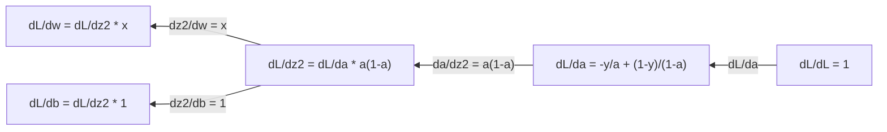
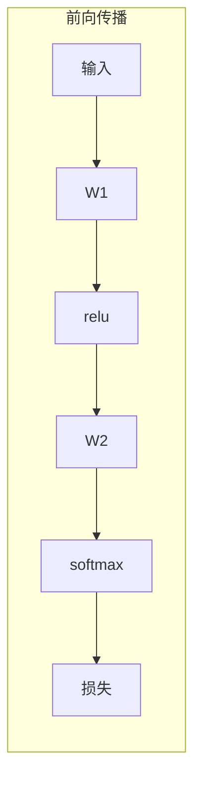
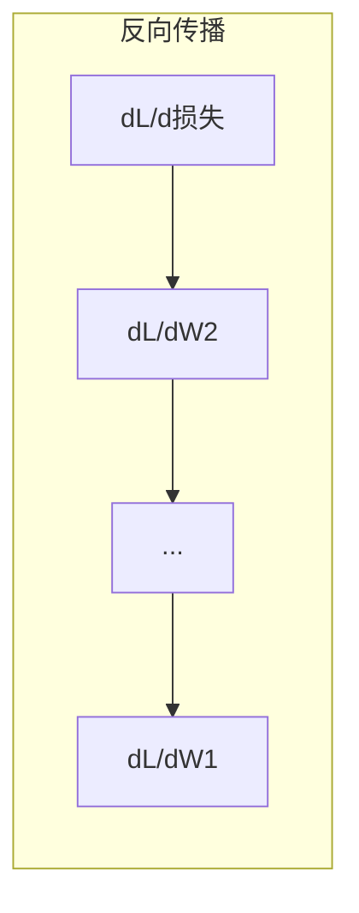

# 机器学习的微积分

> 导数告诉你哪个方向是下坡。这就是神经网络学习所需的全部。

**类型:** 学习
**语言:** Python
**前置要求:** 第1阶段，第01-03课
**时间:** ~60分钟

## 学习目标

- 计算常见ML函数（x^2、sigmoid、交叉熵）的数值导数和解析导数
- 从头实现梯度下降，在1D和2D中最小化损失函数
- 推导线性回归模型的梯度，并通过手动权重更新进行训练
- 解释Hessian矩阵、泰勒级数近似及其与优化方法的联系

## 问题背景

你有一个包含数百万权重的神经网络。每个权重都是一个旋钮。你需要弄清楚向哪个方向转动每个旋钮，以使模型稍微不那么错误。微积分给你那个方向。

没有微积分，训练神经网络将意味着尝试随机变化并希望最好。有了导数，你就确切知道每个权重如何影响误差。你每次都以正确的方式转动每个旋钮。

## 概念讲解

### 什么是导数？

导数衡量变化率。对于函数y = f(x)，导数f'(x)告诉你：如果你将x轻微推动，y会改变多少？

几何上，导数是某点处切线的斜率。

**f(x) = x^2：**

| x | f(x) | f'(x) (斜率) |
|---|------|-------------|
| 0 | 0    | 0 (平坦，在底部) |
| 1 | 1    | 2 |
| 2 | 4    | 4 (此点处切线斜率) |
| 3 | 9    | 6 |

在x=2处，斜率为4。如果你将x稍微向右移动，y大约增加4倍该量。在x=0处，斜率为0。你在碗的底部。

正式定义：

```
f'(x) = lim   f(x + h) - f(x)
        h->0  -----------------
                     h
```

在代码中，你跳过极限，只使用非常小的h。这就是数值导数。

### 偏导数：一次一个变量

真实函数有许多输入。神经网络损失取决于数千个权重。偏导数保持除一个变量外的所有变量不变，然后对该变量求导。

```
f(x, y) = x^2 + 3xy + y^2

df/dx = 2x + 3y     (将y视为常数)
df/dy = 3x + 2y     (将x视为常数)
```

每个偏导数回答：如果我仅推动这一个权重，损失会如何变化？

### 梯度：所有偏导数的向量

梯度将所有偏导数收集到一个向量中。对于函数f(x, y, z)，梯度是：

```
grad f = [ df/dx, df/dy, df/dz ]
```

梯度指向最陡上升的方向。要最小化函数，朝相反方向走。

**f(x,y) = x^2 + y^2的等高线图：**

该函数形成碗状，同心圆作为等高线。最小值在(0, 0)。

| 点 | grad f | -grad f (下降方向) |
|-----|--------|------------------|
| (1, 1) | [2, 2] (指向上坡，远离最小值) | [-2, -2] (指向下坡，朝向最小值) |
| (0, 0) | [0, 0] (平坦，在最小值处) | [0, 0] |

这就是梯度下降的图示。计算梯度，取反，走一步。

### 与优化的联系

训练神经网络就是优化。你有一个损失函数L(w1, w2, ..., wn)，衡量模型的错误程度。你想最小化它。

```
梯度下降更新规则：

  w_new = w_old - learning_rate * dL/dw

对于每个权重：
  1. 计算损失关于该权重的偏导数
  2. 从权重中减去它的小倍数
  3. 重复
```

学习率控制步长。太大你会超调。太小你会爬行。

**损失景观（1D切片）：**

损失函数L(w)形成曲线，随着权重w的变化而有峰和谷。

| 特征 | 描述 |
|------|------|
| 全局最小值 | 整条曲线上最低点 -- 最佳解 |
| 局部最小值 | 比其邻居低但不是整体最低的谷 |
| 斜率 | 梯度下降沿斜率下坡从任何起点开始 |

梯度下降沿斜率下坡。它可能陷入局部最小值，但在高维空间（数百万权重）中，这很少是实际问题。

### 数值与解析导数

有两种计算导数的方法。

解析：手工应用微积分规则。对于f(x) = x^2，导数是f'(x) = 2x。精确。快速。

数值：使用定义近似。为微小的h计算f(x+h)和f(x-h)，然后使用差值。

```
数值（中心差分）：

f'(x) ~= f(x + h) - f(x - h)
          -----------------------
                  2h

h = 0.0001在实践中效果很好
```

数值导数较慢但适用于任何函数。解析导数很快但需要你推导公式。神经网络框架使用第三种方法：自动微分，机械地计算精确导数。你将在第3阶段看到它。

### 简单函数的的手工导数

这些是你将在ML中反复看到的导数。

```
函数        导数       用于
--------    ----------  -------
f(x) = x^2     f'(x) = 2x      损失函数（MSE）
f(x) = wx + b  f'(w) = x        线性层（关于权重的梯度）
               f'(b) = 1        线性层（关于偏置的梯度）
               f'(x) = w        线性层（关于输入的梯度）
f(x) = e^x     f'(x) = e^x     Softmax、注意力
f(x) = ln(x)   f'(x) = 1/x     交叉熵损失
f(x) = 1/(1+e^-x)  f'(x) = f(x)(1-f(x))   Sigmoid激活
```

对于f(x) = x^2：

```
f(x) = x^2    f'(x) = 2x

  x    f(x)   f'(x)   含义
  -2    4      -4      斜率向左倾斜（递减）
  -1    1      -2      斜率向左倾斜（递减）
   0    0       0      平坦（最小值！）
   1    1       2      斜率向右倾斜（递增）
   2    4       4      斜率向右倾斜（递增）
```

对于f(w) = wx + b，x=3，b=1：

```
f(w) = 3w + 1    f'(w) = 3

关于w的导数就是x。
如果x很大，w的微小变化会导致输出的大变化。
```

### 链式法则

当函数组合时，链式法则告诉你如何微分。

```
如果y = f(g(x))，那么dy/dx = f'(g(x)) * g'(x)

示例：y = (3x + 1)^2
  外层：f(u) = u^2       f'(u) = 2u
  内层：g(x) = 3x + 1    g'(x) = 3
  dy/dx = 2(3x + 1) * 3 = 6(3x + 1)
```

神经网络是函数的链：输入 -> 线性 -> 激活 -> 线性 -> 激活 -> 损失。反向传播是从输出到输入重复应用的链式法则。这就是整个算法。

### Hessian矩阵

梯度告诉你斜率。Hessian告诉你曲率。

Hessian是二阶偏导数的矩阵。对于函数f(x1, x2, ..., xn)，Hessian的(i, j)项是：

```
H[i][j] = d^2f / (dx_i * dx_j)
```

对于2变量函数f(x, y)：

```
H = | d^2f/dx^2    d^2f/dxdy |
    | d^2f/dydx    d^2f/dy^2 |
```

**Hessian在临界点（梯度=0处）告诉你什么：**

| Hessian性质 | 含义 | 示例表面 |
|------------|------|---------|
| 正定（所有特征值 > 0） | 局部最小值 | 碗向上 |
| 负定（所有特征值 < 0） | 局部最大值 | 碗向下 |
| 不定（混合特征值） | 鞍点 | 马鞍形状 |

**示例：** f(x, y) = x^2 - y^2（鞍函数）

```
df/dx = 2x       df/dy = -2y
d^2f/dx^2 = 2    d^2f/dy^2 = -2    d^2f/dxdy = 0

H = | 2   0 |
    | 0  -2 |

特征值：2和-2（一正一负）
--> (0, 0)处是鞍点
```

与f(x, y) = x^2 + y^2（碗）比较：

```
H = | 2  0 |
    | 0  2 |

特征值：2和2（都为正）
--> (0, 0)处是局部最小值
```

**为什么Hessian在ML中重要：**

牛顿法使用Hessian进行比梯度下降更好的优化步骤。不只是跟随斜率，它还考虑曲率：

```
牛顿更新：    w_new = w_old - H^(-1) * gradient
梯度下降：   w_new = w_old - lr * gradient
```

牛顿法收敛更快，因为Hessian"重新缩放"梯度 -- 陡峭方向获得较小步长，平坦方向获得较大步长。

问题在于：对于具有N个参数的神经网络，Hessian是N x N。具有100万个参数的模型需要1万亿项的矩阵。这就是为什么我们使用近似。

| 方法 | 使用什么 | 成本 | 收敛性 |
|------|---------|------|--------|
| 梯度下降 | 仅一阶导数 | O(N)每步 | 慢（线性） |
| 牛顿法 | 完整Hessian | O(N^3)每步 | 快（二次） |
| L-BFGS | 从梯度历史近似Hessian | O(N)每步 | 中等（超线性） |
| Adam | 每参数自适应率（对角Hessian近似） | O(N)每步 | 中等 |
| 自然梯度 | Fisher信息矩阵（统计Hessian） | O(N^2)每步 | 快 |

在实践中，Adam是深度学习的默认优化器。它通过跟踪每个参数的梯度的运行均值和方差来廉价地近似二阶信息。

### 泰勒级数近似

任何光滑函数都可以在局部用多项式近似：

```
f(x + h) = f(x) + f'(x)*h + (1/2)*f''(x)*h^2 + (1/6)*f'''(x)*h^3 + ...
```

包含的项越多，近似越好 -- 但只在x点附近。

**为什么泰勒级数对ML重要：**

- **一阶泰勒 = 梯度下降。** 当你使用f(x + h) ~ f(x) + f'(x)*h时，你是在做线性近似。梯度下降最小化这个线性模型来选择h = -lr * f'(x)。

- **二阶泰勒 = 牛顿法。** 使用f(x + h) ~ f(x) + f'(x)*h + (1/2)*f''(x)*h^2，你得到二次模型。最小化它给出h = -f'(x)/f''(x) -- 牛顿步。

- **损失函数设计。** MSE和交叉熵是光滑的，这意味着它们的泰勒展开是表现良好的。这不是偶然的。光滑损失使优化可预测。

```
近似阶数    它捕获什么    优化方法
---------    -----------   ----------------
0阶（常数）   只是值        随机搜索
1阶（线性）   斜率          梯度下降
2阶（二次）   曲率          牛顿法
更高阶        更细的结构     ML中很少使用
```

关键洞察：所有基于梯度的优化实际上都是关于局部近似损失函数并步进到该近似的最低点。

### ML中的积分

导数告诉你变化率。积分计算累积 -- 曲线下面积。

在ML中，你很少手工计算积分，但这个概念无处不在：

**概率。** 对于具有密度p(x)的连续随机变量：
```
P(a < X < b) = 从a到b积分 p(x) dx
```
概率密度曲线下的面积是落在该范围内的概率。

**期望值。** 按概率加权的平均结果：
```
E[f(X)] = 积分 f(x) * p(x) dx
```
数据分布上的期望损失是积分。训练最小化其经验近似。

**KL散度。** 衡量两个分布的差异：
```
KL(p || q) = 积分 p(x) * log(p(x) / q(x)) dx
```
用于VAE、知识蒸馏和贝叶斯推断。

**归一化常数。** 在贝叶斯推断中：
```
p(w | data) = p(data | w) * p(w) / 积分 p(data | w) * p(w) dw
```
分母是对所有可能参数值的积分。它通常难以处理，这就是为什么我们使用MCMC和变分推断等近似。

| 积分概念 | 在ML中出现的地方 |
|---------|----------------|
| 曲线下面积 | 从密度函数的概率 |
| 期望值 | 损失函数、风险最小化 |
| KL散度 | VAE、策略优化、蒸馏 |
| 归一化 | 贝叶斯后验、softmax分母 |
| 边缘似然 | 模型比较、证据下界（ELBO） |

### 计算图中的多变量链式法则

链式法则不仅适用于线性排列的标量函数。在神经网络中，变量分叉和合并。以下是导数如何通过简单前向传播的方式：


反向传播从右到左计算梯度：



每条箭头乘以局部导数。任何参数的梯度是沿从损失到该参数的路径上所有局部导数的乘积。当路径分叉和合并时，你求和各部分的贡献（多变量链式法则）。

这就是反向传播的全部：通过计算图系统地应用链式法则，从输出到输入。

### Jacobian矩阵

当函数将向量映射到向量（如神经网络层）时，其导数是矩阵。Jacobian包含每个输出关于每个输入的每个偏导数。

对于f: R^n -> R^m，Jacobian J是m x n矩阵：

| | x1 | x2 | ... | xn |
|---|---|---|---|---|
| f1 | df1/dx1 | df1/dx2 | ... | df1/dxn |
| f2 | df2/dx1 | df2/dx2 | ... | df2/dxn |
| ... | ... | ... | ... | ... |
| fm | dfm/dx1 | dfm/dx2 | ... | dfm/dxn |

你不会为神经网络手工计算Jacobian。PyTorch处理它。但知道它存在有助于你理解反向传播中的形状：如果一层将R^n映射到R^m，其Jacobian是m x n。梯度通过该矩阵的转置向后流动。

### 为什么这对神经网络重要

神经网络中的每个权重都获得一个梯度。梯度告诉你如何调整该权重以减少损失。





每个权重更新：
- `W1 = W1 - lr * dL/dW1`
- `W2 = W2 - lr * dL/dW2`

前向传播计算预测和损失。反向传播计算损失关于每个权重的梯度。然后每个权重向下坡迈出一小步。重复数百万步。这就是深度学习。

## 动手实践

### 第1步：从头开始的数值导数

```python
def numerical_derivative(f, x, h=1e-7):
    return (f(x + h) - f(x - h)) / (2 * h)

def f(x):
    return x ** 2

for x in [-2, -1, 0, 1, 2]:
    numerical = numerical_derivative(f, x)
    analytical = 2 * x
    print(f"x={x:2d}  f'(x) 数值={numerical:.6f}  解析={analytical:.1f}")
```

数值导数与解析导数匹配到许多小数位。

### 第2步：偏导数和梯度

```python
def numerical_gradient(f, point, h=1e-7):
    gradient = []
    for i in range(len(point)):
        point_plus = list(point)
        point_minus = list(point)
        point_plus[i] += h
        point_minus[i] -= h
        partial = (f(point_plus) - f(point_minus)) / (2 * h)
        gradient.append(partial)
    return gradient

def f_multi(point):
    x, y = point
    return x**2 + 3*x*y + y**2

grad = numerical_gradient(f_multi, [1.0, 2.0])
print(f"在(1,2)处的数值梯度: {[f'{g:.4f}' for g in grad]}")
print(f"在(1,2)处的解析梯度: [2*1+3*2, 3*1+2*2] = [{2*1+3*2}, {3*1+2*2}]")
```

### 第3步：梯度下降找到f(x) = x^2的最小值

```python
x = 5.0
lr = 0.1
for step in range(20):
    grad = 2 * x
    x = x - lr * grad
    print(f"步数 {step:2d}  x={x:8.4f}  f(x)={x**2:10.6f}")
```

从x=5开始，每一步都更接近x=0（最小值）。

### 第4步：在2D函数上的梯度下降

```python
def f_2d(point):
    x, y = point
    return x**2 + y**2

point = [4.0, 3.0]
lr = 0.1
for step in range(30):
    grad = numerical_gradient(f_2d, point)
    point = [p - lr * g for p, g in zip(point, grad)]
    loss = f_2d(point)
    if step % 5 == 0 or step == 29:
        print(f"步数 {step:2d}  点=({point[0]:7.4f}, {point[1]:7.4f})  f={loss:.6f}")
```

### 第5步：比较数值和解析导数

```python
import math

test_functions = [
    ("x^2",      lambda x: x**2,          lambda x: 2*x),
    ("x^3",      lambda x: x**3,          lambda x: 3*x**2),
    ("sin(x)",   lambda x: math.sin(x),   lambda x: math.cos(x)),
    ("e^x",      lambda x: math.exp(x),   lambda x: math.exp(x)),
    ("1/x",      lambda x: 1/x,           lambda x: -1/x**2),
]

x = 2.0
print(f"{'函数':<12} {'数值':>12} {'解析':>12} {'误差':>12}")
print("-" * 50)
for name, f, df in test_functions:
    num = numerical_derivative(f, x)
    ana = df(x)
    err = abs(num - ana)
    print(f"{name:<12} {num:12.6f} {ana:12.6f} {err:12.2e}")
```

### 第6步：数值计算Hessian

```python
def hessian_2d(f, x, y, h=1e-5):
    fxx = (f(x + h, y) - 2 * f(x, y) + f(x - h, y)) / (h ** 2)
    fyy = (f(x, y + h) - 2 * f(x, y) + f(x, y - h)) / (h ** 2)
    fxy = (f(x + h, y + h) - f(x + h, y - h) - f(x - h, y + h) + f(x - h, y - h)) / (4 * h ** 2)
    return [[fxx, fxy], [fxy, fyy]]

def saddle(x, y):
    return x ** 2 - y ** 2

def bowl(x, y):
    return x ** 2 + y ** 2

H_saddle = hessian_2d(saddle, 0.0, 0.0)
H_bowl = hessian_2d(bowl, 0.0, 0.0)
print(f"鞍点Hessian: {H_saddle}")  # [[2, 0], [0, -2]] -- 混合符号
print(f"碗状Hessian:   {H_bowl}")    # [[2, 0], [0, 2]]  -- 都为正
```

鞍点函数的Hessian有特征值2和-2（混合符号，确认鞍点）。碗状函数有特征值2和2（都为正，确认最小值）。

### 第7步：泰勒近似实战

```python
import math

def taylor_approx(f, f_prime, f_double_prime, x0, h, order=2):
    result = f(x0)
    if order >= 1:
        result += f_prime(x0) * h
    if order >= 2:
        result += 0.5 * f_double_prime(x0) * h ** 2
    return result

x0 = 0.0
for h in [0.1, 0.5, 1.0, 2.0]:
    true_val = math.sin(h)
    t1 = taylor_approx(math.sin, math.cos, lambda x: -math.sin(x), x0, h, order=1)
    t2 = taylor_approx(math.sin, math.cos, lambda x: -math.sin(x), x0, h, order=2)
    print(f"h={h:.1f}  sin(h)={true_val:.4f}  一阶={t1:.4f}  二阶={t2:.4f}")
```

在x0=0附近，sin(x) ~ x（一阶泰勒）。对于小的h近似很好，但对于大的h会失效。这就是梯度下降在学习率较小的情况下效果最好 -- 每一步都假设线性近似是准确的。

### 第8步：为什么这对神经网络重要

```python
import random

random.seed(42)

w = random.gauss(0, 1)
b = random.gauss(0, 1)
lr = 0.01

xs = [1.0, 2.0, 3.0, 4.0, 5.0]
ys = [3.0, 5.0, 7.0, 9.0, 11.0]

for epoch in range(200):
    total_loss = 0
    dw = 0
    db = 0
    for x, y in zip(xs, ys):
        pred = w * x + b
        error = pred - y
        total_loss += error ** 2
        dw += 2 * error * x
        db += 2 * error
    dw /= len(xs)
    db /= len(xs)
    total_loss /= len(xs)
    w -= lr * dw
    b -= lr * db
    if epoch % 40 == 0 or epoch == 199:
        print(f"轮次 {epoch:3d}  w={w:.4f}  b={b:.4f}  损失={total_loss:.6f}")

print(f"\n学习结果: y = {w:.2f}x + {b:.2f}")
print(f"实际:  y = 2x + 1")
```

每个基于梯度的训练循环都遵循这个模式：预测、计算损失、计算梯度、更新权重。

## 实际应用

用NumPy，同样的操作更快更简洁：

```python
import numpy as np

x = np.array([1, 2, 3, 4, 5], dtype=float)
y = np.array([3, 5, 7, 9, 11], dtype=float)

w, b = np.random.randn(), np.random.randn()
lr = 0.01

for epoch in range(200):
    pred = w * x + b
    error = pred - y
    loss = np.mean(error ** 2)
    dw = np.mean(2 * error * x)
    db = np.mean(2 * error)
    w -= lr * dw
    b -= lr * db

print(f"学习结果: y = {w:.2f}x + {b:.2f}")
```

你刚刚从头构建了梯度下降。PyTorch自动化梯度计算，但更新循环是相同的。

## 练习题

1. 使用`numerical_derivative`调用两次实现`numerical_second_derivative(f, x)`。验证x^3在x=2处的二阶导数是12。

2. 使用梯度下降找到f(x, y) = (x - 3)^2 + (y + 1)^2的最小值。从(0, 0)开始。答案应收敛到(3, -1)。

3. 向梯度下降循环添加动量：维护一个累积过去梯度的速度向量。在f(x) = x^4 - 3x^2上比较有和没有动量的收敛速度。

## 关键术语

| 术语 | 人们怎么说 | 实际含义 |
|------|----------|----------|
| 导数 | "斜率" | 函数在某点的变化率。告诉你输出随输入单位变化而改变多少。 |
| 偏导数 | "一个变量的导数" | 当所有其他变量保持不变时，关于一个变量的导数。 |
| 梯度 | "最陡上升的方向" | 所有偏导数的向量。指向最快增加函数的方向。 |
| 梯度下降 | "下坡走" | 从参数中减去梯度（乘以学习率）以减少损失。神经网络训练的核心。 |
| 学习率 | "步长" | 控制每个梯度下降步移动多远的标量。太大：发散。太小：收敛缓慢。 |
| 链式法则 | "相乘导数" | 复合函数微分规则：df/dx = df/dg * dg/dx。反向传播的数学基础。 |
| Jacobian | "导数矩阵" | 当函数将向量映射到向量时，Jacobian是所有输出关于所有输入的偏导数矩阵。 |
| 数值导数 | "有限差分" | 通过在两个附近点评估函数并计算它们之间的斜率来近似导数。 |
| 反向传播 | "反向模式自动微分" | 使用链式法则从输出到输入逐层计算梯度。神经网络如何学习。 |
| Hessian | "二阶导数矩阵" | 所有二阶偏导数的矩阵。描述函数的曲率。临界点处的正定Hessian意味着局部最小值。 |
| 泰勒级数 | "多项式近似" | 使用导数在某点附近近似函数：f(x+h) ~ f(x) + f'(x)h + (1/2)f''(x)h^2 + ... 理解梯度下降和牛顿法为何有效的基础。 |
| 积分 | "曲线下面积" | 在一个范围内的数量累积。在ML中，积分定义概率、期望值和KL散度。 |

## 延伸阅读

- [3Blue1Brown: 微积分本质](https://www.3blue1brown.com/topics/calculus) - 导数、积分和链式法则的视觉直觉
- [Stanford CS231n: 反向传播](https://cs231n.github.io/optimization-2/) - 梯度如何通过神经网络层流动
