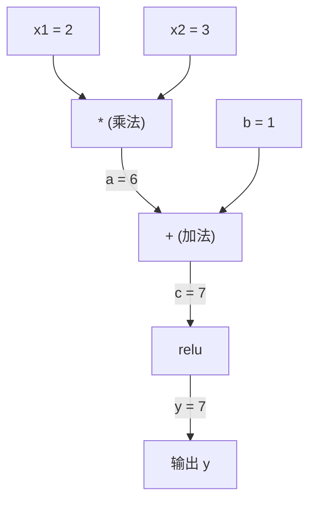
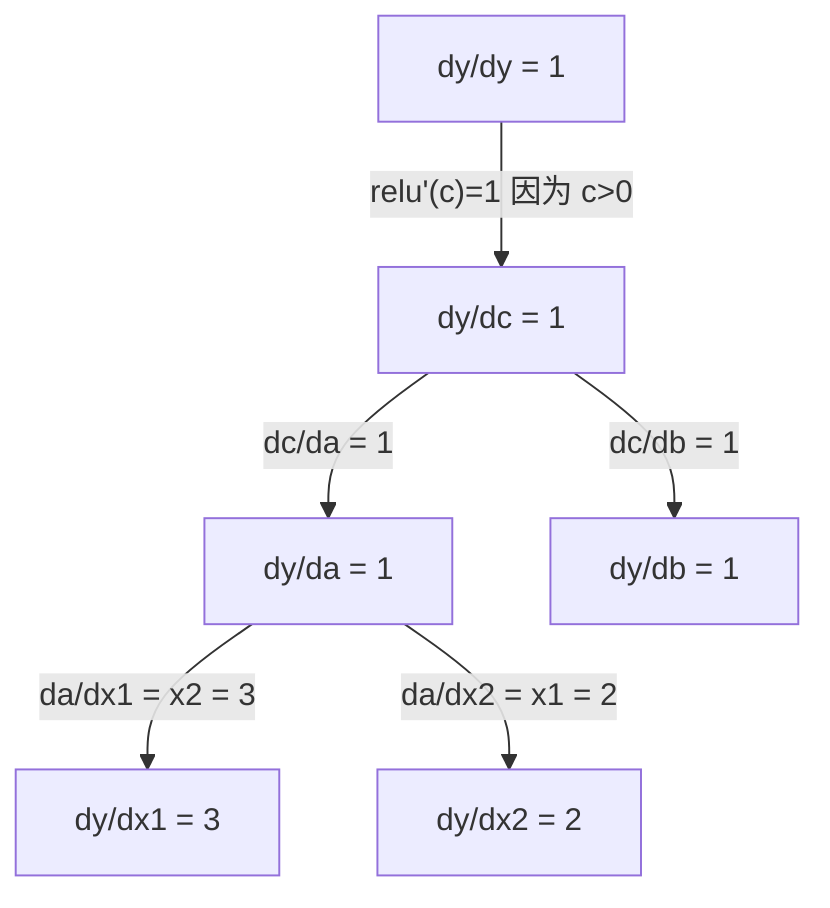

# 链式法则与自动微分

> 链式法则让每个学习的神经网络得以运转。

**类型:** 构建
**语言:** Python
**前置要求:** 第1阶段，第04课（导数与梯度）
**时间:** ~90分钟

## 学习目标

- 构建一个最小化的autograd引擎（Value类），记录操作并通过反向模式自动微分计算梯度
- 使用拓扑排序实现计算图中的前向和后向传播
- 仅使用从头开始的autograd引擎构建和训练一个多层感知器解决XOR问题
- 使用梯度检查对照数值有限差分验证自动微分的正确性

## 问题背景

你可以计算简单函数的导数。但神经网络不是简单函数。它是数百个函数的组合：矩阵乘法、加偏置、应用激活、再次矩阵乘法、softmax、交叉熵损失。输出是函数的函数的函数。

要训练网络，你需要损失关于每个权重的梯度。手工完成数百万个参数是不可能的。数值计算（有限差分）太慢了。

链式法则给你数学。自动微分给你算法。它们一起让你通过任意函数组合计算精确梯度，时间比例于单次前向传播。

这就是PyTorch、TensorFlow和JAX的工作原理。你将从头构建一个微型版本。

## 概念讲解

### 链式法则

如果`y = f(g(x))`，`y`关于`x`的导数是：

```
dy/dx = dy/dg * dg/dx = f'(g(x)) * g'(x)
```

沿链相乘导数。每个环节贡献其局部导数。

示例：`y = sin(x^2)`

```
g(x) = x^2       g'(x) = 2x
f(g) = sin(g)     f'(g) = cos(g)

dy/dx = cos(x^2) * 2x
```

对于更深的组合，链延伸：

```
y = f(g(h(x)))

dy/dx = f'(g(h(x))) * g'(h(x)) * h'(x)
```

神经网络中的每一层都是这条链中的一个环节。

### 计算图

计算图使链式法则可视化。每个操作成为一个节点。数据通过图向前流动。梯度向后流动。

**前向传播（计算值）：**



**反向传播（计算梯度）：**



反向传播在每个节点应用链式法则，将梯度从输出传播到输入。

### 前向模式与反向模式

通过图应用链式法则有两种方式。

**前向模式**从输入开始并向前推动导数。它计算`dx/dx = 1`并通过每个操作传播。当有少量输入和大量输出时很好。

```
前向模式：以dx/dx = 1为种子，向前传播

  x = 2       (dx/dx = 1)
  a = x^2     (da/dx = 2x = 4)
  y = sin(a)  (dy/dx = cos(a) * da/dx = cos(4) * 4 = -2.615)
```

**反向模式**从输出开始并将梯度向后拉。它计算`dy/dy = 1`并通过每个操作反向传播。当有大量输入和少量输出时很好。

```
反向模式：以dy/dy = 1为种子，向后传播

  y = sin(a)  (dy/dy = 1)
  a = x^2     (dy/da = cos(a) = cos(4) = -0.654)
  x = 2       (dy/dx = dy/da * da/dx = -0.654 * 4 = -2.615)
```

神经网络有数百万输入（权重）和一个输出（损失）。反向模式在一次后向传播中计算所有梯度。这就是反向传播使用反向模式的原因。

| 模式 | 种子 | 方向 | 最适合 |
|------|------|------|--------|
| 前向 | `dx_i/dx_i = 1` | 输入到输出 | 少量输入，大量输出 |
| 反向 | `dy/dy = 1` | 输出到输入 | 大量输入，少量输出（神经网络） |

### 前向模式的对偶数

前向模式可以用对偶数优雅实现。对偶数的形式是`a + b*epsilon`，其中`epsilon^2 = 0`。

```
对偶数：(值, 导数)

(2, 1) 表示：值是2，关于x的导数是1

算术规则：
  (a, a') + (b, b') = (a+b, a'+b')
  (a, a') * (b, b') = (a*b, a'*b + a*b')
  sin(a, a')         = (sin(a), cos(a)*a')
```

用导数1为输入变量播种。导数自动通过每个操作传播。

### 构建自动微分引擎

自动微分引擎需要三样东西：

1. **值包装。** 将每个数字包装在存储其值和梯度的对象中。
2. **图记录。** 每个操作记录其输入和局部梯度函数。
3. **反向传播。** 对图进行拓扑排序，然后反向遍历，在每个节点应用链式法则。

这正是PyTorch的`autograd`所做的。当你设置`requires_grad=True`时，`torch.Tensor`类包装值、记录操作，并在调用`.backward()`时计算梯度。

### PyTorch Autograd如何在底层工作

当你编写PyTorch代码时：

```python
x = torch.tensor(2.0, requires_grad=True)
y = x ** 2 + 3 * x + 1
y.backward()
print(x.grad)  # 7.0 = 2*x + 3 = 2*2 + 3
```

PyTorch内部：

1. 为`x`创建`Tensor`节点，设置`requires_grad=True`
2. 每个操作（`**`、`*`、`+`）创建一个新节点并记录后向函数
3. `y.backward()`触发通过记录图的反向模式自动微分
4. 每个节点的`grad_fn`计算局部梯度并将它们传递给父节点
5. 梯度通过加法（不是替换）累积在`.grad`属性中

图是动态的（define-by-run）。每次前向传播都构建一个新图。这就是PyTorch支持模型内控制流（if/else、循环）的原因。

## 动手实践

### 第1步：Value类

```python
class Value:
    def __init__(self, data, children=(), op=''):
        self.data = data
        self.grad = 0.0
        self._backward = lambda: None
        self._prev = set(children)
        self._op = op

    def __repr__(self):
        return f"Value(data={self.data:.4f}, grad={self.grad:.4f})"
```

每个`Value`存储其数值数据、梯度（初始为零）、后向函数和指向产生它的子节点的指针。

### 第2步：带梯度跟踪的算术运算

```python
    def __add__(self, other):
        other = other if isinstance(other, Value) else Value(other)
        out = Value(self.data + other.data, (self, other), '+')
        def _backward():
            self.grad += out.grad
            other.grad += out.grad
        out._backward = _backward
        return out

    def __mul__(self, other):
        other = other if isinstance(other, Value) else Value(other)
        out = Value(self.data * other.data, (self, other), '*')
        def _backward():
            self.grad += other.data * out.grad
            other.grad += self.data * out.grad
        out._backward = _backward
        return out

    def relu(self):
        out = Value(max(0, self.data), (self,), 'relu')
        def _backward():
            self.grad += (1.0 if out.data > 0 else 0.0) * out.grad
        out._backward = _backward
        return out
```

每个操作创建一个闭包，知道如何计算局部梯度并乘以上游梯度（`out.grad`）。`+=`处理一个值用于多个操作的情况。

### 第3步：反向传播

```python
    def backward(self):
        topo = []
        visited = set()
        def build_topo(v):
            if v not in visited:
                visited.add(v)
                for child in v._prev:
                    build_topo(child)
                topo.append(v)
        build_topo(self)

        self.grad = 1.0
        for v in reversed(topo):
            v._backward()
```

拓扑排序确保在将梯度传播到其子节点之前，每个节点的梯度都已完全计算。种子梯度是1.0（dy/dy = 1）。

### 第4步：完整引擎的更多运算

基本Value类处理加法、乘法和relu。真正的自动微分引擎需要更多。以下是构建神经网络所需的运算：

```python
    def __neg__(self):
        return self * -1

    def __sub__(self, other):
        return self + (-other)

    def __radd__(self, other):
        return self + other

    def __rmul__(self, other):
        return self * other

    def __rsub__(self, other):
        return other + (-self)

    def __pow__(self, n):
        out = Value(self.data ** n, (self,), f'**{n}')
        def _backward():
            self.grad += n * (self.data ** (n - 1)) * out.grad
        out._backward = _backward
        return out

    def __truediv__(self, other):
        return self * (other ** -1) if isinstance(other, Value) else self * (Value(other) ** -1)

    def exp(self):
        import math
        e = math.exp(self.data)
        out = Value(e, (self,), 'exp')
        def _backward():
            self.grad += e * out.grad
        out._backward = _backward
        return out

    def log(self):
        import math
        out = Value(math.log(self.data), (self,), 'log')
        def _backward():
            self.grad += (1.0 / self.data) * out.grad
        out._backward = _backward
        return out

    def tanh(self):
        import math
        t = math.tanh(self.data)
        out = Value(t, (self,), 'tanh')
        def _backward():
            self.grad += (1 - t ** 2) * out.grad
        out._backward = _backward
        return out
```

**为什么每个运算都重要：**

| 运算 | 反向规则 | 用于 |
|------|---------|------|
| `__sub__` | 复用add + neg | 损失计算（pred - target） |
| `__pow__` | n * x^(n-1) | 多项式激活、MSE（error^2） |
| `__truediv__` | 复用mul + pow(-1) | 归一化、学习率缩放 |
| `exp` | exp(x) * upstream | Softmax、对数似然 |
| `log` | (1/x) * upstream | 交叉熵损失、对数概率 |
| `tanh` | (1 - tanh^2) * upstream | 经典激活函数 |

巧妙之处：`__sub__`和`__truediv__`用现有运算定义。因为链式法则通过底层add/mul/pow运算组合，它们免费获得正确的梯度。

### 第5步：从头开始的微型MLP

有了完整的Value类，你可以构建神经网络。没有PyTorch。没有NumPy。只有Values和链式法则。

```python
import random

class Neuron:
    def __init__(self, n_inputs):
        self.w = [Value(random.uniform(-1, 1)) for _ in range(n_inputs)]
        self.b = Value(0.0)

    def __call__(self, x):
        act = sum((wi * xi for wi, xi in zip(self.w, x)), self.b)
        return act.tanh()

    def parameters(self):
        return self.w + [self.b]

class Layer:
    def __init__(self, n_inputs, n_outputs):
        self.neurons = [Neuron(n_inputs) for _ in range(n_outputs)]

    def __call__(self, x):
        return [n(x) for n in self.neurons]

    def parameters(self):
        return [p for n in self.neurons for p in n.parameters()]

class MLP:
    def __init__(self, sizes):
        self.layers = [Layer(sizes[i], sizes[i+1]) for i in range(len(sizes)-1)]

    def __call__(self, x):
        for layer in self.layers:
            x = layer(x)
        return x[0] if len(x) == 1 else x

    def parameters(self):
        return [p for layer in self.layers for p in layer.parameters()]
```

`Neuron`计算`tanh(w1*x1 + w2*x2 + ... + b)`。`Layer`是神经元列表。`MLP`堆叠层。每个权重都是`Value`，所以调用`loss.backward()`将梯度传播到每个参数。

**在XOR上训练：**

```python
random.seed(42)
model = MLP([2, 4, 1])  # 2输入，4隐藏神经元，1输出

xs = [[0, 0], [0, 1], [1, 0], [1, 1]]
ys = [-1, 1, 1, -1]  # XOR模式（使用-1/1用于tanh）

for step in range(100):
    preds = [model(x) for x in xs]
    loss = sum((p - y) ** 2 for p, y in zip(preds, ys))

    for p in model.parameters():
        p.grad = 0.0
    loss.backward()

    lr = 0.05
    for p in model.parameters():
        p.data -= lr * p.grad

    if step % 20 == 0:
        print(f"步数 {step:3d}  损失 = {loss.data:.4f}")

print("\n训练后的预测：")
for x, y in zip(xs, ys):
    print(f"  输入={x}  目标={y:2d}  预测={model(x).data:6.3f}")
```

这就是micrograd。纯Python中完整的神经网络训练循环，带有自动微分。每个商业深度学习框架都在大规模上做同样的事情。

### 第6步：梯度检查

你怎么知道你的自动微分是否正确？与数值导数比较。这就是梯度检查。

```python
def gradient_check(build_expr, x_val, h=1e-7):
    x = Value(x_val)
    y = build_expr(x)
    y.backward()
    autodiff_grad = x.grad

    y_plus = build_expr(Value(x_val + h)).data
    y_minus = build_expr(Value(x_val - h)).data
    numerical_grad = (y_plus - y_minus) / (2 * h)

    diff = abs(autodiff_grad - numerical_grad)
    return autodiff_grad, numerical_grad, diff
```

在复杂表达式上测试它：

```python
def expr(x):
    return (x ** 3 + x * 2 + 1).tanh()

ad, num, diff = gradient_check(expr, 0.5)
print(f"自动微分:  {ad:.8f}")
print(f"数值: {num:.8f}")
print(f"差异: {diff:.2e}")
# 差异应 < 1e-5
```

梯度检查在实现新运算时必不可少。如果你的后向传播有bug，数值检查会捕获它。每个严肃深度学习实现在开发过程中都运行梯度检查。

**何时使用梯度检查：**

| 情况 | 做梯度检查？ |
|------|------------|
| 向你的自动微分添加新运算 | 是，总是 |
| 调试不收敛的训练循环 | 是，先检查梯度 |
| 生产训练 | 否，太慢（每个参数2次前向传播） |
| 自动微分代码的单元测试 | 是，自动化它 |

### 第7步：与手工计算验证

```python
x1 = Value(2.0)
x2 = Value(3.0)
a = x1 * x2          # a = 6.0
b = a + Value(1.0)    # b = 7.0
y = b.relu()          # y = 7.0

y.backward()

print(f"y = {y.data}")          # 7.0
print(f"dy/dx1 = {x1.grad}")   # 3.0 (= x2)
print(f"dy/dx2 = {x2.grad}")   # 2.0 (= x1)
```

手工检查：`y = relu(x1*x2 + 1)`。因为`x1*x2 + 1 = 7 > 0`，relu是恒等函数。
`dy/dx1 = x2 = 3`。`dy/dx2 = x1 = 2`。引擎匹配。

## 实际应用

### 与PyTorch验证

```python
import torch

x1 = torch.tensor(2.0, requires_grad=True)
x2 = torch.tensor(3.0, requires_grad=True)
a = x1 * x2
b = a + 1.0
y = torch.relu(b)
y.backward()

print(f"PyTorch dy/dx1 = {x1.grad.item()}")  # 3.0
print(f"PyTorch dy/dx2 = {x2.grad.item()}")  # 2.0
```

相同的梯度。你的引擎计算与PyTorch相同的结果，因为数学相同：通过链式法则的反向模式自动微分。

### 更复杂的表达式

```python
a = Value(2.0)
b = Value(-3.0)
c = Value(10.0)
f = (a * b + c).relu()  # relu(2*(-3) + 10) = relu(4) = 4

f.backward()
print(f"df/da = {a.grad}")  # -3.0 (= b)
print(f"df/db = {b.grad}")  #  2.0 (= a)
print(f"df/dc = {c.grad}")  #  1.0
```

## 产出成果

这节课产出：
- `outputs/skill-autodiff.md` -- 构建和调试自动微分系统的技能
- `code/autodiff.py` -- 你可以扩展的最小自动微分引擎

这里构建的Value类是第3阶段神经网络训练循环的基础。

## 练习题

1. 向Value类添加`__pow__`以便你可以计算`x ** n`。验证在`x=2`处`d/dx(x^3)`等于`12.0`。

2. 添加`tanh`作为激活函数。验证`tanh'(0) = 1`和`tanh'(2) = 0.0707`（近似）。

3. 为单个神经元构建计算图：`y = relu(w1*x1 + w2*x2 + b)`。计算所有五个梯度并与PyTorch验证。

4. 使用对偶数实现前向模式自动微分。创建`Dual`类并验证它给出与你的反向模式引擎相同的导数。

## 关键术语

| 术语 | 人们怎么说 | 实际含义 |
|------|----------|----------|
| 链式法则 | "相乘导数" | 复合函数的导数等于每个函数的局部导数的乘积，在正确的点求值 |
| 计算图 | "网络图" | 有向无环图，其中节点是运算，边携带值（前向）或梯度（后向） |
| 前向模式 | "向前推动导数" | 从输入到输出传播导数的自动微分。每个输入变量一次遍历。 |
| 反向模式 | "反向传播" | 从输出到输入传播梯度的自动微分。每个输出变量一次遍历。 |
| 自动微分 | "自动梯度" | 记录值上的运算、构建图并通过链式法则计算精确梯度的系统 |
| 对偶数 | "值加导数" | 形式为a + b*epsilon（epsilon^2 = 0）的数，通过算术携带导数信息 |
| 拓扑排序 | "依赖顺序" | 对图节点排序，使每个节点都在其所有依赖之后。正确梯度传播所需。 |
| 梯度累积 | "相加，不替换" | 当一个值馈入多个运算时，其梯度是所有传入梯度贡献的总和 |
| 动态图 | "运行时定义" | 每次前向传播重建的计算图，允许Python控制流在模型内（PyTorch风格） |
| 梯度检查 | "数值验证" | 将自动微分梯度与数值有限差分梯度比较以验证正确性。调试必不可少。 |
| MLP | "多层感知器" | 具有一个或多个隐藏神经元层的神经网络。每个神经元计算加权和加偏置，然后应用激活函数。 |
| 神经元 | "加权和 + 激活" | 基本单元：输出 = 激活(w1*x1 + w2*x2 + ... + b)。权重和偏置是可学习参数。 |

## 延伸阅读

- [3Blue1Brown: 反向传播微积分](https://www.youtube.com/watch?v=tIeHLnjs5U8) -- 神经网络中链式法则的视觉解释
- [PyTorch Autograd机制](https://pytorch.org/docs/stable/notes/autograd.html) -- 真实系统如何工作
- [Baydin等，机器学习中的自动微分：综述](https://arxiv.org/abs/1502.05767) -- 综合参考
