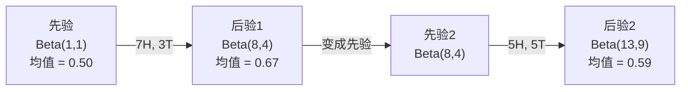

# 贝叶斯定理

> 概率关乎你期望什么。贝叶斯定理关乎你学到了什么。

**类型:** 构建
**语言:** Python
**前置要求:** 第1阶段, 课程06 (概率基础)
**时间:** ~75分钟

## 学习目标

- 应用贝叶斯定理从先验、似然和证据计算后验概率
- 从零构建带Laplace平滑和对数空间计算的朴素贝叶斯文本分类器
- 比较MLE和MAP估计，解释MAP如何对应L2正则化
- 使用Beta-Binomial共轭先验实现序列贝叶斯更新用于A/B测试

## 问题背景

一个医学检测99%准确。你检测呈阳性。你真正患病的几率是多少?

大多数人说是99%。真正的答案取决于疾病有多罕见。如果万分之一的人患病，阳性结果只给你约1%的机会真正患病。其他99%的阳性结果来自健康人的误报。

这不是脑筋急转弯。这是贝叶斯定理。每个垃圾邮件过滤器、每个医学诊断、每个量化不确定性的机器学习模型都使用这种推理。你从一个信念开始。你看到证据。你更新。

如果你不理解这一点就构建ML系统，你会误解模型输出，设置错误的阈值，并发布过度自信的预测。

## 概念讲解

### 从联合概率到贝叶斯

你已经在课程06知道条件概率是:

```
P(A|B) = P(A且B) / P(B)
```

对称地:

```
P(B|A) = P(A且B) / P(A)
```

两个表达式共享相同的分子: P(A且B)。令它们相等并重新排列:

```
P(A且B) = P(A|B) * P(B) = P(B|A) * P(A)

因此:

P(A|B) = P(B|A) * P(A) / P(B)
```

这就是贝叶斯定理。四个量，一个方程。

### 四个部分

| 部分 | 名称 | 含义 |
|------|------|-------|
| P(A\|B) | 后验 | 看到证据B后对A的更新信念 |
| P(B\|A) | 似然 | 如果A为真，证据B有多可能 |
| P(A) | 先验 | 看到任何证据前对A的信念 |
| P(B) | 证据 | 所有可能性下看到B的总概率 |

证据项P(B)作为归一化因子。你可以用全概率公式展开它:

```
P(B) = P(B|A) * P(A) + P(B|非A) * P(非A)
```

### 医学检测例子

一种疾病影响万分之一的人。检测99%准确（捕捉99%的患者，1%的时间误报）。

```
P(患病)          = 0.0001     (先验: 疾病罕见)
P(阳性|患病) = 0.99       (似然: 检测能捕捉到)
P(阳性|健康) = 0.01    (误报率)

P(阳性) = P(阳性|患病) * P(患病) + P(阳性|健康) * P(健康)
            = 0.99 * 0.0001 + 0.01 * 0.9999
            = 0.000099 + 0.009999
            = 0.010098

P(患病|阳性) = P(阳性|患病) * P(患病) / P(阳性)
                 = 0.99 * 0.0001 / 0.010098
                 = 0.0098
                 = 0.98%
```

不到1%。先验主导。当一种状况罕见时，即使准确的检测也主要产生误报。这就是医生要求确认检测的原因。

### 垃圾邮件过滤器例子

你收到包含"lottery"这个词的邮件。它是垃圾邮件吗?

```
P(垃圾邮件)                = 0.3      (30%邮件是垃圾邮件)
P("lottery"|垃圾邮件)      = 0.05     (5%垃圾邮件含"lottery")
P("lottery"|非垃圾邮件)  = 0.001    (0.1%正常邮件含"lottery")

P("lottery") = 0.05 * 0.3 + 0.001 * 0.7
             = 0.015 + 0.0007
             = 0.0157

P(垃圾邮件|"lottery") = 0.05 * 0.3 / 0.0157
                  = 0.955
                  = 95.5%
```

一个词将概率从30%转移到95.5%。真正的垃圾邮件过滤器同时跨数百个词应用贝叶斯。

### 朴素贝叶斯: 独立性假设

朴素贝叶斯通过假设给定类别时所有特征条件独立来扩展到多个特征:

```
P(类别 | 特征_1, 特征_2, ..., 特征_n)
  = P(类别) * P(特征_1|类别) * P(特征_2|类别) * ... * P(特征_n|类别)
    / P(特征_1, 特征_2, ..., 特征_n)
```

"朴素"的部分是独立性假设。在文本中，词的出现并非独立（"New"和"York"相关）。但该假设在实践中惊人地有效，因为分类器只需要排序类别，而非产生校准的概率。

由于分母对所有类别相同，你可以跳过它只比较分子:

```
分数(类别) = P(类别) * P(特征_i | 类别)之积
```

选择分数最高的类别。

### 最大似然估计(MLE)

如何从训练数据得到P(特征|类别)? 计数。

```
P("free"|垃圾邮件) = (含"free"的垃圾邮件数) / (垃圾邮件总数)
```

这是MLE: 选择使观测数据最可能的参数值。你在最大化似然函数，对于离散计数它简化为相对频率。

问题: 如果一个词在训练时的垃圾邮件中从未出现，MLE给它零概率。一个未见过的词杀死整个乘积。用Laplace平滑修复:

```
P(词|类别) = (计数(词, 类别) + 1) / (类别中总词数 + 词汇表大小)
```

给每个计数加1确保没有概率会是零。

### 最大后验概率(MAP)

MLE问: 什么参数最大化P(数据|参数)?

MAP问: 什么参数最大化P(参数|数据)?

由贝叶斯定理:

```
P(参数|数据) 正比于 P(数据|参数) * P(参数)
```

MAP给参数本身加上先验。如果你相信参数应该小，你将其编码为惩罚大值的先验。这等同于ML中的L2正则化。岭回归中的"ridge"惩罚字面上就是权重的Gaussian先验。

| 估计方法 | 优化目标 | ML对应 |
|------------|-----------|---------------|
| MLE | P(数据\|参数) | 无正则化训练 |
| MAP | P(数据\|参数) * P(参数) | L2 / L1正则化 |

### 贝叶斯vs频率学派: 实际区别

频率学派把参数当作固定的未知量。他们问: "如果我多次重复这个实验，会发生什么?"

贝叶斯学派把参数当作分布。他们问: "给定我观测到的，我对参数有什么信念?"

对于构建ML系统，实际区别:

| 方面 | 频率学派 | 贝叶斯 |
|--------|-------------|----------|
| 输出 | 点估计 | 值的分布 |
| 不确定性 | 置信区间(关于过程) | 可信区间(关于参数) |
| 小数据 | 可能过拟合 | 先验充当正则化 |
| 计算 | 通常更快 | 通常需要采样(MCMC) |

大多数生产ML是频率学派(SGD，点估计)。贝叶斯方法在需要校准的不确定性（医学决策、安全关键系统）或数据稀缺（少样本学习、冷启动）时发光。

### 为什么贝叶斯思维对ML重要

联系比类比更深:

**先验是正则化。** 权重上的Gaussian先验是L2正则化。Laplace先验是L1。每次你添加正则化项，你在做一个关于你期望什么参数值的贝叶斯声明。

**后验是不确定性。** 单个预测概率告诉你模型对该估计有多自信。贝叶斯方法给你分布: "我认为P(垃圾邮件)在0.8和0.95之间。"

**贝叶斯更新是在线学习。** 今天的后验变成明天的先验。当你的模型看到新数据，它增量更新信念而非从头重训练。

**模型比较是贝叶斯的。** 贝叶斯信息准则(BIC)、边际似然和贝叶斯因子都使用贝叶斯推理在不过拟合的情况下选择模型。

## 动手实践

### 步骤1: 贝叶斯定理函数

```python
def bayes(prior, likelihood, false_positive_rate):
    evidence = likelihood * prior + false_positive_rate * (1 - prior)
    posterior = likelihood * prior / evidence
    return posterior

result = bayes(prior=0.0001, likelihood=0.99, false_positive_rate=0.01)
print(f"P(患病|阳性) = {result:.4f}")
```

### 步骤2: 朴素贝叶斯分类器

```python
import math
from collections import defaultdict

class NaiveBayes:
    def __init__(self, smoothing=1.0):
        self.smoothing = smoothing
        self.class_counts = defaultdict(int)
        self.word_counts = defaultdict(lambda: defaultdict(int))
        self.class_word_totals = defaultdict(int)
        self.vocab = set()

    def train(self, documents, labels):
        for doc, label in zip(documents, labels):
            self.class_counts[label] += 1
            words = doc.lower().split()
            for word in words:
                self.word_counts[label][word] += 1
                self.class_word_totals[label] += 1
                self.vocab.add(word)

    def predict(self, document):
        words = document.lower().split()
        total_docs = sum(self.class_counts.values())
        vocab_size = len(self.vocab)
        best_class = None
        best_score = float("-inf")
        for cls in self.class_counts:
            score = math.log(self.class_counts[cls] / total_docs)
            for word in words:
                count = self.word_counts[cls].get(word, 0)
                total = self.class_word_totals[cls]
                score += math.log((count + self.smoothing) / (total + self.smoothing * vocab_size))
            if score > best_score:
                best_score = score
                best_class = cls
        return best_class
```

对数概率防止下溢。许多小概率相乘产生浮点数无法表示的微小数值。对数概率求和数值稳定且数学等价。

### 步骤3: 在垃圾邮件数据上训练

```python
train_docs = [
    "win free money now",
    "free lottery ticket winner",
    "claim your prize today free",
    "urgent offer free cash",
    "congratulations you won free",
    "meeting tomorrow at noon",
    "project update attached",
    "can we schedule a call",
    "quarterly report review",
    "lunch on thursday sounds good",
    "team standup notes attached",
    "please review the pull request",
]

train_labels = [
    "spam", "spam", "spam", "spam", "spam",
    "ham", "ham", "ham", "ham", "ham", "ham", "ham",
]

classifier = NaiveBayes()
classifier.train(train_docs, train_labels)

test_messages = [
    "free money waiting for you",
    "meeting rescheduled to friday",
    "you won a free prize",
    "please review the attached report",
]

for msg in test_messages:
    print(f"  '{msg}' -> {classifier.predict(msg)}")
```

### 步骤4: 检查学习到的概率

```python
def show_top_words(classifier, cls, n=5):
    vocab_size = len(classifier.vocab)
    total = classifier.class_word_totals[cls]
    probs = {}
    for word in classifier.vocab:
        count = classifier.word_counts[cls].get(word, 0)
        probs[word] = (count + classifier.smoothing) / (total + classifier.smoothing * vocab_size)
    sorted_words = sorted(probs.items(), key=lambda x: x[1], reverse=True)
    for word, prob in sorted_words[:n]:
        print(f"    {word}: {prob:.4f}")

print("\n垃圾邮件高频词:")
show_top_words(classifier, "spam")
print("\n正常邮件高频词:")
show_top_words(classifier, "ham")
```

## 实际应用

Scikit-learn提供生产就绪的朴素贝叶斯实现:

```python
from sklearn.feature_extraction.text import CountVectorizer
from sklearn.naive_bayes import MultinomialNB
from sklearn.metrics import classification_report

vectorizer = CountVectorizer()
X_train = vectorizer.fit_transform(train_docs)
clf = MultinomialNB()
clf.fit(X_train, train_labels)

X_test = vectorizer.transform(test_messages)
predictions = clf.predict(X_test)
for msg, pred in zip(test_messages, predictions):
    print(f"  '{msg}' -> {pred}")
```

相同算法。CountVectorizer处理分词和词汇构建。MultinomialNB内部处理平滑和对数概率。你从零的版本在40行中做同样的事。

## 产出成果

这里构建的NaiveBayes类演示完整流程: 分词、带Laplace平滑的概率估计、对数空间预测。`code/bayes.py`中的代码无需Python标准库之外的依赖即可端到端运行。

### 共轭先验

当先验和后验属于同一家族的分布时，先验称为"共轭"。这使贝叶斯更新代数上简洁——你得到闭式后验而无需数值积分。

| 似然 | 共轭先验 | 后验 | 例子 |
|-----------|----------------|-----------|---------|
| Bernoulli | Beta(a, b) | Beta(a + 成功, b + 失败) | 抛硬币偏差估计 |
| Normal (已知方差) | Normal(mu_0, sigma_0) | Normal(加权平均, 更小方差) | 传感器校准 |
| Poisson | Gamma(a, b) | Gamma(a + 计数之和, b + n) | 建模到达率 |
| Multinomial | Dirichlet(alpha) | Dirichlet(alpha + 计数) | 主题建模, 语言模型 |

为什么这重要: 没有共轭先验，你需要Monte Carlo采样或变分推断来近似后验。有共轭先验，你只需更新两个数字。

Beta分布是实践中最常见的共轭先验。Beta(a, b)表示你对概率参数的信念。均值是a/(a+b)。a+b越大，分布越集中（越自信）。

Beta先验的特殊情况:
- Beta(1, 1) = 均匀。你对参数没有看法。
- Beta(10, 10) = 在0.5处峰值。你强烈相信参数接近0.5。
- Beta(1, 10) = 向0倾斜。你相信参数很小。

更新规则非常简单:

```
先验:     Beta(a, b)
数据:      s次成功, f次失败
后验: Beta(a + s, b + f)
```

无需积分。无需采样。只需加法。

### 序列贝叶斯更新

贝叶斯推断天然是序列的。今天的后验变成明天的先验。这是真实系统如何在不重新处理所有历史数据的情况下增量学习。

具体例子: 估计硬币是否公平。

**第1天: 尚无数据。**
从Beta(1, 1)开始——均匀先验。你没有任何看法。
- 先验均值: 0.5
- 先验在[0, 1]上平坦

**第2天: 观测到7次正面, 3次反面。**
后验 = Beta(1 + 7, 1 + 3) = Beta(8, 4)
- 后验均值: 8/12 = 0.667
- 证据表明硬币偏向正面

**第3天: 观测到5次更多正面, 5次更多反面。**
用昨天的后验作为今天的先验。
后验 = Beta(8 + 5, 4 + 5) = Beta(13, 9)
- 后验均值: 13/22 = 0.591
- 平衡的新数据把估计拉回0.5



观测顺序不重要。Beta(1,1)一次性用所有12次正面和8次反面更新给出Beta(13, 9)——相同结果。序列更新和批量更新数学上等价。但序列更新让你能在每步做出决策而无需存储原始数据。

这是生产ML系统在线学习的基础。Thompson采样用于bandits、增量推荐系统和流式异常检测器都使用这个模式。

### 与A/B测试的联系

A/B测试是披着伪装的贝叶斯推断。

设置: 你测试两种按钮颜色。变体A（蓝色）和变体B（绿色）。你想知道哪个获得更多点击。

贝叶斯A/B测试:

1. **先验。** 两个变体都从Beta(1, 1)开始。无先验偏好。
2. **数据。** 变体A: 1000次浏览中50次点击。变体B: 1000次浏览中65次点击。
3. **后验。**
   - A: Beta(1 + 50, 1 + 950) = Beta(51, 951)。均值 = 0.051
   - B: Beta(1 + 65, 1 + 935) = Beta(66, 936)。均值 = 0.066
4. **决策。** 计算P(B > A)——B的真实转化率高于A的概率。

解析计算P(B > A)很难。但Monte Carlo让它变得简单:

```
1. 从Beta(51, 951)抽取100,000个样本  -> samples_A
2. 从Beta(66, 936)抽取100,000个样本  -> samples_B
3. P(B > A) = B > A的样本比例
```

如果P(B > A) > 0.95，你发布变体B。如果在0.05和0.95之间，你继续收集数据。如果P(B > A) < 0.05，你发布变体A。

相比频率学派A/B测试的优势:
- 你得到直接的概率陈述: "有97%的可能性B更好"
- 无p值困惑。无"未能拒绝零假设"的迂回。
- 你可以随时检查结果而不会增加误报率（无"窥视问题")
- 你可以融入先验知识（例如，之前的测试表明转化率通常在3-8%）

| 方面 | 频率学派A/B | 贝叶斯A/B |
|--------|----------------|--------------|
| 输出 | p值 | P(B > A) |
| 解释 | "如果A=B这数据有多意外?" | "B比A更可能有多高?" |
| 早期停止 | 增加误报 | 任何时候安全(给定良好先验和正确模型) |
| 先验知识 | 不使用 | 编码为Beta先验 |
| 决策规则 | p < 0.05 | P(B > A) > 阈值 |

## 练习题

1. **多次检测。** 一个患者在两次独立检测上都呈阳性（都99%准确，疾病患病率万分之一）。两次检测后P(患病)是多少? 用第一次检测的后验作为第二次的先验。

2. **平滑影响。** 用平滑值0.01、0.1、1.0和10.0运行垃圾邮件分类器。高频词概率如何变化? 平滑=0且一个词只出现在正常邮件中会发生什么?

3. **添加特征。** 扩展NaiveBayes类，除词计数外也使用消息长度（短/长）作为特征。从训练数据估计P(短|垃圾邮件)和P(短|正常)并将其纳入预测分数。

4. **手动MAP。** 给定观测数据（10次抛硬币7次正面），使用Beta(2,2)先验计算偏差的MAP估计。与MLE估计(7/10)比较。

## 关键术语

| 术语 | 人们怎么说 | 实际含义 |
|------|-----------|----------|
| 先验 | "我的初始猜测" | 观测证据前的P(假设)。在ML中: 正则化项。 |
| 似然 | "数据拟合得如何" | P(证据\|假设)。在特定假设下观测数据的概率。 |
| 后验 | "我的更新信念" | P(假设\|证据)。先验乘以似然，然后归一化。 |
| 证据 | "归一化常数" | 所有假设的P(数据)。确保后验总和为1。 |
| 朴素贝叶斯 | "那个简单文本分类器" | 假设给定类别时特征独立的分类器。尽管假设错误仍工作良好。 |
| Laplace平滑 | "加一平滑" | 给每个特征加小计数以防止未见数据的零概率。 |
| MLE | "就用频率" | 选择最大化P(数据\|参数)的参数。无先验。小数据可能过拟合。 |
| MAP | "带先验的MLE" | 选择最大化P(数据\|参数) * P(参数)的参数。等价于正则化MLE。 |
| 对数概率 | "在log空间工作" | 用log(P)代替P以避免乘许多小数时的浮点下溢。 |
| 误报 | "错误警报" | 检测说阳性，但真实状态是阴性。驱动基础率谬误。 |

## 延伸阅读

- [3Blue1Brown: Bayes' theorem](https://www.youtube.com/watch?v=HZGCoVF3YvM) - 用医学检测例子的可视化解释
- [Stanford CS229: Generative Learning Algorithms](https://cs229.stanford.edu/notes2022fall/cs229-notes2.pdf) - 朴素贝叶斯及其与判别模型的联系
- [Think Bayes](https://greenteapress.com/wp/think-bayes/) - 免费书籍，带Python代码的贝叶斯统计
- [scikit-learn Naive Bayes](https://scikit-learn.org/stable/modules/naive_bayes.html) - 生产实现及何时使用各变体