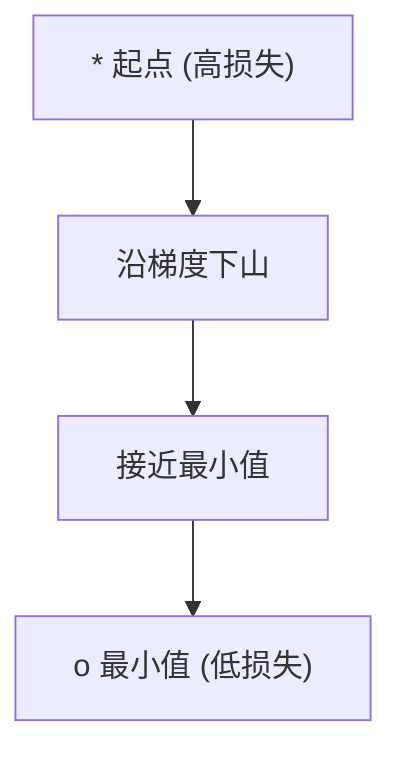
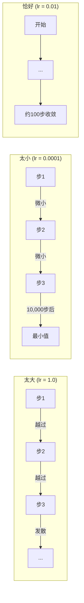
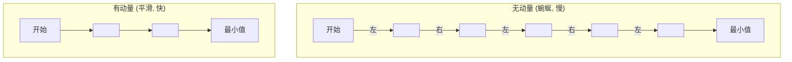
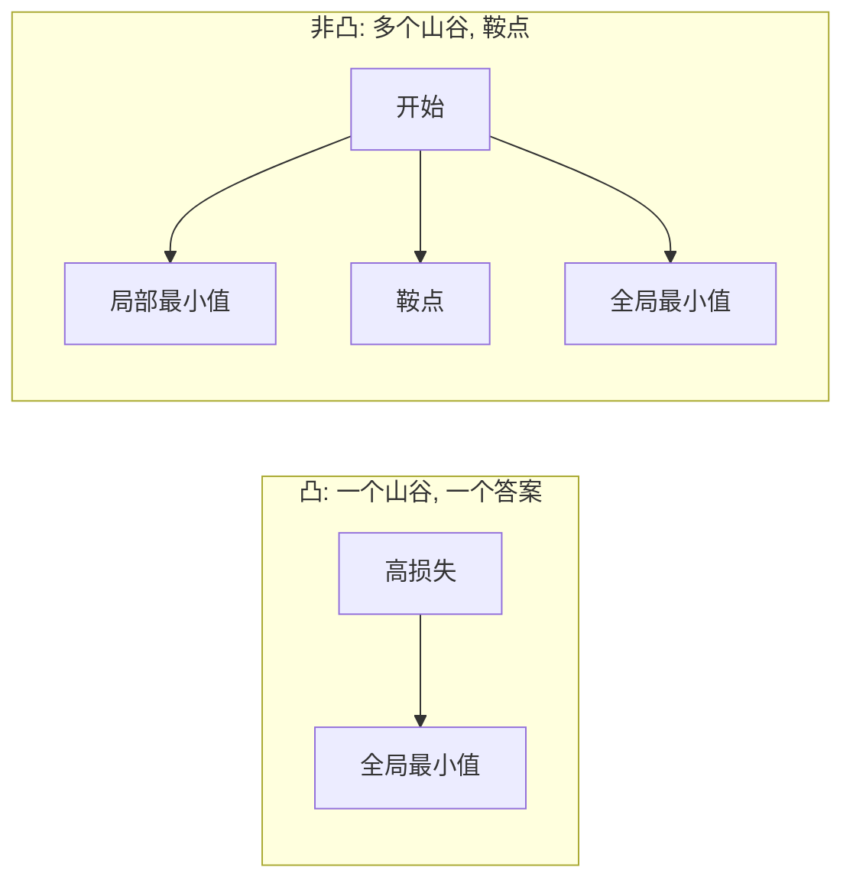
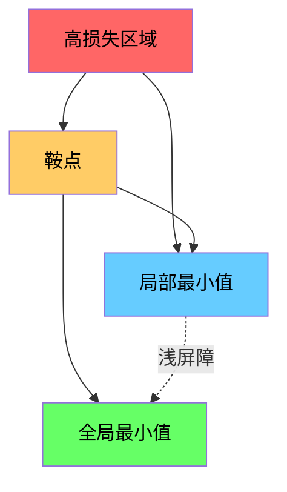

# 优化

> 训练神经网络不过是寻找山谷底部。

**类型:** 构建
**语言:** Python
**前置要求:** 第1阶段, 课程04-05 (导数, 梯度)
**时间:** ~75分钟

## 学习目标

- 从零实现原始梯度下降、带动量的SGD和Adam
- 在Rosenbrock函数上比较优化器收敛，解释为什么Adam为每个权重适配学习率
- 区分凸与非凸损失景观，解释高维情况下鞍点的作用
- 配置学习率调度（步衰减、余弦退火、预热）以实现训练稳定性

## 问题背景

你有一个损失函数。它告诉你模型有多错。你有梯度。它们告诉你哪个方向使损失更糟。现在你需要一个策略向山下走。

朴素方法很简单: 沿梯度相反方向移动。用某个称为学习率的数字缩放步长。重复。这就是梯度下降，它有效。但"有效"有附加条件。学习率太大你会完全越过山谷，在壁间跳跃。太小你会爬行数千不必要的步才能到达答案。碰到鞍点你会停止移动即使没有找到最小值。

深度学习中的每个优化器都是对同一个问题的回答: 如何更快更可靠地到达山谷底部?

## 概念讲解

### 什么是优化

优化是找到使函数最小化（或最大化）的输入值。在机器学习中，函数是损失。输入是模型权重。训练就是优化。

```
最小化 L(w) 其中:
  L = 损失函数
  w = 模型权重 (可能有百万参数)
```

### 梯度下降(原始)

最简单的优化器。计算损失对每个权重的梯度。沿梯度相反方向移动每个权重。用学习率缩放步长。

```
w = w - lr * 梯度
```

这就是整个算法。一行。



### 学习率: 最重要的超参数

学习率控制步长。它决定关于收敛的一切。



没有公式给出正确学习率。你通过实验找到。常见起点: Adam用0.001，带动量的SGD用0.01。

### SGD vs 批量 vs 小批量

原始梯度下降在整个数据集上计算梯度后才走一步。这叫批量梯度下降。稳定但慢。

随机梯度下降(SGD)在单个随机样本上计算梯度后立即走一步。噪声大但快。

小批量梯度下降折中。在小批量（32、64、128、256样本）上计算梯度后走一步。这是每个人实际使用的。

| 变体 | 批量大小 | 梯度质量 | 每步速度 | 噪声 |
|---------|-----------|-----------------|---------------|-------|
| 批量GD | 整个数据集 | 精确 | 慢 | 无 |
| SGD | 1个样本 | 非常噪声 | 快 | 高 |
| 小批量 | 32-256 | 良好估计 | 平衡 | 中等 |

SGD和小批量中的噪声不是缺陷。它帮助逃离浅的局部最小值和鞍点。

### 动量: 滚下山谷的球

原始梯度下降只看当前梯度。如果梯度蜿蜒曲折（窄山谷中常见），进展缓慢。动量通过将过去梯度累积到速度项来修复。

```
v = beta * v + 梯度
w = w - lr * v
```

类比: 一个球滚下山。它不在每个凸起处停止重启。它在一致方向上积累速度并抑制振荡。



`beta`（通常0.9）控制保留多少历史。更高beta意味着更多动量、更平滑路径，但对方向变化响应更慢。

### Adam: 自适应学习率

不同权重需要不同学习率。很少获得大梯度的权重当最终获得时应走更大步。不断获得大梯度的权重应走更小步。

Adam（自适应矩估计）为每个权重追踪两个东西:

1. 一阶矩(m): 梯度的运行平均（类似动量）
2. 二阶矩(v): 梯度平方的运行平均（梯度幅度）

```
m = beta1 * m + (1 - beta1) * 梯度
v = beta2 * v + (1 - beta2) * 梯度^2

m_hat = m / (1 - beta1^t)    偏差修正
v_hat = v / (1 - beta2^t)    偏差修正

w = w - lr * m_hat / (sqrt(v_hat) + epsilon)
```

除以`sqrt(v_hat)`是关键洞见。大梯度权重被大数除（有效步长小）。小梯度权重被小数除（有效步长大）。每个权重获得自己的自适应学习率。

默认超参数: `lr=0.001, beta1=0.9, beta2=0.999, epsilon=1e-8`。这些默认值对大多数问题工作良好。

### 学习率调度

固定学习率是妥协。训练早期，你想要大步快速进展。训练后期，你想要小步在最小值附近精细调整。

常见调度:

| 调度 | 公式 | 使用场景 |
|----------|---------|----------|
| 步衰减 | lr = lr * 因子 每 N轮 | 简单, 手动控制 |
| 指数衰减 | lr = lr_0 * decay^t | 平滑减少 |
| 余弦退火 | lr = lr_min + 0.5 * (lr_max - lr_min) * (1 + cos(pi * t / T)) | Transformer, 现代训练 |
| 预热+衰减 | 线性上升, 然后衰减 | 大模型, 防止早期不稳定 |

### 凸与非凸

凸函数有一个最小值。梯度下降总能找到。像`f(x) = x^2`的二次函数是凸的。

神经网络损失函数是非凸的。它们有许多局部最小值、鞍点和平坦区域。



实践中，高维神经网络的局部最小值很少是问题。大多数局部最小值的损失值接近全局最小值。鞍点（某些方向平坦，其他方向弯曲）才是真正的障碍。动量和小批量的噪声帮助逃离它们。

### 损失景观可视化

损失是所有权重的函数。对于有100万权重的模型，损失景观存在于1,000,001维空间。我们通过在权重空间中选两个随机方向并沿那些方向绘制损失来可视化，产生2D表面。



尖锐最小值泛化差。平坦最小值泛化好。这是SGD带动量通常在最终测试精度上优于Adam的一个原因: 其噪声防止陷入尖锐最小值。

## 动手实践

### 步骤1: 定义测试函数

Rosenbrock函数是经典优化基准。其最小值在(1, 1)，位于一个狭窄弯曲的山谷内，容易找到但难以跟随。

```
f(x, y) = (1 - x)^2 + 100 * (y - x^2)^2
```

```python
def rosenbrock(params):
    x, y = params
    return (1 - x) ** 2 + 100 * (y - x ** 2) ** 2

def rosenbrock_gradient(params):
    x, y = params
    df_dx = -2 * (1 - x) + 200 * (y - x ** 2) * (-2 * x)
    df_dy = 200 * (y - x ** 2)
    return [df_dx, df_dy]
```

### 步骤2: 原始梯度下降

```python
class GradientDescent:
    def __init__(self, lr=0.001):
        self.lr = lr

    def step(self, params, grads):
        return [p - self.lr * g for p, g in zip(params, grads)]
```

### 步骤3: 带动量的SGD

```python
class SGDMomentum:
    def __init__(self, lr=0.001, momentum=0.9):
        self.lr = lr
        self.momentum = momentum
        self.velocity = None

    def step(self, params, grads):
        if self.velocity is None:
            self.velocity = [0.0] * len(params)
        self.velocity = [
            self.momentum * v + g
            for v, g in zip(self.velocity, grads)
        ]
        return [p - self.lr * v for p, v in zip(params, self.velocity)]
```

### 步骤4: Adam

```python
class Adam:
    def __init__(self, lr=0.001, beta1=0.9, beta2=0.999, epsilon=1e-8):
        self.lr = lr
        self.beta1 = beta1
        self.beta2 = beta2
        self.epsilon = epsilon
        self.m = None
        self.v = None
        self.t = 0

    def step(self, params, grads):
        if self.m is None:
            self.m = [0.0] * len(params)
            self.v = [0.0] * len(params)

        self.t += 1

        self.m = [
            self.beta1 * m + (1 - self.beta1) * g
            for m, g in zip(self.m, grads)
        ]
        self.v = [
            self.beta2 * v + (1 - self.beta2) * g ** 2
            for v, g in zip(self.v, grads)
        ]

        m_hat = [m / (1 - self.beta1 ** self.t) for m in self.m]
        v_hat = [v / (1 - self.beta2 ** self.t) for v in self.v]

        return [
            p - self.lr * mh / (vh ** 0.5 + self.epsilon)
            for p, mh, vh in zip(params, m_hat, v_hat)
        ]
```

### 步骤5: 运行并比较

```python
def optimize(optimizer, func, grad_func, start, steps=5000):
    params = list(start)
    history = [params[:]]
    for _ in range(steps):
        grads = grad_func(params)
        params = optimizer.step(params, grads)
        history.append(params[:])
    return history

start = [-1.0, 1.0]

gd_history = optimize(GradientDescent(lr=0.0005), rosenbrock, rosenbrock_gradient, start)
sgd_history = optimize(SGDMomentum(lr=0.0001, momentum=0.9), rosenbrock, rosenbrock_gradient, start)
adam_history = optimize(Adam(lr=0.01), rosenbrock, rosenbrock_gradient, start)

for name, history in [("GD", gd_history), ("SGD+M", sgd_history), ("Adam", adam_history)]:
    final = history[-1]
    loss = rosenbrock(final)
    print(f"{name:6s} -> x={final[0]:.6f}, y={final[1]:.6f}, 损失={loss:.8f}")
```

预期输出: Adam收敛最快。SGD带动量走更平滑路径。原始GD沿狭窄山谷进展缓慢。

## 实际应用

实践中，使用PyTorch或JAX优化器。它们处理参数组、权重衰减、梯度裁剪和GPU加速。

```python
import torch

model = torch.nn.Linear(784, 10)

sgd = torch.optim.SGD(model.parameters(), lr=0.01, momentum=0.9)
adam = torch.optim.Adam(model.parameters(), lr=0.001)
adamw = torch.optim.AdamW(model.parameters(), lr=0.001, weight_decay=0.01)

scheduler = torch.optim.lr_scheduler.CosineAnnealingLR(adam, T_max=100)
```

经验法则:

- 从Adam(lr=0.001)开始。无需调参即可对大多数问题工作。
- 当需要最佳最终精度且能承受更多调参时，切换到SGD带动量(lr=0.01, momentum=0.9)。
- 对Transformer使用AdamW(Adam带解耦权重衰减)。
- 对于超过几轮的训练运行，总是使用学习率调度。
- 如果训练不稳定，减小学习率。如果训练太慢，增大它。

## 产出成果

本课程产生一个选择合适优化器的提示词。见 `outputs/prompt-optimizer-guide.md`。

这里构建的优化器类在第3阶段我们从零训练神经网络时会再次出现。

## 练习题

1. **学习率扫描。** 用学习率[0.0001, 0.0005, 0.001, 0.005, 0.01]在Rosenbrock函数上运行原始梯度下降。5000步后绘制或打印每个的最终损失。找到仍能收敛的最大学习率。

2. **动量比较。** 用动量值[0.0, 0.5, 0.9, 0.99]在Rosenbrock函数上运行SGD。追踪每步损失。哪个动量值收敛最快? 哪个越过?

3. **鞍点逃离。** 定义函数 `f(x, y) = x^2 - y^2`（原点处鞍点）。从(0.01, 0.01)开始。比较原始GD、SGD带动量和Adam的行为。哪个逃离鞍点?

4. **实现学习率衰减。** 给GradientDescent类添加指数衰减调度: `lr = lr_0 * 0.999^step`。在Rosenbrock函数上比较有衰减和无衰减的收敛。

## 关键术语

| 术语 | 人们怎么说 | 实际含义 |
|------|-----------|----------|
| 梯度下降 | "下山" | 通过减去学习率缩放的梯度来更新权重。最基础的优化器。 |
| 学习率 | "步长" | 控制每次更新移动权重多远的标量。太大导致发散。太小浪费算力。 |
| 动量 | "继续滚动" | 将过去梯度累积到速度向量。抑制振荡并加速沿一致方向移动。 |
| SGD | "随机采样" | 随机梯度下降。在随机子集而非全数据集上计算梯度。实践中几乎总是指小批量SGD。 |
| 小批量 | "一块数据" | 用于估计梯度的一小部分训练数据（32-256样本）。平衡速度和梯度准确性。 |
| Adam | "默认优化器" | 自适应矩估计。追踪每个权重的梯度和梯度平方运行平均，给每个权重自己的学习率。 |
| 偏差修正 | "修复冷启动" | Adam的一阶和二阶矩初始化为零。偏差修正除以(1 - beta^t)补偿早期步。 |
| 学习率调度 | "随时间改变lr" | 训练期间调整学习率的函数。早期大步，后期小步。 |
| 凸函数 | "一个山谷" | 任何局部最小值都是全局最小值的函数。梯度下降总能找到。神经网络损失不是凸的。 |
| 鞍点 | "平坦但非最小值" | 梯度为零但在某些方向是最小值而在其他方向是最大值的点。高维中常见。 |
| 损失景观 | "地形" | 权重空间上绘制的损失函数。沿两个随机方向切片可视化。 |
| 收敛 | "到达那里" | 优化器已到达进一步步不会显著减少损失的点。 |

## 延伸阅读

- [Sebastian Ruder: An overview of gradient descent optimization algorithms](https://ruder.io/optimizing-gradient-descent/) - 所有主要优化器的综合综述
- [Why Momentum Really Works (Distill)](https://distill.pub/2017/momentum/) - 动量动力学的交互可视化
- [Adam: A Method for Stochastic Optimization (Kingma & Ba, 2014)](https://arxiv.org/abs/1412.6980) - 原始Adam论文, 可读且短
- [Visualizing the Loss Landscape of Neural Nets (Li et al., 2018)](https://arxiv.org/abs/1712.09913) - 展示尖锐vs平坦最小值的论文