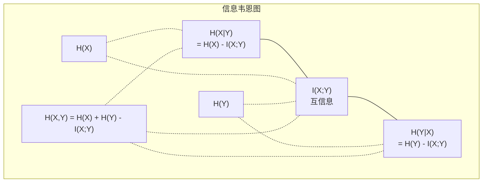

# 信息论

> 信息论衡量惊奇。损失函数建立在其上。

**类型:** 学习
**语言:** Python
**前置要求:** 第1阶段, 课程06 (概率)
**时间:** ~60分钟

## 学习目标

- 从零计算熵、交叉熵和KL散度，解释它们的关系
- 推导为什么最小化交叉熵损失等价于最大化对数似然
- 计算特征与目标之间的互信息来排序特征重要性
- 解释困惑度作为语言模型选择的有效词汇表大小

## 问题背景

你在每个分类模型训练中调用 `CrossEntropyLoss()`。你在每篇语言模型论文中看到"困惑度"。你在VAE、蒸馏和RLHF中读到KL散度。这些不是孤立的概念。它们是同一个想法戴着不同的帽子。

信息论给你推理不确定性、压缩和预测的语言。Claude Shannon在1948年发明它来解决通信问题。事实证明，训练神经网络是一个通信问题: 模型试图通过学习权重的噪声信道传输正确的标签。

本课程从零构建每个公式，让你看到它们从哪里来以及为什么有效。

## 概念讲解

### 信息量(惊奇)

当不太可能的事情发生时，它携带更多信息。硬币正面落地? 不令人惊奇。彩票中奖? 非常惊奇。

概率为p的事件的信息量为:

```
I(x) = -log(p(x))
```

用log以2为底得到比特。用自然对数得到纳特(nats)。相同想法，不同单位。

```
事件              概率    惊奇 (比特)
公平硬币正面    0.5            1.0
掷出6          0.167          2.58
千分之一事件    0.001          9.97
确定事件        1.0            0.0
```

确定事件携带零信息。你已经知道它们会发生。

### 熵(平均惊奇)

熵是分布所有可能结果的期望惊奇。

```
H(P) = -sum( p(x) * log(p(x)) )  对所有x
```

公平硬币对二值变量有最大熵: 1比特。偏斜硬币(99%正面)有低熵: 0.08比特。你已经知道会发生什么，所以每次翻转告诉你几乎什么都没有。

```
公平硬币:    H = -(0.5 * log2(0.5) + 0.5 * log2(0.5)) = 1.0 比特
偏斜硬币:  H = -(0.99 * log2(0.99) + 0.01 * log2(0.01)) = 0.08 比特
```

熵衡量分布中不可减少的不确定性。你不能压缩到低于它。

### 交叉熵(你每天使用的损失函数)

交叉熵衡量当你用分布Q编码实际来自分布P的事件时的平均惊奇。

```
H(P, Q) = -sum( p(x) * log(q(x)) )  对所有x
```

P是真实分布(标签)。Q是你模型的预测。如果Q完美匹配P，交叉熵等于熵。任何不匹配使其更大。

在分类中，P是一个one-hot向量(真实类概率1，其他0)。这简化交叉熵为:

```
H(P, Q) = -log(q(真实类))
```

这就是分类的整个交叉熵损失公式。最大化正确类的预测概率。

### KL散度(分布间距离)

KL散度衡量使用Q而非P时你获得的额外惊奇。

```
D_KL(P || Q) = sum( p(x) * log(p(x) / q(x)) )  对所有x
             = H(P, Q) - H(P)
```

交叉熵是熵加KL散度。由于真实分布的熵在训练期间是常数，最小化交叉熵等价于最小化KL散度。你在把模型分布推向真实分布。

KL散度不对称: D_KL(P || Q) != D_KL(Q || P)。它不是真正的距离度量。

### 互信息

互信息衡量知道一个变量告诉你多少关于另一个的信息。

```
I(X; Y) = H(X) - H(X|Y)
        = H(X) + H(Y) - H(X, Y)
```

如果X和Y独立，互信息为零。知道一个对另一个没有任何信息。如果它们完全相关，互信息等于任一变量的熵。

在特征选择中，特征与目标之间的高互信息意味着特征有用。低互信息意味着它是噪声。

### 条件熵

H(Y|X)衡量观测X后Y剩余的不确定性。

```
H(Y|X) = H(X,Y) - H(X)
```

两个极端:
- 如果X完全决定Y，则 H(Y|X) = 0。知道X消除了Y的所有不确定性。例子: X = 摄氏温度，Y = 华氏温度。
- 如果X告诉你关于Y什么都没有，则 H(Y|X) = H(Y)。知道X没有减少你的不确定性。例子: X = 抛硬币，Y = 明天天气。

条件熵总是非负且不超过H(Y):

```
0 <= H(Y|X) <= H(Y)
```

在机器学习中，条件熵出现在决策树中。每次分裂，算法选择最小化H(Y|X)的特征X——去除最多标签Y不确定性的特征。

### 联合熵

H(X,Y)是X和Y联合分布的熵。

```
H(X,Y) = -sum sum p(x,y) * log(p(x,y))   对所有x, y
```

关键性质:

```
H(X,Y) <= H(X) + H(Y)
```

当X和Y独立时等号成立。如果它们共享信息，联合熵小于各熵之和。"缺失"的熵正是互信息。



关系:
- H(X,Y) = H(X) + H(Y|X) = H(Y) + H(X|Y)
- I(X;Y) = H(X) - H(X|Y) = H(Y) - H(Y|X)
- H(X,Y) = H(X) + H(Y) - I(X;Y)

### 互信息(深入讲解)

互信息I(X;Y)量化知道一个变量减少另一个多少不确定性。

```
I(X;Y) = H(X) - H(X|Y)
       = H(Y) - H(Y|X)
       = H(X) + H(Y) - H(X,Y)
       = sum sum p(x,y) * log(p(x,y) / (p(x) * p(y)))
```

性质:
- I(X;Y) >= 0 始终。观测某物你从不损失信息。
- I(X;Y) = 0 当且仅当X和Y独立。
- I(X;Y) = I(Y;X)。它是对称的，不同于KL散度。
- I(X;X) = H(X)。变量与自身共享所有信息。

**互信息用于特征选择。** 在ML中，你想要对目标有信息量的特征。互信息给你排序特征的原则方法:

1. 对每个特征X_i，计算I(X_i; Y)其中Y是目标变量。
2. 按MI分数排序特征。
3. 保留前k个特征。

这对特征与目标之间的任何关系都有效——线性、非线性、单调或非单调。相关性只捕捉线性关系。MI捕捉一切。

| 方法 | 检测 | 计算成本 | 处理类别? |
|--------|---------|-------------------|---------------------|
| Pearson相关 | 线性关系 | O(n) | 否 |
| Spearman相关 | 单调关系 | O(n log n) | 否 |
| 互信息 | 任何统计依赖 | O(n log n) with binning | 是 |

### 标签平滑与交叉熵

标准分类使用硬目标: [0, 0, 1, 0]。真实类获得概率1，其他获得0。标签平滑用软目标替换这些:

```
soft_target = (1 - epsilon) * hard_target + epsilon / num_classes
```

epsilon = 0.1 和 4类:
- 硬目标:  [0, 0, 1, 0]
- 软目标:  [0.025, 0.025, 0.925, 0.025]

从信息论角度看，标签平滑增加目标分布的熵。硬one-hot目标熵为0——没有不确定性。软目标有正熵。

为什么这有帮助:
- 防止模型将logits推向极端值（完美匹配one-hot目标在交叉熵下需要无限logits）
- 充当正则化: 模型不能100%自信
- 改善校准: 预测概率更好反映真实不确定性
- 减少训练和推理行为之间的差距

标签平滑的交叉熵损失变成:

```
L = (1 - epsilon) * CE(hard_target, prediction) + epsilon * H_uniform(prediction)
```

第二项惩罚远离均匀的预测——对置信度的直接正则化。

### 为什么交叉熵是THE分类损失

三个视角，相同结论。

**信息论视角。** 交叉熵衡量用模型分布而非真实分布浪费的比特数。最小化它使你的模型成为现实最高效的编码器。

**最大似然视角。** 对N个带真实类别y_i的训练样本:

```
似然     = product( q(y_i) )
对数似然 = sum( log(q(y_i)) )
负对数似然 = -sum( log(q(y_i)) )
```

最后一行是交叉熵损失。最小化交叉熵 = 最大化你模型下训练数据的似然。

**梯度视角。** 交叉熵对logits的梯度简单是 (预测 - 真实)。干净、稳定、快速计算。这就是为什么它与softmax完美配对。

### 比特vs纳特

唯一区别是log底数。

```
log以2为底   -> 比特      (信息论传统)
log以e为底   -> 纳特      (机器学习惯例)
log以10为底  -> hartleys  (很少使用)
```

1纳特 = 1/ln(2)比特 = 1.4427比特。PyTorch和TensorFlow默认使用自然log(纳特)。

### 困惑度

困惑度是交叉熵的指数。它告诉你模型不确定时有效选择的等概率选项数量。

```
困惑度 = 2^H(P,Q)   (如果用比特)
困惑度 = e^H(P,Q)   (如果用纳特)
```

困惑度为50的语言模型平均就像要从50个可能的下一个token中均匀选择一样困惑。越低越好。

GPT-2在常见基准上达到困惑度~30。现代模型在代表性好的领域是几位数。

## 动手实践

### 步骤1: 信息量和熵

```python
import math

def information_content(p, base=2):
    if p <= 0 or p > 1:
        return float('inf') if p <= 0 else 0.0
    return -math.log(p) / math.log(base)

def entropy(probs, base=2):
    return sum(
        p * information_content(p, base)
        for p in probs if p > 0
    )

fair_coin = [0.5, 0.5]
biased_coin = [0.99, 0.01]
fair_die = [1/6] * 6

print(f"公平硬币熵:   {entropy(fair_coin):.4f} 比特")
print(f"偏斜硬币熵: {entropy(biased_coin):.4f} 比特")
print(f"公平骰子熵:    {entropy(fair_die):.4f} 比特")
```

### 步骤2: 交叉熵和KL散度

```python
def cross_entropy(p, q, base=2):
    total = 0.0
    for pi, qi in zip(p, q):
        if pi > 0:
            if qi <= 0:
                return float('inf')
            total += pi * (-math.log(qi) / math.log(base))
    return total

def kl_divergence(p, q, base=2):
    return cross_entropy(p, q, base) - entropy(p, base)

true_dist = [0.7, 0.2, 0.1]
good_model = [0.6, 0.25, 0.15]
bad_model = [0.1, 0.1, 0.8]

print(f"真实分布熵:     {entropy(true_dist):.4f} 比特")
print(f"CE (好模型):          {cross_entropy(true_dist, good_model):.4f} 比特")
print(f"CE (差模型):           {cross_entropy(true_dist, bad_model):.4f} 比特")
print(f"KL散度 (好):     {kl_divergence(true_dist, good_model):.4f} 比特")
print(f"KL散度 (差):      {kl_divergence(true_dist, bad_model):.4f} 比特")
```

### 步骤3: 交叉熵作为分类损失

```python
def softmax(logits):
    max_logit = max(logits)
    exps = [math.exp(z - max_logit) for z in logits]
    total = sum(exps)
    return [e / total for e in exps]

def cross_entropy_loss(true_class, logits):
    probs = softmax(logits)
    return -math.log(probs[true_class])

logits = [2.0, 1.0, 0.1]
true_class = 0

probs = softmax(logits)
loss = cross_entropy_loss(true_class, logits)

print(f"Logits:      {logits}")
print(f"Softmax:     {[f'{p:.4f}' for p in probs]}")
print(f"真实类:  {true_class}")
print(f"损失:        {loss:.4f} 纳特")
print(f"困惑度:  {math.exp(loss):.2f}")
```

### 步骤4: 交叉熵等价负对数似然

```python
import random

random.seed(42)

n_samples = 1000
n_classes = 3
true_labels = [random.randint(0, n_classes - 1) for _ in range(n_samples)]
model_logits = [[random.gauss(0, 1) for _ in range(n_classes)] for _ in range(n_samples)]

ce_loss = sum(
    cross_entropy_loss(label, logits)
    for label, logits in zip(true_labels, model_logits)
) / n_samples

nll = -sum(
    math.log(softmax(logits)[label])
    for label, logits in zip(true_labels, model_logits)
) / n_samples

print(f"交叉熵损失:      {ce_loss:.6f}")
print(f"负对数似然: {nll:.6f}")
print(f"差异:              {abs(ce_loss - nll):.2e}")
```

### 步骤5: 互信息

```python
def mutual_information(joint_probs, base=2):
    rows = len(joint_probs)
    cols = len(joint_probs[0])

    margin_x = [sum(joint_probs[i][j] for j in range(cols)) for i in range(rows)]
    margin_y = [sum(joint_probs[i][j] for i in range(rows)) for j in range(cols)]

    mi = 0.0
    for i in range(rows):
        for j in range(cols):
            pxy = joint_probs[i][j]
            if pxy > 0:
                mi += pxy * math.log(pxy / (margin_x[i] * margin_y[j])) / math.log(base)
    return mi

independent = [[0.25, 0.25], [0.25, 0.25]]
dependent = [[0.45, 0.05], [0.05, 0.45]]

print(f"MI (独立): {mutual_information(independent):.4f} 比特")
print(f"MI (依赖):   {mutual_information(dependent):.4f} 比特")
```

## 实际应用

使用NumPy的相同概念，你实践中会这样用:

```python
import numpy as np

def np_entropy(p):
    p = np.asarray(p, dtype=float)
    mask = p > 0
    result = np.zeros_like(p)
    result[mask] = p[mask] * np.log(p[mask])
    return -result.sum()

def np_cross_entropy(p, q):
    p, q = np.asarray(p, dtype=float), np.asarray(q, dtype=float)
    mask = p > 0
    return -(p[mask] * np.log(q[mask])).sum()

def np_kl_divergence(p, q):
    return np_cross_entropy(p, q) - np_entropy(p)

true = np.array([0.7, 0.2, 0.1])
pred = np.array([0.6, 0.25, 0.15])
print(f"熵:    {np_entropy(true):.4f} 纳特")
print(f"交叉熵:  {np_cross_entropy(true, pred):.4f} 纳特")
print(f"KL散度:     {np_kl_divergence(true, pred):.4f} 纳特")
```

你从零构建了 `torch.nn.CrossEntropyLoss()` 内部做的事情。现在你知道为什么训练时损失下降: 你的模型预测分布越来越接近真实分布，用纳特浪费的信息衡量。

## 练习题

1. 计算假设均匀分布的英文字母表熵(26字母)。然后用实际字母频率估计它。哪个更高，为什么?

2. 模型对真实类为1的样本输出logits [5.0, 2.0, 0.5]。手动计算交叉熵损失，然后用 `cross_entropy_loss` 函数验证。什么logits会给出零损失?

3. 证明KL散度不对称。选两个分布P和Q，计算D_KL(P || Q)和D_KL(Q || P)。解释为什么它们不同。

4. 构建计算token预测序列困惑度的函数。给定(真实token索引, 预测logits)对列表，返回序列困惑度。

## 关键术语

| 术语 | 人们怎么说 | 实际含义 |
|------|-----------|----------|
| 信息量 | "惊奇" | 编码事件所需的比特(或纳特)数: -log(p) |
| 熵 | "随机性" | 分布所有结果的平均惊奇。衡量不可减少的不确定性。 |
| 交叉熵 | "损失函数" | 用模型分布Q编码来自真实分布P的事件时的平均惊奇。 |
| KL散度 | "分布间距离" | 用Q而非P浪费的额外比特。等于交叉熵减熵。不对称。 |
| 互信息 | "X和Y多相关" | 知道Y后对X不确定性的减少。零意味着独立。 |
| Softmax | "将logits转为概率" | 指数化并归一化。将任意实值向量映射到有效概率分布。 |
| 困惑度 | "模型多困惑" | 交叉熵的指数。每步模型选择的有效词汇表大小。 |
| 比特 | "Shannon的单位" | log以2为底衡量的信息。一比特解决一次公平抛硬币。 |
| 纳特 | "ML的单位" | 自然log衡量的信息。PyTorch和TensorFlow默认使用。 |
| 负对数似然 | "NLL损失" | 对one-hot标签等同于交叉熵损失。最小化它最大化正确预测概率。 |

## 延伸阅读

- [Shannon 1948: A Mathematical Theory of Communication](https://people.math.harvard.edu/~ctm/home/text/others/shannon/entropy/entropy.pdf) - 原始论文, 仍可读
- [Visual Information Theory (Chris Olah)](https://colah.github.io/posts/2015-09-Visual-Information/) - 熵和KL散度最佳可视化解释
- [PyTorch CrossEntropyLoss docs](https://pytorch.org/docs/stable/generated/torch.nn.CrossEntropyLoss.html) - 框架如何实现你刚构建的内容