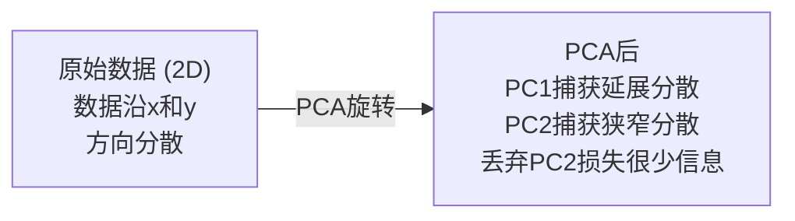

# 降维

> 高维数据有结构。从正确的角度看就能发现。

**类型:** 构建
**语言:** Python
**前置要求:** 第1阶段, 课程01 (线性代数直觉), 02 (向量、矩阵与运算), 03 (特征值与特征向量), 06 (概率与分布)
**时间:** ~90分钟

## 学习目标

- 从零实现PCA: 中心化数据、计算协方差矩阵、特征分解、投影
- 使用解释方差比和肘部法则选择主成分数量
- 比较PCA、t-SNE和UMAP可视化MNIST数字的2D效果，解释权衡
- 应用带RBF核的核PCA分离标准PCA无法处理的非线性数据结构

## 问题背景

你有每个样本784特征的数据集。可能是手写数字像素值。可能是基因表达水平。可能是用户行为信号。你无法可视化784维。你无法绘制它们。你甚至无法思考它们。

但大多数那784特征是冗余的。实际信息存在于更小的表面上。手写"7"不需要784个独立数字来描述。它需要几个: 笔画角度、横杠长度、倾斜程度。其余是噪声。

降维找到那个更小的表面。它将你的784维数据压缩到2、10或50维，同时保持重要的结构。

## 概念讲解

### 维度的诅咒

高维空间不直观。三件事随维度增长而崩溃。

**距离变得无意义。** 高维中，任意两随机点间距离收敛到相同值。如果每个点与每个其他点大致相同距离，最近邻搜索停止工作。

```
维度    平均距离比 (随机点间最大/最小)
2            ~5.0
10           ~1.8
100          ~1.2
1000         ~1.02
```

**体积集中在角落。** d维单位超立方体有2^d个角。100维中，几乎所有体积在角落，远离中心。数据点散布到边缘，你的模型在内部缺乏数据。

**你需要指数级更多数据。** 要保持空间相同样本密度，从2D到20D意味着你需要10^18倍更多数据。你永远不够。降低维度将数据密度带回可工作的范围。

### PCA: 找到重要的方向

主成分分析(PCA)找到数据变化最多的轴。它旋转坐标系统使第一轴捕获最多方差，第二捕获次多，以此类推。

算法:

```
1. 中心化数据        (每个特征减去均值)
2. 计算协方差     (特征如何一起变化)
3. 特征分解     (找到主方向)
4. 按特征值排序     (最大方差优先)
5. 投影               (保留前k个特征向量，丢弃其余)
```

为什么特征分解? 协方差矩阵对称且半正定。其特征向量是特征空间的正交方向。特征值告诉你每个方向捕获多少方差。最大特征值的特征向量指向最大方差方向。



- **PCA前:** 数据云沿x和y轴斜向分散
- **PCA后:** 坐标系统旋转使PC1与最大方差方向(延展分散)对齐，PC2与最小方差方向(狭窄分散)对齐
- **降维:** 丢弃PC2将数据投影到PC1上，损失很少信息

### 解释方差比

每个主成分捕获总方差的一部分。解释方差比告诉你多少。

```
成分    特征值    解释比    累积
PC1          4.73          0.473              0.473
PC2          2.51          0.251              0.724
PC3          1.12          0.112              0.836
PC4          0.89          0.089              0.925
...
```

当累积解释方差达到0.95，你知道那么多成分捕获95%信息。之后的大多是噪声。

### 选择成分数量

三个策略:

1. **阈值。** 保留足够成分解释90-95%方差。
2. **肘部法则。** 绘制每个成分的解释方差。寻找急剧下降。
3. **下游性能。** 用PCA作为预处理。扫描k并测量模型精度。最佳k是精度平稳处。

### t-SNE: 保持邻域

t分布随机邻域嵌入(t-SNE)设计用于可视化。它将高维数据映射到2D(或3D)同时保持哪些点彼此靠近。

直觉: 在原始空间，基于距离计算点对的概率分布。近点概率高。远点概率低。然后找到2D排列使相同概率分布成立。784维中的邻居在2D中保持邻居。

t-SNE关键性质:
- 非线性。它能展开PCA无法的复杂流形。
- 随机性。不同运行产生不同布局。
- 困惑度参数控制考虑多少邻居(典型范围: 5-50)。
- 输出中簇间距离无意义。只有簇本身有意义。
- 大数据集慢。默认O(n^2)。

### UMAP: 更快，更好全局结构

均匀流形近似与投影(UMAP)与t-SNE类似工作但有两大优势:
- 更快。用近似最近邻图而非计算所有对距离。
- 更好全局结构。输出中簇相对位置比t-SNE更有意义。

UMAP在高维空间构建加权图("模糊拓扑表示")然后找到尽可能保持该图的低维布局。

关键参数:
- `n_neighbors`: 多少邻居定义局部结构(类似困惑度)。更高值保持更多全局结构。
- `min_dist`: 输出中点打包有多紧。更低值创建更密簇。

### 用哪个

| 方法 | 使用场景 | 保持 | 速度 |
|--------|----------|-----------|-------|
| PCA | 训练前预处理 | 全局方差 | 快(精确), 百万样本 |
| PCA | 快速探索可视化 | 线性结构 | 快 |
| t-SNE | 出版质量2D图 | 局部邻域 | 慢(< 10k样本理想) |
| UMAP | 大规模2D可视化 | 局部+部分全局结构 | 中等(处理百万) |
| PCA | 模型特征降维 | 方差排序特征 | 快 |
| t-SNE / UMAP | 理解簇结构 | 簇分离 | 中等到慢 |

经验法则: PCA用于预处理和数据压缩。t-SNE或UMAP用于需要2D可视化结构。

### 核PCA

标准PCA找线性子空间。它旋转坐标系统并丢弃轴。但如果数据位于非线性流形? 2D中圆不能被任何线分离。标准PCA无帮助。

核PCA在核函数诱导的高维特征空间应用PCA，不显式计算该空间坐标。这是核技巧——SVM背后相同想法。

算法:
1. 计算核矩阵K其中K_ij = k(x_i, x_j)
2. 在特征空间中心化核矩阵
3. 特征分解中心化核矩阵
4. 顶特征向量(缩放1/sqrt(特征值))是投影

常见核函数:

| 核 | 公式 | 适合 |
|--------|---------|----------|
| RBF (高斯) | exp(-gamma * ||x - y||^2) | 大多数非线性数据, 平滑流形 |
| 多项式 | (x . y + c)^d | 多项式关系 |
| Sigmoid | tanh(alpha * x . y + c) | 类神经网络映射 |

何时用核PCAvs标准PCA:

| 标准 | 标准PCA | 核PCA |
|-----------|-------------|------------|
| 数据结构 | 线性子空间 | 非线性流形 |
| 速度 | O(min(n^2 d, d^2 n)) | O(n^2 d + n^3) |
| 可解释性 | 成分是特征的线性组合 | 成分缺乏直接特征解释 |
| 可扩展性 | 百万样本工作 | 核矩阵n x n, 内存受限 |
| 重构 | 直接逆变换 | 需要预图像近似 |

经典例子: 2D同心圆。两个点环，一个在另一个内。标准PCA将两者投影到相同线——对分类无用。核PCA用RBF核将内圆和外圆映射到不同区域，使其线性可分。

### 重构误差

降维多好? 你压缩784维到50。损失了什么?

测量重构误差:
1. 投影数据到k维: X_reduced = X @ W_k
2. 重构: X_hat = X_reduced @ W_k^T
3. 计算MSE: mean((X - X_hat)^2)

对PCA，重构误差与解释方差有清晰关系:

```
重构误差 = 未包含特征值之和
总方差 = 所有特征值之和
损失比例 = (丢弃特征值之和) / (所有特征值之和)
```

每个成分的解释方差比:

```
解释比_k = 特征值_k / 所有特征值之和
```

绘制累积解释方差对成分数量给你"肘部"曲线。正确成分数量在:
- 曲线平坦处(边际收益递减)
- 累积方差跨过阈值(通常0.90或0.95)
- 下游任务性能平稳

重构误差在选择k之外有用。你可以用它做异常检测: 高重构误差样本是不适合学习子空间的异常值。这是生产系统PCA异常检测的基础。

## 动手实践

### 步骤1: 从零实现PCA

```python
import numpy as np

class PCA:
    def __init__(self, n_components):
        self.n_components = n_components
        self.components = None
        self.mean = None
        self.eigenvalues = None
        self.explained_variance_ratio_ = None

    def fit(self, X):
        self.mean = np.mean(X, axis=0)
        X_centered = X - self.mean

        cov_matrix = np.cov(X_centered, rowvar=False)

        eigenvalues, eigenvectors = np.linalg.eigh(cov_matrix)

        sorted_idx = np.argsort(eigenvalues)[::-1]
        eigenvalues = eigenvalues[sorted_idx]
        eigenvectors = eigenvectors[:, sorted_idx]

        self.components = eigenvectors[:, :self.n_components].T
        self.eigenvalues = eigenvalues[:self.n_components]
        total_var = np.sum(eigenvalues)
        self.explained_variance_ratio_ = self.eigenvalues / total_var

        return self

    def transform(self, X):
        X_centered = X - self.mean
        return X_centered @ self.components.T

    def fit_transform(self, X):
        self.fit(X)
        return self.transform(X)
```

### 步骤2: 在合成数据上测试

```python
np.random.seed(42)
n_samples = 500

t = np.random.uniform(0, 2 * np.pi, n_samples)
x1 = 3 * np.cos(t) + np.random.normal(0, 0.2, n_samples)
x2 = 3 * np.sin(t) + np.random.normal(0, 0.2, n_samples)
x3 = 0.5 * x1 + 0.3 * x2 + np.random.normal(0, 0.1, n_samples)

X_synthetic = np.column_stack([x1, x2, x3])

pca = PCA(n_components=2)
X_reduced = pca.fit_transform(X_synthetic)

print(f"原始形状: {X_synthetic.shape}")
print(f"降维形状:  {X_reduced.shape}")
print(f"解释方差比: {pca.explained_variance_ratio_}")
print(f"捕获总方差: {sum(pca.explained_variance_ratio_):.4f}")
```

### 步骤3: MNIST数字2D可视化

```python
from sklearn.datasets import fetch_openml

mnist = fetch_openml("mnist_784", version=1, as_frame=False, parser="auto")
X_mnist = mnist.data[:5000].astype(float)
y_mnist = mnist.target[:5000].astype(int)

pca_mnist = PCA(n_components=50)
X_pca50 = pca_mnist.fit_transform(X_mnist)
print(f"50成分捕获 {sum(pca_mnist.explained_variance_ratio_):.2%} 方差")

pca_2d = PCA(n_components=2)
X_pca2d = pca_2d.fit_transform(X_mnist)
print(f"2成分捕获 {sum(pca_2d.explained_variance_ratio_):.2%} 方差")
```

### 步骤4: 与sklearn比较

```python
from sklearn.decomposition import PCA as SklearnPCA
from sklearn.manifold import TSNE

sklearn_pca = SklearnPCA(n_components=2)
X_sklearn_pca = sklearn_pca.fit_transform(X_mnist)

print(f"\n我们PCA解释方差:     {pca_2d.explained_variance_ratio_}")
print(f"Sklearn PCA解释方差: {sklearn_pca.explained_variance_ratio_}")

diff = np.abs(np.abs(X_pca2d) - np.abs(X_sklearn_pca))
print(f"最大绝对差异: {diff.max():.10f}")

tsne = TSNE(n_components=2, perplexity=30, random_state=42)
X_tsne = tsne.fit_transform(X_mnist)
print(f"\nt-SNE输出形状: {X_tsne.shape}")
```

### 步骤5: UMAP比较

```python
try:
    from umap import UMAP

    reducer = UMAP(n_components=2, n_neighbors=15, min_dist=0.1, random_state=42)
    X_umap = reducer.fit_transform(X_mnist)
    print(f"UMAP输出形状: {X_umap.shape}")
except ImportError:
    print("安装umap-learn: pip install umap-learn")
```

## 实际应用

PCA作为分类器预处理:

```python
from sklearn.decomposition import PCA as SklearnPCA
from sklearn.linear_model import LogisticRegression
from sklearn.model_selection import train_test_split
from sklearn.metrics import accuracy_score

X_train, X_test, y_train, y_test = train_test_split(
    X_mnist, y_mnist, test_size=0.2, random_state=42
)

results = {}
for k in [10, 30, 50, 100, 200]:
    pca_k = SklearnPCA(n_components=k)
    X_tr = pca_k.fit_transform(X_train)
    X_te = pca_k.transform(X_test)

    clf = LogisticRegression(max_iter=1000, random_state=42)
    clf.fit(X_tr, y_train)
    acc = accuracy_score(y_test, clf.predict(X_te))
    var_captured = sum(pca_k.explained_variance_ratio_)
    results[k] = (acc, var_captured)
    print(f"k={k:>3d}  精度={acc:.4f}  方差={var_captured:.4f}")
```

性能在远少于784维时就平稳。那个平稳点是你的工作点。

## 产出成果

本课程产生:
- `outputs/skill-dimensionality-reduction.md` - 为给定任务选择正确降维技术的技能

## 练习题

1. 修改PCA类支持 `inverse_transform`。从10、50和200成分重构MNIST数字。打印每个的重构误差(与原始的平均平方差异)。

2. 在相同MNIST子集上用困惑度5、30和100运行t-SNE。描述输出如何变化。为什么困惑度影响簇紧密度?

3. 取一个50特征数据集其中只有5个有信息(用 `sklearn.datasets.make_classification` 生成)。应用PCA并检查解释方差曲线是否正确识别数据实际是5维的。

## 关键术语

| 术语 | 人们怎么说 | 实际含义 |
|------|-----------|----------|
| 维度诅咒 | "太多特征" | 随维度增长，距离、体积和数据密度都反直觉表现。模型需要指数级更多数据补偿。 |
| PCA | "降维" | 旋转坐标系统使轴与最大方差方向对齐，然后丢弃低方差轴。 |
| 主成分 | "重要方向" | 协方差矩阵的特征向量。特征空间中数据变化最多的方向。 |
| 解释方差比 | "这个成分有多少信息" | 一个主成分捕获的总方差比例。对前k个比求和看k成分保持多少。 |
| 协方差矩阵 | "特征如何相关" | 对称矩阵，条目(i,j)衡量特征i和j如何一起变化。对角条目是各方差。 |
| t-SNE | "那个簇图" | 非线性方法通过保持对邻域概率将高维数据映射到2D。适合可视化，不适合预处理。 |
| UMAP | "更快t-SNE" | 基于拓扑数据分析的线性方法。保持局部和部分全局结构。比t-SNE扩展更好。 |
| 困惑度 | "t-SNE旋钮" | 控制每个点考虑的有效邻居数。低困惑度聚焦非常局部结构。高困惑度捕获更广模式。 |
| 流形 | "数据所在表面" | 嵌入高维空间的低维表面。3D中皱褶的纸是2D流形。 |

## 延伸阅读

- [A Tutorial on Principal Component Analysis](https://arxiv.org/abs/1404.1100) (Shlens) - 从基础清晰推导PCA
- [How to Use t-SNE Effectively](https://distill.pub/2016/misread-tsne/) (Wattenberg et al.) - t-SNE陷阱和参数选择交互指南
- [UMAP documentation](https://umap-learn.readthedocs.io/) - UMAP作者的理论和实践指导