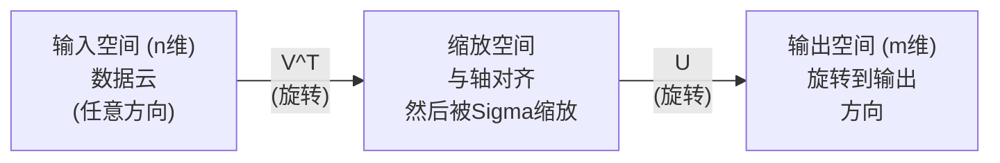
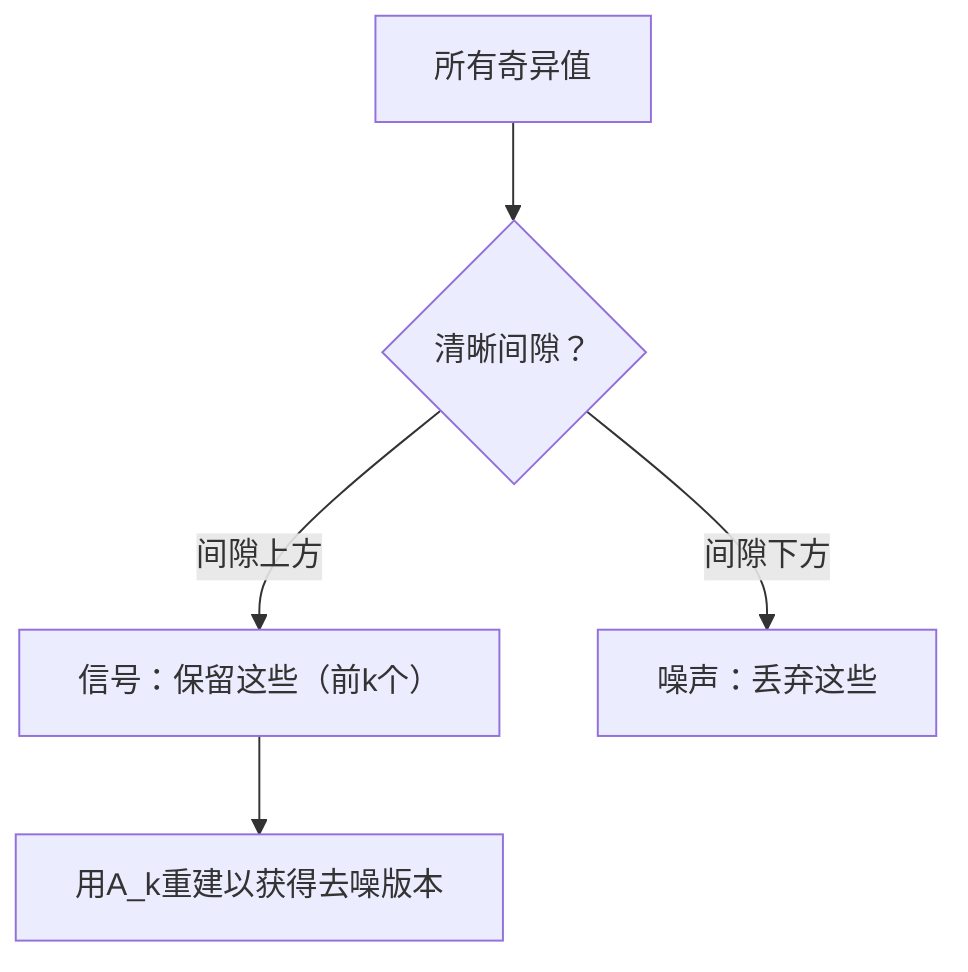

# 奇异值分解

> SVD是线性代数的瑞士军刀。每个矩阵都有一个。每个数据科学家都需要一个。

**类型:** 构建
**语言:** Python, Julia
**前置要求:** 第1阶段，第01课（线性代数直觉）、02课（向量与矩阵运算）、03课（矩阵变换）
**时间:** ~120分钟

## 学习目标

- 通过幂迭代实现SVD，并解释U、Sigma和V^T的几何意义
- 应用截断SVD进行图像压缩，并测量压缩比与重建误差
- 通过SVD计算Moore-Penrose伪逆，求解超定最小二乘系统
- 将SVD与PCA、推荐系统（潜在因子）和NLP中的潜在语义分析联系起来

## 问题背景

你有一个1000x2000的矩阵。可能是用户对电影的评分。可能是文档-词频表。可能是图像的像素值。你需要压缩它、去噪、发现其中的隐藏结构，或用它求解最小二乘系统。特征分解只对方阵有效。即使如此，它也需要矩阵具有满秩的线性独立特征向量。

SVD适用于任何矩阵。任何形状。任何秩。无条件。它将矩阵分解为三个因子，揭示矩阵对空间作用的几何特性。它是线性代数中最通用、最有用的分解。

## 概念讲解

### SVD的几何作用

每个矩阵，无论形状如何，都按顺序执行三个操作：旋转、缩放、旋转。SVD使这个分解显式化。

```
A = U * Sigma * V^T

      m x n     m x m    m x n    n x n
     (任意)    (旋转)  (缩放)  (旋转)
```

给定任何矩阵A，SVD将其分解为：
- V^T在输入空间中旋转向量（n维）
- Sigma沿每个轴缩放（拉伸或压缩）
- U将结果旋转到输出空间（m维）



这样想：你把一个矩阵交给SVD。它告诉你："这个矩阵接受一个球体的输入，首先用V^T旋转它，然后用Sigma拉伸成椭球，然后用U旋转椭球。"奇异值是椭球轴的长度。

### 完整分解

对于形状为m x n的矩阵A：

```
A = U * Sigma * V^T

其中：
  U     是 m x m，正交（U^T U = I）
  Sigma 是 m x n，对角（奇异值在对角线上）
  V     是 n x n，正交（V^T V = I）

奇异值 sigma_1 >= sigma_2 >= ... >= sigma_r > 0
其中 r = rank(A)
```

U的列称为左奇异向量。V的列称为右奇异向量。Sigma的对角项称为奇异值。它们总是非负的，按惯例按递减顺序排列。

### 左奇异向量、奇异值、右奇异向量

SVD的每个组件都有独特的几何意义。

**右奇异向量（V的列）：** 它们构成输入空间（R^n）的正交基。它们是矩阵映射到输出空间中正交方向的输入空间方向。将它们视为域的自然坐标系。

**奇异值（Sigma的对角线）：** 这些是缩放因子。第i个奇异值告诉你矩阵沿第i个右奇异向量拉伸向量的程度。零奇异值意味着矩阵完全压碎该方向。

**左奇异向量（U的列）：** 它们构成输出空间（R^m）的正交基。第i个左奇异向量是第i个右奇异向量在缩放后映射到的输出空间方向。

它们之间的关系：

```
A * v_i = sigma_i * u_i

矩阵A接受第i个右奇异向量v_i，
按sigma_i缩放，并将其映射到第i个左奇异向量u_i。
```

这为你提供了任何矩阵作用的逐坐标图像。

### 外积形式

SVD可以写成秩-1矩阵的和：

```
A = sigma_1 * u_1 * v_1^T + sigma_2 * u_2 * v_2^T + ... + sigma_r * u_r * v_r^T

每个项sigma_i * u_i * v_i^T是一个秩-1矩阵（外积）。
完整矩阵是r个这样的矩阵的和，其中r是秩。
```

这种形式是低秩近似的基础。每个项添加一层结构。第一项捕获单一最重要的模式。第二项捕获次重要的。依此类推。截断这个和给出任何给定秩的最佳可能近似。

```
秩-1近似:    A_1 = sigma_1 * u_1 * v_1^T
                  (捕获主导模式)

秩-2近似:    A_2 = sigma_1 * u_1 * v_1^T + sigma_2 * u_2 * v_2^T
                  (捕获两个最重要的模式)

秩-k近似:    A_k = 前k项的和
                  (根据Eckart-Young定理是最优的)
```

### 与特征分解的关系

SVD和特征分解深深相关。A的奇异值和向量直接来自A^T A和A A^T的特征值和特征向量。

```
A^T A = V * Sigma^T * U^T * U * Sigma * V^T
      = V * Sigma^T * Sigma * V^T
      = V * D * V^T

其中 D = Sigma^T * Sigma 是一个对角矩阵，对角线上是sigma_i^2。

所以：
- 右奇异向量（V）是A^T A的特征向量
- 奇异值的平方（sigma_i^2）是A^T A的特征值

类似地：
A A^T = U * Sigma * V^T * V * Sigma^T * U^T
      = U * Sigma * Sigma^T * U^T

所以：
- 左奇异向量（U）是A A^T的特征向量
- A A^T的特征值也是sigma_i^2
```

这种联系告诉你三件事：
1. 奇异值总是实数且非负的（它们是正半定矩阵特征值的平方根）。
2. 你可以通过A^T A的特征分解计算SVD，但这会使条件数平方并损失数值精度。专用SVD算法避免这样做。
3. 当A是方阵且对称正半定时，SVD和特征分解是相同的。

### 截断SVD：低秩近似

Eckart-Young-Mirsky定理指出，A的最佳秩-k近似（在Frobenius范数和谱范数下）是通过仅保留前k个奇异值及其对应的向量获得的：

```
A_k = U_k * Sigma_k * V_k^T

其中：
  U_k     是 m x k  （U的前k列）
  Sigma_k 是 k x k  （Sigma的左上角k x k块）
  V_k     是 n x k  （V的前k列）

近似误差 = sigma_{k+1}  （谱范数）
         = sqrt(sigma_{k+1}^2 + ... + sigma_r^2)  （Frobenius范数）
```

这不仅是"一个"好近似。它是任何秩-k矩阵的最佳可能近似。没有其他秩-k矩阵比A_k更接近A。

| 组件 | 相对大小 | 保留在秩-3近似中？ |
|------|---------|------------------|
| sigma_1 | 最大 | 是 |
| sigma_2 | 大 | 是 |
| sigma_3 | 中大 | 是 |
| sigma_4 | 中 | 否（误差） |
| sigma_5 | 中小 | 否（误差） |
| sigma_6 | 小 | 否（误差） |
| sigma_7 | 很小 | 否（误差） |
| sigma_8 | 微小 | 否（误差） |

保留前3个：A_3捕获三个最大的奇异值。误差 = 剩余值（sigma_4到sigma_8）。

如果奇异值快速衰减，小的k捕获矩阵的大部分。如果它们缓慢衰减，矩阵没有低秩结构。

### 用SVD进行图像压缩

灰度图像是一个像素强度矩阵。800x600的图像有480,000个值。SVD让你用更少的值近似它。

```
原始图像：800 x 600 = 480,000个值

秩k的SVD：
  U_k:      800 x k 个值
  Sigma_k:  k 个值
  V_k:      600 x k 个值
  总计:    k * (800 + 600 + 1) = k * 1401个值

  k=10:   14,010个值   （原始值的2.9%）
  k=50:   70,050个值  （原始值的14.6%）
  k=100: 140,100个值  （原始值的29.2%）

  当k变小时压缩比提高，
  但视觉质量下降。
```

关键洞察：自然图像的奇异值快速衰减。前几个奇异值捕获广泛结构（形状、梯度）。后面的捕获精细细节和噪声。在秩50处截断通常产生与原始图像几乎相同的图像，同时节省85%的存储空间。

### SVD用于推荐系统

Netflix奖使这个出名。你有一个用户-电影评分矩阵，其中大多数条目缺失。

```
             电影1  电影2  电影3  电影4  电影5
  用户1      [  5      ?       3       ?       1  ]
  用户2      [  ?      4       ?       2       ?  ]
  用户3      [  3      ?       5       ?       ?  ]
  用户4      [  ?      ?       ?       4       3  ]

  ? = 未知评分
```

想法：这个评分矩阵具有低秩。用户的口味不是完全独立的。有少量潜在因子（动作与戏剧、旧与新、脑力与感官）解释大多数偏好。

对（填充的）评分矩阵进行SVD将其分解为：
- U：潜在因子空间中的用户画像
- Sigma：每个潜在因子的重要性
- V^T：潜在因子空间中的电影画像

用户对电影的预测评分是其用户画像与电影画像的点积（按奇异值加权）。低秩近似填充缺失条目。

在实践中，你使用像Simon Funk的增量SVD或ALS（交替最小二乘）这样的变体，它们直接处理缺失数据。但核心思想相同：通过SVD进行潜在因子分解。

### NLP中的SVD：潜在语义分析

潜在语义分析（LSA），也称为潜在语义索引（LSI），将SVD应用于词-文档矩阵。

```
             文档1   文档2   文档3   文档4
  "cat"      [  3      0      1      0  ]
  "dog"      [  2      0      0      1  ]
  "fish"     [  0      4      1      0  ]
  "pet"      [  1      1      1      1  ]
  "ocean"    [  0      3      0      0  ]

在k=2的SVD之后：

  每个文档在2D"概念空间"中成为一个点。
  每个词在同一个2D空间中成为一个点。
  关于相似主题的文档聚集在一起。
  具有相似意义的词聚集在一起。

  "cat"和"dog"最终彼此靠近（陆地宠物）。
  "fish"和"ocean"最终彼此靠近（水概念）。
  如果文档1和文档3共享相似主题，它们就聚集在一起。
```

LSA是最早从原始文本捕获语义相似性的成功方法之一。它有效是因为同义词倾向于出现在相似的文档中，所以SVD将它们分组到相同的潜在维度中。现代词嵌入（Word2Vec、GloVe）可以被视为这个想法的后代。

### 用SVD去噪

噪声数据将信号集中在顶部奇异值中，将噪声分散到所有奇异值中。截断去除噪声基底。

**干净信号奇异值：**

| 组件 | 大小 | 类型 |
|------|------|------|
| sigma_1 | 非常大 | 信号 |
| sigma_2 | 大 | 信号 |
| sigma_3 | 中 | 信号 |
| sigma_4 | 接近零 | 可忽略 |
| sigma_5 | 接近零 | 可忽略 |

**噪声信号奇异值（噪声添加到所有）：**

| 组件 | 大小 | 类型 |
|------|------|------|
| sigma_1 | 非常大 | 信号 |
| sigma_2 | 大 | 信号 |
| sigma_3 | 中 | 信号 |
| sigma_4 | 小 | 噪声 |
| sigma_5 | 小 | 噪声 |
| sigma_6 | 小 | 噪声 |
| sigma_7 | 小 | 噪声 |



这用于信号处理、科学测量和数据清洗。任何时候你有被加性噪声损坏的矩阵，截断SVD都是一种将信号与噪声分离的原则性方法。

### 通过SVD的伪逆

Moore-Penrose伪逆A+将矩阵求逆推广到非方阵和奇异矩阵。SVD使其计算变得简单。

```
如果 A = U * Sigma * V^T，那么：

A+ = V * Sigma+ * U^T

其中Sigma+通过以下方式形成：
  1. 转置Sigma（交换行和列）
  2. 用1/sigma_i替换每个非零对角项
  3. 将零保持为零

对于 A (m x n)：      A+ 是 (n x m)
对于 Sigma (m x n)：  Sigma+ 是 (n x m)
```

伪逆解决最小二乘问题。如果Ax = b没有精确解（超定系统），那么x = A+ b是最小二乘解（最小化||Ax - b||）。

```
超定系统（方程多于未知数）：

  [1  1]         [3]
  [2  1] x   =   [5]       不存在精确解。
  [3  1]         [6]

  x_ls = A+ b = V * Sigma+ * U^T * b

  这给出最小化残差平方和的x。
  与正规方程(A^T A)^(-1) A^T b相同的结果，
  但数值上更稳定。
```

### 数值稳定性优势

计算A^T A的特征分解使奇异值平方（A^T A的特征值是sigma_i^2）。这使条件数平方，放大了数值误差。

```
示例：
  A的奇异值为 [1000, 1, 0.001]
  A的条件数：1000 / 0.001 = 10^6

  A^T A的特征值为 [10^6, 1, 10^{-6}]
  A^T A的条件数：10^6 / 10^{-6} = 10^{12}

  直接计算SVD：使用条件数10^6
  通过A^T A计算：使用条件数10^{12}
                           （损失6位额外精度）
```

现代SVD算法（Golub-Kahan双对角化）直接在A上工作，从不形成A^T A。这就是为什么你应该始终优先使用`np.linalg.svd(A)`而不是`np.linalg.eig(A.T @ A)`。

### 与PCA的联系

PCA就是SVD在中心数据上。这不是类比。字面就是相同的计算。

```
给定数据矩阵X（n_samples x n_features），中心化（减去均值）：

协方差矩阵：C = (1/(n-1)) * X^T X

PCA找到C的特征向量。但：

  X = U * Sigma * V^T    （X的SVD）

  X^T X = V * Sigma^2 * V^T

  C = (1/(n-1)) * V * Sigma^2 * V^T

所以主成分正好是右奇异向量V。
每个成分的解释方差是sigma_i^2 / (n-1)。

在sklearn中，PCA使用SVD实现，而不是特征分解。
它更快且数值上更稳定。
```

这意味着你在第10课学到的关于降维的一切在底层都是SVD。PCA是机器学习中SVD最常见的应用。

## 动手实践

### 第1步：使用幂迭代从头开始的SVD

想法：要找到最大的奇异值及其向量，在A^T A（或A A^T）上使用幂迭代。然后压缩矩阵并重复下一个奇异值。

```python
import numpy as np

def power_iteration(M, num_iters=100):
    n = M.shape[1]
    v = np.random.randn(n)
    v = v / np.linalg.norm(v)

    for _ in range(num_iters):
        Mv = M @ v
        v = Mv / np.linalg.norm(Mv)

    eigenvalue = v @ M @ v
    return eigenvalue, v

def svd_from_scratch(A, k=None):
    m, n = A.shape
    if k is None:
        k = min(m, n)

    sigmas = []
    us = []
    vs = []

    A_residual = A.copy().astype(float)

    for _ in range(k):
        AtA = A_residual.T @ A_residual
        eigenvalue, v = power_iteration(AtA, num_iters=200)

        if eigenvalue < 1e-10:
            break

        sigma = np.sqrt(eigenvalue)
        u = A_residual @ v / sigma

        sigmas.append(sigma)
        us.append(u)
        vs.append(v)

        A_residual = A_residual - sigma * np.outer(u, v)

    U = np.column_stack(us) if us else np.empty((m, 0))
    S = np.array(sigmas)
    V = np.column_stack(vs) if vs else np.empty((n, 0))

    return U, S, V
```

### 第2步：测试并与NumPy比较

```python
np.random.seed(42)
A = np.random.randn(5, 4)

U_ours, S_ours, V_ours = svd_from_scratch(A)
U_np, S_np, Vt_np = np.linalg.svd(A, full_matrices=False)

print("我们的奇异值:", np.round(S_ours, 4))
print("NumPy奇异值:", np.round(S_np, 4))

A_reconstructed = U_ours @ np.diag(S_ours) @ V_ours.T
print(f"重建误差: {np.linalg.norm(A - A_reconstructed):.8f}")
```

### 第3步：图像压缩演示

```python
def compress_image_svd(image_matrix, k):
    U, S, Vt = np.linalg.svd(image_matrix, full_matrices=False)
    compressed = U[:, :k] @ np.diag(S[:k]) @ Vt[:k, :]
    return compressed

image = np.random.seed(42)
rows, cols = 200, 300
image = np.random.randn(rows, cols)

for k in [1, 5, 10, 20, 50]:
    compressed = compress_image_svd(image, k)
    error = np.linalg.norm(image - compressed) / np.linalg.norm(image)
    original_size = rows * cols
    compressed_size = k * (rows + cols + 1)
    ratio = compressed_size / original_size
    print(f"k={k:>3d}  误差={error:.4f}  存储={ratio:.1%}")
```

### 第4步：去噪

```python
np.random.seed(42)
clean = np.outer(np.sin(np.linspace(0, 4*np.pi, 100)),
                 np.cos(np.linspace(0, 2*np.pi, 80)))
noise = 0.3 * np.random.randn(100, 80)
noisy = clean + noise

U, S, Vt = np.linalg.svd(noisy, full_matrices=False)
denoised = U[:, :5] @ np.diag(S[:5]) @ Vt[:5, :]

print(f"噪声误差:    {np.linalg.norm(noisy - clean):.4f}")
print(f"去噪误差: {np.linalg.norm(denoised - clean):.4f}")
print(f"改进:    {(1 - np.linalg.norm(denoised - clean) / np.linalg.norm(noisy - clean)):.1%}")
```

### 第5步：伪逆

```python
A = np.array([[1, 1], [2, 1], [3, 1]], dtype=float)
b = np.array([3, 5, 6], dtype=float)

U, S, Vt = np.linalg.svd(A, full_matrices=False)
S_inv = np.diag(1.0 / S)
A_pinv = Vt.T @ S_inv @ U.T

x_svd = A_pinv @ b
x_lstsq = np.linalg.lstsq(A, b, rcond=None)[0]
x_pinv = np.linalg.pinv(A) @ b

print(f"SVD伪逆解:  {x_svd}")
print(f"np.linalg.lstsq解:   {x_lstsq}")
print(f"np.linalg.pinv解:    {x_pinv}")
```

## 实际应用

完整的工作演示在`code/svd.py`中。运行它以查看应用于图像压缩、推荐系统、潜在语义分析和去噪的SVD。

```bash
python svd.py
```

Julia版本在`code/svd.jl`中，使用Julia的原生`svd()`函数和`LinearAlgebra`包演示相同的概念。

```bash
julia svd.jl
```

## 产出成果

这节课产出：
- `outputs/skill-svd.md` - 了解何时以及如何在实际项目中应用SVD的技能

## 练习题

1. 实现完整的SVD，不使用幂迭代。相反，计算A^T A的特征分解以获得V和奇异值，然后计算U = A V Sigma^{-1}。将你的幂迭代版本、特征分解版本与NumPy的数值精度进行比较。

2. 加载真实的灰度图像（或将一张转换为灰度）。在秩1、5、10、25、50、100处压缩它。对每个秩，计算压缩比和相对误差。找到图像在视觉上可接受的秩。

3. 构建一个微型推荐系统。创建一个10x8的用户-电影评分矩阵，包含一些已知条目。用行均值填充缺失条目。计算SVD并重建秩-3近似。使用重建矩阵预测缺失评分。验证预测是否合理。

4. 创建一个100x50的文档-词矩阵，包含3个合成主题。每个主题有5个相关词。添加噪声。应用SVD并验证前3个奇异值远大于其余。将文档投影到3D潜在空间中，并检查来自同一主题的文档是否聚集在一起。

5. 生成一个干净的低秩矩阵（秩3，大小50x40）并添加不同水平的高斯噪声（sigma = 0.1, 0.5, 1.0, 2.0）。对每个噪声水平，通过将k从1扫到40并测量对干净矩阵的重建误差来找到最佳截断秩。绘制最佳k如何随噪声水平变化。

## 关键术语

| 术语 | 人们怎么说 | 实际含义 |
|------|----------|----------|
| SVD | "分解任何矩阵" | 将A分解为U Sigma V^T，其中U和V是正交的，Sigma是对角线上有非负项的对角矩阵。适用于任何形状的任何矩阵。 |
| 奇异值 | "这个组件的重要性" | Sigma的第i个对角项。衡量矩阵沿第i个主方向拉伸的程度。总是非负的，按递减顺序排列。 |
| 左奇异向量 | "输出方向" | U的一列。第i个右奇异向量映射到的输出空间方向（按sigma_i缩放后）。 |
| 右奇异向量 | "输入方向" | V的一列。矩阵映射到第i个左奇异向量的输入空间方向（按sigma_i缩放后）。 |
| 截断SVD | "低秩近似" | 仅保留前k个奇异值及其向量。产生原始矩阵的最佳可能秩-k近似（Eckart-Young定理）。 |
| 秩 | "真实维度" | 非零奇异值的数量。告诉你矩阵实际使用多少独立方向。 |
| 伪逆 | "广义逆" | V Sigma+ U^T。反转非零奇异值，将零保持为零。为非方阵或奇异矩阵解决最小二乘问题。 |
| 条件数 | "对误差的敏感度" | sigma_max / sigma_min。大的条件数意味着小的输入变化导致大的输出变化。SVD直接揭示这一点。 |
| 潜在因子 | "隐藏变量" | SVD在低秩空间中发现的维度。在推荐中，潜在因子可能对应类型偏好。在NLP中，它可能对应主题。 |
| Frobenius范数 | "总矩阵大小" | 平方项和的平方根。等于平方奇异值和的平方根。用于测量近似误差。 |
| Eckart-Young定理 | "SVD给出最佳压缩" | 对于任何目标秩k，截断SVD在所有可能的秩-k矩阵上最小化近似误差。 |
| 幂迭代 | "找到最大的特征向量" | 重复将随机向量乘以矩阵并归一化。收敛到具有最大特征值的特征向量。许多SVD算法的构建块。 |

## 延伸阅读

- [Gilbert Strang：线性代数及其应用，第7章](https://math.mit.edu/~gs/linearalgebra/) - 全面处理SVD及其应用
- [3Blue1Brown：但是什么是SVD？](https://www.youtube.com/watch?v=vSczTbgc8Rc) - SVD的几何直觉
- [我们推荐奇异值分解](https://www.ams.org/publicoutreach/feature-column/fcarc-svd) - 美国数学协会的可访问概述
- [Netflix奖和矩阵分解](https://sifter.org/~simon/journal/20061211.html) - Simon Funk关于推荐SVD的原始博客文章
- [潜在语义分析](https://en.wikipedia.org/wiki/Latent_semantic_analysis) - SVD在NLP中的原始应用
- [Trefethen和Bau的数值线性代数](https://people.maths.ox.ac.uk/trefethen/text.html) - 理解SVD算法及其数值特性的黄金标准
