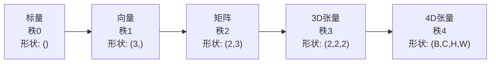
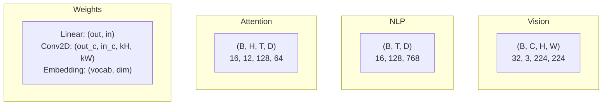
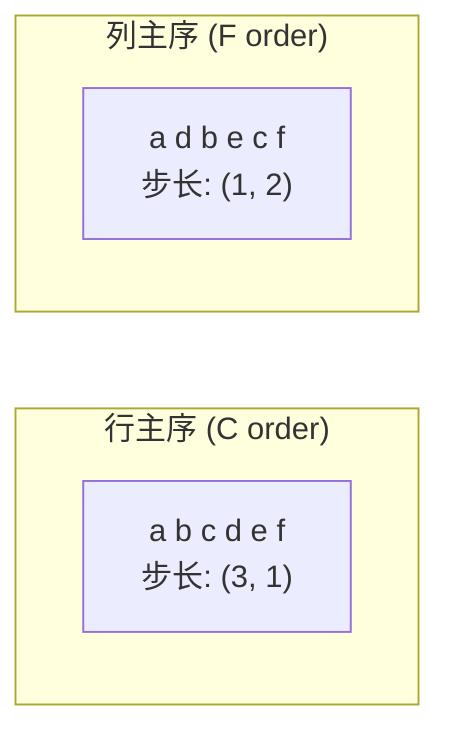
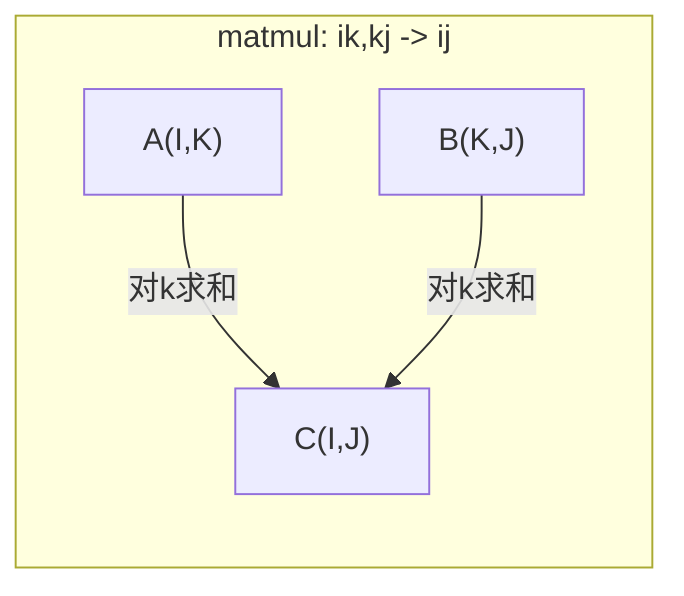

# 张量运算

> 张量是数据与深度学习之间的共同语言。每张图像、每个句子、每个梯度都流经它们。

**类型:** 构建
**语言:** Python
**前置要求:** 第1阶段, 课程01 (线性代数直觉), 02 (向量、矩阵与运算)
**时间:** ~90分钟

## 学习目标

- 从零实现带形状、步长、reshape、transpose和逐元素运算的张量类
- 应用广播规则对不同形状张量操作而不复制数据
- 写einsum表达式实现点积、矩阵乘法、外积和批处理操作
- 追踪多头注意力每步的精确张量形状

## 问题背景

你构建Transformer。前向传播看起来干净。你运行得到: `RuntimeError: mat1 and mat2 shapes cannot be multiplied (32x768 and 512x768)`。你盯着形状。你尝试transpose。现在它说 `Expected 4D input (got 3D input)`。你加unsqueeze。其他东西崩溃。

形状错误是深度学习代码中最常见的bug。它们概念上不难——每个运算有形状契约——但它们快速倍增。Transformer有几十个reshape、transpose和broadcast链在一起。一个轴错误错误就级联。更糟，一些形状错误根本不抛错误。它们沿错误维度广播或在错误轴上求和，静默产生垃圾。

矩阵处理两组事物间成对关系。真实数据不适合二维。32张224x224 RGB图像批是4D张量: `(32, 3, 224, 224)`。12头自注意力也是4D: `(batch, heads, seq_len, head_dim)`。你需要一个推广到任意维度的数据结构，操作在所有维度干净组合。那个结构是张量。掌握其运算，形状错误变得容易调试。

## 概念讲解

### 什么是张量

张量是统一数据类型的多维数值数组。维度数是**秩**(或**阶**)。每个维度是一个**轴**。**形状**是列出每个轴大小的元组。



总元素 = 所有大小乘积。形状 `(2, 3, 4)` 持有 `2 * 3 * 4 = 24` 元素。

### 深度学习中张量形状

不同数据类型映射到约定特定张量形状。



PyTorch用NCHW(通道优先)。TensorFlow默认NHWC(通道在后)。布局不匹配导致静默减速或错误。

### 内存布局如何工作

内存中2D数组是1D字节序列。**步长**告诉你沿每个轴移动一步跳过多少元素。



Transpose不移动数据。它交换步长，使张量**非连续**——行元素不再内存相邻。

### 广播规则

广播让你对不同形状张量操作而不复制数据。从右对齐形状。两维度相等或一个为1时兼容。较少维度左边补1。

```
张量A:     (8, 1, 6, 1)
张量B:        (7, 1, 5)
补齐B:     (1, 7, 1, 5)
结果:       (8, 7, 6, 5)
```

### Einsum: 通用张量运算

Einstein求和用字母标记每个轴。输入中但非输出中的轴被求和。两者中的被保留。



关键模式: `i,i->` (点积), `i,j->ij` (外积), `ii->` (迹), `ij->ji` (transpose), `bij,bjk->bik` (批matmul), `bhtd,bhsd->bhts` (注意力分数)。

## 动手实践

代码在 `code/tensors.py`。每步引用那里实现。

### 步骤1: 张量存储和步长

张量存储扁平数值列表加形状元数据。步长告诉索引逻辑如何将多维索引映射到扁平位置。

```python
class Tensor:
    def __init__(self, data, shape=None):
        if isinstance(data, (list, tuple)):
            self._data, self._shape = self._flatten_nested(data)
        elif isinstance(data, np.ndarray):
            self._data = data.flatten().tolist()
            self._shape = tuple(data.shape)
        else:
            self._data = [data]
            self._shape = ()

        if shape is not None:
            total = reduce(lambda a, b: a * b, shape, 1)
            if total != len(self._data):
                raise ValueError(
                    f"Cannot reshape {len(self._data)} elements into shape {shape}"
                )
            self._shape = tuple(shape)

        self._strides = self._compute_strides(self._shape)

    @staticmethod
    def _compute_strides(shape):
        if len(shape) == 0:
            return ()
        strides = [1] * len(shape)
        for i in range(len(shape) - 2, -1, -1):
            strides[i] = strides[i + 1] * shape[i + 1]
        return tuple(strides)
```

对形状 `(3, 4)`，步长是 `(4, 1)`——前一行跳4元素，前一列跳1元素。

### 步骤2: Reshape, squeeze, unsqueeze

Reshape改变形状不改元素顺序。元素总数必须相同。用 `-1` 让一个维度推断大小。

```python
t = Tensor(list(range(12)), shape=(2, 6))
r = t.reshape((3, 4))
r = t.reshape((-1, 3))
```

Squeeze移除大小1的轴。Unsqueeze插入一个。Unsqueeze对广播关键——偏置向量 `(D,)` 加到批 `(B, T, D)` 需unsqueeze到 `(1, 1, D)`。

```python
t = Tensor(list(range(6)), shape=(1, 3, 1, 2))
s = t.squeeze()
v = Tensor([1, 2, 3])
u = v.unsqueeze(0)
```

### 步骤3: Transpose和permute

Transpose交换两轴。Permute重排所有轴。这就是如何转换NCHW和NHWC。

```python
mat = Tensor(list(range(6)), shape=(2, 3))
tr = mat.transpose(0, 1)

t4d = Tensor(list(range(24)), shape=(1, 2, 3, 4))
perm = t4d.permute((0, 2, 3, 1))
```

Transpose或permute后，张量内存非连续。PyTorch中，`view` 对非连续张量失败——用 `reshape` 或先调用 `.contiguous()`。

### 步骤4: 逐元素运算和归约

逐元素运算(加、乘、减)独立应用于每个元素并保持形状。归约(sum、mean、max)坍缩一个或多个轴。

```python
a = Tensor([[1, 2], [3, 4]])
b = Tensor([[10, 20], [30, 40]])
c = a + b
d = a * 2
s = a.sum(axis=0)
```

CNN中全局平均池化: `(B, C, H, W).mean(axis=[2, 3])` 产生 `(B, C)`。NLP中序列平均池化: `(B, T, D).mean(axis=1)` 产生 `(B, D)`。

### 步骤5: 用NumPy广播

`tensors.py` 中 `demo_broadcasting_numpy()` 函数展示核心模式。

```python
activations = np.random.randn(4, 3)
bias = np.array([0.1, 0.2, 0.3])
result = activations + bias

images = np.random.randn(2, 3, 4, 4)
scale = np.array([0.5, 1.0, 1.5]).reshape(1, 3, 1, 1)
result = images * scale

a = np.array([1, 2, 3]).reshape(-1, 1)
b = np.array([10, 20, 30, 40]).reshape(1, -1)
outer = a * b
```

广播实现成对距离: reshape `(M, 2)` 为 `(M, 1, 2)` 和 `(N, 2)` 为 `(1, N, 2)`，相减、平方、沿最后轴求和、开根。结果: `(M, N)`。

### 步骤6: Einsum运算

`demo_einsum()` 和 `demo_einsum_gallery()` 函数走遍每个常见模式。

```python
a = np.array([1.0, 2.0, 3.0])
b = np.array([4.0, 5.0, 6.0])
dot = np.einsum("i,i->", a, b)

A = np.array([[1, 2], [3, 4], [5, 6]], dtype=float)
B = np.array([[7, 8, 9], [10, 11, 12]], dtype=float)
matmul = np.einsum("ik,kj->ij", A, B)

batch_A = np.random.randn(4, 3, 5)
batch_B = np.random.randn(4, 5, 2)
batch_mm = np.einsum("bij,bjk->bik", batch_A, batch_B)
```

收缩计算成本是所有索引大小(保留和求和)乘积。对 `bij,bjk->bik` B=32, I=128, J=64, K=128: `32 * 128 * 64 * 128 = 33,554,432` multiply-adds。

### 步骤7: 通过einsum实现注意力机制

`demo_attention_einsum()` 函数端到端实现多头注意力。

```python
B, H, T, D = 2, 4, 8, 16
E = H * D

X = np.random.randn(B, T, E)
W_q = np.random.randn(E, E) * 0.02

Q = np.einsum("bte,ek->btk", X, W_q)
Q = Q.reshape(B, T, H, D).transpose(0, 2, 1, 3)

scores = np.einsum("bhtd,bhsd->bhts", Q, K) / np.sqrt(D)
weights = softmax(scores, axis=-1)
attn_output = np.einsum("bhts,bhsd->bhtd", weights, V)

concat = attn_output.transpose(0, 2, 1, 3).reshape(B, T, E)
output = np.einsum("bte,ek->btk", concat, W_o)
```

每步是张量运算: 投影(通过einsum的matmul)、头分裂(reshape + transpose)、注意力分数(通过einsum的批matmul)、加权求和(通过einsum的批matmul)、头合并(transpose + reshape)、输出投影(matmul通过einsum)。

## 实际应用

### 从零vs NumPy

| 运算 | 从零 (Tensor类) | NumPy |
|---|---|---|
| 创建 | `Tensor([[1,2],[3,4]])` | `np.array([[1,2],[3,4]])` |
| Reshape | `t.reshape((3,4))` | `a.reshape(3,4)` |
| Transpose | `t.transpose(0,1)` | `a.T` 或 `a.transpose(0,1)` |
| Squeeze | `t.squeeze(0)` | `np.squeeze(a, 0)` |
| Sum | `t.sum(axis=0)` | `a.sum(axis=0)` |
| Einsum | N/A | `np.einsum("ij,jk->ik", a, b)` |

### 从零vs PyTorch

```python
import torch

t = torch.tensor([[1, 2, 3], [4, 5, 6]], dtype=torch.float32)
t.shape
t.stride()
t.is_contiguous()

t.reshape(3, 2)
t.unsqueeze(0)
t.transpose(0, 1)
t.transpose(0, 1).contiguous()

torch.einsum("ik,kj->ij", A, B)
```

PyTorch加autograd、GPU支持和优化BLAS内核。形状语义相同。如果你理解从零版本，PyTorch形状错误变得可读。

### 每个神经网络层作为张量运算

| 运算 | 张量形式 | Einsum |
|---|---|---|
| Linear层 | `Y = X @ W.T + b` | `"bd,od->bo"` + 偏置 |
| 注意力QKV | `Q = X @ W_q` | `"btd,dh->bth"` |
| 注意力分数 | `Q @ K.T / sqrt(d)` | `"bhtd,bhsd->bhts"` |
| 注意力输出 | `softmax(scores) @ V` | `"bhts,bhsd->bhtd"` |
| BatchNorm | `(X - mu) / sigma * gamma` | 逐元素 + 广播 |
| Softmax | `exp(x) / sum(exp(x))` | 逐元素 + 归约 |

## 产出成果

本课程产生两个可复用提示词:

1. **`outputs/prompt-tensor-shapes.md`** -- 系统调试张量形状不匹配的提示词。包含每个常见运算(matmul、broadcast、cat、Linear、Conv2d、BatchNorm、softmax)决策表和修复查找表。

2. **`outputs/prompt-tensor-debugger.md`** -- 当形状错误阻塞你时粘贴到任何AI助手的分步调试提示词。喂它错误消息和张量形状，获得精确修复。

## 练习题

1. **简单 -- Reshape往返。** 取形状 `(2, 3, 4)` 张量。reshape到 `(6, 4)`，然后 `(24,)`，然后回到 `(2, 3, 4)`。打印扁平数据验证每步元素顺序保持。

2. **中等 -- 实现广播。** 扩展 `Tensor` 类加 `broadcast_to(shape)` 方法将大小1维度扩展到匹配目标形状。然后修改 `_elementwise_op` 操作前自动广播。测试形状 `(3, 1)` 和 `(1, 4)` 产生 `(3, 4)`。

3. **困难 -- 从零构建einsum。** 实现基本 `einsum(subscripts, *tensors)` 函数至少处理: 点积(`i,i->`)、矩阵乘法(`ij,jk->ik`)、外积(`i,j->ij`)和transpose(`ij->ji`)。解析下标字符串，识别收缩索引，遍历所有索引组合。与 `np.einsum` 比较结果。

4. **困难 -- 注意力形状追踪器。** 写函数接受 `batch_size`、`seq_len`、`embed_dim` 和 `num_heads` 输入，打印多头注意力每步精确形状: 输入、Q/K/V投影、头分裂、注意力分数、softmax权重、加权求和、头合并、输出投影。与 `demo_attention_einsum()` 输出验证。

## 关键术语

| 术语 | 人们怎么说 | 实际含义 |
|---|---|---|
| 张量 | "矩阵但更多维度" | 有统一类型和定义形状、步长及运算的多维数组 |
| 秩 | "维度数" | 轴数。矩阵秩为2，非等于其矩阵秩 |
| 形状 | "张量大小" | 列出每个轴大小元组。`(2, 3)` 指2行3列 |
| 步长 | "内存如何布局" | 每个轴前进一位跳过的元素数 |
| 广播 | "形状不同时它就工作" | 严格规则集: 从右对齐，维度必须相等或一个为1 |
| 连续 | "张量正常" | 元素内存顺序存储，与逻辑布局无间隙或重排 |
| Einsum | "写matmul的花哨方式" | 一行表达任何张量收缩、外积、迹或transpose的通用记号 |
| View | "同reshape" | 共享相同内存缓冲但有不同形状/步长元数据的张量。非连续数据失败 |
| 收缩 | "对索引求和" | 张量间共享索引相乘求和、产生低秩结果的通用运算 |
| NCHW / NHWC | "PyTorch vs TensorFlow格式" | 图像张量内存布局约定。NCHW通道在空间维前，NHWC在后 |

## 延伸阅读

- [NumPy Broadcasting](https://numpy.org/doc/stable/user/basics.broadcasting.html) -- 带可视例子的规范规则
- [PyTorch Tensor Views](https://pytorch.org/docs/stable/tensor_view.html) -- View何时工作何时复制
- [einops](https://github.com/arogozhnikov/einops) -- 使张量reshape可读安全的库
- [The Illustrated Transformer](https://jalammar.github.io/illustrated-transformer/) -- 可视化流经注意力的张量形状
- [Einstein Summation in NumPy](https://numpy.org/doc/stable/reference/generated/numpy.einsum.html) -- 带例子的完整einsum文档