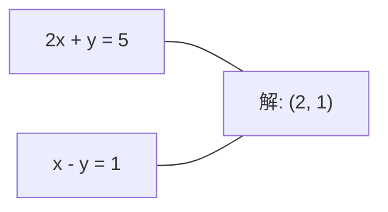
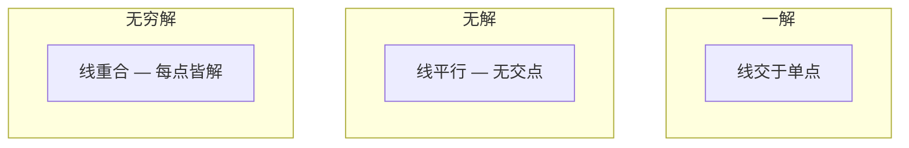

# 线性系统

> 解Ax = b是数学中最古老的问题，它仍在运行你的神经网络。

**类型:** 构建
**语言:** Python
**前置要求:** 第1阶段，第01课(线性代数直觉)、第02课(向量与矩阵)、第03课(矩阵变换)
**时间:** ~120分钟

## 学习目标

- 用带部分选主元的高斯消元法和回代法求解Ax = b
- 用LU、QR、和Cholesky分解分解矩阵并解释何者适用
- 推导最小二乘正规方程并连接线性和岭回归
- 用条件数诊断病态系统并应用正则化稳定它们

## 问题背景

每次你训练线性回归，你解线性系统。每次你计算最小二乘拟合，你解线性系统。每次神经网络层计算`y = Wx + b`，它在评估线性系统一边。当你加正则化，你修改系统。当你用Gaussian processes，你分解矩阵。当你逆协方差矩阵算Mahalanobis距离，你解线性系统。

方程Ax = b到处出现。A是已知系数矩阵。b是已知输出向量。x是你想找的未知向量。在线性回归，A是数据矩阵，b是目标向量，x是权重向量。整个模型简化为: 找x使Ax尽可能接近b。

这课从头构建解该方程的每主要方法。你将理解何法快何法稳、何法仅适用于方阵何法处理超定系统、和何矩阵条件数决定答案是否有意义。

## 概念讲解

### Ax = b的几何含义

线性方程组有几何解释。每方程定义超平面。解是所有超平面交集点(或点集)。

```
2x + y = 5          2D中两线。
x - y  = 1          它们交于x=2, y=1。
```



三种情况:



矩阵形式，"一解"意A可逆。"无解"意系统不一致。"无穷解"意A有零空间。大多ML问题落于"无精确解"类因方程(数据点)多于未知(参数)。那是最小二乘所在。

### 列图vs行图

读Ax = b有两方式。

**行图。** A每行定义一方程。每方程是超平面。解是它们全交处。

**列图。** A每列是向量。问题变成: A列何线性组合产生b?

```
A = | 2  1 |    b = | 5 |
    | 1 -1 |        | 1 |

行图: 同时解2x + y = 5和x - y = 1。

列图: 找x1, x2使:
  x1 * [2, 1] + x2 * [1, -1] = [5, 1]
  2 * [2, 1] + 1 * [1, -1] = [4+1, 2-1] = [5, 1]   检验。
```

列图更根本。若b在A列空间，系统有解。若不在，你找列空间最近点。那最近点是最小二乘解。

### 高斯消元法

高斯消元法将Ax = b变换成上三角系统Ux = c你用回代法解。是最直接方法。

算法:

```
1. 对每列k (主元列):
   a. 找列k第k行及以下最大元(部分选主元)。
   b. 将该行与第k行交换。
   c. 对k下每行i:
      - 计算乘数m = A[i][k] / A[k][k]
      - 从第i行减m倍第k行。
2. 回代: 从最后方程向上解。
```

例:

```
原:
| 2  1  1 | 8 |       R2 = R2 - (2)R1     | 2  1   1 |  8 |
| 4  3  3 |20 |  -->  R3 = R3 - (1)R1 --> | 0  1   1 |  4 |
| 2  3  1 |12 |                            | 0  2   0 |  4 |

                       R3 = R3 - (2)R2     | 2  1   1 |  8 |
                                       --> | 0  1   1 |  4 |
                                           | 0  0  -2 | -4 |

回代:
  -2 * x3 = -4    -->  x3 = 2
  x2 + 2  = 4     -->  x2 = 2
  2*x1 + 2 + 2 = 8 --> x1 = 2
```

高斯消元法花费O(n^3)操作。对1000x1000系统，那是约十亿次浮点操作。快，但若需解同A多系统你可做得更好。

### 部分选主元: 何以重要

无选主元，高斯消元法可失败或产垃圾。若主元为零，你除零。若小，你放大舍入误差。

```
坏主元:                       带部分选主元:
| 0.001  1 | 1.001 |            先换行:
| 1      1 | 2     |            | 1      1 | 2     |
                                 | 0.001  1 | 1.001 |
m = 1/0.001 = 1000              m = 0.001/1 = 0.001
R2 = R2 - 1000*R1               R2 = R2 - 0.001*R1
| 0.001  1     | 1.001   |      | 1      1     | 2     |
| 0     -999   | -999.0  |      | 0      0.999 | 0.999 |

x2 = 1.000 (正确)            x2 = 1.000 (正确)
x1 = (1.001 - 1)/0.001          x1 = (2 - 1)/1 = 1.000 (正确)
   = 0.001/0.001 = 1.000        稳因乘数小。
```

在有限精度浮点算术，无选主元版可失有效数字。部分选主元总选最大可用主元最小化误差放大。

### LU分解

LU分解将A分解成下三角矩阵L和上三角矩阵U: A = LU。L矩阵存高斯消元乘数。U矩阵是消元结果。

```
A = L @ U

| 2  1  1 |   | 1  0  0 |   | 2  1   1 |
| 4  3  3 | = | 2  1  0 | @ | 0  1   1 |
| 2  3  1 |   | 1  2  1 |   | 0  0  -2 |
```

为何分解而非仅消元？因一旦有L和U，对任新b解Ax = b仅花O(n^2):

```
Ax = b
LUx = b
令y = Ux:
  Ly = b    (前代, O(n^2))
  Ux = y    (回代, O(n^2))
```

O(n^3)花费于分解时一次支付。每后续解是O(n^2)。若需解同A但不同b 1000系统，LU省总工作量因子1000/3。

带部分选主元，你得PA = LU其中P是记录行交换的置换矩阵。

### QR分解

QR分解将A分解成正交矩阵Q和上三角矩阵R: A = QR。

正交矩阵有性质Q^T Q = I。其列是正交向量。乘Q保长度和角。

```
A = Q @ R

Q有正交列: Q^T Q = I
R是上三角

解Ax = b:
  QRx = b
  Rx = Q^T b    (仅乘Q^T，无需逆)
  回代得x。
```

QR数值上比LU更稳定解最小二乘问题。Gram-Schmidt过程逐列建Q:

```
给定A列a1, a2, ...:

q1 = a1 / ||a1||

q2 = a2 - (a2 . q1) * q1        (减对q1投影)
q2 = q2 / ||q2||                (归一化)

q3 = a3 - (a3 . q1) * q1 - (a3 . q2) * q2
q3 = q3 / ||q3||

R[i][j] = qi . aj    for i <= j
```

每步移除沿所有先前q向量成分，仅留新正交方向。

### Cholesky分解

当A对称(A = A^T)且正定(所有特征值正)，你可分解为A = L L^T其中L是下三角。这是Cholesky分解。

```
A = L @ L^T

| 4  2 |   | 2  0 |   | 2  1 |
| 2  5 | = | 1  2 | @ | 0  2 |

L[i][i] = sqrt(A[i][i] - sum(L[i][k]^2 for k < i))
L[i][j] = (A[i][j] - sum(L[i][k]*L[j][k] for k < j)) / L[j][j]    for i > j
```

Cholesky比LU快两倍且仅需一半存储。仅适用于对称正定矩阵，但那些常出现:

- 协方差矩阵对称正半定(正定加正则化)。
- Gaussian processes核矩阵对称正定。
- 凸函数最小值Hessian对称正定。
- A^T A总对称正半定。

在Gaussian processes，你用Cholesky分解核矩阵K，然后解K alpha = y得预测均值。Cholesky因子也给你边缘似然log行列式: log det(K) = 2 * sum(log(diag(L)))。

### 最小二乘: 当Ax = b无精确解

若A是m x n且m > n (方程多于未知)，系统超定。无精确解。代之，你最小化平方误差:

```
最小化 ||Ax - b||^2

这是残差平方和:
  sum((A[i,:] @ x - b[i])^2 for i in range(m))
```

最小化者满足正规方程:

```
A^T A x = A^T b
```

推导: 展开||Ax - b||^2 = (Ax - b)^T (Ax - b) = x^T A^T A x - 2 x^T A^T b + b^T b。对x取梯度，设为零: 2 A^T A x - 2 A^T b = 0。

```
原系统(超定, 4方程, 2未知):
| 1  1 |         | 3 |
| 1  2 | x     = | 5 |       无精确x满足全4方程。
| 1  3 |         | 6 |
| 1  4 |         | 8 |

正规方程:
A^T A = | 4  10 |    A^T b = | 22 |
        | 10 30 |            | 63 |

解: x = [1.5, 1.7]

这是线性回归。x[0]是截距，x[1]是斜率。
```

### 正规方程 = 线性回归

连接确切。在线性回归，数据矩阵X每行一样本每列一特征。目标向量y每条目一样本。权重向量w满足:

```
X^T X w = X^T y
w = (X^T X)^(-1) X^T y
```

这是线性回归闭式解。每次`sklearn.linear_model.LinearRegression.fit()`算此(或等价QR或SVD)。

加正则化项lambda * I到矩阵得岭回归:

```
(X^T X + lambda * I) w = X^T y
w = (X^T X + lambda * I)^(-1) X^T y
```

正则化使矩阵更好条件(更易准确逆)并通过缩权重向零防过拟合。矩阵X^T X + lambda * I当lambda > 0总对称正定，故可用Cholesky解。

### 伪逆(Moore-Penrose)

伪逆A+推广矩阵逆到非方阵和奇异矩阵。对任矩阵A:

```
x = A+ b

where A+ = V Sigma+ U^T    (经SVD算)
```

Sigma+由取每非零奇异值倒数并转置结果形成。若A = U Sigma V^T，则A+ = V Sigma+ U^T。

```
A = U Sigma V^T        (SVD)

Sigma = | 5  0 |       Sigma+ = | 1/5  0  0 |
        | 0  2 |                | 0  1/2  0 |
        | 0  0 |

A+ = V Sigma+ U^T
```

伪逆给最小范数最小二乘解。若系统有:
- 一解: A+ b给出。
- 无解: A+ b给最小二乘解。
- 无穷解: A+ b给最小||x||者。

NumPy's `np.linalg.lstsq`和`np.linalg.pinv`皆内部用SVD。

### 条件数

条件数测量解对输入小变化敏感度。对矩阵A，条件数是:

```
kappa(A) = ||A|| * ||A^(-1)|| = sigma_max / sigma_min
```

其中sigma_max和sigma_min是最大和最小奇异值。

```
好条件(kappa ~ 1):               病态(kappa ~ 10^15):
b小变化 -->                      b小变化 -->
x小变化                          x大变化

| 2  0 |   kappa = 2/1 = 2      | 1   1          |   kappa ~ 10^15
| 0  1 |   安全解                | 1   1+10^(-15) |   解是垃圾
```

经验规则:
- kappa < 100: 安全，解准确。
- kappa ~ 10^k: 你丢约k位浮点精度。
- kappa ~ 10^16 (float64): 解无意义。矩阵有效奇异。

在ML，病态发生在特征近共线时。正则化(加lambda * I)改善条件数从sigma_max / sigma_min到(sigma_max + lambda) / (sigma_min + lambda)。

### 迭代法: 共轭梯度

对极大稀疏系统(百万未知)，直接法如LU或Cholesky太贵。迭代法通过多次迭代改进猜逼近解。

共轭梯度(CG)解Ax = b当A对称正定。它至多n迭代内找精确解(在精确算术)，但若A特征值聚集则典型收敛更快。

```
算法概:
  x0 = 初始猜(常零)
  r0 = b - A x0           (残差)
  p0 = r0                 (搜索方向)

  对k = 0, 1, 2, ...:
    alpha = (rk . rk) / (pk . A pk)
    x_{k+1} = xk + alpha * pk
    r_{k+1} = rk - alpha * A pk
    beta = (r_{k+1} . r_{k+1}) / (rk . rk)
    p_{k+1} = r_{k+1} + beta * pk
    若 ||r_{k+1}|| < 容差: 停
```

CG用于:
- 大规模优化(Newton-CG法)
- 解PDE离散化
- 核方法核矩阵太大无法分解
- 其他迭代求解器预条件

收敛率依赖条件数。更好条件系统收敛更快，这是正则化帮助的另一原因。

### 全景: 何法何时

| 方法 | 要求 | 成本 | 用例 |
|------|------|------|------|
| 高斯消元法 | 方阵、非奇异A | O(n^3) | 方阵系统一次性解 |
| LU分解 | 方阵、非奇异A | O(n^3)分解 + O(n^2)求解 | 同A多次求解 |
| QR分解 | 任A (m >= n) | O(mn^2) | 最小二乘、数值稳定 |
| Cholesky分解 | 对称正定A | O(n^3/3) | 协方差矩阵、Gaussian processes、岭回归 |
| 正规方程 | 超定(m > n) | O(mn^2 + n^3) | 线性回归(小n) |
| SVD / 伪逆 | 任A | O(mn^2) | 秩亏系统、最小范数解 |
| 共轭梯度 | 对称正定、稀疏A | O(n * k * nnz) | 大稀疏系统，k=迭代数 |

### 连接到ML

本课每方法出现于产ML:

**线性回归。** 闭式解正规方程X^T X w = X^T y。这经Cholesky(若n小)或QR(若数值稳定重要)或SVD(若矩阵可能秩亏)。

**岭回归。** 加lambda * I到X^T X。正则化系统(X^T X + lambda * I) w = X^T y总可经Cholesky解因X^T X + lambda * I当lambda > 0对称正定。

**Gaussian processes。** 预测均值需解K alpha = y其中K是核矩阵。Cholesky分解K是标准方法。Log边缘似然用log det(K) = 2 sum(log(diag(L)))。

**神经网络初始化。** 正交初始化用QR分解创建列正交权重矩阵。这防深网络信号坍缩。

**预条件。** 大规模优化器用不完全Cholesky或不完全LU作共轭梯度求解器预条件。

**特征工程。** X^T X条件数告诉你特征是否共线。若kappa大，丢弃特征或加正则化。

## 动手实践

### 步1: 带部分选主元高斯消元法

```python
import numpy as np

def gaussian_elimination(A, b):
    n = len(b)
    Ab = np.hstack([A.astype(float), b.reshape(-1, 1).astype(float)])

    for k in range(n):
        max_row = k + np.argmax(np.abs(Ab[k:, k]))
        Ab[[k, max_row]] = Ab[[max_row, k]]

        if abs(Ab[k, k]) < 1e-12:
            raise ValueError(f"矩阵在主元{k}奇异或近奇异")

        for i in range(k + 1, n):
            m = Ab[i, k] / Ab[k, k]
            Ab[i, k:] -= m * Ab[k, k:]

    x = np.zeros(n)
    for i in range(n - 1, -1, -1):
        x[i] = (Ab[i, -1] - Ab[i, i+1:n] @ x[i+1:n]) / Ab[i, i]

    return x
```

### 步2: LU分解

```python
def lu_decompose(A):
    n = A.shape[0]
    L = np.eye(n)
    U = A.astype(float).copy()
    P = np.eye(n)

    for k in range(n):
        max_row = k + np.argmax(np.abs(U[k:, k]))
        if max_row != k:
            U[[k, max_row]] = U[[max_row, k]]
            P[[k, max_row]] = P[[max_row, k]]
            if k > 0:
                L[[k, max_row], :k] = L[[max_row, k], :k]

        for i in range(k + 1, n):
            L[i, k] = U[i, k] / U[k, k]
            U[i, k:] -= L[i, k] * U[k, k:]

    return P, L, U

def lu_solve(P, L, U, b):
    n = len(b)
    Pb = P @ b.astype(float)

    y = np.zeros(n)
    for i in range(n):
        y[i] = Pb[i] - L[i, :i] @ y[:i]

    x = np.zeros(n)
    for i in range(n - 1, -1, -1):
        x[i] = (y[i] - U[i, i+1:] @ x[i+1:]) / U[i, i]

    return x
```

### 步3: Cholesky分解

```python
def cholesky(A):
    n = A.shape[0]
    L = np.zeros_like(A, dtype=float)

    for i in range(n):
        for j in range(i + 1):
            s = A[i, j] - L[i, :j] @ L[j, :j]
            if i == j:
                if s <= 0:
                    raise ValueError("矩阵非正定")
                L[i, j] = np.sqrt(s)
            else:
                L[i, j] = s / L[j, j]

    return L
```

### 步4: 经正规方程最小二乘

```python
def least_squares_normal(A, b):
    AtA = A.T @ A
    Atb = A.T @ b
    return gaussian_elimination(AtA, Atb)

def ridge_regression(A, b, lam):
    n = A.shape[1]
    AtA = A.T @ A + lam * np.eye(n)
    Atb = A.T @ b
    L = cholesky(AtA)
    y = np.zeros(n)
    for i in range(n):
        y[i] = (Atb[i] - L[i, :i] @ y[:i]) / L[i, i]
    x = np.zeros(n)
    for i in range(n - 1, -1, -1):
        x[i] = (y[i] - L.T[i, i+1:] @ x[i+1:]) / L.T[i, i]
    return x
```

### 步5: 条件数

```python
def condition_number(A):
    U, S, Vt = np.linalg.svd(A)
    return S[0] / S[-1]
```

## 使用它

组合部件用于真实数据线性回归和岭回归:

```python
np.random.seed(42)
X_raw = np.random.randn(100, 3)
w_true = np.array([2.0, -1.0, 0.5])
y = X_raw @ w_true + np.random.randn(100) * 0.1

X = np.column_stack([np.ones(100), X_raw])

w_ols = least_squares_normal(X, y)
print(f"OLS权重(我们):    {w_ols}")

w_np = np.linalg.lstsq(X, y, rcond=None)[0]
print(f"OLS权重(numpy):   {w_np}")
print(f"最大差异: {np.max(np.abs(w_ols - w_np)):.2e}")

w_ridge = ridge_regression(X, y, lam=1.0)
print(f"岭权重(我们):  {w_ridge}")

from sklearn.linear_model import Ridge
ridge_sk = Ridge(alpha=1.0, fit_intercept=False)
ridge_sk.fit(X, y)
print(f"岭权重(sklearn): {ridge_sk.coef_}")
```

## 发货它

本课产出:
- `code/linear_systems.py`含从头实现高斯消元法、LU分解、Cholesky分解、最小二乘、和岭回归
- 演示正规方程和sklearn LinearRegression产同权重工作示例

## 练习题

1. 用高斯消元法、LU求解器、和`np.linalg.solve`解系统`[[1,2,3],[4,5,6],[7,8,10]] x = [6, 15, 27]`。验证三者给同答案于浮点容差内。

2. 生成50x5随机矩阵X和目标y = X @ w_true + noise。用正规方程、QR(经`np.linalg.qr`)、SVD(经`np.linalg.svd`)、和`np.linalg.lstsq`解w。比四种解。测X^T X条件数并解释何法你信任。

3. 建近奇异矩阵使两列几相同(如，列2 = 列1 + 1e-10 * noise)。算其条件数。带和不带正则化(加0.01 * I)解Ax = b。比解和残差。解释正则化何以帮助。

4. 对100x100随机对称正定矩阵实现共轭梯度算法。计达容差1e-8收敛需迭代数。比理论最大n迭代。

5. 对10、50、200、500大小对称正定矩阵计时Cholesky求解器vs LU求解器vs `np.linalg.solve`。绘图。验证Cholesky约比LU快2x。

## 关键术语

| 术语 | 人们怎么说 | 实际含义 |
|------|------------|----------|
| 线性系统 | "解x" | 线性方程组Ax = b。找x意找在变换A下产输出b的输入。 |
| 高斯消元法 | "行化简" | 系统性用行操作零掉对角下元素，产上三角系统可回代解。O(n^3)。 |
| 部分选主元 | "换行稳" | 消元列k前，将该列绝对值最大行换至主元位置。防除小数。 |
| LU分解 | "分解成三角" | 写A = LU其中L下三角(存乘数)U上三角(消元后矩阵)。摊销O(n^3)于多次求解。 |
| QR分解 | "正交分解" | 写A = QR其中Q正交列R上三角。比LU最小二乘更稳定。 |
| Cholesky分解 | "矩阵平方根" | 对对称正定A，写A = LL^T。LU成本一半。用于协方差矩阵、核矩阵、和岭回归。 |
| 最小二乘 | "无精确时最佳拟合" | 当系统超定(方程多于未知)最小化残差平方和||Ax - b||^2。 |
| 正规方程 | "微积分捷径" | A^T A x = A^T b。设||Ax - b||^2梯度为零。这IS线性回归闭式解。 |
| 伪逆 | "非方阵逆" | A+ = V Sigma+ U^T经SVD。给任矩阵最小范数最小二乘解，方或长方，奇异或不。 |
| 条件数 | "答案可信度" | kappa = sigma_max / sigma_min。测输入扰动敏感度。丢约log10(kappa)位精度。 |
| 岭回归 | "正则化最小二乘" | 解(X^T X + lambda I) w = X^T y。加lambda I改善条件并缩权重向零。防过拟合。 |
| 共轭梯度 | "大矩阵迭代Ax=b" | 对称正定系统迭代求解器。至多n步收敛。大稀疏系统实用因分解太贵。 |
| 超定系统 | "数据多于参数" | m-by-n系统m > n。无精确解存在。最小二乘找最佳逼近。这是每回归问题。 |
| 回代 | "从底向上解" | 给上三角系统，先解最后方程，然后代回。O(n^2)。 |
| 前代 | "从顶向下解" | 给下三角系统，先解第一方程，然后代前。O(n^2)。用于LU解L步。 |

## 延伸阅读

- [MIT 18.06: 线性代数](https://ocw.mit.edu/courses/18-06-linear-algebra-spring-2010/) (Gilbert Strang) — 线性系统和矩阵分解权威课程
- [数值线性代数](https://people.maths.ox.ac.uk/trefethen/text.html) (Trefethen & Bau) — 理解数值稳定性、条件、和算法何失效标准参考
- [矩阵计算](https://www.cs.cornell.edu/cv/GolubVanLoan4/golubandvanloan.htm) (Golub & Van Loan) — 每矩阵算法百科参考
- [3Blue1Brown: 逆矩阵](https://www.3blue1brown.com/lessons/inverse-matrices) — 解Ax = b几何意义视觉直觉