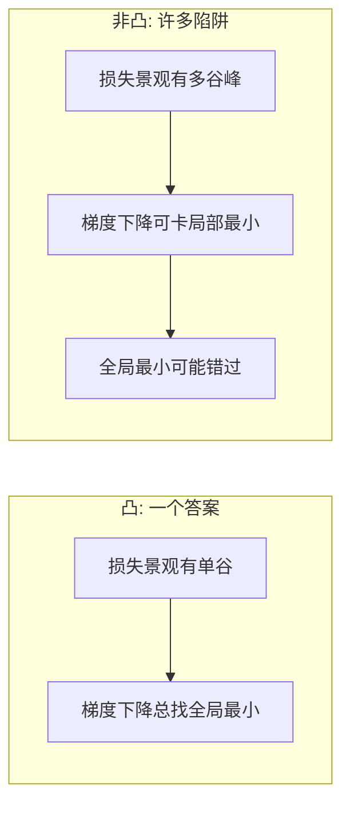
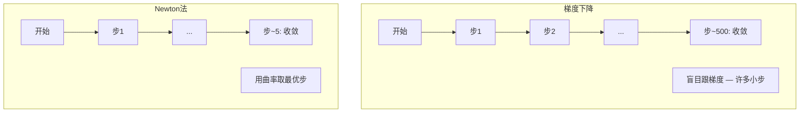
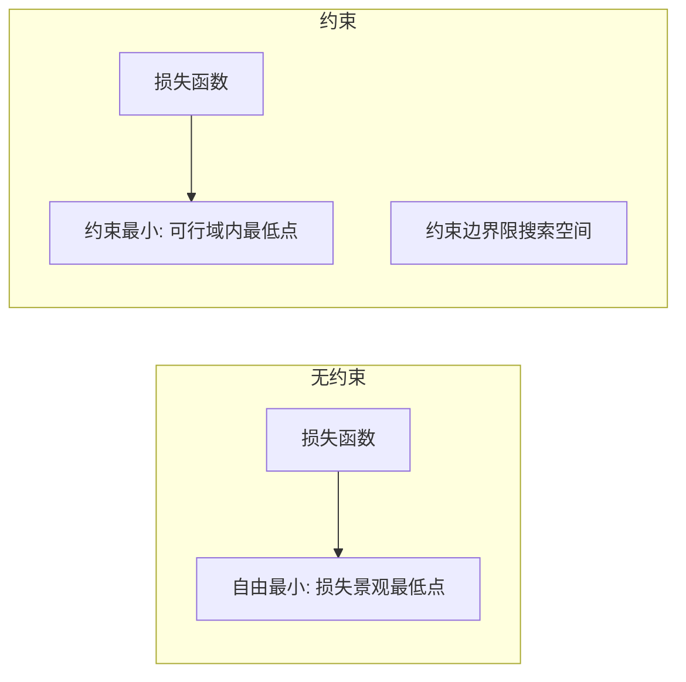
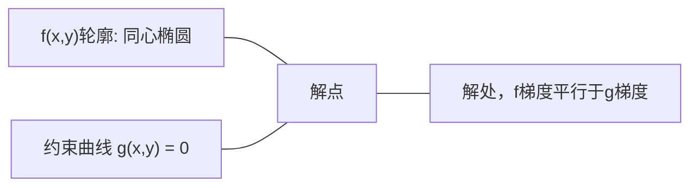

# 凸优化

> 凸问题只有一个谷。神经网络有百万。知区别重要。

**类型:** 构建
**语言:** Python
**前置要求:** 第1阶段，第04课(ML微积分)、第08课(优化)
**时间:** ~90分钟

## 学习目标

- 用定义、二阶导数、和Hessian准则测试函数是否凸
- 实现Newton法并比其二次收敛与梯度下降
- 用Lagrange乘数解约束优化问题并解释KKT条件
- 解释何神经网络损失景观非凸但SGD仍找到好解

## 问题背景

第08课教了梯度下降、动量、和Adam。这些优化器在任表面走下坡。但它们不带保证。梯度下降于非凸景观可能落入坏局部最小、卡在鞍点、或永远振荡。你仍用它因神经网络非凸且别无选择。

但ML许多问题凸。线性回归、逻辑回归、SVM、LASSO、岭回归。对这些，更强东西存在: 带数学保证的优化。凸问题恰有一个谷。任走下坡算法将达全局最小。无需重启。无需学习率调度。无需祈祷。

理解凸性做三事。第一，告诉你问题何易(凸)vs难(非凸)。第二，给凸问题更快工具如Newton法。第三，解释ML出现的概念: 正则化作约束、SVM对偶性、和为何深度学习工作尽管违反凸性给你的每好性质。

## 概念讲解

### 凸集

集合S凸若对S内任两点，其间线段也全在S内。

| 凸集 | 不凸 |
|---|---|
| **矩形**: 内部任两点可用留在内部的线段连接 | **星/月牙形**: 两内点间线段可穿过集合外 |
| **三角形**: 所以内点性质成立 | **甜甜圈/环**: 孔意味线段离集合 |
| 任两点间线段留在集合内 | 某些点对间线段离集合 |

形式测试: 对S内任点x、y和[0, 1]内任t，点tx + (1-t)y也在S内。

凸集例:
- 线、平面、全R^n
- 球(圆、球、超球)
- 半空间: {x : a^T x <= b}
- 任数量凸集交集

非凸集例:
- 甜甜圈(环)
- 两不相交圆并集
- 有"凹陷"或"孔"的任集合

### 凸函数

函数f凸若其域是凸集且对域内任两点x、y和[0, 1]内任t:

```
f(tx + (1-t)y) <= t*f(x) + (1-t)*f(y)
```

几何: 图上任两点间线段位于或高于图。

| 性质 | 凸函数 | 非凸函数 |
|---|---|---|
| **线段测试** | 图上任两点间线位于或高于曲线 | 图上某些点间线低于曲线 |
| **形状** | 单碗/谷向上弯 | 多峰谷混合曲率 |
| **局部最小** | 每局部最小是全局最小 | 可存在不同高度多局部最小 |

常见凸函数:
- f(x) = x^2 (抛物线)
- f(x) = |x| (绝对值)
- f(x) = e^x (指数)
- f(x) = max(0, x) (ReLU，虽分段线性)
- f(x) = -log(x) for x > 0 (负对数)
- 任线性函数f(x) = a^T x + b (既凸又凹)

### 测试凸性

三实用测试，从最易到最严格。

**测试1: 二阶导数测试(1D)。** 若对所有x f''(x) >= 0，则f凸。

- f(x) = x^2: f''(x) = 2 >= 0。凸。
- f(x) = x^3: f''(x) = 6x。x < 0时负。不凸。
- f(x) = e^x: f''(x) = e^x > 0。凸。

**测试2: Hessian测试(多变量)。** 若Hessian矩阵H(x)对所有x正半定，则f凸。Hessian是二阶偏导矩阵。

**测试3: 定义测试。** 直接检查不等式f(tx + (1-t)y) <= t*f(x) + (1-t)*f(y)。用于导数难算函数。

### 何凸性重要

凸优化中心定理:

**对凸函数，每局部最小是全局最小。**

这意味梯度下降不会被困。任下坡路径引至同答案。算法保证收敛至最优解。



后果:
- 无需随机重启
- 无需复杂学习率调度
- 收敛证明可能(率依赖函数性质)
- 解唯一(平坦区除外)

### ML中凸vs非凸

| 问题 | 凸? | 何 |
|---------|---------|-----|
| 线性回归(MSE) | 是 | 权重损失二次 |
| 逻辑回归 | 是 | 权重Log-loss凸 |
| SVM(hinge loss) | 是 | 线性函数最大值 |
| LASSO(L1回归) | 是 | 凸函数和凸 |
| 岭回归(L2) | 是 | 二次+二次=凸 |
| 神经网络(任损失) | 否 | 非线性激活造非凸景观 |
| k-means聚类 | 否 | 离散分配步骤 |
| 矩阵分解 | 否 | 未知数乘积 |

带凸损失线性模型凸。加非线性激活隐层一刻，凸性破。

### Hessian矩阵

函数f: R^n -> R的Hessian H是二阶偏导n x n矩阵。

```
H[i][j] = d^2 f / (dx_i dx_j)
```

对f(x, y) = x^2 + 3xy + y^2:

```
df/dx = 2x + 3y       d^2f/dx^2 = 2      d^2f/dxdy = 3
df/dy = 3x + 2y       d^2f/dydx = 3      d^2f/dy^2 = 2

H = [ 2  3 ]
    [ 3  2 ]
```

Hessian告诉你曲率:
- 全正特征值: 函数各方向向上弯(该点凸)
- 全负特征值: 各方向向下弯(凹，局部极大)
- 混合符号: 鞍点(某方向上弯某下)
- 零特征值: 该方向平(退化)

凸性要求Hessian处处正半定(全特征值 >= 0)，非仅一点。

### Newton法

梯度下降用一阶信息(梯度)。Newton法用二阶信息(Hessian)。它于当前点配二次逼近并跳到该二次最小。

```
更新规则:
  x_new = x - H^(-1) * gradient

比梯度下降:
  x_new = x - lr * gradient
```

Newton法替标量学习率为逆Hessian。这基于局部曲率自动调整步大小和方向。



优点:
- 最小附近二次收敛(每步误差平方)
- 无学习率需调
- 尺度不变(不管如何参数化问题都工作)

缺点:
- 计Hessian花O(n^2)内存O(n^3)逆
- 100万权重神经网络，那是10^12条目和10^18操作
- 深学习不实用

### 约束优化

无约束优化: 对所有x最小化f(x)。
约束优化: 满足约束最小化f(x)。

实际问题有约束。想最小化成本但预算有限。想最小化误差但模型复杂度有界。



### Lagrange乘数

Lagrange乘数法将约束问题转换为无约束。

问题: 约束g(x) = 0最小化f(x)。

解: 引新变量(Lagrange乘数lambda)解无约束问题:

```
L(x, lambda) = f(x) + lambda * g(x)
```

解处，L梯度零:

```
dL/dx = df/dx + lambda * dg/dx = 0
dL/dlambda = g(x) = 0
```

几何直觉: 约束最小处，f梯度须平行于约束g梯度。若非平行，可沿约束面移动进一步降f。



例: 约束x + y = 1最小化f(x,y) = x^2 + y^2。

```
L = x^2 + y^2 + lambda(x + y - 1)

dL/dx = 2x + lambda = 0  =>  x = -lambda/2
dL/dy = 2y + lambda = 0  =>  y = -lambda/2
dL/dlambda = x + y - 1 = 0

从前两: x = y
代入: 2x = 1，故x = y = 0.5, lambda = -1
```

线x + y = 1上离原点最近点是(0.5, 0.5)。

### KKT条件

Karush-Kuhn-Tucker条件扩展Lagrange乘数到不等式约束。

问题: 约束g_i(x) <= 0 for i = 1, ..., m最小化f(x)。

KKT条件(最优必要):

```
1. 静态性:    df/dx + sum(lambda_i * dg_i/dx) = 0
2. 原可行性:  g_i(x) <= 0  for all i
3. 对偶可行性:    lambda_i >= 0  for all i
4. 互补松弛:  lambda_i * g_i(x) = 0  for all i
```

互补松弛是关键洞察: 或约束活跃(g_i = 0，解坐边界)或乘数零(约束不重要)。不影响解的约束lambda = 0。

KKT条件对SVM核心。支持向量是约束活跃(lambda > 0)数据点。所有其他数据点lambda = 0不影响决策边界。

### 正则化作约束优化

L1和L2正则化非任意技巧。它们是伪装的约束优化问题。

**L2正则化(岭):**

```
最小化  Loss(w)  约束  ||w||^2 <= t

等价无约束形式:
最小化  Loss(w) + lambda * ||w||^2
```

约束||w||^2 <= t定义球(2D圆、3D球)。解是损失轮廓首次接触此球处。

**L1正则化(LASSO):**

```
最小化  Loss(w)  约束  ||w||_1 <= t

等价无约束形式:
最小化  Loss(w) + lambda * ||w||_1
```

约束||w||_1 <= t定义菱形(2D旋转正方形)。

| 性质 | L2约束(圆) | L1约束(菱) |
|---|---|---|
| **约束形状** | 圆(更高维球) | 菱(2D旋转正方形) |
| **损失轮廓触处** | 平边界 — 圆上任点 | 角 — 与轴对齐 |
| **解行为** | 权重小但非零 | 某些权重恰零(稀疏) |
| **结果** | 权重收缩 | 特征选择 |

这解释何L1产稀疏模型(特征选择)而L2仅缩权重。菱有与轴对齐角。损失轮廓更可能触角，置一个或多个权重恰零。

### 对偶

每约束优化问题(原)有伴随问题(对偶)。对凸问题，原和对偶有同最优值。这是强对偶。

Lagrange对偶函数:

```
原: 约束g(x) <= 0最小化f(x)
Lagrange: L(x, lambda) = f(x) + lambda * g(x)
对偶函数: d(lambda) = min_x L(x, lambda)
对偶问题: 约束lambda >= 0最大化d(lambda)
```

对偶重要原因:
- 对偶问题有时比原易解
- SVM于对偶形式解，问题依赖数据点间点积(启核技巧)
- 对偶提供原最优下界，用于检查解质量

对SVM具体:

```
原: 找w, b最大化margin 2/||w|| 约束
        y_i(w^T x_i + b) >= 1 for all i

对偶:   最大化sum(alpha_i) - 0.5 * sum_ij(alpha_i * alpha_j * y_i * y_j * x_i^T x_j)
        约束alpha_i >= 0和sum(alpha_i * y_i) = 0

对偶仅涉及点积x_i^T x_j。
替x_i^T x_j为K(x_i, x_j)得核技巧。
```

### 何深度学习工作尽管非凸性

神经网络损失函数狂非凸。按每经典标准，优化应失败。但随机梯度下降可靠找到好解。几因素解释此。

**大多局部最小够好。** 高维空间，随机临界点(梯度零处)压倒性是鞍点，非局部最小。存在少数局部最小倾向有接近全局最小的损失值。当参数空间百万维，被困糟糕局部最小极不可能。

**鞍点，非局部最小，是真正障碍。** n参数函数，鞍点有正负曲率方向混合。高维随机临界点，全n特征值正(局部最小)概率约2^(-n)。几乎所有临界点是鞍点。SGD噪声助逃离。

**过参平滑景观。** 参数多于训练样本网络有更平滑、更连通损失面。更宽网络有更少坏局部最小。这反直觉但经验一致。

**损失景观结构:**

| 性质 | 低维空间 | 高维空间 |
|---|---|---|
| **景观** | 许多孤立峰谷 | 平滑连通谷 |
| **最小** | 许多孤立局部最小 | 少坏局部最小; 大多近最优 |
| **导航** | 难找全局最小 | 多路引好解 |
| **临界点** | 局部最小鞍点混合 | 压倒性鞍点，非局部最小 |

**随机噪声作隐正则化。** 小批量SGD加噪声防止落入尖锐最小。尖锐最小过拟合; 平坦最小泛化。噪声偏向优化向损失景观平坦区。

### 实践二阶方法

纯Newton法对大模型不实用。几种近似使二阶信息可用。

**L-BFGS (有限内存BFGS):** 用最后m梯度差近似逆Hessian。需O(mn)内存而非O(n^2)。适~10,000参数问题。用于经典ML(逻辑回归、CRFs)非深学习。

**自然梯度:** 用Fisher信息矩阵(期望对数似然Hessian)替标准Hessian。这考虑概率分布几何。K-FAC (Kronecker因近似曲率)近似Fisher矩阵为Kronecker乘积，使其对神经网络实用。

**Hessian自由优化:** 用共轭梯度解Hx = g永不形成H。仅需Hessian向量积，可经自动微分O(n)时间算。

**对角近似:** Adam二阶矩是Hessian对角近似。AdaHessian经Hutchinson估计器用实际Hessian对角元素扩展此。

| 方法 | 内存 | 每步成本 | 何时用 |
|--------|--------|--------------|-------------|
| 梯度下降 | O(n) | O(n) | 基线，大模型 |
| Newton法 | O(n^2) | O(n^3) | 小凸问题 |
| L-BFGS | O(mn) | O(mn) | 中凸问题 |
| Adam | O(n) | O(n) | 深学习默认 |
| K-FAC | O(n) | O(n) 每层 | 研究，大批训练 |

## 动手实践

### 步1: 凸性检查器

建函数通过采样点检查定义测试凸性。

```python
import random
import math

def check_convexity(f, dim, bounds=(-5, 5), samples=1000):
    violations = 0
    for _ in range(samples):
        x = [random.uniform(*bounds) for _ in range(dim)]
        y = [random.uniform(*bounds) for _ in range(dim)]
        t = random.uniform(0, 1)
        mid = [t * xi + (1 - t) * yi for xi, yi in zip(x, y)]
        lhs = f(mid)
        rhs = t * f(x) + (1 - t) * f(y)
        if lhs > rhs + 1e-10:
            violations += 1
    return violations == 0, violations
```

### 步2: 2D Newton法

用显Hessian实现Newton法。比收敛速度与梯度下降。

```python
def newtons_method(f, grad_f, hessian_f, x0, steps=50, tol=1e-12):
    x = list(x0)
    history = [x[:]]
    for _ in range(steps):
        g = grad_f(x)
        H = hessian_f(x)
        det = H[0][0] * H[1][1] - H[0][1] * H[1][0]
        if abs(det) < 1e-15:
            break
        H_inv = [
            [H[1][1] / det, -H[0][1] / det],
            [-H[1][0] / det, H[0][0] / det],
        ]
        dx = [
            H_inv[0][0] * g[0] + H_inv[0][1] * g[1],
            H_inv[1][0] * g[0] + H_inv[1][1] * g[1],
        ]
        x = [x[0] - dx[0], x[1] - dx[1]]
        history.append(x[:])
        if sum(gi ** 2 for gi in g) < tol:
            break
    return history
```

### 步3: Lagrange乘数求解器

用梯度下降于Lagrange解约束优化。

```python
def lagrange_solve(f_grad, g_val, g_grad, x0, lr=0.01,
                   lr_lambda=0.01, steps=5000):
    x = list(x0)
    lam = 0.0
    history = []
    for _ in range(steps):
        fg = f_grad(x)
        gv = g_val(x)
        gg = g_grad(x)
        x = [
            xi - lr * (fgi + lam * ggi)
            for xi, fgi, ggi in zip(x, fg, gg)
        ]
        lam = lam + lr_lambda * gv
        history.append((x[:], lam, gv))
    return history
```

### 步4: 比一阶vs二阶

于同二次函数运行梯度下降和Newton法。计收敛步数。

```python
def quadratic(x):
    return 5 * x[0] ** 2 + x[1] ** 2

def quadratic_grad(x):
    return [10 * x[0], 2 * x[1]]

def quadratic_hessian(x):
    return [[10, 0], [0, 2]]
```

Newton法将1步收敛(二次恰)。梯度下降将需数百步因Hessian特征值差因子5，造长谷。

## 使用它

凸分析直接用于选择ML模型和求解器。

对凸问题(逻辑回归、SVM、LASSO):
- 用专用求解器(liblinear、CVXPY、scipy.optimize.minimize带method='L-BFGS-B')
- 期待唯一全局解
- 二阶方法实用快

对非凸问题(神经网络):
- 用一阶方法(SGD、Adam)
- 接受解依赖初始化和随机性
- 用过参、噪声、和调度作隐正则化
- 别费时找全局最小。好局部最小足够。

```python
from scipy.optimize import minimize

result = minimize(
    fun=lambda w: sum((y - X @ w) ** 2) + 0.1 * sum(w ** 2),
    x0=np.zeros(d),
    method='L-BFGS-B',
    jac=lambda w: -2 * X.T @ (y - X @ w) + 0.2 * w,
)
```

对SVM，对偶形式让你用核技巧:

```python
from sklearn.svm import SVC

svm = SVC(kernel='rbf', C=1.0)
svm.fit(X_train, y_train)
print(f"支持向量: {svm.n_support_}")
```

## 练习题

1. **凸性画廊。** 用检查器测试这些函数凸性: f(x) = x^4, f(x) = sin(x), f(x,y) = x^2 + y^2, f(x,y) = x*y, f(x) = max(x, 0)。解释每结果合理。

2. **Newton vs梯度下降赛跑。** 于f(x,y) = 50*x^2 + y^2从(10, 10)开始运行两方法。每需多少步达损失 < 1e-10？当条件数(Hessian最大最小特征值比)增时梯度下降发生什么？

3. **Lagrange乘数几何。** 约束x + 2y = 4最小化f(x,y) = (x-3)^2 + (y-3)^2。验解通过检查解处f梯度平行于g梯度。

4. **正则化约束。** 实现L1约束优化: 约束|x| + |y| <= 1最小化(x-3)^2 + (y-2)^2。示解有一坐标恰零(菱约束稀疏)。

5. **Hessian特征值分析。** 于(1,1)和(-1,1)算Rosenbrock函数Hessian。算两点特征值。特征值告诉你最小处vs远处曲率何？

## 关键术语

| 术语 | 含义 |
|------|---------------|
| 凸集 | 集合内任两点间线段留在集合内的集合 |
| 凸函数 | 图上任两点间线位于或高于图的函数。等价，Hessian处处正半定 |
| 局部最小 | 比所有附近点低的点。对凸函数，每局部最小是全局最小 |
| 全局最小 | 函数全域最低点 |
| Hessian矩阵 | 全二阶偏导矩阵。编码曲率信息 |
| 正半定 | 特征值全非负矩阵。多维类比"二阶导 >= 0" |
| 条件数 | Hessian最大最小特征值比。高条件数意味长谷和慢梯度下降 |
| Newton法 | 用逆Hessian定步方向和大小二阶优化器。最小附近二次收敛 |
| Lagrange乘数 | 引入变量将约束优化转换为无约束 |
| KKT条件 | 不等式约束最优必要条件。推广Lagrange乘数 |
| 互补松弛 | 解处，或约束活跃或其乘数零。绝不同时非零 |
| 对偶 | 每约束问题有伴随对偶问题。对凸问题，两者同最优值 |
| 强对偶 | 原对偶最优值相等。对满足Slater条件凸问题成立 |
| L-BFGS | 存最后m梯度差替全Hessian近似二阶方法 |
| 鞍点 | 梯度零但某方向最小某方向最大的点 |
| 过参 | 用参数多于训练样本。平滑损失景观减坏局部最小 |

## 延伸阅读

- [Boyd & Vandenberghe: 凸优化](https://web.stanford.edu/~boyd/cvxbook/) — 标准教科书，免费在线
- [Bottou, Curtis, Nocedal: 大规模机器学习优化方法 (2018)](https://arxiv.org/abs/1606.04838) — 桥接凸优化理论和深学习实践
- [Choromanska等: 多层网络损失景观 (2015)](https://arxiv.org/abs/1412.0233) — 何非凸神经网络景观非想象般糟
- [Nocedal & Wright: 数值优化](https://link.springer.com/book/10.1007/978-0-387-40065-5) — Newton法、L-BFGS、和约束优化综合参考