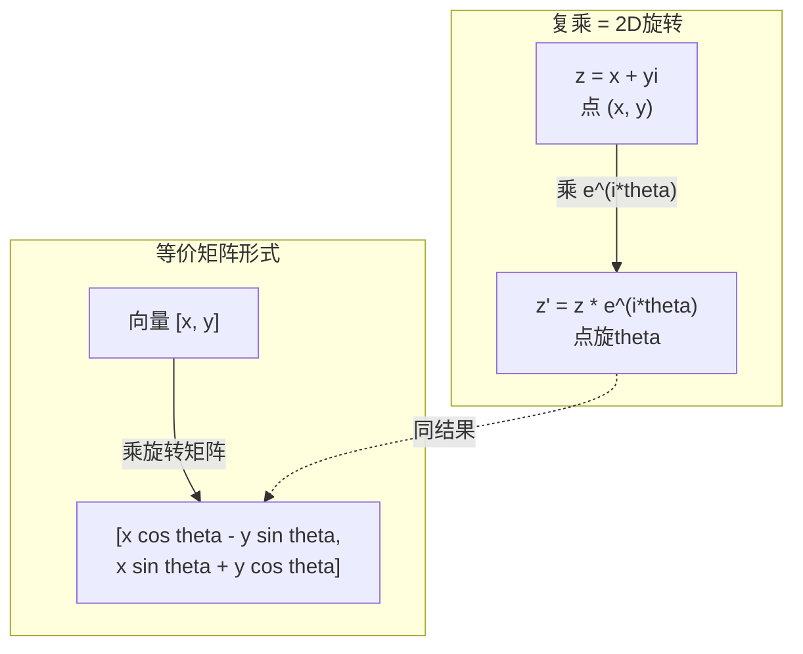
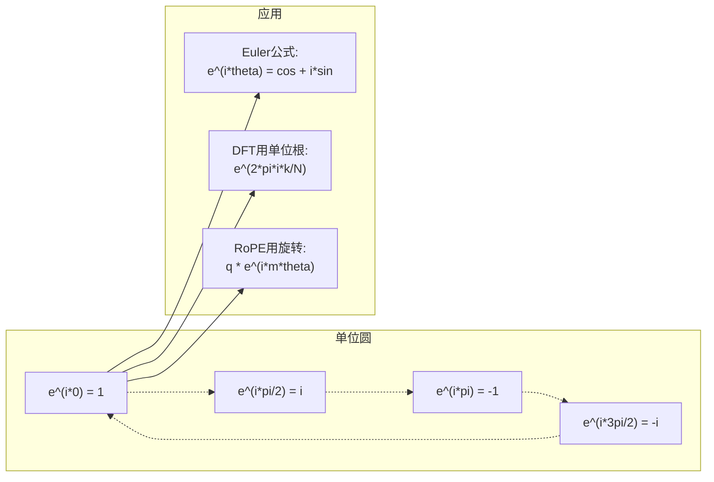

# AI复数

> -1的平方根不虚构。它是旋转、频率和半信号处理的钥匙。

**类型:** 学习
**语言:** Python
**前置要求:** 第1阶段，第01-04课(线性代数、微积分)
**时间:** ~60分钟

## 学习目标

- 在矩形和极坐标形式下执行复数运算(加、乘、除、共轭)
- 应用Euler公式在复指数和三角函数间转换
- 用复单位根实现离散傅里叶变换
- 解释复旋转如何支撑RoPE和transformer中的正弦位置编码

## 问题背景

你打开一篇傅里叶变换论文，到处是`i`。你看transformer位置编码，见不同频率的`sin`和`cos`——复指数的实虚部。你读量子计算，发现一切表达在复向量空间。

复数似抽象。建于-1平方根的数系感觉像数学技巧。但非技巧。是旋转和振荡的自然语言。每当某物旋转、振动、或振荡，复数是正确工具。

不懂复数，你不懂离散傅里叶变换。不懂FFT。不懂RoPE(旋转位置嵌入)在现代语言模型何工作。不懂原Transformer论文的正弦位置编码何以那些频率。

这课从头构建复数运算，连几何，展示复数何处于机器学习。

## 概念讲解

### 何为复数？

复数有两部：实部和虚部。

```
z = a + bi

其中:
  a是实部
  b是虚部
  i是虚数单位，定义i^2 = -1
```

仅此。你把数线延成平面。实数坐一轴。虚数坐另一。每复数是该平面一点。

### 复数运算

**加法。** 实部加实部，虚部加虚部。

```
(a + bi) + (c + di) = (a + c) + (b + d)i

例: (3 + 2i) + (1 + 4i) = 4 + 6i
```

**乘法。** 用分配律并记i^2 = -1。

```
(a + bi)(c + di) = ac + adi + bci + bdi^2
                 = ac + adi + bci - bd
                 = (ac - bd) + (ad + bc)i

例: (3 + 2i)(1 + 4i) = 3 + 12i + 2i + 8i^2
                       = 3 + 14i - 8
                       = -5 + 14i
```

**共轭。** 翻虚部符号。

```
(a + bi)的共轭 = a - bi
```

复数与其共轭积总实:

```
(a + bi)(a - bi) = a^2 + b^2
```

**除法。** 乘分子分母于分母共轭。

```
(a + bi) / (c + di) = (a + bi)(c - di) / (c^2 + d^2)
```

这消分母虚部，得干净复数。

### 复平面

复平面映射每复数到2D点。横轴实轴，纵轴虚轴。

```
z = 3 + 2i  对应点 (3, 2)
z = -1 + 0i 对应点 (-1, 0) 在实轴
z = 0 + 4i  对应点 (0, 4) 在虚轴
```

复数同时是点和原点向量。此双重解释是复数用于几何之故。

### 极坐标形式

平面任点可由其离原点距离和与正实轴角描述。

```
z = r * (cos(theta) + i*sin(theta))

其中:
  r = |z| = sqrt(a^2 + b^2)     (模)
  theta = atan2(b, a)             (相位或辐角)
```

矩形形式(a + bi)适合加法。极坐标形式(r, theta)适合乘法。

**极坐标乘法。** 模乘模，角加角。

```
z1 = r1 * e^(i*theta1)
z2 = r2 * e^(i*theta2)

z1 * z2 = (r1 * r2) * e^(i*(theta1 + theta2))
```

此是复数完美用于旋转之因。乘模1复数是纯旋转。

### Euler公式

复指数和三角桥:

```
e^(i*theta) = cos(theta) + i*sin(theta)
```

这是本课最重要公式。theta = pi时:

```
e^(i*pi) = cos(pi) + i*sin(pi) = -1 + 0i = -1

故: e^(i*pi) + 1 = 0
```

五基本常数(e, i, pi, 1, 0)联于一方程。

### Euler公式何对ML重要

Euler公式言`e^(i*theta)`随theta变绘单位圆。theta = 0，你在(1, 0)。theta = pi/2，你在(0, 1)。theta = pi，你在(-1, 0)。theta = 3*pi/2，你在(0, -1)。全旋theta = 2*pi。

此意复指数即旋转。旋转到处在信号处理和ML。

### 连2D旋转

乘复数(x + yi)于e^(i*theta)旋转点(x, y)theta角绕原点。

```
复乘旋转:
  (x + yi) * (cos(theta) + i*sin(theta))
  = (x*cos(theta) - y*sin(theta)) + (x*sin(theta) + y*cos(theta))i

矩阵乘旋转:
  [cos(theta)  -sin(theta)] [x]   [x*cos(theta) - y*sin(theta)]
  [sin(theta)   cos(theta)] [y] = [x*sin(theta) + y*cos(theta)]
```

二者产同结果。复乘即2D旋转。旋转矩阵只是矩阵记法复乘。



### 相量和旋信号

复指数e^(i*omega*t)是绕单位圆角频率omega旋点。t增，点绘圆。

此旋点实部是cos(omega*t)。虚部sin(omega*t)。正弦信号是旋复数投影。

```
e^(i*omega*t) = cos(omega*t) + i*sin(omega*t)

实部:      cos(omega*t)    -- 余弦波
虚部: sin(omega*t)    -- 正弦波
```

这是相量表示。代追踪晃荡正弦，你追踪平滑旋箭。相移变角偏移。幅变变模变。信号加变向量加。

### 单位根

N次单位根是单位圆上N等距点:

```
w_k = e^(2*pi*i*k/N)    for k = 0, 1, 2, ..., N-1
```

N = 4，根是: 1, i, -1, -i(四罗盘点)。
N = 8，你得四罗盘点加四对角线。

单位根是离散傅里叶变换基础。DFT分解信号于这N等距频率分量。

### 连DFT

信号x[0], x[1], ..., x[N-1]的离散傅里叶变换是:

```
X[k] = sum_{n=0}^{N-1} x[n] * e^(-2*pi*i*k*n/N)
```

每X[k]测信号与第k单位根相关度——频率k的复正弦。DFT分信号成N旋相量并告每幅相。

### i非虚构

"虚"是历史意外。Descartes用它贬义。但i不比负数初拒时更虚。负数答"何从3减5得？"虚单位答"何平方得-1？"

更用:i是90度旋算子。乘实数i一次，旋90度至虚轴。再乘i(i^2)，又旋90度——今指向负实向。此是i^2 = -1之故。不神秘。是两四分之一转建半转。

此是复数到处工程之因。凡旋——电磁波、量子态、信号振荡、位置编码——自然用复数描述。

### 复指数vs三角函数

Euler公式前，工程师写信号A*cos(omega*t + phi)——幅A、频omega、相phi。这工作但算术苦。加两不同相余弦需三角恒等。

用复指数，同信号A*e^(i*(omega*t + phi))。加两信号仅加两复数。乘(调制)仅乘模加角。相移变角加。频移变相量乘。

全信号处理换复指数记法因数学更清。"实信号"总只是复表示实部。虚部沿记账，使代数自然工作。

### 连transformer

**正弦位置编码**(原Transformer论文):

```
PE(pos, 2i) = sin(pos / 10000^(2i/d))
PE(pos, 2i+1) = cos(pos / 10000^(2i/d))
```

sin和cos对是不同频率复指数实虚部。每频率提供编码位置不同"分辨率"。低频变慢(粗位置)。高频变快(细位置)。合给每位置独一频率指纹。

**RoPE(旋转位置嵌入)**更进一步。显式乘查询键向量于复旋转矩阵。两token间相对位置变旋角。注意力用此旋向量算，使模型对相对位置敏感经复乘。

| 操作 | 代数形式 | 几何意义 |
|------|----------|----------|
| 加法 | (a+c) + (b+d)i | 平面向量加 |
| 乘法 | (ac-bd) + (ad+bc)i | 旋转缩放 |
| 共轭 | a - bi | 实轴反射 |
| 模 | sqrt(a^2 + b^2) | 离原点距 |
| 相位 | atan2(b, a) | 与正实轴角 |
| 除法 | 乘共轭 | 反旋重缩 |
| 幂 | r^n * e^(i*n*theta) | 旋n次，缩r^n |



## 构建它

### 步1: 复数类

建复数类支持运算、模、相位、矩形极坐标转换。

```python
import math

class Complex:
    def __init__(self, real, imag=0.0):
        self.real = real
        self.imag = imag

    def __add__(self, other):
        return Complex(self.real + other.real, self.imag + other.imag)

    def __mul__(self, other):
        r = self.real * other.real - self.imag * other.imag
        i = self.real * other.imag + self.imag * other.real
        return Complex(r, i)

    def __truediv__(self, other):
        denom = other.real ** 2 + other.imag ** 2
        r = (self.real * other.real + self.imag * other.imag) / denom
        i = (self.imag * other.real - self.real * other.imag) / denom
        return Complex(r, i)

    def magnitude(self):
        return math.sqrt(self.real ** 2 + self.imag ** 2)

    def phase(self):
        return math.atan2(self.imag, self.real)

    def conjugate(self):
        return Complex(self.real, -self.imag)
```

### 步2: 极坐标转换和Euler公式

```python
def to_polar(z):
    return z.magnitude(), z.phase()

def from_polar(r, theta):
    return Complex(r * math.cos(theta), r * math.sin(theta))

def euler(theta):
    return Complex(math.cos(theta), math.sin(theta))
```

验:`euler(theta).magnitude()`应总1.0。`euler(0)`应给(1, 0)。`euler(pi)`应给(-1, 0)。

### 步3: 旋转

旋点(x, y)theta角是一复乘:

```python
point = Complex(3, 4)
rotated = point * euler(math.pi / 4)
```

模不变。仅角变。

### 步4: 从复算术DFT

```python
def dft(signal):
    N = len(signal)
    result = []
    for k in range(N):
        total = Complex(0, 0)
        for n in range(N):
            angle = -2 * math.pi * k * n / N
            total = total + Complex(signal[n], 0) * euler(angle)
        result.append(total)
    return result
```

这是O(N^2) DFT。每输出X[k]是信号样乘单位根和。

### 步5: 逆DFT

逆DFT从频谱重建原信号。与前DFT仅变:翻指数符号并除N。

```python
def idft(spectrum):
    N = len(spectrum)
    result = []
    for n in range(N):
        total = Complex(0, 0)
        for k in range(N):
            angle = 2 * math.pi * k * n / N
            total = total + spectrum[k] * euler(angle)
        result.append(Complex(total.real / N, total.imag / N))
    return result
```

这给你完美重建。施DFT，再IDFT，你得回原信号到机器精度。无信息失。

### 步6: 单位根

```python
def roots_of_unity(N):
    return [euler(2 * math.pi * k / N) for k in range(N)]
```

验两性质:
- 每根模恰1。
- 全N根和零(对称消)。

这些性质使DFT可逆。单位根成频域正交基。

## 使用它

Python内置复数支持。字面`j`代表虚单位。

```python
z = 3 + 2j
w = 1 + 4j

print(z + w)
print(z * w)
print(abs(z))

import cmath
print(cmath.phase(z))
print(cmath.exp(1j * cmath.pi))
```

对数组，numpy原生处理复数:

```python
import numpy as np

z = np.array([1+2j, 3+4j, 5+6j])
print(np.abs(z))
print(np.angle(z))
print(np.conj(z))
print(np.real(z))
print(np.imag(z))

signal = np.sin(2 * np.pi * 5 * np.linspace(0, 1, 128))
spectrum = np.fft.fft(signal)
freqs = np.fft.fftfreq(128, d=1/128)
```

## 产出成果

运`code/complex_numbers.py`生`outputs/skill-complex-arithmetic.md`。

## 练习题

1. **手算复数。** 算(2 + 3i) * (4 - i)并用代码验。再算(5 + 2i) / (1 - 3i)。绘两结果于复平面并验乘法旋缩第一数。

2. **旋转序列。** 从点(1, 0)开始。乘e^(i*pi/6)十二次。验12次乘后回(1, 0)。印每步坐标并认它们绘正12边形。

3. **已知信号DFT。** 信号sin(2*pi*3*t)加0.5*sin(2*pi*7*t)32点样。运DFT。验幅谱于频率3和7有峰，7峰高半3峰。

4. **单位根可视化。** 算8次单位根。验它们和零。验乘任根于本原根e^(2*pi*i/8)得下一根。

5. **旋转矩阵等价。** 对10随机角和10随机点，验复乘给同结果于2x2旋转矩阵向量乘。印最大数值差。

## 关键术语

| 术语 | 含义 |
|------|------|
| 复数 | 数a + bi其中a实部、b虚部、i^2 = -1 |
| 虚单位 | 数i，定义i^2 = -1。非哲学虚构——是旋算子 |
| 复平面 | 2D平面x轴实y轴虚。亦称Argand平面 |
| 模 | 离原点距: sqrt(a^2 + b^2)。写\|z\| |
| 相位(辐角) | 与正实轴角: atan2(b, a)。写arg(z) |
| 共轭 | 实轴镜像: a + bi的共轭是a - bi |
| 极坐标形式 | 表z为r * e^(i*theta)代a + bi。使乘易 |
| Euler公式 | e^(i*theta) = cos(theta) + i*sin(theta)。连指数和三角 |
| 相量 | 旋复数e^(i*omega*t)代表正弦信号 |
| 单位根 | N复数e^(2*pi*i*k/N) for k = 0到N-1。单位圆上N等距点 |
| DFT | 离散傅里叶变换。用单位根分解信号成复正弦分量 |
| RoPE | 旋转位置嵌入。用复乘编码transformer注意力相对位置 |

## 延伸阅读

- [Euler公式视觉介绍](https://betterexplained.com/articles/intuitive-understanding-of-eulers-formula/) - 建几何直觉无重符号
- [Su等: RoFormer (2021)](https://arxiv.org/abs/2104.09864) - 引旋转位置嵌入用复旋论文
- [Vaswani等: Attention Is All You Need (2017)](https://arxiv.org/abs/1706.03762) - 原Transformer论文正弦位置编码
- [3Blue1Brown: Euler公式与入门群论](https://www.youtube.com/watch?v=mvmuCPvRoWQ) - 何e^(i*pi) = -1视觉解释
- [Needham: 视觉复分析](https://global.oup.com/academic/product/visual-complex-analysis-9780198534464) - 复数最佳视觉处理，充满几何洞察
- [Strang: 线性代数入门，第10章](https://math.mit.edu/~gs/linearalgebra/) - 线性代数和特征值背景复数