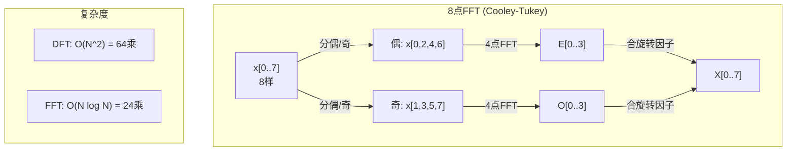
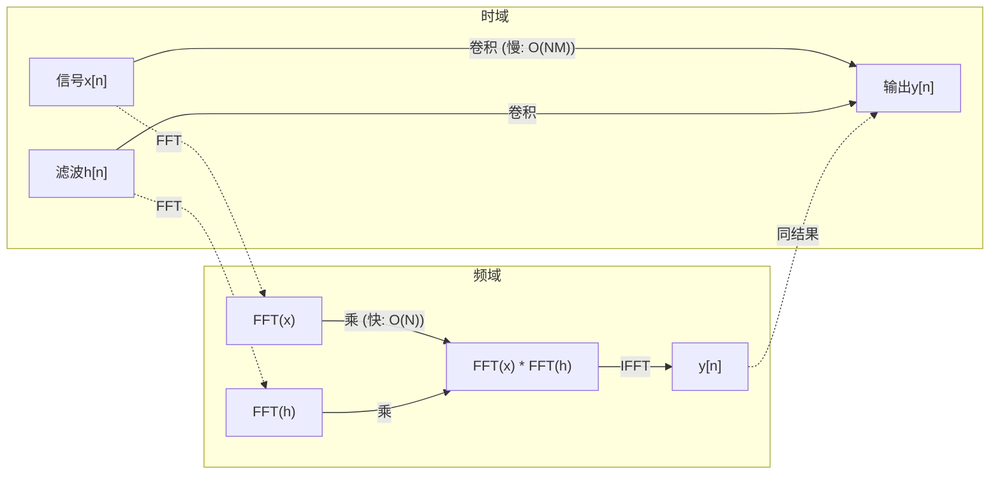

# 傅里叶变换

> 每个信号都是正弦波之和。傅里叶变换告诉你是哪些。

**类型:** 构建
**语言:** Python
**前置要求:** 第1阶段，第01-04课、第19课(复数)
**时间:** ~90分钟

## 学习目标

- 从头实现DFT并验于O(N log N) Cooley-Tukey FFT
- 解读频率系数: 从信号提取幅、相位和功率谱
- 用卷积定理经FFT乘执行卷积
- 连傅里叶频分解于transformer位置编码和CNN卷积层

## 问题背景

音频录是一时序压力测量。股价是一时序日值。图像是一空间像素强度网格。皆时域(或空域)数据。你见值在某索引变。

但许多模式时域不可见。这音频信号是纯音还是和弦？这股价有周周期吗？这图像有重复纹理吗？这些问关于频率内容，时域藏之。

傅里叶变换转数据时域到频域。取信号并分解成正弦波不同频率。每正弦波有幅(何强)和相位(何始)。傅里叶变换告你两者。

这对ML重要因频域思维到处现。卷积神经网络执行卷积，即频域乘。Transformer位置编码用频分解表示位置。音频模型(语音识别、音乐生成)运于频谱图——声音频表示。时间序列模型找周期模式。懂傅里叶变换给你词汇与这些工。

## 概念讲解

### DFT定义

给N样x[0], x[1], ..., x[N-1]，离散傅里叶变换产N频率系数X[0], X[1], ..., X[N-1]:

```
X[k] = sum_{n=0}^{N-1} x[n] * e^(-2*pi*i*k*n/N)

for k = 0, 1, ..., N-1
```

每X[k]是复数。其模|X[k]|告你频率k幅。其相位angle(X[k])告该频率相位偏移。

核心洞察:`e^(-2*pi*i*k*n/N)`是频率k旋相量。DFT算信号与每N等距频率相关度。若信号含频率k能量，相关大。否则近零。

### 每系数含义

**X[0]: DC分量。** 这是全样和——比例于均值。代表信号常数(零频率)偏移。

```
X[0] = sum_{n=0}^{N-1} x[n] * e^0 = 全样和
```

**X[k] for 1 <= k <= N/2: 正频率。** X[k]代表频率k周每N样。高k意高频(快振荡)。

**X[N/2]: Nyquist频率。** N样可表最高频。上此，你得混叠——高频伪装低频。

**X[k] for N/2 < k < N: 负频率。** 对实值信号，X[N-k] = conj(X[k]。负频率是正频率镜像。此是有用信息在前N/2 + 1系数之故。

### 逆DFT

逆DFT从频率系数重建原信号:

```
x[n] = (1/N) * sum_{k=0}^{N-1} X[k] * e^(2*pi*i*k*n/N)

for n = 0, 1, ..., N-1
```

与前DFT仅差:指数符号正(非负)，并1/N归一因子。

逆DFT是完美重建。无信息失。你可从时域到频域回无误差。DFT是基变换——它重表达同信息于不同坐标系。

### FFT: 使之快

上定义DFT是O(N^2): 每N输出系数，你和对N输入样。对N = 1百万，那是10^12操作。

快速傅里叶变换(FFT)算同结果O(N log N)。对N = 1百万，那约20百万操作代万亿。这是使频分析实用。

Cooley-Tukey算法(最常见FFT)分治:

1. 分信号成偶索引和奇索引样。
2. 递归算每半DFT。
3. 用"旋转因子"e^(-2*pi*i*k/N)合两半DFT。

```
X[k] = E[k] + e^(-2*pi*i*k/N) * O[k]          for k = 0, ..., N/2 - 1
X[k + N/2] = E[k] - e^(-2*pi*i*k/N) * O[k]    for k = 0, ..., N/2 - 1

其中E = 偶索引样DFT
      O = 奇索引样DFT
```

对称意每递归层O(N)工，有log2(N)层。总: O(N log N)。



FFT需信号长是2幂。实践，信号零填至下2幂。

### 频谱分析

**功率谱**是|X[k]|^2——每频率系数平方模。示每频何能量。

**相位谱**是angle(X[k])——每频率相位偏移。大多分析任务，你关心功率谱忽略相位。

```
频率k功率:  P[k] = |X[k]|^2 = X[k].real^2 + X[k].imag^2
频率k相位:  phi[k] = atan2(X[k].imag, X[k].real)
```

### 频率分辨率

DFT频率分辨率依赖样数N和采样率fs。

```
箱k频率:      f_k = k * fs / N
频率分辨率:    delta_f = fs / N
最大频率:       f_max = fs / 2  (Nyquist)
```

解两近频率，你需更多样。捕高频，你需更高采样率。

### 卷积定理

这是信号处理最重要结果，直接关CNN。

**时域卷积等于频域逐点乘。**

```
x * h = IFFT(FFT(x) . FFT(h))

其中*是卷积，.是逐元乘
```

何重要:

- 长N和M两信号直卷积O(N*M)操作。
- FFT基卷积O(N log N): 变换两，乘，变换回。
- 对大核，FFT卷积显著快。
- 这正是大感受野卷积层发生。

注:DFT算圆卷积(信号绕)。对线卷积(无绕)，零填两信号至长N + M - 1前算。



### 窗函数

DFT假设信号周期——它视N样为无限重复信号一周期。若信号不始终同值，这造边界不连续，现假高频内容。称频谱泄漏。

窗函数减少泄漏通过 taper信号至两端零前算DFT。

常用窗:

| 窗 | 形 | 主瓣宽 | 旁瓣级 | 用例 |
|----|-----|---------|---------|------|
| 方形 | 平(无窗) | 最窄 | 最高(-13 dB) | 当信号恰周期于N样 |
| Hann | 升余弦 | 中 | 低(-31 dB) | 通频谱分析 |
| Hamming | 修余弦 | 中 | 低(-42 dB) | 音频处理、语音分析 |
| Blackman | 三余弦 | 宽 | 极低(-58 dB) | 当旁瓣抑制关键 |

```
Hann窗:    w[n] = 0.5 * (1 - cos(2*pi*n / (N-1)))
Hamming窗: w[n] = 0.54 - 0.46 * cos(2*pi*n / (N-1))
```

施窗DFT前逐元乘信号:`X = DFT(x * w)`。

### DFT性质

| 性质 | 时域 | 频域 |
|------|------|------|
| 线性 | a*x + b*y | a*X + b*Y |
| 时移 | x[n - k] | X[f] * e^(-2*pi*i*f*k/N) |
| 频移 | x[n] * e^(2*pi*i*f0*n/N) | X[f - f0] |
| 卷积 | x * h | X * H (逐点) |
| 乘法 | x * h (逐点) | X * H (圆卷积，缩1/N) |
| Parseval定理 | sum \|x[n]\|^2 | (1/N) * sum \|X[k]\|^2 |
| 共轭对称(实输入) | x[n]实 | X[k] = conj(X[N-k]) |

Parseval定理言总能两域同。能经变换守恒。

### 连位置编码

原Transformer用正弦位置编码:

```
PE(pos, 2i)   = sin(pos / 10000^(2i/d_model))
PE(pos, 2i+1) = cos(pos / 10000^(2i/d_model))
```

每维对(2i, 2i+1)不同频率振荡。频率几何距从高(维0,1)到低(末维)。这给每位置所有频带独一模式——类似傅里叶系数独一识信号。

这提供关键性质:

- **独一性:** 无两位置同编码。
- **有界值:** sin和cos总在[-1, 1]。
- **相对位置:** 位置p+k编码可表为位置p编码线函。模型可学相对位置注意力。

### 连CNN

卷积层用学滤波(核)施输入通过滑动信号或图像。数学，这是卷积运算。

据卷积定理，这等价:
1. FFT输入
2. FFT核
3. 频域乘
4. IFFT结果

标准CNN实现用直卷积(对小3x3核更快)。但对大核或全局卷积，FFT基法显著快。些架构(如FNet)换注意力全FFT，达竞争精度O(N log N)代O(N^2)复杂。

### 频谱图和短时傅里叶变换

单FFT给你全信号频内容，但告你何频率何时出现零。chirp(频率随时增信号)和和弦(全频率同时现)可有同幅谱。

短时傅里叶变换(STFT)解此通过算重叠窗信号FFT。结果是频谱图:2D表示一时轴一频轴。每点强度示该时该频能量。

```
STFT程序:
1. 选窗大小(如，1024样)
2. 选跳大小(如，256样——75%重叠)
3. 对每窗位置:
   a. 提窗段
   b. 施Hann/Hamming窗
   c. 算FFT
   d. 存幅谱作频谱图一列
```

频谱图是音频ML模型标准输入表示。语音识别模型(Whisper, DeepSpeech)运于mel频谱图——频率映射mel尺频谱图，更好匹配人音感知。

### 混叠

若信号含频率上fs/2(Nyquist频率)，采样率fs采样造混叠副本。90 Hz信号100 Hz样看同10 Hz信号。无从样区分。

```
例:
  真信号: 90 Hz正弦波
  采样率: 100 Hz
  显频率: 100 - 90 = 10 Hz

  90 Hz信号100 Hz采样率样
  同10 Hz信号样。
  无数学可恢复原90 Hz。
```

这是模数转换器含抗混叠滤波采样前移Nyquist上频率之故。ML，混叠现当下采样特征图无适低通滤波——些架构用抗混叠池层解。

### 零填不增分辨率

常见误解:FFT前零填信号改善频率分辨率。不。零填插现有频箱间，给更平滑谱。但不能揭示原样不存频细节。

真频率分辨率仅依赖观测时T = N / fs。解两频率距delta_f，你需至少T = 1 / delta_f秒数据。无零填改此基本限。

## 构建它

### 步1: 从头DFT

O(N^2) DFT直从定义。

```python
import math

class Complex:
    ...

def dft(x):
    N = len(x)
    result = []
    for k in range(N):
        total = Complex(0, 0)
        for n in range(N):
            angle = -2 * math.pi * k * n / N
            w = Complex(math.cos(angle), math.sin(angle))
            xn = x[n] if isinstance(x[n], Complex) else Complex(x[n])
            total = total + xn * w
        result.append(total)
    return result
```

### 步2: 逆DFT

同结构，正指数，除N。

```python
def idft(X):
    N = len(X)
    result = []
    for n in range(N):
        total = Complex(0, 0)
        for k in range(N):
            angle = 2 * math.pi * k * n / N
            w = Complex(math.cos(angle), math.sin(angle))
            total = total + X[k] * w
        result.append(Complex(total.real / N, total.imag / N))
    return result
```

### 步3: FFT (Cooley-Tukey)

递归FFT需2幂长。分偶奇，递归，合旋转因子。

```python
def fft(x):
    N = len(x)
    if N <= 1:
        return [x[0] if isinstance(x[0], Complex) else Complex(x[0])]
    if N % 2 != 0:
        return dft(x)

    even = fft([x[i] for i in range(0, N, 2)])
    odd = fft([x[i] for i in range(1, N, 2)])

    result = [Complex(0)] * N
    for k in range(N // 2):
        angle = -2 * math.pi * k / N
        twiddle = Complex(math.cos(angle), math.sin(angle))
        t = twiddle * odd[k]
        result[k] = even[k] + t
        result[k + N // 2] = even[k] - t
    return result
```

### 步4: 频谱分析工具

```python
def power_spectrum(X):
    return [xk.real ** 2 + xk.imag ** 2 for xk in X]

def convolve_fft(x, h):
    N = len(x) + len(h) - 1
    padded_N = 1
    while padded_N < N:
        padded_N *= 2

    x_padded = x + [0.0] * (padded_N - len(x))
    h_padded = h + [0.0] * (padded_N - len(h))

    X = fft(x_padded)
    H = fft(h_padded)

    Y = [xk * hk for xk, hk in zip(X, H)]

    y = idft(Y)
    return [y[n].real for n in range(N)]
```

## 使用它

真工，用numpy FFT背高优C库。

```python
import numpy as np

signal = np.sin(2 * np.pi * 5 * np.arange(256) / 256)
spectrum = np.fft.fft(signal)
freqs = np.fft.fftfreq(256, d=1/256)

power = np.abs(spectrum) ** 2

positive_freqs = freqs[:len(freqs)//2]
positive_power = power[:len(power)//2]
```

对窗和更进频谱分析:

```python
from scipy.signal import windows, stft

window = windows.hann(256)
windowed = signal * window
spectrum = np.fft.fft(windowed)
```

对卷积:

```python
from scipy.signal import fftconvolve

result = fftconvolve(signal, kernel, mode='full')
```

对频谱图:

```python
from scipy.signal import stft

frequencies, times, Zxx = stft(signal, fs=sample_rate, nperseg=256)
spectrogram = np.abs(Zxx) ** 2
```

频谱图矩阵形(n_frequencies, n_time_frames)。每列是一时窗功率谱。这是音频ML模型消耗输入。

## 产出成果

运`code/fourier.py`生`outputs/prompt-spectral-analyzer.md`。

## 练习题

1. **纯音识别。** 建含单正弦波未知频率(1到50 Hz间)信号，128 Hz采1秒。用DFT识频率。验答匹配。今加标准差0.5 Gaussian噪并重复。噪声何影响谱？

2. **FFT vs DFT验。** 生64长随机信号。算DFT (O(N^2))和FFT。验全系数匹配1e-10内。时两函数于256, 512, 1024, 2048长信号。绘DFT时间比FFT时间比。

3. **卷积定理例证。** 建信号x = [1, 2, 3, 4, 0, 0, 0, 0]和滤波h = [1, 1, 1, 0, 0, 0, 0, 0]。算它们圆卷积直(嵌循)。然后经FFT算(变换，乘，逆变换)。验结果匹配。今做线卷积适零填。

4. **窗效果。** 建10 Hz和12 Hz(极近)两正弦波和信号。128 Hz采1秒。算功率谱无窗、Hann窗、Hamming窗。哪窗使易辨两峰？何？

5. **位置编码分析。** 生d_model = 128和max_pos = 512正弦位置编码。对每位置对(p1, p2)，算编码点积。示点积仅依赖|p1 - p2|，非绝对位置。距增时点积何发生？

## 关键术语

| 术语 | 含义 |
|------|------|
| DFT(离散傅里叶变换) | 转N时域样成N频域系数。每系数是与该频复正弦相关 |
| FFT(快速傅里叶变换) | 算DFT的O(N log N)算法。Cooley-Tukey算法分偶/奇索引递归 |
| 逆DFT | 从频率系数重建时域信号。同DFT公式翻指数符号并1/N缩 |
| 频率箱 | DFT输出每索引k代表频率k*fs/N Hz。"箱"是离散频率槽 |
| DC分量 | X[0]，零频率系数。比例于信号均值 |
| Nyquist频率 | fs/2，采样率fs可表最高频。上此频率混叠 |
| 功率谱 | \|X[k]\|^2，每频率系数平方模。示能量分布跨频率 |
| 相位谱 | angle(X[k])，每频率分量相位偏移。常分析忽略 |
| 频谱泄漏 | 假频内容由视非周期信号周期造。窗函数减 |
| 窗函数 | taper函数(Hann, Hamming, Blackman)DFT前施减频谱泄漏 |
| 旋转因子 | 复指数e^(-2*pi*i*k/N)用于FFT蝶形计算合子DFT |
| 卷积定理 | 时域卷积等于频域逐点乘。信号处理和CNN基础 |
| 圆卷积 | 信号绕卷积。这是DFT自然算 |
| 线卷积 | 无绕标准卷积。DFT前零填达 |
| Parseval定理 | 总能经傅里叶变换守恒。sum \|x[n]\|^2 = (1/N) sum \|X[k]\|^2 |
| 混叠 | Nyquist上频率因不足采样率现低频 |

## 延伸阅读

- [Cooley & Tukey: 机器算复傅里叶级数算法 (1965)](https://www.ams.org/journals/mcom/1965-19-090/S0025-5718-1965-0178586-1/) - 改变计算原FFT论文
- [3Blue1Brown: 傅里叶变换何是？](https://www.youtube.com/watch?v=spUNpyF58BY) - 傅里叶变换最佳视觉介绍
- [Lee-Thorp等: FNet: 用傅里叶变换混Token (2021)](https://arxiv.org/abs/2105.03824) - transformer换自注意力FFT
- [Smith: 科学家工程师数字信号处理指南](http://www.dspguide.com/) - 免费在线课本覆盖FFT、窗、频谱分析深度
- [Vaswani等: Attention Is All You Need (2017)](https://arxiv.org/abs/1706.03762) - 傅里叶频分解导正弦位置编码
- [Radford等: Whisper (2022)](https://arxiv.org/abs/2212.04356) - 用mel频谱图输入表示语音识别