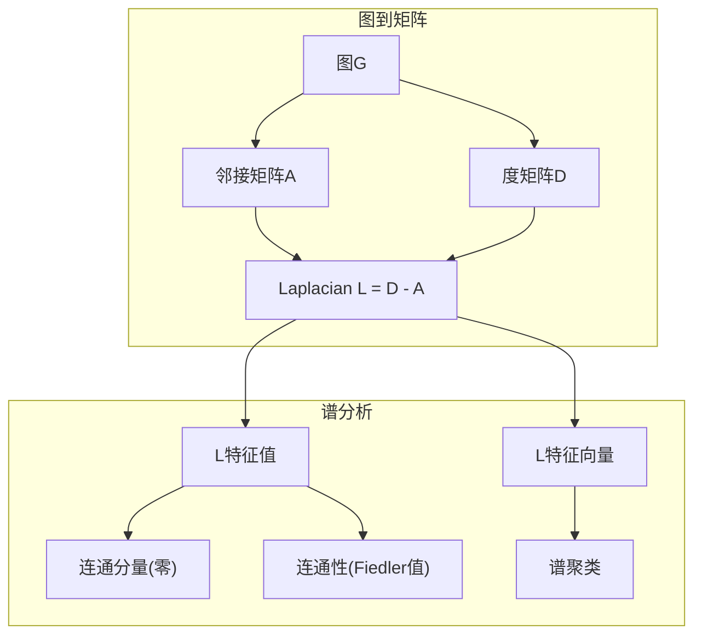
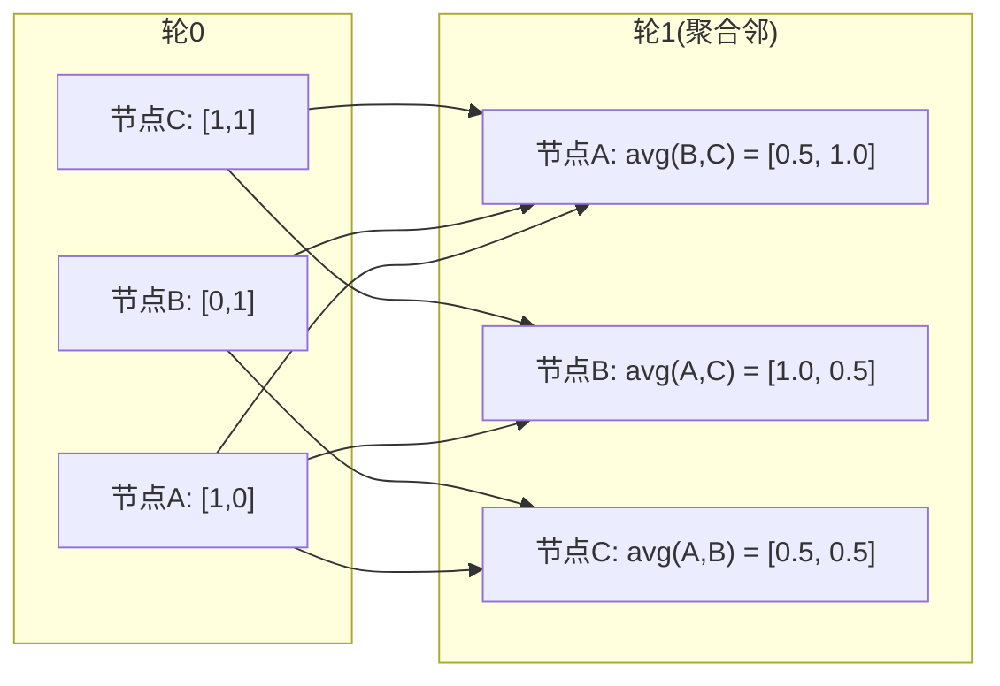

# 机器学习图论

> 图是关系的数据结构。若数据有连接，你需要图论。

**类型:** 构建
**语言:** Python
**前置要求:** 第1阶段，第01-03课(线性代数、矩阵)
**时间:** ~90分钟

## 学习目标

- 建图类邻接矩阵/邻接表表示并实现BFS和DFS遍历
- 算图Laplacian并用其特征值测连通分量和聚类节点
- 实现一轮GNN式消息传递作归一化邻接矩阵乘
- 用Fiedler向量谱聚类分图

## 问题背景

社交网络、分子、知识库、引文网络、路图——皆图。传统ML视数据平表。每行独立。每特征一列。但当连结构重要，表失败。

考虑社交网络。你欲预测用户买何产品。其购历史重要。但其友购历史更重要。连接带信号。

或考虑分子。你欲预测它结蛋白否。原子重要，但真重要的是原子何互键。结构即数据。

图神经网络(GNN)是深学习最快长域。它们驱药发现、社交推荐、欺诈检测和知识图推理。每GNN建同基:基本图论。

你需四物:
1. 表图矩阵法(使你可乘)
2. 遍历算法探图结构
3. Laplacian——谱图理论最重要矩阵
4. 消息传递——使GNN工作操作

## 概念讲解

### 图:节点和边

图G = (V, E)由顶点(节点)V和边E组成。每边连两节点。

**有向vs无向。** 无向图，边(u, v)意u连v AND v连u。有向图(digraph)，边(u, v)意u指向v，但非必反向。

**加权vs无权。** 无权图，边存在或否。加权图，每边有数值权重——距离、代价、强度。

| 图类型 | 例 |
|--------|-----|
| 无向无权 | Facebook友谊网络 |
| 有向无权 | Twitter关注网络 |
| 无向加权 | 路图(距离) |
| 有向加权 | 网页链(PageRank分) |

### 邻接矩阵

邻接矩阵A是核心表示。对n节点图:

```
A[i][j] = 1    若有边从节点i到节点j
A[i][j] = 0    否则
```

无向图，A对称: A[i][j] = A[j][i]。加权图，A[i][j] = 边(i, j)权重。

**例——三角形:**

```
节点: 0, 1, 2
边: (0,1), (1,2), (0,2)

A = [[0, 1, 1],
     [1, 0, 1],
     [1, 1, 0]]
```

邻接矩阵是每GNN输入。A上矩阵运算对应图操作。

### 度

节点度是连接边数。有向图，你有入度(边入)和出度(边出)。

度矩阵D是对角:

```
D[i][i] = 节点i度
D[i][j] = 0    for i != j
```

对三角形例: D = diag(2, 2, 2)因每节点连两其他。

度告节点重要性。高度=枢纽节点。网络度分布示其结构。社交网络循幂律(少枢纽，多叶节点)。随机图度Poisson分布。

### BFS和DFS

两基本图遍历算法。你需两者。

**广度优先搜索(BFS):** 先探全邻，再邻之邻。用队列(FIFO)。

```
BFS从节点0:
  访0
  队: [1, 2]        (0之邻)
  访1
  队: [2, 3]        (加1之邻)
  访2
  阗: [3]           (2之邻已访)
  访3
  阗: []            (完)
```

BFS无权图找最短路。从起至任节点距离等于该节点首次发现BFS层。这是BFS用于社交网络跳距之故。

**深度优先搜索(DFS):** 尽深后回溯。用栈(LIFO)或递归。

```
DFS从节点0:
  访0
  栈: [1, 2]        (0之邻)
  访2               (出栈)
  栈: [1, 3]         (加2之邻)
  访3               (出栈)
  栈: [1]
  访1               (出栈)
  栈: []             (完)
```

DFS用于:
- 找连通分量(从未访节点运DFS)
- 环检测(DFS树回边)
- 拓扑排序(逆DFS完序)

| 算法 | 数据结构 | 找 | 用例 |
|------|----------|-----|------|
| BFS | 队列 | 最短路 | 社交网络距离、知识图遍历 |
| DFS | 栈 | 分量、环 | 连通、拓扑排序 |

### 图Laplacian

L = D - A。谱图理论最重要矩阵。

对三角形:

```
D = [[2, 0, 0],    A = [[0, 1, 1],    L = [[2, -1, -1],
     [0, 2, 0],         [1, 0, 1],         [-1, 2, -1],
     [0, 0, 2]]         [1, 1, 0]]         [-1, -1,  2]]
```

Laplacian有非凡性质:

1. **L正半定。** 全特征值 >= 0。

2. **零特征值数等于连通分量数。** 连通图恰一零特征值。3断连分量图有三零特征值。

3. **最小非零特征值(Fiedler值)测连通性。** 大Fiedler值意图连通好。小Fiedler值意图有弱点——瓶颈。

4. **Fiedler值特征向量(Fiedler向量)示最佳分。** 正值节点归一组，负值归另一。这是谱聚类。



### 谱性质

邻接矩阵和Laplacian特征值无遍历示结构性质。

**谱聚类**工作:
1. 算Laplacian L
2. 找L k最小特征向量(跳第一，连通图全一)
3. 用这些特征向量作每节点新坐标
4. 于这些坐标运k-means

何工作？L特征向量编码图"最平滑"函数。好连节点得类似特征向量值。瓶颈分节点得不同值。特征向量自然分簇。

**随机游走连。** 归一化Laplacian关图随机游走。随机游走稳分布比例于节点度。混时(游走何快收敛)依赖谱隙。

### 消息传递

图神经网络核心操作。每节点从邻收消息，聚合，更新己态。

```
h_v^(k+1) = UPDATE(h_v^(k), AGGREGATE({h_u^(k) : u in neighbors(v)}))
```

最简形式，AGGREGATE = mean，UPDATE = 线性变换+激活:

```
h_v^(k+1) = sigma(W * mean({h_u^(k) : u in neighbors(v)}))
```

这是矩阵乘伪装。若H是全节点特征矩阵，A是邻接矩阵:

```
H^(k+1) = sigma(A_norm * H^(k) * W)
```

其中A_norm是归一化邻接矩阵(每行和1)。

一轮消息传递让每节点"看"直邻。两轮看邻之邻。K轮给每节点其K-hop邻域信息。



### 概念和ML应用

| 概念 | ML应用 |
|------|--------|
| 邻接矩阵 | GNN输入表示 |
| 图Laplacian | 谱聚类、社区检测 |
| BFS/DFS | 知识图遍历、路查 |
| 度分布 | 节点重要性、特征工程 |
| 消息传递 | GNN层(GCN, GAT, GraphSAGE) |
| L特征值 | 社区检测、图分割 |
| 谱聚类 | 无监督节点分组 |
| PageRank | 节点重要性、网搜 |

## 动手实践

### 步1: 从头图类

```python
class Graph:
    def __init__(self, n_nodes, directed=False):
        self.n = n_nodes
        self.directed = directed
        self.adj = {i: {} for i in range(n_nodes)}

    def add_edge(self, u, v, weight=1.0):
        self.adj[u][v] = weight
        if not self.directed:
            self.adj[v][u] = weight

    def neighbors(self, node):
        return list(self.adj[node].keys())

    def degree(self, node):
        return len(self.adj[node])

    def adjacency_matrix(self):
        import numpy as np
        A = np.zeros((self.n, self.n))
        for u in range(self.n):
            for v, w in self.adj[u].items():
                A[u][v] = w
        return A

    def degree_matrix(self):
        import numpy as np
        D = np.zeros((self.n, self.n))
        for i in range(self.n):
            D[i][i] = self.degree(i)
        return D

    def laplacian(self):
        return self.degree_matrix() - self.adjacency_matrix()
```

邻接表(`self.adj`)高效存邻。邻接矩阵转换用numpy因全谱操作需。

### 步2: BFS和DFS

```python
from collections import deque

def bfs(graph, start):
    visited = set()
    order = []
    distances = {}
    queue = deque([(start, 0)])
    visited.add(start)
    while queue:
        node, dist = queue.popleft()
        order.append(node)
        distances[node] = dist
        for neighbor in graph.neighbors(node):
            if neighbor not in visited:
                visited.add(neighbor)
                queue.append((neighbor, dist + 1))
    return order, distances


def dfs(graph, start):
    visited = set()
    order = []
    stack = [start]
    while stack:
        node = stack.pop()
        if node in visited:
            continue
        visited.add(node)
        order.append(node)
        for neighbor in reversed(graph.neighbors(node)):
            if neighbor not in visited:
                stack.append(neighbor)
    return order
```

BFS用deque(双端队列)O(1) popleft。DFS用列表栈。两者恰访每节点一次——O(V + E)时。

### 步3: 连通分量和Laplacian特征值

```python
def connected_components(graph):
    visited = set()
    components = []
    for node in range(graph.n):
        if node not in visited:
            order, _ = bfs(graph, node)
            visited.update(order)
            components.append(order)
    return components


def laplacian_eigenvalues(graph):
    import numpy as np
    L = graph.laplacian()
    eigenvalues = np.linalg.eigvalsh(L)
    return eigenvalues
```

`eigvalsh`用于对称矩阵——Laplacian无向图总对称。它升序返特征值。数零找连通分量数。

### 步4: 谱聚类

```python
def spectral_clustering(graph, k=2):
    import numpy as np
    L = graph.laplacian()
    eigenvalues, eigenvectors = np.linalg.eigh(L)
    features = eigenvectors[:, 1:k+1]

    labels = np.zeros(graph.n, dtype=int)
    for i in range(graph.n):
        if features[i, 0] >= 0:
            labels[i] = 0
        else:
            labels[i] = 1
    return labels
```

对k=2，Fiedler向量符号分图两簇。对k>2，你会于前k特征向量(除平凡全一特征向量)运k-means。

### 步5: 消息传递

```python
def message_passing(graph, features, weight_matrix):
    import numpy as np
    A = graph.adjacency_matrix()
    row_sums = A.sum(axis=1, keepdims=True)
    row_sums[row_sums == 0] = 1
    A_norm = A / row_sums
    aggregated = A_norm @ features
    output = aggregated @ weight_matrix
    return output
```

这是一轮GNN消息传递。每节点新特征是其邻特征加权平均，由权重矩阵变换。叠多轮传信息更远。

## 使用它

用networkx和numpy，同操作是一行:

```python
import networkx as nx
import numpy as np

G = nx.karate_club_graph()

A = nx.adjacency_matrix(G).toarray()
L = nx.laplacian_matrix(G).toarray()

eigenvalues = np.linalg.eigvalsh(L.astype(float))
print(f"最小特征值: {eigenvalues[:5]}")
print(f"连通分量: {nx.number_connected_components(G)}")

communities = nx.community.greedy_modularity_communities(G)
print(f"发现社区: {len(communities)}")

pr = nx.pagerank(G)
top_nodes = sorted(pr.items(), key=lambda x: x[1], reverse=True)[:5]
print(f"前5 PageRank节点: {top_nodes}")
```

networkx以优C背处理任大图。生产用。从头实现用于理解。

### numpy谱分析

```python
import numpy as np

A = np.array([
    [0, 1, 1, 0, 0],
    [1, 0, 1, 0, 0],
    [1, 1, 0, 1, 0],
    [0, 0, 1, 0, 1],
    [0, 0, 0, 1, 0]
])

D = np.diag(A.sum(axis=1))
L = D - A

eigenvalues, eigenvectors = np.linalg.eigh(L)
print(f"特征值: {np.round(eigenvalues, 4)}")
print(f"Fiedler值: {eigenvalues[1]:.4f}")
print(f"Fiedler向量: {np.round(eigenvectors[:, 1], 4)}")

fiedler = eigenvectors[:, 1]
group_a = np.where(fiedler >= 0)[0]
group_b = np.where(fiedler < 0)[0]
print(f"簇A: {group_a}")
print(f"簇B: {group_b}")
```

Fiedler向量做重活。正条一簇，负另一。无需迭代优化——仅一特征分解。

## 产出成果

这课产出:
- `outputs/skill-graph-analysis.md`——分析图结构数据技能参考

## 连接

| 概念 | 何现 |
|------|------|
| 邻接矩阵 | GCN, GAT, GraphSAGE输入 |
| Laplacian | 谱聚类、ChebNet滤波 |
| BFS | 知识图遍历、最短路查 |
| 消息传递 | 每GNN层、神经消息传递 |
| 谱隙 | 图连通、随机游走混时 |
| 度分布 | 幂律网络、节点特征工程 |
| 连通分量 | 预处理、处理断连图 |
| PageRank | 节点重要性排、注意力初始化 |

GNN值得特提。GCN (Kipf & Welling, 2017)图卷积操作用加自环邻接矩阵，A_hat = A + I:

```text
H^(l+1) = sigma(D_hat^(-1/2) * A_hat * D_hat^(-1/2) * H^(l) * W^(l))
```

其中A_hat = A + I(邻接加自环)D_hat是A_hat度矩阵。自环确保每节点聚合含己特征。这是恰对称归一化消息传递。D_hat^(-1/2) * A_hat * D_hat^(-1/2)是归一化邻接矩阵。Laplacian现因此归一化关L_sym = I - D^(-1/2) * A * D^(-1/2)。懂Laplacian意懂GCN何工作。

## 练习题

1. **从头实现PageRank。** 从均匀分开始。每步: score(v) = (1-d)/n + d * sum(score(u)/out_degree(u)) for all u pointing to v。用d=0.85。运至收敛(变 < 1e-6)。于小网页试。

2. **用谱聚类找社区。** 建两明显分簇图(如，两团连单边)。运谱聚类并验找对分。加更多跨簇边时何发生？

3. **实现Dijkstra算法**用于加权图最短路。比结果于同图均匀权重BFS。

4. **建2层消息传递网络。** 两轮用不同权重矩阵施消息传递。示2轮后，每节点有其2-hop邻域信息。

5. **分析真实图。** 用Karate Club图(34节点，78边)。算度分布、Laplacian特征值、谱聚类。比谱聚类结果于已知真相分。

## 关键术语

| 术语 | 人们怎么说 | 实际含义 |
|------|-----------|----------|
| 图 | "节点和边" | 编码对关系数学结构G=(V,E) |
| 邻接矩阵 | "连接表" | n x n矩阵A[i][j] = 1若节点i和j连 |
| 度 | "节点何连" | 触节点边数 |
| Laplacian | "D减A" | L = D - A，特征值示图结构矩阵 |
| Fiedler值 | "代数连通性" | L最小非零特征值，测图何连通 |
| BFS | "层层搜" | 先访全邻后深，找最短路遍历 |
| DFS | "先深" | 一路到底后回溯遍历 |
| 消息传递 | "节点与邻谈" | 每节点从邻聚合信息，GNN核心 |
| 谱聚类 | "特征向量聚类" | 用Laplacian特征向量分图 |
| 连通分量 | "分离片" | 最大子图每节点可达每其他节点 |

## 延伸阅读

- **Kipf & Welling (2017)**——"半监督分类图卷积网络。"启现代GNN论文。示谱图卷积简为消息传递。
- **Spielman (2012)**——"谱图理论"讲义。Laplacian、谱隙、图分割权威介绍。
- **Hamilton (2020)**——"图表示学习。"覆盖GNN基础至应用书。
- **Bronstein等 (2021)**——"几何深学习:网格、群、图、测地线和规。"统一框架论文。
- **Veličković等 (2018)**——"图注意力网络。"消息传递扩展注意力机制。