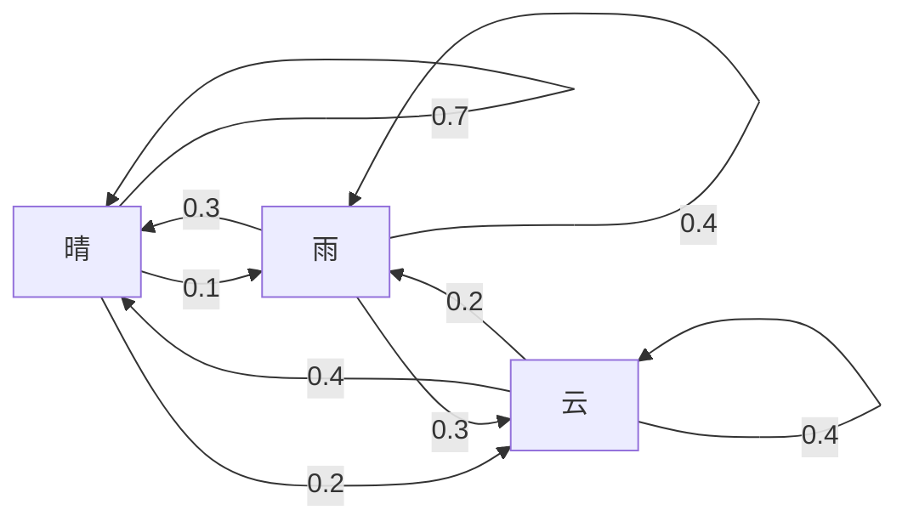
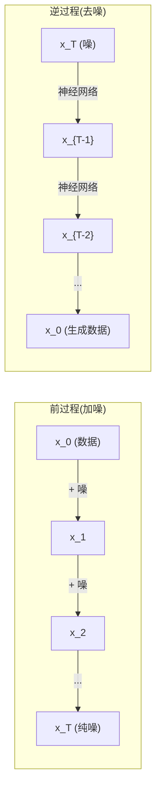

# 随机过程

> 有结构的随机性。随机游走、Markov 链和扩散模型背后的数学。

**类型:** 学习
**语言:** Python
**前置要求:** 第1阶段，第06-07课(概率、Bayes)
**时间:** ~75分钟

## 学习目标

- 模拟1D和2D随机游走并验位移sqrt(n)缩放
- 建Markov链模拟器并经特征分解算稳分布
- 实现Metropolis-Hastings MCMC和Langevin动力学从目标分布采样
- 连前扩散过程于Brownian运动并解释逆过程何生成数据

## 问题背景

许多AI系统涉随时随机性。非静随机——结构化、序随机性每步依赖前。

语言模型逐token生成。每token依赖前上下文。模型输出概率分布，从中样，继续。那是随机过程。

扩散模型逐步给图像加噪至纯静。然后它们逆过程，逐步去噪至新图像现。前过程是Markov链。逆过程是学Markov链逆运。

强化学习智能体在环境取行动。每行动带某概率导新态。智能体在随机世界随随机策。全是Markov决策过程。

MCMC采样——Bayesian推理骨干——建Markov链其稳分布是你欲采样后验。

全建于四基念:
1. 随机游走——最简随机过程
2. Markov链——有转移矩阵结构随机性
3. Langevin动力学——带噪梯度下降
4. Metropolis-Hastings——从任分布采样

## 概念讲解

### 随机游走

从位置0开始。每步，翻公平硬币。头:右移(+1)。尾:左移(-1)。

n步后，位置是n随机 +/-1值和。期望位置0(游走无偏)。但期望离原点距长sqrt(n)。

这反直觉。游走公平——无方向漂移。但随时，它走远起处。n步后标准差sqrt(n)。

```
步0:  位置 = 0
步1:  位置 = +1 或 -1
步2:  位置 = +2, 0, 或 -2
...
步100: 期望离原点距 ~ 10 (sqrt(100))
步10000: 期望离原点距 ~ 100 (sqrt(10000))
```

**2D中**，游走等概率上、下、左、右移。同sqrt(n)缩放适离原点距。路径绘类分形模式。

**何sqrt(n)？** 每步+1或-1等概率。n步后，位置S_n = X_1 + X_2 + ... + X_n其中每X_i +/-1。每步方差1，步独立，故Var(S_n) = n。标准差= sqrt(n)。据中心极限定理，S_n / sqrt(n)收敛标准正态分布。

此sqrt(n)缩放ML到处现。SGD噪声缩1/sqrt(batch_size)。嵌入维缩sqrt(d)。平方根是独立随机加签名。

**连Brownian运动。** 取随机游走步长1/sqrt(n)每单位时n步。n至无穷，游走收敛Brownian运动B(t)——连续时过程B(t)正态分布均值0方差t。

Brownian运动是扩散数学基础。它模型粒子在流体随机晃动、股价波动和——关键——扩散模型噪声过程。

**赌徒破产。** 随机游走者从位置k开始，吸收壁0和N。何概率达N前0？公平游走: P(达N) = k/N。这惊简优雅。连martingale理论——公平随机游走是martingale(期望未来值=当前值)。

### Markov链

Markov链是按固概率转移态系统。关键性质:下态仅依赖当前态，不依赖历史。

```
P(X_{t+1} = j | X_t = i, X_{t-1} = ...) = P(X_{t+1} = j | X_t = i)
```

这是Markov性质。意你可转移矩阵P描述全动态:

```
P[i][j] = 从态i到态j概率
```

P每行和1(必去某处)。

**例——天气:**

```
态: 晴(0), 雨(1), 云(2)

P = [[0.7, 0.1, 0.2],    (晴:70%晴, 10%雨, 20%云)
     [0.3, 0.4, 0.3],    (雨:30%晴, 40%雨, 30%云)
     [0.4, 0.2, 0.4]]    (云:40%晴, 20%雨, 40%云)
```

从任态开始。多转移后，态分布收敛稳分布pi，其中pi * P = pi。这是P左特征向量特征值1。

对天气链，稳分布可是[0.53, 0.18, 0.29]——长远，晴53%时无关起态。



**算稳分布。** 有两法:

1. **幂法**: 任初分布乘P多次。够迭代后收敛。
2. **特征值法**: 找P左特征向量特征值1。这是P^T特征向量特征值1。

两法需链满足收敛条件。

**收敛条件。** Markov链收敛唯一稳分布若:
- **不可约**: 每态可从每他态达
- **非周期**: 链不以固周期循环

ML遇大多链满足两条件。

**吸收态。** 态吸收若一旦入永不离(P[i][i] = 1)。吸收Markov链模型有终态过程——结束游戏、流失客户、达文本结束token序列。

**混时。** 多步链"近"稳分布？形式，至总变差离稳分布低于某阈值步数。快混=需少步。P谱隙(1减第二大特征值)控混时。大隙=快混。

### 连语言模型

语言模型token生成约Markov过程。给当前上下文，模型输出下token分布。温度控锐度:

```
P(token_i) = exp(logit_i / temperature) / sum(exp(logit_j / temperature))
```

- 温度= 1.0: 标准分布
- 温度< 1.0: 锐(更确定)
- 温度> 1.0: 平(更随机)
- 温度-> 0: argmax(贪婪)

Top-k采样截k最高概率token。Top-p(核)采样截累计概率超p最小token集。两者改Markov转移概率。

### Brownian运动

随机游走连续时极限。位置B(t)有三性质:
1. B(0) = 0
2. B(t) - B(s)正态分布均值0方差t - s (for t > s)
3. 非重叠区间增量独立

Brownian运动连续但无处可微——每尺晃动。路径平面分形维2。

离散模拟，你逼近Brownian运动:

```
B(t + dt) = B(t) + sqrt(dt) * z,    其中z ~ N(0, 1)
```

sqrt(dt)缩放重要。来自中心极限定理用于随机游走。

### Langevin动力学

梯度下降找函数最小。Langevin动力学找比例于exp(-U(x)/T)概率分布，其中U能量函数T温度。

```
x_{t+1} = x_t - dt * gradient(U(x_t)) + sqrt(2 * T * dt) * z_t
```

两力作用于粒子:
1. **梯度力** (-dt * gradient(U)): 推向低能(如梯度下降)
2. **随机力** (sqrt(2*T*dt) * z): 推随机方向(探索)

温度T = 0，这是纯梯度下降。高温，几是随机游走。适当温度，粒子探索能量景观花更多时低能区。

**连扩散模型。** 扩散模型前过程:

```
x_t = sqrt(alpha_t) * x_{t-1} + sqrt(1 - alpha_t) * noise
```

这是Markov链逐步混数据和噪声。够步后，x_T是纯Gaussian噪声。

逆过程——从噪回数据——也是Markov链，但其转移概率由神经网络学。网络学预测每步加噪，然后减。



### MCMC: Markov链Monte Carlo

有时你需从分布p(x)采样你可算(至常数)但不能直采样。Bayesian后验是经典例——你知道似然乘先验，但归一常数难算。

**Metropolis-Hastings**建Markov链其稳分布是p(x):

1. 从某位置x开始
2. 从提议分布Q(x'|x)提新位置x'
3. 算接受比: a = p(x') * Q(x|x') / (p(x) * Q(x'|x))
4. 概率min(1, a)接受x'。否则留x。
5. 重复。

若Q对称(如，Q(x'|x) = Q(x|x') = N(x, sigma^2))，比简a = p(x') / p(x)。你仅需概率比——归一常数消。

链保证于温条件收敛p(x)。但收敛可慢若提议太小(随机游走)或太大(高拒)。调提议是MCMC艺术。

**何工作。** 接受比确保细致平衡:于x移x'概率等于于x'移x概率。细致平衡意p(x)是链稳分布。故够步后，样来自p(x)。

**实践考虑:**
- **Burn-in**: 弃前N样。链需时达稳分布从起点。
- **Thinning**: 留每第k样减自相关。
- **多链**: 从不同起点运几链。若它们收敛同分布，你有收敛证据。
- **接受率**: 对d维Gaussian提议，最优接受率约23% (Roberts & Rosenthal, 2001)。太高意链几不动。太低意全拒。

### AI中随机过程

| 过程 | AI应用 |
|------|--------|
| 随机游走 | RL探索、Node2Vec嵌入 |
| Markov链 | 文本生成、MCMC采样 |
| Brownian运动 | 扩散模型(前过程) |
| Langevin动力学 | 分数基生成模型、SGLD |
| Markov决策过程 | 强化学习 |
| Metropolis-Hastings | Bayesian推理、后验采样 |

## 动手实践

### 步1: 随机游走模拟器

```python
import numpy as np

def random_walk_1d(n_steps, seed=None):
    rng = np.random.RandomState(seed)
    steps = rng.choice([-1, 1], size=n_steps)
    positions = np.concatenate([[0], np.cumsum(steps)])
    return positions


def random_walk_2d(n_steps, seed=None):
    rng = np.random.RandomState(seed)
    directions = rng.choice(4, size=n_steps)
    dx = np.zeros(n_steps)
    dy = np.zeros(n_steps)
    dx[directions == 0] = 1   # 右
    dx[directions == 1] = -1  # 左
    dy[directions == 2] = 1   # 上
    dy[directions == 3] = -1  # 下
    x = np.concatenate([[0], np.cumsum(dx)])
    y = np.concatenate([[0], np.cumsum(dy)])
    return x, y
```

1D游走存累积和。每步+1或-1。n步后，位置是和。方差随n线性长，故标准差长sqrt(n)。

### 步2: Markov链

```python
class MarkovChain:
    def __init__(self, transition_matrix, state_names=None):
        self.P = np.array(transition_matrix, dtype=float)
        self.n_states = len(self.P)
        self.state_names = state_names or [str(i) for i in range(self.n_states)]

    def step(self, current_state, rng=None):
        if rng is None:
            rng = np.random.RandomState()
        probs = self.P[current_state]
        return rng.choice(self.n_states, p=probs)

    def simulate(self, start_state, n_steps, seed=None):
        rng = np.random.RandomState(seed)
        states = [start_state]
        current = start_state
        for _ in range(n_steps):
            current = self.step(current, rng)
            states.append(current)
        return states

    def stationary_distribution(self):
        eigenvalues, eigenvectors = np.linalg.eig(self.P.T)
        idx = np.argmin(np.abs(eigenvalues - 1.0))
        stationary = np.real(eigenvectors[:, idx])
        stationary = stationary / stationary.sum()
        return np.abs(stationary)
```

稳分布是P左特征向量特征值1。我们算P^T特征向量(转置左特征向量变右特征向量)。

### 步3: Langevin动力学

```python
def langevin_dynamics(grad_U, x0, dt, temperature, n_steps, seed=None):
    rng = np.random.RandomState(seed)
    x = np.array(x0, dtype=float)
    trajectory = [x.copy()]
    for _ in range(n_steps):
        noise = rng.randn(*x.shape)
        x = x - dt * grad_U(x) + np.sqrt(2 * temperature * dt) * noise
        trajectory.append(x.copy())
    return np.array(trajectory)
```

梯度推x向低能。噪声防被困。平衡时，样分布比例于exp(-U(x)/temperature)。

### 步4: Metropolis-Hastings

```python
def metropolis_hastings(target_log_prob, proposal_std, x0, n_samples, seed=None):
    rng = np.random.RandomState(seed)
    x = np.array(x0, dtype=float)
    samples = [x.copy()]
    accepted = 0
    for _ in range(n_samples - 1):
        x_proposed = x + rng.randn(*x.shape) * proposal_std
        log_ratio = target_log_prob(x_proposed) - target_log_prob(x)
        if np.log(rng.rand()) < log_ratio:
            x = x_proposed
            accepted += 1
        samples.append(x.copy())
    acceptance_rate = accepted / (n_samples - 1)
    return np.array(samples), acceptance_rate
```

算法提新点，查有更高概率否(或接受比例于比)，重复。接受率应约23-50%好混。

## 使用它

实践，你用建立库这些算法。但懂机制对调试调优重要。

```python
import numpy as np

rng = np.random.RandomState(42)
walk = np.cumsum(rng.choice([-1, 1], size=10000))
print(f"终位置: {walk[-1]}")
print(f"期望距离: {np.sqrt(10000):.1f}")
print(f"实际距离: {abs(walk[-1])}")
```

### numpy用于转移矩阵

```python
import numpy as np

P = np.array([[0.7, 0.1, 0.2],
              [0.3, 0.4, 0.3],
              [0.4, 0.2, 0.4]])

distribution = np.array([1.0, 0.0, 0.0])
for _ in range(100):
    distribution = distribution @ P

print(f"稳分布: {np.round(distribution, 4)}")
```

初分布乘P多次。够迭代后，它收敛稳分布无关起处。这是找主左特征向量幂法。

### 连真实框架

- **PyTorch扩散:** Hugging Face `diffusers`中`DDPMScheduler`实现前后Markov链
- **NumPyro / PyMC:** 用MCMC (NUTS采样器，改进Metropolis-Hastings) Bayesian推理
- **Gymnasium (RL):** 环步函数定义Markov决策过程

### 验Markov链收敛

```python
import numpy as np

P = np.array([[0.9, 0.1], [0.3, 0.7]])

eigenvalues = np.linalg.eigvals(P)
spectral_gap = 1 - sorted(np.abs(eigenvalues))[-2]
print(f"特征值: {eigenvalues}")
print(f"谱隙: {spectral_gap:.4f}")
print(f"约混时: {1/spectral_gap:.1f} 步")
```

谱隙告你链何快忘初态。隙0.2意约5步混。隙0.01意约100步。长模拟前总查——慢混链浪费算。

## 产出成果

这课产出:
- `outputs/prompt-stochastic-process-advisor.md`——帮助识何随机过程框架适给定问题提示

## 连接

| 概念 | 何现 |
|------|------|
| 随机游走 | Node2Vec图嵌入、RL探索 |
| Markov链 | LLM token生成、MCMC采样 |
| Brownian运动 | DDPM前扩散过程、SDE基模型 |
| Langevin动力学 | 分数基生成模型、随机梯度Langevin动力学(SGLD) |
| 稳分布 | MCMC收敛目标、PageRank |
| Metropolis-Hastings | Bayesian后验采样、模拟退火 |
| 温度 | LLM采样、RL Boltzmann探索、模拟退火 |
| 混时 | MCMC收敛速度、谱隙分析 |
| 吸收态 | 序结束token、RL终态 |
| 细致平衡 | MCMC采样器正确性保证 |

扩散模型值得特关注。DDPM (Ho等，2020)定义前Markov链:

```
q(x_t | x_{t-1}) = N(x_t; sqrt(1-beta_t) * x_{t-1}, beta_t * I)
```

其中beta_t是噪声调度。T步后，x_T约N(0, I)。逆过程由神经网络参数化预测噪声:

```
p_theta(x_{t-1} | x_t) = N(x_{t-1}; mu_theta(x_t, t), sigma_t^2 * I)
```

生成每步是学Markov链一步。懂Markov链意懂扩散模型何何生成数据。

SGLD(随机梯度Langevin动力学)合小批梯度下降Langevin噪声。代算全梯度，你用随机估计加校准噪声。学习率衰减时，SGLD从优化过渡采样——你得近似Bayesian后验样免费。这是神经网络不确定性估计最简法之一。

关键洞察跨全连接:随机过程非仅理论工具。它们是现代AI系统内计算机制。当你调LLM温度，你调Markov链。当你训扩散模型，你学逆Brownian运动类过程。当你运Bayesian推理，你建收敛后验链。

## 练习题

1. **模拟1000随机游走10000步。** 绘终位置分布。验约Gaussian均值0标准差sqrt(10000) = 100。

2. **建Markov链文本生成器。** 于小语料训:对每词，数转下词。建转移矩阵。从链样生新句。

3. **实现模拟退火**用Metropolis-Hastings。从高温开始(接受几全)并逐渐冷却(仅接受改进)。用它找多局部最小函数最小。

4. **比不同温度Langevin动力学。** 从双井势U(x) = (x^2 - 1)^2采样。低温，样簇一井。高温，散两井。找临界温度链混两井间。

5. **实现前扩散过程。** 从1D信号(如正弦波)开始。100步线性噪声调度逐加噪。示信号退化纯噪。然后实现简单去噪器逆过程(甚至朴素仅减估计噪)。

## 关键术语

| 术语 | 人们怎么说 | 实际含义 |
|------|-----------|----------|
| 随机游走 | "硬币翻转动" | 位置每步随机增量变过程 |
| Markov性质 | "无记忆" | 未来仅依赖当前态，不依赖历史 |
| 转移矩阵 | "概率表" | P[i][j] = 从态i移态j概率 |
| 稳分布 | "长跑平均" | 分布pi其中pi*P = pi——链平衡 |
| Brownian运动 | "随机晃动" | 随机游走连续时极限，B(t) ~ N(0, t) |
| Langevin动力学 | "带噪梯度下降" | 合确定梯度随机扰动更新规则 |
| MCMC | "走向目标" | 建Markov链其稳分布是你欲分布 |
| Metropolis-Hastings | "提和接受/拒" | 用接受比保证收敛MCMC算法 |
| 温度 | "随机性旋钮" | 控探索和利用权衡参数 |
| 扩散过程 | "噪入噪出" | 前:渐加噪。逆:渐移。生成数据。 |

## 延伸阅读

- **Ho, Jain, Abbeel (2020)**——"去噪扩散概率模型。"启扩散模型革命DDPM论文。前后Markov链清晰推导。
- **Song & Ermon (2019)**——"通过估计数据分布梯度生成建模。"分数基方法用Langevin动力学采样。
- **Roberts & Rosenthal (2004)**——"一般态空间Markov链和MCMC算法。"MCMC何何工作理论。
- **Norris (1997)**——"Markov链。"标准课本。覆盖收敛、稳分布、到达时。
- **Welling & Teh (2011)**——"通过随机梯度Langevin动力学Bayesian学习。"合SGD Langevin动力学可扩Bayesian推理。