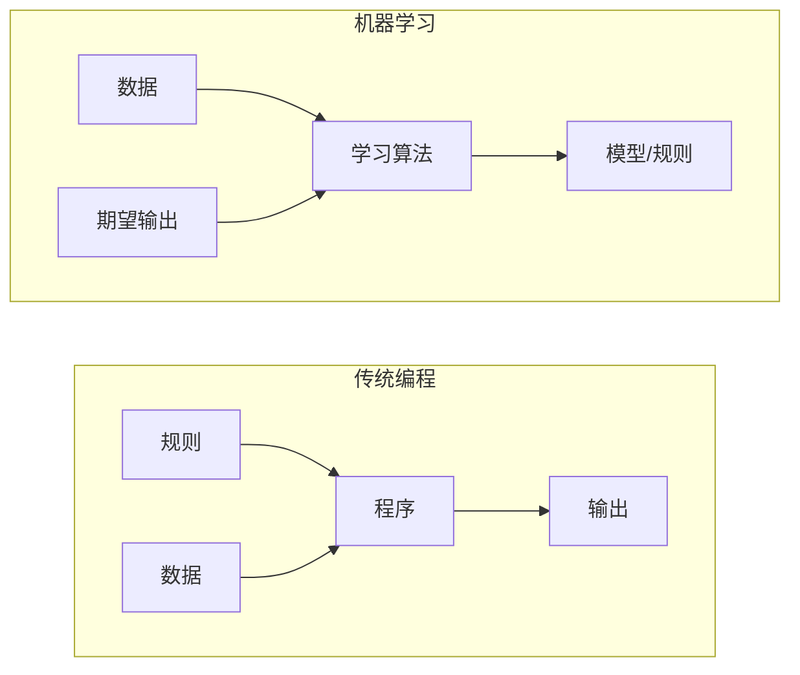
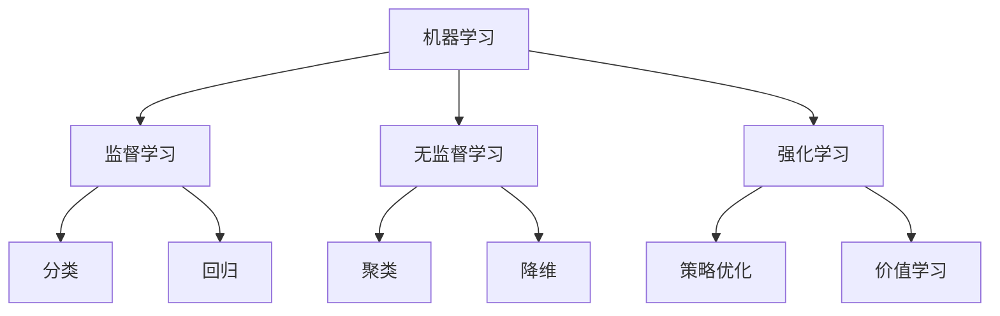
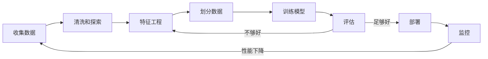
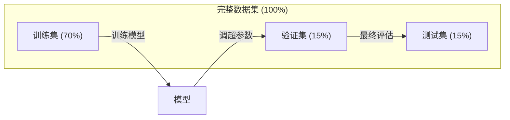
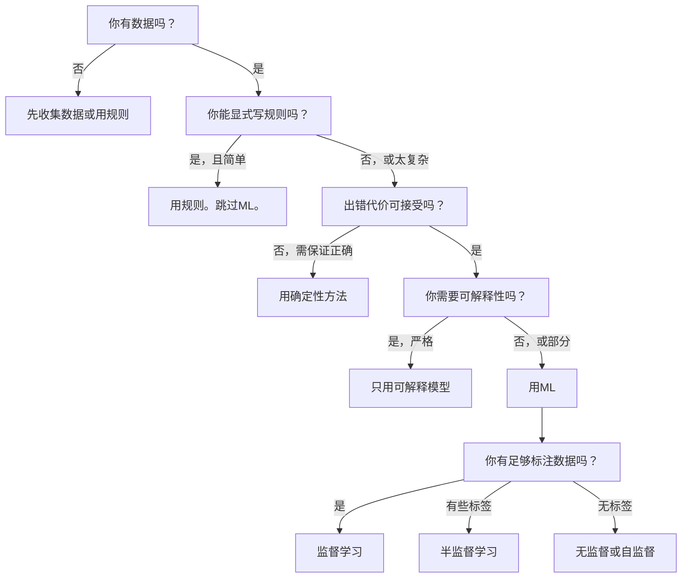

# 什么是机器学习

> 机器学习是教计算机从数据中发现规律，而非手工编写规则。

**类型:** 学习
**语言:** Python
**前置要求:** 第1阶段 (数学基础)
**时间:** ~45分钟

## 学习目标

- 解释监督学习、无监督学习和强化学习的区别，并识别给定问题属于哪种类型
- 从零实现最近质心分类器，并对比随机基线评估其性能
- 区分分类和回归任务，并为每种任务选择合适的损失函数
- 评估给定业务问题是否适合用机器学习解决，还是用确定性规则更好

## 问题背景

你想构建垃圾邮件过滤器。传统方法: 坐下来写几百条规则。"如果邮件包含'免费赚钱'，标记为垃圾邮件。如果有超过3个感叹号，标记为垃圾邮件。" 你花几周写规则。然后垃圾邮件发送者改变措辞。你的规则失效。你写更多规则。循环永无止境。

机器学习翻转这过程。不写规则，你给计算机数千标注邮件("垃圾邮件"或"非垃圾邮件")，让它自己找出规律。计算机发现你从未想到的模式。当垃圾邮件发送者改变策略，你在新数据上重训练而非重写代码。

这从"编程规则"到"从数据学习"的转变是机器学习核心。每个推荐引擎、语音助手、自动驾驶汽车和语言模型都这样工作。

## 概念讲解

### 从数据学习，而非规则

传统编程和机器学习以相反方向解决问题。



传统编程: 你写规则。程序将规则应用于数据产生输出。

机器学习: 你提供数据和期望输出。算法发现规则。

训练产生的"模型"就是规则，编码为数字(权重、参数)。它从见过的例子泛化，对从未见过的数据做预测。

### 三种机器学习类型



**监督学习**: 你有输入-输出对。模型学习将输入映射到输出。
- "这里有10,000张标注猫或狗的照片。学会区分它们。"
- "这里有房屋特征和价格。学会预测价格。"

**无监督学习**: 你只有输入。无标签。模型自己发现结构。
- "这里有10,000个顾客购买历史。找出自然分组。"
- "这里有1,000维数据点。降到2维同时保持结构。"

**强化学习**: 代理在环境中采取行动并接收奖励或惩罚。它学习策略使总奖励最大化。
- "玩这个游戏。赢+1，输-1。想出策略。"
- "控制这个机械臂。拿起物体+1，每浪费一秒-0.01。"

实践中大部分你构建的用监督学习。无监督学习常用于预处理和探索。强化学习驱动游戏AI、机器人学和语言模型的RLHF。

### 超越三大类型

上面三类干净，但现实世界ML常模糊界限。

**半监督学习**用小集合标注数据和大集合未标注数据。你可能有100张标注医学图像和100,000张未标注。技术包括:

- **标签传播**: 构建图连接相似数据点。标签从标注节点通过图传播到未标注邻居。
- **伪标签**: 在标注数据训练模型，用它预测未标注数据标签，然后在所有数据上重训练。模型自举训练集。
- **一致性正则化**: 模型应给输入和其轻微扰动版本相同预测。这无标签也工作。

**自监督学习**从数据本身创建监督。完全不需要人类标签。模型从数据结构创建自己的预测任务。

- **遮蔽语言建模(BERT)**: 遮蔽句子15%的词，训练模型预测缺失词。"标签"来自原始文本。
- **对比学习(SimCLR)**: 取一张图像，创建两个增强版本。训练模型识别它们来自同一图像，同时区分其他图像的增强版本。
- **下一词预测(GPT)**: 给所有前词预测下一词。每个文本文档成为训练例子。

这些非独立于三大类。它们是结合监督和无监督思想的策略。自监督学习技术上监督(模型预测某事)，但标签自动生成，非人类标注。

### 分类vs回归

这是两种主要监督学习任务。

| 方面 | 分类 | 回归 |
|--------|---------------|------------|
| 输出 | 离散类别 | 连续数值 |
| 例子 | "这邮件是垃圾邮件吗？" | "房价是多少？" |
| 输出空间 | {猫, 狗, 鸟} | 任意实数 |
| 损失函数 | 交叉熵, 精度 | 均方误差, MAE |
| 决策 | 类别间边界 | 拟合数据的曲线 |

分类回答"哪个类别？" 回归回答"多少？"

有些问题可用任一方式表述。预测股票涨跌是分类。预测确切价格是回归。

### ML工作流

每个机器学习项目遵循相同流水线，不管算法。



**收集数据**: 收集原始数据。更多数据几乎总更好，但质量比数量重要。

**清洗和探索**: 处理缺失值、去重、可视化分布、发现异常。这步常占总项目时间60-80%。

**特征工程**: 将原始数据转为模型可用特征。将日期转为星期几。归一化数值列。编码类别变量。好特征比花哨算法重要。

**划分数据**: 分为训练、验证和测试集。模型在训练数据训练，你在验证数据调超参数，在测试数据报告最终性能。

**训练模型**: 将训练数据喂给算法。算法调整内部参数最小化损失函数。

**评估**: 在验证/测试数据测量性能。如果性能不可接受，回去试不同特征、算法或超参数。

**部署**: 将模型放入生产，对新数据做预测。

**监控**: 长期跟踪性能。数据分布变化(数据漂移)，模型退化。性能下降时，重训练。

### 训练、验证和测试划分

这是初学者搞错的最重要概念。你必须在模型训练时从未见过的数据上评估。否则你测量的是记忆，而非学习。



| 划分 | 用途 | 何时用 | 典型大小 |
|-------|---------|-----------|-------------|
| 训练 | 模型从这数据学习 | 训练期间 | 60-80% |
| 验证 | 调超参数，比较模型 | 每次训练后 | 10-20% |
| 测试 | 最终无偏性能估计 | 一次，最末尾 | 10-20% |

测试集神圣。你只看一次。如果基于测试性能不断调整模型，你实际上在测试集上训练，你报告的数字无意义。

小数据集用k折交叉验证: 将数据分k部分，在k-1部分训练，在剩余部分验证，旋转，平均结果。

### 过拟合vs欠拟合


**欠拟合**: 模型太简单无法捕获数据中模式。直线试图拟合弯曲关系。训练误差高。测试误差高。

**过拟合**: 模型太复杂并记忆训练数据，包括其噪声。摇摆曲线穿过每个训练点但在新数据失败。训练误差低。测试误差高。

**好拟合**: 模型捕获真实模式而不记忆噪声。训练误差和测试误差都合理低。

过拟合迹象:
- 训练精度比验证精度高很多
- 模型在训练数据表现好但在新数据差
- 添加更多训练数据改善性能(模型在记忆，而非学习)

过拟合修复:
- 获取更多训练数据
- 减少模型复杂度(更少参数，更简单架构)
- 正则化(对大权重加惩罚)
- Dropout(训练时随机置零神经元)
- 早停(验证误差开始上升时停止训练)

欠拟合修复:
- 用更复杂模型
- 加更多特征
- 减少正则化
- 训练更久

### 偏差-方差权衡

这是过拟合和欠拟合背后的数学框架。

**偏差**: 模型中错误假设导致的误差。线性模型对非线性真实关系有高偏差。高偏差导致欠拟合。

**方差**: 对训练数据小波动敏感导致的误差。高方差模型在不同数据子集训练时给出非常不同的预测。高方差导致过拟合。

| 模型复杂度 | 偏差 | 方差 | 结果 |
|-----------------|------|----------|--------|
| 太低(弯曲数据的线性模型) | 高 | 低 | 欠拟合 |
| 正好 | 中 | 中 | 好泛化 |
| 太高(10个点的20阶多项式) | 低 | 高 | 过拟合 |

总误差 = 偏差^2 + 方差 + 不可约噪声

你无法减少不可约噪声(数据本身的随机性)。你要找偏差^2 + 方差最小的甜蜜点。

### 无免费午餐定理

不存在对所有问题都最佳的单算法。对一类问题表现好的算法对另一类表现差。这就是为何数据科学家试多种算法比较结果。

实践中，选择取决于:
- 你有多少数据
- 有多少特征
- 关系线性还是非线性
- 是否需要可解释性
- 你能负担多少计算

### 何时不使用机器学习

ML强大但非总是正确工具。伸手拿模型前，问是否实际需要一个。

**不要用ML当:**

- **规则简单且定义良好。** 税计算、排序算法、单位转换。如果你能用几个if语句写逻辑，模型增加复杂度无收益。
- **你没数据或数据很少。** ML需要例子学习。有10个数据点，你无法训练任何有意义。先收集数据。
- **出错代价灾难性且需保证正确性。** 医学剂量计算、核反应堆控制、密码验证。ML模型概率性。它们有时会错。如果"有时错误"不可接受，用确定性方法。
- **查找表或启发式解决问题。** 如果简单阈值或表覆盖99%情况，加ML增加维护成本无有意义改进。
- **你无法解释决策且可解释性必需。** 监管行业(贷款、保险、刑事司法)有时要求每个决策完全可解释。某些ML模型可解释(线性回归、小决策树)。多数不可。
- **问题变化比你重训练快。** 如果规则每天变且重训练需一周，模型总过时。

用这决策流程图:



## 构建

`code/ml_intro.py` 中代码从零实现最近质心分类器，最简单ML算法。它展示核心思想: 从数据学习，然后对新数据预测。

### 步骤1: 从零最近质心分类器

最近质心分类器计算训练数据每类中心(均值)。预测时，分配每个新点到中心最近的类。

```python
class NearestCentroid:
    def fit(self, X, y):
        self.classes = np.unique(y)
        self.centroids = np.array([
            X[y == c].mean(axis=0) for c in self.classes
        ])

    def predict(self, X):
        distances = np.array([
            np.sqrt(((X - c) ** 2).sum(axis=1))
            for c in self.centroids
        ])
        return self.classes[distances.argmin(axis=0)]
```

这是整个算法。Fit计算两个均值。Predict计算距离。无梯度下降、无迭代、无超参数。

### 步骤2: 在合成数据训练

我们生成轻微重叠的二维分类数据集。质心分类器在类中心间画线性决策边界。

```python
rng = np.random.RandomState(42)
X_class0 = rng.randn(100, 2) + np.array([1.0, 1.0])
X_class1 = rng.randn(100, 2) + np.array([-1.0, -1.0])
X = np.vstack([X_class0, X_class1])
y = np.array([0] * 100 + [1] * 100)
```

### 步骤3: 对比基线

每个ML模型应对比平凡基线。这里，基线预测随机类。如果ML模型不优于随机猜测，有问题。

```python
baseline_preds = rng.choice([0, 1], size=len(y_test))
baseline_acc = np.mean(baseline_preds == y_test)
```

质心分类器应在这干净数据集得约90%+精度。随机基线得约50%。

### 为什么这重要

最近质心分类器极其简单。它无超参数、无迭代、无梯度下降。但它捕获基本ML模式:

1. **学习**训练数据的表示(质心)
2. 用那表示对新数据**预测**(最近距离)
3. 对基线**评估**(随机猜测)

每个ML算法，从逻辑回归到Transformer，遵循相同三步模式。表示更复杂，但工作流一样。

### 步骤4: 质心分类器不能做什么

最近质心分类器假设每类形成单个块。它画线性决策边界。当:

- 类有多个簇(如数字"1"可多种写法)
- 决策边界非线性(如一类围绕另一类)
- 特征尺度非常不同(距离被最大尺度特征主导)

这些局限启发你将学的每个其他算法。K近邻处理多个簇。决策树处理非线性边界。特征缩放修复尺度问题。每课建立在前一课局限上。

## 使用

sklearn提供`NearestCentroid`和合成数据生成器:

```python
from sklearn.neighbors import NearestCentroid
from sklearn.datasets import make_classification
from sklearn.model_selection import train_test_split

X, y = make_classification(
    n_samples=500, n_features=2, n_redundant=0,
    n_clusters_per_class=1, random_state=42
)
X_train, X_test, y_train, y_test = train_test_split(X, y, test_size=0.3)

clf = NearestCentroid()
clf.fit(X_train, y_train)
print(f"Accuracy: {clf.score(X_test, y_test):.3f}")
```

## 交付成果

本课程产生 `outputs/prompt-ml-problem-framer.md` -- 一个将模糊业务问题转为具体ML任务的提示词。给它问题描述("我们想减少流失"或"预测下季度需求")，它识别学习类型、定义预测目标、列出候选特征、选成功度量、建立基线、并标记数据泄漏或类别不平衡等陷阱。在任意ML项目开始时用它避免构建错误的东西。

## 关键术语

| 术语 | 人们怎么说 | 实际含义 |
|------|----------------|----------------------|
| 模型 | "那个AI" | 有可学习参数、将输入映射到输出的数学函数 |
| 训练 | "教AI" | 运行优化算法调整模型参数使预测匹配已知输出 |
| 特征 | "输入列" | 模型用于预测的数据可测属性 |
| 标签 | "答案" | 训练例子的已知输出，用于计算误差信号 |
| 超参数 | "你调的设置" | 训练前设置、控制学习过程的参数(学习率、层数) |
| 损失函数 | "模型多错" | 测量预测与实际输出差距的函数，训练试图最小化它 |
| 过拟合 | "它记忆了测试" | 模型学习了训练特定噪声而非一般模式，在新数据失败 |
| 欠拟合 | "它没学任何东西" | 模型太简单无法捕获数据中真实模式 |
| 泛化 | "在新数据工作" | 模型对未训练数据做准确预测的能力 |
| 交叉验证 | "在不同块测试" | 重复将数据分训练/测试折并平均结果，给更鲁棒性能估计 |
| 正则化 | "保持权重小" | 给损失函数加惩罚项阻止过于复杂模型 |
| 数据漂移 | "世界变了" | 输入数据的统计分布随时间变化，模型性能退化 |

## 练习题

1. 取任意数据集(如Iris, Titanic)。70/15/15划分为训练/验证/测试。解释为何不应在测试集调超参数。
2. 列三个现实问题。对每个，识别是分类、回归或聚类，以及是监督或无监督。
3. 模型训练数据99%精度但测试数据60%。诊断问题并列三件你会尝试修复的事。

## 延伸阅读

- [An Introduction to Statistical Learning](https://www.statlearning.com/) - 覆盖所有经典ML方法的免费教材，带实际例子
- [Google's Machine Learning Crash Course](https://developers.google.com/machine-learning/crash-course) - ML概念的简洁可视化介绍
- [Scikit-learn User Guide](https://scikit-learn.org/stable/user_guide.html) - Python实现ML的实用参考