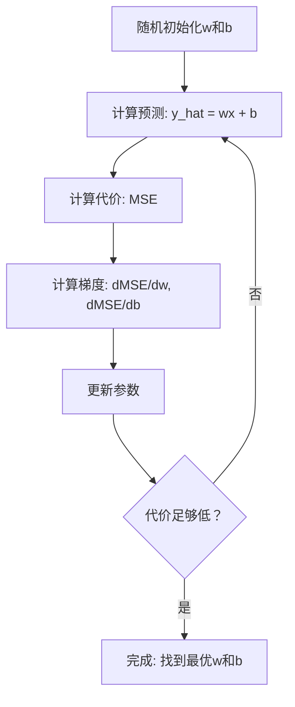

# 线性回归

> 线性回归穿过数据画最佳直线。它是机器学习的"hello world"。

**类型:** 构建
**语言:** Python
**前置要求:** 第1阶段 (线性代数、微积分、优化), 第2阶段 课程1
**时间:** ~90分钟

## 学习目标

- 推导均方误差的梯度下降更新规则并从零实现线性回归
- 比较梯度下降和正规方程的计算复杂度及何时用哪个
- 构建带特征标准化的多元线性回归模型并解释学习权重
- 解释Ridge回归(L2正则化)如何通过惩罚大权重防止过拟合

## 问题背景

你有数据: 房屋大小和售价。你想给定新房子大小预测价格。你可以在散点图上目测，但你需要公式。你需要一条最佳拟合数据的线，使你可代入任意大小得价格预测。

线性回归给你那条线。更重要，它引入整个ML训练循环: 定义模型、定义代价函数、优化参数。每个ML算法遵循相同模式。在最简单情况掌握它，你会到处认出它。

这不只用于简单问题。线性回归用于生产系统的需求预测、A/B测试分析、金融建模，并作为每个回归任务的基线。

## 概念讲解

### 模型

线性回归假设输入和输出间线性关系:

```
y = wx + b
```

- `w` (权重/斜率): x增加1时y变化多少
- `b` (偏置/截距): x = 0时的y值

对多输入(特征)，扩展为:

```
y = w1*x1 + w2*x2 + ... + wn*xn + b
```

或向量形式: `y = w^T * x + b`

目标: 找w和b值使所有训练例子的预测y尽量接近实际y。

### 代价函数(均方误差)

如何测量"尽量接近"？你需要单个数字捕获预测多错。最常用选择是均方误差(MSE):

```
MSE = (1/n) * sum((y_predicted - y_actual)^2)
```

为何平方？两原因。第一，更重惩罚大误差而非小误差(误差10比误差1坏100倍，非10倍)。第二，平方函数平滑且处处可微，使优化直接。

代价函数创建曲面。对单权重w和偏置b，MSE曲面像碗(凸抛物面)。碗底MSE最小。训练意味找那底。

### 梯度下降

梯度下降通过下坡步找碗底。



梯度告诉你两事: 每参数移向哪个方向，移多少。

对MSE和 y_hat = wx + b:

```
dMSE/dw = (2/n) * sum((y_hat - y) * x)
dMSE/db = (2/n) * sum(y_hat - y)
```

更新规则:

```
w = w - learning_rate * dMSE/dw
b = b - learning_rate * dMSE/db
```

学习率控制步大小。太大: 你越过最小值发散。太小: 训练耗时永远。典型起始值: 0.01, 0.001, 或 0.0001。

### 正规方程(闭式解)

线性回归有直接公式给出最优权重无需迭代:

```
w = (X^T * X)^(-1) * X^T * y
```

这逆矩阵一步解w。对小数据集完美工作。大数据集(百万行或数千特征)，梯度下降更优因矩阵逆是O(n^3)特征数复杂度。

### 多元线性回归

多特征时，模型变为:

```
y = w1*x1 + w2*x2 + ... + wn*xn + b
```

一切相同: MSE是代价函数，梯度下降同时更新所有权重。唯一差异是你拟合超平面而非直线。

这里特征缩放重要。如果一个特征范围0到1而另一个范围0到1,000,000，梯度下降困难因代价曲面拉长。训练前标准化特征(减均值，除标准差)。

### 多项式回归

如果关系非线性？你仍可用线性回归通过创建多项式特征:

```
y = w1*x + w2*x^2 + w3*x^3 + b
```

这仍是"线性"回归因模型对权重(w1, w2, w3)线性。你只是用x的非线性特征。

高阶多项式可拟合更复杂曲线但风险过拟合。10阶多项式会穿过10点数据集每个点但对新数据预测差。

### R平方得分

MSE告诉你多错，但数字依赖y尺度。R平方(R^2)给尺度无关度量:

```
R^2 = 1 - (残差平方和) / (均值偏差平方和)
    = 1 - SS_res / SS_tot
```

- R^2 = 1.0: 完美预测
- R^2 = 0.0: 模型不比每次预测均值好
- R^2 < 0.0: 模型比预测均值差

### 正则化预览(Ridge回归)

当你有许多特征，模型可通过分配大权重过拟合。Ridge回归(L2正则化)加惩罚:

```
Cost = MSE + lambda * sum(w_i^2)
```

惩罚项阻止大权重。超参数lambda控制权衡: 更高lambda意味更小权重和更多正则化。后续课程深入覆盖。现在，知道它存在和为何有帮助。

## 构建

### 步骤1: 生成样本数据

```python
import random
import math

random.seed(42)

TRUE_W = 3.0
TRUE_B = 7.0
N_SAMPLES = 100

X = [random.uniform(0, 10) for _ in range(N_SAMPLES)]
y = [TRUE_W * x + TRUE_B + random.gauss(0, 2.0) for x in X]

print(f"Generated {N_SAMPLES} samples")
print(f"True relationship: y = {TRUE_W}x + {TRUE_B} (+ noise)")
print(f"First 5 points: {[(round(X[i], 2), round(y[i], 2)) for i in range(5)]}")
```

### 步骤2: 从零梯度下降线性回归

```python
class LinearRegression:
    def __init__(self, learning_rate=0.01):
        self.w = 0.0
        self.b = 0.0
        self.lr = learning_rate
        self.cost_history = []

    def predict(self, X):
        return [self.w * x + self.b for x in X]

    def compute_cost(self, X, y):
        predictions = self.predict(X)
        n = len(y)
        cost = sum((pred - actual) ** 2 for pred, actual in zip(predictions, y)) / n
        return cost

    def compute_gradients(self, X, y):
        predictions = self.predict(X)
        n = len(y)
        dw = (2 / n) * sum((pred - actual) * x for pred, actual, x in zip(predictions, y, X))
        db = (2 / n) * sum(pred - actual for pred, actual in zip(predictions, y))
        return dw, db

    def fit(self, X, y, epochs=1000, print_every=200):
        for epoch in range(epochs):
            dw, db = self.compute_gradients(X, y)
            self.w -= self.lr * dw
            self.b -= self.lr * db
            cost = self.compute_cost(X, y)
            self.cost_history.append(cost)
            if epoch % print_every == 0:
                print(f"  Epoch {epoch:4d} | Cost: {cost:.4f} | w: {self.w:.4f} | b: {self.b:.4f}")
        return self

    def r_squared(self, X, y):
        predictions = self.predict(X)
        y_mean = sum(y) / len(y)
        ss_res = sum((actual - pred) ** 2 for actual, pred in zip(y, predictions))
        ss_tot = sum((actual - y_mean) ** 2 for actual in y)
        return 1 - (ss_res / ss_tot)


print("=== Training Linear Regression (Gradient Descent) ===")
model = LinearRegression(learning_rate=0.005)
model.fit(X, y, epochs=1000, print_every=200)
print(f"\nLearned: y = {model.w:.4f}x + {model.b:.4f}")
print(f"True:    y = {TRUE_W}x + {TRUE_B}")
print(f"R-squared: {model.r_squared(X, y):.4f}")
```

### 步骤3: 正规方程(闭式解)

```python
class LinearRegressionNormal:
    def __init__(self):
        self.w = 0.0
        self.b = 0.0

    def fit(self, X, y):
        n = len(X)
        x_mean = sum(X) / n
        y_mean = sum(y) / n
        numerator = sum((X[i] - x_mean) * (y[i] - y_mean) for i in range(n))
        denominator = sum((X[i] - x_mean) ** 2 for i in range(n))
        self.w = numerator / denominator
        self.b = y_mean - self.w * x_mean
        return self

    def predict(self, X):
        return [self.w * x + self.b for x in X]

    def r_squared(self, X, y):
        predictions = self.predict(X)
        y_mean = sum(y) / len(y)
        ss_res = sum((actual - pred) ** 2 for actual, pred in zip(y, predictions))
        ss_tot = sum((actual - y_mean) ** 2 for actual in y)
        return 1 - (ss_res / ss_tot)


print("\n=== Normal Equation (Closed-Form) ===")
model_normal = LinearRegressionNormal()
model_normal.fit(X, y)
print(f"Learned: y = {model_normal.w:.4f}x + {model_normal.b:.4f}")
print(f"R-squared: {model_normal.r_squared(X, y):.4f}")
```

### 步骤4: 多元线性回归

```python
class MultipleLinearRegression:
    def __init__(self, n_features, learning_rate=0.01):
        self.weights = [0.0] * n_features
        self.bias = 0.0
        self.lr = learning_rate
        self.cost_history = []

    def predict_single(self, x):
        return sum(w * xi for w, xi in zip(self.weights, x)) + self.bias

    def predict(self, X):
        return [self.predict_single(x) for x in X]

    def compute_cost(self, X, y):
        predictions = self.predict(X)
        n = len(y)
        return sum((pred - actual) ** 2 for pred, actual in zip(predictions, y)) / n

    def fit(self, X, y, epochs=1000, print_every=200):
        n = len(y)
        n_features = len(X[0])
        for epoch in range(epochs):
            predictions = self.predict(X)
            errors = [pred - actual for pred, actual in zip(predictions, y)]
            for j in range(n_features):
                grad = (2 / n) * sum(errors[i] * X[i][j] for i in range(n))
                self.weights[j] -= self.lr * grad
            grad_b = (2 / n) * sum(errors)
            self.bias -= self.lr * grad_b
            cost = self.compute_cost(X, y)
            self.cost_history.append(cost)
            if epoch % print_every == 0:
                print(f"  Epoch {epoch:4d} | Cost: {cost:.4f}")
        return self

    def r_squared(self, X, y):
        predictions = self.predict(X)
        y_mean = sum(y) / len(y)
        ss_res = sum((actual - pred) ** 2 for actual, pred in zip(y, predictions))
        ss_tot = sum((actual - y_mean) ** 2 for actual in y)
        return 1 - (ss_res / ss_tot)


random.seed(42)
N = 100
X_multi = []
y_multi = []
for _ in range(N):
    size = random.uniform(500, 3000)
    bedrooms = random.randint(1, 5)
    age = random.uniform(0, 50)
    price = 50 * size + 10000 * bedrooms - 1000 * age + 50000 + random.gauss(0, 20000)
    X_multi.append([size, bedrooms, age])
    y_multi.append(price)


def standardize(X):
    n_features = len(X[0])
    means = [sum(X[i][j] for i in range(len(X))) / len(X) for j in range(n_features)]
    stds = []
    for j in range(n_features):
        variance = sum((X[i][j] - means[j]) ** 2 for i in range(len(X))) / len(X)
        stds.append(variance ** 0.5)
    X_scaled = []
    for i in range(len(X)):
        row = [(X[i][j] - means[j]) / stds[j] if stds[j] > 0 else 0 for j in range(n_features)]
        X_scaled.append(row)
    return X_scaled, means, stds


y_mean_val = sum(y_multi) / len(y_multi)
y_std_val = (sum((yi - y_mean_val) ** 2 for yi in y_multi) / len(y_multi)) ** 0.5
y_scaled = [(yi - y_mean_val) / y_std_val for yi in y_multi]

X_scaled, x_means, x_stds = standardize(X_multi)

print("\n=== Multiple Linear Regression (3 features) ===")
print("Features: house size, bedrooms, age")
multi_model = MultipleLinearRegression(n_features=3, learning_rate=0.01)
multi_model.fit(X_scaled, y_scaled, epochs=1000, print_every=200)

print(f"\nWeights (standardized): {[round(w, 4) for w in multi_model.weights]}")
print(f"Bias (standardized): {multi_model.bias:.4f}")
print(f"R-squared: {multi_model.r_squared(X_scaled, y_scaled):.4f}")
```

### 步骤5: 多项式回归

```python
class PolynomialRegression:
    def __init__(self, degree, learning_rate=0.01):
        self.degree = degree
        self.weights = [0.0] * degree
        self.bias = 0.0
        self.lr = learning_rate

    def make_features(self, X):
        return [[x ** (d + 1) for d in range(self.degree)] for x in X]

    def predict(self, X):
        features = self.make_features(X)
        return [sum(w * f for w, f in zip(self.weights, row)) + self.bias for row in features]

    def fit(self, X, y, epochs=1000, print_every=200):
        features = self.make_features(X)
        n = len(y)
        for epoch in range(epochs):
            predictions = [sum(w * f for w, f in zip(self.weights, row)) + self.bias for row in features]
            errors = [pred - actual for pred, actual in zip(predictions, y)]
            for j in range(self.degree):
                grad = (2 / n) * sum(errors[i] * features[i][j] for i in range(n))
                self.weights[j] -= self.lr * grad
            grad_b = (2 / n) * sum(errors)
            self.bias -= self.lr * grad_b
            if epoch % print_every == 0:
                cost = sum(e ** 2 for e in errors) / n
                print(f"  Epoch {epoch:4d} | Cost: {cost:.6f}")
        return self

    def r_squared(self, X, y):
        predictions = self.predict(X)
        y_mean = sum(y) / len(y)
        ss_res = sum((actual - pred) ** 2 for actual, pred in zip(y, predictions))
        ss_tot = sum((actual - y_mean) ** 2 for actual in y)
        return 1 - (ss_res / ss_tot)


random.seed(42)
X_poly = [x / 10.0 for x in range(0, 50)]
y_poly = [0.5 * x ** 2 - 2 * x + 3 + random.gauss(0, 1.0) for x in X_poly]

x_max = max(abs(x) for x in X_poly)
X_poly_norm = [x / x_max for x in X_poly]
y_poly_mean = sum(y_poly) / len(y_poly)
y_poly_std = (sum((yi - y_poly_mean) ** 2 for yi in y_poly) / len(y_poly)) ** 0.5
y_poly_norm = [(yi - y_poly_mean) / y_poly_std for yi in y_poly]

print("\n=== Polynomial Regression (degree 2 vs degree 5) ===")
print("True relationship: y = 0.5x^2 - 2x + 3")

print("\nDegree 2:")
poly2 = PolynomialRegression(degree=2, learning_rate=0.1)
poly2.fit(X_poly_norm, y_poly_norm, epochs=2000, print_every=500)
print(f"  R-squared: {poly2.r_squared(X_poly_norm, y_poly_norm):.4f}")

print("\nDegree 5:")
poly5 = PolynomialRegression(degree=5, learning_rate=0.1)
poly5.fit(X_poly_norm, y_poly_norm, epochs=2000, print_every=500)
print(f"  R-squared: {poly5.r_squared(X_poly_norm, y_poly_norm):.4f}")

print("\nDegree 2 fits the true curve well. Degree 5 fits training data slightly better")
print("but risks overfitting on new data.")
```

### 步骤6: Ridge回归(L2正则化)

```python
class RidgeRegression:
    def __init__(self, n_features, learning_rate=0.01, alpha=1.0):
        self.weights = [0.0] * n_features
        self.bias = 0.0
        self.lr = learning_rate
        self.alpha = alpha

    def predict_single(self, x):
        return sum(w * xi for w, xi in zip(self.weights, x)) + self.bias

    def predict(self, X):
        return [self.predict_single(x) for x in X]

    def fit(self, X, y, epochs=1000, print_every=200):
        n = len(y)
        n_features = len(X[0])
        for epoch in range(epochs):
            predictions = self.predict(X)
            errors = [pred - actual for pred, actual in zip(predictions, y)]
            mse = sum(e ** 2 for e in errors) / n
            reg_term = self.alpha * sum(w ** 2 for w in self.weights)
            cost = mse + reg_term
            for j in range(n_features):
                grad = (2 / n) * sum(errors[i] * X[i][j] for i in range(n))
                grad += 2 * self.alpha * self.weights[j]
                self.weights[j] -= self.lr * grad
            grad_b = (2 / n) * sum(errors)
            self.bias -= self.lr * grad_b
            if epoch % print_every == 0:
                print(f"  Epoch {epoch:4d} | Cost: {cost:.4f} | L2 penalty: {reg_term:.4f}")
        return self


print("\n=== Ridge Regression (L2 Regularization) ===")
print("Same data as multiple regression, with alpha=0.1")
ridge = RidgeRegression(n_features=3, learning_rate=0.01, alpha=0.1)
ridge.fit(X_scaled, y_scaled, epochs=1000, print_every=200)
print(f"\nRidge weights: {[round(w, 4) for w in ridge.weights]}")
print(f"Plain weights: {[round(w, 4) for w in multi_model.weights]}")
print("Ridge weights are smaller (shrunk toward zero) due to the L2 penalty.")
```

## 使用

现在用scikit-learn做同样事，你生产中实际用的。

```python
from sklearn.linear_model import LinearRegression as SklearnLR
from sklearn.linear_model import Ridge
from sklearn.preprocessing import PolynomialFeatures, StandardScaler
from sklearn.model_selection import train_test_split
from sklearn.metrics import mean_squared_error, r2_score
import numpy as np

np.random.seed(42)
X_sk = np.random.uniform(0, 10, (100, 1))
y_sk = 3.0 * X_sk.squeeze() + 7.0 + np.random.normal(0, 2.0, 100)

X_train, X_test, y_train, y_test = train_test_split(X_sk, y_sk, test_size=0.2, random_state=42)

lr = SklearnLR()
lr.fit(X_train, y_train)
y_pred = lr.predict(X_test)

print("=== Scikit-learn Linear Regression ===")
print(f"Coefficient (w): {lr.coef_[0]:.4f}")
print(f"Intercept (b): {lr.intercept_:.4f}")
print(f"R-squared (test): {r2_score(y_test, y_pred):.4f}")
print(f"MSE (test): {mean_squared_error(y_test, y_pred):.4f}")

poly = PolynomialFeatures(degree=2, include_bias=False)
X_poly_sk = poly.fit_transform(X_train)
X_poly_test = poly.transform(X_test)

lr_poly = SklearnLR()
lr_poly.fit(X_poly_sk, y_train)
print(f"\nPolynomial degree 2 R-squared: {r2_score(y_test, lr_poly.predict(X_poly_test)):.4f}")

scaler = StandardScaler()
X_train_scaled = scaler.fit_transform(X_train)
X_test_scaled = scaler.transform(X_test)

ridge = Ridge(alpha=1.0)
ridge.fit(X_train_scaled, y_train)
print(f"Ridge R-squared: {r2_score(y_test, ridge.predict(X_test_scaled)):.4f}")
print(f"Ridge coefficient: {ridge.coef_[0]:.4f}")
```

你的从零实现和scikit-learn产生相同结果。差异: scikit-learn处理边界情况、数值稳定性和性能优化。生产用库。从零版本用于理解发生了什么。

## 交付成果

本课程产生:
- `outputs/skill-regression.md` - 基于问题选择正确回归方法的技能

## 练习题

1. 实现批量梯度下降、随机梯度下降(SGD)和小批量梯度下降。在相同数据集比较收敛速度。哪个收敛最快？哪个代价曲线最平滑？
2. 从三次函数生成数据(y = ax^3 + bx^2 + cx + d + 噪声)。拟合1、3和10阶多项式。比较训练R^2和测试R^2。何时过拟合明显？
3. 实现Lasso回归(L1正则化: penalty = alpha * sum(|w_i|))。在多特征房价数据训练。比较哪些权重归零vs Ridge。为何L1产生稀疏解而L2不？

## 关键术语

| 术语 | 人们怎么说 | 实际含义 |
|------|----------------|----------------------|
| 线性回归 | "穿过数据画线" | 找权重w和偏置b最小化wx+b与实际y值平方差之和 |
| 代价函数 | "模型多差" | 将模型参数映射到单数字测量预测误差的函数，优化最小化它 |
| 均方误差 | "平方误差平均" | (1/n) * sum of (predicted - actual)^2, 不成比例惩罚大误差 |
| 梯度下降 | "下坡走" | 用偏导迭代调整参数到减少代价函数的方向 |
| 学习率 | "步大小" | 控制每梯度下降步参数变化多少的标量 |
| 正规方程 | "直接解" | 闭式解 w = (X^T X)^-1 X^T y 给最优权重无需迭代 |
| R平方 | "拟合多好" | 模型解释y方差比例，从负无穷到1.0范围 |
| 特征缩放 | "让特征可比" | 变换特征到相似范围(如零均值单位方差)使梯度下降收敛更快 |
| 正则化 | "惩罚复杂度" | 给代价函数加项收缩权重，防止过拟合 |
| Ridge回归 | "L2正则化" | 加lambda * sum(w_i^2)惩罚到MSE的线性回归 |
| 多项式回归 | "用线性数学拟合曲线" | 多项式特征(x, x^2, x^3, ...)上的线性回归，仍对权重线性 |
| 过拟合 | "记忆训练数据" | 用复杂模型拟合训练数据噪声在新数据失败 |

## 延伸阅读

- [An Introduction to Statistical Learning (ISLR)](https://www.statlearning.com/) -- 免费PDF，第3和6章覆盖线性回归和正则化，带实用R例子
- [The Elements of Statistical Learning (ESL)](https://hastie.su.domains/ElemStatLearn/) -- 免费PDF，ISLR更数学伴侣，更深入处理ridge和lasso
- [Stanford CS229 Lecture Notes on Linear Regression](https://cs229.stanford.edu/main_notes.pdf) -- Andrew Ng笔记从第一性原理推导正规方程和梯度下降
- [scikit-learn LinearRegression documentation](https://scikit-learn.org/stable/modules/linear_model.html) -- LinearRegression, Ridge, Lasso, 和ElasticNet实用参考，带代码例子