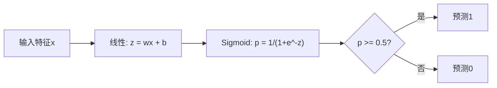
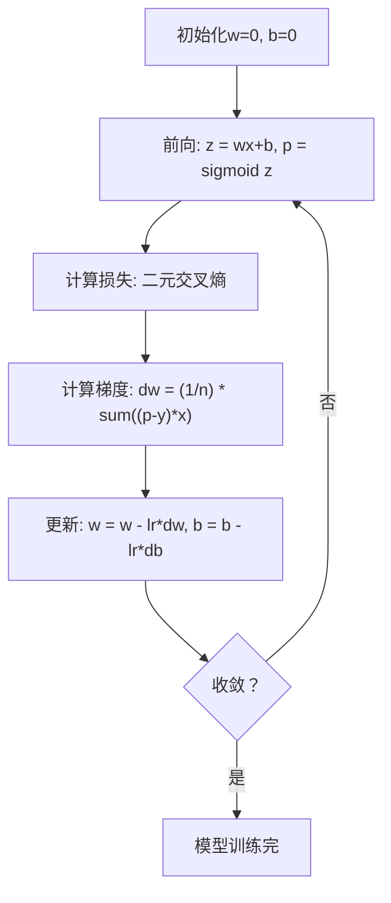

# 逻辑回归

> 逻辑回归把直线弯成S曲线，用概率回答是非问题。

**类型:** 构建
**语言:** Python
**前置要求:** 第2阶段 课程1-2 (什么是ML, 线性回归)
**时间:** ~90分钟

## 学习目标

- 从零用sigmoid函数和二元交叉熵损失实现逻辑回归
- 计算并解释精度、召回、F1分数和二元分类的混淆矩阵
- 解释为何MSE在分类失败以及为何二元交叉熵产生凸代价曲面
- 构建softmax回归模型做多类分类并评估阈值调优权衡

## 问题背景

你想预测肿瘤是恶性还是良性，给定其大小。你试线性回归。它输出数字如0.3或1.7或-0.5。这些意味什么？1.7是"非常恶性"？-0.5是"非常良性"？线性回归输出无界数。分类需要0和1间有界概率，和明确决定: 是或否。

逻辑回归解决这。它取相同线性组合(wx + b)并通过sigmoid函数，将任意数压缩到范围(0, 1)。输出是概率。你设阈值(通常0.5)做决定。

这是实践中最广泛使用算法之一。尽管名字，逻辑回归是分类算法，非回归算法。名字来自它用的逻辑(sigmoid)函数。

## 概念讲解

### 为何线性回归在分类失败

想象基于学习小时预测通过/失败(1/0)。线性回归穿过数据拟合线:

```
hours:  1   2   3   4   5   6   7   8   9   10
actual: 0   0   0   0   1   1   1   1   1   1
```

线性拟合可能在小时1产生预测-0.2，小时10产生1.3。这些值非概率。它们低于0高于1。更糟，单异常值(学50小时的人)会拖整条线，改变所有人预测。

分类需要函数:
- 输出0和1间值(概率)
- 创建尖锐过渡(决策边界)
- 不被远离边界的异常值扭曲

### Sigmoid函数

Sigmoid函数恰好做这:

```
sigmoid(z) = 1 / (1 + e^(-z))
```

性质:
- z大正时，sigmoid(z)趋近1
- z大负时，sigmoid(z)趋近0
- z = 0时，sigmoid(z) = 0.5
- 输出总在0和1之间
- 函数处处平滑可微

导数有方便形式: sigmoid'(z) = sigmoid(z) * (1 - sigmoid(z))。这使梯度计算高效。

### 逻辑回归 = 线性模型 + Sigmoid

模型计算z = wx + b(同线性回归)，然后应用sigmoid:



输出p解释为P(y=1 | x)，输入属类1的概率。决策边界是wx + b = 0，使sigmoid输出恰好0.5。

### 二元交叉熵损失

你不能用MSE做逻辑回归。MSE和sigmoid创建有多个局部最小值的非凸代价曲面。用二元交叉熵(log loss):

```
Loss = -(1/n) * sum(y * log(p) + (1-y) * log(1-p))
```

为何有效:
- y=1且p接近1: log(1) = 0，损失近0(正确，低成本)
- y=1且p接近0: log(0)趋负无穷，损失巨大(错，高成本)
- y=0且p接近0: log(1) = 0，损失近0(正确，低成本)
- y=0且p接近1: log(0)趋负无穷，损失巨大(错，高成本)

这损失函数对逻辑回归凸，保证单一全局最小。

### 逻辑回归的梯度下降

二元交叉熵和sigmoid的梯度有干净形式:

```
dL/dw = (1/n) * sum((p - y) * x)
dL/db = (1/n) * sum(p - y)
```

这些看起与线性回归梯度相同。差异是p = sigmoid(wx + b)而非p = wx + b。sigmoid引入非线性，但梯度更新规则保持相同。



### 决策边界

对二维输入(两特征)，决策边界是线:

```
w1*x1 + w2*x2 + b = 0
```

一侧点分类为1，另一侧为0。逻辑回归总产生线性决策边界。需要弯曲边界，你要加多项式特征或用非线性模型。

### 多类分类用Softmax

二元逻辑回归处理两类。对k类，用softmax函数:

```
softmax(z_i) = e^(z_i) / sum(e^(z_j) for all j)
```

每类有自己的权重向量。模型为每类计算分数z_i，然后softmax将分数转为总和为1的概率。预测类是概率最高的那个。

损失函数变为类别交叉熵:

```
Loss = -(1/n) * sum(sum(y_k * log(p_k)))
```

其中y_k对真实类为1，其他为0(one-hot编码)。

### 评估指标

单精度不够。对95%负5%正数据集，总预测负的模型得95%精度但无用。

**混淆矩阵**:

| | 预测正 | 预测负 |
|---|---|---|
| 实际正 | 真正例(TP) | 假负例(FN) |
| 实际负 | 假正例(FP) | 真负例(TN) |

**精度**: 所有预测正中，多少实际正？
```
Precision = TP / (TP + FP)
```

**召回**(敏感度): 所有实际正中，我们捕获多少？
```
Recall = TP / (TP + FN)
```

**F1分数**: 精度和召回的调和平均。平衡两者。
```
F1 = 2 * (Precision * Recall) / (Precision + Recall)
```

何时优先:
- **精度**: 假正代价高时(垃圾邮件过滤器，不想阻合法邮件)
- **召回**: 假负代价高时(癌症筛查，不想漏肿瘤)
- **F1**: 需要单一平衡指标时

## 构建

### 步骤1: Sigmoid函数和数据生成

```python
import random
import math

def sigmoid(z):
    z = max(-500, min(500, z))
    return 1.0 / (1.0 + math.exp(-z))


random.seed(42)
N = 200
X = []
y = []

for _ in range(N // 2):
    X.append([random.gauss(2, 1), random.gauss(2, 1)])
    y.append(0)

for _ in range(N // 2):
    X.append([random.gauss(5, 1), random.gauss(5, 1)])
    y.append(1)

combined = list(zip(X, y))
random.shuffle(combined)
X, y = zip(*combined)
X = list(X)
y = list(y)

print(f"Generated {N} samples (2 classes, 2 features)")
print(f"Class 0 center: (2, 2), Class 1 center: (5, 5)")
print(f"First 5 samples:")
for i in range(5):
    print(f"  Features: [{X[i][0]:.2f}, {X[i][1]:.2f}], Label: {y[i]}")
```

### 步骤2: 从零逻辑回归

```python
class LogisticRegression:
    def __init__(self, n_features, learning_rate=0.01):
        self.weights = [0.0] * n_features
        self.bias = 0.0
        self.lr = learning_rate
        self.loss_history = []

    def predict_proba(self, x):
        z = sum(w * xi for w, xi in zip(self.weights, x)) + self.bias
        return sigmoid(z)

    def predict(self, x, threshold=0.5):
        return 1 if self.predict_proba(x) >= threshold else 0

    def compute_loss(self, X, y):
        n = len(y)
        total = 0.0
        for i in range(n):
            p = self.predict_proba(X[i])
            p = max(1e-15, min(1 - 1e-15, p))
            total += y[i] * math.log(p) + (1 - y[i]) * math.log(1 - p)
        return -total / n

    def fit(self, X, y, epochs=1000, print_every=200):
        n = len(y)
        n_features = len(X[0])
        for epoch in range(epochs):
            dw = [0.0] * n_features
            db = 0.0
            for i in range(n):
                p = self.predict_proba(X[i])
                error = p - y[i]
                for j in range(n_features):
                    dw[j] += error * X[i][j]
                db += error
            for j in range(n_features):
                self.weights[j] -= self.lr * (dw[j] / n)
            self.bias -= self.lr * (db / n)
            loss = self.compute_loss(X, y)
            self.loss_history.append(loss)
            if epoch % print_every == 0:
                print(f"  Epoch {epoch:4d} | Loss: {loss:.4f} | w: [{self.weights[0]:.3f}, {self.weights[1]:.3f}] | b: {self.bias:.3f}")
        return self

    def accuracy(self, X, y):
        correct = sum(1 for i in range(len(y)) if self.predict(X[i]) == y[i])
        return correct / len(y)


split = int(0.8 * N)
X_train, X_test = X[:split], X[split:]
y_train, y_test = y[:split], y[split:]

print("\n=== Training Logistic Regression ===")
model = LogisticRegression(n_features=2, learning_rate=0.1)
model.fit(X_train, y_train, epochs=1000, print_every=200)

print(f"\nTrain accuracy: {model.accuracy(X_train, y_train):.4f}")
print(f"Test accuracy:  {model.accuracy(X_test, y_test):.4f}")
print(f"Weights: [{model.weights[0]:.4f}, {model.weights[1]:.4f}]")
print(f"Bias: {model.bias:.4f}")
```

### 步骤3: 从零混淆矩阵和指标

```python
class ClassificationMetrics:
    def __init__(self, y_true, y_pred):
        self.tp = sum(1 for t, p in zip(y_true, y_pred) if t == 1 and p == 1)
        self.tn = sum(1 for t, p in zip(y_true, y_pred) if t == 0 and p == 0)
        self.fp = sum(1 for t, p in zip(y_true, y_pred) if t == 0 and p == 1)
        self.fn = sum(1 for t, p in zip(y_true, y_pred) if t == 1 and p == 0)

    def accuracy(self):
        total = self.tp + self.tn + self.fp + self.fn
        return (self.tp + self.tn) / total if total > 0 else 0

    def precision(self):
        denom = self.tp + self.fp
        return self.tp / denom if denom > 0 else 0

    def recall(self):
        denom = self.tp + self.fn
        return self.tp / denom if denom > 0 else 0

    def f1(self):
        p = self.precision()
        r = self.recall()
        return 2 * p * r / (p + r) if (p + r) > 0 else 0

    def print_confusion_matrix(self):
        print(f"\n  Confusion Matrix:")
        print(f"                  Predicted")
        print(f"                  Pos   Neg")
        print(f"  Actual Pos     {self.tp:4d}  {self.fn:4d}")
        print(f"  Actual Neg     {self.fp:4d}  {self.tn:4d}")

    def print_report(self):
        self.print_confusion_matrix()
        print(f"\n  Accuracy:  {self.accuracy():.4f}")
        print(f"  Precision: {self.precision():.4f}")
        print(f"  Recall:    {self.recall():.4f}")
        print(f"  F1 Score:  {self.f1():.4f}")


y_pred_test = [model.predict(x) for x in X_test]
print("\n=== Classification Report (Test Set) ===")
metrics = ClassificationMetrics(y_test, y_pred_test)
metrics.print_report()
```

### 步骤4: 决策边界分析

```python
print("\n=== Decision Boundary ===")
w1, w2 = model.weights
b = model.bias
print(f"Decision boundary: {w1:.4f}*x1 + {w2:.4f}*x2 + {b:.4f} = 0")
if abs(w2) > 1e-10:
    print(f"Solved for x2:     x2 = {-w1/w2:.4f}*x1 + {-b/w2:.4f}")

print("\nSample predictions near the boundary:")
test_points = [
    [3.0, 3.0],
    [3.5, 3.5],
    [4.0, 4.0],
    [2.5, 2.5],
    [5.0, 5.0],
]
for point in test_points:
    prob = model.predict_proba(point)
    pred = model.predict(point)
    print(f"  [{point[0]}, {point[1]}] -> prob={prob:.4f}, class={pred}")
```

### 步骤5: 多类用Softmax

```python
class SoftmaxRegression:
    def __init__(self, n_features, n_classes, learning_rate=0.01):
        self.n_features = n_features
        self.n_classes = n_classes
        self.lr = learning_rate
        self.weights = [[0.0] * n_features for _ in range(n_classes)]
        self.biases = [0.0] * n_classes

    def softmax(self, scores):
        max_score = max(scores)
        exp_scores = [math.exp(s - max_score) for s in scores]
        total = sum(exp_scores)
        return [e / total for e in exp_scores]

    def predict_proba(self, x):
        scores = [
            sum(self.weights[k][j] * x[j] for j in range(self.n_features)) + self.biases[k]
            for k in range(self.n_classes)
        ]
        return self.softmax(scores)

    def predict(self, x):
        probs = self.predict_proba(x)
        return probs.index(max(probs))

    def fit(self, X, y, epochs=1000, print_every=200):
        n = len(y)
        for epoch in range(epochs):
            grad_w = [[0.0] * self.n_features for _ in range(self.n_classes)]
            grad_b = [0.0] * self.n_classes
            total_loss = 0.0
            for i in range(n):
                probs = self.predict_proba(X[i])
                for k in range(self.n_classes):
                    target = 1.0 if y[i] == k else 0.0
                    error = probs[k] - target
                    for j in range(self.n_features):
                        grad_w[k][j] += error * X[i][j]
                    grad_b[k] += error
                true_prob = max(probs[y[i]], 1e-15)
                total_loss -= math.log(true_prob)
            for k in range(self.n_classes):
                for j in range(self.n_features):
                    self.weights[k][j] -= self.lr * (grad_w[k][j] / n)
                self.biases[k] -= self.lr * (grad_b[k] / n)
            if epoch % print_every == 0:
                print(f"  Epoch {epoch:4d} | Loss: {total_loss / n:.4f}")
        return self

    def accuracy(self, X, y):
        correct = sum(1 for i in range(len(y)) if self.predict(X[i]) == y[i])
        return correct / len(y)


random.seed(42)
X_3class = []
y_3class = []

centers = [(1, 1), (5, 1), (3, 5)]
for label, (cx, cy) in enumerate(centers):
    for _ in range(50):
        X_3class.append([random.gauss(cx, 0.8), random.gauss(cy, 0.8)])
        y_3class.append(label)

combined = list(zip(X_3class, y_3class))
random.shuffle(combined)
X_3class, y_3class = zip(*combined)
X_3class = list(X_3class)
y_3class = list(y_3class)

split_3 = int(0.8 * len(X_3class))
X_train_3 = X_3class[:split_3]
y_train_3 = y_3class[:split_3]
X_test_3 = X_3class[split_3:]
y_test_3 = y_3class[split_3:]

print("\n=== Multi-class Softmax Regression (3 classes) ===")
softmax_model = SoftmaxRegression(n_features=2, n_classes=3, learning_rate=0.1)
softmax_model.fit(X_train_3, y_train_3, epochs=1000, print_every=200)
print(f"\nTrain accuracy: {softmax_model.accuracy(X_train_3, y_train_3):.4f}")
print(f"Test accuracy:  {softmax_model.accuracy(X_test_3, y_test_3):.4f}")

print("\nSample predictions:")
for i in range(5):
    probs = softmax_model.predict_proba(X_test_3[i])
    pred = softmax_model.predict(X_test_3[i])
    print(f"  True: {y_test_3[i]}, Predicted: {pred}, Probs: [{', '.join(f'{p:.3f}' for p in probs)}]")
```

### 步骤6: 阈值调优

```python
print("\n=== Threshold Tuning ===")
print("Default threshold: 0.5. Adjusting the threshold trades precision for recall.\n")

thresholds = [0.3, 0.4, 0.5, 0.6, 0.7]
print(f"{'Threshold':>10} {'Accuracy':>10} {'Precision':>10} {'Recall':>10} {'F1':>10}")
print("-" * 52)

for t in thresholds:
    y_pred_t = [1 if model.predict_proba(x) >= t else 0 for x in X_test]
    m = ClassificationMetrics(y_test, y_pred_t)
    print(f"{t:>10.1f} {m.accuracy():>10.4f} {m.precision():>10.4f} {m.recall():>10.4f} {m.f1():>10.4f}")
```

## 使用

现在用scikit-learn做同样事。

```python
from sklearn.linear_model import LogisticRegression as SklearnLR
from sklearn.metrics import accuracy_score, precision_score, recall_score, f1_score
from sklearn.metrics import confusion_matrix, classification_report
from sklearn.model_selection import train_test_split
from sklearn.preprocessing import StandardScaler
import numpy as np

np.random.seed(42)
X_0 = np.random.randn(100, 2) + [2, 2]
X_1 = np.random.randn(100, 2) + [5, 5]
X_sk = np.vstack([X_0, X_1])
y_sk = np.array([0] * 100 + [1] * 100)

X_tr, X_te, y_tr, y_te = train_test_split(X_sk, y_sk, test_size=0.2, random_state=42)

scaler = StandardScaler()
X_tr_sc = scaler.fit_transform(X_tr)
X_te_sc = scaler.transform(X_te)

lr = SklearnLR()
lr.fit(X_tr_sc, y_tr)
y_pred = lr.predict(X_te_sc)

print("=== Scikit-learn Logistic Regression ===")
print(f"Accuracy:  {accuracy_score(y_te, y_pred):.4f}")
print(f"Precision: {precision_score(y_te, y_pred):.4f}")
print(f"Recall:    {recall_score(y_te, y_pred):.4f}")
print(f"F1:        {f1_score(y_te, y_pred):.4f}")
print(f"\nConfusion Matrix:\n{confusion_matrix(y_te, y_pred)}")
print(f"\nClassification Report:\n{classification_report(y_te, y_pred)}")
```

你的从零实现产生相同决策边界和指标。Scikit-learn加求解器选项(liblinear, lbfgs, saga)、自动正则化、多类策略(one-vs-rest, multinomial)和数值稳定性优化。

## 交付成果

本课程产生:
- `code/logistic_regression.py` - 带指标的从零逻辑回归

## 练习题

1. 生成非线性可分数据集(如两个同心圆)。训练逻辑回归观察其失败。然后加多项式特征(x1^2, x2^2, x1*x2)再训练。展示精度改善。
2. 为3类softmax模型实现多类混淆矩阵。计算每类精度和召回。哪类最难分类？
3. 从零构建ROC曲线。对0到1的100个阈值值，计算真正例率和假正例率。用梯形法则计算AUC(曲线下面积)。

## 关键术语

| 术语 | 人们怎么说 | 实际含义 |
|------|----------------|----------------------|
| 逻辑回归 | "分类用的回归" | 后跟sigmoid函数输出类概率的线性模型 |
| Sigmoid函数 | "S曲线" | 函数1/(1+e^(-z))将任意实数映射到范围(0, 1) |
| 二元交叉熵 | "Log损失" | 损失函数-[y*log(p) + (1-y)*log(1-p)]严重惩罚自信错误预测 |
| 决策边界 | "分界线" | 模型输出概率等于0.5的曲面，分隔预测类 |
| Softmax | "多类sigmoid" | 将分数向量转为总和为1的概率的函数 |
| 精度 | "选多少是相关的" | TP / (TP + FP)，正预测中实际正的比例 |
| 召回 | "相关多少被选中" | TP / (TP + FN)，模型正确识别的实际正比例 |
| F1分数 | "平衡精度" | 精度和召回的调和平均: 2*P*R / (P+R) |
| 混淆矩阵 | "错误分解" | 显示每类对TP, TN, FP, FN计数的表 |
| 阈值 | " cutoff" | 模型预测类1的概率值(默认0.5，可调) |
| One-hot编码 | "类别用二进制列" | 将类k表示为零向量在位置k处为1 |
| 类别交叉熵 | "多类log损失" | 二元交叉熵用one-hot编码标签对k类的扩展 |