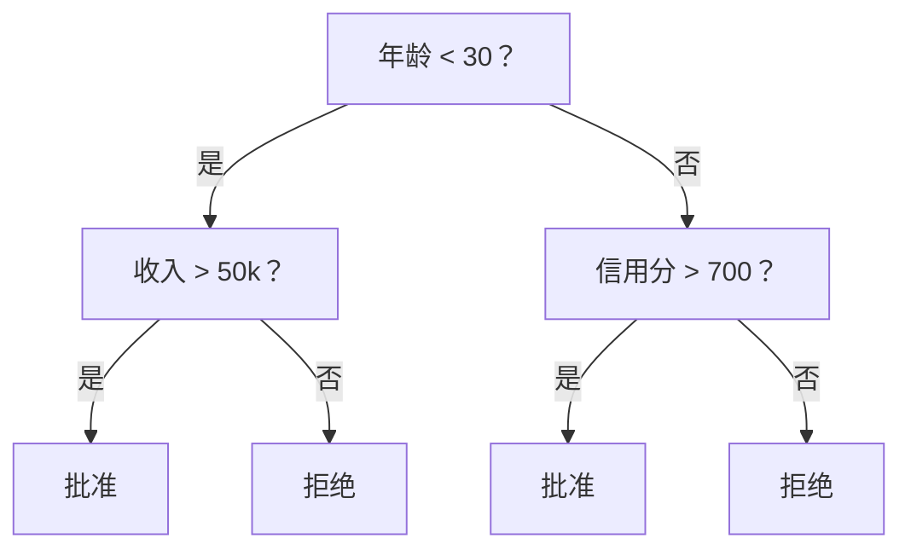
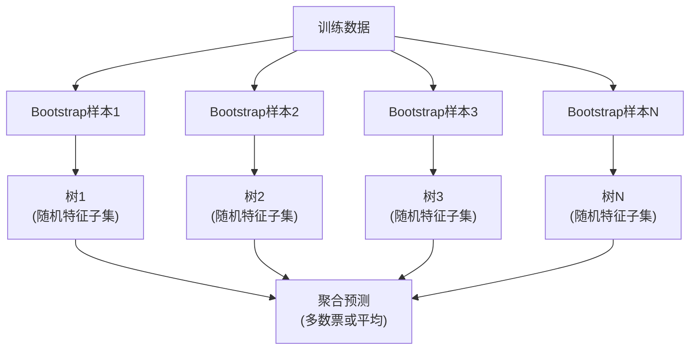

# 决策树与随机森林

> 决策树只是一张流程图。但一片森林是ML中最强大工具之一。

**类型:** 构建
**语言:** Python
**前置要求:** 第1阶段 (课程09 信息论, 06 概率)
**时间:** ~90分钟

## 学习目标

- 实现Gini不纯度、熵和信息增益计算找最优决策树分裂
- 从零构建带预剪枝控制的决策树分类器(最大深度、最小样本)
- 用bootstrap采样和特征随机化构建随机森林，并解释为何它减少方差
- 比较MDI特征重要性和置换重要性，识别何时MDI有偏

## 问题背景

你有表格数据。行是样本，列是特征，还有你想预测的目标列。你可以扔神经网络。但表格数据，树模型(决策树、随机森林、梯度提升树)持续胜过深度学习。Kaggle结构化数据竞赛由XGBoost和LightGBM主导，而非Transformer。

为何？树无需预处理处理混合特征类型(数值和类别)。无需特征工程处理非线性关系。它们可解释: 你可以看树看到预测为何做出。且随机森林，平均许多树，对中等规模数据集高度抗过拟合。

本课程从零用递归分裂构建决策树，然后在之上构建随机森林。你将实现分裂准则背后数学(Gini不纯度、熵、信息增益)并理解为何弱学习者集成成为强者。

## 概念讲解

### 决策树做什么

决策树通过问一系列是/否问题将特征空间划分为矩形区域。



每个内部节点测试特征对阈值。每个叶节点做预测。分类新数据点，你从根开始沿分支直到叶。

树自上而下构建，每节点选择最好分隔数据的特征和阈值。"最好"由分裂准则定义。

### 分裂准则: 测量不纯度

每节点，我们有样本集。我们要分裂它们使子节点尽可能"纯"，意味每个子主要含一类。

**Gini不纯度**测量随机样本如果按该节点类分布标签会被错误分类的概率。

```
Gini(S) = 1 - sum(p_k^2)

其中p_k是集S中类k比例。
```

纯节点(全一类)，Gini = 0。二元分裂50/50类，Gini = 0.5。低更好。

```
例子: 6猫4狗

Gini = 1 - (0.6^2 + 0.4^2) = 1 - (0.36 + 0.16) = 0.48
```

**熵**测量节点信息内容(混乱)。第1阶段课程09覆盖。

```
Entropy(S) = -sum(p_k * log2(p_k))
```

纯节点，熵 = 0。50/50二元分裂，熵 = 1.0。低更好。

```
例子: 6猫4狗

Entropy = -(0.6 * log2(0.6) + 0.4 * log2(0.4))
        = -(0.6 * -0.737 + 0.4 * -1.322)
        = 0.442 + 0.529
        = 0.971 bits
```

**信息增益**是分裂后不纯度(熵或Gini)减少。

```
IG(S, feature, threshold) = Impurity(S) - weighted_avg(Impurity(S_left), Impurity(S_right))

权重是每子样本比例。
```

每节点贪婪算法: 试每个特征和每个可能阈值。选信息增益最大的(特征, 阈值)对。

### 分裂如何工作

对n特征和当前节点m样本的数据集:

1. 对每特征j (j = 1到n):
   - 按特征j排序样本
   - 试每个连续不同值间中点作为阈值
   - 计算每阈值信息增益
2. 选最高信息增益特征和阈值
3. 将数据分左(特征 <= 阈值)和右(特征 > 阈值)
4. 每子递归

这贪婪方法不保证全局最优树。找最优树NP难。但贪婪分裂实践工作好。

### 停止条件

无停止条件，树生长到每叶纯(每叶一样本)。这完美记忆训练数据泛化极差。

**预剪枝**在树完全生长前停止:
- 最大深度: 树达设定深度停止分裂
- 每叶最小样本: 节点少于k样本停止
- 最小信息增益: 最佳分裂改进不纯度少于阈值停止
- 最大叶节点: 限制叶总数

**后剪枝**生长完整树，然后修剪:
- 代价复杂度剪枝(scikit-learn用): 加比例叶数惩罚。增惩罚得小树
- 减误差剪枝: 若验证误差不增，移除子树

预剪枝简单快。后剪枝常产更好树因不过早停可能导有用后续分裂的分裂。

### 回归决策树

回归，叶预测是该叶目标值均值。分裂准则也变:

**方差减少**替代信息增益:

```
VR(S, feature, threshold) = Var(S) - weighted_avg(Var(S_left), Var(S_right))
```

选减少方差最多的分裂。树划分输入空间为区域，每区域预测常数(均值)。

### 随机森林: 集成力量

单决策树高方差。数据小变可产完全不同树。随机森林通过平均多树修复这。



两随机源使树多样:

**Bagging (bootstrap aggregating):** 每树在bootstrap样本训练，从训练数据有替换随机采样。约63%原始样本出现在每bootstrap(其余是bag外样本可用于验证)。

**特征随机化:** 每分裂，只考虑随机特征子集。分类默认sqrt(n_features)。回归n_features/3。这防止所有树在同一主导特征分裂。

关键洞见: 平均去相关树减少方差不增偏差。每树可能平庸。集成强。

### 特征重要性

随机森林自然提供特征重要性分数。最常用方法:

**不纯度平均减少(MDI):** 每特征，汇总所有树和所有节点用该特征的不纯度减少。较早分裂产更大不纯度减少的特征更重要。

```
importance(feature_j) = 对所有用feature_j的节点求和:
    (节点样本数 / 总样本数) * 不纯度减少
```

这快(训练时计算)但偏向高基数特征和多有分裂点可能特征。

**置换重要性**是替代: 打乱一特征值测量模型精度降多少。更可靠但慢。

### 树何时胜神经网络

树和森林在表格数据主导神经网络。几原因:

| 因素 | 树 | 神经网络 |
|--------|-------|----------------|
| 混合类型(数值+类别) | 原生支持 | 需编码 |
| 小数据集(< 10k行) | 工作好 | 过拟合 |
| 特征交互 | 分裂发现 | 需架构设计 |
| 可解释性 | 完全透明 | 黑盒 |
| 训练时间 | 分钟 | 小时 |
| 超参敏感性 | 低 | 高 |

数据有空间或序列结构(图像、文本、音频)神经网络胜。平坦特征表，树默认。

## 构建

### 步骤1: Gini不纯度和熵

从零构建两分裂准则并验证它们对哪些分裂好一致。

```python
import math

def gini_impurity(labels):
    n = len(labels)
    if n == 0:
        return 0.0
    counts = {}
    for label in labels:
        counts[label] = counts.get(label, 0) + 1
    return 1.0 - sum((c / n) ** 2 for c in counts.values())

def entropy(labels):
    n = len(labels)
    if n == 0:
        return 0.0
    counts = {}
    for label in labels:
        counts[label] = counts.get(label, 0) + 1
    return -sum(
        (c / n) * math.log2(c / n) for c in counts.values() if c > 0
    )
```

### 步骤2: 找最佳分裂

试每特征和每阈值。返回信息增益最高那个。

```python
def information_gain(parent_labels, left_labels, right_labels, criterion="gini"):
    measure = gini_impurity if criterion == "gini" else entropy
    n = len(parent_labels)
    n_left = len(left_labels)
    n_right = len(right_labels)
    if n_left == 0 or n_right == 0:
        return 0.0
    parent_impurity = measure(parent_labels)
    child_impurity = (
        (n_left / n) * measure(left_labels) +
        (n_right / n) * measure(right_labels)
    )
    return parent_impurity - child_impurity
```

### 步骤3: 构建DecisionTree类

递归分裂、预测和特征重要性追踪。

```python
class DecisionTree:
    def __init__(self, max_depth=None, min_samples_split=2,
                 min_samples_leaf=1, criterion="gini",
                 max_features=None):
        self.max_depth = max_depth
        self.min_samples_split = min_samples_split
        self.min_samples_leaf = min_samples_leaf
        self.criterion = criterion
        self.max_features = max_features
        self.tree = None
        self.feature_importances_ = None

    def fit(self, X, y):
        self.n_features = len(X[0])
        self.feature_importances_ = [0.0] * self.n_features
        self.n_samples = len(X)
        self.tree = self._build(X, y, depth=0)
        total = sum(self.feature_importances_)
        if total > 0:
            self.feature_importances_ = [
                fi / total for fi in self.feature_importances_
            ]

    def predict(self, X):
        return [self._predict_one(x, self.tree) for x in X]
```

### 步骤4: 构建RandomForest类

Bootstrap采样、特征随机化和多数投票。

```python
class RandomForest:
    def __init__(self, n_trees=100, max_depth=None,
                 min_samples_split=2, max_features="sqrt",
                 criterion="gini"):
        self.n_trees = n_trees
        self.max_depth = max_depth
        self.min_samples_split = min_samples_split
        self.max_features = max_features
        self.criterion = criterion
        self.trees = []

    def fit(self, X, y):
        n = len(X)
        for _ in range(self.n_trees):
            indices = [random.randint(0, n - 1) for _ in range(n)]
            X_boot = [X[i] for i in indices]
            y_boot = [y[i] for i in indices]
            tree = DecisionTree(
                max_depth=self.max_depth,
                min_samples_split=self.min_samples_split,
                max_features=self.max_features,
                criterion=self.criterion,
            )
            tree.fit(X_boot, y_boot)
            self.trees.append(tree)

    def predict(self, X):
        all_preds = [tree.predict(X) for tree in self.trees]
        predictions = []
        for i in range(len(X)):
            votes = {}
            for preds in all_preds:
                v = preds[i]
                votes[v] = votes.get(v, 0) + 1
            predictions.append(max(votes, key=votes.get))
        return predictions
```

完整实现含所有辅助方法见 `code/trees.py`。

## 使用

用scikit-learn，训练随机森林三行:

```python
from sklearn.ensemble import RandomForestClassifier
from sklearn.datasets import load_iris
from sklearn.model_selection import train_test_split

X, y = load_iris(return_X_y=True)
X_train, X_test, y_train, y_test = train_test_split(X, y, random_state=42)

rf = RandomForestClassifier(n_estimators=100, random_state=42)
rf.fit(X_train, y_train)
print(f"Accuracy: {rf.score(X_test, y_test):.4f}")
print(f"Feature importances: {rf.feature_importances_}")
```

实践，梯度提升树(XGBoost, LightGBM, CatBoost)常比随机森林强因它们顺序建树，每树纠正前树错误。但随机森林更难配错且几乎不需超参调。

## 交付成果

本课程产生 `outputs/prompt-tree-interpreter.md` -- 一个为业务利益相关者解释决策树分裂的提示词。喂它训练树结构(深度、特征、分裂阈值、精度)它将模型转为通俗语言规则、排特征重要性、标记过拟合或泄漏、推荐下一步。任何需向不看代码人解释树模型时用。

## 练习题

1. 在3类2D数据集训练单决策树。手动追踪分裂画矩形决策边界。比较max_depth=2 vs max_depth=10边界。
2. 为回归树实现方差减少分裂。生成y = sin(x) + 噪声200点，拟合回归树。绘树分段常数预测对真实曲线。
3. 构建随机森林1、5、10、50、200树。绘训练精度和测试精度vs树数。观察测试精度平台不降(森林抗过拟合)。
4. 比较5不同数据集Gini不纯度vs熵分裂准则。测量精度和树深。多数情况，它们产几乎相同结果。解释为何。
5. 实现置换重要性。在一特征随机噪声但高基数数据集与MDI重要性比较。MDI会高排噪声特征。置换重要性不会。

## 关键术语

| 术语 | 人们怎么说 | 实际含义 |
|------|----------------|----------------------|
| 决策树 | "预测用流程图" | 通过学习if/else分裂序列划分特征空间为矩形区域的模型 |
| Gini不纯度 | "节点多混杂" | 在节点随机样本错误分类概率。0=纯，0.5=二元最大不纯 |
| 熵 | "节点混乱" | 节点信息内容。0=纯，1.0=二元最大不确定。来自信息论 |
| 信息增益 | "分裂多好" | 分裂后不纯度减少。贪婪选分裂准则 |
| 预剪枝 | "早点停树" | 通过设最大深度、最小样本或最小增益阈值早停树生长 |
| 后剪枝 | "修剪树后" | 生长完整树，然后移除不改善验证性能子树 |
| Bagging | "随机子集训练" | Bootstrap aggregating。在不同有替换随机样本训练每模型 |
| 随机森林 | "一堆树" | 决策树集成，每树在bootstrap样本训练并在每分裂用随机特征子集 |
| 特征重要性(MDI) | "哪些特征重要" | 每特征贡献的总不纯度减少，汇总所有树和节点 |
| 置换重要性 | "打乱检查" | 当特征值随机打乱时精度降。比MDI对噪声特征更可靠 |
| 方差减少 | "回归版信息增益" | 回归树信息增益类比。选减少目标方差最多的分裂 |
| Bootstrap样本 | "有重复随机采样" | 从原始数据集有替换采样的随机样本。同大小但有重复 |

## 延伸阅读

- [Breiman: Random Forests (2001)](https://link.springer.com/article/10.1023/A:1010933404324) - 原始随机森林论文
- [Grinsztajn et al.: Why do tree-based models still outperform deep learning on tabular data? (2022)](https://arxiv.org/abs/2207.08815) - 树vs神经网络表格任务严格比较
- [scikit-learn Decision Trees documentation](https://scikit-learn.org/stable/modules/tree.html) - 带可视化工具实用指南
- [XGBoost: A Scalable Tree Boosting System (Chen & Guestrin, 2016)](https://arxiv.org/abs/1603.02754) - 主导Kaggle梯度提升论文