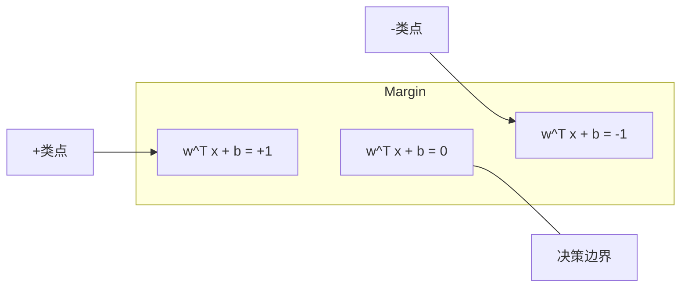
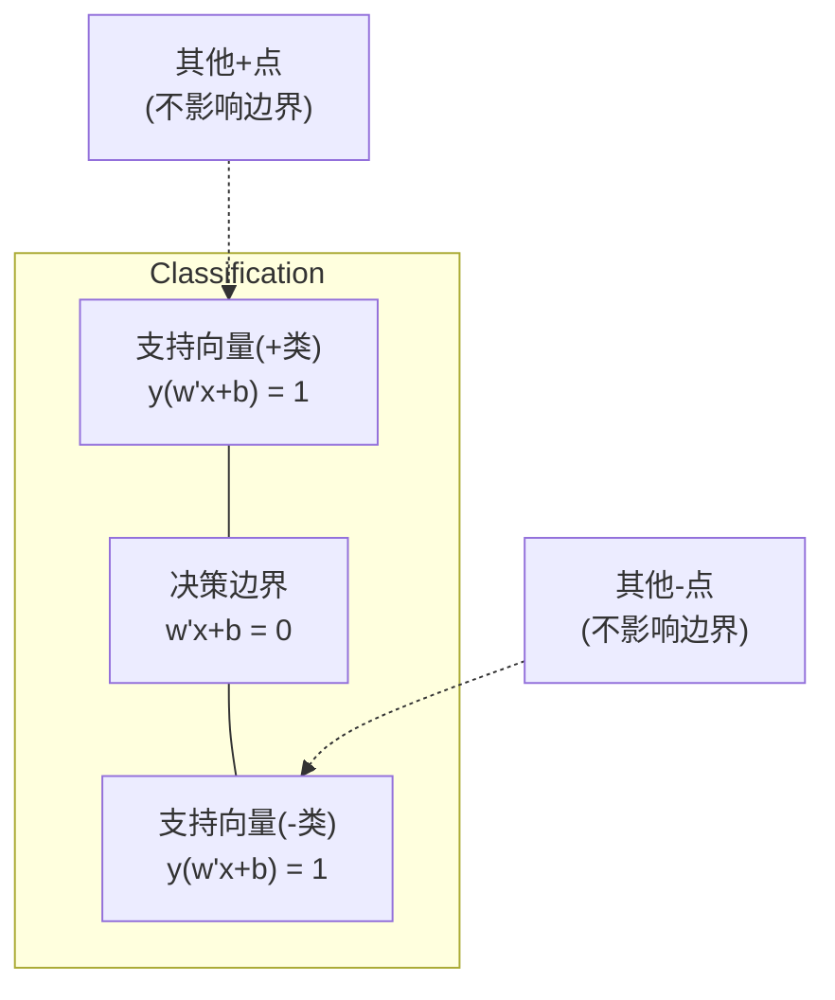
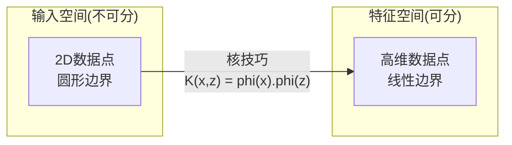

# 支持向量机

> 找两类间最宽街道。这就是全部想法。

**类型:** 构建
**语言:** Python
**前置要求:** 第1阶段 (课程08 优化, 14 范数与距离, 18 凸优化)
**时间:** ~90分钟

## 学习目标

- 从零用hinge损失和梯度下降在原始形式实现线性SVM
- 解释最大间隔原理并从训练模型识别支持向量
- 比较线性、多项式和RBF核并解释核技巧如何避免显式高维映射
- 评估C参数控制的间隔宽度和分类错误权衡

## 问题背景

你有两类数据点需画线(或超平面)分隔。无限多线可用。该选哪个？

间隔最大的那个。间隔是决策边界和每侧最近数据点距离。更宽间隔意味分类器更自信泛化更好到未见数据。

这直觉导向支持向量机，ML数学最优雅算法之一。SVM深度学习前主导分类方法，仍是小数据集、高维数据、需原理性理论保证模型问题的最佳选择。

SVM直接连第1阶段: 优化凸(课程18)，间隔用范数测(课程14)，核技巧利用点积处理非线性边界而不在高维空间计算。

## 概念讲解

### 最大间隔分类器

给定线性可分数据标签y_i在{-1, +1}和特征向量x_i，我们要超平面w^T x + b = 0分隔类。

点到超平面距离:

```
distance = |w^T x_i + b| / ||w||
```

正确分类点: y_i * (w^T x_i + b) > 0。间隔是超平面到任一侧最近点距离两倍。



优化问题:

```
maximize    2 / ||w||     (间隔宽)
subject to  y_i * (w^T x_i + b) >= 1  对所有i
```

等价(最小化||w||^2易优化):

```
minimize    (1/2) ||w||^2
subject to  y_i * (w^T x_i + b) >= 1  对所有i
```

这是凸二次规划。有唯一全局解。恰好坐在间隔边界(那里y_i * (w^T x_i + b) = 1)的数据点是支持向量。它们是唯一决定决策边界点。移或删任何非支持向量点，边界不变。

### 支持向量: 关键少数



多数训练点无关。只有支持向量重要。这就是为何SVM预测时内存高效: 你只需存支持向量，非整个训练集。

支持向量数也给泛化误差界限。相对数据集大小更少支持向量意味更好泛化。

### 软间隔: 用C参数处理噪声

真实数据很少完美可分。某些点可能在边界错边，或在间隔内。软间隔形式通过引入松弛变量允许违反。

```
minimize    (1/2) ||w||^2 + C * sum(xi_i)
subject to  y_i * (w^T x_i + b) >= 1 - xi_i
            xi_i >= 0  对所有i
```

松弛变量xi_i测量点i违反间隔多少。C控制权衡:

| C值 | 行为 |
|---------|----------|
| 大C | 重罚违反。窄间隔，少误分类。过拟合 |
| 小C | 允更多违反。宽间隔，多误分类。欠拟合 |

C是正则化强度，反转。大C = 更少正则化。小C = 更多正则化。

### Hinge损失: SVM损失函数

软间隔SVM可重写为无约束优化:

```
minimize    (1/2) ||w||^2 + C * sum(max(0, 1 - y_i * (w^T x_i + b)))
```

项max(0, 1 - y_i * f(x_i))是hinge损失。点正确分类并在间隔外时零。点在间隔内或误分类时线性。

```
单点Hinge损失:

loss
  |
  | \
  |  \
  |   \
  |    \
  |     \_______________
  |
  +-----|-----|-------->  y * f(x)
       0     1

y*f(x) >= 1时零损失(正确分类, 间隔外)。
y*f(x) < 1时线性惩罚。
```

对比逻辑损失(逻辑回归):

```
Hinge:     max(0, 1 - y*f(x))          间隔处硬截止
Logistic:  log(1 + exp(-y*f(x)))        平滑, 永不恰好零
```

Hinge损失产稀疏解(只有支持向量有非零贡献)。逻辑损失用所有数据点。这使SVM预测时更内存高效。

### 用梯度下降训练线性SVM

你可用梯度下降在hinge损失加L2正则化训练线性SVM，无需求解约束QP:

```
L(w, b) = (lambda/2) * ||w||^2 + (1/n) * sum(max(0, 1 - y_i * (w^T x_i + b)))

对w梯度:
  若 y_i * (w^T x_i + b) >= 1:  dL/dw = lambda * w
  若 y_i * (w^T x_i + b) < 1:   dL/dw = lambda * w - y_i * x_i

对b梯度:
  若 y_i * (w^T x_i + b) >= 1:  dL/db = 0
  若 y_i * (w^T x_i + b) < 1:   dL/db = -y_i
```

这叫原始形式。每epoch运行O(n * d)，其中n样本数d特征数。对大、稀疏、高维数据(文本分类)，这快。

### 对偶形式和核技巧

SVM问题的拉格朗日对偶(第1阶段课程18, KKT条件):

```
maximize    sum(alpha_i) - (1/2) * sum_ij(alpha_i * alpha_j * y_i * y_j * (x_i . x_j))
subject to  0 <= alpha_i <= C
            sum(alpha_i * y_i) = 0
```

对偶只涉及数据点间点积x_i . x_j。这是关键洞见。用核函数K(x_i, x_j)替换每点积SVM可学习非线性边界而不显式计算变换。

```
线性核:      K(x, z) = x . z
多项式核:  K(x, z) = (x . z + c)^d
RBF (Gaussian):     K(x, z) = exp(-gamma * ||x - z||^2)
```

RBF核将数据映射到无穷维空间。输入空间近的点核值近1。远的点核值近0。它可学习任何平滑决策边界。



核技巧在高维空间计算点积而不去那。对D维d阶多项式核，显式特征空间有O(D^d)维。但K(x, z)在O(D)时间计算。

### SVM回归(SVR)

支持向量回归拟合宽epsilon管数据。管内点零损失。管外点线性惩罚。

```
minimize    (1/2) ||w||^2 + C * sum(xi_i + xi_i*)
subject to  y_i - (w^T x_i + b) <= epsilon + xi_i
            (w^T x_i + b) - y_i <= epsilon + xi_i*
            xi_i, xi_i* >= 0
```

epsilon参数控管宽。更宽管 = 更少支持向量 = 更平滑拟合。更窄管 = 更多支持向量 = 更紧拟合。

### 为何SVM输给深度学习(何时仍胜)

SVM从1990年代末到2010年代初主导ML。深度学习超越它们有几原因:

| 因素 | SVM | 深度学习 |
|--------|------|---------------|
| 特征工程 | 需要 | 学习特征 |
| 可扩展性 | 核O(n^2)到O(n^3) | SGD每epoch O(n) |
| 图像/文本/音频 | 需手工特征 | 从原始数据学习 |
| 大数据集(>100k) | 慢 | 扩展好 |
| GPU加速 | 有限收益 | 巨大加速 |

SVM仍胜这些情况:
- 小数据集(几百到几千样本)
- 高维稀疏数据(文本TF-IDF特征)
- 需数学保证(间隔界限)
- 训练时间必须最小(线性SVM非常快)
- 二分类有清晰间隔结构
- 异常检测(一类SVM)

## 构建

### 步骤1: Hinge损失和梯度

基础。计算批hinge损失和梯度。

```python
def hinge_loss(X, y, w, b):
    n = len(X)
    total_loss = 0.0
    for i in range(n):
        margin = y[i] * (dot(w, X[i]) + b)
        total_loss += max(0.0, 1.0 - margin)
    return total_loss / n
```

### 步骤2: 梯度下降线性SVM

训练通过最小化正则化hinge损失。无需QP求解器。

```python
class LinearSVM:
    def __init__(self, lr=0.001, lambda_param=0.01, n_epochs=1000):
        self.lr = lr
        self.lambda_param = lambda_param
        self.n_epochs = n_epochs
        self.w = None
        self.b = 0.0

    def fit(self, X, y):
        n_features = len(X[0])
        self.w = [0.0] * n_features
        self.b = 0.0

        for epoch in range(self.n_epochs):
            for i in range(len(X)):
                margin = y[i] * (dot(self.w, X[i]) + self.b)
                if margin >= 1:
                    self.w = [wj - self.lr * self.lambda_param * wj
                              for wj in self.w]
                else:
                    self.w = [wj - self.lr * (self.lambda_param * wj - y[i] * X[i][j])
                              for j, wj in enumerate(self.w)]
                    self.b -= self.lr * (-y[i])

    def predict(self, X):
        return [1 if dot(self.w, x) + self.b >= 0 else -1 for x in X]
```

### 步骤3: 核函数

实现线性、多项式和RBF核。

```python
def linear_kernel(x, z):
    return dot(x, z)

def polynomial_kernel(x, z, degree=3, c=1.0):
    return (dot(x, z) + c) ** degree

def rbf_kernel(x, z, gamma=0.5):
    diff = [xi - zi for xi, zi in zip(x, z)]
    return math.exp(-gamma * dot(diff, diff))
```

### 步骤4: 间隔和支持向量识别

训练后，识别哪些点是支持向量并计算间隔宽。

```python
def find_support_vectors(X, y, w, b, tol=1e-3):
    support_vectors = []
    for i in range(len(X)):
        margin = y[i] * (dot(w, X[i]) + b)
        if abs(margin - 1.0) < tol:
            support_vectors.append(i)
    return support_vectors
```

完整实现含所有demo见 `code/svm.py`。

## 使用

用scikit-learn:

```python
from sklearn.svm import SVC, LinearSVC, SVR
from sklearn.preprocessing import StandardScaler
from sklearn.pipeline import Pipeline

clf = Pipeline([
    ("scaler", StandardScaler()),
    ("svm", SVC(kernel="rbf", C=1.0, gamma="scale")),
])
clf.fit(X_train, y_train)
print(f"Accuracy: {clf.score(X_test, y_test):.4f}")
print(f"Support vectors: {clf['svm'].n_support_}")
```

重要: 训练SVM前总缩放特征。SVM对特征大小敏感因间隔依赖||w||，未缩放特征扭曲几何。

大数据集，用`LinearSVC`(原始形式，每epoch O(n))而非`SVC`(对偶形式，O(n^2)到O(n^3)):

```python
from sklearn.svm import LinearSVC

clf = Pipeline([
    ("scaler", StandardScaler()),
    ("svm", LinearSVC(C=1.0, max_iter=10000)),
])
```

## 练习题

1. 生成2D线性可分数据集。训练你的LinearSVM并识别支持向量。验证支持向量是离决策边界最近点。
2. 在噪声数据集变C从0.001到1000。绘每C值决策边界。观察宽间隔(欠拟合)到窄间隔(过拟合)过渡。
3. 创建类边界圆形(非线性)数据集。展示线性SVM失败。计算RBF核矩阵展示类在核诱导特征空间可分。
4. 在相同数据集比较hinge损失vs逻辑损失。训练线性SVM和逻辑回归。计数多少训练点贡献每模型决策边界(支持向量vs所有点)。
5. 实现SVR (epsilon不敏感损失)。拟合y = sin(x) + 噪声。绘epsilon管预测周围并高亮支持向量(管外点)。

## 关键术语

| 术语 | 实际含义 |
|------|----------------------|
| 支持向量 | 离决策边界最近训练点。唯一决定超平面点 |
| 间隔 | 决策边界和最近支持向量距离。SVM最大化这 |
| Hinge损失 | max(0, 1 - y*f(x))。正确分类并在间隔外时零。否则线性惩罚 |
| C参数 | 间隔宽和分类错误权衡。大C=窄间隔，小C=宽间隔 |
| 软间隔 | 通过松弛变量允许间隔违反SVM形式。处理不可分数据 |
| 核技巧 | 在高维特征空间计算点积而不显式映射到那空间 |
| 线性核 | K(x, z) = x . z。等价标准点积。线性可分数据用 |
| RBF核 | K(x, z) = exp(-gamma * ||x-z||^2)。映射无穷维。学习任何平滑边界 |
| 多项式核 | K(x, z) = (x . z + c)^d。映射到多项式组合特征空间 |
| 对偶形式 | SVM问题重述只依赖数据点间点积。启用核 |
| SVR | 支持向量回归。拟合epsilon管数据。管内点零损失 |
| 松弛变量 | xi_i: 测量点违反间隔多少。正确分类并在间隔外点为零 |
| 最大间隔 | 选超平面最大化到每类最近点距离的原则 |

## 延伸阅读

- [Vapnik: The Nature of Statistical Learning Theory (1995)](https://link.springer.com/book/10.1007/978-1-4757-3264-1) - SVM和统计学习奠基文本
- [Cortes & Vapnik: Support-vector networks (1995)](https://link.springer.com/article/10.1007/BF00994018) - 原始SVM论文
- [Platt: Sequential Minimal Optimization (1998)](https://www.microsoft.com/en-us/research/publication/sequential-minimal-optimization-a-fast-algorithm-for-training-support-vector-machines/) - SMO算法使SVM训练实用
- [scikit-learn SVM documentation](https://scikit-learn.org/stable/modules/svm.html) - 带实现细节实用指南
- [LIBSVM: A Library for Support Vector Machines](https://www.csie.ntu.edu.tw/~cjlin/libsvm/) - 大多数SVM实现背后的C++库