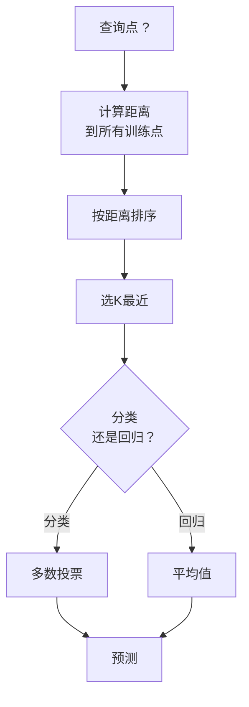
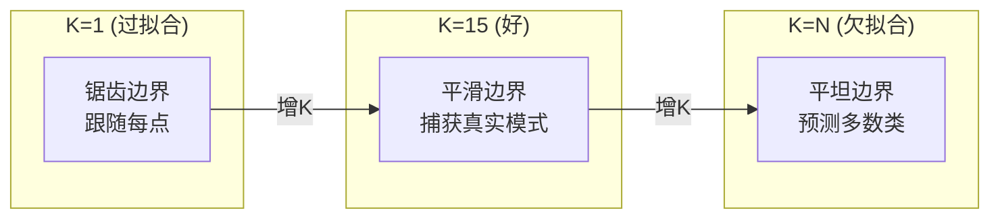
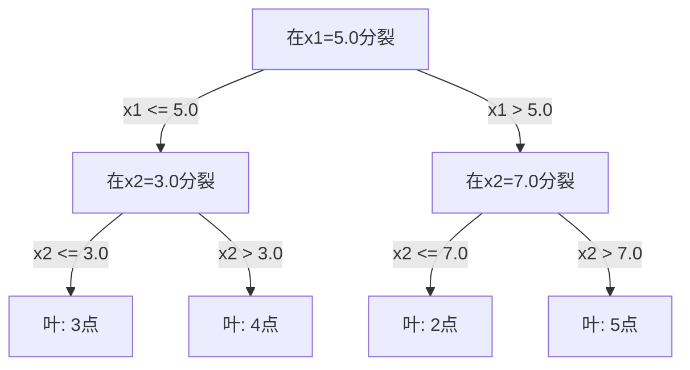

# K近邻与距离

> 存一切。看邻居预测。实际工作的最简单算法。

**类型:** 构建
**语言:** Python
**前置要求:** 第1阶段 (课程14 范数与距离)
**时间:** ~90分钟

## 学习目标

- 从零实现可配置K和距离加权投票的KNN分类和回归
- 比较L1、L2、余弦和Minkowski距离度量并为给定数据类型选合适的
- 解释维度诅咒并演示为何KNN在高维空间退化
- 构建KD树高效最近邻搜索并分析何时胜过暴力

## 问题背景

你有数据集。新数据点到达。你需要分类它或预测其值。不从数据学习参数(像线性回归或SVM)，你只找离新点最近的K个训练点让它们投票。

这是K近邻。无训练阶段。无参数学习。无损失函数最小化。你存整个训练集并在预测时计算距离。

听起来太简单工作。但KNN对许多问题惊人竞争力，尤其小到中等数据集，深入理解它揭示基本概念: 距离度量选择(连第1阶段课程14)、维度诅咒、懒惰和积极学习区别。

KNN也到处出现在现代AI，只是不同名字。向量数据库在嵌入上做KNN搜索。检索增强生成(RAG)找K最近文档块。推荐系统找相似用户或物品。算法相同。规模和数据结构不同。

## 概念讲解

### KNN如何工作

给定标注点数据集和新查询点:

1. 计算查询到数据集每点距离
2. 按距离排序
3. 取K最近点
4. 分类: K邻居多数投票
5. 回归: K邻居值平均(或加权平均)



这是整个算法。无拟合。无梯度下降。无epoch。

### 选K

K是单一超参数。控制偏差-方差权衡:

| K | 行为 |
|---|----------|
| K = 1 | 决策边界跟随每点。零训练误差。高方差。过拟合 |
| 小K (3-5) | 对局部结构敏感。可捕获复杂边界 |
| 大K | 更平滑边界。对噪声更鲁棒。可能欠拟合 |
| K = N | 每点预测多数类。最大偏差 |

常见起点K = sqrt(N)对N点数据集。二元分类用奇数K避免平局。



### 距离度量

距离函数定义"近"意味什么。不同度量产不同邻居，不同预测。

**L2 (欧几里得)**是默认。直线距离。

```
d(a, b) = sqrt(sum((a_i - b_i)^2))
```

对特征尺度敏感。用L2 KNN前总标准化特征。

**L1 (曼哈顿)**求绝对差之和。比L2对异常值更鲁棒因它不平方差异。

```
d(a, b) = sum(|a_i - b_i|)
```

**余弦距离**测向量间角度，忽略大小。文本和嵌入数据必需。

```
d(a, b) = 1 - (a . b) / (||a|| * ||b||)
```

**Minkowski**用参数p推广L1和L2。

```
d(a, b) = (sum(|a_i - b_i|^p))^(1/p)

p=1: 曼哈顿
p=2: 欧几里得
p->inf: Chebyshev (最大绝对差)
```

用哪个度量取决于数据:

| 数据类型 | 最佳度量 | 原因 |
|-----------|------------|-----|
| 数值特征，相似尺度 | L2 (欧几里得) | 默认，空间数据工作 |
| 数值特征，异常值 | L1 (曼哈顿) | 鲁棒，不放大大差异 |
| 文本嵌入 | 余弦 | 大小噪声，方向意义 |
| 高维稀疏 | 余弦或L1 | L2受维度诅咒影响 |
| 混合类型 | 自定义距离 | 每特征类型结合度量 |

### 加权KNN

标准KNN给所有K邻居等权重。但距离0.1的邻居应比距离5.0重要。

**距离加权KNN**每邻居权重反比距离:

```
weight_i = 1 / (distance_i + epsilon)

分类: 加权投票
回归:     加权平均 = sum(w_i * y_i) / sum(w_i)
```

epsilon防止查询点恰好匹配训练点时除零。

加权KNN对K选择更不敏感因远邻居贡献很小不管怎样。

### 维度诅咒

KNN性能在高维退化。这不是模糊担忧。是数学事实。

**问题1: 距离趋同。** 随维度增，最大距离与最小距离比趋1。所有点与查询等"远"。

```
d维，随机均匀点:

d=2:    max_dist / min_dist = 广泛变化
d=100:  max_dist / min_dist ~ 1.01
d=1000: max_dist / min_dist ~ 1.001

当所有距离近乎相等，"最近"无意义。
```

**问题2: 体积爆炸。** 在固定数据比例内捕获K邻居，你需扩展搜索半径覆盖特征空间更大部分。"邻居"在高维涵盖大部分空间。

**问题3: 角主导。** d维单位超立方，大部分体积集中在角附近，非中心。立方内切球随d增长含越来越少体积。

实践后果: KNN工作好到约20-50特征。超出那，应用KNN前需降维(PCA, UMAP, t-SNE)，或用利用数据内在低维的树搜索结构。

### KD树: 快最近邻搜索

暴力KNN计算查询到每训练点距离。那是O(n * d)每查询。大数据集太慢。

KD树沿特征轴递归划分空间。每层，在当前维中值处分裂。



找最近邻，遍历树到含查询叶，然后回溯仅当邻近分区可能含更近点时检查。

平均查询时间: 低维O(log n)。但KD树在高维(d > 20)退化为O(n)因回溯消除越来越少分支。

### Ball树: 中等维度更好

Ball树将数据划分为嵌套超球而非轴对齐盒。每节点定义含该子树所有点的球(中心+半径)。

比KD树优势:
- 中等维度(到~50)更好工作
- 处理非轴对齐结构
- 更紧包围体积意味搜索时更多分支被剪枝

KD树和ball树都是精确算法。真正大规模搜索(百万点，数百维)，用近似最近邻方法(HNSW, IVF, 产品量化)。第1阶段课程14覆盖。

### 懒惰学习vs积极学习

KNN是懒惰学习者: 训练时不工作预测时全工作。多数其他算法(线性回归、SVM、神经网络)是积极学习者: 训练时重计算构建紧凑模型，然后预测快。

| 方面 | 懒惰(KNN) | 积极(SVM, 神经网络) |
|--------|------------|------------------------|
| 训练时间 | O(1) 只存数据 | O(n * epochs) |
| 预测时间 | 每查询O(n * d) | O(d) 或 O(parameters) |
| 预测时内存 | 存整个训练集 | 只存模型参数 |
| 适应新数据 | 立即加点 | 重训练模型 |
| 决策边界 | 隐式，运行时计算 | 显式，训练后固定 |

懒惰学习理想当:
- 数据集频繁变化(加/删点无需重训练)
- 你需非常少查询预测
- 你需零训练时间
- 数据集够小暴力搜索快

### KNN回归

而非多数投票，KNN回归平均K邻居目标值。

```
prediction = (1/K) * sum(y_i for i in K最近邻居)

或距离加权:
prediction = sum(w_i * y_i) / sum(w_i)
其中 w_i = 1 / distance_i
```

KNN回归产分段常数(或加权时分段平滑)预测。它不能外推超出训练数据范围。如果训练目标都在0到100间，KNN永远不会预测200。

## 构建

### 步骤1: 距离函数

实现L1、L2、余弦和Minkowski距离。这些直接连第1阶段课程14。

```python
import math

def l2_distance(a, b):
    return math.sqrt(sum((ai - bi) ** 2 for ai, bi in zip(a, b)))

def l1_distance(a, b):
    return sum(abs(ai - bi) for ai, bi in zip(a, b))

def cosine_distance(a, b):
    dot_val = sum(ai * bi for ai, bi in zip(a, b))
    norm_a = math.sqrt(sum(ai ** 2 for ai in a))
    norm_b = math.sqrt(sum(bi ** 2 for bi in b))
    if norm_a == 0 or norm_b == 0:
        return 1.0
    return 1.0 - dot_val / (norm_a * norm_b)

def minkowski_distance(a, b, p=2):
    if p == float('inf'):
        return max(abs(ai - bi) for ai, bi in zip(a, b))
    return sum(abs(ai - bi) ** p for ai, bi in zip(a, b)) ** (1 / p)
```

### 步骤2: KNN分类器和回归器

构建完整KNN，可配置K、距离度量、可选距离加权。

```python
class KNN:
    def __init__(self, k=5, distance_fn=l2_distance, weighted=False,
                 task="classification"):
        self.k = k
        self.distance_fn = distance_fn
        self.weighted = weighted
        self.task = task
        self.X_train = None
        self.y_train = None

    def fit(self, X, y):
        self.X_train = X
        self.y_train = y

    def predict(self, X):
        return [self._predict_one(x) for x in X]
```

### 步骤3: KD树高效搜索

从零构建KD树递归在每维中值分裂。

```python
class KDTree:
    def __init__(self, X, indices=None, depth=0):
        # 递归划分数据
        self.axis = depth % len(X[0])
        # 在当前轴中值分裂
        ...

    def query(self, point, k=1):
        # 遍历到叶，然后回溯
        ...
```

完整实现含所有辅助方法和demo见 `code/knn.py`。

### 步骤4: 特征缩放

KNN需要特征缩放因距离对特征大小敏感。范围0到1000的特征会主导范围0到1的特征。

```python
def standardize(X):
    n = len(X)
    d = len(X[0])
    means = [sum(X[i][j] for i in range(n)) / n for j in range(d)]
    stds = [
        max(1e-10, (sum((X[i][j] - means[j]) ** 2 for i in range(n)) / n) ** 0.5)
        for j in range(d)
    ]
    return [[((X[i][j] - means[j]) / stds[j]) for j in range(d)] for i in range(n)], means, stds
```

## 使用

用scikit-learn:

```python
from sklearn.neighbors import KNeighborsClassifier
from sklearn.preprocessing import StandardScaler
from sklearn.pipeline import Pipeline

clf = Pipeline([
    ("scaler", StandardScaler()),
    ("knn", KNeighborsClassifier(n_neighbors=5, metric="euclidean")),
])
clf.fit(X_train, y_train)
print(f"Accuracy: {clf.score(X_test, y_test):.4f}")
```

Scikit-learn数据集够大且维度够低时自动用KD树或ball树。高维数据，它回退到暴力。你可以用`algorithm`参数控制。

大规模最近邻搜索(百万向量)，用FAISS, Annoy或向量数据库:

```python
import faiss

index = faiss.IndexFlatL2(dimension)
index.add(embeddings)
distances, indices = index.search(query_vectors, k=5)
```

## 练习题

1. 在3类2D数据集实现KNN分类。绘K=1、K=5、K=15和K=N决策边界。观察过拟合到欠拟合过渡。
2. 在2、5、10、50、100和500维生成1000随机点。对每维度，计算最大成对距离与最小成对距离比。绘比vs维度可视化维度诅咒。
3. 比较L1、L2和余弦距离在文本分类问题KNN(用TF-IDF向量)。哪个度量精度最高？为何余弦对文本倾向胜？
4. 实现KD树并测量2D、10D和50D数据集1k、10k和100k点查询时间vs暴力。KD树在何维度停止比暴力快？
5. 构建加权KNN回归器对y = sin(x) + 噪声。比较K=3、10、30无加权KNN。展示加权产更平滑预测，尤其大K。

## 关键术语

| 术语 | 实际含义 |
|------|----------------------|
| K近邻 | 找K最近训练点到查询的非参数算法预测 |
| 懒惰学习 | 训练时无计算。预测时全工作。KNN是典型例子 |
| 积极学习 | 训练时重计算构建紧凑模型。多数ML算法积极 |
| 维度诅咒 | 高维，距离趋同且邻居扩展覆盖大部分空间，使KNN无效 |
| KD树 | 递归沿特征轴划分空间的二叉树。低维O(log n)查询 |
| Ball树 | 嵌套超球树。中等维度(到~50)比KD树好工作 |
| 加权KNN | 邻居权重反比距离。更近邻居预测影响更大 |
| 特征缩放 | 归一化特征到可比范围。KNN等距离方法必需 |
| 多数投票 | 计数K邻居中哪类最常见分类 |
| 暴力搜索 | 计算到每训练点距离。每查询O(n*d)。精确但对大n慢 |
| 近似最近邻 | 算法(HNSW, LSH, IVF)找近似最近点比精确搜索快很多 |
| Voronoi图 | 空间划分，每区域含比其他训练点更近某训练点的所有点。K=1 KNN产Voronoi边界 |

## 延伸阅读

- [Cover & Hart: Nearest Neighbor Pattern Classification (1967)](https://ieeexplore.ieee.org/document/1053964) - 证明KNN错误率最多两倍贝叶斯最优奠基KNN论文
- [Friedman, Bentley, Finkel: An Algorithm for Finding Best Matches in Logarithmic Expected Time (1977)](https://dl.acm.org/doi/10.1145/355744.355745) - 原始KD树论文
- [Beyer et al.: When Is "Nearest Neighbor" Meaningful? (1999)](https://link.springer.com/chapter/10.1007/3-540-49257-7_15) - 最近邻维度诅咒形式分析
- [scikit-learn Nearest Neighbors documentation](https://scikit-learn.org/stable/modules/neighbors.html) - 带算法选择实用指南
- [FAISS: A Library for Efficient Similarity Search](https://github.com/facebookresearch/faiss) - Meta十亿规模近似最近邻搜索库