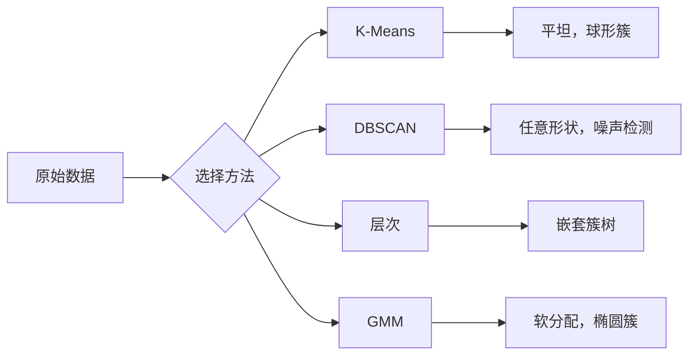

# 无监督学习

> 无标签，无老师。算法自己发现结构。

**类型:** 构建
**语言:** Python
**前置要求:** 第1阶段 (范数与距离, 概率与分布), 第2阶段 课程1-6
**时间:** ~90分钟

## 学习目标

- 从零实现K-Means、DBSCAN和高斯混合模型并比较它们聚类行为
- 用轮廓分数和肘方法评估聚类质量选最优K
- 解释何时DBSCAN胜过K-Means并识别哪个算法处理非球形簇和异常值
- 用聚类方法构建异常检测流水线标记偏离正常模式的点

## 问题背景

每ML课程至此假设标注数据:"这是输入，这是正确输出。" 真实世界，标签昂贵。医院有百万病人记录但没人手工标每份疾病类别。电商网站有百万用户会话但没人手工标顾客细分。安全团队有网络日志但没人标每异常。

无监督学习无被告知找什么发现模式。它分组相似数据点、发现隐藏结构、浮现异常。如果监督学习是从有答案键教科书学习，无监督学习是盯着原始数据直到模式显现自己。

问题: 无标签，你不能直接测"对"或"错。" 你需不同工具评估算法发现结构是否有意义。

## 概念讲解

### 聚类: 将相似事物分组

聚类分配每数据点到组(簇)使同组点彼此比其他组点更相似。问题总: "相似"意味什么？



### K-Means: 主力

K-Means将数据精确分K簇。每簇有质心(其质量中心)，每点属最近质心。

Lloyd算法:

1. 选K随机点作初始质心
2. 分配每数据点到最近质心
3. 重算每质心为其分配点均值
4. 重复步骤2-3直到分配停止变化

目标函数(惯性)测每点到其分配质心总平方距离。K-Means最小化这，但只找局部最小。不同初始化可给不同结果。

### 选K

两标准方法:

**肘方法:** 对K = 1, 2, 3, ..., n运行K-Means。绘惯性vs K。找"肘"即加更多簇不再显著减少惯性处。

**轮廓分数:** 每点，测它与自己簇相似度vs最近其他簇。轮廓系数是 - a) / max(a, b)，范围-1(错簇)到+1(好聚类)。平均所有点得全局分数。

### DBSCAN: 密度聚类

K-Means假设簇球形并需你预先选K。DBSCAN都不假设。它找密集区域分隔稀疏区域簇。

两参数:
- **eps**: 邻域半径
- **min_samples**: 形成密集区域最小点数

三类点:
- **核心点**: eps距离内至少有min_samples点
- **边界点**: 在某核心点eps内但自己非核心点
- **噪声点**: 既非核心也非边界。这些是异常值。

DBSCAN将eps距离内核心点连入同簇。边界点加入附近核心点簇。噪声点不属于任何簇。

优势: 找任意形状簇，自动决定簇数，识别异常值。劣势: 处理不同密度簇困难。

### 层次聚类

构建嵌套簇树(树状图)。

凝聚(自底向上):
1. 开始每点自己一簇
2. 合并两最近簇
3. 重复直到只剩一簇
4. 在期望水平切树状图得K簇

簇间"最近"可测为:
- **单链接**: 两簇任意两点最小距离
- **全链接**: 两簇任意两点最大距离
- **平均链接**: 所有点对平均距离
- **Ward方法**: 引起总簇内方差最小增加的合并

### 高斯混合模型(GMM)

K-Means给硬分配: 每点恰好属一簇。GMM给软分配: 每点有概率属每簇。

GMM假设数据从K高斯分布混合生成，各有自己均值和协方差。期望最大化(EM)算法交替:

- **E步**: 计算每点属每高斯概率
- **M步**: 更新每高斯均值、协方差和混合权重最大化数据似然

GMM可建模椭圆簇(不像K-Means只球形)并自然处理重叠簇。

### 何时用哪个

| 方法 | 最佳用 | 避免当 |
|--------|----------|------------|
| K-Means | 大数据集，球形簇，已知K | 不规则形状，有异常值 |
| DBSCAN | 未知K，任意形状，异常检测 | 不同密度，极高维 |
| 层次 | 小数据集，需树状图，未知K | 大数据集(O(n^2)内存) |
| GMM | 重叠簇，需软分配 | 极大数据集，太多维 |

### 聚类异常检测

聚类自然支持异常检测:
- **K-Means**: 离任何质心远的点是异常
- **DBSCAN**: 噪声点定义是异常
- **GMM**: 所有高斯下概率低的点是异常

## 构建

### 步骤1: 从零K-Means

```python
import math
import random


def euclidean_distance(a, b):
    return math.sqrt(sum((ai - bi) ** 2 for ai, bi in zip(a, b)))


def kmeans(data, k, max_iterations=100, seed=42):
    random.seed(seed)
    n_features = len(data[0])

    centroids = random.sample(data, k)

    for iteration in range(max_iterations):
        clusters = [[] for _ in range(k)]
        assignments = []

        for point in data:
            distances = [euclidean_distance(point, c) for c in centroids]
            nearest = distances.index(min(distances))
            clusters[nearest].append(point)
            assignments.append(nearest)

        new_centroids = []
        for cluster in clusters:
            if len(cluster) == 0:
                new_centroids.append(random.choice(data))
                continue
            centroid = [
                sum(point[j] for point in cluster) / len(cluster)
                for j in range(n_features)
            ]
            new_centroids.append(centroid)

        if all(
            euclidean_distance(old, new) < 1e-6
            for old, new in zip(centroids, new_centroids)
        ):
            print(f"  Converged at iteration {iteration + 1}")
            break

        centroids = new_centroids

    return assignments, centroids
```

### 步骤2: 肘方法和轮廓分数

```python
def compute_inertia(data, assignments, centroids):
    total = 0.0
    for point, cluster_id in zip(data, assignments):
        total += euclidean_distance(point, centroids[cluster_id]) ** 2
    return total


def silhouette_score(data, assignments):
    n = len(data)
    if n < 2:
        return 0.0

    clusters = {}
    for i, c in enumerate(assignments):
        clusters.setdefault(c, []).append(i)

    if len(clusters) < 2:
        return 0.0

    scores = []
    for i in range(n):
        own_cluster = assignments[i]
        own_members = [j for j in clusters[own_cluster] if j != i]

        if len(own_members) == 0:
            scores.append(0.0)
            continue

        a = sum(euclidean_distance(data[i], data[j]) for j in own_members) / len(own_members)

        b = float("inf")
        for cluster_id, members in clusters.items():
            if cluster_id == own_cluster:
                continue
            avg_dist = sum(euclidean_distance(data[i], data[j]) for j in members) / len(members)
            b = min(b, avg_dist)

        if max(a, b) == 0:
            scores.append(0.0)
        else:
            scores.append((b - a) / max(a, b))

    return sum(scores) / len(scores)


def find_best_k(data, max_k=10):
    print("Elbow method:")
    inertias = []
    for k in range(1, max_k + 1):
        assignments, centroids = kmeans(data, k)
        inertia = compute_inertia(data, assignments, centroids)
        inertias.append(inertia)
        print(f"  K={k}: inertia={inertia:.2f}")

    print("\nSilhouette scores:")
    for k in range(2, max_k + 1):
        assignments, centroids = kmeans(data, k)
        score = silhouette_score(data, assignments)
        print(f"  K={k}: silhouette={score:.4f}")

    return inertias
```

### 步骤3: 从零DBSCAN

```python
def dbscan(data, eps, min_samples):
    n = len(data)
    labels = [-1] * n
    cluster_id = 0

    def region_query(point_idx):
        neighbors = []
        for i in range(n):
            if euclidean_distance(data[point_idx], data[i]) <= eps:
                neighbors.append(i)
        return neighbors

    visited = [False] * n

    for i in range(n):
        if visited[i]:
            continue
        visited[i] = True

        neighbors = region_query(i)

        if len(neighbors) < min_samples:
            labels[i] = -1
            continue

        labels[i] = cluster_id
        seed_set = list(neighbors)
        seed_set.remove(i)

        j = 0
        while j < len(seed_set):
            q = seed_set[j]

            if not visited[q]:
                visited[q] = True
                q_neighbors = region_query(q)
                if len(q_neighbors) >= min_samples:
                    for nb in q_neighbors:
                        if nb not in seed_set:
                            seed_set.append(nb)

            if labels[q] == -1:
                labels[q] = cluster_id

            j += 1

        cluster_id += 1

    return labels
```

### 步骤4: 高斯混合模型(EM算法)

```python
def gmm(data, k, max_iterations=100, seed=42):
    random.seed(seed)
    n = len(data)
    d = len(data[0])

    indices = random.sample(range(n), k)
    means = [list(data[i]) for i in indices]
    variances = [1.0] * k
    weights = [1.0 / k] * k

    def gaussian_pdf(x, mean, variance):
        d = len(x)
        coeff = 1.0 / ((2 * math.pi * variance) ** (d / 2))
        exponent = -sum((xi - mi) ** 2 for xi, mi in zip(x, mean)) / (2 * variance)
        return coeff * math.exp(max(exponent, -500))

    for iteration in range(max_iterations):
        responsibilities = []
        for i in range(n):
            probs = []
            for j in range(k):
                probs.append(weights[j] * gaussian_pdf(data[i], means[j], variances[j]))
            total = sum(probs)
            if total == 0:
                total = 1e-300
            responsibilities.append([p / total for p in probs])

        old_means = [list(m) for m in means]

        for j in range(k):
            r_sum = sum(responsibilities[i][j] for i in range(n))
            if r_sum < 1e-10:
                continue

            weights[j] = r_sum / n

            for dim in range(d):
                means[j][dim] = sum(
                    responsibilities[i][j] * data[i][dim] for i in range(n)
                ) / r_sum

            variances[j] = sum(
                responsibilities[i][j]
                * sum((data[i][dim] - means[j][dim]) ** 2 for dim in range(d))
                for i in range(n)
            ) / (r_sum * d)
            variances[j] = max(variances[j], 1e-6)

        shift = sum(
            euclidean_distance(old_means[j], means[j]) for j in range(k)
        )
        if shift < 1e-6:
            print(f"  GMM converged at iteration {iteration + 1}")
            break

    assignments = []
    for i in range(n):
        assignments.append(responsibilities[i].index(max(responsibilities[i])))

    return assignments, means, weights, responsibilities
```

### 步骤5: 生成测试数据并运行

```python
def make_blobs(centers, n_per_cluster=50, spread=0.5, seed=42):
    random.seed(seed)
    data = []
    true_labels = []
    for label, (cx, cy) in enumerate(centers):
        for _ in range(n_per_cluster):
            x = cx + random.gauss(0, spread)
            y = cy + random.gauss(0, spread)
            data.append([x, y])
            true_labels.append(label)
    return data, true_labels


def make_moons(n_samples=200, noise=0.1, seed=42):
    random.seed(seed)
    data = []
    labels = []
    n_half = n_samples // 2
    for i in range(n_half):
        angle = math.pi * i / n_half
        x = math.cos(angle) + random.gauss(0, noise)
        y = math.sin(angle) + random.gauss(0, noise)
        data.append([x, y])
        labels.append(0)
    for i in range(n_half):
        angle = math.pi * i / n_half
        x = 1 - math.cos(angle) + random.gauss(0, noise)
        y = 1 - math.sin(angle) - 0.5 + random.gauss(0, noise)
        data.append([x, y])
        labels.append(1)
    return data, labels


if __name__ == "__main__":
    centers = [[2, 2], [8, 3], [5, 8]]
    data, true_labels = make_blobs(centers, n_per_cluster=50, spread=0.8)

    print("=== K-Means on 3 blobs ===")
    assignments, centroids = kmeans(data, k=3)
    print(f"  Centroids: {[[round(c, 2) for c in cent] for cent in centroids]}")
    sil = silhouette_score(data, assignments)
    print(f"  Silhouette score: {sil:.4f}")

    print("\n=== Elbow Method ===")
    find_best_k(data, max_k=6)

    print("\n=== DBSCAN on 3 blobs ===")
    db_labels = dbscan(data, eps=1.5, min_samples=5)
    n_clusters = len(set(db_labels) - {-1})
    n_noise = db_labels.count(-1)
    print(f"  Found {n_clusters} clusters, {n_noise} noise points")

    print("\n=== GMM on 3 blobs ===")
    gmm_assignments, gmm_means, gmm_weights, _ = gmm(data, k=3)
    print(f"  Means: {[[round(m, 2) for m in mean] for mean in gmm_means]}")
    print(f"  Weights: {[round(w, 3) for w in gmm_weights]}")
    gmm_sil = silhouette_score(data, gmm_assignments)
    print(f"  Silhouette score: {gmm_sil:.4f}")

    print("\n=== DBSCAN on moons (non-spherical clusters) ===")
    moon_data, moon_labels = make_moons(n_samples=200, noise=0.1)
    moon_db = dbscan(moon_data, eps=0.3, min_samples=5)
    n_moon_clusters = len(set(moon_db) - {-1})
    n_moon_noise = moon_db.count(-1)
    print(f"  Found {n_moon_clusters} clusters, {n_moon_noise} noise points")

    print("\n=== K-Means on moons (will fail to separate) ===")
    moon_km, moon_centroids = kmeans(moon_data, k=2)
    moon_sil = silhouette_score(moon_data, moon_km)
    print(f"  Silhouette score: {moon_sil:.4f}")
    print("  K-Means splits moons poorly because they are not spherical")

    print("\n=== Anomaly detection with DBSCAN ===")
    anomaly_data = list(data)
    anomaly_data.append([20.0, 20.0])
    anomaly_data.append([-5.0, -5.0])
    anomaly_data.append([15.0, 0.0])
    anomaly_labels = dbscan(anomaly_data, eps=1.5, min_samples=5)
    anomalies = [
        anomaly_data[i]
        for i in range(len(anomaly_labels))
        if anomaly_labels[i] == -1
    ]
    print(f"  Detected {len(anomalies)} anomalies")
    for a in anomalies[-3:]:
        print(f"    Point {[round(v, 2) for v in a]}")
```

## 使用

用scikit-learn，相同算法一行:

```python
from sklearn.cluster import KMeans, DBSCAN, AgglomerativeClustering
from sklearn.mixture import GaussianMixture
from sklearn.metrics import silhouette_score as sklearn_silhouette

km = KMeans(n_clusters=3, random_state=42).fit(data)
db = DBSCAN(eps=1.5, min_samples=5).fit(data)
agg = AgglomerativeClustering(n_clusters=3).fit(data)
gmm_model = GaussianMixture(n_components=3, random_state=42).fit(data)
```

从零版本展示你这些库精确计算什么。K-Means迭代分配和重算。DBSCAN从密集种子生长簇。GMM交替期望和最大化。库版本加数值稳定、更智能初始化(K-Means++)和GPU加速，但核心逻辑相同。

## 交付成果

本课程产生从零K-Means、DBSCAN和GMM工作实现。聚类代码可作为更高级无监督方法基础。

## 练习题

1. 实现K-Means++初始化: 不随机选质心，随机选第一个然后每后续质心以概率正比于其距最近已有质心平方距离。比较收敛速度vs随机初始化。
2. 给代码加层次凝聚聚类。实现Ward链接并产树状图(作为合并嵌套列表)。在不同水平切比较K-Means结果。
3. 构建简单异常检测流水线: 在相同数据运行DBSCAN和GMM，标记两方法都同意是异常的点(DBSCAN噪声，GMM低概率)。测重叠并讨论方法何时分歧。

## 关键术语

| 术语 | 人们怎么说 | 实际含义 |
|------|----------------|----------------------|
| 聚类 | "分组相似东西" | 将数据划分到子集，组内相似超过组间相似，由特定距离度量测量 |
| 质心 | "簇中心" | 分配给簇所有点均值；K-Means用作簇代表 |
| 惯性 | "簇多紧" | 每点到其分配质心平方距离之和；更低更紧 |
| 轮廓分数 | "簇多分离" | 每点， - a) / max(a, b)其中a是簇内平均距离b是最近簇平均距离 |
| 核心点 | "密集区域点" | eps距离内至少有min_samples邻居的点，在DBSCAN |
| EM算法 | "软K-Means" | 期望最大化: 迭代计算隶属概率(E步)和更新分布参数(M步) |
| 树状图 | "簇树" | 显示层次聚类簇合并顺序和距离的树图 |
| 异常 | "异常值" | 不符合期望模式数据点，由DBSCAN识别为噪声或GMM低概率 |

## 延伸阅读

- [Stanford CS229 - Unsupervised Learning](https://cs229.stanford.edu/notes2022fall/main_notes.pdf) - Andrew Ng聚类和EM课程笔记
- [scikit-learn Clustering Guide](https://scikit-learn.org/stable/modules/clustering.html) - 所有聚类算法实用比较带可视化例子
- [DBSCAN original paper (Ester et al., 1996)](https://www.aaai.org/Papers/KDD/1996/KDD96-037.pdf) - 引入密度聚类论文