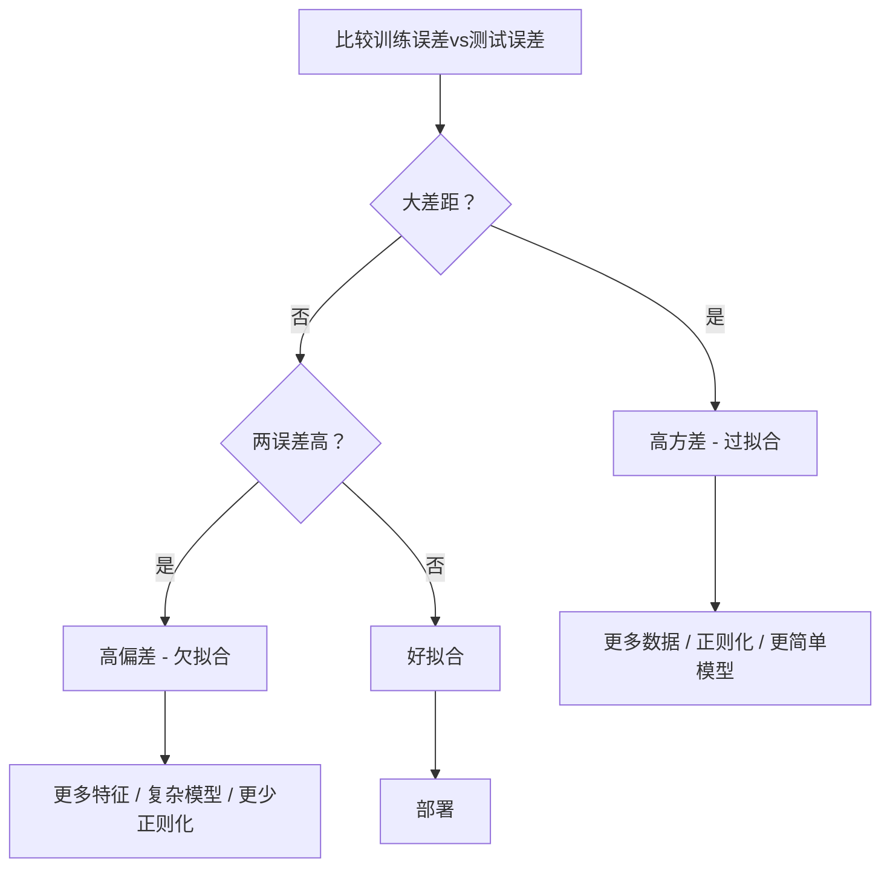
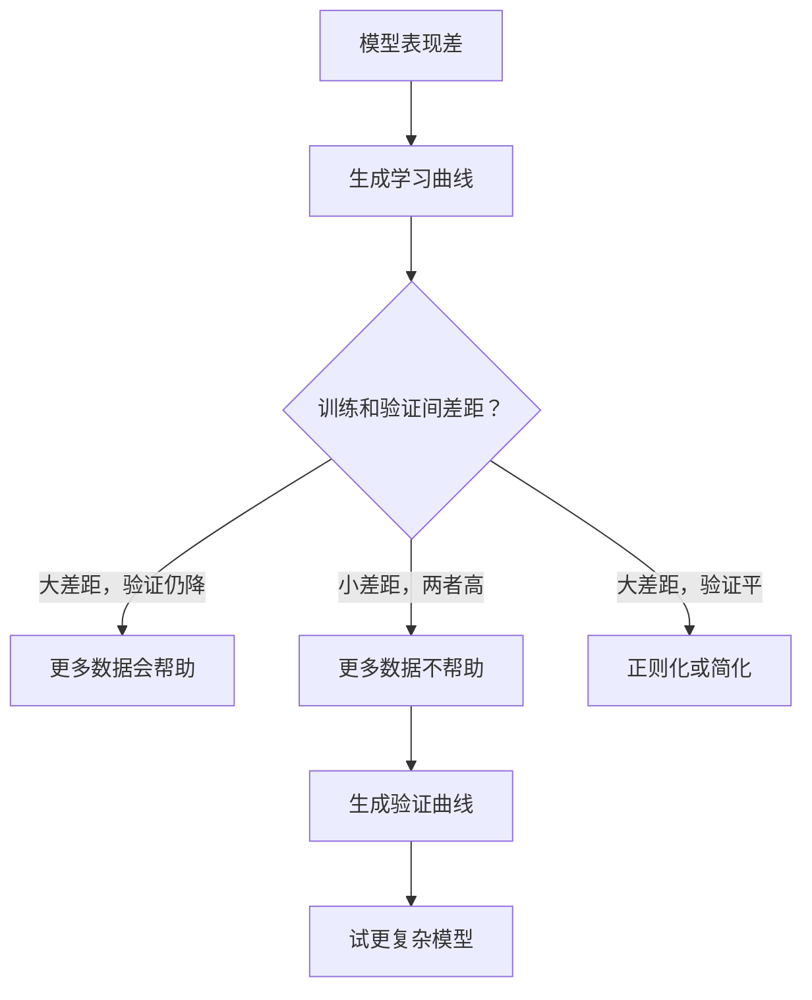

# 偏差方差权衡

> 每个模型误差来自三个来源之一: 偏差、方差或噪声。你只能控制前两个。

**类型:** 学习
**语言:** Python
**前置要求:** 第2阶段, 课程01-09 (ML基础, 回归, 分类, 评估)
**时间:** ~75分钟

## 学习目标

- 推导期望预测误差的偏差方差分解并解释不可减噪声角色
- 用训练和测试误差模式诊断模型高偏差还是高方差
- 解释正则化技术(L1, L2, dropout, 早停)如何换偏差为方差
- 实现实验可视化递增复杂度模型偏差方差权衡

## 问题背景

你训练模型。测试数据有误差。误差哪来？

如果模型太简单(曲线数据集上线性回归)，它会持续错过真实模式。那是偏差。如果模型太复杂(15数据点20阶多项式)，它会完美拟合训练数据但新数据预测狂变。那是方差。

你不能同时最小化它们对于固定模型容量。推偏差降方差升。推方差降偏差升。理解这权衡是机器学习单最有用诊断技能。它告诉你该让模型更复杂还是更简单，该拿更多数据还是工程更好特征，该更多还是更少正则化。

## 概念讲解

### 偏差: 系统误差

偏差测模型平均预测离真值多远。如果你在相同分布抽多不同训练集训练相同模型并平均预测，偏差是那平均和真理间差距。

高偏差意味模型太僵化捕获真实模式。直线拟合抛物线总错过曲线，不管给多少数据。这是欠拟合。

```
高偏差(欠拟合):
  模型总预测大致相同错东西。
  训练误差: 高
  测试误差: 高
  它们间差距: 小
```

### 方差: 对训练数据敏感

方差测在不同数据子集训练时预测变多少。如果训练集小变导模型大变，方差高。

高方差意味模型拟合训练数据噪声，非底层信号。20阶多项式会穿过每训练点但在它们间狂振荡。这是过拟合。

```
高方差(过拟合):
  模型完美拟合训练数据但新数据失败。
  训练误差: 低
  测试误差: 高
  它们间差距: 大
```

### 分解

对任何点x，期望预测误差在平方损失下精确分解:

```
期望误差 = 偏差^2 + 方差 + 不可减噪声

其中:
  偏差^2   = (E[f_hat(x)] - f(x))^2
  方差     = E[(f_hat(x) - E[f_hat(x)])^2]
  噪声     = E[(y - f(x))^2]             (sigma^2)
```

- `f(x)` 是真函数
- `f_hat(x)` 是你模型预测
- `E[...]` 是跨不同训练集期望
- `y` 是观测标签(真函数加噪声)

噪声项不可减。无模型在噪声数据比sigma^2好。你的工作找偏差^2和方差间正确平衡。

### 模型复杂度vs误差


经典U形曲线:

| 复杂度 | 偏差 | 方差 | 总误差 |
|-------|------|------|--------|
| 太低 | 高 | 低 | 高(欠拟合) |
| 恰好 | 中 | 中 | 最低 |
| 太高 | 低 | 高 | 高(过拟合) |

### 正则化作偏差方差控制

正则化故意增偏差减方差。它约束模型使不能追噪声。

- **L2(Ridge):** 所有权重缩向零。保所有特征但减它们影响。
- **L1(Lasso):** 推某些权重恰好零。执行特征选择。
- **Dropout:** 训练时随机禁神经元。强制冗余表示。
- **早停:** 模型完全拟合训练数据前停训练。

正则化强度(lambda, dropout率, epoch数)直接控你坐偏差方差曲线哪。更多正则化意味更多偏差，更少方差。

### 双下降: 现代视角

经典理论说: 甜蜜点后，更多复杂度总伤。但2019以来研究显示意外东西。如果你在插值阈值(模型有够参数完美拟合训练数据)远后继续增模型容量，测试误差可再降。


这"双下降"现象解释为何巨过参数化神经网络(参数远多于训练例)仍泛化好。经典偏差方差权衡没错，但对现代体系不完整。

双下降关键观察:
- 它在线性模型、决策树和神经网络发生
- 更多数据实际在插值区有害(样本双下降)
- 更多训练epoch也可导(epoch双下降)
- 正则化平滑峰值但不消除它

为何发生？在插值阈值，模型恰好够容量拟合所有训练点。它被迫进入穿每点的特定解，数据小扰动导拟合大变。这是方差峰值处。阈值后，模型有多可能解完美拟合数据。学习算法(如带隐式正则化的梯度下降)倾向挑它们中最简单那个。这隐式偏向简单解是为何过参数化模型泛化。

| 体系 | 参数vs样本 | 行为 |
|------|-----------|------|
| 欠参数化 | p << n | 经典权衡适用 |
| 插值阈值 | p ~ n | 方差峰值，测试误差尖 |
| 过参数化 | p >> n | 隐式正则化踢入，测试误差降 |

实用目的: 如果你用神经网络或大树集成，别停在插值阈值。要么远低于它(带显式正则化)要么远过它。最糟地方恰好阈值。

### 诊断你的模型



| 症状 | 诊断 | 修复 |
|------|------|------|
| 高训练误差，高测试误差 | 偏差 | 更多特征，复杂模型，更少正则化 |
| 低训练误差，高测试误差 | 方差 | 更多数据，正则化，更简单模型，dropout |
| 低训练误差，低测试误差 | 好拟合 | 发布 |
| 训练误差降，测试误差升 | 过拟合进行中 | 早停 |

### 实用策略

**当偏差是问题:**
- 加多项式或交互特征
- 用更灵活模型(树集成替代线性)
- 减正则化强度
- 训练更久(若未收敛)

**当方差是问题:**
- 拿更多训练数据
- 用bagging(随机森林)
- 增正则化(更高lambda，更多dropout)
- 特征选择(移噪声特征)
- 用交叉验证早检测

### 集成方法和方差减少

集成方法是最实用抗方差工具。

**Bagging(Bootstrap聚合)** 在训练数据不同bootstrap样本训练多模型，然后平均它们预测。每单独模型高方差，但平均低得多方差。随机森林是bagging应用到决策树。

为何数学上工作: 如果你平均N独立预测，各方差sigma^2，平均方差sigma^2 / N。模型非真正独立(它们都看相似数据)，所以减少少于1/N，但仍可观。

**Boosting** 通过顺序建模型减偏差，每新模型聚焦集成迄今错误。梯度提升和AdaBoost是主要例。Boosting可过拟合如果你加太多模型，所以需早停或正则化。

| 方法 | 主要效果 | 偏差变 | 方差变 |
|------|---------|--------|--------|
| Bagging | 减方差 | 不变 | 减 |
| Boosting | 减偏差 | 减 | 可增 |
| Stacking | 减两者 | 取决元学习器 | 取决基模型 |
| Dropout | 隐式bagging | 微增 | 减 |

**实用规则:** 如果基模型高方差(深树，高阶多项式)，用bagging。如果基模型高偏差(浅桩，简单线性模型)，用boosting。

### 学习曲线

学习曲线绘训练和验证误差为训练集大小函数。它们是你最实用诊断工具。不像单训练/测试比较，学习曲线展示模型轨迹并告诉你更多数据是否会帮助。


如何读它们:

| 场景 | 训练误差 | 验证误差 | 差距 | 意味 | 做什么 |
|------|---------|---------|------|------|--------|
| 高偏差 | 高 | 高 | 小 | 模型不能捕获模式 | 更多特征，复杂模型，更少正则化 |
| 高方差 | 低 | 高 | 大 | 模型记忆训练数据 | 更多数据，正则化，更简单模型 |
| 好拟合 | 中 | 中 | 小 | 模型泛化好 | 发布 |
| 高方差，改善中 | 低 | 随数据降 | 缩中 | 数据可修复方差问题 | 收集更多数据 |
| 高偏差，平坦 | 高 | 高且平 | 小且平 | 更多数据不帮助 | 改模型架构 |

关键洞: 如果两曲线已平且差距小但两误差高，更多数据无用。需更好模型。如果差距大且仍在缩，更多数据会帮助。

### 如何生成学习曲线

两种方法:

**方法1: 变训练集大小，固定模型。** 模型和超参常数。在递增训练数据子集训练。每大小测训练误差和验证误差。这是标准学习曲线。

**方法2: 变模型复杂度，固定数据。** 数据常数。扫复杂度参数(多项式阶，树深，层数)。每复杂度测训练误差和验证误差。这是验证曲线并直接展示偏差方差权衡。

两方法互补。第一个告诉你更多数据是否帮助。第二个告诉你不同模型是否帮助。决定下步前跑两者。



## 构建

`code/bias_variance.py`代码跑完整偏差方差分解实验。这是方法，步骤。

### 步骤1: 从已知函数生成合成数据

我们用`f(x) = sin(1.5x) + 0.5x`加高斯噪声。知道真函数让我们算精确偏差和方差。

```python
def true_function(x):
    return np.sin(1.5 * x) + 0.5 * x

def generate_data(n_samples=30, noise_std=0.5, x_range=(-3, 3), seed=None):
    rng = np.random.RandomState(seed)
    x = rng.uniform(x_range[0], x_range[1], n_samples)
    y = true_function(x) + rng.normal(0, noise_std, n_samples)
    return x, y
```

### 步骤2: Bootstrap采样和多项式拟合

对每多项式阶，我们抽多bootstrap训练集，拟合多项式，并在固定测试网格记录预测。这给我们每测试点预测分布。

```python
def fit_polynomial(x_train, y_train, degree, lam=0.0):
    X = np.column_stack([x_train ** d for d in range(degree + 1)])
    if lam > 0:
        penalty = lam * np.eye(X.shape[1])
        penalty[0, 0] = 0
        w = np.linalg.solve(X.T @ X + penalty, X.T @ y_train)
    else:
        w = np.linalg.lstsq(X, y_train, rcond=None)[0]
    return w
```

我们在200不同bootstrap样本拟合。每bootstrap样本从相同底层分布抽但含不同点。

### 步骤3: 计算偏差^2，方差分解

有200组每测试点预测，我们可直接从定义算分解:

```python
mean_pred = predictions.mean(axis=0)
bias_sq = np.mean((mean_pred - y_true) ** 2)
variance = np.mean(predictions.var(axis=0))
total_error = np.mean(np.mean((predictions - y_true) ** 2, axis=1))
```

- `mean_pred` 是E[f_hat(x)]从bootstrap样本估计
- `bias_sq` 是平均预测和真理间平方差距
- `variance` 是跨bootstrap样本预测平均散布
- `total_error` 应近似等于偏差^2 + 方差 + 噪声

### 步骤4: 学习曲线

学习曲线扫训练集大小同时模型复杂度固定。它们展示你模型数据限制还是容量限制。

```python
def demo_learning_curves():
    sizes = [10, 15, 20, 30, 50, 75, 100, 150, 200, 300]
    degree = 5

    for n in sizes:
        train_errors = []
        test_errors = []
        for seed in range(50):
            x_train, y_train = generate_data(n_samples=n, seed=seed * 100)
            w = fit_polynomial(x_train, y_train, degree)
            train_pred = predict_polynomial(x_train, w)
            train_mse = np.mean((train_pred - y_train) ** 2)
            test_pred = predict_polynomial(x_test, w)
            test_mse = np.mean((test_pred - y_test) ** 2)
            train_errors.append(train_mse)
            test_errors.append(test_mse)
        # 平均跨跑给学习曲线点
```

对高方差模型(5阶小数据)，你见:
- 训练误差开始低并增因更多数据使记忆更难
- 测试误差开始高并减因模型得更多信号
- 差距随数据缩

对高偏差模型(1阶)，两误差快收敛到相同高值且更多数据不帮助。

### 步骤5: 正则化扫

代码也含`demo_regularization_sweep()`，固定高阶多项式(15阶)并扫Ridge正则化强度从0.001到100。这从不同角度展示偏差方差权衡: 非变模型复杂度，变约束强度。

```python
def demo_regularization_sweep():
    alphas = [0.001, 0.005, 0.01, 0.05, 0.1, 0.5, 1.0, 5.0, 10.0, 50.0, 100.0]
    for alpha in alphas:
        results = bias_variance_decomposition([15], lam=alpha)
        r = results[15]
        print(f"alpha={alpha:.3f}  bias={r['bias_sq']:.4f}  var={r['variance']:.4f}")
```

低alpha，15阶多项式近乎无约束。方差主导因模型追每bootstrap样本噪声。高alpha，惩罚太强模型实际成近常数函数。偏差主导。最优alpha在两者间。

这是从变多项式阶来相同U曲线，但用连续钮而非离散控制。实践，正则化是控权衡首选方式因它允细粒控制不改特征集。

## 使用

sklearn提供`learning_curve`和`validation_curve`自动化这些诊断无需写bootstrap循环。

### 验证曲线: 扫模型复杂度

```python
from sklearn.model_selection import validation_curve
from sklearn.pipeline import make_pipeline
from sklearn.preprocessing import PolynomialFeatures
from sklearn.linear_model import Ridge

degrees = list(range(1, 16))
train_scores_all = []
val_scores_all = []

for d in degrees:
    pipe = make_pipeline(PolynomialFeatures(d), Ridge(alpha=0.01))
    train_scores, val_scores = validation_curve(
        pipe, X, y, param_name="polynomialfeatures__degree",
        param_range=[d], cv=5, scoring="neg_mean_squared_error"
    )
    train_scores_all.append(-train_scores.mean())
    val_scores_all.append(-val_scores.mean())
```

这直接给你偏差方差权衡曲线。验证分数相对训练分数最差处，方差主导。两者坏处，偏差主导。

### 学习曲线: 扫训练集大小

```python
from sklearn.model_selection import learning_curve

pipe = make_pipeline(PolynomialFeatures(5), Ridge(alpha=0.01))
train_sizes, train_scores, val_scores = learning_curve(
    pipe, X, y, train_sizes=np.linspace(0.1, 1.0, 10),
    cv=5, scoring="neg_mean_squared_error"
)
train_mse = -train_scores.mean(axis=1)
val_mse = -val_scores.mean(axis=1)
```

绘`train_mse`和`val_mse`对`train_sizes`。形状告诉你关于模型一切。

### 正则化扫交叉验证

```python
from sklearn.model_selection import cross_val_score

alphas = [0.001, 0.01, 0.1, 1.0, 10.0, 100.0]
for alpha in alphas:
    pipe = make_pipeline(PolynomialFeatures(10), Ridge(alpha=alpha))
    scores = cross_val_score(pipe, X, y, cv=5, scoring="neg_mean_squared_error")
    print(f"alpha={alpha:>7.3f}  MSE={-scores.mean():.4f} +/- {scores.std():.4f}")
```

这扫固定模型复杂度正则化强度。你见相同偏差方差权衡: 低alpha意味高方差，高alpha意味高偏差。

### 放一起: 完整诊断工作流

实践，你顺序跑这些诊断:

1. 训练模型。算训练和测试误差。
2. 如果两者高: 你有偏差问题。跳到步骤4。
3. 如果训练低但测试高: 你有方差问题。生成学习曲线看更多数据是否帮助。如果不，正则化。
4. 生成验证曲线扫你主复杂度参数。找甜蜜点。
5. 在甜蜜点，生成学习曲线。如果差距仍大，你需要更多数据或正则化。
6. 试不同alpha值Ridge/Lasso用`cross_val_score`。挑交叉验证误差最低alpha。

这花10-15分钟计算大多数表格数据集并省小时猜测。

## 交付成果

本课程产生: `outputs/prompt-model-diagnostics.md`

## 练习题

1. 跑分解`noise_std=0`(无噪声)。不可减误差项发生什么？最优复杂度变吗？

2. 增训练集大小从30到300。这如何影响方差成分？最优多项式阶移吗？

3. 加L2正则化(Ridge回归)到实验。固定高阶多项式(15阶)，扫lambda从0到100。绘偏差^2和方差为lambda函数。

4. 改真函数从多项式到`sin(x)`。偏差方差分解如何变？仍有明确最优阶吗？

5. 实现简单bootstrap聚合(bagging)包装器: 在bootstrap样本训练10模型并平均预测。展示这减方差不增偏差太多。

## 关键术语

| 术语 | 人们怎么说 | 实际含义 |
|------|----------------|----------------------|
| 偏差 | "模型太简单" | 错假设系统误差。平均模型预测和真理间差距。 |
| 方差 | "模型过拟合" | 训练数据敏感误差。跨不同训练集预测变多少。 |
| 不可减误差 | "数据噪声" | 真数据生成过程随机性误差。无模型可消除它。 |
| 欠拟合 | "不够学" | 模型高偏差。它错过真实模式甚至在训练数据。 |
| 过拟合 | "记忆数据" | 模型高方差。它拟合训练数据噪声不泛化。 |
| 正则化 | "约束模型" | 加惩罚减模型复杂度，换偏差为低方差。 |
| 双下降 | "更多参数可帮助" | 当模型容量远超插值阈值测试误差再降。 |
| 模型复杂度 | "模型多灵活" | 模型拟合任意模式容量。由架构、特征或正则化控。 |

## 延伸阅读

- [Hastie, Tibshirani, Friedman: Elements of Statistical Learning, Ch. 7](https://hastie.su.domains/ElemStatLearn/) -- 偏差方差分解权威处理
- [Belkin et al., Reconciling modern machine learning practice and the bias-variance trade-off (2019)](https://arxiv.org/abs/1812.11118) -- 双下降论文
- [Nakkiran et al., Deep Double Descent (2019)](https://arxiv.org/abs/1912.02292) -- epoch和样本双下降
- [Scott Fortmann-Roe: Understanding the Bias-Variance Tradeoff](http://scott.fortmann-roe.com/docs/BiasVariance.html) -- 清晰视觉解释