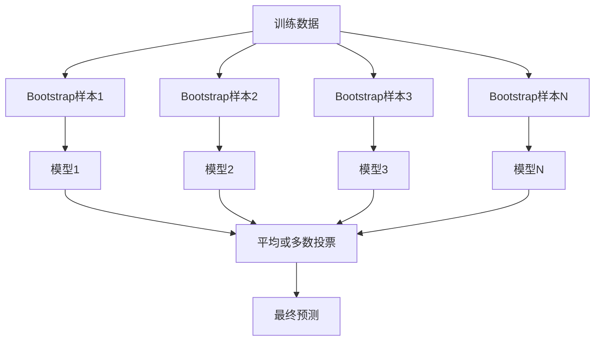
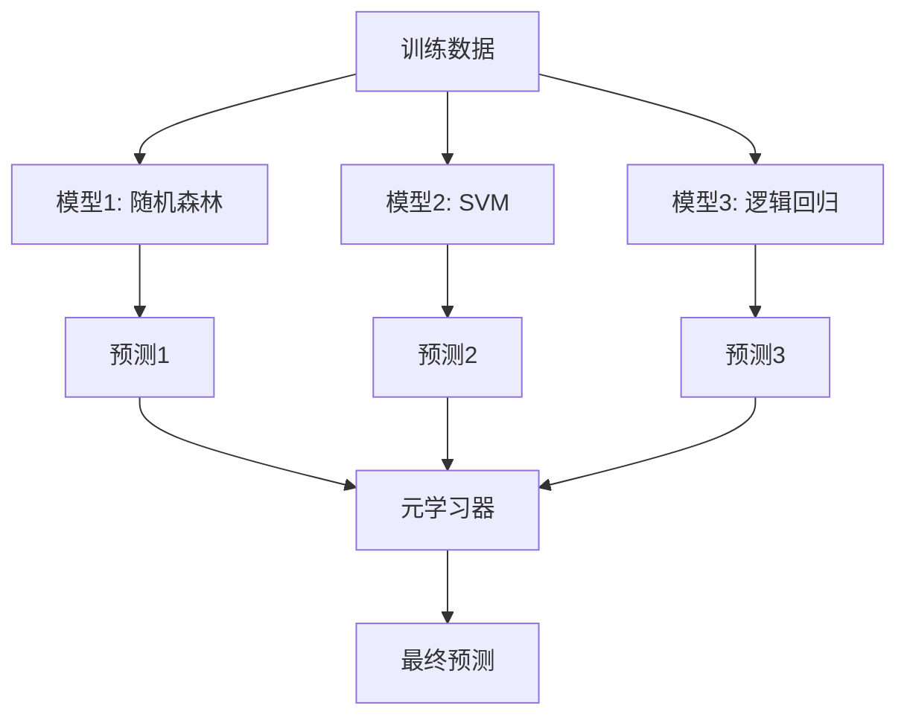

# 集成方法

> 一群弱学习器，正确组合，成强学习器。这不是比喻。这是定理。

**类型:** 构建
**语言:** Python
**前置要求:** 第2阶段, 课程10 (偏差方差权衡)
**时间:** ~120分钟

## 学习目标

- 从零实现AdaBoost和梯度提升并解释提升如何顺序减偏差
- 构建bagging集成并演示平均去相关模型如何减方差不增偏差
- 比较bagging、提升和stacking在各自目标误差成分
- 评估集成多样性并解释多数投票精度为何随更多独立弱学习器改善

## 问题背景

单决策树训练快易解释，但它过拟合。单线性模型在复杂边界欠拟合。你可花天工程完美模型架构。或者你可组合一堆不完美模型得比任何单独更好东西。

集成方法恰好做这。它们是表格数据赢Kaggle竞赛最可靠技术，它们驱动多数生产ML系统，它们阐明偏差方差权衡在行动。Bagging减方差。Boosting减偏差。Stacking学习哪个模型在哪输入可信。

## 概念讲解

### 为何集成工作

假设你有N独立分类器，各精度p > 0.5。多数投票精度:

```
P(多数正确) = 对k > N/2求和C(N,k) * p^k * (1-p)^(N-k)
```

对21分类器各60%精度，多数投票精度约74%。101分类器，升到84%。当模型犯不同错时错误抵消。

关键要求是**多样性**。如果所有模型犯相同错，组合无帮助。集成工作因它们通过以下产多样模型:

- 不同训练子集(bagging)
- 不同特征子集(随机森林)
- 顺序错误纠正(boosting)
- 不同模型家族(stacking)

### Bagging(Bootstrap聚合)

Bagging通过每模型在不同训练数据bootstrap样本训练创建多样性。



Bootstrap样本从原始数据有替换抽，与原始同大小。约63.2%唯一样本出现在每bootstrap。剩余36.8%(bag外样本)提供免费验证集。

Bagging减方差不增偏差太多。每单独树过拟合到其bootstrap样本，但过拟合每树不同，所以平均抵消噪声。

**随机森林**是bagging加额外扭转: 每分裂，只考虑随机特征子集。这强制树间更多多样性。典型候选特征数分类`sqrt(n_features)`回归`n_features / 3`。

### Boosting(顺序错误纠正)

Boosting顺序训练模型。每新模型聚焦前模型错例。


Boosting减偏差。每新模型纠正集成迄今系统误差。最终预测是所有模型加权求和，更好模型更高权重。

权衡: 提升可过拟合如果你跑太多轮，因它持续拟合更难例，些可是噪声。

### AdaBoost

AdaBoost(自适应提升)是第一个实用提升算法。它与任何基学习器工作，典型决策桩(深1树)。

算法:

```
1. 初始化样本权重: w_i = 1/N对所有i

2. 对t = 1到T:
   a. 加权数据训练弱学习器h_t
   b. 计算加权误差:
      err_t = sum(w_i * I(h_t(x_i) != y_i)) / sum(w_i)
   c. 计算模型权重:
      alpha_t = 0.5 * ln((1 - err_t) / err_t)
   d. 更新样本权重:
      w_i = w_i * exp(-alpha_t * y_i * h_t(x_i))
   e. 归一化权重总和为1

3. 最终预测: H(x) = sign(sum(alpha_t * h_t(x)))
```

低误差模型得高alpha。误分类样本得高权重所以下模型聚焦它们。

### 梯度提升

梯度提升推广提升到任意损失函数。不重加权样本，它拟合每新模型到当前集成残差(损失负梯度)。

```
1. 初始化: F_0(x) = argmin_c sum(L(y_i, c))

2. 对t = 1到T:
   a. 计算伪残差:
      r_i = -dL(y_i, F_{t-1}(x_i)) / dF_{t-1}(x_i)
   b. 拟合树h_t到残差r_i
   c. 找最优步长:
      gamma_t = argmin_gamma sum(L(y_i, F_{t-1}(x_i) + gamma * h_t(x_i)))
   d. 更新:
      F_t(x) = F_{t-1}(x) + learning_rate * gamma_t * h_t(x)

3. 最终预测: F_T(x)
```

平方误差损失，伪残差恰好实际残差: `r_i = y_i - F_{t-1}(x_i)`。每树字面上拟合前集成误差。

学习率(收缩)控每树贡献多少。更小学习率需更多树但泛化更好。典型值: 0.01到0.3。

### XGBoost: 为何它主导表格数据

XGBoost(极致梯度提升)是带工程优化的梯度提升，快、精确、抗过拟合:

- **正则化目标:** 叶权重L1和L2惩罚防单独树太自信
- **二阶近似:** 用损失一阶和二阶导数，给更好分裂决策
- **稀疏感知分裂:** 原生处理缺失值通过学习每分裂缺失数据最佳方向
- **列子采样:** 像随机森林，每分裂采样特征求多样性
- **加权分位草图:** 高效在分布式数据找连续特征分裂点
- **缓存感知块结构:** CPU缓存线优化的内存布局

表格数据，XGBoost(和其继任者LightGBM)持续胜神经网络。这不久改变。如果你的数据放行列表，从梯度提升开始。

### Stacking(元学习)

Stacking用多基模型预测作元学习器特征。



元学习器学习哪基模型在哪输入可信。如果随机森林在某区更好而SVM在其他区，元学习器会学习相应路由。

避免数据泄漏，基模型预测必须通过训练集交叉验证生成。你绝不能在同数据训练基模型并生成元特征。

### 投票

最简单集成。直接组合预测。

- **硬投票:** 类标签多数投票。
- **软投票:** 平均预测概率，挑最高平均概率类。通常更好因用置信信息。

## 构建

### 步骤1: 决策桩(基学习器)

`code/ensembles.py`代码从零实现所有。我们从决策桩开始: 单分裂树。

```python
class DecisionStump:
    def __init__(self):
        self.feature_idx = None
        self.threshold = None
        self.polarity = 1
        self.alpha = None

    def fit(self, X, y, weights):
        n_samples, n_features = X.shape
        best_error = float("inf")

        for f in range(n_features):
            thresholds = np.unique(X[:, f])
            for thresh in thresholds:
                for polarity in [1, -1]:
                    pred = np.ones(n_samples)
                    pred[polarity * X[:, f] < polarity * thresh] = -1
                    error = np.sum(weights[pred != y])
                    if error < best_error:
                        best_error = error
                        self.feature_idx = f
                        self.threshold = thresh
                        self.polarity = polarity

    def predict(self, X):
        n = X.shape[0]
        pred = np.ones(n)
        idx = self.polarity * X[:, self.feature_idx] < self.polarity * self.threshold
        pred[idx] = -1
        return pred
```

### 步骤2: 从零AdaBoost

```python
class AdaBoostScratch:
    def __init__(self, n_estimators=50):
        self.n_estimators = n_estimators
        self.stumps = []
        self.alphas = []

    def fit(self, X, y):
        n = X.shape[0]
        weights = np.full(n, 1 / n)

        for _ in range(self.n_estimators):
            stump = DecisionStump()
            stump.fit(X, y, weights)
            pred = stump.predict(X)

            err = np.sum(weights[pred != y])
            err = np.clip(err, 1e-10, 1 - 1e-10)

            alpha = 0.5 * np.log((1 - err) / err)
            weights *= np.exp(-alpha * y * pred)
            weights /= weights.sum()

            stump.alpha = alpha
            self.stumps.append(stump)
            self.alphas.append(alpha)

    def predict(self, X):
        total = sum(a * s.predict(X) for a, s in zip(self.alphas, self.stumps))
        return np.sign(total)
```

### 步骤3: 从零梯度提升

```python
class GradientBoostingScratch:
    def __init__(self, n_estimators=100, learning_rate=0.1, max_depth=3):
        self.n_estimators = n_estimators
        self.lr = learning_rate
        self.max_depth = max_depth
        self.trees = []
        self.initial_pred = None

    def fit(self, X, y):
        self.initial_pred = np.mean(y)
        current_pred = np.full(len(y), self.initial_pred)

        for _ in range(self.n_estimators):
            residuals = y - current_pred
            tree = SimpleRegressionTree(max_depth=self.max_depth)
            tree.fit(X, residuals)
            update = tree.predict(X)
            current_pred += self.lr * update
            self.trees.append(tree)

    def predict(self, X):
        pred = np.full(X.shape[0], self.initial_pred)
        for tree in self.trees:
            pred += self.lr * tree.predict(X)
        return pred
```

### 步骤4: 对比sklearn

代码验证我们从零实现产类似精度到sklearn的`AdaBoostClassifier`和`GradientBoostingClassifier`，并并列比较所有方法。

## 使用

### 何时用每种方法

| 方法 | 减 | 最佳用 | 注意 |
|--------|---------|----------|---------------|
| Bagging / 随机森林 | 方差 | 噪声数据，多特征 | 不帮助偏差 |
| AdaBoost | 偏差 | 清洁数据，简单基学习器 | 敏感异常值和噪声 |
| 梯度提升 | 偏差 | 表格数据，竞赛 | 训练慢，易过拟合不调 |
| XGBoost / LightGBM | 两者 | 生产表格ML | 多超参 |
| Stacking | 两者 | 得最后1-2%精度 | 复杂，有过拟合元学习器风险 |
| 投票 | 方差 | 快组合多样模型 | 只帮助若模型多样 |

### 表格数据生产栈

对多数表格预测问题，这是尝试顺序:

1. **LightGBM或XGBoost** 默认参数
2. 调n_estimators, learning_rate, max_depth, min_child_weight
3. 如果需最后0.5%，构建3-5多样模型stacking集成
4. 全程用交叉验证

表格数据神经网络几乎总比梯度提升差，尽管持续研究尝试。TabNet, NODE和类似架构偶尔匹配但罕见胜过调好XGBoost。

## 交付成果

本课程产生 `outputs/prompt-ensemble-selector.md` -- 帮你为给定数据集选对集成方法的提示词。描述数据(大小、特征类型、噪声水平、类平衡)和你解问题。提示词走决策清单，推荐方法，建议起始超参，警告该方法常见错误。也产 `outputs/skill-ensemble-builder.md` 带完整选择指南。

## 练习题

1. 改AdaBoost实现每轮后追踪训练精度。绘精度vs估计器数。何时收敛？

2. 从零实现随机森林通过加随机特征子采样到回归树。训练100树用`max_features=sqrt(n_features)`并平均预测。比较方差减少vs单树。

3. 梯度提升实现中，加早停: 每轮后追踪验证损失并当连续10轮未改善时停。实际需多少树？

4. 构建stacking集成带三基模型(逻辑回归、决策树、k近邻)和逻辑回归元学习器。用5折交叉验证生成元特征。比较每基模型单独。

5. 同数据集跑XGBoost用默认参数。比较精度到你从零梯度提升。计时两者。速度差多大？

## 关键术语

| 术语 | 人们怎么说 | 实际含义 |
|------|----------------|----------------------|
| Bagging | "随机子集训练" | Bootstrap聚合: 在bootstrap样本训练模型，平均预测减方差 |
| Boosting | "聚焦难例" | 顺序训练模型，每纠正集成迄今错误，减偏差 |
| AdaBoost | "重加权数据" | 通过样本权重更新提升; 误分类点得更高权重给下学习器 |
| 梯度提升 | "拟合残差" | 通过拟合每新模型到损失函数负梯度提升 |
| XGBoost | "Kaggle武器" | 带正则化、二阶优化和系统级速度技巧的梯度提升 |
| Stacking | "模型上模型" | 用基模型预测作元学习器输入特征 |
| 随机森林 | "多随机化树" | 用决策树bagging，每分裂加随机特征子采样求多样性 |
| 集成多样性 | "犯不同错" | 模型错误必须不相关集成才能改善超个体 |
| Bag外误差 | "免费验证" | 不在bootstrap抽样本(~36.8%)作验证集无需保留 |

## 延伸阅读

- [Schapire & Freund: Boosting: Foundations and Algorithms](https://mitpress.mit.edu/9780262526036/) -- AdaBoost创建者书
- [Friedman: Greedy Function Approximation: A Gradient Boosting Machine (2001)](https://statweb.stanford.edu/~jhf/ftp/trebst.pdf) -- 原始梯度提升论文
- [Chen & Guestrin: XGBoost (2016)](https://arxiv.org/abs/1603.02754) -- XGBoost论文
- [Wolpert: Stacked Generalization (1992)](https://www.sciencedirect.com/science/article/abs/pii/S0893608005800231) -- 原始stacking论文
- [scikit-learn Ensemble Methods](https://scikit-learn.org/stable/modules/ensemble.html) -- 实用参考