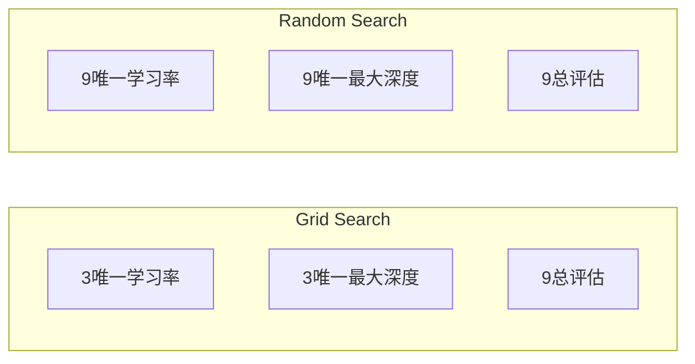
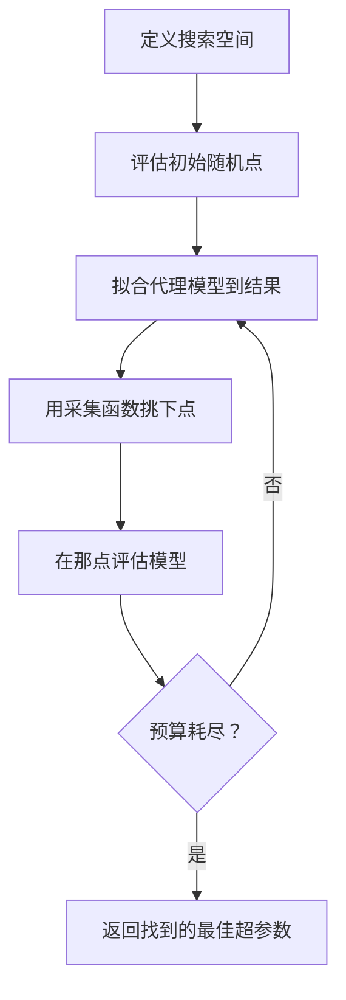
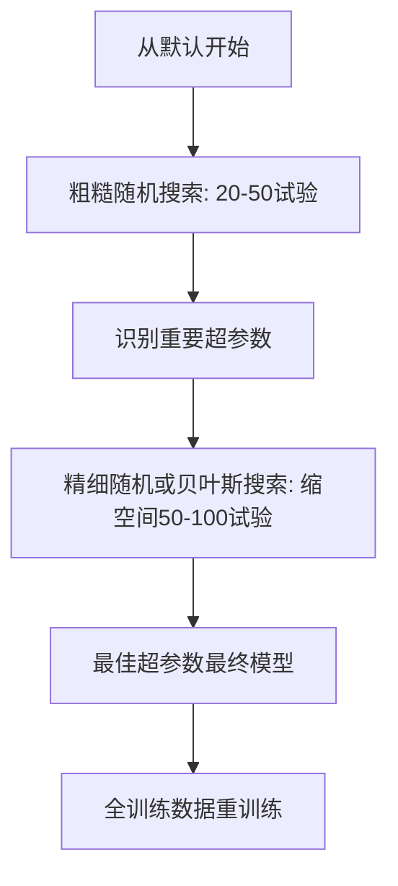
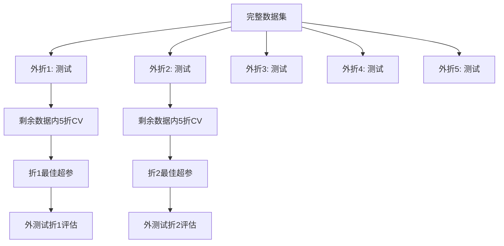

# 超参数调优

> 超参数是训练开始前你转的钮。转好是平庸模型和伟大模型的区别。

**类型:** 构建
**语言:** Python
**前置要求:** 第2阶段, 课程11 (集成方法)
**时间:** ~90分钟

## 学习目标

- 从零实现网格搜索、随机搜索和贝叶斯优化并比较它们样本效率
- 解释为何随机搜索胜网格搜索当多数超参数低有效维度
- 用代理模型和采集函数构建贝叶斯优化循环导搜索
- 设计通过正确交叉验证避免过拟合验证集的超参数调优策略

## 问题背景

你梯度提升模型有学习率、树数、最大深度、每叶最小样本、子采样比、列采样比。那是六超参数。如果每5合理值，网格5^6 = 15,625组合。每训练10秒。那是43小时计算全试。

网格搜索是显然方法但规模最差。随机搜索用更少计算更好。贝叶斯优化通过从过去评估学习更好。知道用哪种策略，哪些超参数实际重要，省天浪费GPU时间。

## 概念讲解

### 参数vs超参数

参数训练时学习(权重、偏置、分裂阈值)。超参数训练开始前设并控学习如何发生。

| 超参数 | 它控什么 | 典型范围 |
|---------------|-----------------|---------------|
| 学习率 | 每更新步大小 | 0.001到1.0 |
| 树数/epochs | 训练多久 | 10到10,000 |
| 最大深度 | 模型复杂度 | 1到30 |
| 正则化(lambda) | 过拟合防止 | 0.0001到100 |
| 批大小 | 梯度估计噪声 | 16到512 |
| Dropout率 | 丢弃神经元比例 | 0.0到0.5 |

### 网格搜索

网格搜索评估指定值每组合。它穷举易理解，但随超参数数指数规模。

```
2超参数网格:

  learning_rate: [0.01, 0.1, 1.0]
  max_depth:     [3, 5, 7]

  评估: 3 x 3 = 9组合

  (0.01, 3)  (0.01, 5)  (0.01, 7)
  (0.1,  3)  (0.1,  5)  (0.1,  7)
  (1.0,  3)  (1.0,  5)  (1.0,  7)
```

网格搜索有根本缺陷: 如果一超参数重要另一不，多数评估浪费。你9评估只得3重要参数唯一值。

### 随机搜索

随机搜索从分布采样超参数而非网格。同9评估预算，你得每超参数9唯一值。



为何随机胜网格(Bergstra & Bengio, 2012):

- 多数超参数低有效维度。6中超参数通常只1-2对给定问题重要。
- 网格搜索浪费评估不重要维度。
- 随机搜索同预算更密覆盖重要维度。
- 60随机试验，你有95%机会找在最优5%内点(如果搜索空间存在一)。

### 贝叶斯优化

随机搜索忽略结果。它不学习高学习率导发散或深度3持续胜深度10。贝叶斯优化用过去评估决定下次搜索哪。



两关键组件:

**代理模型:** 廉价评估模型(通常高斯过程)近似昂贵目标函数。它给搜索空间任意点预测和不确定估计。

**采集函数:** 通过平衡开发(搜索已知好点附近)和探索(搜索不确定高处)决定下次评估哪。常见选择:

- **期望改善(EI):** 我们期望这点改善当前最佳多少？
- **上置信界(UCB):** 预测加不确定倍数。更高UCB意味有希望或未探索。
- **改善概率(PI):** 这点胜当前最佳概率多少？

贝叶斯优化典型比随机搜索用2-5倍更少评估找更好超参数。拟合代理模型开销相比训练实际模型可忽略。

### 早停

非每训练跑需完成。如果配置10 epochs后明显坏，停它并前进。这是超参搜索语境下早停。

策略:
- **耐心基:** 如果验证损失连续N epochs未改善则停
- **中位数剪枝:** 如果试验中间结果比同步完成试验中位数差则停
- **Hyperband:** 给多配置小预算，然后逐步增最佳预算

Hyperband特别有效。它开始81配置各1 epoch，保前三分之一，给它们3 epochs，保前三分之一，等等。这比全预算评估所有配置快10-50倍找好配置。

### 学习率调度器

学习率几乎总最重要超参数。而非保持固定，调度器训练时调整它。

| 调度器 | 公式 | 何时用 |
|-----------|---------|-------------|
| 步衰减 | 每N epochs乘0.1 | 经典CNN训练 |
| 余弦退火 | lr * 0.5 * (1 + cos(pi * t / T)) | 现代默认 |
| Warmup + 衰减 | 线性增然后余弦降 | Transformer |
| 单周期 | 增然后单周期降 | 快收敛 |
| 平原减 | 指标停时减因子 | 安全默认 |

### 超参数重要性

非所有超参数同等重要。随机森林研究(Probst et al., 2019)和梯度提升示一致模式:

**高重要性:**
- 学习率(总先调)
- 估计器数/epochs(用早停替代调)
- 正则化强度

**中重要性:**
- 最大深度/层数
- 每叶最小样本/权重衰减
- 子采样比

**低重要性:**
- 最大特征(随机森林)
- 特定激活函数选择
- 批大小(合理范围内)

先调重要者，余留默认。

### 实用策略



具体工作流:

1. **从库默认开始。** 它们由经验从业者选常80%到位。
2. **粗糙随机搜索。** 宽范围，20-50试验。用早停快杀坏跑。
3. **分析结果。** 哪些超参数与性能相关？缩搜索空间。
4. **精细搜索。** 缩空间贝叶斯优化或聚焦随机搜索。50-100试验。
5. **全训练数据重训练** 用找到的最佳超参数。

### 交叉验证集成

单验证分裂调超参数危险。最佳超参数可过拟合特定验证折。嵌套交叉验证通过用两循环解:

- **外循环**(评估): 数据分train+val和test。报无偏性能。
- **内循环**(调): train+val分train和val。找最佳超参数。



每外折独立找自己最佳超参数。外分数是泛化性能无偏估计。

用sklearn:

```python
from sklearn.model_selection import cross_val_score, GridSearchCV
from sklearn.ensemble import GradientBoostingRegressor

inner_cv = GridSearchCV(
    GradientBoostingRegressor(),
    param_grid={
        "learning_rate": [0.01, 0.05, 0.1],
        "max_depth": [2, 3, 5],
        "n_estimators": [50, 100, 200],
    },
    cv=5,
    scoring="neg_mean_squared_error",
)

outer_scores = cross_val_score(
    inner_cv, X, y, cv=5, scoring="neg_mean_squared_error"
)

print(f"Nested CV MSE: {-outer_scores.mean():.4f} +/- {outer_scores.std():.4f}")
```

这昂贵(5外折 x 5内折 x 27网格点 = 675模型拟合)，但给你可信性能估计。论文报告最终结果或决策风险高时用它。

### 实用提示

**从学习率开始。** 它总是梯度方法最重要超参数。坏学习率使其他无关。固定其他超参默认先扫学习率。

**学习率和正则化用log均匀分布。** 0.001和0.01间差与0.1和1.0间差同等重要。线性搜索浪费预算在大端。

**用早停替代调n_estimators。** 提升和神经网络，设n_estimators或epochs高让早停决定何时停。这移除一超参从搜索。

**预算分配。** 花60%调优预算在前2最重要超参数。花余40%在其他一切。前2占多数性能变。

**尺度重要。** 绝不在log尺度搜批大小(16, 32, 64可行)。总在log尺度搜学习率。匹配搜索分布到超参数如何影响模型。

| 模型类型 | 顶超参数 | 推荐搜索 | 预算 |
|-----------|--------------------|--------------------|--------|
| 随机森林 | n_estimators, max_depth, min_samples_leaf | 随机搜索, 50试验 | 低(训练快) |
| 梯度提升 | learning_rate, n_estimators, max_depth | 贝叶斯, 100试验 + 早停 | 中 |
| 神经网络 | learning_rate, weight_decay, batch_size | 贝叶斯或随机, 100+试验 | 高(训练慢) |
| SVM | C, gamma(RBF核) | Log尺度网格, 25-50试验 | 低(2参数) |
| Lasso/Ridge | alpha | Log尺度1D搜索, 20试验 | 极低 |
| XGBoost | learning_rate, max_depth, subsample, colsample | 贝叶斯, 100-200试验 + 早停 | 中 |

**有疑时:** 随机搜索用超参数数2倍试验(如6超参数 = 12+试验最小)。你会惊讶50试验随机搜索多常胜小心设计网格搜索。

## 构建

### 步骤1: 从零网格搜索

`code/tuning.py`代码从零实现网格搜索、随机搜索和简单贝叶斯优化器。

```python
def grid_search(model_fn, param_grid, X_train, y_train, X_val, y_val):
    keys = list(param_grid.keys())
    values = list(param_grid.values())
    best_score = -float("inf")
    best_params = None
    n_evals = 0

    for combo in itertools.product(*values):
        params = dict(zip(keys, combo))
        model = model_fn(**params)
        model.fit(X_train, y_train)
        score = evaluate(model, X_val, y_val)
        n_evals += 1

        if score > best_score:
            best_score = score
            best_params = params

    return best_params, best_score, n_evals
```

### 步骤2: 从零随机搜索

```python
def random_search(model_fn, param_distributions, X_train, y_train,
                  X_val, y_val, n_iter=50, seed=42):
    rng = np.random.RandomState(seed)
    best_score = -float("inf")
    best_params = None

    for _ in range(n_iter):
        params = {k: sample(v, rng) for k, v in param_distributions.items()}
        model = model_fn(**params)
        model.fit(X_train, y_train)
        score = evaluate(model, X_val, y_val)

        if score > best_score:
            best_score = score
            best_params = params

    return best_params, best_score, n_iter
```

### 步骤3: 贝叶斯优化(简化)

核心思想: 拟合高斯过程到观测(超参数, 分数)对，然后用采集函数决定下次看哪。

```python
class SimpleBayesianOptimizer:
    def __init__(self, search_space, n_initial=5):
        self.search_space = search_space
        self.n_initial = n_initial
        self.X_observed = []
        self.y_observed = []

    def _kernel(self, x1, x2, length_scale=1.0):
        dists = np.sum((x1[:, None, :] - x2[None, :, :]) ** 2, axis=2)
        return np.exp(-0.5 * dists / length_scale ** 2)

    def _fit_gp(self, X_new):
        X_obs = np.array(self.X_observed)
        y_obs = np.array(self.y_observed)
        y_mean = y_obs.mean()
        y_centered = y_obs - y_mean

        K = self._kernel(X_obs, X_obs) + 1e-4 * np.eye(len(X_obs))
        K_star = self._kernel(X_new, X_obs)

        L = np.linalg.cholesky(K)
        alpha = np.linalg.solve(L.T, np.linalg.solve(L, y_centered))
        mu = K_star @ alpha + y_mean

        v = np.linalg.solve(L, K_star.T)
        var = 1.0 - np.sum(v ** 2, axis=0)
        var = np.maximum(var, 1e-6)

        return mu, var

    def _expected_improvement(self, mu, var, best_y):
        sigma = np.sqrt(var)
        z = (mu - best_y) / (sigma + 1e-10)
        ei = sigma * (z * norm_cdf(z) + norm_pdf(z))
        return ei

    def suggest(self):
        if len(self.X_observed) < self.n_initial:
            return sample_random(self.search_space)

        candidates = [sample_random(self.search_space) for _ in range(500)]
        X_cand = np.array([to_vector(c) for c in candidates])
        mu, var = self._fit_gp(X_cand)
        ei = self._expected_improvement(mu, var, max(self.y_observed))
        return candidates[np.argmax(ei)]

    def observe(self, params, score):
        self.X_observed.append(to_vector(params))
        self.y_observed.append(score)
```

GP代理给每候选点两东西: 预测分数(mu)和不确定(var)。期望改善平衡这些: 它倾向模型预测高分或不确定高点。早期，多数点高不确定所以优化器探索。后来，它聚焦最有希望区域。

### 步骤4: 比较所有方法

同合成目标跑所有三方法比较。这比较用简化包装器直接目标函数调用每优化器(无模型训练)，所以API异于上模型基实现:

```python
def synthetic_objective(params):
    lr = params["learning_rate"]
    depth = params["max_depth"]
    return -(np.log10(lr) + 2) ** 2 - (depth - 4) ** 2 + 10

param_grid = {
    "learning_rate": [0.001, 0.01, 0.1, 1.0],
    "max_depth": [2, 3, 4, 5, 6, 7, 8],
}

grid_best = None
grid_score = -float("inf")
grid_history = []
for combo in itertools.product(*param_grid.values()):
    params = dict(zip(param_grid.keys(), combo))
    score = synthetic_objective(params)
    grid_history.append((params, score))
    if score > grid_score:
        grid_score = score
        grid_best = params

param_dist = {
    "learning_rate": ("log_float", 0.001, 1.0),
    "max_depth": ("int", 2, 8),
}

rand_best = None
rand_score = -float("inf")
rand_history = []
rng = np.random.RandomState(42)
for _ in range(28):
    params = {k: sample(v, rng) for k, v in param_dist.items()}
    score = synthetic_objective(params)
    rand_history.append((params, score))
    if score > rand_score:
        rand_score = score
        rand_best = params

optimizer = SimpleBayesianOptimizer(param_dist, n_initial=5)
bayes_history = []
for _ in range(28):
    params = optimizer.suggest()
    score = synthetic_objective(params)
    optimizer.observe(params, score)
    bayes_history.append((params, score))
bayes_score = max(s for _, s in bayes_history)

print(f"{'Method':<20} {'Best Score':>12} {'Evaluations':>12}")
print("-" * 50)
print(f"{'Grid Search':<20} {grid_score:>12.4f} {len(grid_history):>12}")
print(f"{'Random Search':<20} {rand_score:>12.4f} {len(rand_history):>12}")
print(f"{'Bayesian Opt':<20} {bayes_score:>12.4f} {len(bayes_history):>12}")
```

同预算，贝叶斯优化通常最快找最佳分数因它不浪费评估明显坏区。随机搜索比网格搜索覆盖更多。网格搜索只在超参很少能穷举时胜。

## 使用

### 实践Optuna

Optuna是严肃超参数调优推荐库。它支持剪枝、分布式搜索和可视化开箱。

```python
import optuna

def objective(trial):
    lr = trial.suggest_float("learning_rate", 1e-4, 1e-1, log=True)
    n_est = trial.suggest_int("n_estimators", 50, 500)
    max_depth = trial.suggest_int("max_depth", 2, 10)

    model = GradientBoostingRegressor(
        learning_rate=lr,
        n_estimators=n_est,
        max_depth=max_depth,
    )
    model.fit(X_train, y_train)
    return mean_squared_error(y_val, model.predict(X_val))

study = optuna.create_study(direction="minimize")
study.optimize(objective, n_trials=100)

print(f"Best params: {study.best_params}")
print(f"Best MSE: {study.best_value:.4f}")
```

关键Optuna特性:
- `suggest_float(..., log=True)` 参数最好log尺度搜(学习率, 正则化)
- `suggest_int` 整数参数
- `suggest_categorical` 离散选择
- 内置MedianPruner坏试验早停
- `study.trials_dataframe()` 分析

### Optuna带剪枝

剪枝早停无希望试验，省巨计算。这是模式:

```python
import optuna
from sklearn.model_selection import cross_val_score

def objective(trial):
    params = {
        "learning_rate": trial.suggest_float("lr", 1e-4, 0.5, log=True),
        "max_depth": trial.suggest_int("max_depth", 2, 10),
        "n_estimators": trial.suggest_int("n_estimators", 50, 500),
        "subsample": trial.suggest_float("subsample", 0.5, 1.0),
    }

    model = GradientBoostingRegressor(**params)
    scores = cross_val_score(model, X_train, y_train, cv=3,
                             scoring="neg_mean_squared_error")
    mean_score = -scores.mean()

    trial.report(mean_score, step=0)
    if trial.should_prune():
        raise optuna.TrialPruned()

    return mean_score

pruner = optuna.pruners.MedianPruner(n_startup_trials=10, n_warmup_steps=5)
study = optuna.create_study(direction="minimize", pruner=pruner)
study.optimize(objective, n_trials=200)
```

`MedianPruner`如果试验中间值比同步所有完成试验中位数差则停试验。剪枝需调`trial.report()`报中间指标和`trial.should_prune()`检查试验是否该停。`n_startup_trials=10`确保至少10试验完全完成剪枝踢入。这典型省40-60%总计算。

### sklearn内置调优器

快实验，sklearn提供`GridSearchCV`, `RandomizedSearchCV`, 和`HalvingRandomSearchCV`:

```python
from sklearn.model_selection import RandomizedSearchCV
from scipy.stats import loguniform, randint

param_dist = {
    "learning_rate": loguniform(1e-4, 0.5),
    "max_depth": randint(2, 10),
    "n_estimators": randint(50, 500),
}

search = RandomizedSearchCV(
    GradientBoostingRegressor(),
    param_dist,
    n_iter=100,
    cv=5,
    scoring="neg_mean_squared_error",
    random_state=42,
    n_jobs=-1,
)
search.fit(X_train, y_train)
print(f"Best params: {search.best_params_}")
print(f"Best CV MSE: {-search.best_score_:.4f}")
```

学习率和正则化用scipy `loguniform`。整数超参用`randint`。`n_jobs=-1`标志跨所有CPU核并行。

### 超参数调优常见错误

**预处理数据泄漏。** 如果交叉验证前全数据集拟合缩放器，验证折信息漏到训练。总把预处理放`Pipeline`内所以它只在训练折拟合。

**过拟合验证集。** 跑数千试验有效训练验证集。用嵌套交叉验证最终性能估计，或保持单独测试集调优时从不碰。

**搜太窄范围。** 如果你最佳值在搜索空间边界，你搜不够宽。最优值可能外范围。总检查最佳参数是否在边缘。

**忽略交互效应。** 学习率和估计器数在提升强交互。低学习率需更多估计器。独立调它们比一起调结果差。

**不迭代模型用早停。** 梯度提升和神经网络，设n_estimators或epochs高值用早停。这严格比调迭代数作超参好。

## 练习题

1. 同总预算跑网格搜索和随机搜索(如50评估)。比较找到的最佳分数。用不同种子跑实验10次。随机搜索多常胜？

2. 从零实现Hyperband。开始81配置，各训练1 epoch。每轮保前1/3并三倍预算。比较总计算(跨所有配置所有epochs总和)到81配置跑全预算。

3. 加学习率调度器(余弦退火)到课程11梯度提升实现。比固定学习率帮助吗？

4. 用Optuna在真实数据集调RandomForestClassifier(如sklearn乳腺癌数据集)。用`optuna.visualization.plot_param_importances(study)`看哪些超参最重要。匹配本课重要性排名吗？

5. 实现简单采集函数(期望改善)并演示探索vs开发。绘代理模型均值和不确定，并示EI选择下次评估哪。

## 关键术语

| 术语 | 人们怎么说 | 实际含义 |
|------|----------------|----------------------|
| 超参数 | "你选的设置" | 训练前设控学习过程的值，不从数据学习 |
| 网格搜索 | "试每组合" | 指定参数网格穷举搜索。指数代价。 |
| 随机搜索 | "随机采样" | 从分布采样超参数。比网格搜索更好覆盖重要维度。 |
| 贝叶斯优化 | "智能搜索" | 用目标代理模型决定下次评估哪，平衡探索和开发 |
| 代理模型 | "廉价近似" | 模型(通常高斯过程)从观测评估近似昂贵目标函数 |
| 采集函数 | "下次看哪" | 通过平衡期望改善和不确定评分候选点。EI和UCB常见选择。 |
| 早停 | "停浪费时间" | 验证性能停改善时早终止训练 |
| Hyperband | "配置比赛" | 自适应资源分配: 开始多配置小预算，保最佳增预算 |
| 学习率调度器 | "训练时变lr" | 训练过程调整学习率函数求更好收敛 |

## 延伸阅读

- [Bergstra & Bengio: Random Search for Hyper-Parameter Optimization (2012)](https://jmlr.org/papers/v13/bergstra12a.html) -- 示随机胜网格论文
- [Snoek et al., Practical Bayesian Optimization of Machine Learning Algorithms (2012)](https://arxiv.org/abs/1206.2944) -- ML贝叶斯优化
- [Li et al., Hyperband: A Novel Bandit-Based Approach (2018)](https://jmlr.org/papers/v18/16-558.html) -- Hyperband论文
- [Optuna: A Next-generation Hyperparameter Optimization Framework](https://arxiv.org/abs/1907.10902) -- Optuna论文
- [Probst et al., Tunability: Importance of Hyperparameters (2019)](https://jmlr.org/papers/v20/18-444.html) -- 哪些超参重要