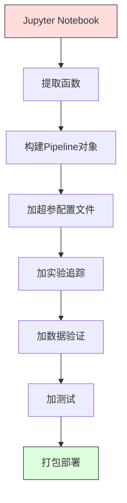

# ML流水线

> 模型不是产品。流水线是。流水线是从原始数据到部署预测的一切，每步必须可复现。

**类型:** 构建
**语言:** Python
**前置要求:** 第2阶段, 课程12 (超参数调优)
**时间:** ~120分钟

## 学习目标

- 从零构建ML流水线链接填补、缩放、编码和模型训练成单可复现对象
- 识别数据泄漏场景并解释流水线如何通过只在训练数据拟合变换器防止它们
- 构建ColumnTransformer对数值和类别特征应用不同预处理
- 实现流水线序列化并演示相同拟合流水线在训练和生产产相同结果

## 问题背景

你有个notebook加载数据、用中位数填缺失值、缩放特征、训练模型、打印精度。它工作。你发布它。

月后，有人重训练模型得不同结果。中位数在包含测试数据全数据集计算(数据泄漏)。缩放参数未保存，推理用不同统计。特征工程代码在训练和服务间复制粘贴，副本分歧。类别列在生产获新值编码从未见过。

这些非假设。它们是ML系统在生产失败最常见原因。流水线通过把每变换步打包成单有序可复现对象解所有。

## 概念讲解

### 什么是流水线

流水线是数据变换有序序列后跟模型。每步取前步输出作输入。整流水线在训练数据拟合一次。推理时，相同拟合流水线变换新数据并产预测。


流水线保证:
- 变换只在训练数据拟合(无泄漏)
- 推理时应用相同变换
- 整对象可序列化并部署作一制品
- 交叉验证每折应用流水线，防止微妙泄漏

### 数据泄漏: 隐默杀手

数据泄漏当测试集或未来数据信息污染训练。流水线防止最常见形式。

**泄漏(错):**
```python
X = df.drop("target", axis=1)
y = df["target"]

scaler = StandardScaler()
X_scaled = scaler.fit_transform(X)

X_train, X_test = X_scaled[:800], X_scaled[800:]
y_train, y_test = y[:800], y[800:]
```

缩放器见测试数据。均值和标准差含测试样本。这膨胀精度估计。

**正确:**
```python
X_train, X_test = X[:800], X[800:]

scaler = StandardScaler()
X_train_scaled = scaler.fit_transform(X_train)
X_test_scaled = scaler.transform(X_test)
```

用流水线，你不需想这。流水线自动处理。

### sklearn Pipeline

sklearn `Pipeline`链接变换器和估计器。它暴露`.fit()`, `.predict()`, 和`.score()`顺序应用所有步。

```python
from sklearn.pipeline import Pipeline
from sklearn.preprocessing import StandardScaler
from sklearn.linear_model import LogisticRegression

pipe = Pipeline([
    ("scaler", StandardScaler()),
    ("model", LogisticRegression()),
])

pipe.fit(X_train, y_train)
predictions = pipe.predict(X_test)
```

当你调`pipe.fit(X_train, y_train)`:
1. 缩放器调`fit_transform`在X_train
2. 模型调`fit`在缩放X_train

当你调`pipe.predict(X_test)`:
1. 缩放器调`transform`(非fit_transform)在X_test
2. 模型调`predict`在缩放X_test

缩放器拟合时从不见测试数据。这是整点。

### ColumnTransformer: 不同列不同流水线

真实数据集有数值和类别列需不同预处理。`ColumnTransformer`处理这。

```python
from sklearn.compose import ColumnTransformer
from sklearn.preprocessing import StandardScaler, OneHotEncoder
from sklearn.impute import SimpleImputer

numeric_pipe = Pipeline([
    ("impute", SimpleImputer(strategy="median")),
    ("scale", StandardScaler()),
])

categorical_pipe = Pipeline([
    ("impute", SimpleImputer(strategy="most_frequent")),
    ("encode", OneHotEncoder(handle_unknown="ignore")),
])

preprocessor = ColumnTransformer([
    ("num", numeric_pipe, ["age", "income", "score"]),
    ("cat", categorical_pipe, ["city", "gender", "plan"]),
])

full_pipeline = Pipeline([
    ("preprocess", preprocessor),
    ("model", GradientBoostingClassifier()),
])
```

OneHotEncoder中`handle_unknown="ignore"`对生产关键。当新类出现(模型从未见城市)，它产零向量而非崩溃。

### 实验追踪

流水线使训练可复现，但你也需追踪跨实验发生了什么: 哪超参用、哪数据集版本、什么指标、哪代码跑。

**MLflow**是最常见开源方案:

```python
import mlflow

with mlflow.start_run():
    mlflow.log_param("max_depth", 5)
    mlflow.log_param("n_estimators", 100)
    mlflow.log_param("learning_rate", 0.1)

    pipe.fit(X_train, y_train)
    accuracy = pipe.score(X_test, y_test)

    mlflow.log_metric("accuracy", accuracy)
    mlflow.sklearn.log_model(pipe, "model")
```

每次跑记录参数、指标、制品和完整模型。你可比较跑、复现任何实验、部署任何模型版本。

**Weights & Biases (wandb)**提供相同功能带托管仪表盘:

```python
import wandb

wandb.init(project="my-pipeline")
wandb.config.update({"max_depth": 5, "n_estimators": 100})

pipe.fit(X_train, y_train)
accuracy = pipe.score(X_test, y_test)

wandb.log({"accuracy": accuracy})
```

### 模型版本控制

实验追踪后，你需管理模型版本。哪模型在生产？哪是暂存？哪是上周的？

MLflow模型注册提供:
- **版本追踪:** 每保存模型得版本号
- **阶段过渡:** "Staging", "Production", "Archived"
- **批准工作流:** 模型必须显式推到生产
- **回滚:** 即刻切换回前版本

### 用DVC数据版本控制

代码用git版本。数据也应版本，但git不能处理大文件。DVC(数据版本控制)解这。

```
dvc init
dvc add data/training.csv
git add data/training.csv.dvc data/.gitignore
git commit -m "Track training data"
dvc push
```

DVC存实际数据在远程存储(S3, GCS, Azure)并在git保小`.dvc`文件记录哈希。当你检出git提交，`dvc checkout`恢复用过的精确数据。

这意味每git提交钉代码和数据。完全可复现。

### 可复现实验

可复现实验需四:

1. **固定随机种子:** 为numpy, random, 和框架(torch, sklearn)设种子
2. **钉依赖:** requirements.txt或poetry.lock带精确版本
3. **版本数据:** DVC或类似
4. **配置文件:** 所有超参在配置，非硬编码

```python
import numpy as np
import random

def set_seed(seed=42):
    random.seed(seed)
    np.random.seed(seed)
    try:
        import torch
        torch.manual_seed(seed)
        torch.cuda.manual_seed_all(seed)
        torch.backends.cudnn.deterministic = True
    except ImportError:
        pass
```

### 从Notebook到生产流水线



典型进展:

1. **Notebook探索:** 快实验、可视化、特征想法
2. **提取函数:** 移预处理、特征工程、评估到模块
3. **构建Pipeline:** 链变换成sklearn Pipeline或自定义类
4. **配置管理:** 移所有超参到YAML/JSON配置
5. **实验追踪:** 加MLflow或wandb日志
6. **数据验证:** 训练前检查模式、分布和缺失值模式
7. **测试:** 变换器单元测试，完整流水线集成测试
8. **部署:** 序列化流水线，包在API(FastAPI, Flask)，容器化

### 常见流水线错误

| 错误 | 为何坏 | 修复 |
|---------|-------------|-----|
| 分裂前全数据拟合 | 数据泄漏 | 用Pipeline带cross_val_score |
| 流水线外特征工程 | 训练vs服务不同变换 | 把所有变换放Pipeline |
| 不处理未知类别 | 新值生产崩溃 | OneHotEncoder(handle_unknown="ignore") |
| 硬编码列名 | 模式变时断 | 用配置列名列表 |
| 无数据验证 | 坏数据静默错预测 | 预测前加模式检查 |
| 训练/服务偏差 | 模型在生产见不同特征 | 一Pipeline对象用于两者 |

## 构建

`code/pipeline.py`代码从零构建完整ML流水线:

### 步骤1: 自定义变换器

```python
class CustomTransformer:
    def __init__(self):
        self.means = None
        self.stds = None

    def fit(self, X):
        self.means = np.mean(X, axis=0)
        self.stds = np.std(X, axis=0)
        self.stds[self.stds == 0] = 1.0
        return self

    def transform(self, X):
        return (X - self.means) / self.stds

    def fit_transform(self, X):
        return self.fit(X).transform(X)
```

### 步骤2: 从零流水线

```python
class PipelineFromScratch:
    def __init__(self, steps):
        self.steps = steps

    def fit(self, X, y=None):
        X_current = X.copy()
        for name, step in self.steps[:-1]:
            X_current = step.fit_transform(X_current)
        name, model = self.steps[-1]
        model.fit(X_current, y)
        return self

    def predict(self, X):
        X_current = X.copy()
        for name, step in self.steps[:-1]:
            X_current = step.transform(X_current)
        name, model = self.steps[-1]
        return model.predict(X_current)
```

### 步骤3: 流水线交叉验证

代码演示流水线交叉验证如何防止数据泄漏: 缩放器在每折训练数据单独拟合。

### 步骤4: 完整生产流水线用sklearn

完整流水线带`ColumnTransformer`、多预处理路径和模型，用正确交叉验证和实验日志训练。

## 交付成果

本课程产生:
- `outputs/prompt-ml-pipeline.md` -- 构建和调试ML流水线技能
- `code/pipeline.py` -- 从零到sklearn完整流水线

## 练习题

1. 构建处理带3数值列和2类别列数据集流水线。用`ColumnTransformer`对数值应用中位数填补+缩放和对类别应用最频繁填补+one-hot编码。用5折交叉验证训练。

2. 故意引入数据泄漏: 分裂前全数据集拟合缩放器。比较交叉验证分数(泄漏)到流水线交叉验证分数(清洁)。差多大？

3. 用`joblib.dump`序列化流水线。在单独脚本加载并跑预测。验证预测相同。

4. 加自定义变换器到流水线为两最重要数值列创建多项式特征(2阶)。它应放流水线哪？

5. 为流水线设MLflow追踪。用不同超参跑5实验。用MLflow UI(`mlflow ui`)比较跑并挑最佳模型。

## 关键术语

| 术语 | 人们怎么说 | 实际含义 |
|------|----------------|----------------------|
| 流水线 | "变换+模型链" | 有序拟合变换器和模型序列，作一单元应用防泄漏 |
| 数据泄漏 | "测试信息漏到训练" | 用训练集外信息建模型，膨胀性能估计 |
| ColumnTransformer | "每列不同预处理" | 对不同列子集应用不同流水线，组合结果 |
| 实验追踪 | "日志你跑" | 为每次训练跑记录参数、指标、制品和代码版本 |
| MLflow | "追踪和部署模型" | 实验追踪、模型注册和部署开源平台 |
| DVC | "数据git" | 大数据文件版本控制系统，在git存哈希在远程存数据 |
| 模型注册 | "模型版本目录" | 追踪模型版本带阶段标签(暂存, 生产, 归档)系统 |
| 训练/服务偏差 | "notebook里工作" | 训练时vs推理时数据处理差异，导静默错误 |
| 可复现性 | "同代码同结果" | 从同代码、数据和配置得相同结果能力 |

## 延伸阅读

- [scikit-learn Pipeline docs](https://scikit-learn.org/stable/modules/compose.html) -- 官方流水线参考
- [MLflow documentation](https://mlflow.org/docs/latest/index.html) -- 实验追踪和模型注册
- [DVC documentation](https://dvc.org/doc) -- 数据版本控制
- [Sculley et al., Hidden Technical Debt in Machine Learning Systems (2015)](https://papers.nips.cc/paper/2015/hash/86df7dcfd896fcaf2674f757a2463eba-Abstract.html) -- ML系统复杂性奠基论文
- [Google ML Best Practices: Rules of ML](https://developers.google.com/machine-learning/guides/rules-of-ml) -- 实用生产ML建议