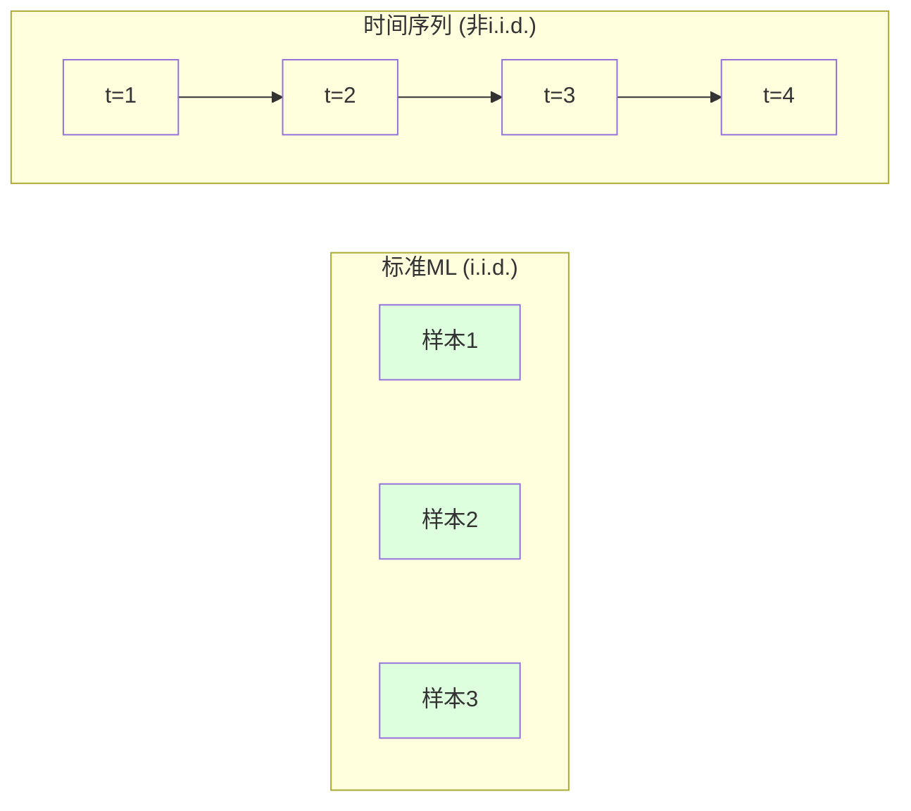
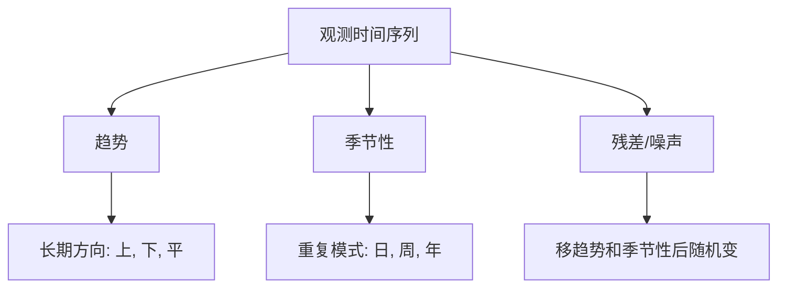
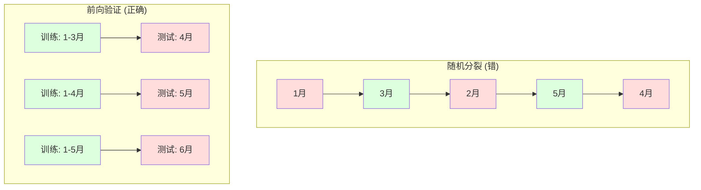

# 时间序列基础

> 过去表现确实预测未来结果 -- 如果你先检查平稳性。

**类型:** 构建
**语言:** Python
**前置要求:** 第2阶段, 课程01-09
**时间:** ~90分钟

## 学习目标

- 分解时间序列成趋势、季节性和残差成分并测试平稳性
- 实现滞后特征和滚动统计把时间序列转成监督学习问题
- 构建前向验证框架防未来数据泄漏进训练
- 解释为何随机训练/测试分裂时间序列无效并演示性能差距vs正确时间分裂

## 问题背景

你有时间排序数据。每日销售，每时温度，每分CPU使用，每周股价。你想预测下值，下周，下季度。

你伸手标准ML工具箱: 随机训练/测试分裂，交叉验证，特征矩阵进，预测出。每步都错。

时间序列打破标准ML依赖假设。样本非独立 -- 今天温度依赖昨天。随机分裂漏未来信息到过去。回测看好特征在生产失败因它们依赖随时间移模式。

随机交叉验证得95%精度模型可能正确时间评估得55%。差非技术细节。它是纸上工作和生产工作模型区别。

本课程覆盖基础: 时间数据何不同，如何诚评估模型，如何把时间序列转成标准ML模型可消费特征。

## 概念讲解

### 时间序列何不同

标准ML假设i.i.d. -- 独立同分布。每样本从同分布抽，独立其他样本。时间序列违反两者:

- **非独立。** 今天股价依赖昨天。本周销售与上周相关。
- **非同分布。** 分布随时间移。12月销售看异于3月。

这些违规非小。它们改你如何建特征、如何评估模型、哪些算法工作。



标准ML，样本可换。打乱它们改无。时间序列，顺序一切。打乱毁信号。

### 时间序列成分

每时间序列组合:



- **趋势**: 长期方向。收入年增10%。全球温度升。
- **季节性**: 定间隔重复模式。零售销售12月尖峰。空调使用7月峰。
- **残差**: 移趋势和季节性后余。如果残差像白噪声，分解捕获信号。

### 平稳性

时间序列平稳如果其统计性质(均值、方差、自相关)不随时间变。多数预测方法假设平稳。

**为何重要:** 非平稳序列均值漂移。1月数据训练模型学与2月将示不同均值。它将系统错。

**如何检查:** 计窗口上滚动均值和滚动标准差。如果它们漂移，序列非平稳。

**如何修复:** 差分。非建模原始值，建模连续值间变化:

```
diff[t] = value[t] - value[t-1]
```

如果一轮差分不使序列平稳，再应用(二阶差分)。多数真实世界序列至多需两轮。

**例:**

原始序列: [100, 102, 106, 112, 120]
一阶差分:  [2, 4, 6, 8] (仍向上趋势)
二阶差分:  [2, 2, 2] (常 -- 平稳)

原始序列有二次趋势。一阶差分转它成线性趋势。二阶差分使它平。实践，你罕见需超两轮。

**正式测试:** Augmented Dickey-Fuller (ADF)测试是平稳性标准统计测试。零假设是"序列非平稳"。p值低于0.05意味你可拒零并结论平稳。我们不从零实现ADF(它需渐近分布表)，但代码中滚动统计方法给实用视觉检查。

### 自相关

自相关测时间t值与时间t-k值(k步前)相关多少。自相关函数(ACF)绘每滞后k这相关。

**ACF告诉你:**
- 序列回记多远。如果ACF滞后5后降零，多于5步前值无关。
- 季节性是否存在。如果ACF滞后12尖峰(月数据)，有年季节性。
- 创建多少滞后特征。用ACF变微不足道滞后。

**PACF(偏自相关函数)**移间接相关。如果今天与3天前相关只因两者都与昨天相关，PACF滞后3将为零而ACF滞后3不。

### 滞后特征: 把时间序列转成监督学习

标准ML模型需特征矩阵X和目标y。时间序列给你单列值。桥是滞后特征。

取序列[10, 12, 14, 13, 15]创建滞后1和滞后2特征:

| lag_2 | lag_1 | target |
|-------|-------|--------|
| 10    | 12    | 14     |
| 12    | 14    | 13     |
| 14    | 13    | 15     |

现在你有标准回归问题。任何ML模型(线性回归, 随机森林, 梯度提升)可从滞后预测目标。

你可工程额外特征:
- **滚动统计:** 过去k值均值、标准差、最小、最大
- **日历特征:** 星期几、月、是否假期、是否周末
- **差分值:** 前步变化
- **扩展统计:** 累计均值、累计总和
- **比率特征:** 当前值/滚动均值(离近期平均多远)
- **交互特征:** lag_1 * day_of_week(工作日效应动量)

**多少滞后？** 用自相关函数。如果ACF显著到滞后10，用至少10滞后。如果有周季节性，包含滞后7(可能14)。更多滞后给模型更多历史但也更多特征拟合，增过拟合风险。

**目标对齐陷阱。** 创建滞后特征时，目标须是时间t值，所有特征须用时间t-1或更早值。如果你意外包含时间t值作特征，你有完美预测器 -- 和完全无用模型。这是时间序列特征工程最常见bug。

### 前向验证

这是本课最重要概念。标准k折交叉验证随机分配样本到训练和测试。时间序列，这漏未来信息。



前向验证:
1. 训练数据到时间t
2. 预测时间t+1(或多步t+1到t+k)
3. 滑窗口前
4. 重复

每测试折只含所有训练数据后数据。无未来泄漏。这给你部署时模型性能诚实估计。

**扩展窗口**用所有历史训练(窗口长)。**滑动窗口**用固定大小训练窗口(窗口滑)。当你相信旧数据仍相关用扩展。当世界变旧数据伤用滑动。

### ARIMA直觉

ARIMA是经典时间序列模型。它有三成分:

- **AR(自回归):** 从过去值预测。AR(p)用过去p值。
- **I(积分):** 差分达平稳。I(d)应用d轮差分。
- **MA(移动平均):** 从过去预测误差预测。MA(q)用过去q误差。

ARIMA(p, d, q)组合三者。你基于ACF/PACF分析或自动搜索(auto-ARIMA)选p, d, q。

我们不从零实现ARIMA -- 它需超本课范围数值优化。关键洞是理解每成分做何所以你可解释ARIMA结果知何时用它。

### 何时用什么

| 方法 | 最佳用 | 处理季节性 | 处理外部特征 |
|----------|---------|-------------------|------------------------|
| 滞后特征 + ML | 带多外部特征表格 | 用日历特征 | 是 |
| ARIMA | 单变量序列，短期 | SARIMA变体 | 否(ARIMAX受限) |
| 指数平滑 | 简单趋势 + 季节性 | 是(Holt-Winters) | 否 |
| Prophet | 商业预测，假期 | 是(Fourier项) | 受限 |
| 神经网络(LSTM, Transformer) | 长序列，多序列 | 学习 | 是 |

对多数实际问题，滞后特征 + 梯度提升是最强起点。它自然处理外部特征，不需平稳性，易调试。

### 预测视野和策略

单步预测一步前。多步预测多步。有三策略:

**递归(迭代):** 预测一步前，用预测作下步输入。简单但误差累积 -- 每预测用前预测，所以错复利。

**直接:** 每视野训练单独模型。模型1预测t+1，模型5预测t+5。无误差累积，但每模型更少训练样本且它们不共享信息。

**多输出:** 训练一模型同时输出所有视野。跨视野共享信息但需支持多输出模型(或自定义损失函数)。

对多数实际问题，短视野(1-5步)从递归开始，长视野用直接。

### 时间序列常见错误

| 错误 | 为何发生 | 如何修复 |
|---------|---------------|-----------|
| 随机训练/测试分裂 | 标准ML习惯 | 用前向或时间分裂 |
| 用未来特征 | 时间t特征意外包含 | 审每特征时间对齐 |
| 过拟合季节性 | 模型记忆日历模式 | 测试集保持完整季节周期 |
| 忽略尺度变 | 收入翻倍但模式保持 | 模型百分比变化非绝对 |
| 太多滞后特征 | "更多历史更好" | 用ACF定相关滞后 |
| 不差分 | "模型会搞定" | 树模型处理趋势；线性模型需平稳性 |

## 构建

`code/time_series.py`代码从零实现核心构建块。

### 滞后特征创建器

```python
def make_lag_features(series, n_lags):
    n = len(series)
    X = np.full((n, n_lags), np.nan)
    for lag in range(1, n_lags + 1):
        X[lag:, lag - 1] = series[:-lag]
    valid = ~np.isnan(X).any(axis=1)
    return X[valid], series[valid]
```

这把1D序列转成特征矩阵，每行有过去`n_lags`值作特征，当前值作目标。

### 前向交叉验证

```python
def walk_forward_split(n_samples, n_splits=5, min_train=50):
    assert min_train < n_samples, "min_train must be less than n_samples"
    step = max(1, (n_samples - min_train) // n_splits)
    for i in range(n_splits):
        train_end = min_train + i * step
        test_end = min(train_end + step, n_samples)
        if train_end >= n_samples:
            break
        yield slice(0, train_end), slice(train_end, test_end)
```

每分裂确保训练数据严格在测试数据前。训练窗口每折扩展。

### 简单自回归模型

纯AR模型只是滞后特征线性回归:

```python
class SimpleAR:
    def __init__(self, n_lags=5):
        self.n_lags = n_lags
        self.weights = None
        self.bias = None

    def fit(self, series):
        X, y = make_lag_features(series, self.n_lags)
        # 解正规方程
        X_b = np.column_stack([np.ones(len(X)), X])
        theta = np.linalg.lstsq(X_b, y, rcond=None)[0]
        self.bias = theta[0]
        self.weights = theta[1:]
        return self
```

这概念上同课程02线性回归，但应用到同变量时间滞后版本。

### 平稳性检查

代码计滚动统计视觉和数值评估平稳性:

```python
def check_stationarity(series, window=50):
    rolling_mean = np.array([
        series[max(0, i - window):i].mean()
        for i in range(1, len(series) + 1)
    ])
    rolling_std = np.array([
        series[max(0, i - window):i].std()
        for i in range(1, len(series) + 1)
    ])
    return rolling_mean, rolling_std
```

如果滚动均值漂移或滚动标准差变，序列非平稳。应用差分再检查。

代码也通过比较序列前半后半检查平稳性。如果均值差超半标准差或方差比超2倍，序列标记非平稳。

### 自相关

```python
def autocorrelation(series, max_lag=20):
    n = len(series)
    mean = series.mean()
    var = series.var()
    acf = np.zeros(max_lag + 1)
    for k in range(max_lag + 1):
        cov = np.mean((series[:n-k] - mean) * (series[k:] - mean))
        acf[k] = cov / var if var > 0 else 0
    return acf
```

## 使用

用sklearn，你直接用滞后特征与任何回归器:

```python
from sklearn.linear_model import Ridge
from sklearn.ensemble import GradientBoostingRegressor

X, y = make_lag_features(series, n_lags=10)

for train_idx, test_idx in walk_forward_split(len(X)):
    model = Ridge(alpha=1.0)
    model.fit(X[train_idx], y[train_idx])
    predictions = model.predict(X[test_idx])
```

ARIMA，用statsmodels:

```python
from statsmodels.tsa.arima.model import ARIMA

model = ARIMA(train_series, order=(5, 1, 2))
fitted = model.fit()
forecast = fitted.forecast(steps=30)
```

`time_series.py`代码演示两种方法并比较用前向验证。

### sklearn TimeSeriesSplit

sklearn提供`TimeSeriesSplit`实现前向验证:

```python
from sklearn.model_selection import TimeSeriesSplit

tscv = TimeSeriesSplit(n_splits=5)
for train_index, test_index in tscv.split(X):
    X_train, X_test = X[train_index], X[test_index]
    y_train, y_test = y[train_index], y[test_index]
    model.fit(X_train, y_train)
    score = model.score(X_test, y_test)
```

这等价我们从零`walk_forward_split`但集成sklearn交叉验证框架。你可用`cross_val_score`:

```python
from sklearn.model_selection import cross_val_score

scores = cross_val_score(model, X, y, cv=TimeSeriesSplit(n_splits=5))
print(f"Mean score: {scores.mean():.4f} +/- {scores.std():.4f}")
```

### 评估指标

时间序列预测用回归指标，但带时间感知上下文:

- **MAE(平均绝对误差):** |y_true - y_pred|平均。原始单位易解读。"平均预测差3.2度。"
- **RMSE(均方根误差):** 均方误差平方根。比MAE更罚大误差。大误差比多小误差更坏时用。
- **MAPE(平均绝对百分比误差):** |error / true_value| * 100平均。尺度无关，跨不同序列比较有用。但当真实值零未定义。
- **朴素基线比较:** 总与简单基线比较。季节朴素基线预测一周期前值(昨天, 上周)。如果你模型不能胜朴素，某东西错。

### 滚动特征

代码演示加滚动统计(7和14天窗口均值、标准差、最小、最大)到滞后特征。这些给模型关于近期趋势和波动信息滞后特征单独不捕获。

例如，如果滚动均值升，它暗示向上趋势。如果滚动标准差增，它暗示增长波动。这些是树基模型可学但线性模型不能模式类。

## 交付成果

本课程产生:
- `outputs/prompt-time-series-advisor.md` -- 框架时间序列问题提示词
- `code/time_series.py` -- 滞后特征、前向验证、AR模型、平稳性检查

### 你必须胜基线

构建任何模型前，建基线:

1. **最后值(持续)。** 预测明天将同今天。对多序列，这惊人难胜。
2. **季节朴素。** 预测今天将同上周同天(或去年同天)。如果你模型不能胜这，它未学任何有用模式超季节性。
3. **移动平均。** 预测过去k值平均。平滑噪声但不能捕获突变。

如果你花哨ML模型输给季节朴素基线，你有bug。最常见: 特征未来泄漏，错评估方法，或序列真随机不可预测。

### 实用提示

1. **从绘开始。** 任何建模前，绘原始序列。找趋势、季节性、异常值、结构断(行为突变)。30秒视觉检查常告你比一小时自动分析更多。

2. **先差分，后建模。** 如果序列有清晰趋势，创建滞后特征前差分它。树基模型可处理趋势，但线性模型不能，差分从不伤。

3. **保持至少一完整季节周期。** 如果你有周季节性，测试集需至少一周。如果月，至少一月。否则你不能评估模型是否捕获季节模式。

4. **生产监控。** 时间序列模型随时间退化因世界变。滚动基础追踪预测误差。当误差开始增，在近数据重训练模型。

5. **警惕制度变。** 前疫情数据训练模型不预测后疫情行为。包含已知制度变指示器作特征，或用滑窗口忘旧数据。

6. **Log变换偏序列。** 收入、价格和计数常右偏。取log稳定方差并使乘法模式加法，线性模型可处理。Log空间预测，然后指数回到原始单位。

## 练习题

1. **平稳性实验。** 生成带线性趋势序列。用滚动统计检查平稳性。应用一阶差分。再检查。二次趋势需几轮差分？

2. **滞后选择。** 季节序列(周期=7)上算ACF。哪些滞后有最高自相关？仅用那些滞后(非连续滞后)创建滞后特征。精度比用滞后1到7改善吗？

3. **前向vs随机分裂。** 滞后特征上训练Ridge回归。用随机80/20分裂和前向验证评估。随机分裂高估性能多少？

4. **特征工程。** 加滚动均值(窗口=7)，滚动标准差(窗口=7)，和星期几特征到滞后特征。用前向验证比较有和无这些额外精度。

5. **多步预测。** 改AR模型预测5步前替代1。比较两策略: (a) 预测一步，用预测作下步输入(递归)，和(b) 每视野训练单独模型(直接)。哪个更精确？

## 关键术语

| 术语 | 人们怎么说 | 实际含义 |
|------|----------------|----------------------|
| 平稳性 | "统计不随时间变" | 均值、方差和自相关结构随时间常数序列 |
| 差分 | "减连续值" | 计算y[t] - y[t-1]移趋势达平稳性 |
| 自相关(ACF) | "序列如何与自己相关" | 时间序列与其滞后拷贝间相关，作为滞后函数 |
| 偏自相关(PACF) | "仅直接相关" | 移所有短滞后效应后滞后k自相关 |
| 滞后特征 | "过去值作输入" | 用y[t-1], y[t-2], ..., y[t-k]作特征预测y[t] |
| 前向验证 | "时间尊重交叉验证" | 训练数据总时间前于测试数据评估 |
| ARIMA | "经典时间序列模型" | 自回归积分移动平均: 组合过去值(AR)、差分(I)和过去误差(MA) |
| 季节性 | "重复日历模式" | 时间序列绑定日历周期(日、周、年)规则可预测周期 |
| 趋势 | "长期方向" | 时间序列水平随时间持续增或减 |
| 扩展窗口 | "用所有历史" | 训练集随每折长的前向验证 |
| 滑动窗口 | "固定大小历史" | 训练集是前滑固定长窗口的前向验证 |

## 延伸阅读

- [Hyndman and Athanasopoulos, Forecasting: Principles and Practice (3rd ed.)](https://otexts.com/fpp3/) -- 时间序列预测最佳免费教科书
- [scikit-learn Time Series Split](https://scikit-learn.org/stable/modules/generated/sklearn.model_selection.TimeSeriesSplit.html) -- sklearn前向分裂器
- [statsmodels ARIMA docs](https://www.statsmodels.org/stable/generated/statsmodels.tsa.arima.model.ARIMA.html) -- ARIMA实现带诊断
- [Makridakis et al., The M5 Competition (2022)](https://www.sciencedirect.com/science/article/pii/S0169207021001874) -- 大规模预测竞赛示ML方法vs统计方法