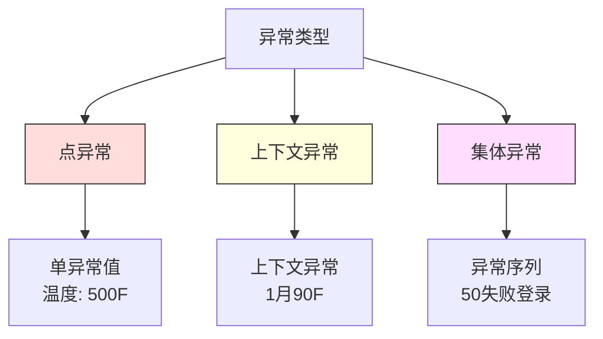
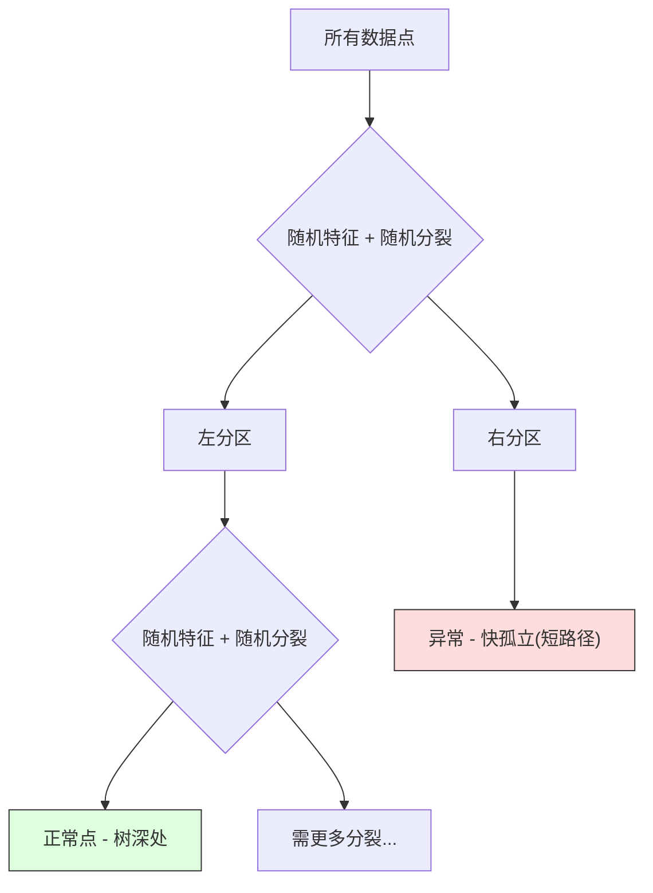

# 异常检测

> 正常易定义。异常是不适合的东西。

**类型:** 构建
**语言:** Python
**前置要求:** 第2阶段, 课程01-09
**时间:** ~75分钟

## 学习目标

- 从零实现Z分数、IQR和孤立森林异常检测方法
- 区分点、上下文和集体异常并为每选适当检测方法
- 解释为何异常检测框架为建模正常数据而非分类异常
- 比较无监督异常检测与监督分类并评估新异常覆盖与精度权衡

## 问题背景

信用卡2pm在纽约用，然后2:05pm在东京用。工厂传感器读150度当正常范围80-120。服务器每秒发50,000请求当日均200。

这些是异常。找它们重要。欺诈费数十亿。设备故障费停机。网络入侵费数据。

挑战: 你罕见有异常标签例。欺诈占0.1%交易。设备故障每年几次。你不能训练标准分类器因"异常"类几乎无东西学。即使你有些标签，你见过异常非你将遇唯一类型。明日欺诈方案异于今日。

异常检测翻转问题。非学什么是异常，学什么是正常。任何偏离正常可疑。这无标签工作，适应新异常类型，扩到大数据集。

## 概念讲解

### 异常类型

非所有异常相同:

- **点异常。** 单数据点不管上下文异常。温度读500度。账户交易$50,000当通常花$50。
- **上下文异常。** 给定上下文异常数据点。90度温度夏季正常，冬季异常。同值，不同上下文。
- **集体异常。** 数据点序列组异常，即使每单独点可能正常。五登录失败正常。连续五十是暴力攻击。

多数方法检测点异常。上下文异常需时间或位置特征。集体异常需序列感知方法。



### 无监督框架

标准分类，你有两类标签。异常检测，你典型有三种情况之一:

1. **全无监督。** 无标签。你在所有数据拟合检测器并希望异常够罕见不腐"正常"模型。
2. **半监督。** 你有仅正常数据干净数据集。你在这干净集拟合并评分其他一切。这可能时最强设置。
3. **弱监督。** 你有少数标签异常。用它们评估，非训练。训练无监督，然后在标签子集测精度/召回。

关键洞: 异常检测根本异于分类。你建模正常数据分布，非两类间决策边界。

### 监督vs无监督: 权衡

如果你有标签异常，你应该用它们训练(监督分类)或仅评估(无监督检测)？

**监督(作分类处理):**
- 捕获你之前见过确异常类型
- 已知异常类型高精度
- 完全错过新异常类型
- 新异常类型出现需重训练
- 需够异常例(常太少)

**无监督(建模正常，标记偏离):**
- 捕获任何偏离正常，包含新类型
- 不需标签异常
- 更高假正率(非每异常坏)
- 更抗分布移

实践，最佳系统组合两者: 无监督检测宽覆盖，监督模型已知高优先异常类型，和人审查模糊情况。

### Z分数方法

最简单方法。计每特征均值和标准差。标记任何点距均值超k标准差。

```text
z_score = (x - mean) / std
anomaly if |z_score| > threshold
```

默认阈值3.0(99.7%正常数据在3标准差内对高斯分布)。

**优势:** 简单。快。可解释("这值距正常4.5标准差")。

**劣势:** 假设数据正态分布。敏感训练数据异常值(异常值移均值和胀标准差，使它们更难检测)。多模态分布失败。

**何时工作好:** 单特征监控数据粗略钟形。服务器响应时间，制造公差，带稳定基线传感器读。

**何时失败:** 多簇数据(两办公位置不同基线温度)，偏数据(交易金额$1000罕见但非异常)，训练集有异常值数据。

### IQR方法

比Z分数更鲁棒。用四分位距替代均值和标准差。

```
Q1 = 25百分位
Q3 = 75百分位
IQR = Q3 - Q1
lower_bound = Q1 - factor * IQR
upper_bound = Q3 + factor * IQR
anomaly if x < lower_bound or x > upper_bound
```

默认因子1.5。

**优势:** 对异常值鲁棒(百分位不受极端值影响)。偏分布工作。无正态假设。

**劣势:** 仅单变量(独立每特征应用)。不能检测仅特征一起考虑异常(点可能每特征单独正常但联合空间异常)。

**实用注:** IQR中1.5因子对应箱线图须。须外点是潜在异常值。用3.0替代1.5使检测器更保守(少标记，少假正)。右因子依赖你对假警报容忍。

### 孤立森林

关键洞: 异常少且不同。数据随机划分，异常更易孤立 -- 它们需更少随机分裂与余分离。



**如何工作:**
1. 建多随机树(孤立森林)
2. 每节点，挑随机特征和特征最小最大间随机分裂值
3. 继分裂直到每点孤立(在自己叶)
4. 异常有跨所有树更短平均路径长

**为何工作:** 正常点住密集区。多随机分裂需把它们一个与邻居隔离。异常住稀疏区。一或两随机分裂够孤立它们。

异常分数基于跨所有树平均路径长，由随机二叉搜索树期望路径长归一化:

```
score(x) = 2^(-average_path_length(x) / c(n))
```

其中`c(n)`是n样本期望路径长。分数近1意味异常。分数近0.5意味正常。分数近0意味非常正常(深在密簇)。

**优势:** 无分布假设。高维工作。扩好(样本大小亚线性因每树用子样本)。处理混合特征类型。

**劣势:** 密集区异常挣扎(遮蔽效应)。多特征无关时随机分裂效减。

**关键超参:**
- `n_estimators`: 树数。100通常够。更多树给更稳定分数但更慢计算。
- `max_samples`: 每树样本数。256是原论文默认。更小值使个别树不准但增多样性。子采样是使孤立森林快原因 -- 每树见数据小分数。
- `contamination`: 期望异常比例。仅用于设阈值。不影响分数本身。

### 局部异常因子(LOF)

LOF比较点周局部密度与邻居密度。稀疏区被密集区围点异常。

**如何工作:**
1. 每点，找其k最近邻
2. 计局部可达密度(邻多密)
3. 每点密度比其邻居密度
4. 如果点密度比邻居低多，它是异常值

**LOF分数:**
- LOF近1.0意味与邻居类似密度(正常)
- LOF大于1.0意味比邻居更低密度(潜在异常)
- LOF远大于1.0(如2.0+)意味显著更低密度(可能异常)

"局部"部分关键。考虑带两簇数据集: 1000点密簇和50点稀簇。稀簇边点非全局异常 -- 它有50邻居。但它局部异常如果它直接邻居比它更密。LOF捕获全局方法错过这细微。

**优势:** 检测局部异常(在邻域异常点，即使非全局异常)。不同密度簇工作。

**劣势:** 大数据集慢(O(n^2)朴素实现)。敏感k选择。极高维工作差(维度诅咒影响距离计算)。

### 比较

| 方法 | 假设 | 速度 | 处理高维 | 检测局部异常 |
|--------|------------|-------|-------------------|------------------------|
| Z分数 | 正态分布 | 极快 | 是(每特征) | 否 |
| IQR | 无(每特征) | 极快 | 是(每特征) | 否 |
| 孤立森林 | 无 | 快 | 是 | 部分 |
| LOF | 距离有意义 | 慢 | 差 | 是 |

### 评估挑战

评估异常检测器比评估分类器难:

- **极类不平衡。** 0.1%异常，总预测"正常"给99.9%精度。精度无用。
- **AUROC误导。** 重不平衡，AUROC可看好即使模型在实用阈值错过多数异常。
- **更好指标:** Precision@k(前k标记项中，多少真异常)，AUPRC(精度召回曲线下面积)，和固定假正率召回。


### 异常检测流水线

实践，异常检测遵循这工作流:

1. **收集基线数据。** 理想，你知道无(或很少)异常期间。
2. **特征工程。** 原始特征加导出特征(滚动统计，时间特征，比率)。
3. **训练检测器。** 在基线数据拟合。模型学"正常"样子。
4. **评分新数据。** 每新观测得异常分数。
5. **阈值选择。** 选分数截止。这是商业决策: 更高阈值意味更少假警报但更多错过异常。
6. **警报和调查。** 标记点去人审查或自动响应。
7. **反馈收集。** 记录标记项是否真异常或假警报。用这数据随时间评估检测器和调阈值。

流水线从非"完成"。数据分布移，新异常类型出现，阈值需调。把异常检测作活系统，非一次性模型。

## 构建

`code/anomaly_detection.py`代码从零实现Z分数、IQR和孤立森林。

### Z分数检测器

```python
def zscore_detect(X, threshold=3.0):
    mean = X.mean(axis=0)
    std = X.std(axis=0)
    std[std == 0] = 1.0
    z = np.abs((X - mean) / std)
    return z.max(axis=1) > threshold
```

简单向量化。标记点如果任何特征超阈值。

### IQR检测器

```python
def iqr_detect(X, factor=1.5):
    q1 = np.percentile(X, 25, axis=0)
    q3 = np.percentile(X, 75, axis=0)
    iqr = q3 - q1
    iqr[iqr == 0] = 1.0
    lower = q1 - factor * iqr
    upper = q3 + factor * iqr
    outside = (X < lower) | (X > upper)
    return outside.any(axis=1)
```

### 从零孤立森林

从零实现建随机划分特征空间孤立树:

```python
class IsolationTree:
    def __init__(self, max_depth):
        self.max_depth = max_depth

    def fit(self, X, depth=0):
        n, p = X.shape
        if depth >= self.max_depth or n <= 1:
            self.is_leaf = True
            self.size = n
            return self
        self.is_leaf = False
        self.feature = np.random.randint(p)
        x_min = X[:, self.feature].min()
        x_max = X[:, self.feature].max()
        if x_min == x_max:
            self.is_leaf = True
            self.size = n
            return self
        self.threshold = np.random.uniform(x_min, x_max)
        left_mask = X[:, self.feature] < self.threshold
        self.left = IsolationTree(self.max_depth).fit(X[left_mask], depth + 1)
        self.right = IsolationTree(self.max_depth).fit(X[~left_mask], depth + 1)
        return self
```

孤立点路径长定其异常分数。更短路径意味更异常。

`IsolationForest`类包多树:

```python
class IsolationForest:
    def __init__(self, n_estimators=100, max_samples=256, seed=42):
        self.n_estimators = n_estimators
        self.max_samples = max_samples

    def fit(self, X):
        sample_size = min(self.max_samples, X.shape[0])
        max_depth = int(np.ceil(np.log2(sample_size)))
        for _ in range(self.n_estimators):
            idx = rng.choice(X.shape[0], size=sample_size, replace=False)
            tree = IsolationTree(max_depth=max_depth)
            tree.fit(X[idx])
            self.trees.append(tree)

    def anomaly_score(self, X):
        avg_path = 跨所有树平均路径长
        scores = 2.0 ** (-avg_path / c(max_samples))
        return scores
```

归一化因子`c(n)`是带n元素二叉搜索树不成功搜索期望路径长。它等`2 * H(n-1) - 2*(n-1)/n`其中`H`是调和数。这归一化确保分数跨不同大小数据集可比。

### 演示场景

代码生成多测试场景:

1. **单簇带异常值。** 2D高斯簇注入远离中心异常。所有方法应工作。
2. **多模态数据。** 三不同大小密度簇。簇间点异常。Z分数挣扎因每特征范围宽。
3. **高维数据。** 50特征，但异常仅在5不同。测试方法是否能在特征子集找异常。

每演示比较所有方法用精度、召回、F1和Precision@k。

## 使用

用sklearn(用库实现，非从零):

```python
from sklearn.ensemble import IsolationForest
from sklearn.neighbors import LocalOutlierFactor

iso = IsolationForest(n_estimators=100, contamination=0.05, random_state=42)
iso.fit(X_train)
predictions = iso.predict(X_test)

lof = LocalOutlierFactor(n_neighbors=20, contamination=0.05, novelty=True)
lof.fit(X_train)
predictions = lof.predict(X_test)
```

注意`contamination`设期望异常比例。正确设重要 -- 太低错过异常，太高创假警报。

`anomaly_detection.py`代码比较从零实现与sklearn在同数据。

### sklearn Contamination参数

sklearn中`contamination`参数定把连续异常分数转二元预测阈值。它不改底层分数。

```python
iso_5 = IsolationForest(contamination=0.05)
iso_10 = IsolationForest(contamination=0.10)
```

两者产同异常分数。但`iso_5`标记前5%而`iso_10`标记前10%。如果你不知真实异常率(你通常不知)，设contamination为"auto"并直接用原始分数。基于假正假负成本权衡设你自己阈值。

### 一类SVM

另一值得知无监督异常检测器。一类SVM在高维特征空间拟合正常数据边界(用核技巧)。

```python
from sklearn.svm import OneClassSVM

oc_svm = OneClassSVM(kernel="rbf", gamma="auto", nu=0.05)
oc_svm.fit(X_train)
predictions = oc_svm.predict(X_test)
```

`nu`参数近似异常比例。一类SVM中小数据集工作好但不扩到极大数据(核矩阵二次长)。

### 自编码器方法(预览)

自编码器是神经网络学压缩和重构数据。在正常数据训练。测试时，异常有高重构误差因网络仅学重构正常模式。

这覆盖在阶段3(深度学习)，但原则相同: 建模正常，标记偏离。

### 集成异常检测

正如集成方法改善分类(课程11)，组合多异常检测器改善检测。最简单方法:

1. 跑多检测器(Z分数, IQR, 孤立森林, LOF)
2. 归一化每检测器分数到[0, 1]
3. 平均归一化分数
4. 标记平均分数超阈值点

这减假正因不同方法有不同失败模式。四种方法都标记点几乎定异常。仅一种标记点可能是该方法怪癖。

更复杂集成估计每检测器可靠性(在带已知异常验证集测，如果可用)加权。

### 生产考虑

1. **阈值漂移。** 随数据分布移，固定阈值过时。监控异常分数分布并定期调。
2. **警报疲劳。** 太多假警报和操作员停注意。从高阈值开始(更少，更可靠警报)并在信任建时降。
3. **集成方法。** 生产，组合多检测器。仅当多方法同意异常时标记点。这显著减假正。
4. **特征工程。** 原始特征罕见够。加滚动统计，比率，时间-上次事件，和域特定特征。好特征集比检测器选择更重要。
5. **反馈环。** 当操作员调查标记项并确认或驳回，反馈进系统。随时间积累标签数据评估和改善检测器。

## 交付成果

本课程产生:
- `outputs/skill-anomaly-detector.md` -- 选对检测器决策技能
- `code/anomaly_detection.py` -- 从零Z分数, IQR, 和孤立森林，带sklearn比较

### 选择阈值

异常分数连续。你需要阈值作二元决策。这是商业决策，非技术决策。

考虑两场景:
- **欺诈检测。** 错过欺诈昂贵(退款，顾客信任)。假警报费人分析员5分钟调查。设阈值低捕获更多欺诈，接受更多假警报。
- **设备维护。** 假警报意味不必要停机费$50,000。错过故障意味$500,000维修。设阈值平衡这些成本。

两种，最优阈值依赖假正假负间成本比。绘不同阈值精度召回，叠加成本函数，挑最小成本点。

### 扩到生产

生产实时异常检测:

1. **批训练，在线评分。** 在近正常数据定期(日，周)训练模型。每新观测到达评分。
2. **特征计算须匹配。** 如果你用30天滚动统计训练，你需30天历史为新观测计算特征。缓冲所需历史。
3. **分数分布监控。** 随时间追踪异常分数分布。如果中位数分数向上漂移，要么数据变要么模型陈。
4. **可解释性。** 当你标记异常，说为何。Z分数: "特征X距正常4.2标准差以上。" 孤立森林: "这点平均3.1分裂孤立(正常点取8.5)。"

## 练习题

1. **阈值调。** 用阈值从1.0到5.0步0.5跑Z分数检测器。绘每阈值精度召回。你数据甜蜜点在哪？

2. **多变量异常。** 创建2D数据每特征单独看正常，但组合异常(如，点远主簇对角)。示Z分数每特征错过这些但孤立森林捕获它们。

3. **从零LOF。** 用k近邻实现局部异常因子。在同数据与sklearn LocalOutlierFactor比较。用k=10和k=50 -- k选择如何影响结果？

4. **流异常检测。** 改Z分数检测器工作在流设置: 新点到达时更新运行均值和方差(Welford在线算法)。在同数据与批Z分数比较。

5. **真实世界评估。** 取带已知异常数据集(Kaggle信用卡欺诈，例)。用precision@100, precision@500, 和AUPRC评估所有四方法。哪方法工作最好？为何？

## 关键术语

| 术语 | 人们怎么说 | 实际含义 |
|------|----------------|----------------------|
| 异常 | "异常值，异常点" | 显著偏离正常数据期望模式数据点 |
| 点异常 | "单怪值" | 不管上下文异常单独观测 |
| 上下文异常 | "正常值，错上下文" | 给定上下文(时间，位置等)异常但可能在另一上下文正常观测 |
| 孤立森林 | "随机分裂找异常值" | 随机树集成比正常点用更少分裂孤立异常 |
| 局部异常因子 | "比较密度与邻居" | 标记局部密度比邻居密度低多点方法 |
| Z分数 | "距均值标准差" | (x - mean) / std，测点距中心标准差单位多远 |
| IQR | "四分位距" | Q3 - Q1，测中间50%数据散布，用于鲁棒异常值检测 |
| Contamination | "期望异常比例" | 告检测器数据应标记异常比例超参 |
| Precision@k | "前k标记中，多少真" | 仅在最可疑k点计精度，对不平衡异常检测有用 |
| AUPRC | "精度召回曲线下面积" | 汇总跨所有阈值精度召回性能指标，不平衡数据比AUROC更好 |

## 延伸阅读

- [Liu et al., Isolation Forest (2008)](https://cs.nju.edu.cn/zhouzh/zhouzh.files/publication/icdm08b.pdf) -- 原始孤立森林论文
- [Breunig et al., LOF: Identifying Density-Based Local Outliers (2000)](https://dl.acm.org/doi/10.1145/342009.335388) -- 原始LOF论文
- [scikit-learn Outlier Detection docs](https://scikit-learn.org/stable/modules/outlier_detection.html) -- 所有sklearn异常检测器概述
- [Chandola et al., Anomaly Detection: A Survey (2009)](https://dl.acm.org/doi/10.1145/1541880.1541882) -- 异常检测方法综合调研
- [Goldstein and Uchida, A Comparative Evaluation of Unsupervised Anomaly Detection Algorithms (2016)](https://journals.plos.org/plosone/article?id=10.1371/journal.pone.0152173) -- 真数据集10方法实证比较