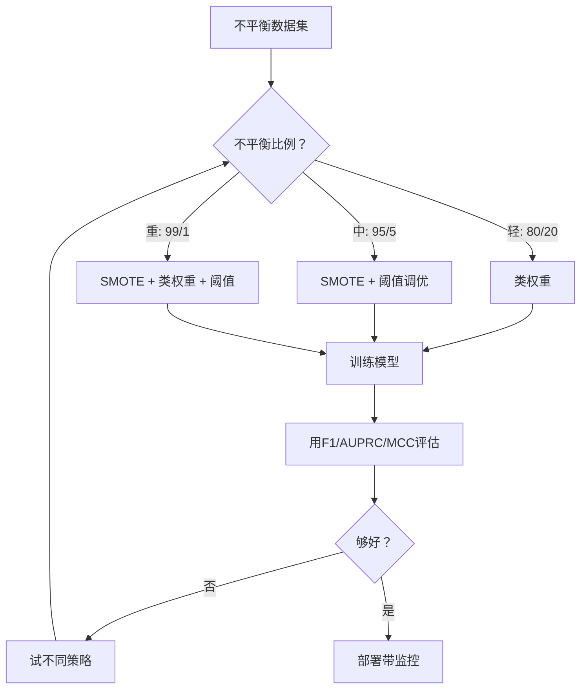
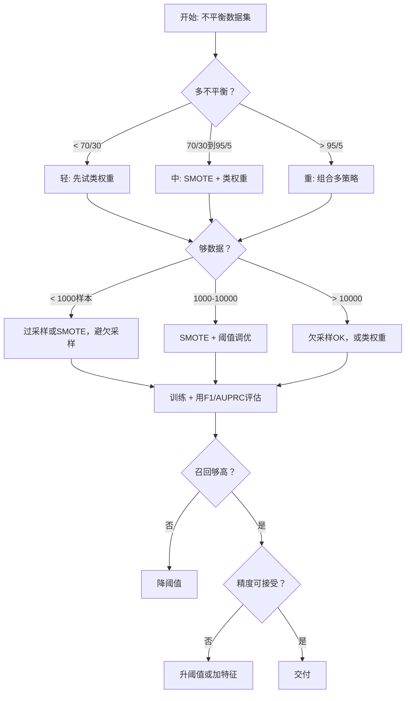

# 处理不平衡数据

> 当99%数据是"正常"，精度是谎言。

**类型:** 构建
**语言:** Python
**前置要求:** 第2阶段, 课程01-09 (特别是评估指标)
**时间:** ~90分钟

## 学习目标

- 从零实现SMOTE并解释合成过采样与随机复制有何不同
- 用F1、AUPRC和Matthews相关系数而非精度评估不平衡分类器
- 比较类权重、阈值调优和重采样策略并为给定不平衡比例选对方法
- 构建完整不平衡数据流水线组合SMOTE、类权重和阈值优化

## 问题背景

你建欺诈检测模型。它得99.9%精度。你庆祝。然后你意识到它对每交易预测"非欺诈"。

这不是bug。它是当仅0.1%交易欺诈时理性做法。模型学总猜多数类最小化总错。它技术上正确且完全无用。

这发生在任何真实分类重要的地方。疾病诊断: 1%阳性率。网络入侵: 0.01%攻击。制造缺陷: 0.5%缺陷。垃圾过滤: 20%垃圾。流失预测: 5%流失者。少数类越重要，它越稀有。

精度失败因它对待所有正确预测等价。正确标签合法交易和正确抓欺诈都对精度贡献一分。但抓欺诈是模型存在全部原因。我们需要强制模型注意稀有但重要类的指标、技术和训练策略。

## 概念讲解

### 为何精度失败

考虑1000样本数据集: 990负，10正。总预测负的模型:

|  | 预测正 | 预测负 |
|--|---|---|
| 实际正 | 0 (TP) | 10 (FN) |
| 实际负 | 0 (FP) | 990 (TN) |

精度 = (0 + 990) / 1000 = 99.0%

模型抓零欺诈。零疾病。零缺陷。但精度说99%。这是为何精度对不平衡问题危险。

### 更好指标

**精度(Precision)** = TP / (TP + FP)。所有标正的，多少真正？高精度意味少假警报。

**召回(Recall)** = TP / (TP + FN)。所有真正的，我们抓多少？高召回意味少漏正。

**F1分数** = 2 * precision * recall / (precision + recall)。调和平均。比算术平均更罚精度召回间极端不平衡。

**F-beta分数** = (1 + beta^2) * precision * recall / (beta^2 * precision + recall)。当beta > 1，召回更重要。当beta < 1，精度更重要。F2在欺诈检测常见(漏欺诈比假警报更坏)。

**AUPRC**(精度召回曲线下面积)。像AUC-ROC但对不平衡数据更有信息。随机分类器AUPRC等于正类率(非ROC那样0.5)。这让改善更易见。

**Matthews相关系数** = (TP * TN - FP * FN) / sqrt((TP+FP)(TP+FN)(TN+FP)(TN+FN))。范围-1到+1。只在模型两类都好时给高分。即使类大小差也平衡。

对上"总预测负"模型: precision = 0/0 (未定义，常设0)，recall = 0/10 = 0，F1 = 0，MCC = 0。这些指标正确识别模型无价值。

### 不平衡数据流水线



### SMOTE: 合成少数过采样技术

随机过采样复制现少数样本。这工作但风险过拟合因模型反复见相同点。

SMOTE创既合理非复制的新合成少数样本。算法:

1. 每少数样本x，找其在其他少数样本中k最近邻
2. 随机挑一邻居
3. 在x和那邻居线段上创新样本

公式: `new_sample = x + random(0, 1) * (neighbor - x)`

这插值真少数点间，创同特征空间区域样本而非仅复制现数据。


### 采样策略比较

**随机过采样**: 复制少数样本至匹配多数数。
- 优势: 简单，无信息失
- 劣势: 精确复制致过拟合，增训练时

**随机欠采样**: 移多数样本至匹配少数数。
- 优势: 快训练，简单
- 劣势: 弃可能有用多数数据，高方差

**SMOTE**: 插值创合成少数样本。
- 优势: 生成新数据点，比随机过采样减过拟合
- 劣势: 可在决策边界附近创噪声样本，不考虑多数类分布

| 策略 | 数据变化 | 风险 | 何时用 |
|----------|-------------|------|-------------|
| 过采样 | 少数复制 | 过拟合 | 小数据集，中度不平衡 |
| 欠采样 | 多数移除 | 信息失 | 大数据集，要快训练 |
| SMOTE | 合成少数加 | 边界噪声 | 中度不平衡，够少数样本做k-NN |

### 类权重

非改数据，改模型如何处理错。给错分少数类更高权重。

对950负50正样本二元问题:
- 负类权重 = n_samples / (2 * n_negative) = 1000 / (2 * 950) = 0.526
- 正类权重 = n_samples / (2 * n_positive) = 1000 / (2 * 50) = 10.0

正类得19倍权重。错分一正样本费如错分19负样本。模型强制注意少数类。

逻辑回归中，这修改损失函数:

```
weighted_loss = -sum(w_i * [y_i * log(p_i) + (1-y_i) * log(1-p_i)])
```

其中w_i依赖样本i的类。

类权重数学上期望等价过采样，但不创新数据点。这使它们更快且避免复制样本过拟合风险。

### 阈值调优

多分类器输出概率。默认阈值0.5: 若P(positive) >= 0.5，预测正。但0.5任意。类不平衡时，最优阈值常更低。

过程:
1. 训练模型
2. 在验证集获预测概率
3. 扫阈值从0.0到1.0
4. 每阈值算F1(或你选指标)
5. 挑最大化你指标的阈值


模型可对欺诈交易输出P(fraud) = 0.15。阈值0.5时，这分类为非欺诈。阈值0.10时，正确抓。概率校准不如排序重要 -- 只要欺诈比非欺诈得更高概率，存在分离它们的阈值。

### 成本敏感学习

类权重推广。非统一成本，给特定错分成本:

|  | 预测正 | 预测负 |
|--|---|---|
| 实际正 | 0 (正确) | C_FN = 100 |
| 实际负 | C_FP = 1 | 0 (正确) |

漏欺诈交易(FN)费100倍多于假警报(FP)。模型优化总成本，非总错数。

这是你能估真实世界成本时最原则方法。漏癌症诊断成本异于导致额外活检假警报。让成本显式强制正确权衡。

### 决策流程图



## 构建

### 步骤1: 生成不平衡数据集

```python
import numpy as np


def make_imbalanced_data(n_majority=950, n_minority=50, seed=42):
    rng = np.random.RandomState(seed)

    X_maj = rng.randn(n_majority, 2) * 1.0 + np.array([0.0, 0.0])
    X_min = rng.randn(n_minority, 2) * 0.8 + np.array([2.5, 2.5])

    X = np.vstack([X_maj, X_min])
    y = np.concatenate([np.zeros(n_majority), np.ones(n_minority)])

    shuffle_idx = rng.permutation(len(y))
    return X[shuffle_idx], y[shuffle_idx]
```

### 步骤2: 从零SMOTE

```python
def euclidean_distance(a, b):
    return np.sqrt(np.sum((a - b) ** 2))


def find_k_neighbors(X, idx, k):
    distances = []
    for i in range(len(X)):
        if i == idx:
            continue
        d = euclidean_distance(X[idx], X[i])
        distances.append((i, d))
    distances.sort(key=lambda x: x[1])
    return [d[0] for d in distances[:k]]


def smote(X_minority, k=5, n_synthetic=100, seed=42):
    rng = np.random.RandomState(seed)
    n_samples = len(X_minority)
    k = min(k, n_samples - 1)
    synthetic = []

    for _ in range(n_synthetic):
        idx = rng.randint(0, n_samples)
        neighbors = find_k_neighbors(X_minority, idx, k)
        neighbor_idx = neighbors[rng.randint(0, len(neighbors))]
        t = rng.random()
        new_point = X_minority[idx] + t * (X_minority[neighbor_idx] - X_minority[idx])
        synthetic.append(new_point)

    return np.array(synthetic)
```

### 步骤3: 随机过采样和欠采样

```python
def random_oversample(X, y, seed=42):
    rng = np.random.RandomState(seed)
    classes, counts = np.unique(y, return_counts=True)
    max_count = counts.max()

    X_resampled = list(X)
    y_resampled = list(y)

    for cls, count in zip(classes, counts):
        if count < max_count:
            cls_indices = np.where(y == cls)[0]
            n_needed = max_count - count
            chosen = rng.choice(cls_indices, size=n_needed, replace=True)
            X_resampled.extend(X[chosen])
            y_resampled.extend(y[chosen])

    X_out = np.array(X_resampled)
    y_out = np.array(y_resampled)
    shuffle = rng.permutation(len(y_out))
    return X_out[shuffle], y_out[shuffle]


def random_undersample(X, y, seed=42):
    rng = np.random.RandomState(seed)
    classes, counts = np.unique(y, return_counts=True)
    min_count = counts.min()

    X_resampled = []
    y_resampled = []

    for cls in classes:
        cls_indices = np.where(y == cls)[0]
        chosen = rng.choice(cls_indices, size=min_count, replace=False)
        X_resampled.extend(X[chosen])
        y_resampled.extend(y[chosen])

    X_out = np.array(X_resampled)
    y_out = np.array(y_resampled)
    shuffle = rng.permutation(len(y_out))
    return X_out[shuffle], y_out[shuffle]
```

### 步骤4: 带类权重逻辑回归

```python
def sigmoid(z):
    return 1.0 / (1.0 + np.exp(-np.clip(z, -500, 500)))


def logistic_regression_weighted(X, y, weights, lr=0.01, epochs=200):
    n_samples, n_features = X.shape
    w = np.zeros(n_features)
    b = 0.0

    for _ in range(epochs):
        z = X @ w + b
        pred = sigmoid(z)
        error = pred - y
        weighted_error = error * weights

        gradient_w = (X.T @ weighted_error) / n_samples
        gradient_b = np.mean(weighted_error)

        w -= lr * gradient_w
        b -= lr * gradient_b

    return w, b


def compute_class_weights(y):
    classes, counts = np.unique(y, return_counts=True)
    n_samples = len(y)
    n_classes = len(classes)
    weight_map = {}
    for cls, count in zip(classes, counts):
        weight_map[cls] = n_samples / (n_classes * count)
    return np.array([weight_map[yi] for yi in y])
```

### 步骤5: 阈值调优

```python
def find_optimal_threshold(y_true, y_probs, metric="f1"):
    best_threshold = 0.5
    best_score = -1.0

    for threshold in np.arange(0.05, 0.96, 0.01):
        y_pred = (y_probs >= threshold).astype(int)
        tp = np.sum((y_pred == 1) & (y_true == 1))
        fp = np.sum((y_pred == 1) & (y_true == 0))
        fn = np.sum((y_pred == 0) & (y_true == 1))

        if metric == "f1":
            precision = tp / (tp + fp) if (tp + fp) > 0 else 0.0
            recall = tp / (tp + fn) if (tp + fn) > 0 else 0.0
            score = 2 * precision * recall / (precision + recall) if (precision + recall) > 0 else 0.0
        elif metric == "recall":
            score = tp / (tp + fn) if (tp + fn) > 0 else 0.0
        elif metric == "precision":
            score = tp / (tp + fp) if (tp + fp) > 0 else 0.0

        if score > best_score:
            best_score = score
            best_threshold = threshold

    return best_threshold, best_score
```

### 步骤6: 评估函数

```python
def confusion_matrix_values(y_true, y_pred):
    tp = np.sum((y_pred == 1) & (y_true == 1))
    tn = np.sum((y_pred == 0) & (y_true == 0))
    fp = np.sum((y_pred == 1) & (y_true == 0))
    fn = np.sum((y_pred == 0) & (y_true == 1))
    return tp, tn, fp, fn


def compute_metrics(y_true, y_pred):
    tp, tn, fp, fn = confusion_matrix_values(y_true, y_pred)
    accuracy = (tp + tn) / (tp + tn + fp + fn)
    precision = tp / (tp + fp) if (tp + fp) > 0 else 0.0
    recall = tp / (tp + fn) if (tp + fn) > 0 else 0.0
    f1 = 2 * precision * recall / (precision + recall) if (precision + recall) > 0 else 0.0

    denom = np.sqrt(float((tp + fp) * (tp + fn) * (tn + fp) * (tn + fn)))
    mcc = (tp * tn - fp * fn) / denom if denom > 0 else 0.0

    return {
        "accuracy": accuracy,
        "precision": precision,
        "recall": recall,
        "f1": f1,
        "mcc": mcc,
    }
```

### 步骤7: 比较所有方法

```python
X, y = make_imbalanced_data(950, 50, seed=42)
split = int(0.8 * len(y))
X_train, X_test = X[:split], X[split:]
y_train, y_test = y[:split], y[split:]

# 基线: 无处理
w_base, b_base = logistic_regression_weighted(
    X_train, y_train, np.ones(len(y_train)), lr=0.1, epochs=300
)
probs_base = sigmoid(X_test @ w_base + b_base)
preds_base = (probs_base >= 0.5).astype(int)

# 过采样
X_over, y_over = random_oversample(X_train, y_train)
w_over, b_over = logistic_regression_weighted(
    X_over, y_over, np.ones(len(y_over)), lr=0.1, epochs=300
)
preds_over = (sigmoid(X_test @ w_over + b_over) >= 0.5).astype(int)

# SMOTE
minority_mask = y_train == 1
X_minority = X_train[minority_mask]
synthetic = smote(X_minority, k=5, n_synthetic=len(y_train) - 2 * int(minority_mask.sum()))
X_smote = np.vstack([X_train, synthetic])
y_smote = np.concatenate([y_train, np.ones(len(synthetic))])
w_sm, b_sm = logistic_regression_weighted(
    X_smote, y_smote, np.ones(len(y_smote)), lr=0.1, epochs=300
)
preds_smote = (sigmoid(X_test @ w_sm + b_sm) >= 0.5).astype(int)

# 类权重
sample_weights = compute_class_weights(y_train)
w_cw, b_cw = logistic_regression_weighted(
    X_train, y_train, sample_weights, lr=0.1, epochs=300
)
probs_cw = sigmoid(X_test @ w_cw + b_cw)
preds_cw = (probs_cw >= 0.5).astype(int)

# 阈值调优(在保留验证集调，非测试集)
probs_val = sigmoid(X_val @ w_cw + b_cw)
best_thresh, best_f1 = find_optimal_threshold(y_val, probs_val, metric="f1")
preds_thresh = (probs_cw >= best_thresh).astype(int)
```

代码文件在单脚本跑所有这并打印结果。

## 使用

用sklearn和imbalanced-learn，这些技术一行:

```python
from sklearn.linear_model import LogisticRegression
from sklearn.metrics import classification_report, f1_score
from sklearn.model_selection import train_test_split
from imblearn.over_sampling import SMOTE
from imblearn.under_sampling import RandomUnderSampler
from imblearn.pipeline import Pipeline

X_train, X_test, y_train, y_test = train_test_split(X, y, stratify=y)

model_weighted = LogisticRegression(class_weight="balanced")
model_weighted.fit(X_train, y_train)
print(classification_report(y_test, model_weighted.predict(X_test)))

smote = SMOTE(random_state=42)
X_resampled, y_resampled = smote.fit_resample(X_train, y_train)
model_smote = LogisticRegression()
model_smote.fit(X_resampled, y_resampled)
print(classification_report(y_test, model_smote.predict(X_test)))

pipeline = Pipeline([
    ("smote", SMOTE()),
    ("model", LogisticRegression(class_weight="balanced")),
])
pipeline.fit(X_train, y_train)
print(classification_report(y_test, pipeline.predict(X_test)))
```

从零实现示每技术确切做什么。SMOTE就是少数类上k-NN插值。类权重乘损失。阈值调优是截止循环。无魔法。

## 交付成果

本课程产生:
- `outputs/skill-imbalanced-data.md` -- 处理不平衡分类问题决策检查表

## 练习题

1. **边界SMOTE**: 改SMOTE实现仅对靠近决策边界少数点生成合成样本(那些k最近邻含多数类样本的)。在类重叠数据集比较结果与标准SMOTE。

2. **成本矩阵优化**: 实现成本敏感学习其中成本矩阵是参数。创函数取成本矩阵并返回最小化期望成本最优预测。用不同成本比(1:10, 1:100, 1:1000)测并绘精度召回权衡如何变。

3. **阈值校准**: 实现Platt缩放(在模型原始输出拟合逻辑回归产生校准概率)。比较校准前后精度召回曲线。示校准不改排序(AUC不变)但使概率更有意义。

4. **集成带平衡袋装**: 训练多模型，各在平衡bootstrap样本(所有少数 + 随机多数子集)。平均预测。比较这方法与单模型带SMOTE。测性能和跨跑方差。

5. **不平衡比例实验**: 取平衡数据集并渐进增不平衡比例(50/50, 70/30, 90/10, 95/5, 99/1)。每比例，带和不带SMOTE训练。绘两种方法F1对不平衡比例。SMOTE何比例开始有显著差异？

## 关键术语

| 术语 | 人们怎么说 | 实际含义 |
|------|----------------|----------------------|
| 类不平衡 | "一类样本多得多" | 数据集类分布显著偏，导致模型偏多数类 |
| SMOTE | "合成过采样" | 通过在现少数样本与其k最近少数邻居间插值创新少数样本 |
| 类权重 | "让稀有类错误更贵" | 乘损失函数以类特定权重使模型更罚少数错分 |
| 阈值调优 | "移决策边界" | 从默认0.5改分类概率截止到优化期望指标值 |
| 精度召回权衡 | "你不能两者都有" | 降阈值抓更多正(更高召回)但也标更多假正(更低精度)，反之亦然 |
| AUPRC | "PR曲线下面积" | 精度召回曲线汇总成单数；类严重不平衡时比AUC-ROC更有信息 |
| Matthews相关系数 | "平衡指标" | 预测与真实标签间相关，只在模型两类都好时产高分 |
| 成本敏感学习 | "不同错费不同" | 把真实世界错分成本纳入训练目标使模型优化总成本，非错数 |
| 随机过采样 | "复制少数" | 复少数类样本平衡类数；简单但风险过拟合复制点 |

## 延伸阅读

- [SMOTE: Synthetic Minority Over-sampling Technique (Chawla et al., 2002)](https://arxiv.org/abs/1106.1813) -- 原始SMOTE论文，仍是不平衡学习最被引工作
- [Learning from Imbalanced Data (He & Garcia, 2009)](https://ieeexplore.ieee.org/document/5128907) -- 综合调研覆盖采样、成本敏感和算法方法
- [imbalanced-learn documentation](https://imbalanced-learn.org/stable/) -- Python库带SMOTE变体、欠采样策略和流水线集成
- [The Precision-Recall Plot Is More Informative than the ROC Plot (Saito & Rehmsmeier, 2015)](https://journals.plos.org/plosone/article?id=10.1371/journal.pone.0118432) -- 何时为何PR曲线优于ROC曲线对不平衡问题