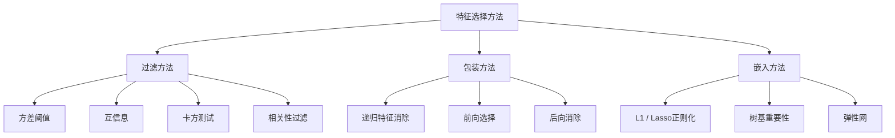
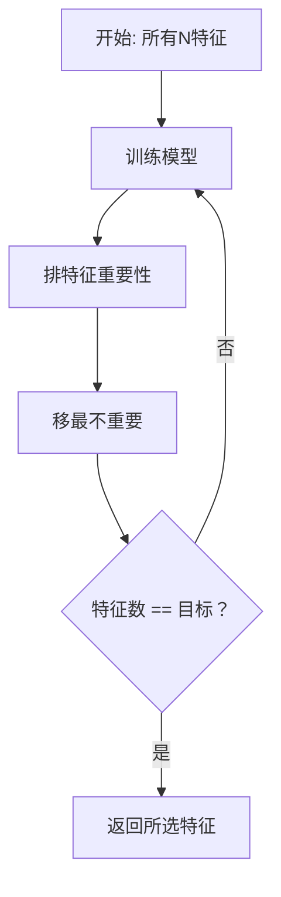
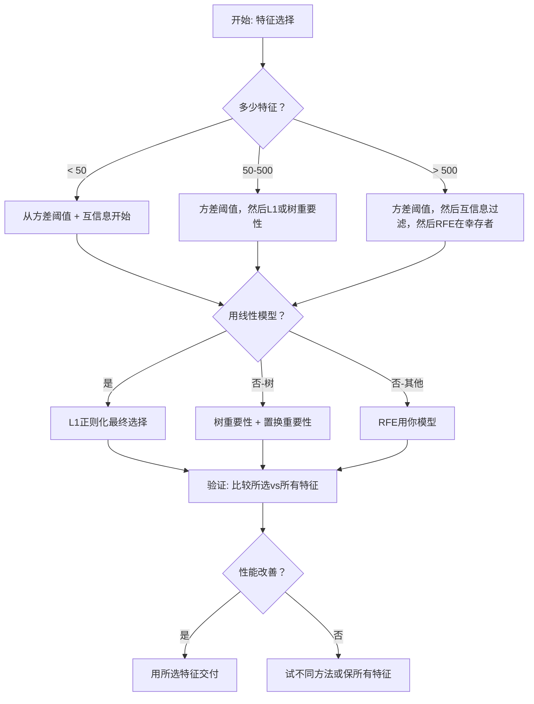

# 特征选择

> 更多特征非更好。对的特征才更好。

**类型:** 构建
**语言:** Python
**前置要求:** 第2阶段, 课程01-09, 08 (特征工程)
**时间:** ~75分钟

## 学习目标

- 从零实现过滤方法(方差阈值、互信息、卡方)和包装方法(RFE、前向选择)
- 解释为何互信息捕获非线性特征-目标关系而相关性错过
- 比较L1正则化(嵌入选择)与RFE(包装选择)并评估它们计算权衡
- 构建组合多方法的特征选择流水线并在保留数据示改善泛化

## 问题背景

你有500特征。模型训练慢，总过拟合，无人能解释它学了什么。你加更多特征希望改善性能。它变差。

这是维度诅咒在行动。特征数增，特征空间体积爆。数据点变稀。点间距离趋同。模型需指数更多数据找真模式。噪声特征淹没信号特征。过拟合成默认。

特征选择是解药。剥噪声。移冗余。保携带目标实际信息特征。结果: 更快训练，更好泛化，和可解释模型。

目标非用所有可用信息。是用对的信息。

## 概念讲解

### 特征选择三类

每特征选择方法落入三类之一:



**过滤方法** 用统计测度独立评分每特征。它们不用模型。快，但错过特征交互。

**包装方法** 训练模型评估特征子集。它们用模型性能作分数。更好结果，但贵因它们重训练模型多次。

**嵌入方法** 作为模型训练一部分选特征。L1正则化驱权重为零。决策树在最有用特征分裂。选择在拟合时发生，非单独步。

### 方差阈值

最简过滤。若特征跨样本几乎不变，它带几乎无信息。

考虑999/1000样本为0.0的特征。方差近零。无模型能用它区分类。移它。

```
variance(x) = mean((x - mean(x))^2)
```

设阈值(如0.01)。移方差低于每特征。这移常或近常特征无需看目标变量。

何时用: 作其他方法前预处理步。近零成本捕明显无用特征。

局限: 特征可高方差仍是纯噪声。方差阈值必要但非充分。

### 互信息

互信息测知特征X值减多少关于目标Y不确定。

```
I(X; Y) = sum_x sum_y p(x, y) * log(p(x, y) / (p(x) * p(y)))
```

若X和Y独立，p(x, y) = p(x) * p(y)，log项零所以I(X; Y) = 0。X告你越多Y，互信息越高。

关键优势相关性: 互信息捕获非线性关系。特征可零相关性但高互信息因关系二次或周期。

对连续特征，先离散入箱(直方图估计)。箱数影响估计 -- 太少箱失信息，太多箱加噪声。常见选: sqrt(n)箱或Sturges规则(1 + log2(n))。


### 递归特征消除(RFE)

RFE是包装方法。它用模型自己特征重要性迭代修剪:

1. 用所有特征训练模型
2. 按重要性排特征(线性模型系数，树不纯度减)
3. 移最不重要特征
4. 重复直到达目标特征数



RFE考虑特征交互因模型一起见所有剩余特征。移一特征改其他重要性。这使它比过滤方法更彻底。

成本: 你训练模型N - 目标次。500特征目标10，那是490训练跑。贵模型，这慢。你可加速每步移多特征(如每轮移底10%)。

### L1 (Lasso)正则化

L1正则化把权重绝对值加到损失函数:

```
loss = prediction_error + alpha * sum(|w_i|)
```

alpha参数控多激进修剪特征。更高alpha意味更多权重精确为零。

为何精确零？L1惩罚在权重空间创钻石形约束区。最优解倾向落这钻石角，一处或多权重为零。L2正则化(ridge)创圆形约束权重缩但罕击零。

这是嵌入特征选择: 模型训练时学忽略哪些特征。零权重特征有效移除。

优势: 单训练跑，处理相关特征(选一零其他)，建入多线性模型实现。

局限: 仅对线性模型工作。不能捕获非线性特征重要性。

### 树基特征重要性

决策树及其集成(随机森林、梯度提升)自然排特征。每分裂减不纯度(分类Gini或熵，回归方差)。产更大不纯度减的特征更重要。

对T树随机森林:

```
importance(feature_j) = (1/T) * sum over all trees of
    sum over all nodes splitting on feature_j of
        (n_samples * impurity_decrease)
```

这给每特征归一化重要性分数。它自动处理非线性关系和特征交互。

警告: 树基重要性偏多唯一值特征(高基数)。随机ID列将显重要因它完美分裂每样本。用置换重要性作 Sanity检查。

### 置换重要性

模型无关方法:

1. 训练模型并在验证数据记录基线性能
2. 每特征: 随机打乱其值，测性能降
3. 更大降，特征更重要

若打乱特征不伤性能，模型不依赖它。若性能崩，那特征关键。

置换重要性避树基重要性基数偏。但慢: 每特征一全评估，重复多次求稳定。

### 比较表

| 方法 | 类型 | 速度 | 非线性 | 特征交互 |
|--------|------|-------|-----------|---------------------|
| 方差阈值 | 过滤 | 极快 | 否 | 否 |
| 互信息 | 过滤 | 快 | 是 | 否 |
| 相关性过滤 | 过滤 | 快 | 否 | 否 |
| RFE | 包装 | 慢 | 依赖模型 | 是 |
| L1 / Lasso | 嵌入 | 快 | 否(线性) | 否 |
| 树重要性 | 嵌入 | 中 | 是 | 是 |
| 置换重要性 | 模型无关 | 慢 | 是 | 是 |

### 决策流程图



## 构建

### 步骤1: 生成带已知特征结构合成数据

```python
import numpy as np


def make_feature_selection_data(n_samples=500, seed=42):
    rng = np.random.RandomState(seed)

    x1 = rng.randn(n_samples)
    x2 = rng.randn(n_samples)
    x3 = rng.randn(n_samples)
    x4 = x1 + 0.1 * rng.randn(n_samples)
    x5 = x2 + 0.1 * rng.randn(n_samples)

    informative = np.column_stack([x1, x2, x3, x4, x5])

    correlated = np.column_stack([
        x1 * 0.9 + 0.1 * rng.randn(n_samples),
        x2 * 0.8 + 0.2 * rng.randn(n_samples),
        x3 * 0.7 + 0.3 * rng.randn(n_samples),
        x1 * 0.5 + x2 * 0.5 + 0.1 * rng.randn(n_samples),
        x2 * 0.6 + x3 * 0.4 + 0.1 * rng.randn(n_samples),
    ])

    noise = rng.randn(n_samples, 10) * 0.5

    X = np.hstack([informative, correlated, noise])
    y = (2 * x1 - 1.5 * x2 + x3 + 0.5 * rng.randn(n_samples) > 0).astype(int)

    feature_names = (
        [f"info_{i}" for i in range(5)]
        + [f"corr_{i}" for i in range(5)]
        + [f"noise_{i}" for i in range(10)]
    )

    return X, y, feature_names
```

我们知真相: 特征0-4有信息(加上3和4是0和1相关副本)，特征5-9与有信息特征相关，特征10-19纯噪声。好选择方法应排0-4最高10-19最低。

### 步骤2: 方差阈值

```python
def variance_threshold(X, threshold=0.01):
    variances = np.var(X, axis=0)
    mask = variances > threshold
    return mask, variances
```

### 步骤3: 互信息(离散)

```python
def discretize(x, n_bins=10):
    min_val, max_val = x.min(), x.max()
    if max_val == min_val:
        return np.zeros_like(x, dtype=int)
    bin_edges = np.linspace(min_val, max_val, n_bins + 1)
    binned = np.digitize(x, bin_edges[1:-1])
    return binned


def mutual_information(X, y, n_bins=10):
    n_samples, n_features = X.shape
    mi_scores = np.zeros(n_features)

    y_vals, y_counts = np.unique(y, return_counts=True)
    p_y = y_counts / n_samples

    for f in range(n_features):
        x_binned = discretize(X[:, f], n_bins)
        x_vals, x_counts = np.unique(x_binned, return_counts=True)
        p_x = dict(zip(x_vals, x_counts / n_samples))

        mi = 0.0
        for xv in x_vals:
            for yi, yv in enumerate(y_vals):
                joint_mask = (x_binned == xv) & (y == yv)
                p_xy = np.sum(joint_mask) / n_samples
                if p_xy > 0:
                    mi += p_xy * np.log(p_xy / (p_x[xv] * p_y[yi]))
        mi_scores[f] = mi

    return mi_scores
```

### 步骤4: 递归特征消除

```python
def simple_logistic_importance(X, y, lr=0.1, epochs=100):
    n_samples, n_features = X.shape
    w = np.zeros(n_features)
    b = 0.0

    for _ in range(epochs):
        z = X @ w + b
        pred = 1.0 / (1.0 + np.exp(-np.clip(z, -500, 500)))
        error = pred - y
        w -= lr * (X.T @ error) / n_samples
        b -= lr * np.mean(error)

    return w, b


def rfe(X, y, n_features_to_select=5, lr=0.1, epochs=100):
    n_total = X.shape[1]
    remaining = list(range(n_total))
    rankings = np.ones(n_total, dtype=int)
    rank = n_total

    while len(remaining) > n_features_to_select:
        X_subset = X[:, remaining]
        w, _ = simple_logistic_importance(X_subset, y, lr, epochs)
        importances = np.abs(w)

        least_idx = np.argmin(importances)
        original_idx = remaining[least_idx]
        rankings[original_idx] = rank
        rank -= 1
        remaining.pop(least_idx)

    for idx in remaining:
        rankings[idx] = 1

    selected_mask = rankings == 1
    return selected_mask, rankings
```

### 步骤5: L1特征选择

```python
def soft_threshold(w, alpha):
    return np.sign(w) * np.maximum(np.abs(w) - alpha, 0)


def l1_feature_selection(X, y, alpha=0.1, lr=0.01, epochs=500):
    n_samples, n_features = X.shape
    w = np.zeros(n_features)
    b = 0.0

    for _ in range(epochs):
        z = X @ w + b
        pred = 1.0 / (1.0 + np.exp(-np.clip(z, -500, 500)))
        error = pred - y

        gradient_w = (X.T @ error) / n_samples
        gradient_b = np.mean(error)

        w -= lr * gradient_w
        w = soft_threshold(w, lr * alpha)
        b -= lr * gradient_b

    selected_mask = np.abs(w) > 1e-6
    return selected_mask, w
```

### 步骤6: 树基重要性(简单决策树)

```python
def gini_impurity(y):
    if len(y) == 0:
        return 0.0
    classes, counts = np.unique(y, return_counts=True)
    probs = counts / len(y)
    return 1.0 - np.sum(probs ** 2)


def best_split(X, y, feature_idx):
    values = np.unique(X[:, feature_idx])
    if len(values) <= 1:
        return None, -1.0

    best_threshold = None
    best_gain = -1.0
    parent_gini = gini_impurity(y)
    n = len(y)

    for i in range(len(values) - 1):
        threshold = (values[i] + values[i + 1]) / 2.0
        left_mask = X[:, feature_idx] <= threshold
        right_mask = ~left_mask

        n_left = np.sum(left_mask)
        n_right = np.sum(right_mask)

        if n_left == 0 or n_right == 0:
            continue

        gain = parent_gini - (n_left / n) * gini_impurity(y[left_mask]) - (n_right / n) * gini_impurity(y[right_mask])

        if gain > best_gain:
            best_gain = gain
            best_threshold = threshold

    return best_threshold, best_gain


def tree_importance(X, y, n_trees=50, max_depth=5, seed=42):
    rng = np.random.RandomState(seed)
    n_samples, n_features = X.shape
    importances = np.zeros(n_features)

    for _ in range(n_trees):
        sample_idx = rng.choice(n_samples, size=n_samples, replace=True)
        feature_subset = rng.choice(n_features, size=max(1, int(np.sqrt(n_features))), replace=False)

        X_boot = X[sample_idx]
        y_boot = y[sample_idx]

        tree_imp = _build_tree_importance(X_boot, y_boot, feature_subset, max_depth)
        importances += tree_imp

    total = importances.sum()
    if total > 0:
        importances /= total

    return importances


def _build_tree_importance(X, y, feature_subset, max_depth, depth=0):
    n_features = X.shape[1]
    importances = np.zeros(n_features)

    if depth >= max_depth or len(np.unique(y)) <= 1 or len(y) < 4:
        return importances

    best_feature = None
    best_threshold = None
    best_gain = -1.0

    for f in feature_subset:
        threshold, gain = best_split(X, y, f)
        if gain > best_gain:
            best_gain = gain
            best_feature = f
            best_threshold = threshold

    if best_feature is None or best_gain <= 0:
        return importances

    importances[best_feature] += best_gain * len(y)

    left_mask = X[:, best_feature] <= best_threshold
    right_mask = ~left_mask

    importances += _build_tree_importance(X[left_mask], y[left_mask], feature_subset, max_depth, depth + 1)
    importances += _build_tree_importance(X[right_mask], y[right_mask], feature_subset, max_depth, depth + 1)

    return importances
```

### 步骤7: 跑所有方法并比较

代码文件在同合成数据集跑所有五方法并打印比较表示每方法选哪些特征。

## 使用

用scikit-learn，特征选择建入流水线:

```python
from sklearn.feature_selection import (
    VarianceThreshold,
    mutual_info_classif,
    RFE,
    SelectFromModel,
)
from sklearn.linear_model import Lasso, LogisticRegression
from sklearn.ensemble import RandomForestClassifier

vt = VarianceThreshold(threshold=0.01)
X_filtered = vt.fit_transform(X)

mi_scores = mutual_info_classif(X, y)
top_k = np.argsort(mi_scores)[-10:]

rfe_selector = RFE(LogisticRegression(), n_features_to_select=10)
rfe_selector.fit(X, y)
X_rfe = rfe_selector.transform(X)

lasso_selector = SelectFromModel(Lasso(alpha=0.01))
lasso_selector.fit(X, y)
X_lasso = lasso_selector.transform(X)

rf = RandomForestClassifier(n_estimators=100)
rf.fit(X, y)
importances = rf.feature_importances_
```

从零实现示每方法内部确切发生什么。方差阈值就是算`var(X, axis=0)`并应用掩码。互信息是在列联表计联合和边际频率。RFE是训练、排名、修剪循环。L1是带软阈值步梯度下降。树重要性跨分裂累积不纯度减。无魔法 -- 统计和循环。

sklearn版本加鲁棒性(如mutual_info_classif用k-NN密度估计替代离散)、速度(C实现)和流水线集成。

## 交付成果

本课程产生:
- `outputs/skill-feature-selector.md` -- 选对特征选择方法快速参考决策树

## 练习题

1. **前向选择**: 实现RFE反向。从零特征开始。每步，加改善模型性能最多特征。停当加特征不再帮助。比较所选特征与RFE结果。哪个更快？哪个结果更好？

2. **稳定性选择**: 跑L1特征选择50次，每次在随机80%数据子采样，带略不同alpha值。计每特征被选次数。> 80%跑中被选特征是"稳定"。比较稳定特征与单跑L1选择。哪个更可靠？

3. **多重共线性检测**: 计所有特征相关矩阵。实现函数，给定相关阈值(如0.9)，移每高相关对中一特征(保与目标互信息更高那个)。在合成数据集测并验证它移冗余相关特征。

4. **特征选择流水线**: 链方差阈值、互信息过滤和RFE入单流水线。先移近零方差特征，然后保互信息前50%，然后在幸存者跑RFE。比较这流水线与对所有特征单独跑RFE。流水线更快？等准确？

5. **从零置换重要性**: 实现置换重要性。每特征，打乱其值10次，测F1分数平均降。比较排名与树基重要性。找它们不同意情况并解释为何(提示: 相关特征)。

## 关键术语

| 术语 | 人们怎么说 | 实际含义 |
|------|----------------|----------------------|
| 过滤方法 | "独立评分特征" | 用统计测度排名特征不训练模型，每特征独立评估的特征选择方法 |
| 包装方法 | "用模型选特征" | 通过训练模型用其性能作选择标准评估特征子集的特征选择方法 |
| 嵌入方法 | "训练时模型选特征" | 作为模型拟合一部分发生的特征选择，如L1正则化驱权重为零 |
| 互信息 | "一变量告你另一变量多少" | 测知X后关于Y不确定减，捕获线性和非线性依赖 |
| 递归特征消除 | "训练、排名、修剪、重复" | 迭代包装方法训练模型、移最不重要特征、重复直到达目标数 |
| L1 / Lasso正则化 | "杀死特征的惩罚" | 把权重绝对值总和加到损失函数，驱不重要特征权重精确为零 |
| 方差阈值 | "移常特征" | 移跨样本方差低于指定阈值特征，过滤不带信息特征 |
| 特征重要性 | "哪些特征最重要" | 示每特征对模型预测贡献多少分数，从分裂增益(树)或系数大小(线性)算 |
| 置换重要性 | "打乱测损害" | 通过随机打乱每特征值测结果模型性能降来评估特征重要性 |
| 维度诅咒 | "太多特征，不够数据" | 添加特征指数增特征空间体积现象，使数据稀疏距离无意义 |

## 延伸阅读

- [An Introduction to Variable and Feature Selection (Guyon & Elisseeff, 2003)](https://jmlr.org/papers/v3/guyon03a.html) -- 特征选择方法奠基调研，仍广引用
- [scikit-learn Feature Selection Guide](https://scikit-learn.org/stable/modules/feature_selection.html) -- 过滤、包装和嵌入方法实践参考带代码例
- [Stability Selection (Meinshausen & Buhlmann, 2010)](https://arxiv.org/abs/0809.2932) -- 组合子采样与特征选择求鲁棒、可复现结果
- [Beware Default Random Forest Importances (Strobl et al., 2007)](https://bmcbioinformatics.biomedcentral.com/articles/10.1186/1471-2105-8-25) -- 示树基重要性基数偏并提出条件重要性作替代