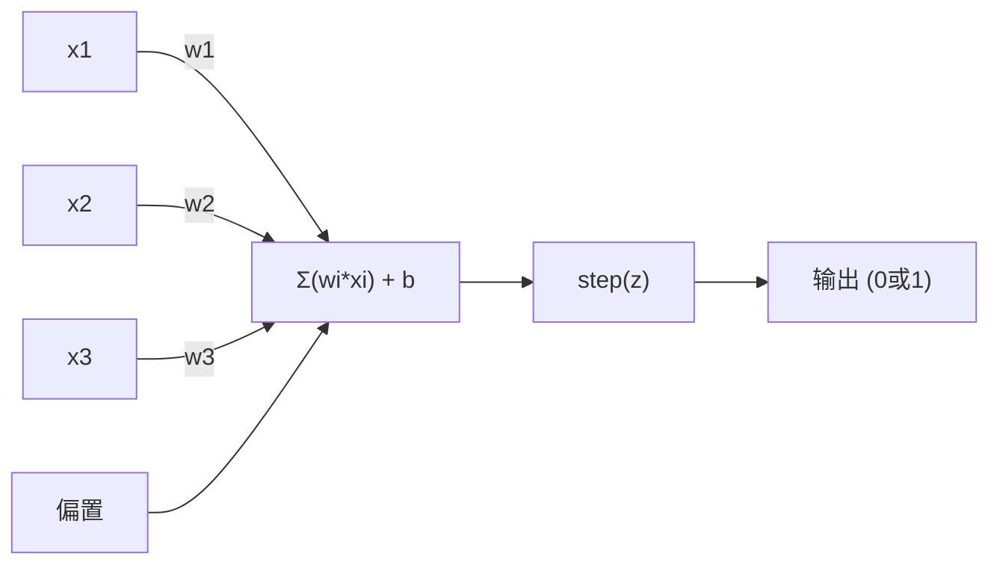
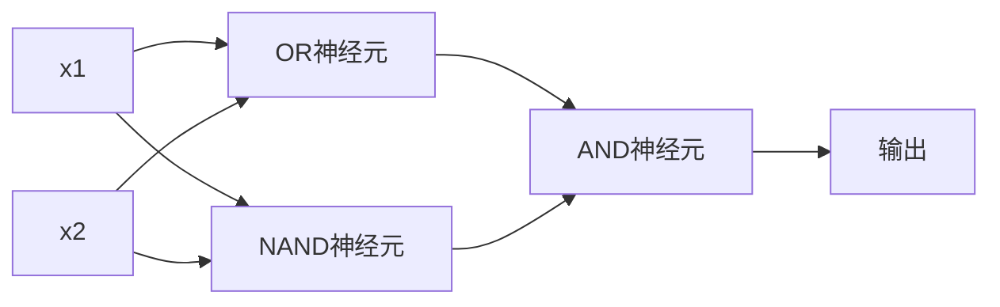

# 感知机

> 感知机是神经网络原子。打开它发现权重、偏置和决策。

**类型:** 构建
**语言:** Python
**前置要求:** 第1阶段 (线性代数直觉)
**时间:** ~60分钟

## 学习目标

- 在Python从零实现感知机，包含权重更新规则和阶跃激活函数
- 解释为何单个感知机只能解线性可分问题并演示XOR失败案例
- 组合OR、NAND和AND门构多层感知机解XOR
- 用sigmoid激活和反向传播训练两层网络自动学XOR

## 问题背景

你知道向量点积。你知道矩阵变换输入到输出。但机器如何*学*用哪变换？

感知机回答这。它是最简学习机: 取些输入，乘权重，加偏置，做二元决策。然后调。就这。每个神经网络都是这想法堆叠。

理解感知机意味理解代码中"学习"实际意味什么: 调数直到输出匹配现实。

## 概念讲解

### 一神经元，一决策

感知机取n输入，各乘权重，求和，加偏置，过激活函数。



阶跃函数残忍: 若加权加偏置 >= 0，输出1。否则0。

```
step(z) = 1  若 z >= 0
           0  若 z < 0
```

这是线性分类器。权重偏置定义线(或高维超平面)分输入空间成两区。

### 决策边界

两输入，感知机画线过2D空间:

```
  x2
  ┤
  │  类1        /
  │    (0)          /
  │                /
  │               / w1·x1 + w2·x2 + b = 0
  │              /
  │             /     类2
  │            /        (1)
  ┼───────────/──────────── x1
```

线一侧全输出0。另侧全输出1。训练移线直到正确分类。

### 学习规则

感知机学习规则简单:

```
每训练例(x, y_true):
    y_pred = predict(x)
    error = y_true - y_pred

    每权重:
        w_i = w_i + learning_rate * error * x_i
    bias = bias + learning_rate * error
```

若预测正确，error = 0，无变。若预测0但应为1，权重增。若预测1但应为0，权重减。学习率控每调多大。

### XOR问题

这断。看这些逻辑门:

```
AND门:           OR门:            XOR门:
x1  x2  出       x1  x2  出       x1  x2  出
0   0   0        0   0   0        0   0   0
0   1   0        0   1   1        0   1   1
1   0   0        1   0   1        1   0   1
1   1   1        1   1   1        1   1   0
```

AND和OR线性可分: 可画单线分0和1。XOR非。无单线可分[0,1]和[1,0]从[0,0]和[1,1]。

```
AND (可分):        XOR (不可分):

  x2                      x2
  1 ┤  0     1            1 ┤  1     0
    │     /                 │
  0 ┤  0 / 0              0 ┤  0     1
    ┼──/──────── x1         ┼──────────── x1
       线可行!          无单线可行!
```

这是根本限。单感知机只能解线性可分问题。Minsky和Papert1969证这几乎杀神经网络研究十年。

解: 感知机堆成层。多层感知机可解XOR组合两线性决策成非线性。

## 构建

### 步骤1: 感知机类

```python
class Perceptron:
    def __init__(self, n_inputs, learning_rate=0.1):
        self.weights = [0.0] * n_inputs
        self.bias = 0.0
        self.lr = learning_rate

    def predict(self, inputs):
        total = sum(w * x for w, x in zip(self.weights, inputs))
        total += self.bias
        return 1 if total >= 0 else 0

    def train(self, training_data, epochs=100):
        for epoch in range(epochs):
            errors = 0
            for inputs, target in training_data:
                prediction = self.predict(inputs)
                error = target - prediction
                if error != 0:
                    errors += 1
                    for i in range(len(self.weights)):
                        self.weights[i] += self.lr * error * inputs[i]
                    self.bias += self.lr * error
            if errors == 0:
                print(f"收敛于epoch {epoch + 1}")
                return
        print(f"{epochs} epochs后未收敛")
```

### 步骤2: 在逻辑门训练

```python
and_data = [
    ([0, 0], 0),
    ([0, 1], 0),
    ([1, 0], 0),
    ([1, 1], 1),
]

or_data = [
    ([0, 0], 0),
    ([0, 1], 1),
    ([1, 0], 1),
    ([1, 1], 1),
]

not_data = [
    ([0], 1),
    ([1], 0),
]

print("=== AND门 ===")
p_and = Perceptron(2)
p_and.train(and_data)
for inputs, _ in and_data:
    print(f"  {inputs} -> {p_and.predict(inputs)}")

print("\n=== OR门 ===")
p_or = Perceptron(2)
p_or.train(or_data)
for inputs, _ in or_data:
    print(f"  {inputs} -> {p_or.predict(inputs)}")

print("\n=== NOT门 ===")
p_not = Perceptron(1)
p_not.train(not_data)
for inputs, _ in not_data:
    print(f"  {inputs} -> {p_not.predict(inputs)}")
```

### 步骤3: 看XOR失败

```python
xor_data = [
    ([0, 0], 0),
    ([0, 1], 1),
    ([1, 0], 1),
    ([1, 1], 0),
]

print("\n=== XOR门(单感知机) ===")
p_xor = Perceptron(2)
p_xor.train(xor_data, epochs=1000)
for inputs, expected in xor_data:
    result = p_xor.predict(inputs)
    status = "OK" if result == expected else "错"
    print(f"  {inputs} -> {result} (期望 {expected}) {status}")
```

永不收敛。这是硬证单感知机不能学XOR。

### 步骤4: 两层解XOR

技巧: XOR = (x1 OR x2) AND NOT (x1 AND x2)。组三感知机:



```python
def xor_network(x1, x2):
    or_neuron = Perceptron(2)
    or_neuron.weights = [1.0, 1.0]
    or_neuron.bias = -0.5

    nand_neuron = Perceptron(2)
    nand_neuron.weights = [-1.0, -1.0]
    nand_neuron.bias = 1.5

    and_neuron = Perceptron(2)
    and_neuron.weights = [1.0, 1.0]
    and_neuron.bias = -1.5

    hidden1 = or_neuron.predict([x1, x2])
    hidden2 = nand_neuron.predict([x1, x2])
    output = and_neuron.predict([hidden1, hidden2])
    return output


print("\n=== XOR门(多层网络) ===")
for inputs, expected in xor_data:
    result = xor_network(inputs[0], inputs[1])
    print(f"  {inputs} -> {result} (期望 {expected})")
```

四例全对。感知机堆成层创单感知机不能产决策边界。

### 步骤5: 训练两层网络

步骤4手调权重。这XOR工作，但实问题你不知权重解。修复: 用sigmoid替代阶跃函数用反向传播自动学权重。

```python
class TwoLayerNetwork:
    def __init__(self, learning_rate=0.5):
        import random
        random.seed(0)
        self.w_hidden = [[random.uniform(-1, 1), random.uniform(-1, 1)] for _ in range(2)]
        self.b_hidden = [random.uniform(-1, 1), random.uniform(-1, 1)]
        self.w_output = [random.uniform(-1, 1), random.uniform(-1, 1)]
        self.b_output = random.uniform(-1, 1)
        self.lr = learning_rate

    def sigmoid(self, x):
        import math
        x = max(-500, min(500, x))
        return 1.0 / (1.0 + math.exp(-x))

    def forward(self, inputs):
        self.inputs = inputs
        self.hidden_outputs = []
        for i in range(2):
            z = sum(w * x for w, x in zip(self.w_hidden[i], inputs)) + self.b_hidden[i]
            self.hidden_outputs.append(self.sigmoid(z))
        z_out = sum(w * h for w, h in zip(self.w_output, self.hidden_outputs)) + self.b_output
        self.output = self.sigmoid(z_out)
        return self.output

    def train(self, training_data, epochs=10000):
        for epoch in range(epochs):
            total_error = 0
            for inputs, target in training_data:
                output = self.forward(inputs)
                error = target - output
                total_error += error ** 2

                d_output = error * output * (1 - output)

                saved_w_output = self.w_output[:]
                hidden_deltas = []
                for i in range(2):
                    h = self.hidden_outputs[i]
                    hd = d_output * saved_w_output[i] * h * (1 - h)
                    hidden_deltas.append(hd)

                for i in range(2):
                    self.w_output[i] += self.lr * d_output * self.hidden_outputs[i]
                self.b_output += self.lr * d_output

                for i in range(2):
                    for j in range(len(inputs)):
                        self.w_hidden[i][j] += self.lr * hidden_deltas[i] * inputs[j]
                    self.b_hidden[i] += self.lr * hidden_deltas[i]
```

```python
net = TwoLayerNetwork(learning_rate=2.0)
net.train(xor_data, epochs=10000)
for inputs, expected in xor_data:
    result = net.forward(inputs)
    predicted = 1 if result >= 0.5 else 0
    print(f"  {inputs} -> {result:.4f} (舍入: {predicted}, 期望 {expected})")
```

步骤4两关键差。一，sigmoid替阶跃 -- 平滑，梯度存在。二，`train`法从输出到隐藏层后传误差，调每权重按其对误差贡献比例。那是20行反向传播。

这是通课程03桥。`d_output`和`hidden_deltas`后数学是链规则在网络图应用。我们正推。

## 使用

你刚从零建一切在一导入:

```python
from sklearn.linear_model import Perceptron as SkPerceptron
import numpy as np

X = np.array([[0,0],[0,1],[1,0],[1,1]])
y = np.array([0, 0, 0, 1])

clf = SkPerceptron(max_iter=100, tol=1e-3)
clf.fit(X, y)
print([clf.predict([x])[0] for x in X])
```

五行。你30行`Perceptron`类做同。sklearn版加收敛检查、多损失函数、稀疏输入支持 -- 但核循环等: 加权和、阶跃函数、误差权重更新。

真差距在规模。生产网络变什么:

- 阶跃函数成sigmoid、ReLU或其他平滑激活
- 权重用反向传播自动学(课程03)
- 层更深: 3、10、100+层
- 同原则: 每层从前层输出创新特征

单感知机只能画直线。堆它们，你可画任何形状。

## 交付成果

本课程产生:
- `outputs/skill-perceptron.md` - 覆盖何时需单层vs多层架构技能

## 练习题

1. 在NAND门训练感知机(通用门 -- 任何逻辑电路可从NAND建)。验证其权重偏置成有效决策边界。
2. 改Perceptron类追踪每epoch决策边界(w1*x1 + w2*x2 + b = 0)。打印AND门训练时线如何移。
3. 建3输入感知机仅当至少2输入为1时输出1(多数投票函数)。这线性可分吗？为何？

## 关键术语

| 术语 | 人们怎么说 | 实际含义 |
|------|----------------|----------------------|
| 感知机 | "假神经元" | 线性分类器: 输入权重点积，加偏置，过阶跃函数 |
| 权重 | "输入多重要" | 乘各输入贡献决策的比例 |
| 偏置 | "阈值" | 移决策边界常量，让感知机零输入也激活 |
| 激活函数 | "压值东西" | 加权和后应用函数 -- 感知机阶跃，现代网络sigmoid/ReLU |
| 线性可分 | "可画线分它们" | 单超平面可完美分类数据集 |
| XOR问题 | "感知机不能做" | 证单层网络不能学非线性可分函数 |
| 决策边界 | "分类器切换处" | 超平面w*x + b = 0分输入空间成两类 |
| 多层感知机 | "真神经网络" | 感知机堆成层，每层输出馈下层输入 |

## 延伸阅读

- Frank Rosenblatt, "The Perceptron: A Probabilistic Model for Information Storage and Organization in the Brain" (1958) -- 开一切原始论文
- Minsky & Papert, "Perceptrons" (1969) -- 证XOR单层网络不可解并杀感知机研究十年的书
- Michael Nielsen, "Neural Networks and Deep Learning", Chapter 1 (http://neuralnetworksanddeeplearning.com/) -- 免在线，感知机如何组成网络最佳视觉解释