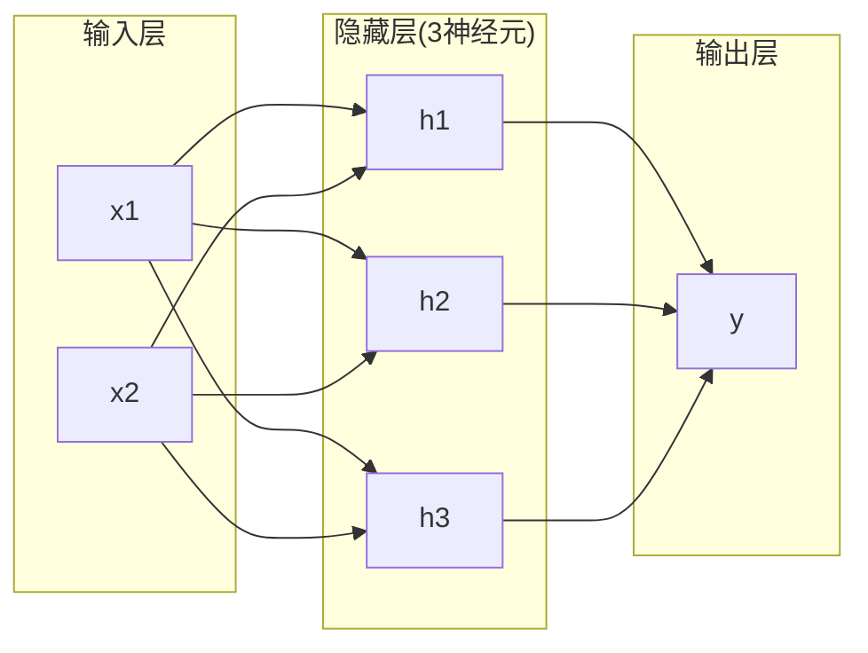
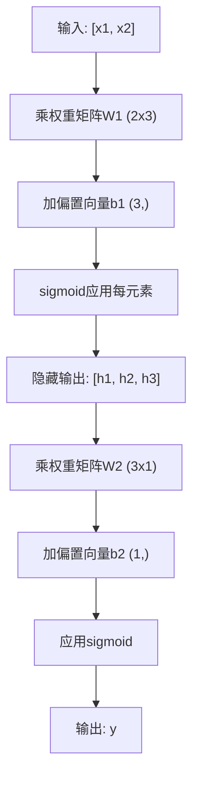

# 多层网络和前向传播

> 一个神经元画一条线。堆叠它们，你可以画任何东西。

**类型:** 构建
**语言:** Python
**前置要求:** 第1阶段 (数学基础), 课程03.01 (感知机)
**时间:** ~90分钟

## 学习目标

- 从零构带Layer和Network类多层网络执行完整前向传播
- 追踪矩阵维度过每层并识别形状不配
- 解释堆非线性激活如何使网络学弯曲决策边界
- 用手调sigmoid权重2-2-1架构解XOR问题

## 问题背景

单神经元是线画家。就这。一穿数据直线。AI每实问题 -- 图识别、语言理解、玩围棋 -- 需曲线。神经元堆成层是你得曲线方法。

1969，Minsky和Papert证这限制致命: 单层网络不能学XOR。非"挣扎学" -- 数学不能。XOR真值表放[0,1]和[1,0]一侧，[0,0]和[1,1]另侧。无单线分它们。

这杀神经网络资金超十年。解后显: 停用一层。神经元堆成层。让首层刻输入空间成新特征，让次层组这些特征成单线不能做决策。

那堆是多层网络。它是今日每生产深度学习模型基础。前向传播 -- 数据从输入流过隐藏层到输出 -- 是你需建首事在他工作前。

## 概念讲解

### 层: 输入、隐藏、输出

多层网络有三类层:

**输入层** -- 非真层。它持原始数据。两特征意味两输入节点。无计算发生这。

**隐藏层** -- 工作发生处。每神经元取前层每输出，用权重偏置，然后过激活函数。"隐藏"因你永不在训练数据直接见这些值。

**输出层** -- 最终答案。二元分类，一神经元sigmoid。多类，每类一神经元。



这是2-3-1网络。两输入，三隐藏神经元，一输出。每连接带权重。每神经元(除输入)带偏置。

每层产称隐藏状态向量。文本，隐藏状态增维 -- 编词为768数捕语义义。图像，它们减维 -- 压百万像素成可控表示。隐藏状态是学习住处。

### 神经元和激活

每神经元做三事:

1. 每输入乘其对应权重
2. 积求和加偏置
3. 和过激活函数

暂，激活sigmoid:

```
sigmoid(z) = 1 / (1 + e^(-z))
```

Sigmoid压任何数入范围(0, 1)。大正输入推向1。大负输入推向0。零映射0.5。这平滑曲线使学习可能 -- 异于感知机硬阶跃，sigmoid处有梯度。

### 前向传播: 数据如何流

前向传播推输入数据过网络，层层，直到达输出。无学习在前向传播时发生。它纯计算: 乘、加、激活、重复。



每层，三操作序发:

```
z = W * input + b       (线性变换)
a = sigmoid(z)           (激活)
```

一层输出成下层输入。那是整前向传播。

### 矩阵维度

追踪维度是深度学习最重要调试技能。这是2-3-1网络:

| 步 | 操作 | 维度 | 结果形状 |
|------|-----------|------------|-------------|
| 输入 | x | -- | (2,) |
| 隐藏线性 | W1 * x + b1 | W1: (3, 2), b1: (3,) | (3,) |
| 隐藏激活 | sigmoid(z1) | -- | (3,) |
| 输出线性 | W2 * h + b2 | W2: (1, 3), b2: (1,) | (1,) |
| 输出激活 | sigmoid(z2) | -- | (1,) |

规则: k层权重矩阵W形(neurons_in_layer_k, neurons_in_layer_k_minus_1)。行匹配当前层。列匹配前层。若形不对，你有bug。

### 通用近似定理

1989，George Cybenko证某惊人事: 带单隐藏层和够神经元神经网络可近似任何连续函数至任何期精度。

这不意味单隐藏层总最好。它意味架构理论上能。实践，更深网络(更多层，更少神经元每层)学同函数参数远少于浅宽网络。那是为何深度学习工作。

直觉: 隐藏层每神经元学一"凸"或特征。够凸放对位置可近似任何平滑曲线。更多神经元，更多凸，更好近似。


### 组合性

神经网络可组合。你可堆它们、链它们、并行跑。Whisper模型用编码网络处理音频和分离解码网络生成文本。现代LLM仅解码。BERT仅编码。T5编码解码。架构选择定模型能做什么。

## 构建

纯Python。无numpy。每矩阵操作从零写。

### 步骤1: Sigmoid激活

```python
import math

def sigmoid(x):
    x = max(-500.0, min(500.0, x))
    return 1.0 / (1.0 + math.exp(-x))
```

夹[-500, 500]防溢。`math.exp(500)`大但有限。`math.exp(1000)`无穷。

### 步骤2: Layer类

深度学习最重要操作是矩阵乘。每层、每注意力头、每前向传播 -- 都是matmul。线性层取输入向量，乘权重矩阵，加偏置向量: y = Wx + b。那单方程是神经网络90%计算。

层持权重矩阵和偏置向量。其forward法取输入向量返回激活输出。

```python
class Layer:
    def __init__(self, n_inputs, n_neurons, weights=None, biases=None):
        if weights is not None:
            self.weights = weights
        else:
            import random
            self.weights = [
                [random.uniform(-1, 1) for _ in range(n_inputs)]
                for _ in range(n_neurons)
            ]
        if biases is not None:
            self.biases = biases
        else:
            self.biases = [0.0] * n_neurons

    def forward(self, inputs):
        self.last_input = inputs
        self.last_output = []
        for neuron_idx in range(len(self.weights)):
            z = sum(
                w * x for w, x in zip(self.weights[neuron_idx], inputs)
            )
            z += self.biases[neuron_idx]
            self.last_output.append(sigmoid(z))
        return self.last_output
```

权重矩阵形(n_neurons, n_inputs)。每行是一神经元跨所有输入权重。forward法循环神经元，算加权加偏置，用sigmoid，集结果。

### 步骤3: Network类

网络是层列表。前向传播链它们: k层输出馈入k+1层。

```python
class Network:
    def __init__(self, layers):
        self.layers = layers

    def forward(self, inputs):
        current = inputs
        for layer in self.layers:
            current = layer.forward(current)
        return current
```

那是整前向传播。四行逻辑。数据入，流过每层，出另侧。

### 步骤4: XOR手调权重

课程01，我们组OR、NAND和AND感知机解XOR。现用Layer和Network类做同。2-2-1架构: 两输入，两隐藏神经元，一输出。

```python
hidden = Layer(
    n_inputs=2,
    n_neurons=2,
    weights=[[20.0, 20.0], [-20.0, -20.0]],
    biases=[-10.0, 30.0],
)

output = Layer(
    n_inputs=2,
    n_neurons=1,
    weights=[[20.0, 20.0]],
    biases=[-30.0],
)

xor_net = Network([hidden, output])

xor_data = [
    ([0, 0], 0),
    ([0, 1], 1),
    ([1, 0], 1),
    ([1, 1], 0),
]

for inputs, expected in xor_data:
    result = xor_net.forward(inputs)
    predicted = 1 if result[0] >= 0.5 else 0
    print(f"  {inputs} -> {result[0]:.6f} (舍入: {predicted}, 期望: {expected})")
```

大权重(20, -20)使sigmoid像阶跃函数。首隐藏神经元近似OR。次近似NAND。输出神经元组它们成AND，即XOR。

### 步骤5: 圆分类

更难问题: 分类2D点内或外半径0.5中心原点圆。这需弯曲决策边界 -- 单感知机不可能。

```python
import random
import math

random.seed(42)

data = []
for _ in range(200):
    x = random.uniform(-1, 1)
    y = random.uniform(-1, 1)
    label = 1 if (x * x + y * y) < 0.25 else 0
    data.append(([x, y], label))

circle_net = Network([
    Layer(n_inputs=2, n_neurons=8),
    Layer(n_inputs=8, n_neurons=1),
])
```

随机权重，网络不会好分类。但前向传播仍跑。这是点 -- 前向传播就是计算。学对权重是反向传播，课程03来。

```python
correct = 0
for inputs, expected in data:
    result = circle_net.forward(inputs)
    predicted = 1 if result[0] >= 0.5 else 0
    if predicted == expected:
        correct += 1

print(f"随机权重精度: {correct}/{len(data)} ({100*correct/len(data):.1f}%)")
```

随机权重给差精度 -- 常劣于猜多数类。训练后(课程03)，同架构8隐藏神经元将画弯曲边界分内外。

## 使用

PyTorch四行做上一切:

```python
import torch
import torch.nn as nn

model = nn.Sequential(
    nn.Linear(2, 8),
    nn.Sigmoid(),
    nn.Linear(8, 1),
    nn.Sigmoid(),
)

x = torch.tensor([[0.0, 0.0], [0.0, 1.0], [1.0, 0.0], [1.0, 1.0]])
output = model(x)
print(output)
```

`nn.Linear(2, 8)`是你Layer类: 权重矩阵形(8, 2)，偏置向量形(8,)。`nn.Sigmoid()`是你sigmoid函数元素应用。`nn.Sequential`是你Network类: 链层序。

差是速度和规模。PyTorchGPU跑，处理百万样本批，自动算反向传播梯度。但前向传播逻辑等你刚从零建。

## 交付成果

本课程产设计网络架构可复用提示词:

- `outputs/prompt-network-architect.md`

当你需定多少层、多少神经元每层、哪些激活函数对给定问题用它。

## 练习题

1. 建2-4-2-1网络(两隐藏层)并在XOR数据用随机权重跑前向传播。打印中间隐藏层输出看表示每层如何变换。

2. 改圆分类器隐藏层大小从8到2，然后到32。各用随机权重跑前向传播。隐藏神经元数改输出范围或分布吗？为何？

3. 在Network类实现`count_parameters`法返回总可训练权重偏置数。在784-256-128-10网络(经典MNIST架构)测。有多少参数？

4. 建3-4-4-2网络前向传播。喂RGB颜色值(归一化0-1)并观察两输出。这是两类简单颜色分类器架构。

5. 用"泄漏阶跃"函数替sigmoid: 若z < 0返回0.01 * z，否则1.0。在XOR用步骤4同手调权重跑前向传播。仍工作吗？为何平滑sigmoid优于硬截？

## 关键术语

| 术语 | 人们怎么说 | 实际含义 |
|------|----------------|----------------------|
| 前向传播 | "跑模型" | 推输入过每层 -- 乘权重、加偏置、激活 -- 产输出 |
| 隐藏层 | "中间部分" | 输入输出间任何层，值不直接在数据观察 |
| 多层网络 | "深度神经网络" | 神经元层层序堆，每层输出馈下层输入 |
| 激活函数 | "非线性" | 线性变换后应用函数，引曲线入决策边界 |
| Sigmoid | "S曲线" | sigma(z) = 1/(1+e^(-z))，压任何实数入(0,1)，平滑处处可微 |
| 权重矩阵 | "参数" | 形(current_layer_neurons, previous_layer_neurons)矩阵W含可学习连接强度 |
| 偏置向量 | "偏移" | 矩阵乘后加向量，让神经元全输入零也激活 |
| 通用近似 | "神经网络可学任何" | 单隐藏层够神经元可近似任何连续函数 -- 但"够"可意味数十亿 |
| 线性变换 | "矩阵乘步" | z = W * x + b，激活前计算，映射输入到新空间 |
| 决策边界 | "分类器切换处" | 输入空间网络输出跨分类阈值表面 |

## 延伸阅读

- Michael Nielsen, "Neural Networks and Deep Learning", Chapter 1-2 (http://neuralnetworksanddeeplearning.com/) -- 前向传播和网络结构最清晰免费解释，带交互可视化
- Cybenko, "Approximation by Superpositions of a Sigmoidal Function" (1989) -- 原始通用近似定理论文，惊读
- 3Blue1Brown, "But what is a neural network?" (https://www.youtube.com/watch?v=aircAruvnKk) -- 20分钟层、权重和前向传播视觉走建正确心智模型
- Goodfellow, Bengio, Courville, "Deep Learning", Chapter 6 (https://www.deeplearningbook.org/) -- 多层网络标准参考，免在线