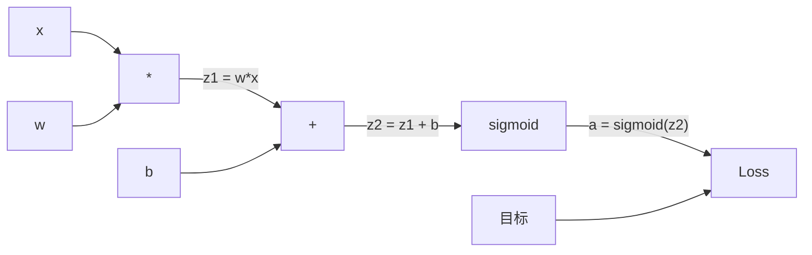
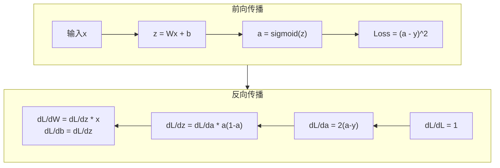
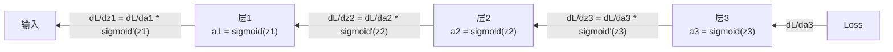

# 从零反向传播

> 反向传播是使学习成为可能的算法。没有它，神经网络只是昂贵的随机数生成器。

**类型:** 构建
**语言:** Python
**前置要求:** 课程03.02 (多层网络)
**时间:** ~120分钟

## 学习目标

- 实现Value基autograd引擎建计算图用拓扑排序算梯度
- 用链规则推导加、乘和sigmoid反向传播
- 仅用从零反向传播引擎在XOR和圆分类训练多层网络
- 识别深sigmoid网络消失梯度问题并解释为何梯度指数缩

## 问题背景

你网络有单隐藏层768输入3072输出。那是2,359,296权重。它做错预测。哪些权重致错？单测每权重意味2.3百万前向传播。反向传播一反向传播算全2.3百万梯度。那非优化。那是可训练和不可能差。

朴素方法: 取一权重，微推，重跑前向传播，测损失升降。那给你该权重梯度。现对网络每权重做。乘千训练步和百万数据点。你需地质时间训练有用东西。

反向传播解这。一前向，一反向，全梯度算。技巧是链规则从微积分，系统应用计算图。这是使深度学习实用算法。无它，我们仍困玩具问题。

## 概念讲解

### 链规则，应用网络

你在第1阶段课程05见链规则。快回顾: 若y = f(g(x))，则dy/dx = f'(g(x)) * g'(x)。你链乘导数。

神经网络，"链"是从输入到损失操作序列。每层用权重、加偏置、过激活。损失函数比最终输出到目标。反向传播向后追链，算每操作如何贡献误差。

### 计算图

每前向传播建图。每节点是操作(乘、加、sigmoid)。每边前携值后携梯度。



前向传播: 值左流右。x和w产z1 = w*x。加b得z2。Sigmoid给激活a。用损失函数比a到目标y。

反向传播: 梯度右流左。从dL/da开始(损失如何随激活变)。乘da/dz2 (sigmoid导)。那给dL/dz2。分成dL/db (等dL/dz2，因z2 = z1 + b)和dL/dz1。然后dL/dw = dL/dz1 * x和dL/dx = dL/dz1 * w。

图每节点反向传播一职: 取上流梯度，乘其局部导，传下。

### 前向vs反向



前向传播存每中间值: z、a、每层输入。反向传播需这些存值算梯度。这是反向传播心内存计算权衡。你换内存(存激活)为速度(一遍非百万)。

### 梯度流过网络

对3层网络，梯度链过每层:



每层，梯度乘sigmoid导。Sigmoid导是a * (1 - a)，最大0.25(当a = 0.5)。三层深，梯度乘最多0.25^3 = 0.0156。十层深: 0.25^10 = 0.000001。

### 消失梯度

这是消失梯度问题。Sigmoid压其输出0和1间。其导总小于0.25。叠够sigmoid层梯度缩到无。早层几乎不学因它们收近零梯度。

```
sigmoid(z):     输出范围[0, 1]
sigmoid'(z):    最大值0.25 (在z = 0)

5层后:   梯度 * 0.25^5 = 0.001x原始
10层后:  梯度 * 0.25^10 = 0.000001x原始
```

这是为何深sigmoid网络几乎不可能训练。修复 -- ReLU及其变体 -- 是课程04主题。暂，理解反向传播完美工作。问题是它工作穿什么。

### 推导2层网络梯度

输入x、隐藏层sigmoid、输出层sigmoid、MSE损失网络具体数学。

前向传播:
```
z1 = W1 * x + b1
a1 = sigmoid(z1)
z2 = W2 * a1 + b2
a2 = sigmoid(z2)
L = (a2 - y)^2
```

反向传播(一步步用链规则):
```
dL/da2 = 2(a2 - y)
da2/dz2 = a2 * (1 - a2)
dL/dz2 = dL/da2 * da2/dz2 = 2(a2 - y) * a2 * (1 - a2)

dL/dW2 = dL/dz2 * a1
dL/db2 = dL/dz2

dL/da1 = dL/dz2 * W2
da1/dz1 = a1 * (1 - a1)
dL/dz1 = dL/da1 * da1/dz1

dL/dW1 = dL/dz1 * x
dL/db1 = dL/dz1
```

每梯度是局部导追回损失乘积。那是反向传播全部。

## 构建

### 步骤1: Value节点

我们计算每数成Value。它存数据、梯度、和如何创(所以它知如何后算梯度)。

```python
class Value:
    def __init__(self, data, children=(), op=''):
        self.data = data
        self.grad = 0.0
        self._backward = lambda: None
        self._children = set(children)
        self._op = op

    def __repr__(self):
        return f"Value(data={self.data:.4f}, grad={self.grad:.4f})"
```

暂无梯度(0.0)。暂无反向函数(无操作)。`_children`追哪些Values产这，所以后可拓扑排序图。

### 步骤2: 带反向函数操作

每操作创新Value并定梯度如何后流。

```python
def __add__(self, other):
    other = other if isinstance(other, Value) else Value(other)
    out = Value(self.data + other.data, (self, other), '+')

    def _backward():
        self.grad += out.grad
        other.grad += out.grad

    out._backward = _backward
    return out

def __mul__(self, other):
    other = other if isinstance(other, Value) else Value(other)
    out = Value(self.data * other.data, (self, other), '*')

    def _backward():
        self.grad += other.data * out.grad
        other.grad += self.data * out.grad

    out._backward = _backward
    return out
```

加: d(a+b)/da = 1, d(a+b)/db = 1。所以两输入直接得输出梯度。

乘: d(a*b)/da = b, d(a*b)/db = a。每输入得另值乘输出梯度。

`+=`关键。Value可用多操作。其梯度是全路径梯度总和。

### 步骤3: Sigmoid和损失

```python
import math

def sigmoid(self):
    x = self.data
    x = max(-500, min(500, x))
    s = 1.0 / (1.0 + math.exp(-x))
    out = Value(s, (self,), 'sigmoid')

    def _backward():
        self.grad += (s * (1 - s)) * out.grad

    out._backward = _backward
    return out
```

Sigmoid导: sigmoid(x) * (1 - sigmoid(x))。我们前向传播算sigmoid(x) = s。重用。无额外工作。

```python
def mse_loss(predicted, target):
    diff = predicted + Value(-target)
    return diff * diff
```

单输出MSE: (predicted - target)^2。我们用加负Value表示减。

### 步骤4: 反向传播

拓扑排序保我们正确顺序处理节点 -- 节点梯度完全累积前我们传播穿它。

```python
def backward(self):
    topo = []
    visited = set()

    def build_topo(v):
        if v not in visited:
            visited.add(v)
            for child in v._children:
                build_topo(child)
            topo.append(v)

    build_topo(self)
    self.grad = 1.0
    for v in reversed(topo):
        v._backward()
```

从损失开始(梯度 = 1.0，因dL/dL = 1)。走后过排序图。每节点`_backward`推梯度到其子。

### 步骤5: Layer和Network

```python
import random

class Neuron:
    def __init__(self, n_inputs):
        scale = (2.0 / n_inputs) ** 0.5
        self.weights = [Value(random.uniform(-scale, scale)) for _ in range(n_inputs)]
        self.bias = Value(0.0)

    def __call__(self, x):
        act = sum((wi * xi for wi, xi in zip(self.weights, x)), self.bias)
        return act.sigmoid()

    def parameters(self):
        return self.weights + [self.bias]


class Layer:
    def __init__(self, n_inputs, n_outputs):
        self.neurons = [Neuron(n_inputs) for _ in range(n_outputs)]

    def __call__(self, x):
        out = [n(x) for n in self.neurons]
        return out[0] if len(out) == 1 else out

    def parameters(self):
        params = []
        for n in self.neurons:
            params.extend(n.parameters())
        return params


class Network:
    def __init__(self, sizes):
        self.layers = []
        for i in range(len(sizes) - 1):
            self.layers.append(Layer(sizes[i], sizes[i + 1]))

    def __call__(self, x):
        for layer in self.layers:
            x = layer(x)
            if not isinstance(x, list):
                x = [x]
        return x[0] if len(x) == 1 else x

    def parameters(self):
        params = []
        for layer in self.layers:
            params.extend(layer.parameters())
        return params

    def zero_grad(self):
        for p in self.parameters():
            p.grad = 0.0
```

Neuron取输入、算加权加偏置、用sigmoid。权重初始化按sqrt(2/n_inputs)缩防深网络sigmoid饱和。Layer是Neuron列表。Network是Layer列表。`parameters()`法集所有可学习Values所以我们可更新它们。

### 步骤6: 在XOR训练

```python
random.seed(42)
net = Network([2, 4, 1])

xor_data = [
    ([0.0, 0.0], 0.0),
    ([0.0, 1.0], 1.0),
    ([1.0, 0.0], 1.0),
    ([1.0, 1.0], 0.0),
]

learning_rate = 1.0

for epoch in range(1000):
    total_loss = Value(0.0)
    for inputs, target in xor_data:
        x = [Value(i) for i in inputs]
        pred = net(x)
        loss = mse_loss(pred, target)
        total_loss = total_loss + loss

    net.zero_grad()
    total_loss.backward()

    for p in net.parameters():
        p.data -= learning_rate * p.grad

    if epoch % 100 == 0:
        print(f"Epoch {epoch:4d} | Loss: {total_loss.data:.6f}")

print("\nXOR结果:")
for inputs, target in xor_data:
    x = [Value(i) for i in inputs]
    pred = net(x)
    print(f"  {inputs} -> {pred.data:.4f} (期望 {target})")
```

看损失降。从随机预测到正确XOR输出，全由反向传播算梯度推权重正确方向驱动。

### 步骤7: 圆分类

课程02，你手调圆分类权重。现让网络学它们。

```python
random.seed(7)

def generate_circle_data(n=100):
    data = []
    for _ in range(n):
        x1 = random.uniform(-1.5, 1.5)
        x2 = random.uniform(-1.5, 1.5)
        label = 1.0 if x1 * x1 + x2 * x2 < 1.0 else 0.0
        data.append(([x1, x2], label))
    return data

circle_data = generate_circle_data(80)

circle_net = Network([2, 8, 1])
learning_rate = 0.5

for epoch in range(2000):
    random.shuffle(circle_data)
    total_loss_val = 0.0
    for inputs, target in circle_data:
        x = [Value(i) for i in inputs]
        pred = circle_net(x)
        loss = mse_loss(pred, target)
        circle_net.zero_grad()
        loss.backward()
        for p in circle_net.parameters():
            p.data -= learning_rate * p.grad
        total_loss_val += loss.data

    if epoch % 200 == 0:
        correct = 0
        for inputs, target in circle_data:
            x = [Value(i) for i in inputs]
            pred = circle_net(x)
            predicted_class = 1.0 if pred.data > 0.5 else 0.0
            if predicted_class == target:
                correct += 1
        accuracy = correct / len(circle_data) * 100
        print(f"Epoch {epoch:4d} | Loss: {total_loss_val:.4f} | 精度: {accuracy:.1f}%")
```

我们用在线SGD -- 每样本后更新权重非累积全批。这更快破对称并避全损失景sigmoid饱和。每epoch打乱数据防网络记忆顺序。

无手调。网络自己发现圆决策边界。那是反向传播力: 你定义架构、损失函数、数据。算法解权重。

## 使用

PyTorch几行做上一切。核想法等 -- autograd前向传播建计算图后追算梯度。

```python
import torch
import torch.nn as nn

model = nn.Sequential(
    nn.Linear(2, 4),
    nn.Sigmoid(),
    nn.Linear(4, 1),
    nn.Sigmoid(),
)
optimizer = torch.optim.SGD(model.parameters(), lr=1.0)
criterion = nn.MSELoss()

X = torch.tensor([[0,0],[0,1],[1,0],[1,1]], dtype=torch.float32)
y = torch.tensor([[0],[1],[1],[0]], dtype=torch.float32)

for epoch in range(1000):
    pred = model(X)
    loss = criterion(pred, y)
    optimizer.zero_grad()
    loss.backward()
    optimizer.step()

print("PyTorch XOR结果:")
with torch.no_grad():
    for i in range(4):
        pred = model(X[i])
        print(f"  {X[i].tolist()} -> {pred.item():.4f} (期望 {y[i].item()})")
```

`loss.backward()`是你`total_loss.backward()`。`optimizer.step()`是你手动`p.data -= lr * p.grad`。`optimizer.zero_grad()`是你`net.zero_grad()`。同算法，工业强实现。PyTorch处理GPU加速、混合精度、梯度检查点和百层类型。但反向传播是同链规则应用同计算图。

训练跑前向，然后反向，然后更新权重。推理仅跑前向。无梯度，无更新。这区别重要因推理是生产发生事。当你调API如Claude或GPT，你跑推理 -- 你的提示词前向过网络，token出另端。无权重变。理解反向传播重要因它形网络每权重。

## 交付成果

本课程产生:
- `outputs/prompt-gradient-debugger.md` -- 任何神经网络诊断梯度问题(消失、爆炸、NaN)可复用提示词

## 练习题

1. 加`__sub__`法到Value类(a - b = a + (-1 * b))。然后实现`__neg__`法。验证梯度正确通过与手算简表达式如(a - b)^2比较。

2. 加`relu`法到Value(输出max(0, x)，导是1若x > 0，否则0)。隐藏层替sigmoid用relu并在XOR重训。比较收敛速度。你应该看更快训练 -- 这预览课程04。

3. 在Value实现`__pow__`法对整数幂。用它替`mse_loss`用合适`(predicted - target) ** 2`表达式。验证梯度匹配原实现。

4. 加梯度裁剪到训练循环: 调`backward()`后，裁剪所有梯度到[-1, 1]。训练更深网络(4+层sigmoid)并比较有无裁剪损失曲线。这是你对爆炸梯度首防。

5. 可视化: XOR训练后，打印网络每参数梯度。识别哪层梯度最小。这演示你在概念部分读消失梯度问题。

## 关键术语

| 术语 | 人们怎么说 | 实际含义 |
|------|----------------|----------------------|
| 反向传播 | "网络学习" | 用链规则后过计算图为每权重算dL/dw算法 |
| 计算图 | "网络结构" | 有向无环图节点是操作边携值(前)和梯度(后) |
| 链规则 | "乘导数" | 若y = f(g(x))，则dy/dx = f'(g(x)) * g'(x) -- 反向传播数学基础 |
| 梯度 | "最陡升方向" | 损失对参数偏导 -- 告你如何改参数减损失 |
| 消失梯度 | "深网络不学" | 梯度穿带饱和激活如sigmoid层时指数缩 |
| 前向传播 | "跑网络" | 从输入序应用每层操作存中间值算输出 |
| 反向传播 | "算梯度" | 反序遍历计算图，每节点用链规则累积梯度 |
| 学习率 | "学多快" | 更新权重时控步大小标量: w_new = w_old - lr * gradient |
| 拓扑排序 | "正确顺序" | 图节点排序每节点在其依赖节点后 -- 保梯度传播前完全累积 |
| Autograd | "自动微分" | 前向计算时建计算图自动算梯度系统 -- PyTorch引擎做的 |

## 延伸阅读

- Rumelhart, Hinton & Williams, "Learning representations by back-propagating errors" (1986) -- 使反向传播主流并解锁多层网络训练论文
- 3Blue1Brown, "Neural Networks"系列 (https://www.youtube.com/playlist?list=PLZHQObOWTQDNU6R1_67000Dx_ZCJB-3pi) -- 反向传播和梯度流过网络最佳视觉解释