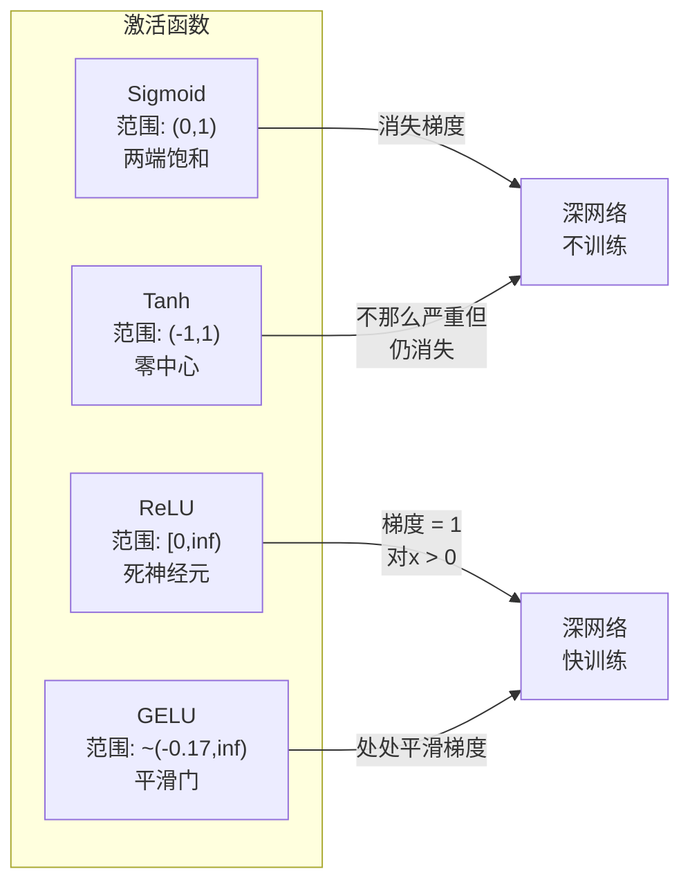
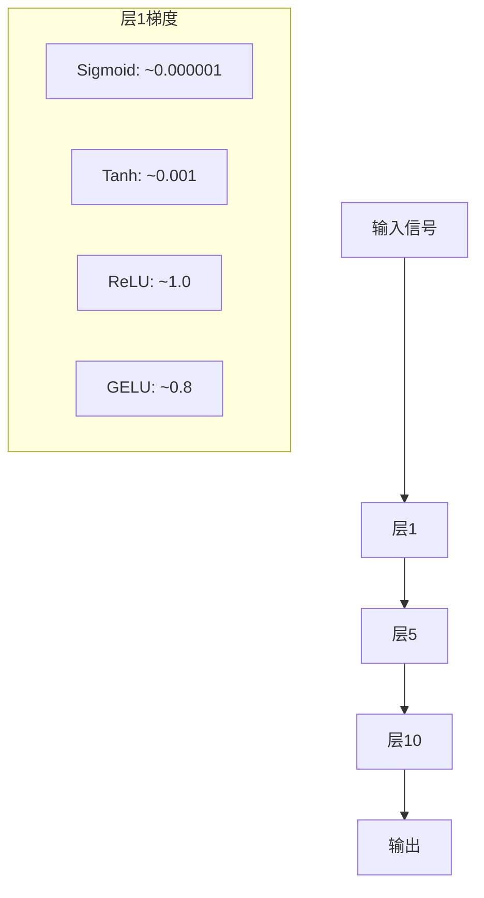
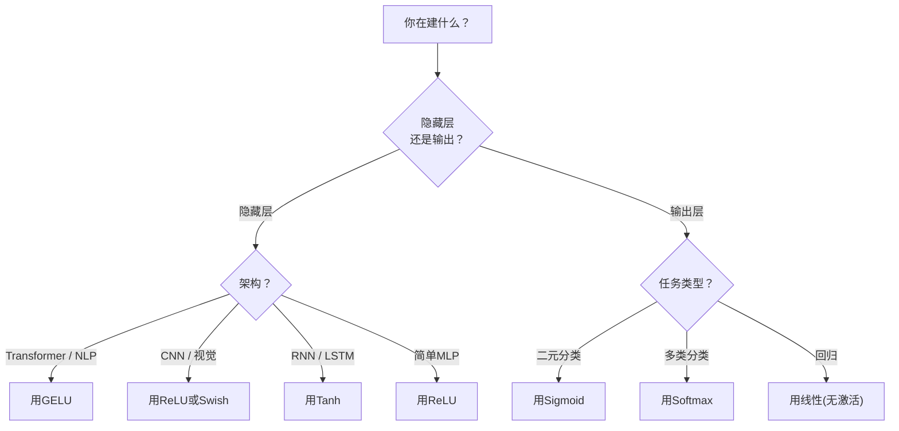

# 激活函数

> 没有非线性，你的100层网络只是花哨的矩阵乘法。激活函数是让神经网络用曲线思考的门。

**类型:** 构建
**语言:** Python
**前置要求:** 课程03.03 (反向传播)
**时间:** ~75分钟

## 学习目标

- 从零实现sigmoid、tanh、ReLU、Leaky ReLU、GELU、Swish和softmax及其导数
- 测量激活幅度过10+层用不同激活诊断消失梯度问题
- 检ReLU网络死神经元并解释为何GELU避这失败模式
- 为给定架构(transformer、CNN、RNN、输出层)选正确激活函数

## 问题背景

叠两线性变换: y = W2(W1x + b1) + b2。展开: y = W2W1x + W2b1 + b2。那只是y = Ax + c -- 单线性变换。不管你叠多少线性层，结果坍塌成一矩阵乘。你100层网络有同单层表示力。

这非理论好奇。它意味深线性网络字面上不能学XOR、不能分类螺旋数据集、不能识别脸。无激活函数，深度是幻觉。

激活函数断线性。它们曲每层输出过非线性函数，给网络弯曲决策边界、近似任意函数、实际学习能力。但选错激活你梯度消到零(深网络sigmoid)、爆到无穷(无小心初始化无界激活)、或神经元永久死(带大负偏ReLU)。激活函数选择直接定你网络是否学习。

## 概念讲解

### 为何非线性必要

矩阵乘可组合。向量乘矩阵A然后矩阵B等价乘AB。这意味叠十线性层数学等价一层带一大矩阵。那些参数、那深度 -- 浪费。你需断链东西。那是激活函数做的。

这是证明。线性层算f(x) = Wx + b。叠两:

```
层1: h = W1 * x + b1
层2: y = W2 * h + b2
```

替换:

```
y = W2 * (W1 * x + b1) + b2
y = (W2 * W1) * x + (W2 * b1 + b2)
y = A * x + c
```

一层。在层间插非线性激活g():

```
h = g(W1 * x + b1)
y = W2 * h + b2
```

现替换断。W2 * g(W1 * x + b1) + b2不能简成单线性变换。网络可表示非线性函数。每带激活加层增表示容量。

### Sigmoid

神经网络原激活函数。

```
sigmoid(x) = 1 / (1 + e^(-x))
```

输出范围: (0, 1)。平滑、可微、映射任何实数到概率样值。

导数:

```
sigmoid'(x) = sigmoid(x) * (1 - sigmoid(x))
```

这导数最大值0.25，发在x = 0。反向传播，梯度层乘。十层sigmoid意味梯度乘最多0.25十次:

```
0.25^10 = 0.000000953674
```

小于原信号百万分之一。这是消失梯度问题。早层梯度成太小权重几乎不更新。网络显学习 -- 损失在后层减 -- 但首层冻结。深sigmoid网络简直不训练。

另问题: sigmoid输出总正(0到1)，意味权重梯度总同号。这梯度下降时致zig-zag。

### Tanh

Sigmoid中心版。

```
tanh(x) = (e^x - e^(-x)) / (e^x + e^(-x))
```

输出范围: (-1, 1)。零中心，消zig-zag问题。

导数:

```
tanh'(x) = 1 - tanh(x)^2
```

最大导数1.0在x = 0 -- sigmoid四倍好。但消失梯度问题仍存在。大正负输入，导数趋零。十层仍压梯度，只是不那么激。

### ReLU: 突破

整流线性单元。Nair和Hinton2010推广深度学习(函数本身回Fukushima1969工作)，它改一切。

```
relu(x) = max(0, x)
```

输出范围: [0, 无穷)。导数简单:

```
relu'(x) = 1  若 x > 0
            0  若 x <= 0
```

正输入无消失梯度。梯度精确1，直过。这是为何深网络变可训练 -- ReLU保梯度幅度跨层。

但有失败模式: 死神经元问题。若神经元加权输入总负(因大负偏或不幸权重初始化)，其输出总零，梯度总零，它从不更新。它永久死。实践，ReLU网络10-40%神经元训练时可死。

### Leaky ReLU

死神经元最简修复。

```
leaky_relu(x) = x        若 x > 0
                alpha * x 若 x <= 0
```

其中alpha小常，典型0.01。负侧有小斜而非零，所以死神经元仍得梯度信号可恢复。

### GELU: 现代默认

高斯误差线性单元。Hendrycks和Gimpel2016引入。BERT、GPT和现代transformer默认激活。

```
gelu(x) = x * Phi(x)
```

其中Phi(x)是标准正态分布累积分布函数。实践用近似:

```
gelu(x) ~= 0.5 * x * (1 + tanh(sqrt(2/pi) * (x + 0.044715 * x^3)))
```

GELU处平滑，允小负值(异于ReLU硬截零)，有概率解释: 它每输入按高斯分布下正可能性权重。这平滑门ReLU在transformer架构好因它供更好梯度流并完全避死神经元问题。

### Swish / SiLU

Ramachandran等2017自门激活通过自动搜索发现。

```
swish(x) = x * sigmoid(x)
```

Swish正式x * sigmoid(x)。Google通过激活函数空间自动搜索发现 -- 神经网络设计神经网络部分。

像GELU，它平滑、非单调、允小负值。差微妙: Swish用sigmoid门GELU用高斯CDF。实践，性能几乎等。Swish用在EfficientNet和些视觉模型。GELU统治语言模型。

### Softmax: 输出激活

非用在隐藏层。Softmax转原始分数(logit)向量成概率分布。

```
softmax(x_i) = e^(x_i) / sum(e^(x_j) 对所有j)
```

每输出0和1间。所有输出总和1。这使其成多类分类标准最终激活。最大logit得最高概率，但异于argmax，softmax可微并保相对置信信息。

### 形状比较



### 梯度流比较



### 何激活何时



## 构建

### 步骤1: 实现所有激活函数及导数

每函数取单浮点返浮点。每导数函数取同输入返梯度。

```python
import math

def sigmoid(x):
    x = max(-500, min(500, x))
    return 1.0 / (1.0 + math.exp(-x))

def sigmoid_derivative(x):
    s = sigmoid(x)
    return s * (1 - s)

def tanh_act(x):
    return math.tanh(x)

def tanh_derivative(x):
    t = math.tanh(x)
    return 1 - t * t

def relu(x):
    return max(0.0, x)

def relu_derivative(x):
    return 1.0 if x > 0 else 0.0

def leaky_relu(x, alpha=0.01):
    return x if x > 0 else alpha * x

def leaky_relu_derivative(x, alpha=0.01):
    return 1.0 if x > 0 else alpha

def gelu(x):
    return 0.5 * x * (1 + math.tanh(math.sqrt(2 / math.pi) * (x + 0.044715 * x ** 3)))

def gelu_derivative(x):
    phi = 0.5 * (1 + math.erf(x / math.sqrt(2)))
    pdf = math.exp(-0.5 * x * x) / math.sqrt(2 * math.pi)
    return phi + x * pdf

def swish(x):
    return x * sigmoid(x)

def swish_derivative(x):
    s = sigmoid(x)
    return s + x * s * (1 - s)

def softmax(xs):
    max_x = max(xs)
    exps = [math.exp(x - max_x) for x in xs]
    total = sum(exps)
    return [e / total for e in exps]
```

### 步骤2: 可视化梯度死处

算-5到5间100等点梯度。打印文本直方图示每激活梯度在哪近零。

```python
def gradient_scan(name, derivative_fn, start=-5, end=5, n=100):
    step = (end - start) / n
    near_zero = 0
    healthy = 0
    for i in range(n):
        x = start + i * step
        g = derivative_fn(x)
        if abs(g) < 0.01:
            near_zero += 1
        else:
            healthy += 1
    pct_dead = near_zero / n * 100
    print(f"{name:15s}: {healthy:3d} 健康, {near_zero:3d} 近零 ({pct_dead:.0f}% 死区)")

gradient_scan("Sigmoid", sigmoid_derivative)
gradient_scan("Tanh", tanh_derivative)
gradient_scan("ReLU", relu_derivative)
gradient_scan("Leaky ReLU", leaky_relu_derivative)
gradient_scan("GELU", gelu_derivative)
gradient_scan("Swish", swish_derivative)
```

### 步骤3: 消失梯度实验

用sigmoid vs ReLU前向传播信号过N层。测激活幅度如何变。

```python
import random

def vanishing_gradient_experiment(activation_fn, name, n_layers=10, n_inputs=5):
    random.seed(42)
    values = [random.gauss(0, 1) for _ in range(n_inputs)]

    print(f"\n{name}过{n_layers}层:")
    for layer in range(n_layers):
        weights = [random.gauss(0, 1) for _ in range(n_inputs)]
        z = sum(w * v for w, v in zip(weights, values))
        activated = activation_fn(z)
        magnitude = abs(activated)
        bar = "#" * int(magnitude * 20)
        print(f"  层{layer+1:2d}: 幅度 = {magnitude:.6f} {bar}")
        values = [activated] * n_inputs

vanishing_gradient_experiment(sigmoid, "Sigmoid")
vanishing_gradient_experiment(relu, "ReLU")
vanishing_gradient_experiment(gelu, "GELU")
```

### 步骤4: 死神经元检测器

创ReLU网络，传随机输入过它，计数多少神经元从不激活。

```python
def dead_neuron_detector(n_inputs=5, hidden_size=20, n_samples=1000):
    random.seed(0)
    weights = [[random.gauss(0, 1) for _ in range(n_inputs)] for _ in range(hidden_size)]
    biases = [random.gauss(0, 1) for _ in range(hidden_size)]

    fire_counts = [0] * hidden_size

    for _ in range(n_samples):
        inputs = [random.gauss(0, 1) for _ in range(n_inputs)]
        for neuron_idx in range(hidden_size):
            z = sum(w * x for w, x in zip(weights[neuron_idx], inputs)) + biases[neuron_idx]
            if relu(z) > 0:
                fire_counts[neuron_idx] += 1

    dead = sum(1 for c in fire_counts if c == 0)
    rarely_fire = sum(1 for c in fire_counts if 0 < c < n_samples * 0.05)
    healthy = hidden_size - dead - rarely_fire

    print(f"\n死神经元报告({hidden_size}神经元, {n_samples}样本):")
    print(f"  死(从不激活):     {dead}")
    print(f"  勉强活(<5%):     {rarely_fire}")
    print(f"  健康:                {healthy}")
    print(f"  死神经元率:       {dead/hidden_size*100:.1f}%")

    for i, c in enumerate(fire_counts):
        status = "死" if c == 0 else "弱" if c < n_samples * 0.05 else "OK"
        bar = "#" * (c * 40 // n_samples)
        print(f"  神经元{i:2d}: {c:4d}/{n_samples}激活 [{status:4s}] {bar}")

dead_neuron_detector()
```

### 步骤5: 训练比较 -- Sigmoid vs ReLU vs GELU

用三不同激活在圆数据集训练同两层网络(圆内点=类1，圆外=类0)。比较收敛速度。

```python
def make_circle_data(n=200, seed=42):
    random.seed(seed)
    data = []
    for _ in range(n):
        x = random.uniform(-2, 2)
        y = random.uniform(-2, 2)
        label = 1.0 if x * x + y * y < 1.5 else 0.0
        data.append(([x, y], label))
    return data


class ActivationNetwork:
    def __init__(self, activation_fn, activation_deriv, hidden_size=8, lr=0.1):
        random.seed(0)
        self.act = activation_fn
        self.act_d = activation_deriv
        self.lr = lr
        self.hidden_size = hidden_size

        self.w1 = [[random.gauss(0, 0.5) for _ in range(2)] for _ in range(hidden_size)]
        self.b1 = [0.0] * hidden_size
        self.w2 = [random.gauss(0, 0.5) for _ in range(hidden_size)]
        self.b2 = 0.0

    def forward(self, x):
        self.x = x
        self.z1 = []
        self.h = []
        for i in range(self.hidden_size):
            z = self.w1[i][0] * x[0] + self.w1[i][1] * x[1] + self.b1[i]
            self.z1.append(z)
            self.h.append(self.act(z))

        self.z2 = sum(self.w2[i] * self.h[i] for i in range(self.hidden_size)) + self.b2
        self.out = sigmoid(self.z2)
        return self.out

    def backward(self, target):
        error = self.out - target
        d_out = error * self.out * (1 - self.out)

        for i in range(self.hidden_size):
            d_h = d_out * self.w2[i] * self.act_d(self.z1[i])
            self.w2[i] -= self.lr * d_out * self.h[i]
            for j in range(2):
                self.w1[i][j] -= self.lr * d_h * self.x[j]
            self.b1[i] -= self.lr * d_h
        self.b2 -= self.lr * d_out

    def train(self, data, epochs=200):
        losses = []
        for epoch in range(epochs):
            total_loss = 0
            correct = 0
            for x, y in data:
                pred = self.forward(x)
                self.backward(y)
                total_loss += (pred - y) ** 2
                if (pred >= 0.5) == (y >= 0.5):
                    correct += 1
            avg_loss = total_loss / len(data)
            accuracy = correct / len(data) * 100
            losses.append(avg_loss)
            if epoch % 50 == 0 or epoch == epochs - 1:
                print(f"    Epoch {epoch:3d}: 损失={avg_loss:.4f}, 精度={accuracy:.1f}%")
        return losses


data = make_circle_data()

configs = [
    ("Sigmoid", sigmoid, sigmoid_derivative),
    ("ReLU", relu, relu_derivative),
    ("GELU", gelu, gelu_derivative),
]

results = {}
for name, act_fn, act_d_fn in configs:
    print(f"\n=== 用{name}训练 ===")
    net = ActivationNetwork(act_fn, act_d_fn, hidden_size=8, lr=0.1)
    losses = net.train(data, epochs=200)
    results[name] = losses

print("\n=== 最终损失比较 ===")
for name, losses in results.items():
    print(f"  {name:10s}: 开始={losses[0]:.4f} -> 结束={losses[-1]:.4f} (改善: {(1 - losses[-1]/losses[0])*100:.1f}%)")
```

## 使用

PyTorch供所有这些作函数和模块形式:

```python
import torch
import torch.nn as nn
import torch.nn.functional as F

x = torch.randn(4, 10)

relu_out = F.relu(x)
gelu_out = F.gelu(x)
sigmoid_out = torch.sigmoid(x)
swish_out = F.silu(x)

logits = torch.randn(4, 5)
probs = F.softmax(logits, dim=1)

model = nn.Sequential(
    nn.Linear(10, 64),
    nn.GELU(),
    nn.Linear(64, 32),
    nn.GELU(),
    nn.Linear(32, 5),
)
```

Transformer隐藏层: GELU。CNN隐藏层: ReLU。分类输出层: softmax。回归输出层: 无(线性)。概率输出层: sigmoid。就这些。从这些默认开始。只在有证据时改它们。

RNN和LSTM隐藏状态用tanh门用sigmoid，但若你今从零建，你可能不用RNN。若你ReLU网络神经元死，换GELU。不因特定理由用Leaky ReLU -- GELU解死神经元问题并给更好梯度流。

## 交付成果

本课程产生:
- `outputs/prompt-activation-selector.md` -- 帮你为任何架构选对激活函数可复用提示词

## 练习题

1. 实现参数ReLU(PReLU)其中负斜alpha是可学习参数。在圆数据集训练并与固定Leaky ReLU比较。

2. 用50层替10跑消失梯度实验。绘每层sigmoid、tanh、ReLU和GELU幅度。每激活信号在哪层有效达零？

3. 实现ELU(指数线性单元): elu(x) = x若x > 0，alpha * (e^x - 1)若x <= 0。比较其死神经元率与ReLU在同网络。

4. 建"梯度健康监控器"训练时跑: 每epoch，算每层平均梯度幅度。当任何层梯度降到0.001下或超100时打印警告。

5. 改训练比较用课程01XOR数据集替圆。哪种激活XOR收敛最快？为何这与圆结果不同？

## 关键术语

| 术语 | 人们怎么说 | 实际含义 |
|------|----------------|----------------------|
| 激活函数 | "非线性部分" | 每神经元输出应用函数断线性，使网络能学非线性映射 |
| 消失梯度 | "梯度在深网络消失" | 当激活导数小于1时梯度层指数缩，使早层不可训练 |
| 爆炸梯度 | "梯度爆" | 当有效乘数超1时梯度层指数增，致不稳定训练 |
| 死神经元 | "停止学习的神经元" | 输入永久负的ReLU神经元，产零输出零梯度 |
| Sigmoid | "压值到0-1" | 逻辑函数1/(1+e^-x)，历史重要但深网络致消失梯度 |
| ReLU | "截负到零" | max(0, x) -- 保梯度幅度使深度学习可的激活 |
| GELU | "Transformer激活" | 高斯误差线性单元，平滑激活按正概率权重输入 |
| Swish/SiLU | "自门ReLU" | x * sigmoid(x)，自动搜索发现，用在EfficientNet |
| Softmax | "转分数成概率" | 归一化logit向量成概率分布，所有值在(0,1)和为1 |
| Leaky ReLU | "不死的ReLU" | max(alpha*x, x)其中alpha小(0.01)，允小负梯度防死神经元 |
| 饱和 | "Sigmoid平部分" | 激活导数趋零区域，阻梯度流 |
| Logit | "Softmax前原始分数" | 最终层未归一化输出，应用softmax或sigmoid前 |

## 延伸阅读

- Nair & Hinton, "Rectified Linear Units Improve Restricted Boltzmann Machines" (2010) -- 引ReLU并使深网络可训练论文
- Hendrycks & Gimpel, "Gaussian Error Linear Units (GELUs)" (2016) -- 引成Transformer默认激活函数
- Ramachandran et al., "Searching for Activation Functions" (2017) -- 用自动搜索发现Swish，示激活设计可自动化
- Glorot & Bengio, "Understanding the difficulty of training deep feedforward neural networks" (2010) -- 诊断消失/爆炸梯度并提Xavier初始化论文
- Goodfellow, Bengio, Courville, "Deep Learning" Chapter 6.3 (https://www.deeplearningbook.org/) -- 隐藏单元和激活函数严谨处理