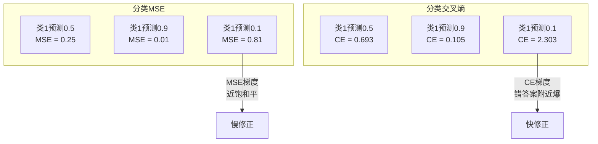
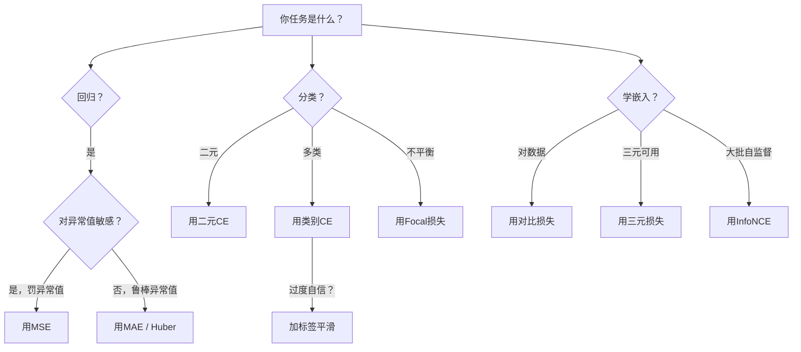
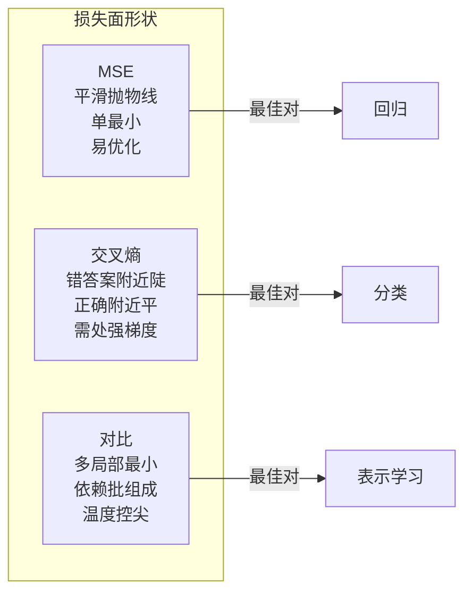

# 损失函数

> 你网络做预测。真值另有说法。多错？那数是损失。选错损失函数你模型为错东西完全优化。

**类型:** 构建
**语言:** Python
**前置要求:** 课程03.04 (激活函数)
**时间:** ~75分钟

## 学习目标

- 从零实现MSE、二元交叉熵、类别交叉熵和对比损失(InfoNCE)及其梯度
- 解释为何MSE分类失败演示"对一切预测0.5"失败模式
- 应用标签平滑到交叉熵并描述如何防过度自信预测
- 为回归、二元分类、多类分类和嵌入学习任务选正确损失函数

## 问题背景

分类问题最小MSE模型将自信对一切预测0.5。它最小损失。它也无用。

损失函数是你模型实际优化唯一东西。非精度。非F1分数。非你报给经理任何指标。优化器取损失函数梯度调权重使那数小。若损失函数不捕你关心，模型找数学最便宜方法满足它，那方法几乎从不你想要的。

这是具体例。你有二元分类任务。两类，50/50分。你用MSE作损失。模型对每单输入预测0.5。平均MSE是0.25，这是无实际学任何东西可能最小。模型零区分能力但它技术最小你损失函数。换交叉熵同模型强制推预测向0或1，因-log(0.5) = 0.693是糟损失，而-log(0.99) = 0.01奖自信正确预测。损失函数选择是学模型和博弈指标模型差。

更糟。自监督学习，你甚至无标签。对比损失完全定义学习信号: 什么算相似，什么算不同，模型应多硬推它们分开。对比损失错你嵌入坍到单点 -- 每输入映射同向量。技术零损失。完全无价值。

## 概念讲解

### 均方误差(MSE)

回归默认。算预测目标差平方，所有样本平均。

```
MSE = (1/n) * sum((y_pred - y_true)^2)
```

为何平方重要: 它二次罚大误差。误差2比误差1费4倍。误差10费100倍。这使MSE对异常值敏感 -- 单狂错预测主导损失。

真数: 若你模型预测房价多数房错$10,000但一豪宅错$200,000，MSE将激试图修那豪宅，可能害其他99房性能。

MSE对预测梯度:

```
dMSE/dy_pred = (2/n) * (y_pred - y_true)
```

误差线性。大误差得大梯度。这是回归特征(大误差需大修正)和分类bug(你想指数罚自信错答案，非线性)。

### 交叉熵损失

分类损失函数。植根信息论 -- 它测预测概率分布和真分布间分歧。

**二元交叉熵(BCE):**

```
BCE = -(y * log(p) + (1 - y) * log(1 - p))
```

其中y是真标签(0或1)和p是预测概率。

为何-log(p)工作: 当真标签1你预测p = 0.99，损失是-log(0.99) = 0.01。当预测p = 0.01，损失是-log(0.01) = 4.6。那460倍差是为何交叉熵工作。它残忍罚自信错预测而几乎不罚自信正确。

梯度讲同故事:

```
dBCE/dp = -(y/p) + (1-y)/(1-p)
```

当y = 1和p近零，梯度是-1/p趋负无穷。模型得巨信号修错。当p近1，梯度小。已正确，无修。

**类别交叉熵:**

多类分类带one-hot编码目标。

```
CCE = -sum(y_i * log(p_i))
```

仅真类贡献损失(因所有其他y_i是零)。若有10类正确类得概率0.1(随机猜)，损失是-log(0.1) = 2.3。若正确类得概率0.9，损失是-log(0.9) = 0.105。模型学集中概率质量正确答案。

### 为何MSE分类失败



MSE梯度预测近0或1时平(因sigmoid饱和)。交叉熵梯度补偿这 -- -log消sigmoid平区，给最强梯度恰在最需处。

### 标签平滑

标准one-hot标签说"这100%类3和0%其他一切。"那是强主张。标签平滑软它:

```
smooth_label = (1 - alpha) * one_hot + alpha / num_classes
```

用alpha = 0.1和10类: 替代[0, 0, 1, 0, ...]，目标成[0.01, 0.01, 0.91, 0.01, ...]。模型目标0.91而非1.0。

为何工作: 模型试通过softmax输出精确1.0需推logit到无穷。这致过度自信、害泛化、使模型脆分布移。标签平滑限目标0.9(alpha=0.1)，保logit合理范围。GPT和现代模型用标签平滑或等效。

### 对比损失

无标签。无类。仅输入对和问题: 这些相似或不同？

**SimCLR样对比损失(NT-Xent / InfoNCE):**

取一图像。创两增强视图(裁剪、旋转、颜色抖动)。这些是"正对" -- 它们应相似嵌入。批中每其他图像成"负对" -- 它们应不同嵌入。

```
L = -log(exp(sim(z_i, z_j) / tau) / sum(exp(sim(z_i, z_k) / tau)))
```

其中sim()是余弦相似度，z_i和z_j是正对，和对所有负，和tau(温度)控分布多尖。更低温度 = 更难负 = 更激分离。

真数: 批大小256意味每正对255负。温度tau = 0.07 (SimCLR默认)。损失像相似度softmax -- 它要正对相似度在所有256选项中最高。

**三元损失:**

取三输入: 锚点、正(同类)、负(不同类)。

```
L = max(0, d(anchor, positive) - d(anchor, negative) + margin)
```

margin(典型0.2-1.0)强制正负距最小间隙。若负已够远，损失零 -- 无梯度，无更新。这使训练高效但需小心三元挖掘(选近锚点难负)。

### Focal损失

对不平衡数据集。标准交叉熵等对待所有正确分类例。Focal损失降权易例:

```
FL = -alpha * (1 - p_t)^gamma * log(p_t)
```

其中p_t是真类预测概率和gamma控聚焦。gamma = 0，这是标准交叉熵。gamma = 2 (默认):

- 易例(p_t = 0.9): 权 = (0.1)^2 = 0.01。有效忽略。
- 难例(p_t = 0.1): 权 = (0.9)^2 = 0.81。全梯度信号。

Focal损失Lin等引入目标检测，其中99%候选区是背景(易负)。无focal损失，模型溺易背景例从不学检测对象。有它，模型聚焦容量在难、模糊情况。

### 损失函数决策树



### 损失景观



## 构建

### 步骤1: MSE及其梯度

```python
def mse(predictions, targets):
    n = len(predictions)
    total = 0.0
    for p, t in zip(predictions, targets):
        total += (p - t) ** 2
    return total / n

def mse_gradient(predictions, targets):
    n = len(predictions)
    grads = []
    for p, t in zip(predictions, targets):
        grads.append(2.0 * (p - t) / n)
    return grads
```

### 步骤2: 二元交叉熵

log(0)问题是真。若模型正例精确预测0，log(0) = 负无穷。截防止这。

```python
import math

def binary_cross_entropy(predictions, targets, eps=1e-15):
    n = len(predictions)
    total = 0.0
    for p, t in zip(predictions, targets):
        p_clipped = max(eps, min(1 - eps, p))
        total += -(t * math.log(p_clipped) + (1 - t) * math.log(1 - p_clipped))
    return total / n

def bce_gradient(predictions, targets, eps=1e-15):
    grads = []
    for p, t in zip(predictions, targets):
        p_clipped = max(eps, min(1 - eps, p))
        grads.append(-(t / p_clipped) + (1 - t) / (1 - p_clipped))
    return grads
```

### 步骤3: 带Softmax类别交叉熵

Softmax转原始logit成概率。然后对one-hot目标算交叉熵。

```python
def softmax(logits):
    max_val = max(logits)
    exps = [math.exp(x - max_val) for x in logits]
    total = sum(exps)
    return [e / total for e in exps]

def categorical_cross_entropy(logits, target_index, eps=1e-15):
    probs = softmax(logits)
    p = max(eps, probs[target_index])
    return -math.log(p)

def cce_gradient(logits, target_index):
    probs = softmax(logits)
    grads = list(probs)
    grads[target_index] -= 1.0
    return grads
```

Softmax + 交叉熵梯度简美: 真类(预测概率 - 1)，其他类(预测概率)。这优雅简非巧合 -- 这是为何softmax和交叉熵配对。

### 步骤4: 标签平滑

```python
def label_smoothed_cce(logits, target_index, num_classes, alpha=0.1, eps=1e-15):
    probs = softmax(logits)
    loss = 0.0
    for i in range(num_classes):
        if i == target_index:
            smooth_target = 1.0 - alpha + alpha / num_classes
        else:
            smooth_target = alpha / num_classes
        p = max(eps, probs[i])
        loss += -smooth_target * math.log(p)
    return loss
```

### 步骤5: 对比损失(简化InfoNCE)

```python
def cosine_similarity(a, b):
    dot = sum(x * y for x, y in zip(a, b))
    norm_a = math.sqrt(sum(x * x for x in a))
    norm_b = math.sqrt(sum(x * x for x in b))
    if norm_a < 1e-10 or norm_b < 1e-10:
        return 0.0
    return dot / (norm_a * norm_b)

def contrastive_loss(anchor, positive, negatives, temperature=0.07):
    sim_pos = cosine_similarity(anchor, positive) / temperature
    sim_negs = [cosine_similarity(anchor, neg) / temperature for neg in negatives]

    max_sim = max(sim_pos, max(sim_negs)) if sim_negs else sim_pos
    exp_pos = math.exp(sim_pos - max_sim)
    exp_negs = [math.exp(s - max_sim) for s in sim_negs]
    total_exp = exp_pos + sum(exp_negs)

    return -math.log(max(1e-15, exp_pos / total_exp))
```

### 步骤6: 分类MSE vs交叉熵

用两损失函数训练课程04同网络(圆数据集)。看交叉熵收敛更快。

```python
import random

def sigmoid(x):
    x = max(-500, min(500, x))
    return 1.0 / (1.0 + math.exp(-x))

def make_circle_data(n=200, seed=42):
    random.seed(seed)
    data = []
    for _ in range(n):
        x = random.uniform(-2, 2)
        y = random.uniform(-2, 2)
        label = 1.0 if x * x + y * y < 1.5 else 0.0
        data.append(([x, y], label))
    return data


class LossComparisonNetwork:
    def __init__(self, loss_type="bce", hidden_size=8, lr=0.1):
        random.seed(0)
        self.loss_type = loss_type
        self.lr = lr
        self.hidden_size = hidden_size

        self.w1 = [[random.gauss(0, 0.5) for _ in range(2)] for _ in range(hidden_size)]
        self.b1 = [0.0] * hidden_size
        self.w2 = [random.gauss(0, 0.5) for _ in range(hidden_size)]
        self.b2 = 0.0

    def forward(self, x):
        self.x = x
        self.z1 = []
        self.h = []
        for i in range(self.hidden_size):
            z = self.w1[i][0] * x[0] + self.w1[i][1] * x[1] + self.b1[i]
            self.z1.append(z)
            self.h.append(max(0.0, z))

        self.z2 = sum(self.w2[i] * self.h[i] for i in range(self.hidden_size)) + self.b2
        self.out = sigmoid(self.z2)
        return self.out

    def backward(self, target):
        if self.loss_type == "mse":
            d_loss = 2.0 * (self.out - target)
        else:
            eps = 1e-15
            p = max(eps, min(1 - eps, self.out))
            d_loss = -(target / p) + (1 - target) / (1 - p)

        d_sigmoid = self.out * (1 - self.out)
        d_out = d_loss * d_sigmoid

        for i in range(self.hidden_size):
            d_relu = 1.0 if self.z1[i] > 0 else 0.0
            d_h = d_out * self.w2[i] * d_relu
            self.w2[i] -= self.lr * d_out * self.h[i]
            for j in range(2):
                self.w1[i][j] -= self.lr * d_h * self.x[j]
            self.b1[i] -= self.lr * d_h
        self.b2 -= self.lr * d_out

    def compute_loss(self, pred, target):
        if self.loss_type == "mse":
            return (pred - target) ** 2
        else:
            eps = 1e-15
            p = max(eps, min(1 - eps, pred))
            return -(target * math.log(p) + (1 - target) * math.log(1 - p))

    def train(self, data, epochs=200):
        losses = []
        for epoch in range(epochs):
            total_loss = 0.0
            correct = 0
            for x, y in data:
                pred = self.forward(x)
                self.backward(y)
                total_loss += self.compute_loss(pred, y)
                if (pred >= 0.5) == (y >= 0.5):
                    correct += 1
            avg_loss = total_loss / len(data)
            accuracy = correct / len(data) * 100
            losses.append((avg_loss, accuracy))
            if epoch % 50 == 0 or epoch == epochs - 1:
                print(f"    Epoch {epoch:3d}: 损失={avg_loss:.4f}, 精度={accuracy:.1f}%")
        return losses
```

## 使用

PyTorch供所有标准损失函数带内建数值稳定:

```python
import torch
import torch.nn as nn
import torch.nn.functional as F

predictions = torch.tensor([0.9, 0.1, 0.7], requires_grad=True)
targets = torch.tensor([1.0, 0.0, 1.0])

mse_loss = F.mse_loss(predictions, targets)
bce_loss = F.binary_cross_entropy(predictions, targets)

logits = torch.randn(4, 10)
labels = torch.tensor([3, 7, 1, 9])
ce_loss = F.cross_entropy(logits, labels)
ce_smooth = F.cross_entropy(logits, labels, label_smoothing=0.1)
```

用`F.cross_entropy` (非`F.nll_loss`加手动softmax)。它合一数值稳定操作log-softmax和负log似然。单独应用softmax然后取log不太稳定 -- 你失大指数减精度。

对比学习，多队用自定义实现或库如`lightly`或`pytorch-metric-learning`。核循环总同: 算成对相似度，创正负softmax，反向传播。

## 交付成果

本课程产生:
- `outputs/prompt-loss-function-selector.md` -- 选对损失函数可复用提示词
- `outputs/prompt-loss-debugger.md` -- 损失曲线看错时诊断提示词

## 练习题

1. 实现Huber损失(平滑L1损失)，小误差MSE大误差MAE。训练预测y = sin(x)回归网络，MSE vs Huber当5%训练目标加随机噪声(异常值)。比较最终测试误差。

2. 加focal损失到二元分类训练循环。创不平衡数据集(90%类0, 10%类1)。200 epochs后比较标准BCE vs focal损失(gamma=2)少数类召回。

3. 实现带半硬负挖掘三元损失。生成5类2D嵌入数据。每锚点，找仍比正远最难负(半硬)。比较收敛与随机三元选择。

4. 跑MSE vs交叉熵比较但追踪训练时每层梯度幅度。绘每epoch平均梯度范数。验证交叉熵在早epochs当模型最不确定时产更大梯度。

5. 实现KL分歧损失并验证最小化KL(true || predicted)当真分布one-hot时给交叉熵同梯度。然后试软目标(如知识蒸馏)其中"真"分布来自教师模型softmax输出。

## 关键术语

| 术语 | 人们怎么说 | 实际含义 |
|------|----------------|----------------------|
| 损失函数 | "模型多错" | 映射预测目标到优化器最小化标量可微函数 |
| MSE | "平均平方误差" | 预测目标差平方平均; 二次罚大误差 |
| 交叉熵 | "分类损失" | 用-log(p)测预测概率分布和真分布分歧 |
| 二元交叉熵 | "BCE" | 两类交叉熵: -(y*log(p) + (1-y)*log(1-p)) |
| 标签平滑 | "软化目标" | 用软值(如0.1/0.9)替硬0/1目标防过度自信改善泛化 |
| 对比损失 | "拉一起，推分开" | 学表示使相似对近不同对远嵌入空间损失 |
| InfoNCE | "CLIP/SimCLR损失" | 归一化温度缩相似度交叉熵; 把对比学习作分类 |
| Focal损失 | "不平衡数据修复" | 交叉熵加权(1-p_t)^gamma降权易例聚焦难例 |
| 三元损失 | "锚点-正-负" | 在嵌入空间推锚点比负近正至少margin |
| 温度 | "尖度钮" | logit/相似度上标量除控结果分布多尖; 低 = 更尖 |

## 延伸阅读

- Lin et al., "Focal Loss for Dense Object Detection" (2017) -- 引focal损失处理目标检测极类不平衡(RetinaNet)
- Chen et al., "A Simple Framework for Contrastive Learning of Visual Representations" (SimCLR, 2020) -- 定义带NT-Xent损失现代对比学习流水线
- Szegedy et al., "Rethinking the Inception Architecture" (2016) -- 引标签平滑作正则技术，现大多数大模型标准
- Hinton et al., "Distilling the Knowledge in a Neural Network" (2015) -- 用软目标和KL分歧知识蒸馏，模型压缩基础