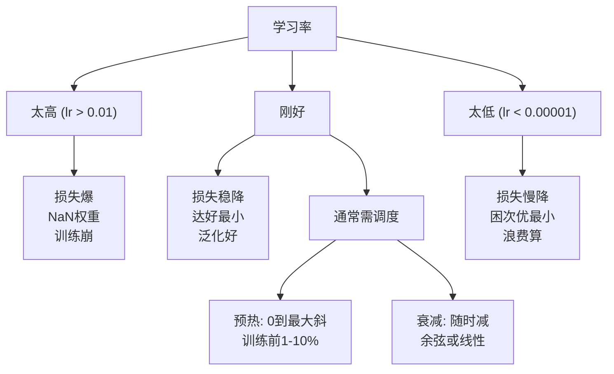
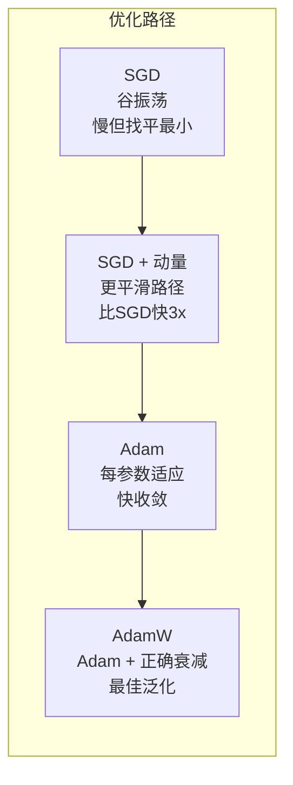
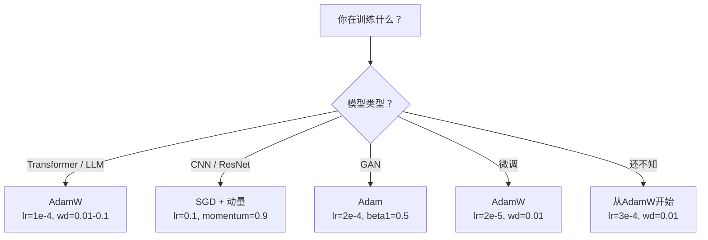

# 优化器

> 梯度下降告诉你向哪个方向移动。它不说多远多快。SGD是指南针。Adam是带实时路况的GPS。

**类型:** 构建
**语言:** Python
**前置要求:** 课程03.05 (损失函数)
**时间:** ~75分钟

## 学习目标

- 从零在Python实现SGD、SGD动量、Adam和AdamW优化器
- 解释Adam偏修正如何补偿早训练步零初始化矩估计
- 演示为何AdamW在同任务比Adam加L2正则产更好泛化
- 为transformer、CNN、GAN和微调选适当优化器和默认超参

## 问题背景

你算梯度。你知权重#4,721应减0.003降损失。但0.003什么单位？用什么缩？你应在步1和步1,000移同量吗？

朴素梯度下降每参数每步用同学习率: w = w - lr * gradient。这创三问题使训练神经网络实践痛。

一，振荡。损失景观罕形平滑碗。它更像长窄谷。梯度跨谷指(陡方向)，非沿它(浅方向)。梯度下降来回弹窄维度同时沿有用维度微进展。你见这: 损失快降然后平台，非因模型收敛而是它振荡。

二，所有参数一学习率错。些权重需大更新(它们在早、欠拟合阶段)。其他需微小更新(它们近最优值)。适前者学习率毁后者，反之。

三，鞍点。高维，损失景观有巨平区梯度近零。朴素SGD爬穿这些以梯度速度，实际零。模型看卡。它非卡 -- 它在平区有用下降另侧。但SGD无机制推穿。

Adam解全三。它每参数维两运行平均 -- 平均梯度(动量，处理振荡)和平均平方梯度(适应率，处理不同尺度)。合偏修正前几步，它给你一优化器默认超参80%问题工作。这课从零建它让你理解何时为何它失败另20%。

## 概念讲解

### 随机梯度下降(SGD)

最简优化器。在mini-batch算梯度反方向步。

```
w = w - lr * gradient
```

"随机"意味你用数据随机子集估计梯度，非全集。这噪声实际有用 -- 它助逃尖局部最小。但噪声也致振荡。

学习率是唯一钮。太高: 损失分歧。太低: 训练永。优值依赖架构、数据、批大小和训练当前阶段。朴素SGD现代网络，典型值范围0.01到0.1。但即使在单训练跑，理想学习率变。

### 动量

球滚下山类比过用但准确。非仅梯度步，你维累积过去梯度速度。

```
m_t = beta * m_{t-1} + gradient
w = w - lr * m_t
```

Beta (典型0.9)控留多少历史。beta = 0.9，动量粗是前10梯度平均 (1 / (1 - 0.9) = 10)。

为何这修复振荡: 同方向梯度累积。反方向梯度抵消。在那窄谷，"跨"分量每步变号被阻。"沿"分量一致被放大。结果有用方向平滑加速。

真数: 条件差损失景观单SGD可需10,000步。动量SGD (beta=0.9)典型需3,000-5,000步同问题。加速非边际。

### RMSProp

首每参数适应学习率方法实际工作。Hinton在Coursera讲座提(从未正式发表)。

```
s_t = beta * s_{t-1} + (1 - beta) * gradient^2
w = w - lr * gradient / (sqrt(s_t) + epsilon)
```

s_t追平方梯度运行平均。持续大梯度参数被大数除(更小有效学习率)。小梯度参数被小数除(更大有效学习率)。

这解"所有参数一学习率"问题。已得大更新权重可能近目标 -- 慢它。已得微小更新权重可能欠训练 -- 加它。

Epsilon (典型1e-8)防参数未更新时除零。

### Adam: 动量 + RMSProp

Adam合两想法。它每参数维两指数移动平均:

```
m_t = beta1 * m_{t-1} + (1 - beta1) * gradient        (一矩: 均值)
v_t = beta2 * v_{t-1} + (1 - beta2) * gradient^2       (二矩: 方差)
```

**偏修正**是多数解释跳关键细节。步1，m_1 = (1 - beta1) * gradient。beta1 = 0.9，那是0.1 * gradient -- 十倍太小。移动平均未热。偏修正补偿:

```
m_hat = m_t / (1 - beta1^t)
v_hat = v_t / (1 - beta2^t)
```

步1 beta1 = 0.9: m_hat = m_1 / (1 - 0.9) = m_1 / 0.1 = 实际梯度。步100: (1 - 0.9^100)约1.0，修正消失。偏修正前~10步重要后~50步无关。

更新:

```
w = w - lr * m_hat / (sqrt(v_hat) + epsilon)
```

Adam默认: lr = 0.001, beta1 = 0.9, beta2 = 0.999, epsilon = 1e-8。这些默认80%问题工作。当它们不，先改lr。然后beta2。几乎从不改beta1或epsilon。

### AdamW: 正确权重衰减

L2正则加lambda * w^2到损失。朴素SGD，这等权重衰减(每步减lambda * w)。Adam，这等价断。

Loshchilov & Hutter洞见: 当你加L2到损失然后Adam处理梯度，适应学习率缩正则项。大梯度方差参数得更少正则。小方差参数得更多。这非你想要 -- 你想统一正则不管梯度统计。

AdamW修复直接应用权重衰减到权重，在Adam更新后:

```
w = w - lr * m_hat / (sqrt(v_hat) + epsilon) - lr * lambda * w
```

权重衰减项不被Adam适应因子缩。每参数得同比例收缩。

这似微小细节。它非。AdamW在几乎每任务比Adam + L2正则收敛更好解。它是PyTorch训练transformer、扩散模型和现代架构默认优化器。BERT、GPT、LLaMA、Stable Diffusion -- 全用AdamW训练。

### 学习率: 最重要超参数



若你调一超参数，调学习率。学习率10x变比任何架构决策更重要。常见默认:

- SGD: lr = 0.01到0.1
- Adam/AdamW: lr = 1e-4到3e-4
- 微调预训练模型: lr = 1e-5到5e-5
- 学习率预热: 线性斜前1-10%步

### 优化器比较



### 每优化器何时胜



## 构建

### 步骤1: 朴素SGD

```python
class SGD:
    def __init__(self, lr=0.01):
        self.lr = lr

    def step(self, params, grads):
        for i in range(len(params)):
            params[i] -= self.lr * grads[i]
```

### 步骤2: 动量SGD

```python
class SGDMomentum:
    def __init__(self, lr=0.01, beta=0.9):
        self.lr = lr
        self.beta = beta
        self.velocities = None

    def step(self, params, grads):
        if self.velocities is None:
            self.velocities = [0.0] * len(params)
        for i in range(len(params)):
            self.velocities[i] = self.beta * self.velocities[i] + grads[i]
            params[i] -= self.lr * self.velocities[i]
```

### 步骤3: Adam

```python
import math

class Adam:
    def __init__(self, lr=0.001, beta1=0.9, beta2=0.999, epsilon=1e-8):
        self.lr = lr
        self.beta1 = beta1
        self.beta2 = beta2
        self.epsilon = epsilon
        self.m = None
        self.v = None
        self.t = 0

    def step(self, params, grads):
        if self.m is None:
            self.m = [0.0] * len(params)
            self.v = [0.0] * len(params)

        self.t += 1

        for i in range(len(params)):
            self.m[i] = self.beta1 * self.m[i] + (1 - self.beta1) * grads[i]
            self.v[i] = self.beta2 * self.v[i] + (1 - self.beta2) * grads[i] ** 2

            m_hat = self.m[i] / (1 - self.beta1 ** self.t)
            v_hat = self.v[i] / (1 - self.beta2 ** self.t)

            params[i] -= self.lr * m_hat / (math.sqrt(v_hat) + self.epsilon)
```

### 步骤4: AdamW

```python
class AdamW:
    def __init__(self, lr=0.001, beta1=0.9, beta2=0.999, epsilon=1e-8, weight_decay=0.01):
        self.lr = lr
        self.beta1 = beta1
        self.beta2 = beta2
        self.epsilon = epsilon
        self.weight_decay = weight_decay
        self.m = None
        self.v = None
        self.t = 0

    def step(self, params, grads):
        if self.m is None:
            self.m = [0.0] * len(params)
            self.v = [0.0] * len(params)

        self.t += 1

        for i in range(len(params)):
            self.m[i] = self.beta1 * self.m[i] + (1 - self.beta1) * grads[i]
            self.v[i] = self.beta2 * self.v[i] + (1 - self.beta2) * grads[i] ** 2

            m_hat = self.m[i] / (1 - self.beta1 ** self.t)
            v_hat = self.v[i] / (1 - self.beta2 ** self.t)

            params[i] -= self.lr * m_hat / (math.sqrt(v_hat) + self.epsilon)
            params[i] -= self.lr * self.weight_decay * params[i]
```

### 步骤5: 训练比较

在课程05圆数据集用全四优化器训练同两层网络。比较收敛。

```python
import random

def sigmoid(x):
    x = max(-500, min(500, x))
    return 1.0 / (1.0 + math.exp(-x))

def make_circle_data(n=200, seed=42):
    random.seed(seed)
    data = []
    for _ in range(n):
        x = random.uniform(-2, 2)
        y = random.uniform(-2, 2)
        label = 1.0 if x * x + y * y < 1.5 else 0.0
        data.append(([x, y], label))
    return data


class OptimizerTestNetwork:
    def __init__(self, optimizer, hidden_size=8):
        random.seed(0)
        self.hidden_size = hidden_size
        self.optimizer = optimizer

        self.w1 = [[random.gauss(0, 0.5) for _ in range(2)] for _ in range(hidden_size)]
        self.b1 = [0.0] * hidden_size
        self.w2 = [random.gauss(0, 0.5) for _ in range(hidden_size)]
        self.b2 = 0.0

    def get_params(self):
        params = []
        for row in self.w1:
            params.extend(row)
        params.extend(self.b1)
        params.extend(self.w2)
        params.append(self.b2)
        return params

    def set_params(self, params):
        idx = 0
        for i in range(self.hidden_size):
            for j in range(2):
                self.w1[i][j] = params[idx]
                idx += 1
        for i in range(self.hidden_size):
            self.b1[i] = params[idx]
            idx += 1
        for i in range(self.hidden_size):
            self.w2[i] = params[idx]
            idx += 1
        self.b2 = params[idx]

    def forward(self, x):
        self.x = x
        self.z1 = []
        self.h = []
        for i in range(self.hidden_size):
            z = self.w1[i][0] * x[0] + self.w1[i][1] * x[1] + self.b1[i]
            self.z1.append(z)
            self.h.append(max(0.0, z))

        self.z2 = sum(self.w2[i] * self.h[i] for i in range(self.hidden_size)) + self.b2
        self.out = sigmoid(self.z2)
        return self.out

    def compute_grads(self, target):
        eps = 1e-15
        p = max(eps, min(1 - eps, self.out))
        d_loss = -(target / p) + (1 - target) / (1 - p)
        d_sigmoid = self.out * (1 - self.out)
        d_out = d_loss * d_sigmoid

        grads = [0.0] * (self.hidden_size * 2 + self.hidden_size + self.hidden_size + 1)
        idx = 0
        for i in range(self.hidden_size):
            d_relu = 1.0 if self.z1[i] > 0 else 0.0
            d_h = d_out * self.w2[i] * d_relu
            grads[idx] = d_h * self.x[0]
            grads[idx + 1] = d_h * self.x[1]
            idx += 2

        for i in range(self.hidden_size):
            d_relu = 1.0 if self.z1[i] > 0 else 0.0
            grads[idx] = d_out * self.w2[i] * d_relu
            idx += 1

        for i in range(self.hidden_size):
            grads[idx] = d_out * self.h[i]
            idx += 1

        grads[idx] = d_out
        return grads

    def train(self, data, epochs=300):
        losses = []
        for epoch in range(epochs):
            total_loss = 0.0
            correct = 0
            for x, y in data:
                pred = self.forward(x)
                grads = self.compute_grads(y)
                params = self.get_params()
                self.optimizer.step(params, grads)
                self.set_params(params)

                eps = 1e-15
                p = max(eps, min(1 - eps, pred))
                total_loss += -(y * math.log(p) + (1 - y) * math.log(1 - p))
                if (pred >= 0.5) == (y >= 0.5):
                    correct += 1
            avg_loss = total_loss / len(data)
            accuracy = correct / len(data) * 100
            losses.append((avg_loss, accuracy))
            if epoch % 75 == 0 or epoch == epochs - 1:
                print(f"    Epoch {epoch:3d}: 损失={avg_loss:.4f}, 精度={accuracy:.1f}%")
        return losses
```

## 使用

PyTorch优化器处理参数组、梯度裁剪和学习率调度:

```python
import torch
import torch.optim as optim

model = torch.nn.Sequential(
    torch.nn.Linear(784, 256),
    torch.nn.ReLU(),
    torch.nn.Linear(256, 10),
)

optimizer = optim.AdamW(model.parameters(), lr=3e-4, weight_decay=0.01)

scheduler = optim.lr_scheduler.CosineAnnealingLR(optimizer, T_max=100)

for epoch in range(100):
    optimizer.zero_grad()
    output = model(torch.randn(32, 784))
    loss = torch.nn.functional.cross_entropy(output, torch.randint(0, 10, (32,)))
    loss.backward()
    torch.nn.utils.clip_grad_norm_(model.parameters(), max_norm=1.0)
    optimizer.step()
    scheduler.step()
```

模式总: zero_grad, forward, loss, backward, (clip), step, (schedule)。记这顺序。错(如scheduler.step()在optimizer.step()前调用)是常见隐bug源。

CNN，多从业者仍偏好SGD + 动量(lr=0.1, momentum=0.9, weight_decay=1e-4)带步或余弦调度。SGD找平最小，常泛化更好。Transformers和LLM，AdamW带预热 + 余弦衰减是普适默认。无测量理由不抗共识。

## 交付成果

本课程产生:
- `outputs/prompt-optimizer-selector.md` -- 为任何架构选对优化器和学习率决策提示词

## 练习题

1. 实现Nesterov动量，你在"前瞻"位置(w - lr * beta * v)而非当前位置算梯度。比较收敛标准动量在圆数据集。

2. 实现学习率预热调度: 线性斜从0到max_lr前10%训练步，然后余弦衰减到0。用Adam + 预热训练vs Adam无预热。测多少epochs达90%精度在圆数据集。

3. 追Adam训练每参数有效学习率。有效率是lr * m_hat / (sqrt(v_hat) + eps)。绘10、50和200步后有效率分布。所有参数以同速度更新吗？

4. 实现梯度裁剪(按全局范数裁剪)。设最大梯度范数1.0。用高学习率(lr=0.01对Adam)训练有无裁剪。计数10随机种子多少跑分歧(损失NaN)有无裁剪。

5. 在带大权重网络比较Adam vs AdamW。初始化所有权重到[-5, 5]随机值(比正常大得多)。训练200 epochs用weight_decay=0.1。绘训练两者权重L2范数。AdamW应显更快权重收缩。

## 关键术语

| 术语 | 人们怎么说 | 实际含义 |
|------|----------------|----------------------|
| 学习率 | "步大小" | 梯度更新上标量乘数; 训练单最影响超参数 |
| SGD | "基本梯度下降" | 随机梯度下降: 减lr * gradient更新权重，在mini-batch算 |
| 动量 | "滚球类比" | 过梯度指数移动平均; 阻振荡加速一致方向 |
| RMSProp | "适应学习率" | 每参数梯度除其近梯度运行RMS; 等学习率 |
| Adam | "默认优化器" | 合动量(一矩)和RMSProp(二矩)带初步偏修正 |
| AdamW | "正确Adam" | Adam带解耦权重衰减; 直接对权重应用正则而非通过梯度 |
| 偏修正 | "运行平均预热" | 除(1 - beta^t)补偿Adam矩估计零初始化 |
| 权重衰减 | "缩权重" | 每步减权重值分数; 罚大权重正则器 |
| 学习率调度 | "随时改lr" | 训练时调学习率函数; 预热 + 余弦衰减是现代默认 |
| 梯度裁剪 | "限梯度范数" | 当梯度范数超阈值时缩; 防梯度更新爆 |

## 延伸阅读

- Kingma & Ba, "Adam: A Method for Stochastic Optimization" (2014) -- 原Adam论文带收敛分析和偏修正推导
- Loshchilov & Hutter, "Decoupled Weight Decay Regularization" (2017) -- 证Adam中L2正则和权重衰减不等价，并提AdamW
- Smith, "Cyclical Learning Rates for Training Neural Networks" (2017) -- 引LR范围测试和循环调度消调固定学习率需要
- Ruder, "An Overview of Gradient Descent Optimization Algorithms" (2016) -- 所有优化器变体最佳单一调研，带清晰比较和直觉