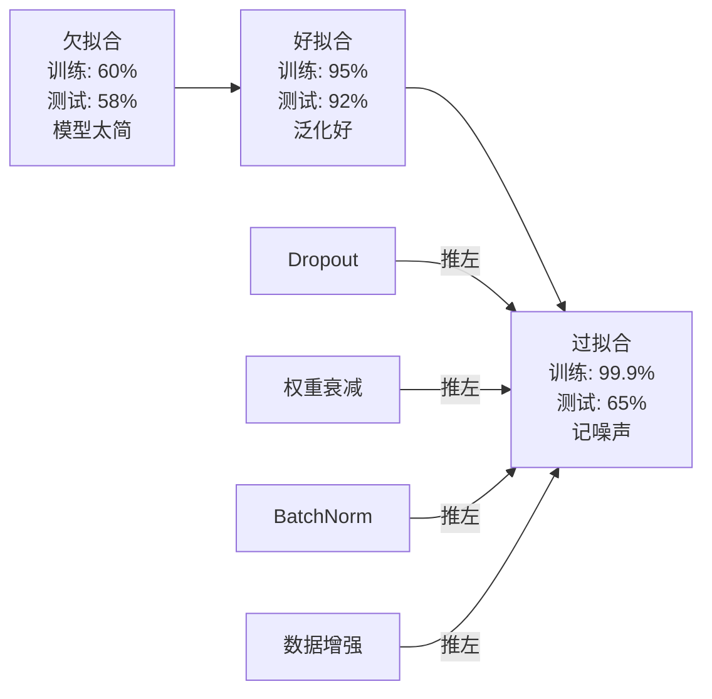
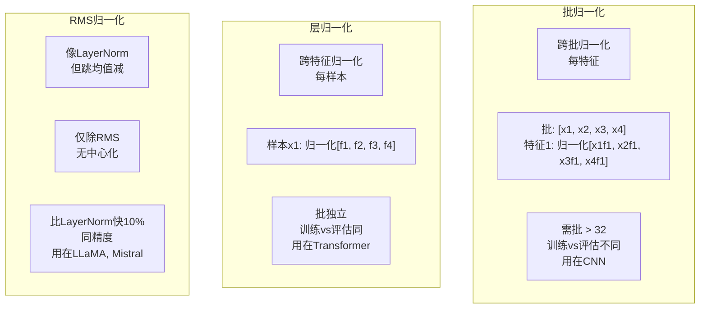
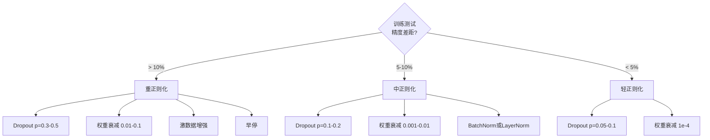

# 正则化

> 你模型训练数据99%精度，测试数据60%。它记而非学。正则化是你对复杂性税收以强制泛化。

**类型:** 构建
**语言:** Python
**前置要求:** 课程03.06 (优化器)
**时间:** ~75分钟

## 学习目标

- 从零实现带反向缩放dropout、L2权重衰减、批归一化、层归一化和RMSNorm
- 测训练测试精度差距用正则化实验诊断过拟合
- 解释为何transformer用LayerNorm而非BatchNorm为何现代LLM偏好RMSNorm
- 根据过拟合严重程度应用正确正则化技术组合

## 问题背景

带够参数神经网络可记任何数据集。这非假设 -- Zhang等(2017)证它在ImageNet随机标签训标准网络。网络在完全随机标签分配达近零训练损失。它们记百万随机输入输出对无模式可学。训练损失完美。测试精度零。

这是过拟合问题，模型变大更糟。GPT-3有1750亿参数。训练集约5000亿token。那多参数，模型够容量记大量训练数据逐字。无正则化，它将吐训练例而非学泛化模式。

训练性能和测试性能间差距是过拟合差距。本课每技术从不同角度攻差距。Dropout强制网络不依赖单神经元。权重衰减防单权重长太大。批归一化平滑损失景观使优化器找更平更泛化最小。层归一化做同事但工作在批归一化失败处(小批、变长序列)。RMSNorm快10%弃均值计算。每技术简单。合，它们是记和泛化模型差。

## 概念讲解

### 过拟合谱

每模型坐从欠拟合(太简捕模式)到过拟合(太复杂捕噪声)谱某处。甜点在中，正则化从过拟合侧推模型向它。



### Dropout

最简正则化技术带最优雅解释。训练时，随机设每神经元输出零概率p。

```
output = activation(z) * mask    其中mask[i] ~ Bernoulli(1 - p)
```

p = 0.5，半神经元每前向传播零。网络必须学冗余表示因它不能预测哪些神经元可用。这防共适应 -- 神经元学依赖特定其他神经元在。

集成解释: N神经元带dropout网络创2^N可能子网络(每神经元开或关组合)。训练带dropout近似训全2^N子网络同时，每在不同mini-batch。测试时，你用全神经元(无dropout)缩输出(1 - p)匹配训练时期值。这等平均2^N子网络预测 -- 单模型巨集成。

实践，缩训练而非测试应用(反向dropout):

```
训练时:  output = activation(z) * mask / (1 - p)
测试时:   output = activation(z)   (无需改变)
```

这更干净因测试代码根本不需知dropout。

默认率: p = 0.1对transformer，p = 0.5对MLP，p = 0.2-0.3对CNN。更高dropout = 更强正则化 = 更多欠拟合风险。

### 权重衰减(L2正则化)

加全权重平方幅度到损失:

```
total_loss = task_loss + (lambda / 2) * sum(w_i^2)
```

正则项梯度是lambda * w。这意味每步，每权重缩向零分数比例其幅度。大权重罚更多。模型推向解无单权重主导。

为何助泛化: 过拟合模型倾向有大权重放大训练数据噪声。权重衰减保权重小，限模型有效容量强制它依赖鲁棒泛化特征而非记怪癖。

Lambda超参数控强度。典型值:

- 0.01对AdamW在transformer
- 1e-4对SGD在CNN
- 0.1对严重过拟合模型

如课程06讨论: 权重衰减和L2正则在SGD等价但在Adam不等。当用Adam训时总用AdamW(解耦权重衰减)。

### 批归一化

归一化每层输出跨mini-batch前馈下层。

某层mini-batch激活:

```
mu = (1/B) * sum(x_i)           (批均值)
sigma^2 = (1/B) * sum((x_i - mu)^2)   (批方差)
x_hat = (x_i - mu) / sqrt(sigma^2 + eps)   (归一化)
y = gamma * x_hat + beta        (缩和移)
```

Gamma和beta可学习参数让网络撤销归一化若最优。无它们，你强制每层输出零均值单位方差，这可能非网络想要。

**训练推理分:** 训练时，mu和sigma来自当前mini-batch。推理时，你用训练累积运行平均(指数移动平均动量=0.1，意90%旧+10%新)。

为何BatchNorm工作仍辩论。原论文称它减"内部协变量移"(层输入分布随早层更新改)。Santurkar等(2018)示解释错。实际原因: BatchNorm使损失景观更平滑。梯度更预测，Lipschitz常数更小，优化器可更安全大步。这是为何BatchNorm许你用更高学习率快收敛。

BatchNorm有根本限: 它依赖批统计。批大小1，均值方差无意义。小批(<32)，统计噪声害性能。这关任务如对象检测(内存限批大小)和语言建模(序列长变)。

### 层归一化

跨特征而非跨批归一化。单样本:

```
mu = (1/D) * sum(x_j)           (特征均值)
sigma^2 = (1/D) * sum((x_j - mu)^2)   (特征方差)
x_hat = (x_j - mu) / sqrt(sigma^2 + eps)
y = gamma * x_hat + beta
```

D是特征维。每样本独立归一化 -- 无依赖批大小。这是为何transformer用LayerNorm而非BatchNorm。序列有变长，批大小常小(或生成时1)，计算训练推理完全等。

Transformer LayerNorm应用在每自注意力块和每前馈块后(Post-LN)，或在它们前(Pre-LN，更稳定训练)。

### RMSNorm

LayerNorm无均值减。Zhang & Sennrich(2019)提。

```
rms = sqrt((1/D) * sum(x_j^2))
y = gamma * x / rms
```

就这。无均值计算，无beta参数。观察: LayerNorm重中心化(均值减)贡献很少模型性能，但耗计算。移它给同精度约10%更少开销。

LLaMA、LLaMA 2、LLaMA 3、Mistral和大多现代LLM用RMSNorm而非LayerNorm。在数十亿参数万亿token规模，那10%节省重要。

### 归一化比较



### 数据增强作正则化

非模型修改但数据修改。变训练输入保标签:

- 图像: 随机裁剪、翻转、旋转、颜色抖动、cutout
- 文本: 同义词替换、回译、随机删除
- 音频: 时间拉伸、音调移、噪声加

效果等正则化: 增训练集有效大小，使模型更难记特定例。模型只在原形见每图像一次可记它。见每图像50增强版模型必须学不变结构。

### 早停

最简正则器: 当验证损失始增停训练。模型在那时还未过拟合。实践，你每epoch追验证损失，存最佳模型，继续训练"耐心"窗(典型5-20 epochs)。若验证损失在耐心窗内未改善，你停加载最佳存模型。

### 何时用何



## 构建

### 步骤1: Dropout(训练和评估模式)

```python
import random
import math


class Dropout:
    def __init__(self, p=0.5):
        self.p = p
        self.training = True
        self.mask = None

    def forward(self, x):
        if not self.training:
            return list(x)
        self.mask = []
        output = []
        for val in x:
            if random.random() < self.p:
                self.mask.append(0)
                output.append(0.0)
            else:
                self.mask.append(1)
                output.append(val / (1 - self.p))
        return output

    def backward(self, grad_output):
        grads = []
        for g, m in zip(grad_output, self.mask):
            if m == 0:
                grads.append(0.0)
            else:
                grads.append(g / (1 - self.p))
        return grads
```

### 步骤2: L2权重衰减

```python
def l2_regularization(weights, lambda_reg):
    penalty = 0.0
    for w in weights:
        penalty += w * w
    return lambda_reg * 0.5 * penalty

def l2_gradient(weights, lambda_reg):
    return [lambda_reg * w for w in weights]
```

### 步骤3: 批归一化

```python
class BatchNorm:
    def __init__(self, num_features, momentum=0.1, eps=1e-5):
        self.gamma = [1.0] * num_features
        self.beta = [0.0] * num_features
        self.eps = eps
        self.momentum = momentum
        self.running_mean = [0.0] * num_features
        self.running_var = [1.0] * num_features
        self.training = True
        self.num_features = num_features

    def forward(self, batch):
        batch_size = len(batch)
        if self.training:
            mean = [0.0] * self.num_features
            for sample in batch:
                for j in range(self.num_features):
                    mean[j] += sample[j]
            mean = [m / batch_size for m in mean]

            var = [0.0] * self.num_features
            for sample in batch:
                for j in range(self.num_features):
                    var[j] += (sample[j] - mean[j]) ** 2
            var = [v / batch_size for v in var]

            for j in range(self.num_features):
                self.running_mean[j] = (1 - self.momentum) * self.running_mean[j] + self.momentum * mean[j]
                self.running_var[j] = (1 - self.momentum) * self.running_var[j] + self.momentum * var[j]
        else:
            mean = list(self.running_mean)
            var = list(self.running_var)

        self.x_hat = []
        output = []
        for sample in batch:
            normalized = []
            out_sample = []
            for j in range(self.num_features):
                x_h = (sample[j] - mean[j]) / math.sqrt(var[j] + self.eps)
                normalized.append(x_h)
                out_sample.append(self.gamma[j] * x_h + self.beta[j])
            self.x_hat.append(normalized)
            output.append(out_sample)
        return output
```

### 步骤4: 层归一化

```python
class LayerNorm:
    def __init__(self, num_features, eps=1e-5):
        self.gamma = [1.0] * num_features
        self.beta = [0.0] * num_features
        self.eps = eps
        self.num_features = num_features

    def forward(self, x):
        mean = sum(x) / len(x)
        var = sum((xi - mean) ** 2 for xi in x) / len(x)

        self.x_hat = []
        output = []
        for j in range(self.num_features):
            x_h = (x[j] - mean) / math.sqrt(var + self.eps)
            self.x_hat.append(x_h)
            output.append(self.gamma[j] * x_h + self.beta[j])
        return output
```

### 步骤5: RMSNorm

```python
class RMSNorm:
    def __init__(self, num_features, eps=1e-6):
        self.gamma = [1.0] * num_features
        self.eps = eps
        self.num_features = num_features

    def forward(self, x):
        rms = math.sqrt(sum(xi * xi for xi in x) / len(x) + self.eps)
        output = []
        for j in range(self.num_features):
            output.append(self.gamma[j] * x[j] / rms)
        return output
```

### 步骤6: 有无正则化训练

```python
def sigmoid(x):
    x = max(-500, min(500, x))
    return 1.0 / (1.0 + math.exp(-x))


def make_circle_data(n=200, seed=42):
    random.seed(seed)
    data = []
    for _ in range(n):
        x = random.uniform(-2, 2)
        y = random.uniform(-2, 2)
        label = 1.0 if x * x + y * y < 1.5 else 0.0
        data.append(([x, y], label))
    return data


class RegularizedNetwork:
    def __init__(self, hidden_size=16, lr=0.05, dropout_p=0.0, weight_decay=0.0):
        random.seed(0)
        self.hidden_size = hidden_size
        self.lr = lr
        self.dropout_p = dropout_p
        self.weight_decay = weight_decay
        self.dropout = Dropout(p=dropout_p) if dropout_p > 0 else None

        self.w1 = [[random.gauss(0, 0.5) for _ in range(2)] for _ in range(hidden_size)]
        self.b1 = [0.0] * hidden_size
        self.w2 = [random.gauss(0, 0.5) for _ in range(hidden_size)]
        self.b2 = 0.0

    def forward(self, x, training=True):
        self.x = x
        self.z1 = []
        self.h = []
        for i in range(self.hidden_size):
            z = self.w1[i][0] * x[0] + self.w1[i][1] * x[1] + self.b1[i]
            self.z1.append(z)
            self.h.append(max(0.0, z))

        if self.dropout and training:
            self.dropout.training = True
            self.h = self.dropout.forward(self.h)
        elif self.dropout:
            self.dropout.training = False
            self.h = self.dropout.forward(self.h)

        self.z2 = sum(self.w2[i] * self.h[i] for i in range(self.hidden_size)) + self.b2
        self.out = sigmoid(self.z2)
        return self.out

    def backward(self, target):
        eps = 1e-15
        p = max(eps, min(1 - eps, self.out))
        d_loss = -(target / p) + (1 - target) / (1 - p)
        d_sigmoid = self.out * (1 - self.out)
        d_out = d_loss * d_sigmoid

        for i in range(self.hidden_size):
            d_relu = 1.0 if self.z1[i] > 0 else 0.0
            d_h = d_out * self.w2[i] * d_relu
            self.w2[i] -= self.lr * (d_out * self.h[i] + self.weight_decay * self.w2[i])
            for j in range(2):
                self.w1[i][j] -= self.lr * (d_h * self.x[j] + self.weight_decay * self.w1[i][j])
            self.b1[i] -= self.lr * d_h
        self.b2 -= self.lr * d_out

    def evaluate(self, data):
        correct = 0
        total_loss = 0.0
        for x, y in data:
            pred = self.forward(x, training=False)
            eps = 1e-15
            p = max(eps, min(1 - eps, pred))
            total_loss += -(y * math.log(p) + (1 - y) * math.log(1 - p))
            if (pred >= 0.5) == (y >= 0.5):
                correct += 1
        return total_loss / len(data), correct / len(data) * 100

    def train_model(self, train_data, test_data, epochs=300):
        history = []
        for epoch in range(epochs):
            total_loss = 0.0
            correct = 0
            for x, y in train_data:
                pred = self.forward(x, training=True)
                self.backward(y)
                eps = 1e-15
                p = max(eps, min(1 - eps, pred))
                total_loss += -(y * math.log(p) + (1 - y) * math.log(1 - p))
                if (pred >= 0.5) == (y >= 0.5):
                    correct += 1
            train_loss = total_loss / len(train_data)
            train_acc = correct / len(train_data) * 100
            test_loss, test_acc = self.evaluate(test_data)
            history.append((train_loss, train_acc, test_loss, test_acc))
            if epoch % 75 == 0 or epoch == epochs - 1:
                gap = train_acc - test_acc
                print(f"    Epoch {epoch:3d}: 训练精度={train_acc:.1f}%, 测试精度={test_acc:.1f}%, 差={gap:.1f}%")
        return history
```

## 使用

PyTorch供全归一化和正则化作模块:

```python
import torch
import torch.nn as nn

model = nn.Sequential(
    nn.Linear(784, 256),
    nn.BatchNorm1d(256),
    nn.ReLU(),
    nn.Dropout(0.3),
    nn.Linear(256, 128),
    nn.BatchNorm1d(128),
    nn.ReLU(),
    nn.Dropout(0.3),
    nn.Linear(128, 10),
)

model.train()
out_train = model(torch.randn(32, 784))

model.eval()
out_test = model(torch.randn(1, 784))
```

`model.train()` / `model.eval()`切换关键。它开关dropout和告诉BatchNorm用批统计vs运行统计。推理前忘`model.eval()`是深度学习最常见bug。你测试精度将随机波动因dropout仍活和BatchNorm用mini-batch统计。

Transformer，模式不同:

```python
class TransformerBlock(nn.Module):
    def __init__(self, d_model=512, nhead=8, dropout=0.1):
        super().__init__()
        self.attention = nn.MultiheadAttention(d_model, nhead, dropout=dropout)
        self.norm1 = nn.LayerNorm(d_model)
        self.ff = nn.Sequential(
            nn.Linear(d_model, d_model * 4),
            nn.GELU(),
            nn.Linear(d_model * 4, d_model),
            nn.Dropout(dropout),
        )
        self.norm2 = nn.LayerNorm(d_model)
        self.dropout = nn.Dropout(dropout)

    def forward(self, x):
        attended, _ = self.attention(x, x, x)
        x = self.norm1(x + self.dropout(attended))
        x = self.norm2(x + self.ff(x))
        return x
```

LayerNorm，非BatchNorm。Dropout p=0.1，非p=0.5。这些是transformer默认。

## 交付成果

本课程产生:
- `outputs/prompt-regularization-advisor.md` -- 诊断过拟合荐正确正则化策略提示词

## 练习题

1. 实现空间dropout对2D数据: 非丢个别神经元，丢全特征通道。模拟通过将连续特征组作通道丢全组。比较训练测试差距与标准dropout在圆数据集hidden_size=32。

2. 实现课程05标签平滑结合本课dropout。训四配置: 无、仅dropout、仅标签平滑、都有。测最终训练测试精度差距每配置。哪组合给最小差距？

3. 加BatchNorm层在隐藏层和激活间你圆数据集网络。训有无BatchNorm在学习率0.01、0.05和0.1。BatchNorm应允稳定训练在更高学习率朴素网络分歧处。

4. 实现早停: 每epoch追测试损失，存最佳权重，若测试损失未改善20 epochs停。跑正则化网络1000 epochs。报哪epoch有最佳测试精度和节省多少epochs计算。

5. 比LayerNorm vs RMSNorm在4层网络(非仅2)。用同权重初始化两者。训200 epochs比较最终精度、训练速度(每epoch时间)和首层梯度幅度。验证RMSNorm更快同精度。

## 关键术语

| 术语 | 人们怎么说 | 实际含义 |
|------|----------------|----------------------|
| 过拟合 | "模型记数据" | 当模型训练性能显著超测试性能，示它学噪声而非信号 |
| 正则化 | "防过拟合" | 任何约束模型复杂性改善泛化技术: dropout、权重衰减、归一化、增强 |
| Dropout | "随机神经元删除" | 训练时概率p零随机神经元，强制冗余表示; 等训练集成 |
| 权重衰减 | "L2罚" | 每步缩全权重向零减lambda * w; 通过权重幅度罚复杂性 |
| 批归一化 | "每批归一化" | 用训练时批统计和推理时运行平均跨批维归一化层输出 |
| 层归一化 | "每样本归一化" | 跨样本内特征归一化; 批独立，用在批大小变的transformer |
| RMSNorm | "LayerNorm无均值" | 根均方归一化; 移LayerNorm均值减10%加速同精度 |
| 早停 | "过拟合前停" | 当验证损失停改善暂停训练; 最简正则器，常与其他同用 |
| 数据增强 | "少数据生多" | 变训练输入(翻转、裁剪、噪声)增有效数据集大小强制不变学习 |
| 泛化差距 | "训练测试分" | 训练和测试性能差; 正则化旨在小这差距 |

## 延伸阅读

- Srivastava等, "Dropout: A Simple Way to Prevent Neural Networks from Overfitting" (2014) -- 原dropout论文带集成解释和广实验
- Ioffe & Szegedy, "Batch Normalization: Accelerating Deep Network Training by Reducing Internal Covariate Shift" (2015) -- 引BatchNorm和其训练过程，深度学习最高引论文之一
- Zhang & Sennrich, "Root Mean Square Layer Normalization" (2019) -- 示RMSNorm匹配LayerNorm精度减计算; LLaMA和Mistral采用
- Zhang等, "Understanding Deep Learning Requires Rethinking Generalization" (2017) -- 地标论文示神经网络可记随机标签，挑战泛化传统观点