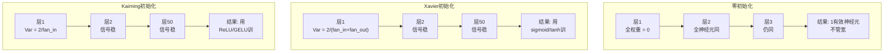
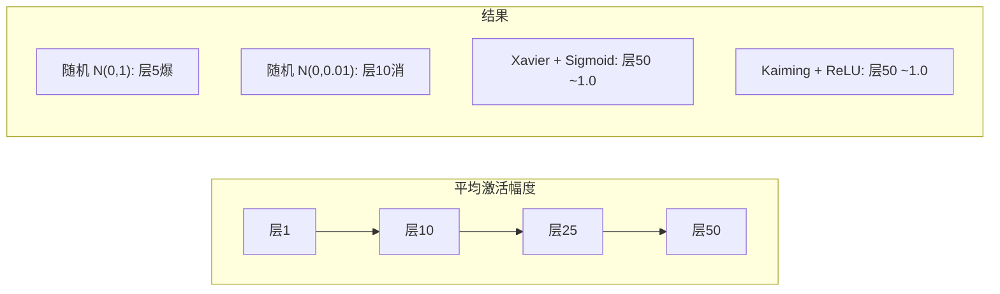
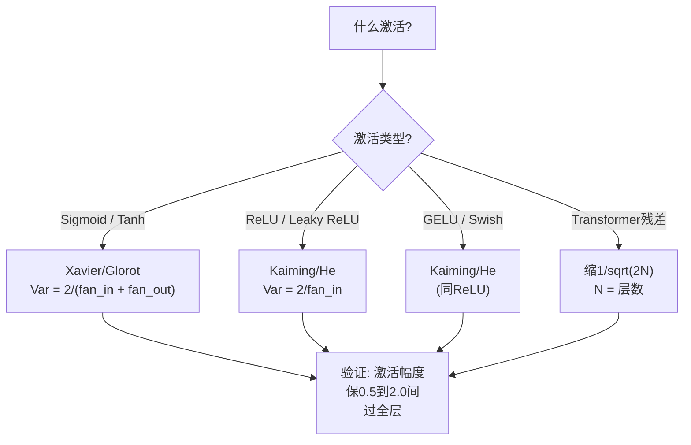

# 权重初始化和训练稳定性

> 初始化错，训练永不开始。初始化对，50层训练如3层平滑。

**类型:** 构建
**语言:** Python
**前置要求:** 课程03.04 (激活函数), 课程03.07 (正则化)
**时间:** ~90分钟

## 学习目标

- 实现零、随机、Xavier/Glorot和Kaiming/He初始化策略测其效过50层激活幅度
- 推导为何Xavier用Var(w) = 2/(fan_in + fan_out)和Kaiming用Var(w) = 2/fan_in
- 示零初始化对称问题解释为何仅随机尺度不足
- 匹配正确初始化策略激活函数: Xavier对sigmoid/tanh，Kaiming对ReLU/GELU

## 问题背景

初始化全权重零。无学。每神经元算同函数，收同梯度，更新同。10,000 epochs后，你512神经元隐藏层仍是512同神经元副本。你付512参数得1。

初始化太大。激活在网络爆。层10，值达1e15。层20，溢无穷。梯度反向跟同轨迹。

初始化随机从标准正态分布。3层工作。50层，信号坍零或爆无穷依赖随机尺度微太小或微太大。"工作"和"坏"边界刃薄。

权重初始化是深度学习最低估决策。架构得论文。优化器得博客。初始化得脚注。但错其他都不重要 -- 你网络在训练开始前死。

## 概念讲解

### 对称问题

层每神经元有同结构: 输入乘权重，加偏置，应用激活。若全权重始同值(零是极端情况)，每神经元算同输出。反向传播，每神经元收同梯度。更新步，每神经元改同量。

你卡住。网络有数百参数，但它们全锁步移动。这称对称，随机初始化是断它暴力法。每神经元始权重空间不同点，故每学不同特征。

但"随机"不足。随机性*尺度*定网络是否训练。

### 方差过层传播

考单层带fan_in输入:

```
z = w1*x1 + w2*x2 + ... + w_n*x_n
```

若每权重wi从带方差Var(w)分布抽和每输入xi有方差Var(x)，输出方差:

```
Var(z) = fan_in * Var(w) * Var(x)
```

若Var(w) = 1和fan_in = 512，输出方差512x输入方差。10层后: 512^10 = 1.2e27。你信号爆。

若Var(w) = 0.001，输出方差每层缩0.001 * 512 = 0.512。10层后: 0.512^10 = 0.00013。你信号消。

目标: 选Var(w)使Var(z) = Var(x)。信号幅度跨层保常。

### Xavier/Glorot初始化

Glorot和Bengio(2010)为sigmoid和tanh激活推导解。保方差常前向反向:

```
Var(w) = 2 / (fan_in + fan_out)
```

实践，权重从:

```
w ~ Uniform(-limit, limit)  其中limit = sqrt(6 / (fan_in + fan_out))
```

或:

```
w ~ Normal(0, sqrt(2 / (fan_in + fan_out)))
```

这工作因sigmoid和tanh近零大致线性，正确初始化激活住处。方差过数十层稳。

### Kaiming/He初始化

ReLU杀半输出(一切负成零)。有效fan_in减半因平均半输入零。Xavier不计这 -- 它低估需方差。

He等(2015)调整公式:

```
Var(w) = 2 / fan_in
```

权重从:

```
w ~ Normal(0, sqrt(2 / fan_in))
```

因子2补偿ReLU零化半激活。无它，信号每层缩~0.5x。50层: 0.5^50 = 8.8e-16。Kaiming防这。

### Transformer初始化

GPT-2引不同模式。残差连接加每子层输出到其输入:

```
x = x + sublayer(x)
```

每加增方差。N残差层，方差比例N增。GPT-2缩残差层权重1/sqrt(2N)，N是层数。这保累积信号幅度稳。

Llama 3(4050亿参数，126层)用类似方案。无此缩放，残差流过126层注意力前馈块将长无界。



### 激活幅度过50层



### 选对初始化



## 构建

### 步骤1: 初始化策略

四法初始化权重矩阵。每返列表列表(2D矩阵)带fan_in列和fan_out行。

```python
import math
import random


def zero_init(fan_in, fan_out):
    return [[0.0 for _ in range(fan_in)] for _ in range(fan_out)]


def random_init(fan_in, fan_out, scale=1.0):
    return [[random.gauss(0, scale) for _ in range(fan_in)] for _ in range(fan_out)]


def xavier_init(fan_in, fan_out):
    std = math.sqrt(2.0 / (fan_in + fan_out))
    return [[random.gauss(0, std) for _ in range(fan_in)] for _ in range(fan_out)]


def kaiming_init(fan_in, fan_out):
    std = math.sqrt(2.0 / fan_in)
    return [[random.gauss(0, std) for _ in range(fan_in)] for _ in range(fan_out)]
```

### 步骤2: 激活函数

需sigmoid、tanh和ReLU测每初始化策略与其意激活。

```python
def sigmoid(x):
    x = max(-500, min(500, x))
    return 1.0 / (1.0 + math.exp(-x))


def tanh_act(x):
    return math.tanh(x)


def relu(x):
    return max(0.0, x)
```

### 步骤3: 前向过50层

过深网络传随机数据测每层平均激活幅度。

```python
def forward_deep(init_fn, activation_fn, n_layers=50, width=64, n_samples=100):
    random.seed(42)
    layer_magnitudes = []

    inputs = [[random.gauss(0, 1) for _ in range(width)] for _ in range(n_samples)]

    for layer_idx in range(n_layers):
        weights = init_fn(width, width)
        biases = [0.0] * width

        new_inputs = []
        for sample in inputs:
            output = []
            for neuron_idx in range(width):
                z = sum(weights[neuron_idx][j] * sample[j] for j in range(width)) + biases[neuron_idx]
                output.append(activation_fn(z))
            new_inputs.append(output)
        inputs = new_inputs

        magnitudes = []
        for sample in inputs:
            magnitudes.append(sum(abs(v) for v in sample) / width)
        mean_mag = sum(magnitudes) / len(magnitudes)
        layer_magnitudes.append(mean_mag)

    return layer_magnitudes
```

### 步骤4: 实验

跑全组合: 零初始化、随机N(0,1)、随机N(0,0.01)、Xavier带sigmoid、Xavier带tanh、Kaiming带ReLU。打印关键层幅度。

```python
def run_experiment():
    configs = [
        ("零初始化 + Sigmoid", lambda fi, fo: zero_init(fi, fo), sigmoid),
        ("随机 N(0,1) + ReLU", lambda fi, fo: random_init(fi, fo, 1.0), relu),
        ("随机 N(0,0.01) + ReLU", lambda fi, fo: random_init(fi, fo, 0.01), relu),
        ("Xavier + Sigmoid", xavier_init, sigmoid),
        ("Xavier + Tanh", xavier_init, tanh_act),
        ("Kaiming + ReLU", kaiming_init, relu),
    ]

    print(f"{'策略':<30} {'L1':>10} {'L5':>10} {'L10':>10} {'L25':>10} {'L50':>10}")
    print("-" * 80)

    for name, init_fn, act_fn in configs:
        mags = forward_deep(init_fn, act_fn)
        row = f"{name:<30}"
        for idx in [0, 4, 9, 24, 49]:
            val = mags[idx]
            if val > 1e6:
                row += f" {'爆':>10}"
            elif val < 1e-6:
                row += f" {'消':>10}"
            else:
                row += f" {val:>10.4f}"
        print(row)
```

### 步骤5: 对称演示

示零初始化产同神经元。

```python
def symmetry_demo():
    random.seed(42)
    weights = zero_init(2, 4)
    biases = [0.0] * 4

    inputs = [0.5, -0.3]
    outputs = []
    for neuron_idx in range(4):
        z = sum(weights[neuron_idx][j] * inputs[j] for j in range(2)) + biases[neuron_idx]
        outputs.append(sigmoid(z))

    print("\n对称演示(4神经元, 零初始化):")
    for i, out in enumerate(outputs):
        print(f"  神经元 {i}: 输出 = {out:.6f}")
    all_same = all(abs(outputs[i] - outputs[0]) < 1e-10 for i in range(len(outputs)))
    print(f"  全同: {all_same}")
    print(f"  有效参数: 1 (非 {len(weights) * len(weights[0])})")
```

### 步骤6: 层级幅度报告

打印激活幅度过50层可视条图。

```python
def magnitude_report(name, magnitudes):
    print(f"\n{name}:")
    for i, mag in enumerate(magnitudes):
        if i % 5 == 0 or i == len(magnitudes) - 1:
            if mag > 1e6:
                bar = "X" * 50 + " 爆"
            elif mag < 1e-6:
                bar = "." + " 消"
            else:
                bar_len = min(50, max(1, int(mag * 10)))
                bar = "#" * bar_len
            print(f"  层 {i+1:3d}: {bar} ({mag:.6f})")
```

## 使用

PyTorch供这些作内建函数:

```python
import torch
import torch.nn as nn

layer = nn.Linear(512, 256)

nn.init.xavier_uniform_(layer.weight)
nn.init.xavier_normal_(layer.weight)

nn.init.kaiming_uniform_(layer.weight, nonlinearity='relu')
nn.init.kaiming_normal_(layer.weight, nonlinearity='relu')

nn.init.zeros_(layer.bias)
```

当你调`nn.Linear(512, 256)`，PyTorch默认Kaiming均匀初始化。这是为何大多简网络"即工" -- PyTorch已做对选择。但当你建自定义架构或深超20层，你需理解发生什么潜在覆盖默认。

Transformer，HuggingFace模型典型在其`_init_weights`法处理初始化。GPT-2实现缩残差投影1/sqrt(N)。若你从零建transformer，你需自加这。

## 交付成果

本课程产生:
- `outputs/prompt-init-strategy.md` -- 诊断权重初始化问题荐对策略提示词

## 练习题

1. 加LeCun初始化(Var = 1/fan_in，为SELU激活设计)。用LeCun初始化+tanh跑50层实验比Xavier+tanh。

2. 实现GPT-2残差缩放: 每层输出乘1/sqrt(2*N)前加到残差流。跑50层有无缩放，测残差幅度多快长。

3. 创"初始化健康检查"函数取网络层维和激活类型，荐正确初始化警若当前初始化将致问题。

4. 跑实验fan_in = 16 vs fan_in = 1024。Xavier和Kaiming适fan_in，但随机初始化不。示"工作"和"坏"隙如何随更大层宽。

5. 实现正交初始化(生随机矩阵，算其SVD，用正交矩阵U)。比Kaiming对ReLU网络50层。

## 关键术语

| 术语 | 人们怎么说 | 实际含义 |
|------|----------------|----------------------|
| 权重初始化 | "随机设起始权重" | 选初始权重值策略定网络是否可训练 |
| 对称断 | "让神经元不同" | 用随机初始化保神经元学区别特征而非算同函数 |
| Fan-in | "神经元输入数" | 入连接数，定输入方差如何加权累积 |
| Fan-out | "神经元输出数" | 出连接数，关反向传播时保梯度方差 |
| Xavier/Glorot初始化 | "sigmoid初始化" | Var(w) = 2/(fan_in + fan_out)，为保方差过sigmoid和tanh激活设计 |
| Kaiming/He初始化 | "ReLU初始化" | Var(w) = 2/fan_in，计ReLU零化半激活 |
| 方差传播 | "信号层间如何长或缩" | 激活方差如何基权重尺度层层变数学分析 |
| 残差缩放 | "GPT-2初始化技巧" | 缩残差连接权重1/sqrt(2N)防方差过N transformer层长 |
| 死网络 | "无训练" | 网络因差初始化致全梯度零或全激活饱和 |
| 爆激活 | "值去无穷" | 当权重方差太高，致激活幅度层间指数长 |

## 延伸阅读

- Glorot & Bengio, "Understanding the difficulty of training deep feedforward neural networks" (2010) -- 原Xavier初始化论文带方差分析
- He等, "Delving Deep into Rectifiers" (2015) -- 为ReLU网络引Kaiming初始化
- Radford等, "Language Models are Unsupervised Multitask Learners" (2019) -- GPT-2论文带残差缩放初始化
- Mishkin & Matas, "All You Need is a Good Init" (2016) -- 层序单位方差初始化，解析公式经验替代