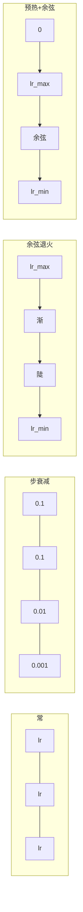
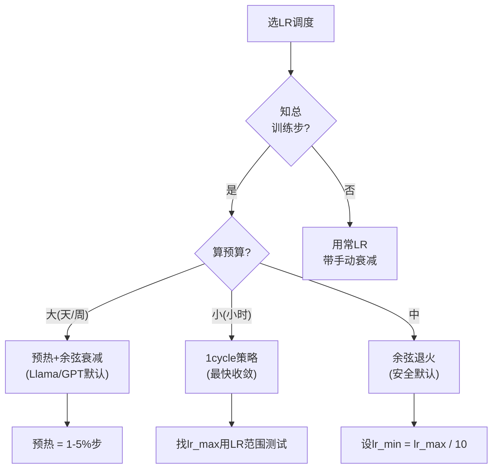
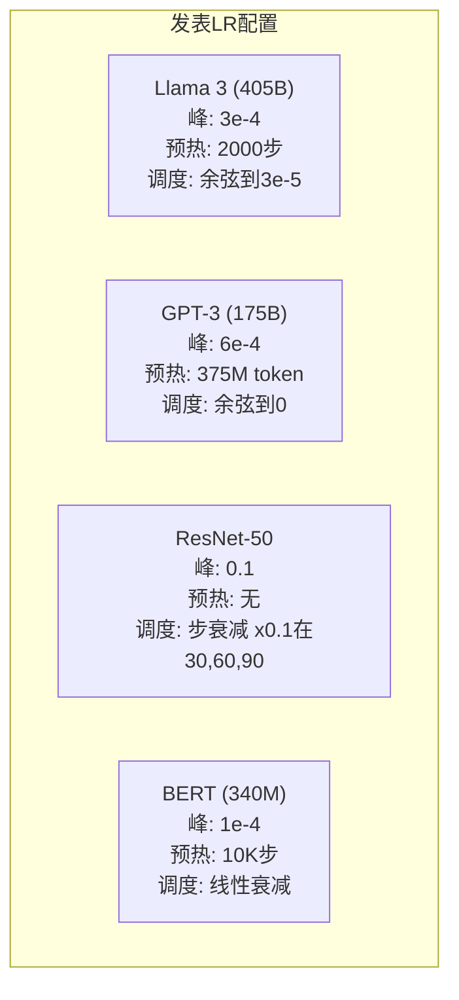

# 学习率调度和预热

> 学习率是最重要的单个超参数。不是架构。不是数据集大小。不是激活函数。是学习率。如果你只调一件事，就调这个。

**类型:** 构建
**语言:** Python
**前置要求:** 课程03.06 (优化器), 课程03.08 (权重初始化)
**时间:** ~90分钟

## 学习目标

- 从零实现常、步衰减、余弦退火、预热+余弦和1cycle学习率调度
- 示学习率选择三失败模式: 分歧(太高)、停滞(太低)和振荡(无衰减)
- 解释为何预热对Adam优化器必要如何稳定早训练
- 比同任务全五调度收敛速度为给定训练预算选适者

## 问题背景

设学习率0.1。训练分歧 -- 损失3步跳无穷。设0.0001。训练爬 -- 100 epochs后，模型几乎未从随机移。设0.01。训练50 epochs工作，然后损失振荡绕最小它永不能达因步太大。

优学习率非常。训练时它变。早，你要大步快覆盖地。训练晚，你要微步沉入尖最小。90%精度模型和95%精度模型差常仅调度。

过去三年发表每大模型用学习率调度。Llama 3用峰lr=3e-4带2000预热步余弦衰减到3e-5。GPT-3用lr=6e-4带预热过37500万token。这些非任意选择。它们是耗数百万美元广超参数扫描结果。

你需理解调度因默认不适你问题。当你微调预训练模型，对调度不同于从零训练。当你增批大小，预热期需改。当训练在步10,000断，你需知是否是调度问题或其他。

## 概念讲解

### 常学习率

最简方法。选数，每步用它。

```
lr(t) = lr_0
```

罕最优。它要么太高训练末(振荡绕最小)要么太低开始(微步耗算)。适小模型和调试。训超一小时任何东西糟选择。

### 步衰减

ResNet时代老派方法。在固定epochs按因子(常10x)砍学习率。

```
lr(t) = lr_0 * gamma^(floor(epoch / step_size))
```

gamma = 0.1和step_size = 30意: lr每30 epochs降10x。ResNet-50用这 -- lr=0.1，在epochs 30、60和90降10x。

问题: 优衰减点依赖数据集和架构。移不同问题你需重调何时降。过渡突 -- 损失可当率突改峰。

### 余弦退火

从最大学习率到最小平滑衰减，跟余弦曲线:

```
lr(t) = lr_min + 0.5 * (lr_max - lr_min) * (1 + cos(pi * t / T))
```

t是当前步和T是总步数。

在t=0，余弦项1，故lr = lr_max。在t=T，余弦项-1，故lr = lr_min。衰减先缓，中加速，末再缓。

这是大多现代训练跑默认。lr_max和lr_min外无超参数调。余弦形匹经验观察大多学习在训练中发生 -- 你想那关键期合理步大小。

### 预热:为何你始小

Adam和其他适应优化器维梯度均值和方差运行估计。步0，这些估计零初始化。首几梯度更新基垃圾统计。若你学习率在这期大，模型取巨、差向步。

预热修复这。始微学习率(常lr_max / warmup_steps或甚至零)线性 ramp升lr_max过首N步。当你达全学习率，Adam统计已稳。

```
lr(t) = lr_max * (t / warmup_steps)     对 t < warmup_steps
```

典型预热: 总训练步1-5%。Llama 3训约1.8万亿token预热2000步。GPT-3预热过37500万token。

### 线性预热+余弦衰减

现代默认。线性 ramp升，然后余弦衰减:

```
若 t < warmup_steps:
    lr(t) = lr_max * (t / warmup_steps)
否则:
    progress = (t - warmup_steps) / (total_steps - warmup_steps)
    lr(t) = lr_min + 0.5 * (lr_max - lr_min) * (1 + cos(pi * progress))
```

这是Llama、GPT、PaLM和大多现代transformer用。预热防早不稳。余弦衰减沉模型入好最小。

### 1cycle策略

Leslie Smith发现(2018): ramp学习率从低值到高值在训练首半，然后ramp回下在次半。反直觉 -- 为何中途*增*学习率？

理论: 高学习率作正则化通过加噪声入优化轨迹。模型在 ramp-up期探更多损失景观，找更好盆。ramp-down期然后在找最佳盆内精炼。

```
相位1 (0到T/2):    lr ramps从lr_max/25到lr_max
相位2 (T/2到T):    lr ramps从lr_max到lr_max/10000
```

1cycle常比余弦退火对固定算预算更快训练。权衡: 你需预知总步数。

### 调度形状



### 决策流图



### 发表模型真实数



## 构建

### 步骤1: 调度函数

每函数取当前步返该步学习率。

```python
import math


def constant_schedule(step, lr=0.01, **kwargs):
    return lr


def step_decay_schedule(step, lr=0.1, step_size=100, gamma=0.1, **kwargs):
    return lr * (gamma ** (step // step_size))


def cosine_schedule(step, lr=0.01, total_steps=1000, lr_min=1e-5, **kwargs):
    if step >= total_steps:
        return lr_min
    return lr_min + 0.5 * (lr - lr_min) * (1 + math.cos(math.pi * step / total_steps))


def warmup_cosine_schedule(step, lr=0.01, total_steps=1000, warmup_steps=100, lr_min=1e-5, **kwargs):
    if total_steps <= warmup_steps:
        return lr * (step / max(warmup_steps, 1))
    if step < warmup_steps:
        return lr * step / warmup_steps
    progress = (step - warmup_steps) / (total_steps - warmup_steps)
    return lr_min + 0.5 * (lr - lr_min) * (1 + math.cos(math.pi * progress))


def one_cycle_schedule(step, lr=0.01, total_steps=1000, **kwargs):
    mid = max(total_steps // 2, 1)
    if step < mid:
        return (lr / 25) + (lr - lr / 25) * step / mid
    else:
        progress = (step - mid) / max(total_steps - mid, 1)
        return lr * (1 - progress) + (lr / 10000) * progress
```

### 步骤2: 可视化全调度

打印文本基图示每调度训练时如何演化。

```python
def visualize_schedule(name, schedule_fn, total_steps=500, **kwargs):
    steps = list(range(0, total_steps, total_steps // 20))
    if total_steps - 1 not in steps:
        steps.append(total_steps - 1)

    lrs = [schedule_fn(s, total_steps=total_steps, **kwargs) for s in steps]
    max_lr = max(lrs) if max(lrs) > 0 else 1.0

    print(f"\n{name}:")
    for s, lr_val in zip(steps, lrs):
        bar_len = int(lr_val / max_lr * 40)
        bar = "#" * bar_len
        print(f"  步 {s:4d}: lr={lr_val:.6f} {bar}")
```

### 步骤3: 训练网络

圆数据集简两层网络，同前课，但现变调度。

```python
import random


def sigmoid(x):
    x = max(-500, min(500, x))
    return 1.0 / (1.0 + math.exp(-x))


def relu(x):
    return max(0.0, x)


def relu_deriv(x):
    return 1.0 if x > 0 else 0.0


def make_circle_data(n=200, seed=42):
    random.seed(seed)
    data = []
    for _ in range(n):
        x = random.uniform(-2, 2)
        y = random.uniform(-2, 2)
        label = 1.0 if x * x + y * y < 1.5 else 0.0
        data.append(([x, y], label))
    return data


def train_with_schedule(schedule_fn, schedule_name, data, epochs=300, base_lr=0.05, **kwargs):
    random.seed(0)
    hidden_size = 8
    total_steps = epochs * len(data)

    std = math.sqrt(2.0 / 2)
    w1 = [[random.gauss(0, std) for _ in range(2)] for _ in range(hidden_size)]
    b1 = [0.0] * hidden_size
    w2 = [random.gauss(0, std) for _ in range(hidden_size)]
    b2 = 0.0

    step = 0
    epoch_losses = []

    for epoch in range(epochs):
        total_loss = 0
        correct = 0

        for x, target in data:
            lr = schedule_fn(step, lr=base_lr, total_steps=total_steps, **kwargs)

            z1 = []
            h = []
            for i in range(hidden_size):
                z = w1[i][0] * x[0] + w1[i][1] * x[1] + b1[i]
                z1.append(z)
                h.append(relu(z))

            z2 = sum(w2[i] * h[i] for i in range(hidden_size)) + b2
            out = sigmoid(z2)

            error = out - target
            d_out = error * out * (1 - out)

            for i in range(hidden_size):
                d_h = d_out * w2[i] * relu_deriv(z1[i])
                w2[i] -= lr * d_out * h[i]
                for j in range(2):
                    w1[i][j] -= lr * d_h * x[j]
                b1[i] -= lr * d_h
            b2 -= lr * d_out

            total_loss += (out - target) ** 2
            if (out >= 0.5) == (target >= 0.5):
                correct += 1
            step += 1

        avg_loss = total_loss / len(data)
        accuracy = correct / len(data) * 100
        epoch_losses.append(avg_loss)

    return epoch_losses
```

### 步骤4: 比全调度

用每调度训同网络比最终损失和收敛行为。

```python
def compare_schedules(data):
    configs = [
        ("常", constant_schedule, {}),
        ("步衰减", step_decay_schedule, {"step_size": 15000, "gamma": 0.1}),
        ("余弦", cosine_schedule, {"lr_min": 1e-5}),
        ("预热+余弦", warmup_cosine_schedule, {"warmup_steps": 3000, "lr_min": 1e-5}),
        ("1cycle", one_cycle_schedule, {}),
    ]

    print(f"\n{'调度':<20} {'始损失':>12} {'中损失':>12} {'终损失':>12} {'最佳损失':>12}")
    print("-" * 70)

    for name, schedule_fn, extra_kwargs in configs:
        losses = train_with_schedule(schedule_fn, name, data, epochs=300, base_lr=0.05, **extra_kwargs)
        mid_idx = len(losses) // 2
        best = min(losses)
        print(f"{name:<20} {losses[0]:>12.6f} {losses[mid_idx]:>12.6f} {losses[-1]:>12.6f} {best:>12.6f}")
```

### 步骤5: LR太高vs太低

示三失败模式: 太高(分歧)、太低(爬)、刚好。

```python
def lr_sensitivity(data):
    learning_rates = [1.0, 0.1, 0.01, 0.001, 0.0001]

    print("\nLR敏感度(常调度, 100 epochs):")
    print(f"  {'LR':>10} {'始损失':>12} {'终损失':>12} {'状态':>15}")
    print("  " + "-" * 52)

    for lr in learning_rates:
        losses = train_with_schedule(constant_schedule, f"lr={lr}", data, epochs=100, base_lr=lr)
        start = losses[0]
        end = losses[-1]

        if end > start or math.isnan(end) or end > 1.0:
            status = "分歧"
        elif end > start * 0.9:
            status = "几不动"
        elif end < 0.15:
            status = "收敛"
        else:
            status = "学习中"

        end_str = f"{end:.6f}" if not math.isnan(end) else "NaN"
        print(f"  {lr:>10.4f} {start:>12.6f} {end_str:>12} {status:>15}")
```

## 使用

PyTorch在`torch.optim.lr_scheduler`供调度器:

```python
import torch
import torch.optim as optim
from torch.optim.lr_scheduler import CosineAnnealingLR, OneCycleLR, StepLR

model = nn.Sequential(nn.Linear(10, 64), nn.ReLU(), nn.Linear(64, 1))
optimizer = optim.Adam(model.parameters(), lr=3e-4)

scheduler = CosineAnnealingLR(optimizer, T_max=1000, eta_min=1e-5)

for step in range(1000):
    loss = train_step(model, optimizer)
    scheduler.step()
```

预热+余弦，用lambda调度器或HuggingFace`get_cosine_schedule_with_warmup`:

```python
from transformers import get_cosine_schedule_with_warmup

scheduler = get_cosine_schedule_with_warmup(
    optimizer,
    num_warmup_steps=2000,
    num_training_steps=100000,
)
```

HuggingFace函数是大多Llama和GPT微调脚本用。疑时，用预热+余弦带预热=总步3-5%。它几乎适一切。

## 交付成果

本课程产生:
- `outputs/prompt-lr-schedule-advisor.md` -- 为你训练设置荐对学习率调度和超参数提示词

## 练习题

1. 实现指数衰减: lr(t) = lr_0 * gamma^t其中gamma = 0.999。比余弦退火在圆数据集。

2. 实现学习率范围测试(Leslie Smith): 训几百步同时指数增LR从1e-7到1。绘损失vs LR。优max LR在损失始增前。

3. 训预热+余弦但变预热长: 总步0%、1%、5%、10%、20%。找训练最稳甜点。

4. 实现余弦退火带预热重启(SGDR): 每T步重置学习率到lr_max再衰减。比标准余弦更长训练跑。

5. 建"调度外科医生"监训练损失自动从预热切换到余弦当损失稳，若损失太久平台减lr。

## 关键术语

| 术语 | 人们怎么说 | 实际含义 |
|------|----------------|----------------------|
| 学习率 | "模型学多快" | 乘梯度定参数更新大小标量 |
| 调度 | "随时改LR" | 映训练步到学习率函数，设计优化收敛 |
| 预热 | "始小LR" | 线性 ramp LR从近零到目标值过首N步稳定优化器统计 |
| 余弦退火 | "平滑LR衰减" | 按余弦曲线从lr_max到lr_min减LR过训练 |
| 步衰减 | "里程碑降LR" | 在固定epoch间隔乘LR因子(常0.1) |
| 1cycle策略 | "升后降" | Leslie Smith ramp LR升后降单周期更快收敛方法 |
| LR范围测试 | "找最佳学习率" | 简训同时增LR找损失始分歧值 |
| 余弦带预热重启 | "重置重复" | 周期重置LR到lr_max再衰减(SGDR) |
| Eta min | "LR底" | 调度衰减到最小学习率 |
| 峰学习率 | "最大LR" | 训练达最高LR，典型预热后 |

## 延伸阅读

- Loshchilov & Hutter, "SGDR: Stochastic Gradient Descent with Warm Restarts" (2017) -- 引余弦退火和预热重启
- Smith, "Super-Convergence: Very Fast Training of Neural Networks Using Large Learning Rates" (2018) -- 1cycle策略论文
- Touvron等, "Llama 2: Open Foundation and Fine-Tuned Chat Models" (2023) -- 文档规模用预热+余弦调度
- Goyal等, "Accurate, Large Minibatch SGD: Training ImageNet in 1 Hour" (2017) -- 线性缩规则和大批训练预热