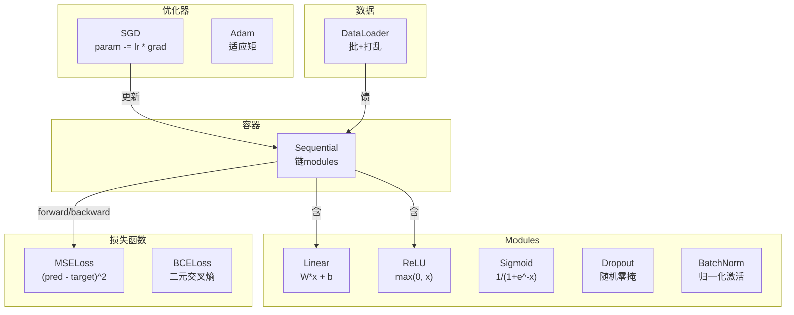
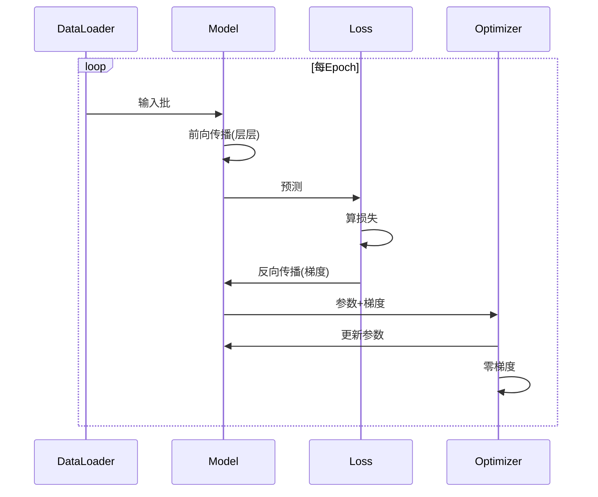
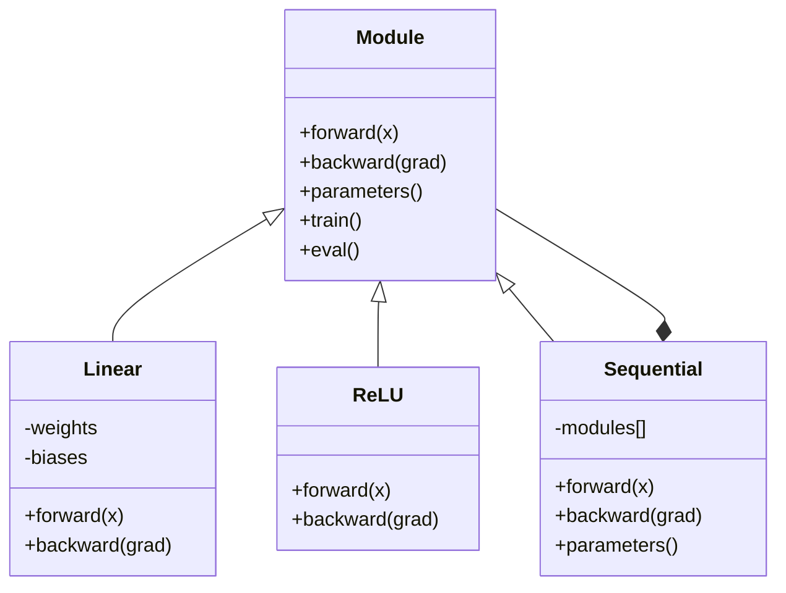

# 建你自微框架

> 你建神经元、层、网络、反向传播、激活函数、损失函数、优化器、正则化、初始化和LR调度。全作为分片。现线它们一起成框架。非PyTorch。非TensorFlow。你。

**类型:** 构建
**语言:** Python
**前置要求:** 全阶段03(课程01-09)
**时间:** ~120分钟

## 学习目标

- 完整深度学习框架(~500行)带Module、Linear、ReLU、Sigmoid、Dropout、BatchNorm、Sequential、损失函数、优化器和DataLoader
- 解释Module抽象(forward、backward、parameters)为何train/eval模式切换必要
- 线全组件入工作训练循环训4层网络圆分类
- 映框架每组件到其PyTorch等价(nn.Module、nn.Sequential、optim.Adam、DataLoader)

## 问题背景

你有十课构建块散在分文件。`Value`类这，训练循环那，权重初始化另文件，学习率调度又另。训网络，你从五不同课复制粘贴手线它们。

那是框架解。PyTorch给你`nn.Module`、`nn.Sequential`、optim.Adam、DataLoader和训练循环模式线它们一起。TensorFlow给你keras.Layer、keras.Sequential、keras.optimizers.Adam。这些非魔法。它们是组织模式使可能定义、训、评网络无每次重布线。

你要在~500行Python建同物。无numpy。无外依赖。框架可定义任何前馈网络，用SGD或Adam训，批数据，应用dropout和批归一化，用任何激活，调度学习率。

当你完，你将精确理解当你写`model = nn.Sequential(...)`在PyTorch发生什么。你将理解为何`model.train()`和`model.eval()`存在。你将理解为何`optimizer.zero_grad()`是分调用。你将理解全，因你建全。

## 概念讲解

### Module抽象

PyTorch每层继`nn.Module`。Module有三职:

1. **forward()** -- 给输入算输出
2. **parameters()** -- 返全可训练权重
3. **backward()** -- 算梯度(PyTorch由autograd处理，我们显式)

Linear层是Module。ReLU激活是Module。Dropout层是Module。批归一化层是Module。它们全有同接口。

### Sequential容器

`nn.Sequential`链Modules。前向传播: 饥数据过Module 1，然后Module 2，然后Module 3。反向传播: 反链。容器本身是Module -- 它有forward()、parameters()和backward()。这是组模式: Module序是本身Module。

### 训练vs评估模式

Dropout训练时随机零神经元但评估时传全。批归一化训练时用批统计但评估时用运行平均。`train()`和`eval()`法切换这行为。每Module有`training`标志。

### 优化器

优化器用梯度更新参数。SGD: `param -= lr * grad`。Adam: 维动量和方差估计，然后更新。优化器不知网络架构 -- 它仅见参数和其梯度平列表。

### DataLoader

批重要两原因。一，大问题你不能整数据集入内存。二，mini-batch梯度下降供噪声助逃局部最小。DataLoader分数据入批可选epochs间打乱。

### 框架架构



### 训练循环



### Module层级



## 构建

### 步骤1: Module基类

每层实现抽象接口。

```python
class Module:
    def __init__(self):
        self.training = True

    def forward(self, x):
        raise NotImplementedError

    def backward(self, grad):
        raise NotImplementedError

    def parameters(self):
        return []

    def train(self):
        self.training = True

    def eval(self):
        self.training = False
```

### 步骤2: Linear层

基础构建块。存权重和偏置，前向算Wx + b，反向算权重/输入梯度。

```python
import math
import random


class Linear(Module):
    def __init__(self, fan_in, fan_out):
        super().__init__()
        std = math.sqrt(2.0 / fan_in)
        self.weights = [[random.gauss(0, std) for _ in range(fan_in)] for _ in range(fan_out)]
        self.biases = [0.0] * fan_out
        self.weight_grads = [[0.0] * fan_in for _ in range(fan_out)]
        self.bias_grads = [0.0] * fan_out
        self.fan_in = fan_in
        self.fan_out = fan_out
        self.input = None

    def forward(self, x):
        self.input = x
        output = []
        for i in range(self.fan_out):
            val = self.biases[i]
            for j in range(self.fan_in):
                val += self.weights[i][j] * x[j]
            output.append(val)
        return output

    def backward(self, grad):
        input_grad = [0.0] * self.fan_in
        for i in range(self.fan_out):
            self.bias_grads[i] += grad[i]
            for j in range(self.fan_in):
                self.weight_grads[i][j] += grad[i] * self.input[j]
                input_grad[j] += grad[i] * self.weights[i][j]
        return input_grad

    def parameters(self):
        params = []
        for i in range(self.fan_out):
            for j in range(self.fan_in):
                params.append((self.weights, i, j, self.weight_grads))
            params.append((self.biases, i, None, self.bias_grads))
        return params
```

### 步骤3: 激活Modules

ReLU、Sigmoid和Tanh作Modules。每缓存反向传播需。

```python
class ReLU(Module):
    def __init__(self):
        super().__init__()
        self.mask = None

    def forward(self, x):
        self.mask = [1.0 if v > 0 else 0.0 for v in x]
        return [max(0.0, v) for v in x]

    def backward(self, grad):
        return [g * m for g, m in zip(grad, self.mask)]


class Sigmoid(Module):
    def __init__(self):
        super().__init__()
        self.output = None

    def forward(self, x):
        self.output = []
        for v in x:
            v = max(-500, min(500, v))
            self.output.append(1.0 / (1.0 + math.exp(-v)))
        return self.output

    def backward(self, grad):
        return [g * o * (1 - o) for g, o in zip(grad, self.output)]


class Tanh(Module):
    def __init__(self):
        super().__init__()
        self.output = None

    def forward(self, x):
        self.output = [math.tanh(v) for v in x]
        return self.output

    def backward(self, grad):
        return [g * (1 - o * o) for g, o in zip(grad, self.output)]
```

### 步骤4: Dropout Module

训练时随机零元素。缩剩余元素1/(1-p)保期望值同。评估时无操作。

```python
class Dropout(Module):
    def __init__(self, p=0.5):
        super().__init__()
        self.p = p
        self.mask = None

    def forward(self, x):
        if not self.training:
            return x
        self.mask = [0.0 if random.random() < self.p else 1.0 / (1 - self.p) for _ in x]
        return [v * m for v, m in zip(x, self.mask)]

    def backward(self, grad):
        if self.mask is None:
            return grad
        return [g * m for g, m in zip(grad, self.mask)]
```

### 步骤5: BatchNorm Module

归一化激活零均值单位方差每特征跨批。维运行统计评估模式。

```python
class BatchNorm(Module):
    def __init__(self, size, momentum=0.1, eps=1e-5):
        super().__init__()
        self.size = size
        self.gamma = [1.0] * size
        self.beta = [0.0] * size
        self.gamma_grads = [0.0] * size
        self.beta_grads = [0.0] * size
        self.running_mean = [0.0] * size
        self.running_var = [1.0] * size
        self.momentum = momentum
        self.eps = eps
        self.x_norm = None
        self.std_inv = None
        self.batch_input = None

    def forward_batch(self, batch):
        batch_size = len(batch)
        output_batch = []

        if self.training:
            mean = [0.0] * self.size
            for sample in batch:
                for j in range(self.size):
                    mean[j] += sample[j]
            mean = [m / batch_size for m in mean]

            var = [0.0] * self.size
            for sample in batch:
                for j in range(self.size):
                    var[j] += (sample[j] - mean[j]) ** 2
            var = [v / batch_size for v in var]

            self.std_inv = [1.0 / math.sqrt(v + self.eps) for v in var]

            self.x_norm = []
            self.batch_input = batch
            for sample in batch:
                normed = [(sample[j] - mean[j]) * self.std_inv[j] for j in range(self.size)]
                self.x_norm.append(normed)
                output = [self.gamma[j] * normed[j] + self.beta[j] for j in range(self.size)]
                output_batch.append(output)

            for j in range(self.size):
                self.running_mean[j] = (1 - self.momentum) * self.running_mean[j] + self.momentum * mean[j]
                self.running_var[j] = (1 - self.momentum) * self.running_var[j] + self.momentum * var[j]
        else:
            std_inv = [1.0 / math.sqrt(v + self.eps) for v in self.running_var]
            for sample in batch:
                normed = [(sample[j] - self.running_mean[j]) * std_inv[j] for j in range(self.size)]
                output = [self.gamma[j] * normed[j] + self.beta[j] for j in range(self.size)]
                output_batch.append(output)

        return output_batch

    def forward(self, x):
        result = self.forward_batch([x])
        return result[0]

    def backward(self, grad):
        if self.x_norm is None:
            return grad
        for j in range(self.size):
            self.gamma_grads[j] += self.x_norm[0][j] * grad[j]
            self.beta_grads[j] += grad[j]
        return [grad[j] * self.gamma[j] * self.std_inv[j] for j in range(self.size)]

    def parameters(self):
        params = []
        for j in range(self.size):
            params.append((self.gamma, j, None, self.gamma_grads))
            params.append((self.beta, j, None, self.beta_grads))
        return params
```

### 步骤6: Sequential容器

链modules。前向左到右，反向右到左。

```python
class Sequential(Module):
    def __init__(self, *modules):
        super().__init__()
        self.modules = list(modules)

    def forward(self, x):
        for module in self.modules:
            x = module.forward(x)
        return x

    def backward(self, grad):
        for module in reversed(self.modules):
            grad = module.backward(grad)
        return grad

    def parameters(self):
        params = []
        for module in self.modules:
            params.extend(module.parameters())
        return params

    def train(self):
        self.training = True
        for module in self.modules:
            module.train()

    def eval(self):
        self.training = False
        for module in self.modules:
            module.eval()
```

### 步骤7: 损失函数

MSE和二元交叉熵。每返损失值供backward()返梯度。

```python
class MSELoss:
    def __call__(self, predicted, target):
        self.predicted = predicted
        self.target = target
        n = len(predicted)
        self.loss = sum((p - t) ** 2 for p, t in zip(predicted, target)) / n
        return self.loss

    def backward(self):
        n = len(self.predicted)
        return [2 * (p - t) / n for p, t in zip(self.predicted, self.target)]


class BCELoss:
    def __call__(self, predicted, target):
        self.predicted = predicted
        self.target = target
        eps = 1e-7
        n = len(predicted)
        self.loss = 0
        for p, t in zip(predicted, target):
            p = max(eps, min(1 - eps, p))
            self.loss += -(t * math.log(p) + (1 - t) * math.log(1 - p))
        self.loss /= n
        return self.loss

    def backward(self):
        eps = 1e-7
        n = len(self.predicted)
        grads = []
        for p, t in zip(self.predicted, self.target):
            p = max(eps, min(1 - eps, p))
            grads.append((-t / p + (1 - t) / (1 - p)) / n)
        return grads
```

### 步骤8: SGD和Adam优化器

两者取参数列表用梯度更新权重。

```python
class SGD:
    def __init__(self, parameters, lr=0.01):
        self.params = parameters
        self.lr = lr

    def step(self):
        for container, i, j, grad_container in self.params:
            if j is not None:
                container[i][j] -= self.lr * grad_container[i][j]
            else:
                container[i] -= self.lr * grad_container[i]

    def zero_grad(self):
        for container, i, j, grad_container in self.params:
            if j is not None:
                grad_container[i][j] = 0.0
            else:
                grad_container[i] = 0.0


class Adam:
    def __init__(self, parameters, lr=0.001, beta1=0.9, beta2=0.999, eps=1e-8):
        self.params = parameters
        self.lr = lr
        self.beta1 = beta1
        self.beta2 = beta2
        self.eps = eps
        self.t = 0
        self.m = [0.0] * len(parameters)
        self.v = [0.0] * len(parameters)

    def step(self):
        self.t += 1
        for idx, (container, i, j, grad_container) in enumerate(self.params):
            if j is not None:
                g = grad_container[i][j]
            else:
                g = grad_container[i]

            self.m[idx] = self.beta1 * self.m[idx] + (1 - self.beta1) * g
            self.v[idx] = self.beta2 * self.v[idx] + (1 - self.beta2) * g * g

            m_hat = self.m[idx] / (1 - self.beta1 ** self.t)
            v_hat = self.v[idx] / (1 - self.beta2 ** self.t)

            update = self.lr * m_hat / (math.sqrt(v_hat) + self.eps)

            if j is not None:
                container[i][j] -= update
            else:
                container[i] -= update

    def zero_grad(self):
        for container, i, j, grad_container in self.params:
            if j is not None:
                grad_container[i][j] = 0.0
            else:
                grad_container[i] = 0.0
```

### 步骤9: DataLoader

分数据入批，可选每epoch打乱。

```python
class DataLoader:
    def __init__(self, data, batch_size=32, shuffle=True):
        self.data = data
        self.batch_size = batch_size
        self.shuffle = shuffle

    def __iter__(self):
        indices = list(range(len(self.data)))
        if self.shuffle:
            random.shuffle(indices)
        for start in range(0, len(indices), self.batch_size):
            batch_indices = indices[start:start + self.batch_size]
            batch = [self.data[i] for i in batch_indices]
            inputs = [item[0] for item in batch]
            targets = [item[1] for item in batch]
            yield inputs, targets

    def __len__(self):
        return (len(self.data) + self.batch_size - 1) // self.batch_size
```

### 步骤10: 训4层网络圆分类

线全一起。定义模型，选损失，选优化器，跑训练循环。

```python
def make_circle_data(n=500, seed=42):
    random.seed(seed)
    data = []
    for _ in range(n):
        x = random.uniform(-2, 2)
        y = random.uniform(-2, 2)
        label = 1.0 if x * x + y * y < 1.5 else 0.0
        data.append(([x, y], [label]))
    return data


def train():
    random.seed(42)

    model = Sequential(
        Linear(2, 16),
        ReLU(),
        Linear(16, 16),
        ReLU(),
        Linear(16, 8),
        ReLU(),
        Linear(8, 1),
        Sigmoid(),
    )

    criterion = BCELoss()
    optimizer = Adam(model.parameters(), lr=0.01)

    data = make_circle_data(500)
    split = int(len(data) * 0.8)
    train_data = data[:split]
    test_data = data[split:]

    loader = DataLoader(train_data, batch_size=16, shuffle=True)

    model.train()

    for epoch in range(100):
        total_loss = 0
        total_correct = 0
        total_samples = 0

        for batch_inputs, batch_targets in loader:
            batch_loss = 0
            for x, t in zip(batch_inputs, batch_targets):
                pred = model.forward(x)
                loss = criterion(pred, t)
                batch_loss += loss

                optimizer.zero_grad()
                grad = criterion.backward()
                model.backward(grad)
                optimizer.step()

                predicted_class = 1.0 if pred[0] >= 0.5 else 0.0
                if predicted_class == t[0]:
                    total_correct += 1
                total_samples += 1

            total_loss += batch_loss

        avg_loss = total_loss / total_samples
        accuracy = total_correct / total_samples * 100

        if epoch % 10 == 0 or epoch == 99:
            print(f"Epoch {epoch:3d} | 损失: {avg_loss:.6f} | 训练精度: {accuracy:.1f}%")

    model.eval()
    correct = 0
    for x, t in test_data:
        pred = model.forward(x)
        predicted_class = 1.0 if pred[0] >= 0.5 else 0.0
        if predicted_class == t[0]:
            correct += 1
    test_accuracy = correct / len(test_data) * 100
    print(f"\n测试精度: {test_accuracy:.1f}% ({correct}/{len(test_data)})")

    return model, test_accuracy
```

## 使用

这是你刚建PyTorch等价:

```python
import torch
import torch.nn as nn
from torch.utils.data import DataLoader, TensorDataset

model = nn.Sequential(
    nn.Linear(2, 16),
    nn.ReLU(),
    nn.Linear(16, 16),
    nn.ReLU(),
    nn.Linear(16, 8),
    nn.ReLU(),
    nn.Linear(8, 1),
    nn.Sigmoid(),
)

criterion = nn.BCELoss()
optimizer = torch.optim.Adam(model.parameters(), lr=0.01)

for epoch in range(100):
    model.train()
    for inputs, targets in dataloader:
        optimizer.zero_grad()
        predictions = model(inputs)
        loss = criterion(predictions, targets)
        loss.backward()
        optimizer.step()

    model.eval()
    with torch.no_grad():
        test_predictions = model(test_inputs)
```

结构完全等。`Sequential`、`Linear`、`ReLU`、`Sigmoid`、`BCELoss`、`Adam`、`zero_grad`、`backward`、`step`、`train`、`eval`。每概念一一映射。差是PyTorch自动处理autograd(无需每module实现backward())，GPU跑，并已优多年。但骨架同。

现当你见PyTorch代码，你知每行发生什么。那理解是全点。

## 交付成果

本课程产生:
- `outputs/prompt-framework-architect.md` -- 用框架抽象设计神经网络架构提示词

## 练习题

1. 加`SoftmaxCrossEntropyLoss`类对多类分类。Softmax预测，算交叉熵损失，处理合反向传播。在3类螺旋数据集测。

2. 在优化器实现学习率调度: 加`set_lr()`法线入课程09余弦调度。用预热+余弦训圆分类器比常LR。

3. 加`save()`和`load()`法到Sequential序化全权重到JSON文件加载回。验证加载模型产同预测原模型。

4. 在Adam优化器实现权重衰减(L2正则化)。加`weight_decay`参数每步缩权重向零。比训练衰减=0 vs衰减=0.01。

5. 替换每样本训练循环用正mini-batch梯度累积: 跨批全样本累积梯度，然后除批大小取一优化器步。测是否改收敛速度。

## 关键术语

| 术语 | 人们怎么说 | 实际含义 |
|------|----------------|----------------------|
| Module | "一层" | 框架中基抽象 -- 任何带forward()、backward()和parameters()东西 |
| Sequential | "按序堆层" | modules容器，前向序应用，反向反序应用 |
| 前向传播 | "跑网络" | 输入过每module序算输出 |
| 反向传播 | "算梯度" | 损失梯度过每module反序传播算参数梯度 |
| 参数 | "可训练权重" | 网络中优化器可更新全值 -- 权重和偏置 |
| 优化器 | "更新权重东西" | 用梯度更新参数算法，实现SGD、Adam或其他规则 |
| DataLoader | "馈数据东西" | 分数据集入批迭代器，可选epochs间打乱 |
| 训练模式 | "model.train()" | 启随机行为如dropout和批归一化用批统计标志 |
| 评估模式 | "model.eval()" | 禁dropout用运行统计批归一化标志 |
| 零梯度 | "清梯度" | 在算下批梯度前重置全参数梯度零 |

## 延伸阅读

- Paszke等, "PyTorch: An Imperative Style, High-Performance Deep Learning Library" (2019) -- 描述PyTorch设计决策论文
- Chollet, "Deep Learning with Python, Second Edition" (2021) -- 第3章覆盖Keras内件同module/layer抽象
- Johnson, "Tiny-DNN" (https://github.com/tiny-dnn/tiny-dnn) -- 头-only C++深度学习框架理解框架内件