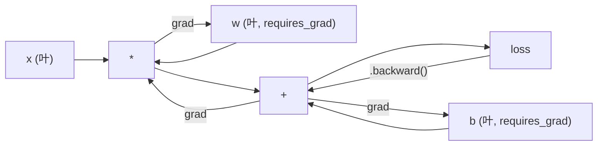
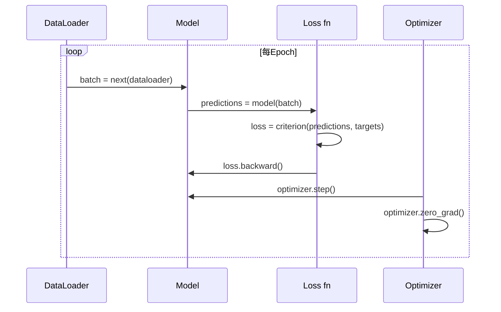

# PyTorch简介

> 你从活塞和曲轴建引擎。现学大家实际开那。

**类型:** 构建
**语言:** Python
**前置要求:** 课程03.10(建你自微框架)
**时间:** ~75分钟

## 学习目标

- 用PyTorch nn.Module、nn.Sequential和autograd建训神经网络
- 用PyTorch张量、GPU加速和标准训练循环(zero_grad、forward、loss、backward、step)
- 将你从零微框架组件转为PyTorch等价
- 性能分析和比纯Python框架与PyTorch在同任务训练速度

## 问题背景

你工作微框架。Linear层、ReLU、dropout、批归一化、Adam、DataLoader、训练循环。它在圆分类问题训4层网络纯Python。

它也比PyTorch在同问题慢500x。

你微框架用嵌Python循环一次处理一样本。PyTorch派同操作到优化C++/CUDA内核GPU跑。单NVIDIA A100，PyTorch训ResNet-50(2560万参数)在ImageNet(128万图像)约6小时。你框架将约3000小时同任务 -- 如果它不先耗内存。

速度非唯一差距。你框架无GPU支持。无自动微分 -- 你手写每module backward()。无序化。无分布式训练。无混合精度。无法调试梯度流无print语句。

PyTorch填每差距。它做同时保你已建同心智模型: Module、forward()、parameters()、backward()、optimizer.step()。概念一一迁移。语法几乎等。差是PyTorch裹同接口后十年系统工程。

## 概念讲解

### 为何PyTorch赢

2015，TensorFlow要求你定义静计算图跑任何东西前。你建图，编译它，然后馈数据过它。调试意味盯图可视化。改架构意味从零重建图。

PyTorch2017启不同哲学: 急切执行。你写Python。它即跑。`y = model(x)`实算y现在，非"加节点到图将后算y"。这意味标准Python调试工具工作。print()工作。pdb工作。forward pass中if/else工作。

2020，市场说。PyTorch在ML研论文份额从7%(2017)到超75%(2022)。Meta、Google DeepMind、OpenAI、Anthropic和Hugging Face全用PyTorch作主框架。TensorFlow 2.x响应采纳急切执行 -- 默认PyTorch设计正确。

教训: 开发者体验复。框架10%慢但50%快调试总赢。

### 张量

张量是多维数组带三关键性质: 形状、dtype和设备。

```python
import torch

x = torch.zeros(3, 4)           # 形状: (3, 4), dtype: float32, 设备: cpu
x = torch.randn(2, 3, 224, 224) # 2 RGB图像批, 224x224
x = torch.tensor([1, 2, 3])     # 从Python列表
```

**形状**是维度。标量是形状()，向量是(n,)，矩阵是(m, n)，图像批是(batch, channels, height, width)。

**Dtype**控精度和内存。

| dtype | 位 | 范围 | 用例 |
|-------|----|------|------|
| float32 | 32 | ~7十进制位 | 默认训练 |
| float16 | 16 | ~3.3十进制位 | 混合精度 |
| bfloat16 | 16 | 同float32范围，更少精度 | LLM训练 |
| int8 | 8 | -128到127 | 量化推理 |

**设备**定计算发生处。

```python
device = torch.device("cuda" if torch.cuda.is_available() else "cpu")
x = torch.randn(3, 4, device=device)
x = x.to("cuda")
x = x.cpu()
```

每操作需全张量在同设备。这是#1 PyTorch初学者错: `RuntimeError: Expected all tensors to be on the same device`。修它通过计算前移全到同设备。

**重塑**是常时 -- 它改元数据，非数据。

```python
x = torch.randn(2, 3, 4)
x.view(2, 12)      # 重塑到(2, 12) -- 必连续
x.reshape(6, 4)    # 重塑到(6, 4) -- 总工作
x.permute(2, 0, 1) # 重排维度
x.unsqueeze(0)     # 加维度: (1, 2, 3, 4)
x.squeeze()        # 移大小-1维度
```

### Autograd

你微框架要求你实现每module backward()。PyTorch不。它录每张量上操作入有向无环图(计算图)然后反向遍历图自动算梯度。



与你框架关键差: PyTorch用带基autodiff。每操作前向传播时追加到"带"。调用`.backward()`反向播放带。

```python
x = torch.randn(3, requires_grad=True)
y = x ** 2 + 3 * x
z = y.sum()
z.backward()
print(x.grad)  # dz/dx = 2x + 3
```

Autograd三规则:

1. 仅带`requires_grad=True`叶张量累积梯度
2. 梯度默认累积 -- 每反向传播前调用`optimizer.zero_grad()`
3. `torch.no_grad()`禁梯度追踪(评估时用)

### nn.Module

`nn.Module`是PyTorch每神经网络组件基类。你已在课程10建这抽象。PyTorch版本加自动参数注册、递归module发现、设备管理和state dict序化。

```python
import torch.nn as nn

class MLP(nn.Module):
    def __init__(self, input_dim, hidden_dim, output_dim):
        super().__init__()
        self.layer1 = nn.Linear(input_dim, hidden_dim)
        self.relu = nn.ReLU()
        self.layer2 = nn.Linear(hidden_dim, output_dim)

    def forward(self, x):
        x = self.layer1(x)
        x = self.relu(x)
        x = self.layer2(x)
        return x
```

当你在`__init__`赋`nn.Module`或`nn.Parameter`作属性，PyTorch自动注册它。`model.parameters()`递归集每注册参数。这是为何你永不需手动集权重如微框架。

关键构建块:

| Module | 做什么 | 参数 |
|--------|--------|------|
| nn.Linear(in, out) | Wx + b | in*out + out |
| nn.Conv2d(in_ch, out_ch, k) | 2D卷积 | in_ch*out_ch*k*k + out_ch |
| nn.BatchNorm1d(features) | 归一化激活 | 2 * features |
| nn.Dropout(p) | 随机零 | 0 |
| nn.ReLU() | max(0, x) | 0 |
| nn.GELU() | 高斯误差线性 | 0 |
| nn.Embedding(vocab, dim) | 查找表 | vocab * dim |
| nn.LayerNorm(dim) | 每样本归一化 | 2 * dim |

### 损失函数和优化器

PyTorch产你建全生产级版本。

**损失函数**(从`torch.nn`):

| 损失 | 任务 | 输入 |
|------|------|------|
| nn.MSELoss() | 回归 | 任何形状 |
| nn.CrossEntropyLoss() | 多类分类 | Logits(非softmax) |
| nn.BCEWithLogitsLoss() | 二元分类 | Logits(非sigmoid) |
| nn.L1Loss() | 回归(鲁棒) | 任何形状 |
| nn.CTCLoss() | 序对齐 | Log概率 |

注: `CrossEntropyLoss`内合`LogSoftmax` + `NLLLoss`。传原始logits，非softmax输出。这是常见错产静错梯度。

**优化器**(从`torch.optim`):

| 优化器 | 何时用 | 典型LR |
|--------|--------|--------|
| SGD(params, lr, momentum) | CNN，好调流水线 | 0.01--0.1 |
| Adam(params, lr) | 默认始点 | 1e-3 |
| AdamW(params, lr, weight_decay) | Transformer，微调 | 1e-4--1e-3 |
| LBFGS(params) | 小规模，二阶 | 1.0 |

### 训练循环

每PyTorch训练循环跟同5步模式。你已在课程10知这。



规范模式:

```python
for epoch in range(num_epochs):
    model.train()
    for inputs, targets in train_loader:
        inputs, targets = inputs.to(device), targets.to(device)
        optimizer.zero_grad()
        outputs = model(inputs)
        loss = criterion(outputs, targets)
        loss.backward()
        optimizer.step()
```

批循环内五行。五行训GPT-4、Stable Diffusion和LLaMA。架构改。数据改。这五行不改。

### Dataset和DataLoader

PyTorch `Dataset`是抽象类带两法: `__len__`和`__getitem__`。`DataLoader`裹它带批、打乱和多进程数据加载。

```python
from torch.utils.data import Dataset, DataLoader

class MNISTDataset(Dataset):
    def __init__(self, images, labels):
        self.images = images
        self.labels = labels

    def __len__(self):
        return len(self.labels)

    def __getitem__(self, idx):
        return self.images[idx], self.labels[idx]

loader = DataLoader(dataset, batch_size=64, shuffle=True, num_workers=4)
```

`num_workers=4`生4进程并行加载数据当GPU训当前批。磁盘绑工作负载(大图像、音频)，这单可双训练速度。

### GPU训练

移模型到GPU:

```python
device = torch.device("cuda" if torch.cuda.is_available() else "cpu")
model = model.to(device)
```

这递归移每参数和缓冲到GPU。然后训练时移每批:

```python
inputs, targets = inputs.to(device), targets.to(device)
```

**混合精度**半内存用和双吞吐现代GPU(A100、H100、RTX 4090)通过跑前向/反向float16同时保主权重float32:

```python
from torch.amp import autocast, GradScaler

scaler = GradScaler()
for inputs, targets in loader:
    with autocast(device_type="cuda"):
        outputs = model(inputs)
        loss = criterion(outputs, targets)
    scaler.scale(loss).backward()
    scaler.step(optimizer)
    scaler.update()
    optimizer.zero_grad()
```

### 比较: 微框架vs PyTorch vs JAX

| 特性 | 微框架(L10) | PyTorch | JAX |
|------|-------------|---------|-----|
| Autodiff | 手动backward() | 带基autograd | 函数变换 |
| 执行 | 急切(Python循环) | 急切(C++内核) | 追+JIT编译 |
| GPU支持 | 无 | 有(CUDA, ROCm, MPS) | 有(CUDA, TPU) |
| 速度(MNIST MLP) | ~300s/epoch | ~0.5s/epoch | ~0.3s/epoch |
| Module系统 | 自定义Module类 | nn.Module | 无态函数(Flax/Equinox) |
| 调试 | print() | print(), pdb, breakpoint() | 更难(JIT追踪断print) |
| 生态 | 无 | Hugging Face, Lightning, timm | Flax, Optax, Orbax |
| 学习曲线 | 你建它 | 中 | 陡(函数范式) |
| 生产用 | 玩问题 | Meta, OpenAI, Anthropic, HF | Google DeepMind, Midjourney |

## 构建

纯PyTorch原语训MNIST 3层MLP。无高层包裹。无`torchvision.datasets`。我们下载解析原始数据。

### 步骤1: 从原始文件加载MNIST

MNIST发4 gzip文件: 训图像(60,000 x 28 x 28)、训标签、测图像(10,000 x 28 x 28)、测标签。我们下载它们解析二进制格式。

```python
import torch
import torch.nn as nn
import struct
import gzip
import urllib.request
import os

def download_mnist(path="./mnist_data"):
    base_url = "https://storage.googleapis.com/cvdf-datasets/mnist/"
    files = [
        "train-images-idx3-ubyte.gz",
        "train-labels-idx1-ubyte.gz",
        "t10k-images-idx3-ubyte.gz",
        "t10k-labels-idx1-ubyte.gz",
    ]
    os.makedirs(path, exist_ok=True)
    for f in files:
        filepath = os.path.join(path, f)
        if not os.path.exists(filepath):
            urllib.request.urlretrieve(base_url + f, filepath)

def load_images(filepath):
    with gzip.open(filepath, "rb") as f:
        magic, num, rows, cols = struct.unpack(">IIII", f.read(16))
        data = f.read()
        images = torch.frombuffer(bytearray(data), dtype=torch.uint8)
        images = images.reshape(num, rows * cols).float() / 255.0
    return images

def load_labels(filepath):
    with gzip.open(filepath, "rb") as f:
        magic, num = struct.unpack(">II", f.read(8))
        data = f.read()
        labels = torch.frombuffer(bytearray(data), dtype=torch.uint8).long()
    return labels
```

### 步骤2: 定义模型

3层MLP: 784 -> 256 -> 128 -> 10。ReLU激活。Dropout正则化。无批归一化保简。

```python
class MNISTModel(nn.Module):
    def __init__(self):
        super().__init__()
        self.net = nn.Sequential(
            nn.Linear(784, 256),
            nn.ReLU(),
            nn.Dropout(0.2),
            nn.Linear(256, 128),
            nn.ReLU(),
            nn.Dropout(0.2),
            nn.Linear(128, 10),
        )

    def forward(self, x):
        return self.net(x)
```

输出层产10原始logits(每数字一)。无softmax -- `CrossEntropyLoss`内处理。

参数数: 784*256 + 256 + 256*128 + 128 + 128*10 + 10 = 235,146。现代标准小。GPT-2小有124M。这秒训。

### 步骤3: 训练循环

规范前向-损失-反向-步模式。

```python
def train_one_epoch(model, loader, criterion, optimizer, device):
    model.train()
    total_loss = 0
    correct = 0
    total = 0
    for images, labels in loader:
        images, labels = images.to(device), labels.to(device)
        optimizer.zero_grad()
        outputs = model(images)
        loss = criterion(outputs, labels)
        loss.backward()
        optimizer.step()
        total_loss += loss.item() * images.size(0)
        _, predicted = outputs.max(1)
        correct += predicted.eq(labels).sum().item()
        total += labels.size(0)
    return total_loss / total, correct / total


def evaluate(model, loader, criterion, device):
    model.eval()
    total_loss = 0
    correct = 0
    total = 0
    with torch.no_grad():
        for images, labels in loader:
            images, labels = images.to(device), labels.to(device)
            outputs = model(images)
            loss = criterion(outputs, labels)
            total_loss += loss.item() * images.size(0)
            _, predicted = outputs.max(1)
            correct += predicted.eq(labels).sum().item()
            total += labels.size(0)
    return total_loss / total, correct / total
```

注`torch.no_grad()`评估时。这禁autograd，减内存用加速推理。无它，PyTorch建你永不用计算图。

### 步骤4: 线全一起

```python
def main():
    device = torch.device("cuda" if torch.cuda.is_available() else "cpu")

    download_mnist()
    train_images = load_images("./mnist_data/train-images-idx3-ubyte.gz")
    train_labels = load_labels("./mnist_data/train-labels-idx1-ubyte.gz")
    test_images = load_images("./mnist_data/t10k-images-idx3-ubyte.gz")
    test_labels = load_labels("./mnist_data/t10k-labels-idx1-ubyte.gz")

    train_dataset = torch.utils.data.TensorDataset(train_images, train_labels)
    test_dataset = torch.utils.data.TensorDataset(test_images, test_labels)
    train_loader = torch.utils.data.DataLoader(
        train_dataset, batch_size=64, shuffle=True
    )
    test_loader = torch.utils.data.DataLoader(
        test_dataset, batch_size=256, shuffle=False
    )

    model = MNISTModel().to(device)
    criterion = nn.CrossEntropyLoss()
    optimizer = torch.optim.Adam(model.parameters(), lr=1e-3)

    num_params = sum(p.numel() for p in model.parameters())
    print(f"设备: {device}")
    print(f"参数: {num_params:,}")
    print(f"训样本: {len(train_dataset):,}")
    print(f"测样本: {len(test_dataset):,}")
    print()

    for epoch in range(10):
        train_loss, train_acc = train_one_epoch(
            model, train_loader, criterion, optimizer, device
        )
        test_loss, test_acc = evaluate(
            model, test_loader, criterion, device
        )
        print(
            f"Epoch {epoch+1:2d} | "
            f"训损失: {train_loss:.4f} | 训精度: {train_acc:.4f} | "
            f"测损失: {test_loss:.4f} | 测精度: {test_acc:.4f}"
        )

    torch.save(model.state_dict(), "mnist_mlp.pt")
    print(f"\n模型存mnist_mlp.pt")
    print(f"最终测试精度: {test_acc:.4f}")
```

10 epochs后期输出: ~97.8%测试精度。CPU训时间: ~30秒。GPU: ~5秒。你微框架同架构: ~45分钟。

## 使用

### 快比: 微框架vs PyTorch

| 微框架(课程10) | PyTorch |
|----------------|---------|
| `model = Sequential(Linear(784, 256), ReLU(), ...)` | `model = nn.Sequential(nn.Linear(784, 256), nn.ReLU(), ...)` |
| `pred = model.forward(x)` | `pred = model(x)` |
| `optimizer.zero_grad()` | `optimizer.zero_grad()` |
| `grad = criterion.backward()`然后`model.backward(grad)` | `loss.backward()` |
| `optimizer.step()` | `optimizer.step()` |
| 无GPU | `model.to("cuda")` |
| 每module手动backward | Autograd处理全 |

接口几乎等。差是盖下全。

### 存和加载模型

```python
torch.save(model.state_dict(), "model.pt")

model = MNISTModel()
model.load_state_dict(torch.load("model.pt", weights_only=True))
model.eval()
```

总存`state_dict()`(参数字典)，非模型对象。存模型对象用pickle，当你重构代码断。State dicts便携。

### 学习率调度

```python
scheduler = torch.optim.lr_scheduler.CosineAnnealingLR(
    optimizer, T_max=10
)
for epoch in range(10):
    train_one_epoch(model, train_loader, criterion, optimizer, device)
    scheduler.step()
```

PyTorch产15+调度: StepLR、ExponentialLR、CosineAnnealingLR、OneCycleLR、ReduceLROnPlateau。全插入同优化器接口。

## 交付成果

本课程产两制品:

- `outputs/prompt-pytorch-debugger.md` -- 诊断常见PyTorch训练失败提示词
- `outputs/skill-pytorch-patterns.md` -- PyTorch训练模式技能参考

## 练习题

1. **加批归一化。** 插`nn.BatchNorm1d`在每线性层后(激活前)。比测试精度和训练速度vs仅dropout版本。批归一化应更少epochs达98%+。

2. **实现学习率查找器。** 训一epoch指数增学习率(从1e-7到1.0)。绘损失vs LR。优LR在损失始爬前。用这为MNIST模型选更好LR。

3. **移植GPU混合精度。** 加`torch.amp.autocast`和`GradScaler`到训练循环。测吞吐(样本/秒)有无混合精度GPU。A100，期~2x加速。

4. **建自定义Dataset。** 下载Fashion-MNIST(同MNIST格式但服装项)。实现`FashionMNISTDataset(Dataset)`类带`__getitem__`和`__len__`。训同MLP比精度。Fashion-MNIST更难 -- 期~88% vs ~98%。

5. **换Adam为SGD+动量。** 用`SGD(params, lr=0.01, momentum=0.9)`训。比收敛曲线。然后加`CosineAnnealingLR`调度看SGD是否epoch 10追Adam。

## 关键术语

| 术语 | 人们怎么说 | 实际含义 |
|------|----------------|----------------------|
| Tensor | "多维数组" | 类型化、设备感知数组带每操作内置自动微分支持 |
| Autograd | "自动反向传播" | 基系统前向传播时录操作，然后反向播放算精确梯度 |
| nn.Module | "一层" | 任何可微计算块基类 -- 注册参数，支持嵌，处理train/eval模式 |
| state_dict | "模型权重" | OrderedDict映射参数名到张量 -- 训练模型便携、可序化表示 |
| .backward() | "算梯度" | 反向遍历计算图，算和累积每叶张量带requires_grad=True梯度 |
| .to(device) | "移到GPU" | 递归转全参数和缓冲到指定设备(CPU, CUDA, MPS) |
| DataLoader | "数据管道" | 从Dataset批、打乱和可选并行化数据加载迭代器 |
| 混合精度 | "用float16" | 用float16前向/反向训练速度同时保float32主权重数值稳定 |
| 急切执行 | "即跑" | 操作调用时即执行，非推迟到后编译步 -- 区PyTorch与TF 1.x核心设计选择 |
| zero_grad | "重置梯度" | 下反向传播前设全参数梯度零，因PyTorch默认累积梯度 |

## 延伸阅读

- Paszke等, "PyTorch: An Imperative Style, High-Performance Deep Learning Library" (2019) -- 原论文解释PyTorch设计权衡
- PyTorch教程: "Learning PyTorch with Examples" (https://pytorch.org/tutorials/beginner/pytorch_with_examples.html) -- 官方路径从张量到nn.Module
- PyTorch性能调指南 (https://pytorch.org/tutorials/recipes/recipes/tuning_guide.html) -- 混合精度、DataLoader workers、固定内存和其他生产优化
- Horace He, "Making Deep Learning Go Brrrr" (https://horace.io/brrr_intro.html) -- 为何GPU训练快，带PyTorch特定优化策略