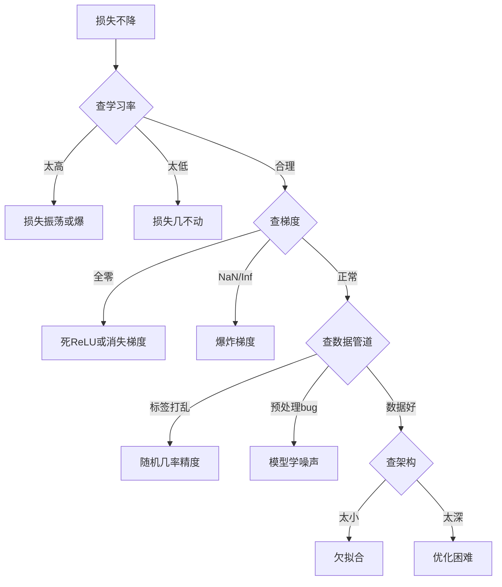
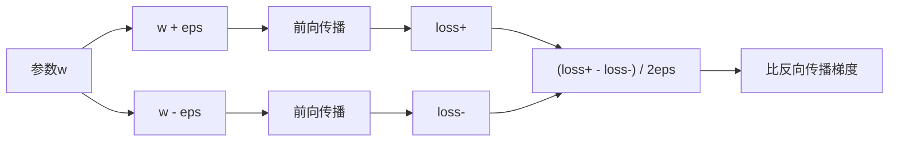
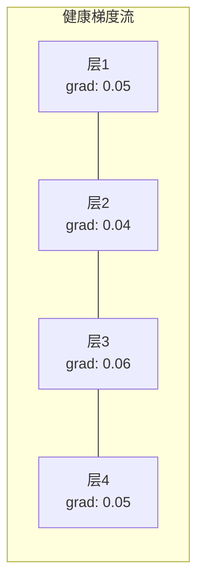
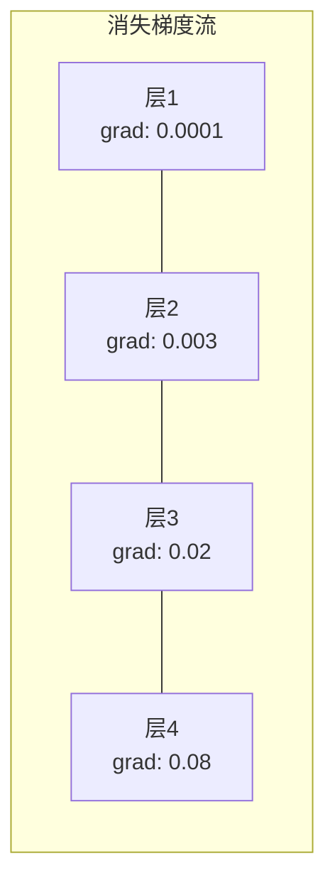
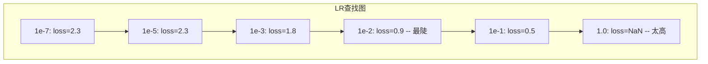

# 调试神经网络

> 你网络编译了。它跑了。它产了一数。数是错和无崩溃。欢迎最难调试 -- 无错误消息那。

**类型:** 实践
**语言:** Python, PyTorch
**前置要求:** 阶段03课程01-10(特别反向传播、损失函数、优化器)
**时间:** ~90分钟

## 学习目标

- 用系统调试策略诊断常见神经网络失败(NaN损失、平损失曲线、过拟合、振荡)
- 应用"过拟合一批"技术验证模型架构和训练循环正确
- 查梯度幅度、激活分布和权重范数识别消失/爆炸梯度问题
- 建覆盖数据管道、模型架构、损失函数、优化器和学习率问题调试检查表

## 问题背景

传统软件崩当它坏。空指针抛异常。类型不配编译时失败。一偏错误产明错输出。

神经网络不给那奢侈。

坏神经网络跑到完，打印损失值，输出预测。损失可降。预测可看合理。但模型静错 -- 学捷径、记噪声、或收敛到无用局部最小。Google研员估计60-70% ML调试时间花在"静"bug -- 产无错但降模型质量。

工作模型和坏模型间差常单错位行: 缺`zero_grad()`、转置维度、学习率偏10x。规范"训练神经网络配方"(2019)以这开: "最常见神经网络错是不崩bug。"

这课教你找那些bug。

## 概念讲解

### 调试心智

忘print-and-pray调试。神经网络调试需系统方法因反馈环慢(每训练跑分钟到小时)和症状模糊(坏损可意味20不同东西)。

黄金规则: **始简，一次加复杂性一块，独立验证每块。**



### 症状1: 损失不降

这是最常见诉。训练循环跑，epochs过，损失留平或振狂。

**错学习率。** 太高: 损失振或跳NaN。太低: 损失降太慢看平。Adam，始1e-3。SGD，始1e-1或1e-2。总试3学习率跨10x每(如，1e-2、1e-3、1e-4)前结论其他错。

**死ReLU。** 若ReLU神经元收大负输入，它输0和其梯度0。它永不再激。若够神经元死，网络不能学。查: 打印每ReLU层后恰零激活分数。若>50%死，换LeakyReLU或降学习率。

**消失梯度。** 带sigmoid或tanh激活深网络，梯度反传时指数缩。当它们达首层，它们~0。首层停学。修: 用ReLU/GELU，加残差连接，或用批归一化。

**爆炸梯度。** 反问题 -- 梯度指数长。常在RNN和甚深网络。损失跳NaN。修: 梯度裁剪(`torch.nn.utils.clip_grad_norm_`)、降学习率、或加归一化。

### 症状2: 损失降但模型坏

损失下。训练精度达99%。但测试精度55%。或模型在真实数据产无意义输出。

**过拟合。** 模型记训练数据非学模式。训练和验证损失间隙时长。修: 更多数据、dropout、权重衰减、早停、数据增强。

**数据泄漏。** 测试数据漏入训练。精度可疑高。常见原因: 分前打乱、用全集统计预处理、分间重复样本。修: 先分，后预处理，查重复。

**标签错。** 大多真实数据集5-10%标签错(Northcutt等, 2021 -- "测试集 pervasive标签错")。模型学噪声。修: 用信学习找修错标例，或用损失截断忽高损样本。

### 症状3: NaN或Inf在损失

损失值成`nan`或`inf`。训练死。

**学习率太高。** 梯度更新超射太远权重爆。修: 减10x。

**log(0)或log(负)。** 交叉熵损失算`log(p)`。若你模型输出恰0或负概率，log爆。修: 截预测到`[eps, 1-eps]`其中`eps=1e-7`。

**除零。** 批归一化除标准差。常值批std=0。修: 加epsilon到分母(PyTorch默认做，但自定义实现可能不)。

**数值溢。** 大激活入`exp()`产Inf。Softmax特易。修: 指数前减max(log-sum-exp技巧)。

### 技术1: 梯度检查

比你分析梯度(从反向传播)到数值梯度(从有限差)。若它们不配，你反向传播有bug。

参数`w`数值梯度:

```
grad_numerical = (loss(w + eps) - loss(w - eps)) / (2 * eps)
```

配度量(相对差):

```
rel_diff = |grad_analytical - grad_numerical| / max(|grad_analytical|, |grad_numerical|, 1e-8)
```

若`rel_diff < 1e-5`: 正确。若`rel_diff > 1e-3`: 几肯定bug。



### 技术2: 激活统计

训练时监每层后激活均值和标准差。健康网络保激活均值近0和std近1(归一化后)或至少有界。

| 健康指标 | 均值 | Std | 诊断 |
|-----------------|------|-----|-----------|
| 健康 | ~0 | ~1 | 网络正常学 |
| 饱和 | >>0或<<0 | ~0 | 激活卡极端值 |
| 死 | 0 | 0 | 神经元死(全零) |
| 爆炸 | >>10 | >>10 | 激活无界长 |

### 技术3: 梯度流可视化

绘每层平均梯度幅度。健康网络，梯度幅度应层间大致相似。若早层梯度比后层1000x小，你有消失梯度。





### 技术4: 过拟合一批测试

深度学习单最重要调试技术。

取一小批(8-32样本)。训它100+迭代。损失应近零和训练精度应达100%。若不，你模型或训练循环有根本bug -- 不要进全训练。

这测试捕:
- 坏损失函数
- 坏反向传播
- 架构太小表示数据
- 优化器未连模型参数
- 数据和标签未对

这跑30秒和省数小时调试全训练跑。

### 技术5: 学习率查找器

Leslie Smith(2017)提扫学习率从甚小(1e-7)到甚大(10)过一epoch录损失。绘损失vs学习率。优学习率粗比损失始降最快速率小10x。



这例最佳LR: ~1e-3(最陡点前一数量级)。

### 常见PyTorch Bug

这些是耗PyTorch社区最多集体小时bug:

| Bug | 症状 | 修 |
|-----|---------|-----|
| 忘`optimizer.zero_grad()` | 梯度跨批累积，损失振荡 | 加`optimizer.zero_grad()`在`loss.backward()`前 |
| 忘`model.eval()`测试时 | Dropout和批归一化不同，测试精度变 | 加`model.eval()`和`torch.no_grad()` |
| 错张量形状 | 静广播产错结果，无错 | 调试时每操作后打印形状 |
| CPU/GPU不配 | `RuntimeError: expected CUDA tensor` | 用`.to(device)`在模型和数据 |
| 未detach张量 | 计算图永长，OOM | 用`.detach()`或`with torch.no_grad()` |
| 原位操作断autograd | `RuntimeError: modified by in-place operation` | 替`x += 1`为`x = x + 1` |
| 数据未归一化 | 损失卡随机几率平 | 归一化输入均值=0，std=1 |
| 标签错dtype | 交叉熵期`Long`，得`Float` | cast标签: `labels.long()` |

### 主调试表

| 症状 | 可能原因 | 首试 |
|---------|-------------|-------------------|
| 损失卡-log(1/num_classes) | 模型预测均匀分布 | 查数据管道，验证标签配输入 |
| 损失几步后NaN | 学习率太高 | 减LR 10x |
| 损失即NaN | log(0)或除零 | 加epsilon到log/div操作 |
| 损失狂振荡 | LR太高或批大小太小 | 减LR，增批大小 |
| 损失降后平台 | LR太高对微调相位 | 加LR调度(余弦或步衰减) |
| 训精度高，测精度低 | 过拟合 | 加dropout、权重衰减、更多数据 |
| 训精度=测精度=几率 | 模型无学 | 跑过拟合一批测试 |
| 训精度=测精度但都低 | 欠拟合 | 更大模型、更多层、更多特征 |
| 梯度全零 | 死ReLU或detach计算图 | 换LeakyReLU，查`.requires_grad` |
| 训练时内存出 | 批太大或图未释 | 减批大小，用`torch.no_grad()`评估 |

## 构建

监控激活、梯度、和损失曲线诊断工具包。你将故意坏网络用工具包诊断每问题。

### 步骤1: NetworkDebugger类

挂入PyTorch模型录每层激活和梯度统计。

```python
import torch
import torch.nn as nn
import math


class NetworkDebugger:
    def __init__(self, model):
        self.model = model
        self.activation_stats = {}
        self.gradient_stats = {}
        self.loss_history = []
        self.lr_losses = []
        self.hooks = []
        self._register_hooks()

    def _register_hooks(self):
        for name, module in self.model.named_modules():
            if isinstance(module, (nn.Linear, nn.Conv2d, nn.ReLU, nn.LeakyReLU)):
                hook = module.register_forward_hook(self._make_activation_hook(name))
                self.hooks.append(hook)
                hook = module.register_full_backward_hook(self._make_gradient_hook(name))
                self.hooks.append(hook)

    def _make_activation_hook(self, name):
        def hook(module, input, output):
            with torch.no_grad():
                out = output.detach().float()
                self.activation_stats[name] = {
                    "mean": out.mean().item(),
                    "std": out.std().item(),
                    "fraction_zero": (out == 0).float().mean().item(),
                    "min": out.min().item(),
                    "max": out.max().item(),
                }
        return hook

    def _make_gradient_hook(self, name):
        def hook(module, grad_input, grad_output):
            if grad_output[0] is not None:
                with torch.no_grad():
                    grad = grad_output[0].detach().float()
                    self.gradient_stats[name] = {
                        "mean": grad.mean().item(),
                        "std": grad.std().item(),
                        "abs_mean": grad.abs().mean().item(),
                        "max": grad.abs().max().item(),
                    }
        return hook

    def record_loss(self, loss_value):
        self.loss_history.append(loss_value)

    def check_loss_health(self):
        if len(self.loss_history) < 2:
            return "NOT_ENOUGH_DATA"
        recent = self.loss_history[-10:]
        if any(math.isnan(v) or math.isinf(v) for v in recent):
            return "NAN_OR_INF"
        if len(self.loss_history) >= 20:
            first_half = sum(self.loss_history[:10]) / 10
            second_half = sum(self.loss_history[-10:]) / 10
            if second_half >= first_half * 0.99:
                return "NOT_DECREASING"
        if len(recent) >= 5:
            diffs = [recent[i+1] - recent[i] for i in range(len(recent)-1)]
            if max(diffs) - min(diffs) > 2 * abs(sum(diffs) / len(diffs)):
                return "OSCILLATING"
        return "HEALTHY"

    def check_activations(self):
        issues = []
        for name, stats in self.activation_stats.items():
            if stats["fraction_zero"] > 0.5:
                issues.append(f"DEAD_NEURONS: {name} 有 {stats['fraction_zero']:.0%} 零激活")
            if abs(stats["mean"]) > 10:
                issues.append(f"EXPLODING_ACTIVATIONS: {name} 均值={stats['mean']:.2f}")
            if stats["std"] < 1e-6:
                issues.append(f"COLLAPSED_ACTIVATIONS: {name} std={stats['std']:.2e}")
        return issues if issues else ["HEALTHY"]

    def check_gradients(self):
        issues = []
        grad_magnitudes = []
        for name, stats in self.gradient_stats.items():
            grad_magnitudes.append((name, stats["abs_mean"]))
            if stats["abs_mean"] < 1e-7:
                issues.append(f"VANISHING_GRADIENT: {name} abs_mean={stats['abs_mean']:.2e}")
            if stats["abs_mean"] > 100:
                issues.append(f"EXPLODING_GRADIENT: {name} abs_mean={stats['abs_mean']:.2e}")
        if len(grad_magnitudes) >= 2:
            first_mag = grad_magnitudes[0][1]
            last_mag = grad_magnitudes[-1][1]
            if last_mag > 0 and first_mag / last_mag > 100:
                issues.append(f"GRADIENT_RATIO: 首/尾 = {first_mag/last_mag:.0f}x (消失)")
        return issues if issues else ["HEALTHY"]

    def print_report(self):
        print("\n=== 网络调试器报告 ===")
        print(f"\n损失健康: {self.check_loss_health()}")
        if self.loss_history:
            print(f"  最后5损失: {[f'{v:.4f}' for v in self.loss_history[-5:]]}")
        print("\n激活诊断:")
        for item in self.check_activations():
            print(f"  {item}")
        print("\n梯度诊断:")
        for item in self.check_gradients():
            print(f"  {item}")
        print("\n每层激活统计:")
        for name, stats in self.activation_stats.items():
            print(f"  {name}: 均值={stats['mean']:.4f} std={stats['std']:.4f} 零={stats['fraction_zero']:.1%}")
        print("\n每层梯度统计:")
        for name, stats in self.gradient_stats.items():
            print(f"  {name}: abs_mean={stats['abs_mean']:.2e} max={stats['max']:.2e}")

    def remove_hooks(self):
        for hook in self.hooks:
            hook.remove()
        self.hooks.clear()
```

### 步骤2: 过拟合一批测试

```python
def overfit_one_batch(model, x_batch, y_batch, criterion, lr=0.01, steps=200):
    optimizer = torch.optim.Adam(model.parameters(), lr=lr)
    model.train()
    print("\n=== 过拟合一批测试 ===")
    print(f"批大小: {x_batch.shape[0]}, 步: {steps}")

    for step in range(steps):
        optimizer.zero_grad()
        output = model(x_batch)
        loss = criterion(output, y_batch)
        loss.backward()
        optimizer.step()

        if step % 50 == 0 or step == steps - 1:
            with torch.no_grad():
                preds = (output > 0).float() if output.shape[-1] == 1 else output.argmax(dim=1)
                targets = y_batch if y_batch.dim() == 1 else y_batch.squeeze()
                acc = (preds.squeeze() == targets).float().mean().item()
            print(f"  步 {step:3d} | 损失: {loss.item():.6f} | 精度: {acc:.1%}")

    final_loss = loss.item()
    if final_loss > 0.1:
        print(f"\n  失败: 损失未收敛 ({final_loss:.4f}). 模型或训练循环坏。")
        return False
    print(f"\n  通过: 损失收敛到 {final_loss:.6f}")
    return True
```

### 步骤3: 学习率查找器

```python
def find_learning_rate(model, x_data, y_data, criterion, start_lr=1e-7, end_lr=10, steps=100):
    import copy
    original_state = copy.deepcopy(model.state_dict())
    optimizer = torch.optim.SGD(model.parameters(), lr=start_lr)
    lr_mult = (end_lr / start_lr) ** (1 / steps)

    model.train()
    results = []
    best_loss = float("inf")
    current_lr = start_lr

    print("\n=== 学习率查找器 ===")

    for step in range(steps):
        optimizer.zero_grad()
        output = model(x_data)
        loss = criterion(output, y_data)

        if math.isnan(loss.item()) or loss.item() > best_loss * 10:
            break

        best_loss = min(best_loss, loss.item())
        results.append((current_lr, loss.item()))

        loss.backward()
        optimizer.step()

        current_lr *= lr_mult
        for param_group in optimizer.param_groups:
            param_group["lr"] = current_lr

    model.load_state_dict(original_state)

    if len(results) < 10:
        print("  无法完成LR扫 -- 损失分歧太快")
        return results

    min_loss_idx = min(range(len(results)), key=lambda i: results[i][1])
    suggested_lr = results[max(0, min_loss_idx - 10)][0]

    print(f"  扫 {len(results)} 步从 {start_lr:.0e} 到 {results[-1][0]:.0e}")
    print(f"  最小损失 {results[min_loss_idx][1]:.4f} 在 lr={results[min_loss_idx][0]:.2e}")
    print(f"  建议学习率: {suggested_lr:.2e}")

    return results
```

### 步骤4: 梯度检查器

```python
def _flat_to_multi_index(flat_idx, shape):
    multi_idx = []
    remaining = flat_idx
    for dim in reversed(shape):
        multi_idx.insert(0, remaining % dim)
        remaining //= dim
    return tuple(multi_idx)


def gradient_check(model, x, y, criterion, eps=1e-4):
    model.train()
    x_double = x.double()
    y_double = y.double()
    model_double = model.double()

    print("\n=== 梯度检查 ===")
    overall_max_diff = 0
    checked = 0

    for name, param in model_double.named_parameters():
        if not param.requires_grad:
            continue

        layer_max_diff = 0

        model_double.zero_grad()
        output = model_double(x_double)
        loss = criterion(output, y_double)
        loss.backward()
        analytical_grad = param.grad.clone()

        num_checks = min(5, param.numel())
        for i in range(num_checks):
            idx = _flat_to_multi_index(i, param.shape)
            original = param.data[idx].item()

            param.data[idx] = original + eps
            with torch.no_grad():
                loss_plus = criterion(model_double(x_double), y_double).item()

            param.data[idx] = original - eps
            with torch.no_grad():
                loss_minus = criterion(model_double(x_double), y_double).item()

            param.data[idx] = original

            numerical = (loss_plus - loss_minus) / (2 * eps)
            analytical = analytical_grad[idx].item()

            denom = max(abs(numerical), abs(analytical), 1e-8)
            rel_diff = abs(numerical - analytical) / denom

            layer_max_diff = max(layer_max_diff, rel_diff)
            checked += 1

        overall_max_diff = max(overall_max_diff, layer_max_diff)
        status = "OK" if layer_max_diff < 1e-5 else "不配"
        print(f"  {name}: max_rel_diff={layer_max_diff:.2e} [{status}]")

    model.float()

    print(f"\n  查 {checked} 参数")
    if overall_max_diff < 1e-5:
        print("  通过: 梯度配 (rel_diff < 1e-5)")
    elif overall_max_diff < 1e-3:
        print("  警: 小差 (1e-5 < rel_diff < 1e-3)")
    else:
        print("  失败: 梯度不配检测 (rel_diff > 1e-3)")
    return overall_max_diff
```

### 步骤5: 故意坏网络

现应用工具包到坏网络诊断每。

```python
def demo_broken_networks():
    torch.manual_seed(42)
    x = torch.randn(64, 10)
    y = (x[:, 0] > 0).long()

    print("\n" + "=" * 60)
    print("BUG 1: 学习率太高 (lr=10)")
    print("=" * 60)
    model1 = nn.Sequential(nn.Linear(10, 32), nn.ReLU(), nn.Linear(32, 2))
    debugger1 = NetworkDebugger(model1)
    optimizer1 = torch.optim.SGD(model1.parameters(), lr=10.0)
    criterion = nn.CrossEntropyLoss()
    for step in range(20):
        optimizer1.zero_grad()
        out = model1(x)
        loss = criterion(out, y)
        debugger1.record_loss(loss.item())
        loss.backward()
        optimizer1.step()
    debugger1.print_report()
    debugger1.remove_hooks()

    print("\n" + "=" * 60)
    print("BUG 2: 坏初始化致死ReLU")
    print("=" * 60)
    model2 = nn.Sequential(nn.Linear(10, 32), nn.ReLU(), nn.Linear(32, 32), nn.ReLU(), nn.Linear(32, 2))
    with torch.no_grad():
        for m in model2.modules():
            if isinstance(m, nn.Linear):
                m.weight.fill_(-1.0)
                m.bias.fill_(-5.0)
    debugger2 = NetworkDebugger(model2)
    optimizer2 = torch.optim.Adam(model2.parameters(), lr=1e-3)
    for step in range(50):
        optimizer2.zero_grad()
        out = model2(x)
        loss = criterion(out, y)
        debugger2.record_loss(loss.item())
        loss.backward()
        optimizer2.step()
    debugger2.print_report()
    debugger2.remove_hooks()

    print("\n" + "=" * 60)
    print("BUG 3: 缺zero_grad (梯度累积)")
    print("=" * 60)
    model3 = nn.Sequential(nn.Linear(10, 32), nn.ReLU(), nn.Linear(32, 2))
    debugger3 = NetworkDebugger(model3)
    optimizer3 = torch.optim.SGD(model3.parameters(), lr=0.01)
    for step in range(50):
        out = model3(x)
        loss = criterion(out, y)
        debugger3.record_loss(loss.item())
        loss.backward()
        optimizer3.step()
    debugger3.print_report()
    debugger3.remove_hooks()

    print("\n" + "=" * 60)
    print("健康网络: 正确设置比")
    print("=" * 60)
    model_good = nn.Sequential(nn.Linear(10, 32), nn.ReLU(), nn.Linear(32, 2))
    debugger_good = NetworkDebugger(model_good)
    optimizer_good = torch.optim.Adam(model_good.parameters(), lr=1e-3)
    for step in range(50):
        optimizer_good.zero_grad()
        out = model_good(x)
        loss = criterion(out, y)
        debugger_good.record_loss(loss.item())
        loss.backward()
        optimizer_good.step()
    debugger_good.print_report()
    debugger_good.remove_hooks()

    print("\n" + "=" * 60)
    print("过拟合一批测试 (健康模型)")
    print("=" * 60)
    model_test = nn.Sequential(nn.Linear(10, 32), nn.ReLU(), nn.Linear(32, 2))
    overfit_one_batch(model_test, x[:8], y[:8], criterion)

    print("\n" + "=" * 60)
    print("学习率查找器")
    print("=" * 60)
    model_lr = nn.Sequential(nn.Linear(10, 32), nn.ReLU(), nn.Linear(32, 2))
    find_learning_rate(model_lr, x, y, criterion)

    print("\n" + "=" * 60)
    print("梯度检查")
    print("=" * 60)
    model_grad = nn.Sequential(nn.Linear(10, 8), nn.ReLU(), nn.Linear(8, 2))
    gradient_check(model_grad, x[:4], y[:4], criterion)
```

## 使用

### PyTorch内建工具

```python
import torch
import torch.nn as nn

model = nn.Sequential(
    nn.Linear(768, 256),
    nn.ReLU(),
    nn.Linear(256, 10),
)

with torch.autograd.detect_anomaly():
    output = model(input_tensor)
    loss = criterion(output, target)
    loss.backward()

for name, param in model.named_parameters():
    if param.grad is not None:
        print(f"{name}: grad_mean={param.grad.abs().mean():.2e}")
```

### Weights & Biases集成

```python
import wandb

wandb.init(project="debug-training")

for epoch in range(100):
    loss = train_one_epoch()
    wandb.log({
        "loss": loss,
        "lr": optimizer.param_groups[0]["lr"],
        "grad_norm": torch.nn.utils.clip_grad_norm_(model.parameters(), float("inf")),
    })

    for name, param in model.named_parameters():
        if param.grad is not None:
            wandb.log({f"grad/{name}": wandb.Histogram(param.grad.cpu().numpy())})
```

### TensorBoard

```python
from torch.utils.tensorboard import SummaryWriter

writer = SummaryWriter("runs/debug_experiment")

for epoch in range(100):
    loss = train_one_epoch()
    writer.add_scalar("Loss/train", loss, epoch)

    for name, param in model.named_parameters():
        writer.add_histogram(f"weights/{name}", param, epoch)
        if param.grad is not None:
            writer.add_histogram(f"gradients/{name}", param.grad, epoch)
```

### 调试检查表(全训练前)

1. 跑过拟合一批测试。若失败，停。
2. 打模型摘要 -- 验证参数数合理。
3. 用随机数据跑单前向传播 -- 查输出形。
4. 训5 epochs -- 验证损失降。
5. 查激活统计 -- 无死层，无爆。
6. 查梯度流 -- 无消失，无爆炸。
7. 验证数据管道 -- 打5随机样本带标签。

## 交付成果

本课程产:
- `outputs/prompt-nn-debugger.md` -- 诊断神经网络训练失败提示词
- `outputs/skill-debug-checklist.md` -- 调试训练问题决策树检查表

调试关键部署模式:
- 加监控钩到生产训练脚本
- 每N步记激活和梯度统计到W&B或TensorBoard
- 实自动警NaN损失、死神经元(>80%零)或梯度爆
- 总跑过拟合一批测试当改架构或数据管道

## 练习题

1. **加爆炸梯度检测器。** 修改`NetworkDebugger`检测梯度超阈值自动建梯度裁剪值。在20层无归一化网络测。

2. **建死神经元复活器。** 写函数识别死ReLU神经元(总输0)用Kaiming初始化重初始化入权重。示这恢复>70%神经元死网络。

3. **实现学习率查找器带绘。** 扩`find_learning_rate`存结果CSV和写分脚本读CSV用matplotlib显LR vs损失曲线。为ResNet-18在CIFAR-10识别优LR。

4. **创数据管道验证器。** 写函数查: 训/测分间重复样本、标签分布不平衡(>10:1比)、输入归一化(均值近0，std近1)、和NaN/Inf值在数据。在故意腐败数据集跑。

5. **调试真实失败。** 取课程10微框架，引微妙bug(如，backward中转置权重矩阵)，用梯度检查定位确切哪参数有错梯度。文档调试过程。

## 关键术语

| 术语 | 人们怎么说 | 实际含义 |
|------|----------------|----------------------|
| 静bug | "跑但给坏结果" | 产无错但降模型质量bug -- ML主导失败模式 |
| 死ReLU | "神经元死" | ReLU神经元其输入总负，故它输0和收0梯度永 |
| 消失梯度 | "早层停学" | 梯度层间指数缩，使早层权重有效冻结 |
| 爆炸梯度 | "损失去NaN" | 梯度层间指数长，致权重更新太大溢 |
| 梯度检查 | "验证反向传播正确" | 比反向传播分析梯度到有限差数值梯度 |
| 过拟合一批 | "最重要调试测试" | 在单小批训练验证模型能学 -- 若不能，某根本坏 |
| LR查找器 | "扫找对学习率" | 过一epoch指数增学习率选损失分歧前率 |
| 数据泄漏 | "测数据漏入训练" | 测试集信息污染训练时，产人工高精度 |
| 激活统计 | "监层健康" | 追每层输出均值、std和零分数检死、饱和或爆神经元 |
| 梯度裁剪 | "限梯度幅度" | 当梯度范数超阈值时缩，防爆炸梯度更新 |

## 延伸阅读

- Smith, "Cyclical Learning Rates for Training Neural Networks" (2017) -- 引学习率范围测试(LR查找器)论文
- Northcutt等, "Pervasive Label Errors in Test Sets Destabilize Machine Learning Benchmarks" (2021) -- 示ImageNet、CIFAR-10和其他大基准3-6%标签错
- Zhang等, "Understanding Deep Learning Requires Rethinking Generalization" (2017) -- 示神经网络可记随机标签论文，这是为何过拟合一批测试工作
- PyTorch文档`torch.autograd.detect_anomaly`和`torch.autograd.set_detect_anomaly`内建NaN/Inf检测