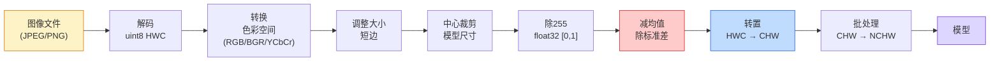
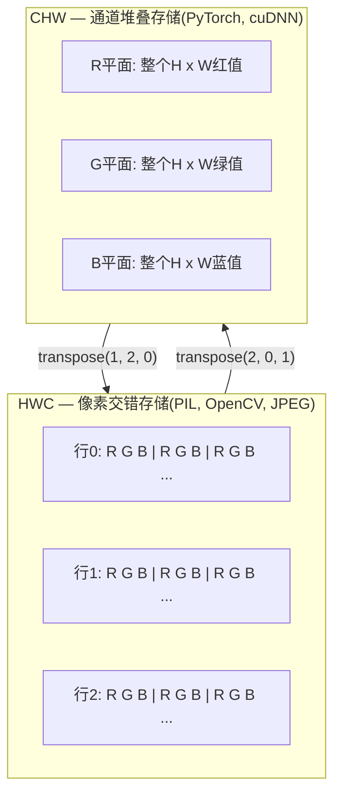

# 图像基础 — 像素、通道、色彩空间

> 图像是光样本张量。你将用到的每个视觉模型都始于这一事实。

**类型:** 构建
**语言:** Python
**前置要求:** 阶段1课程12(张量操作)，阶段3课程11(PyTorch简介)
**时间:** ~45分钟

## 学习目标

- 解释连续场景如何离散化为像素，为何采样/量化决策为每个下游模型设上限
- 读取、切片、检查图像为NumPy数组，在HWC和CHW布局间自如切换
- 在RGB、灰度、HSV和YCbCr间转换，解释为何每个色彩空间存在
- 应用像素级预处理(归一化、标准化、调整大小、通道前置)，如torchvision所期望

## 问题背景

你将读的每篇论文、将下载的每个预训练权重、将调用的每个视觉API都假设输入特定编码。传`uint8`图像给期望`float32`的模型，它仍运行 — 并静默产垃圾。喂BGR给训练于RGB的网络，精度降十点。给模型通道后置输入当它期望通道前置，第一卷积层把高度当作特征通道。无这抛错。它只毁你指标，你花一周猎bug藏于你如何加载文件。

卷积不复杂一旦你知它滑什么上。难点是"图像"对相机、JPEG解码器、PIL、OpenCV、torchvision和CUDA内核意味不同东西。每栈有自己轴序、字节范围和通道约定。不能理清这些的视觉工程师产坏管道。

这课修基础使阶段余下能建于其上。期末你知像素是什么，为何每像素三数而非一，"用ImageNet统计标准化"实际做什么，如何在本阶段每其他课假设的两三布局间移动。

## 概念讲解

### 全预处理管道一览

每生产视觉系统是同可逆变换序。错一步，模型见异于其训练输入。



红蓝两框是80%静默失败处:缺标准化和错布局。

### 像素是样本，非方块

相机传感器计落细探测器网格光子。每探测器积分光片刻发电压正比多少光子击。传感器然后离散化电压为整数。一探测器成一像素。

```
连续场景                 传感器网格                     数字图像
(无限细节)                (H x W 探测器)               (H x W 整数)

    ~~~~~                        +--+--+--+--+--+                 210 198 180 155 120
   ~   ~   ~                     |  |  |  |  |  |                 205 195 178 152 118
  ~ 光 ~      ---->           +--+--+--+--+--+     ---->       200 190 175 150 115
   ~~~~~                         |  |  |  |  |  |                 195 185 170 148 112
                                 +--+--+--+--+--+                 188 180 165 145 108
```

两选择于此步定下游一切上限:

- **空间采样**定每场景度多少探测器。太少，边变锯齿(混叠)。太多，存算爆。
- **强度量化**定电压多细分桶。8位给256级，显示标准。10、12、16位给更平滑梯，医学成像、HDR和原传感器管道重要。

像素非有面积色方块。它是单测量。当你调整大小或旋转，你重采样那测量网格。

### 为何三通道

一探测器计全可见光谱光子 — 那是灰度。获色彩，传感器用红、绿、蓝滤波器马赛克盖网格。去马赛克后，每空间位有三整数:附近红滤波探测器、绿滤波、蓝滤波响应。那三整数是像素RGB三元。

```
内存中一像素:

    (R, G, B) = (210, 140, 30)   <- 带红橙色

H x W RGB图像:

    形状 (H, W, 3)     存为   H行W像素3值
                                    每在[0, 255]对uint8
```

三非魔。深度相机加Z通道。卫星加红外紫外波段。医学扫描常有一通道(X射线、CT)或多(超光谱)。通道数是末轴;卷积层学跨其混。

### 两布局约定: HWC和CHW

同张量，两序。每库选一。

```
HWC (高, 宽, 通道)           CHW (通道, 高, 宽)

   W ->                                    H ->
  +-----+-----+-----+                     +-----+-----+
H |R G B|R G B|R G B|                   C |R R R R R R|
| +-----+-----+-----+                   | +-----+-----+
v |R G B|R G B|R G B|                   v |G G G G G G|
  +-----+-----+-----+                     +-----+-----+
                                          |B B B B B B|
                                          +-----+-----+

   PIL, OpenCV, matplotlib,              PyTorch, 大多深度学习
   磁盘上几乎每图像文件                   框架, cuDNN内核
```

CHW存在因卷积核滑跨H和W。保通道轴首意味每核见每通道连续2D平面，向量化干净。盘格式保HWC因那合扫描线出传感器方式。

你将打千次的单行转换:

```
img_chw = img_hwc.transpose(2, 0, 1)      # NumPy
img_chw = img_hwc.permute(2, 0, 1)        # PyTorch张量
```

内存布局，可视化:



### 字节范围和dtype

三约定主导:

| 约定 | dtype | 范围 | 何处见 |
|------|-------|------|--------|
| 原始 | `uint8` | [0, 255] | 磁盘文件, PIL, OpenCV输出 |
| 归一化 | `float32` | [0.0, 1.0] | 在`img.astype('float32') / 255`后 |
| 标准化 | `float32` | 粗略[-2, +2] | 在减均值除标准差后 |

卷积网络训于标准化输入。ImageNet统计`mean=[0.485, 0.456, 0.406]`，`std=[0.229, 0.224, 0.225]`是全ImageNet训集三通道算术均值和标准差，于[0, 1]归一化像素算。喂原`uint8`给期望标准化float的模型是应用视觉单最常见静默失败。

### 色彩空间和为何存在

RGB是捕获格式但非总模型最有用表示。

```
 RGB               HSV                       YCbCr / YUV

 R 红             H 色调(角0-360)       Y 亮度(明亮度)
 G 绿             S 饱和度(0-1)        Cb 色度蓝-黄
 B 蓝             V 明度(0-1)          Cr 色度红-绿

 线性到           分色从               分亮度从
 传感器输出       明度。色阈值、      色。JPEG和大多视频
                 UI滑块、简滤波      编码器压缩色度通道
                                     更狠因人眼对色度
                                     细节不如Y敏感。
```

大多现代CNN你喂RGB。你遇其他空间当:

- **HSV** — 经典CV代码、色基分割、白平衡。
- **YCbCr** — 读JPEG内件、视频管道、超分辨率模型仅操作Y。
- **灰度** — OCR、文档模型、色是噪变量而非信号任况。

灰度从RGB是加权求和，非平均，因人眼对绿比红或蓝更敏感:

```
Y = 0.299 R + 0.587 G + 0.114 B       (ITU-R BT.601，经典权重)
```

### 宽高比、调整大小和插值

每模型有固定输入大小(大多ImageNet分类器224x224，现代检测器384x384或512x512)。你图像少匹配。三调整选择重要:

- **调整短边，然后中心裁剪** — 标准ImageNet配方。保宽高比，抛边像素条。
- **调整大小并填充** — 保宽高比和每像素，加黑条。检测和OCR标准。
- **直接调整到目标** — 拉伸图像。便宜、扭曲几何、多分类任务可。

插值方法定新网格不合旧时中像素如何算:

```
最近邻     最快、块状、掩码/标签唯一选择
双线性     快、平滑、大多图像调整默认
双三次     较慢、上采样更锐
Lanczos    最慢、最佳质量、用于最终显示
```

经验:双线性训练、双三次或Lanczos看资产、最近含整数类ID任物。

## 构建

### 步骤1: 加载图像并检查形状

用Pillow加载任JPEG或PNG，转NumPy，打印所得。为确定性离线跑例，合成一。

```python
import numpy as np
from PIL import Image

def synthetic_rgb(h=128, w=192, seed=0):
    rng = np.random.default_rng(seed)
    yy, xx = np.meshgrid(np.linspace(0, 1, h), np.linspace(0, 1, w), indexing="ij")
    r = (np.sin(xx * 6) * 0.5 + 0.5) * 255
    g = yy * 255
    b = (1 - yy) * xx * 255
    rgb = np.stack([r, g, b], axis=-1) + rng.normal(0, 6, (h, w, 3))
    return np.clip(rgb, 0, 255).astype(np.uint8)

arr = synthetic_rgb()
# 或从磁盘加载:
# arr = np.asarray(Image.open("your_image.jpg").convert("RGB"))

print(f"类型:   {type(arr).__name__}")
print(f"dtype:  {arr.dtype}")
print(f"形状:  {arr.shape}     # (H, W, C)")
print(f"最小:    {arr.min()}")
print(f"最大:    {arr.max()}")
print(f"像素(0, 0): {arr[0, 0]}")
```

预期输出: `形状: (H, W, 3)`，`dtype: uint8`，范围`[0, 255]`。那是规范盘上表示，字节来自相机、JPEG解码器或合成生成器。

### 步骤2: 分通道并重排布局

分取R、G、B，然后从HWC转CHW为PyTorch。

```python
R = arr[:, :, 0]
G = arr[:, :, 1]
B = arr[:, :, 2]
print(f"R形状: {R.shape}, 均值: {R.mean():.1f}")
print(f"G形状: {G.shape}, 均值: {G.mean():.1f}")
print(f"B形状: {B.shape}, 均值: {B.mean():.1f}")

arr_chw = arr.transpose(2, 0, 1)
print(f"\nHWC形状: {arr.shape}")
print(f"CHW形状: {arr_chw.shape}")
```

三灰度平面，每通道一。CHW仅重排轴;内存布局允许时无数据拷严格需。

### 步骤3: 灰度和HSV转换

加权求和灰度，然后手动RGB到HSV。

```python
def rgb_to_grayscale(rgb):
    weights = np.array([0.299, 0.587, 0.114], dtype=np.float32)
    return (rgb.astype(np.float32) @ weights).astype(np.uint8)

def rgb_to_hsv(rgb):
    rgb_f = rgb.astype(np.float32) / 255.0
    r, g, b = rgb_f[..., 0], rgb_f[..., 1], rgb_f[..., 2]
    cmax = np.max(rgb_f, axis=-1)
    cmin = np.min(rgb_f, axis=-1)
    delta = cmax - cmin

    h = np.zeros_like(cmax)
    mask = delta > 0
    rmax = mask & (cmax == r)
    gmax = mask & (cmax == g)
    bmax = mask & (cmax == b)
    h[rmax] = ((g[rmax] - b[rmax]) / delta[rmax]) % 6
    h[gmax] = ((b[gmax] - r[gmax]) / delta[gmax]) + 2
    h[bmax] = ((r[bmax] - g[bmax]) / delta[bmax]) + 4
    h = h * 60.0

    s = np.where(cmax > 0, delta / cmax, 0)
    v = cmax
    return np.stack([h, s, v], axis=-1)

gray = rgb_to_grayscale(arr)
hsv = rgb_to_hsv(arr)
print(f"灰度形状: {gray.shape}, 范围: [{gray.min()}, {gray.max()}]")
print(f"hsv   形状: {hsv.shape}")
print(f"色调范围: [{hsv[..., 0].min():.1f}, {hsv[..., 0].max():.1f}] 度")
print(f"饱和范围: [{hsv[..., 1].min():.2f}, {hsv[..., 1].max():.2f}]")
print(f"明度范围: [{hsv[..., 2].min():.2f}, {hsv[..., 2].max():.2f}]")
```

色调出为度，饱和和明度在[0, 1]。那合OpenCV`hsv_full`约定。

### 步骤4: 归一化、标准化并逆转

从原字节到预训练ImageNet模型期望精确张量，然后回。

```python
mean = np.array([0.485, 0.456, 0.406], dtype=np.float32)
std = np.array([0.229, 0.224, 0.225], dtype=np.float32)

def preprocess_imagenet(rgb_uint8):
    x = rgb_uint8.astype(np.float32) / 255.0
    x = (x - mean) / std
    x = x.transpose(2, 0, 1)
    return x

def deprocess_imagenet(chw_float32):
    x = chw_float32.transpose(1, 2, 0)
    x = x * std + mean
    x = np.clip(x * 255.0, 0, 255).astype(np.uint8)
    return x

x = preprocess_imagenet(arr)
print(f"预处理形状: {x.shape}     # (C, H, W)")
print(f"预处理dtype: {x.dtype}")
print(f"预处理每通道均值:  {x.mean(axis=(1, 2)).round(3)}")
print(f"预处理每通道标准差:  {x.std(axis=(1, 2)).round(3)}")

roundtrip = deprocess_imagenet(x)
max_diff = np.abs(roundtrip.astype(int) - arr.astype(int)).max()
print(f"往返最大像素差: {max_diff}    # 应为0或1")
```

每通道均值应近零，标准差近一。预处理/去预处理对正是每torchvision`transforms.Normalize`调用底层所做。

### 步骤5: 用三种插值方法调整大小

比最近、双线性和双三次于上采样使差可见。

```python
target = (arr.shape[0] * 3, arr.shape[1] * 3)

nearest = np.asarray(Image.fromarray(arr).resize(target[::-1], Image.NEAREST))
bilinear = np.asarray(Image.fromarray(arr).resize(target[::-1], Image.BILINEAR))
bicubic = np.asarray(Image.fromarray(arr).resize(target[::-1], Image.BICUBIC))

def local_roughness(x):
    gy = np.diff(x.astype(float), axis=0)
    gx = np.diff(x.astype(float), axis=1)
    return float(np.abs(gy).mean() + np.abs(gx).mean())

for name, out in [("最近", nearest), ("双线性", bilinear), ("双三次", bicubic)]:
    print(f"{name:>8}  形状={out.shape}  粗糙度={local_roughness(out):6.2f}")
```

最近粗糙度最高因它保硬边。双线性最平滑。双三次居中，保感知锐度无阶跃伪影。

## 使用

`torchvision.transforms`将上一切包为单可组管道。下代码重现`preprocess_imagenet`所做，加调整大小和裁剪。

```python
import torch
from torchvision import transforms
from PIL import Image

img = Image.fromarray(synthetic_rgb(256, 256))

pipeline = transforms.Compose([
    transforms.Resize(256),
    transforms.CenterCrop(224),
    transforms.ToTensor(),
    transforms.Normalize(mean=[0.485, 0.456, 0.406], std=[0.229, 0.224, 0.225]),
])

x = pipeline(img)
print(f"张量类型:  {type(x).__name__}")
print(f"张量dtype: {x.dtype}")
print(f"张量形状: {tuple(x.shape)}      # (C, H, W)")
print(f"每通道均值: {x.mean(dim=(1, 2)).tolist()}")
print(f"每通道标准差:  {x.std(dim=(1, 2)).tolist()}")

batch = x.unsqueeze(0)
print(f"\n批形状: {tuple(batch.shape)}   # (N, C, H, W) — 模型就绪")
```

四步，此精确序: `Resize(256)`缩短边到256; `CenterCrop(224)`从中取224x224块; `ToTensor()`除255并换HWC到CHW; `Normalize`减ImageNet均值除标准差。逆转序静默改模型所见。

## 交付成果

本课程产:

- `outputs/prompt-vision-preprocessing-audit.md` — 将任模型卡或数据集卡转为团队必遵预处理不变量检查表提示词
- `outputs/skill-image-tensor-inspector.md` — 给任图像形状张量或数组，报告dtype、布局、范围及看原始、归一化或标准化技能

## 练习题

1. **(易)** 用OpenCV(`cv2.imread`)和Pillow加载JPEG。打印两者形状和像素`(0, 0)`。解释通道序差，然后写单行转换使OpenCV数组同Pillow。

2. **(中)** 写`standardize(img, mean, std)`及其逆，共通过`roundtrip_max_diff <= 1`测试于任uint8图像。函数须工作于单HWC图像和NCHW批同调用。

3. **(难)** 取3通道ImageNet标准化张量，过1x1卷积学RGB加权混入单灰度通道。初始化权重为`[0.299, 0.587, 0.114]`，冻结它们，验证输出合手动`rgb_to_grayscale`在浮点误差内。何其他经典色彩空间变换可写为1x1卷积？

## 关键术语

| 术语 | 人们怎么说 | 实际含义 |
|------|----------------|----------------------|
| 像素 | "有色方块" | 网格位一光强度样本 — 色三数、灰度一 |
| 通道 | "颜色" | 堆入图像张量平行空间网格一; HWC末轴，CHW首轴 |
| HWC / CHW | "形状" | 图像张量轴序; 盘和PIL用HWC，PyTorch和cuDNN用CHW |
| 归一化 | "缩放图像" | 除255使像素在[0, 1] — 必要但不充分 |
| 标准化 | "零中心" | 减均值除标准差每通道使输入分布合模型训练 |
| 灰度转换 | "平均通道" | 加权求和系数0.299/0.587/0.114合人亮度感知 |
| 插值 | "调整如何选像素" | 新网格不合旧时定输出值规则 — 标签最近、训练双线性、显示双三次 |
| 宽高比 | "宽高之比" | 区"调整填充"和"调整拉伸"比率 |

## 延伸阅读

- [Charles Poynton — A Guided Tour of Color Space](https://poynton.ca/PDFs/Guided_tour.pdf) — 为何有这么多色彩空间何时各重要的最清技术处理
- [PyTorch Vision Transforms文档](https://pytorch.org/vision/stable/transforms.html) — 你将实际生产组合变换全管道
- [How JPEG Works (Colt McAnlis)](https://www.youtube.com/watch?v=F1kYBnY6mwg) — 色度子采样、DCT和为何JPEG编码YCbCr而非RGB锐视觉导览
- [ImageNet预处理约定 (torchvision models)](https://pytorch.org/vision/stable/models.html) — `mean=[0.485, 0.456, 0.406]`和为何动物园每模型期望它真理来源