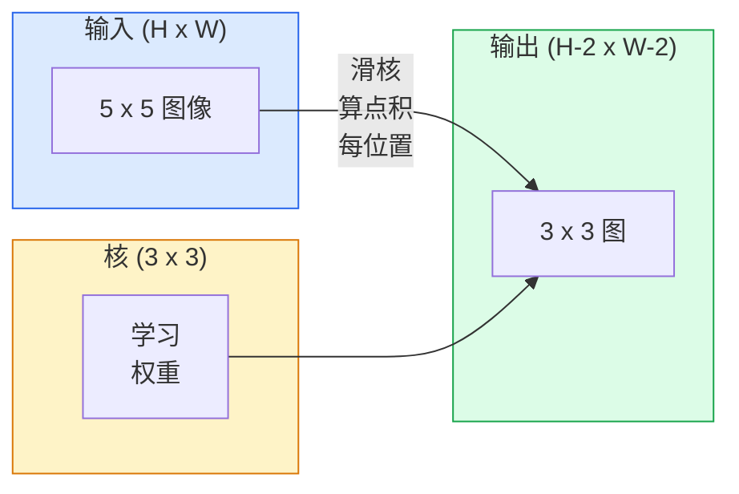
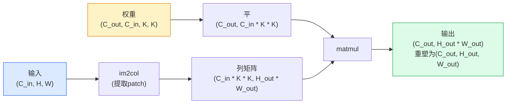

# 从零卷积

> 卷积是你滑过图像的小型密集层，在每位置共享同权重。

**类型:** 构建
**语言:** Python
**前置要求:** 阶段3(深度学习核心)，阶段4课程01(图像基础)
**时间:** ~75分钟

## 学习目标

- 仅用NumPy从零实现2D卷积，含嵌套循环版和向量化`im2col`版
- 为任输入大小、核大小、填充和步幅组合算输出空间大小，论证`(H - K + 2P) / S + 1`公式
- 手设计核(边、模糊、锐化、Sobel)并解释每为何产其所产激活模式
- 堆卷积为特征提取器并连栈深度到感受野大小

## 问题背景

全连接层于224x224 RGB图像需224 * 224 * 3 = 150,528输入权重每神经元。单隐藏层1000单元已150百万参数 — 在你学任何有用前。更糟，该层无概念狗在左上和狗在右下是同模式。它视每像素位为独立，正错图像:移猫三像素不应迫使网络重学概念。

图像模型需两性质是**平移等变性**(输入移输出移)和**参数共享**(同特征检测器随处运行)。密集层给你非。卷积免费给你两者。

卷积非为深度学习发明。它正是JPEG压缩、Photoshop高斯模糊、工业视觉边缘检测和每音频滤波器动力。CNN从2012到2020主导ImageNet因卷积是邻近值相关同模式可现任意处数据正确先验。

## 概念讲解

### 一核，滑动

2D卷积取小权重矩阵叫核(或滤波器)，滑过输入，每位置算元素乘积和。那和成一输出像素。



5x5输入上具体3x3例(无填充，步幅1):

```
输入 X (5 x 5):                核 W (3 x 3):

  1  2  0  1  2                   1  0 -1
  0  1  3  1  0                   2  0 -2
  2  1  0  2  1                   1  0 -1
  1  0  2  1  3
  2  1  1  0  1

核滑过每有效3 x 3窗。输出 Y 为 3 x 3:

 Y[0,0] = sum( W * X[0:3, 0:3] )
 Y[0,1] = sum( W * X[0:3, 1:4] )
 Y[0,2] = sum( W * X[0:3, 2:5] )
 Y[1,0] = sum( W * X[1:4, 0:3] )
 ... 等
```

那一公式 — **共享权重、局部性、滑窗** — 是整想法。余皆簿记。

### 输出大小公式

给输入空间大小`H`，核大小`K`，填充`P`，步幅`S`:

```
H_out = floor( (H - K + 2P) / S ) + 1
```

记这。你每架构将算数十次。

| 场景 | H | K | P | S | H_out |
|------|---|---|---|---|-------|
| 有效卷积，无填充 | 32 | 3 | 0 | 1 | 30 |
| 同卷积(保大小) | 32 | 3 | 1 | 1 | 32 |
| 下采样2 | 32 | 3 | 1 | 2 | 16 |
| 池2x2 | 32 | 2 | 0 | 2 | 16 |
| 大感受野 | 32 | 7 | 3 | 2 | 16 |

"同填充"意选P使H_out == H当S == 1。对奇K，那是P = (K - 1) / 2。那是为何3x3核主导 — 它们是最小奇核仍有中心。

### 填充

无填充，每卷缩特征图。堆20个你224x224图像变184x184，浪费算于边复杂需匹配形状残连接。

```
5 x 5输入零填充 (P = 1):

  0  0  0  0  0  0  0
  0  1  2  0  1  2  0
  0  0  1  3  1  0  0
  0  2  1  0  2  1  0       现核可中心于像素
  0  1  0  2  1  3  0       (0, 0)仍有三行三
  0  2  1  1  0  1  0       列值乘。
  0  0  0  0  0  0  0
```

实践遇模式: `zero`(最常见)、`reflect`(镜边，生成模型避硬边)、`replicate`(拷边)、`circular`(环绕，环面问题用)。

### 步幅

步幅是滑步大小。`stride=1`默认。`stride=2`半空间维度，是CNN内下采样经典方式无分池层 — 每现代架构(ResNet、ConvNeXt、MobileNet)某处用步幅卷积替最大池。

```
5 x 5输入步幅1，3 x 3核:

  starts: (0,0) (0,1) (0,2)        -> 输出行0
          (1,0) (1,1) (1,2)        -> 输出行1
          (2,0) (2,1) (2,2)        -> 输出行2

  输出: 3 x 3

同输入步幅2:

  starts: (0,0) (0,2)              -> 输出行0
          (2,0) (2,2)              -> 输出行1

  输出: 2 x 2
```

### 多输入通道

实图像有三通道。RGB输入上3x3卷积实是3x3x3体积:每输入通道一3x3切片。每空间位，你乘加跨三切片加偏置。

```
输入:   (C_in,  H,  W)        3 x 5 x 5
核:  (C_in,  K,  K)        3 x 3 x 3 (一核)
输出:  (1,     H', W')       2D图

对产C_out输出通道层，你堆C_out核:

权重:  (C_out, C_in, K, K)   e.g. 64 x 3 x 3 x 3
输出:  (C_out, H', W')       64 x 3 x 3

参数数: C_out * C_in * K * K + C_out   (+ C_out是偏置)
```

末行是你规划模型将算。3通道输入上64通道3x3卷积有`64 * 3 * 3 * 3 + 64 = 1,792`参数。便宜。

### im2col技巧

嵌套循环易读但慢。GPU要大矩阵乘。技巧:平输入每感受野窗入大矩阵一列，平核入一行，整卷积成单matmul。



每生产卷积实现是此变种加缓存分块技巧(直接卷积、Winograd、大核FFT卷积)。理im2col你理核心。

### 感受野

单3x3卷积看9输入像素。堆两3x3卷积，第二层神经元看5x5输入像素。三3x3卷积给7x7。一般:

```
L堆K x K卷积(步幅1)后 RF = 1 + L * (K - 1)

带步幅:   RF沿每层步幅乘增长。
```

"全3x3"工作(VGG、ResNet、ConvNeXt)全因是两3x3卷积见同输入面积如一5x5卷积但参数少和中多非线性。

## 构建

### 步骤1: 填充数组

始于最小原语:函数用零填充H x W数组周围。

```python
import numpy as np

def pad2d(x, p):
    if p == 0:
        return x
    h, w = x.shape[-2:]
    out = np.zeros(x.shape[:-2] + (h + 2 * p, w + 2 * p), dtype=x.dtype)
    out[..., p:p + h, p:p + w] = x
    return out

x = np.arange(9).reshape(3, 3)
print(x)
print()
print(pad2d(x, 1))
```

末轴技巧`x.shape[:-2]`意同函数工作于`(H, W)`、`(C, H, W)`或`(N, C, H, W)`无改。

### 步骤2: 嵌套循环2D卷积

参考实现 — 慢，但无歧义。这是`torch.nn.functional.conv2d`原则上所做。

```python
def conv2d_naive(x, w, b=None, stride=1, padding=0):
    c_in, h, w_in = x.shape
    c_out, c_in_w, kh, kw = w.shape
    assert c_in == c_in_w

    x_pad = pad2d(x, padding)
    h_out = (h + 2 * padding - kh) // stride + 1
    w_out = (w_in + 2 * padding - kw) // stride + 1

    out = np.zeros((c_out, h_out, w_out), dtype=np.float32)
    for oc in range(c_out):
        for i in range(h_out):
            for j in range(w_out):
                hs = i * stride
                ws = j * stride
                patch = x_pad[:, hs:hs + kh, ws:ws + kw]
                out[oc, i, j] = np.sum(patch * w[oc])
        if b is not None:
            out[oc] += b[oc]
    return out
```

四嵌套循环(输出通道、行、列，加隐式跨C_in、kh、kw求和)。这是你将验每更快实现地面真。

### 步骤3: 用手设计核验证

建垂直Sobel核，应用于合成阶跃图像，看垂直边亮起。

```python
def synthetic_step_image():
    img = np.zeros((1, 16, 16), dtype=np.float32)
    img[:, :, 8:] = 1.0
    return img

sobel_x = np.array([
    [[-1, 0, 1],
     [-2, 0, 2],
     [-1, 0, 1]]
], dtype=np.float32)[None]

x = synthetic_step_image()
y = conv2d_naive(x, sobel_x, padding=1)
print(y[0].round(1))
```

预期列7大正值(左到右亮度增)和零别处。那单打印是你理数对 sanity check。

### 步骤4: im2col

转输入每核大小窗入矩阵列。对`C_in=3, K=3`，每列是27数。

```python
def im2col(x, kh, kw, stride=1, padding=0):
    c_in, h, w = x.shape
    x_pad = pad2d(x, padding)
    h_out = (h + 2 * padding - kh) // stride + 1
    w_out = (w + 2 * padding - kw) // stride + 1

    cols = np.zeros((c_in * kh * kw, h_out * w_out), dtype=x.dtype)
    col = 0
    for i in range(h_out):
        for j in range(w_out):
            hs = i * stride
            ws = j * stride
            patch = x_pad[:, hs:hs + kh, ws:ws + kw]
            cols[:, col] = patch.reshape(-1)
            col += 1
    return cols, h_out, w_out
```

仍是Python循环，但重提举将是单向量化matmul。

### 步骤5: 通过im2col + matmul快速卷积

替四重循环为一矩阵乘。

```python
def conv2d_im2col(x, w, b=None, stride=1, padding=0):
    c_out, c_in, kh, kw = w.shape
    cols, h_out, w_out = im2col(x, kh, kw, stride, padding)
    w_flat = w.reshape(c_out, -1)
    out = w_flat @ cols
    if b is not None:
        out += b[:, None]
    return out.reshape(c_out, h_out, w_out)
```

正确性检查:跑两实现比。

```python
rng = np.random.default_rng(0)
x = rng.normal(0, 1, (3, 16, 16)).astype(np.float32)
w = rng.normal(0, 1, (8, 3, 3, 3)).astype(np.float32)
b = rng.normal(0, 1, (8,)).astype(np.float32)

y_naive = conv2d_naive(x, w, b, padding=1)
y_im2col = conv2d_im2col(x, w, b, padding=1)

print(f"最大绝对差: {np.max(np.abs(y_naive - y_im2col)):.2e}")
```

`max abs diff`应约`1e-5` — 差是浮点累积序，非bug。

### 步骤6: 手设计核组

五滤波器示单卷积层训练前能表达什么。

```python
KERNELS = {
    "identity": np.array([[0, 0, 0], [0, 1, 0], [0, 0, 0]], dtype=np.float32),
    "blur_3x3": np.ones((3, 3), dtype=np.float32) / 9.0,
    "sharpen": np.array([[0, -1, 0], [-1, 5, -1], [0, -1, 0]], dtype=np.float32),
    "sobel_x": np.array([[-1, 0, 1], [-2, 0, 2], [-1, 0, 1]], dtype=np.float32),
    "sobel_y": np.array([[-1, -2, -1], [0, 0, 0], [1, 2, 1]], dtype=np.float32),
}

def apply_kernel(img2d, kernel):
    x = img2d[None].astype(np.float32)
    w = kernel[None, None]
    return conv2d_im2col(x, w, padding=1)[0]
```

应用于任灰度图像，模糊软、锐化锐边、Sobel-x亮垂直边、Sobel-y亮水平边。这些正是AlexNet和VGG第一训卷积层最终所学 — 因好图像模型需边和块检测器无论后何任务。

## 使用

PyTorch`nn.Conv2d`包同操作带autograd、CUDA内核和cuDNN优化。形状语义同。

```python
import torch
import torch.nn as nn

conv = nn.Conv2d(in_channels=3, out_channels=64, kernel_size=3, stride=1, padding=1)
print(conv)
print(f"权重形状: {tuple(conv.weight.shape)}   # (C_out, C_in, K, K)")
print(f"偏置形状:   {tuple(conv.bias.shape)}")
print(f"参数数:  {sum(p.numel() for p in conv.parameters())}")

x = torch.randn(8, 3, 224, 224)
y = conv(x)
print(f"\n输入  形状: {tuple(x.shape)}")
print(f"输出 形状: {tuple(y.shape)}")
```

换`padding=1`为`padding=0`输出降为222x222。换`stride=1`为`stride=2`它降为112x112。同公式你上记。

## 交付成果

本课程产:

- `outputs/prompt-cnn-architect.md` — 给输入大小、参数预算和目标感受野，设计正确每步K/S/P`Conv2d`层栈提示词
- `outputs/skill-conv-shape-calculator.md` — 步步走网络规返每块输出形状、感受野和参数数技能

## 练习题

1. **(易)** 给128x128灰度输入和`[Conv3x3(s=1,p=1), Conv3x3(s=2,p=1), Conv3x3(s=1,p=1), Conv3x3(s=2,p=1)]`栈，手算每层输出空间大小和感受野。用PyTorch`nn.Sequential`哑卷积验证。

2. **(中)** 扩`conv2d_naive`和`conv2d_im2col`收`groups`参数。示`groups=C_in=C_out`重现深度卷积且其参数数`C * K * K`而非`C * C * K * K`。

3. **(难)** 手实现`conv2d_im2col`反向传播:给输出梯度，算`x`和`w`梯度。用`torch.autograd.grad`同输入权重验证。技巧:im2col梯度是`col2im`，须累积重叠窗。

## 关键术语

| 术语 | 人们怎么说 | 实际含义 |
|------|----------------|----------------------|
| 卷积 | "滑滤波器" | 于每空间位共享权重可学习点积;数学上互相关，但大家叫卷积 |
| 核 / 滤波器 | "特征检测器" | 形状(C_in, K, K)小权重张量，其与输入窗点积产一输出像素 |
| 步幅 | "跳多远" | 连续核放置间步大小;步幅2半每空间维度 |
| 填充 | "边上零" | 加于输入周围额外值使核可中心于边像素;`same`填充保输出大小等于输入大小 |
| 感受野 | "神经元见多少" | 给输出激活依赖原输入块，随深度和步幅增长 |
| im2col | "GEMM技巧" | 重排每感受野窗入列使卷积成一大矩阵乘 — 每快卷积核核心 |
| 深度卷积 | "每通道一核" | `groups == C_in`卷积，每输出通道仅从匹配输入通道算;MobileNet和ConvNeXt骨干 |
| 平移等变性 | "移入，移出" | 输入移k像素输出移k像素性质;共享权重免费来 |

## 延伸阅读

- [A guide to convolution arithmetic for deep learning (Dumoulin & Visin, 2016)](https://arxiv.org/abs/1603.07285) — 每课静拷填充/步幅/扩张权威图
- [CS231n: Convolutional Neural Networks for Visual Recognition](https://cs231n.github.io/convolutional-networks/) — 规范讲义，含原im2col解释
- [The Annotated ConvNet (fast.ai)](https://nbviewer.org/github/fastai/fastbook/blob/master/13_convolutions.ipynb) — 从手动卷积走训数字分类器笔记本
- [Receptive Field Arithmetic for CNNs (Dang Ha The Hien)](https://distill.pub/2019/computing-receptive-fields/) — 感受野计算论文质量交互解释