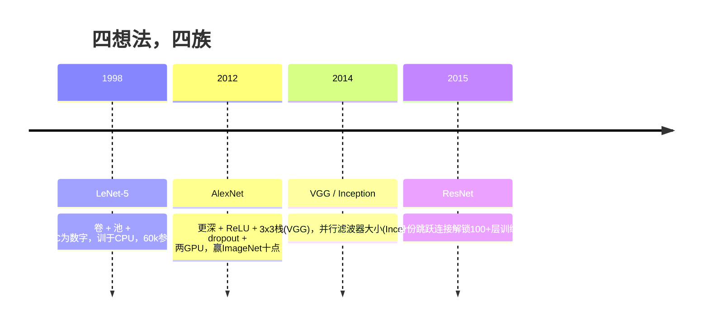
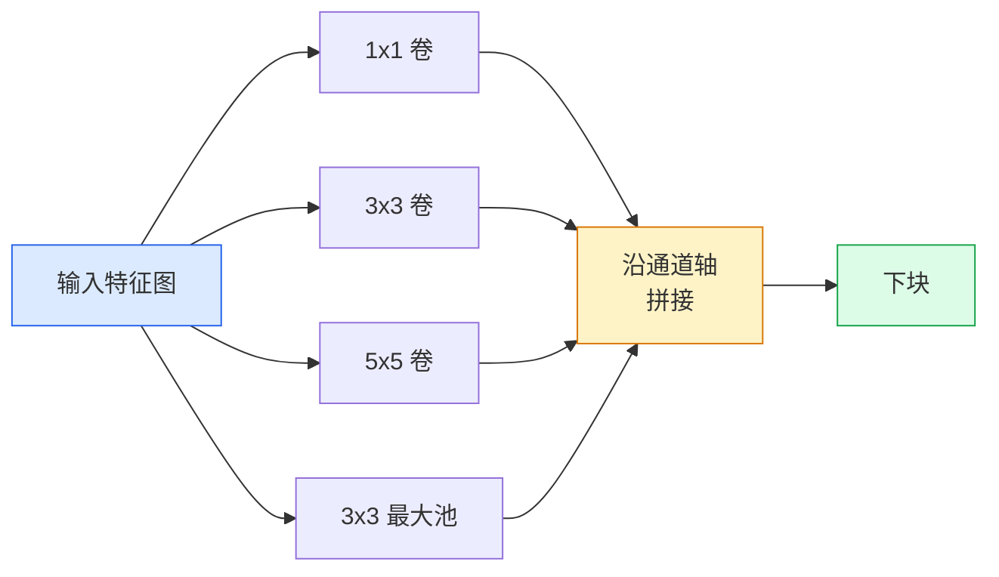
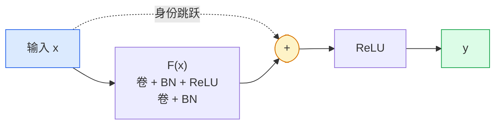

# CNN — LeNet到ResNet

> 过去三十年每个主要的CNN都是同一个卷积-非线性-下采样配方，加上一个新想法。按顺序学习这些想法。

**类型:** 学习+构建
**语言:** Python
**前置要求:** 阶段3课程11(PyTorch)，阶段4课程01(图像基础)，阶段4课程02(从零卷积)
**时间:** ~75分钟

## 学习目标

- 追架构谱系LeNet-5 -> AlexNet -> VGG -> Inception -> ResNet并陈述每族贡献单一新想法
- 在PyTorch实现LeNet-5、VGG风格块和ResNet BasicBlock，各少于40行
- 解释为何残连接将1000层网络从不可训转为最先进
- 读现代骨干(ResNet-18、ResNet-50)并预测其输出形状、感受野和参数数在看源前

## 问题背景

2011，最佳ImageNet分类器约74% top-5精度。2012 AlexNet达85%。2015 ResNet达96%。无新数据。无新GPU代。增益来自架构想法。工作视觉工程师须知哪想法来自哪论文因2026你产每骨干是那些同片重组 — 且因想法持续转移:组卷积从CNN到transformer，残连接从ResNet到每存在LLM，批归一化活于扩散模型。

按序研这些网络也免疫你抗常见错:当LeNet大小网络可解问题达最大可用模型。MNIST不需ResNet。知每族缩放曲线告你坐何处。

## 概念讲解

### 改变视觉四想法



经典视觉无他重要如这四跳。

### LeNet-5 (1998)

Yann LeCun数字识别器。60,000参数。两卷积-池块，两全连接层，tanh激活。它定每CNN继承模板:

```
输入 (1, 32, 32)
  卷 5x5 -> (6, 28, 28)
  平均池 2x2 -> (6, 14, 14)
  卷 5x5 -> (16, 10, 10)
  平均池 2x2 -> (16, 5, 5)
  平 -> 400
  密 -> 120
  密 -> 84
  密 -> 10
```

现代世界称CNN一切 — 交替卷积和下采样喂小分类头 — 是LeNet带更多层、更大通道和更好激活。

### AlexNet (2012)

三改变共破ImageNet:

1. **ReLU**替tanh。梯度停消。训练速度因子六。
2. **Dropout**在全连接头。正则化变成层，非技巧。
3. **深度和宽度**。五卷积层，三密层，60M参数，训于两GPU模型分跨。

论文图2仍显GPU分为两并行流。那并行性是硬件绕，非架构洞见 — 但上三想法仍在你用每模型。

### VGG (2014)

VGG问:若仅用3x3卷积且你深会发生什么？

```
栈:   卷 3x3 -> 卷 3x3 -> 池 2x2
重复:  16或19卷层
```

两3x3卷积见同5x5输入面积如一5x5卷积但参数少(`2*9*C^2 = 18C^2 vs 25*C^2`)和中多ReLU。VGG转这观察为整架构。简单 — 一块类型，重复 — 使它为后一切参考点。

代价:138M参数，训慢，推理贵。

### Inception (2014，同年)

Google答"我用何核大小？"是:全，并行。



每分支专 — 1x1通道混、3x3局部纹理、5x5大模式、池移不变特征 — 拼接让下层选有用分支。Inception v1用1x1卷积内每分支瓶颈保参数数理智。

### 退化问题

到2015，VGG-19工作VGG-32不。深度应帮，但过~20层训练和测试损失更糟。那非过拟合。那是优化器因梯度乘缩过每层失败找有用权重。

```
平深网络:
  y = f_L( f_{L-1}( ... f_1(x) ... ) )

对早层梯度:
  dL/dW_1 = dL/dy * df_L/df_{L-1} * ... * df_2/df_1 * df_1/dW_1

每乘项大小约(权重大小) * (激活增益)。
增益 < 1堆100，梯度有效零。
```

VGG工作19层因批归一化(同发)保激活好缩。但即使批归一化不能救过30层深。

### ResNet (2015)

He、Zhang、Ren、Sun提一改变修一切:

```
标准块:   y = F(x)
残块:   y = F(x) + x
```

`+ x`意层总可选无事通过驱`F(x)`为零。1000层ResNet现最多坏如1层网络，因每额外块有平凡逃舱。有那保，优化器愿使每块*微*有用 — 微有用，堆100次，是最先进。



两块变种现处处:

- **BasicBlock** (ResNet-18, ResNet-34):两3x3卷积，绕两者跳。
- **Bottleneck** (ResNet-50, -101, -152):1x1降、3x3中、1x1升，绕三者跳。高通道数时便宜。

当跳须穿过下采样(步幅=2)，身份路径替为1x1步幅=2卷积匹配形状。

### 为何残重要超越视觉

想法非真于图像分类。它关于转深网络从"交叉手指希梯度存活"为可靠可扩工程工具。你下阶段将读每transformer每块有同跳连接。无ResNet，无GPT。

## 构建

### 步骤1: LeNet-5

最小忠实LeNet。Tanh激活，平均池。唯一现代让步是我们下游用`nn.CrossEntropyLoss`而非原高斯连接。

```python
import torch
import torch.nn as nn
import torch.nn.functional as F

class LeNet5(nn.Module):
    def __init__(self, num_classes=10):
        super().__init__()
        self.conv1 = nn.Conv2d(1, 6, kernel_size=5)
        self.conv2 = nn.Conv2d(6, 16, kernel_size=5)
        self.pool = nn.AvgPool2d(2)
        self.fc1 = nn.Linear(16 * 5 * 5, 120)
        self.fc2 = nn.Linear(120, 84)
        self.fc3 = nn.Linear(84, num_classes)

    def forward(self, x):
        x = self.pool(torch.tanh(self.conv1(x)))
        x = self.pool(torch.tanh(self.conv2(x)))
        x = torch.flatten(x, 1)
        x = torch.tanh(self.fc1(x))
        x = torch.tanh(self.fc2(x))
        return self.fc3(x)

net = LeNet5()
x = torch.randn(1, 1, 32, 32)
print(f"输出: {net(x).shape}")
print(f"参数: {sum(p.numel() for p in net.parameters()):,}")
```

预期输出: `输出: torch.Size([1, 10])`，`参数: 61,706`。那是启现代视觉整个数字分类器。

### 步骤2: VGG块

一可复用块:两3x3卷积、ReLU、批归一化、最大池。

```python
class VGGBlock(nn.Module):
    def __init__(self, in_c, out_c):
        super().__init__()
        self.conv1 = nn.Conv2d(in_c, out_c, kernel_size=3, padding=1)
        self.bn1 = nn.BatchNorm2d(out_c)
        self.conv2 = nn.Conv2d(out_c, out_c, kernel_size=3, padding=1)
        self.bn2 = nn.BatchNorm2d(out_c)
        self.pool = nn.MaxPool2d(2)

    def forward(self, x):
        x = F.relu(self.bn1(self.conv1(x)))
        x = F.relu(self.bn2(self.conv2(x)))
        return self.pool(x)

class MiniVGG(nn.Module):
    def __init__(self, num_classes=10):
        super().__init__()
        self.stack = nn.Sequential(
            VGGBlock(3, 32),
            VGGBlock(32, 64),
            VGGBlock(64, 128),
        )
        self.head = nn.Sequential(
            nn.AdaptiveAvgPool2d(1),
            nn.Flatten(),
            nn.Linear(128, num_classes),
        )

    def forward(self, x):
        return self.head(self.stack(x))

net = MiniVGG()
x = torch.randn(1, 3, 32, 32)
print(f"输出: {net(x).shape}")
print(f"参数: {sum(p.numel() for p in net.parameters()):,}")
```

CIFAR大小输入上三VGG块、自适应池、一线性层。~290k参数。CIFAR-10充足。

### 步骤3: ResNet BasicBlock

ResNet-18和ResNet-34核心构建块。

```python
class BasicBlock(nn.Module):
    def __init__(self, in_c, out_c, stride=1):
        super().__init__()
        self.conv1 = nn.Conv2d(in_c, out_c, kernel_size=3, stride=stride, padding=1, bias=False)
        self.bn1 = nn.BatchNorm2d(out_c)
        self.conv2 = nn.Conv2d(out_c, out_c, kernel_size=3, stride=1, padding=1, bias=False)
        self.bn2 = nn.BatchNorm2d(out_c)
        if stride != 1 or in_c != out_c:
            self.shortcut = nn.Sequential(
                nn.Conv2d(in_c, out_c, kernel_size=1, stride=stride, bias=False),
                nn.BatchNorm2d(out_c),
            )
        else:
            self.shortcut = nn.Identity()

    def forward(self, x):
        out = F.relu(self.bn1(self.conv1(x)))
        out = self.bn2(self.conv2(out))
        out = out + self.shortcut(x)
        return F.relu(out)
```

卷积层上`bias=False`是批归一化约定 — BN的beta参数已处理偏置，故带卷积偏置也浪费。`shortcut`仅须真卷积当步幅或通道数改;否则它是无操作身份。

### 步骤4: 小ResNet

堆四组BasicBlock得CIFAR大小输入工作ResNet。

```python
class TinyResNet(nn.Module):
    def __init__(self, num_classes=10):
        super().__init__()
        self.stem = nn.Sequential(
            nn.Conv2d(3, 32, kernel_size=3, stride=1, padding=1, bias=False),
            nn.BatchNorm2d(32),
            nn.ReLU(inplace=True),
        )
        self.layer1 = self._make_group(32, 32, num_blocks=2, stride=1)
        self.layer2 = self._make_group(32, 64, num_blocks=2, stride=2)
        self.layer3 = self._make_group(64, 128, num_blocks=2, stride=2)
        self.layer4 = self._make_group(128, 256, num_blocks=2, stride=2)
        self.head = nn.Sequential(
            nn.AdaptiveAvgPool2d(1),
            nn.Flatten(),
            nn.Linear(256, num_classes),
        )

    def _make_group(self, in_c, out_c, num_blocks, stride):
        blocks = [BasicBlock(in_c, out_c, stride=stride)]
        for _ in range(num_blocks - 1):
            blocks.append(BasicBlock(out_c, out_c, stride=1))
        return nn.Sequential(*blocks)

    def forward(self, x):
        x = self.stem(x)
        x = self.layer1(x)
        x = self.layer2(x)
        x = self.layer3(x)
        x = self.layer4(x)
        return self.head(x)

net = TinyResNet()
x = torch.randn(1, 3, 32, 32)
print(f"输出: {net(x).shape}")
print(f"参数: {sum(p.numel() for p in net.parameters()):,}")
```

每组两块共四组。组2、3、4始步幅2。每下采样通道数翻倍。约2.8M参数。那是标准配方干净缩到ResNet-152。

### 步骤5: 比参数到特征效率

同输入过三网络比参数数。

```python
def summary(name, net, x):
    y = net(x)
    params = sum(p.numel() for p in net.parameters())
    print(f"{name:12s}  输入 {tuple(x.shape)} -> 输出 {tuple(y.shape)}  参数 {params:>10,}")

x = torch.randn(1, 3, 32, 32)
summary("LeNet5",     LeNet5(),       torch.randn(1, 1, 32, 32))
summary("MiniVGG",    MiniVGG(),      x)
summary("TinyResNet", TinyResNet(),   x)
```

三模型，三代，参数数三数量级。对CIFAR-10精度，你需约:LeNet 60%、MiniVGG 89%、TinyResNet 93%训练几epochs后。

## 使用

`torchvision.models`给你上述全预训版。调用签名跨族同，正是骨干抽象点。

```python
from torchvision.models import resnet18, ResNet18_Weights, vgg16, VGG16_Weights

r18 = resnet18(weights=ResNet18_Weights.IMAGENET1K_V1)
r18.eval()

print(f"ResNet-18 参数: {sum(p.numel() for p in r18.parameters()):,}")
print(r18.layer1[0])
print()

v16 = vgg16(weights=VGG16_Weights.IMAGENET1K_V1)
v16.eval()
print(f"VGG-16   参数: {sum(p.numel() for p in v16.parameters()):,}")
```

ResNet-18有11.7M参数。VGG-16有138M。类似ImageNet top-1精度(69.8% vs 71.6%)。残连接买你12x参数效率赢。那是为何ResNet变种从2016主导到2021 ViT到达 — 且仍主导算约束实世界部署。

对迁移学习，配方总同:加载预训、冻结骨干、替分类头。

```python
for p in r18.parameters():
    p.requires_grad = False
r18.fc = nn.Linear(r18.fc.in_features, 10)
```

三行。你现有10类CIFAR分类器继承ImageNet付表示。

## 交付成果

本课程产:

- `outputs/prompt-backbone-selector.md` — 给任务、数据集大小和算预算选对CNN族(LeNet/VGG/ResNet/MobileNet/ConvNeXt)提示词
- `outputs/skill-residual-block-reviewer.md` — 读PyTorch module并标跳连接错(步幅改缺shortcut、shortcut激活序、BN相对于加位置)技能

## 练习题

1. **(易)** 手数`TinyResNet`逐层参数。比`sum(p.numel() for p in net.parameters())`。参数预算大部分去哪 — 卷积、BN或分类头？

2. **(中)** 实现Bottleneck块(1x1 -> 3x3 -> 1x1带跳)并用它建ResNet-50风格网络为CIFAR。比参数对`TinyResNet`。

3. **(难)** 从`BasicBlock`移跳连接，训34块"平"网络和34块ResNet于CIFAR-10各10 epochs。绘训练损失对epoch。复现He等图1结果平深网络收敛到更高损失比其浅双。

## 关键术语

| 术语 | 人们怎么说 | 实际含义 |
|------|----------------|----------------------|
| 骨干 | "模型" | 产喂任务头特征图卷积块栈 |
| 残连接 | "跳跃连接" | `y = F(x) + x`;让优化器通过设F为零学身份，使任意深可训 |
| BasicBlock | "两3x3卷积带跳" | ResNet-18/34构建块:卷-BN-ReLU-卷-BN-加-ReLU |
| Bottleneck | "1x1降, 3x3, 1x1升" | ResNet-50/101/152块;高通道数便宜因3x3运于缩减宽 |
| 退化问题 | "深更糟" | 过~20平卷积层，训练和测试误差增;由残连接解，非更多数据 |
| Stem | "首层" | 初始卷积转3通道输入到基特征宽;ImageNet常7x7步幅2，CIFAR 3x3步幅1 |
| 头 | "分类器" | 末骨干块后层:自适应池、平、线性 |
| 迁移学习 | "预训练权重" | 加载训于ImageNet骨干仅精调头于你任务 |

## 延伸阅读

- [Deep Residual Learning for Image Recognition (He et al., 2015)](https://arxiv.org/abs/1512.03385) — ResNet论文;每图值得研
- [Very Deep Convolutional Networks (Simonyan & Zisserman, 2014)](https://arxiv.org/abs/1409.1556) — VGG论文;仍"为何3x3"最佳参考
- [ImageNet Classification with Deep CNNs (Krizhevsky et al., 2012)](https://papers.nips.cc/paper_files/paper/2012/hash/c399862d3b9d6b76c8436e924a68c45b-Abstract.html) — AlexNet;结束手工特征时代论文
- [Going Deeper with Convolutions (Szegedy et al., 2014)](https://arxiv.org/abs/1409.4842) — Inception v1;并行滤波器想法仍现于视觉transformer