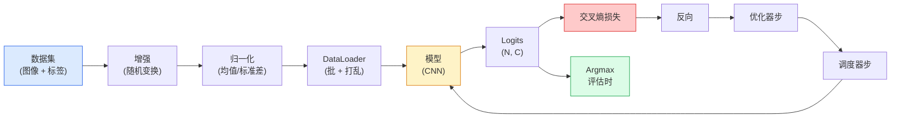

# 图像分类

> 分类器是从像素到类概率分布的函数。余皆管道。

**类型:** 构建
**语言:** Python
**前置要求:** 阶段2课程09(模型评估)，阶段3课程10(微型框架)，阶段4课程03(CNN)
**时间:** ~75分钟

## 学习目标

- 在CIFAR-10上建端到端图像分类管道:数据集、增强、模型、训练循环、评估
- 解释每组件角色(dataLoader、损失、优化器、调度器、增强)并预测打破任一如何在损失曲线体现
- 从零实现mixup、cutout和标签平滑并论证何时每值得加
- 读混淆矩阵和每类精度/召回表诊断数据集和模型失败超聚合精度

## 问题背景

每产视觉任务某级减为图像分类。检测分类区域。分割分类像素。检索按类中心相似排序。分类正确 — 数据集循环、增强策略、损失、评估 — 是转移到本阶段每他任务的技能。

大多分类bug不在模型。它们活在管道:破归一化、未打乱训集、扭曲标签增强、训数据污染验分、学习率静默epoch 30后分歧。正确设置CIFAR-10达93%的CNN常破设置打70-75%，损失曲线全程看合理。

这课手线全管道使每部分可查。你不用`torchvision.datasets`任可藏bug东西。

## 概念讲解

### 分类管道



循环每行是bug可居处。交叉熵取原logits，非softmax输出，故任`model(x).softmax()`前损失静默算错梯度。增强仅应用于输入，非标签 — 除了mixup，混两者。`optimizer.zero_grad()`须每步一次;跳它累积梯度看似狂不稳学习率。每这bug平学习曲线无抛错。

### 交叉熵、logits和softmax

分类器产每图像`C`数叫logits。应用softmax转为概率分布:

```
softmax(z)_i = exp(z_i) / sum_j exp(z_j)
```

交叉熵量正确类负对概率:

```
CE(z, y) = -log( softmax(z)_y )
        = -z_y + log( sum_j exp(z_j) )
```

右形式是数值稳定(log-sum-exp)。PyTorch`nn.CrossEntropyLoss`合softmax + NLL于一操作直接取原logits。自先应用softmax几总是bug — 你算log(softmax(softmax(z)))，无意义量。

### 为何增强工作

CNN有平移归纳偏置(来自权重共享)但无内置不变性裁剪、翻转、色抖动或遮。教它那些不变性唯一方式是示它像素用它们。训练时每随机变换是说:"这两图像有同标签;学忽略差特征。"

```
原裁剪:  "狗向左"
翻转:           "狗向右"       <- 同标签，不同像素
旋转(+15):    "狗，微斜"
色抖动:  "狗，暖光"
随机擦除:  "狗缺块"
```

规则:增强须保标签。数字上Cutout和旋转可翻"6"成"9";对那数据集你用小旋转范围选尊重数字特定不变性增强。

### Mixup和Cutmix

普通增强变换像素但保标签独热。**Mixup**和**Cutmix**破那通过插值两者。

```
Mixup:
  lambda ~ Beta(a, a)
  x = lambda * x_i + (1 - lambda) * x_j
  y = lambda * y_i + (1 - lambda) * y_j

Cutmix:
  粘x_j随机矩形入x_i
  y = y_i和y_j面积加权混
```

为何帮:模型停记尖锐独热目标学在类间插值。训练损失升，测试精度升。它是任分类器单最便宜鲁棒升级。

### 标签平滑

Mixup亲戚。非训于`[0, 0, 1, 0, 0]`，训于`[eps/C, eps/C, 1-eps, eps/C, eps/C]`对小`eps`如0.1。止模型产任意锐logits改善校准几乎无代价。内建于`nn.CrossEntropyLoss(label_smoothing=0.1)`自PyTorch 1.10。

### 超精度评估

聚合精度藏不平衡。90-10二元分类器总预测多数类打90%。实际告你发生工具:

- **每类精度** — 每类一数;立即浮欠表现类。
- **混淆矩阵** — C x C网格行i列j = 真类i预测j计数;对角正确，非对角模型活处。
- **Top-1 / Top-5** — 正确类在顶1或顶5预测否;Top-5重要ImageNet因类如"Norwich terrier" vs "Norfolk terrier"真歧。
- **校准(ECE)** — 0.8置信预测80%对否？现代网络系统过置信;用温度缩放或标签平滑修。

## 构建

### 步骤1: 确定性合成数据集

CIFAR-10活在磁盘。为这课可复现快我们建像CIFAR合成数据集 — 32x32 RGB图像带模型须学类特结构。同管道不变工作于真CIFAR-10。

```python
import numpy as np
import torch
from torch.utils.data import Dataset


def synthetic_cifar(num_per_class=1000, num_classes=10, seed=0):
    rng = np.random.default_rng(seed)
    X = []
    Y = []
    for c in range(num_classes):
        centre = rng.uniform(0, 1, (3,))
        freq = 2 + c
        for _ in range(num_per_class):
            yy, xx = np.meshgrid(np.linspace(0, 1, 32), np.linspace(0, 1, 32), indexing="ij")
            r = np.sin(xx * freq) * 0.5 + centre[0]
            g = np.cos(yy * freq) * 0.5 + centre[1]
            b = (xx + yy) * 0.5 * centre[2]
            img = np.stack([r, g, b], axis=-1)
            img += rng.normal(0, 0.08, img.shape)
            img = np.clip(img, 0, 1)
            X.append(img.astype(np.float32))
            Y.append(c)
    X = np.stack(X)
    Y = np.array(Y)
    idx = rng.permutation(len(X))
    return X[idx], Y[idx]


class ArrayDataset(Dataset):
    def __init__(self, X, Y, transform=None):
        self.X = X
        self.Y = Y
        self.transform = transform

    def __len__(self):
        return len(self.X)

    def __getitem__(self, i):
        img = self.X[i]
        if self.transform is not None:
            img = self.transform(img)
        img = torch.from_numpy(img).permute(2, 0, 1)
        return img, int(self.Y[i])
```

每类得自己色板和频率模式，加高斯噪迫使模型学信号而非记像素。十类，每千图像，打乱。

### 步骤2: 归一化和增强

每视觉管道两变换。

```python
def standardize(mean, std):
    mean = np.array(mean, dtype=np.float32)
    std = np.array(std, dtype=np.float32)
    def _fn(img):
        return (img - mean) / std
    return _fn


def random_hflip(p=0.5):
    def _fn(img):
        if np.random.random() < p:
            return img[:, ::-1, :].copy()
        return img
    return _fn


def random_crop(pad=4):
    def _fn(img):
        h, w = img.shape[:2]
        padded = np.pad(img, ((pad, pad), (pad, pad), (0, 0)), mode="reflect")
        y = np.random.randint(0, 2 * pad)
        x = np.random.randint(0, 2 * pad)
        return padded[y:y + h, x:x + w, :]
    return _fn


def compose(*fns):
    def _fn(img):
        for fn in fns:
            img = fn(img)
        return img
    return _fn
```

裁剪前反射填充，非零填充，因黑边是信号模型学忽略非有用方式。

### 步骤3: Mixup

训练步内混两图像和两标签。实现为批变换故它活在前向旁非数据集内。

```python
def mixup_batch(x, y, num_classes, alpha=0.2):
    if alpha <= 0:
        return x, torch.nn.functional.one_hot(y, num_classes).float()
    lam = float(np.random.beta(alpha, alpha))
    idx = torch.randperm(x.size(0), device=x.device)
    x_mixed = lam * x + (1 - lam) * x[idx]
    y_onehot = torch.nn.functional.one_hot(y, num_classes).float()
    y_mixed = lam * y_onehot + (1 - lam) * y_onehot[idx]
    return x_mixed, y_mixed


def soft_cross_entropy(logits, soft_targets):
    log_probs = torch.log_softmax(logits, dim=-1)
    return -(soft_targets * log_probs).sum(dim=-1).mean()
```

`soft_cross_entropy`是对软标签分布交叉熵。它简为常独热案当目标精确独热。

### 步骤4: 训练循环

完整配方:一遍数据，每批梯度，调度器每epoch步一次。

```python
import torch
import torch.nn as nn
from torch.utils.data import DataLoader
from torch.optim import SGD
from torch.optim.lr_scheduler import CosineAnnealingLR

def train_one_epoch(model, loader, optimizer, device, num_classes, use_mixup=True):
    model.train()
    total, correct, loss_sum = 0, 0, 0.0
    for x, y in loader:
        x, y = x.to(device), y.to(device)
        if use_mixup:
            x_m, y_soft = mixup_batch(x, y, num_classes)
            logits = model(x_m)
            loss = soft_cross_entropy(logits, y_soft)
        else:
            logits = model(x)
            loss = nn.functional.cross_entropy(logits, y, label_smoothing=0.1)
        optimizer.zero_grad()
        loss.backward()
        optimizer.step()
        loss_sum += loss.item() * x.size(0)
        total += x.size(0)
        # 训练精度对未混标签`y`仅近似当mixup开(模型见软目标，非y)。
        # 视为粗进度信号;赖验精度真实表现。
        with torch.no_grad():
            pred = logits.argmax(dim=-1)
            correct += (pred == y).sum().item()
    return loss_sum / total, correct / total


@torch.no_grad()
def evaluate(model, loader, device, num_classes):
    model.eval()
    total, correct = 0, 0
    loss_sum = 0.0
    cm = torch.zeros(num_classes, num_classes, dtype=torch.long)
    for x, y in loader:
        x, y = x.to(device), y.to(device)
        logits = model(x)
        loss = nn.functional.cross_entropy(logits, y)
        pred = logits.argmax(dim=-1)
        for t, p in zip(y.cpu(), pred.cpu()):
            cm[t, p] += 1
        loss_sum += loss.item() * x.size(0)
        total += x.size(0)
        correct += (pred == y).sum().item()
    return loss_sum / total, correct / total, cm
```

写训练循环每验五不变量:

1. `model.train()`训练前，`model.eval()`评估前 — 翻dropout和批归一化行为。
2. `.zero_grad()`前`.backward()`。
3. `.item()`累积指标时无保计算图活。
4. `@torch.no_grad()`评估时 — 省内存和时间，防细微事故。
5. Argmax于原logits，非softmax — 同结果，少一操作。

### 步骤5: 线一起

用前课`TinyResNet`，训几epochs，评估。

```python
from main import synthetic_cifar, ArrayDataset
from main import standardize, random_hflip, random_crop, compose
from main import mixup_batch, soft_cross_entropy
from main import train_one_epoch, evaluate
# TinyResNet来自前课(03-cnns-lenet-to-resnet)。
# 调导入路径到你存前课代码处。
from cnns_lenet_to_resnet import TinyResNet  # 示例占位

X, Y = synthetic_cifar(num_per_class=500)
split = int(0.9 * len(X))
X_train, Y_train = X[:split], Y[:split]
X_val, Y_val = X[split:], Y[split:]

mean = [0.5, 0.5, 0.5]
std = [0.25, 0.25, 0.25]
train_tf = compose(random_hflip(), random_crop(pad=4), standardize(mean, std))
eval_tf = standardize(mean, std)

train_ds = ArrayDataset(X_train, Y_train, transform=train_tf)
val_ds = ArrayDataset(X_val, Y_val, transform=eval_tf)

train_loader = DataLoader(train_ds, batch_size=128, shuffle=True, num_workers=0)
val_loader = DataLoader(val_ds, batch_size=256, shuffle=False, num_workers=0)

device = "cuda" if torch.cuda.is_available() else "cpu"
model = TinyResNet(num_classes=10).to(device)
optimizer = SGD(model.parameters(), lr=0.1, momentum=0.9, weight_decay=5e-4, nesterov=True)
scheduler = CosineAnnealingLR(optimizer, T_max=10)

for epoch in range(10):
    tr_loss, tr_acc = train_one_epoch(model, train_loader, optimizer, device, 10, use_mixup=True)
    va_loss, va_acc, _ = evaluate(model, val_loader, device, 10)
    scheduler.step()
    print(f"epoch {epoch:2d}  lr {scheduler.get_last_lr()[0]:.4f}  "
          f"训 {tr_loss:.3f}/{tr_acc:.3f}  验 {va_loss:.3f}/{va_acc:.3f}")
```

合成数据集上，这在五epochs内达近完美验精度，那是点:管道正确，模型能学可学。换数据集为真CIFAR-10，同循环训到~90%无改。

### 步骤6: 读混淆矩阵

精度从不告你模型失败处。混淆矩阵告。

```python
def print_confusion(cm, labels=None):
    c = cm.shape[0]
    labels = labels or [str(i) for i in range(c)]
    print(f"{'':>6}" + "".join(f"{l:>5}" for l in labels))
    for i in range(c):
        row = cm[i].tolist()
        print(f"{labels[i]:>6}" + "".join(f"{v:>5}" for v in row))
    print()
    tp = cm.diag().float()
    fp = cm.sum(dim=0).float() - tp
    fn = cm.sum(dim=1).float() - tp
    prec = tp / (tp + fp).clamp_min(1)
    rec = tp / (tp + fn).clamp_min(1)
    f1 = 2 * prec * rec / (prec + rec).clamp_min(1e-9)
    for i in range(c):
        print(f"{labels[i]:>6}  精度 {prec[i]:.3f}  召回 {rec[i]:.3f}  f1 {f1[i]:.3f}")

_, _, cm = evaluate(model, val_loader, device, 10)
print_confusion(cm)
```

行是真类，列是预测。类3和5间非对角计数簇意模型混那两给你靶向数据收集或类特增强始点。

## 使用

`torchvision`将上一切包为地道组件。真CIFAR-10全管道四行加训练循环。

```python
from torchvision.datasets import CIFAR10
from torchvision.transforms import Compose, RandomCrop, RandomHorizontalFlip, ToTensor, Normalize

mean = (0.4914, 0.4822, 0.4465)
std = (0.2470, 0.2435, 0.2616)
train_tf = Compose([
    RandomCrop(32, padding=4, padding_mode="reflect"),
    RandomHorizontalFlip(),
    ToTensor(),
    Normalize(mean, std),
])
eval_tf = Compose([ToTensor(), Normalize(mean, std)])

train_ds = CIFAR10(root="./data", train=True,  download=True, transform=train_tf)
val_ds   = CIFAR10(root="./data", train=False, download=True, transform=eval_tf)
```

两事注意:均值/标准差是**数据集特定** — 于CIFAR-10训集算，非ImageNet — 反射填充是社区默认裁剪策略。此处拷贴ImageNet统计是~1%精度漏无人捕直到有人剖析模型。

## 交付成果

本课程产:

- `outputs/prompt-classifier-pipeline-auditor.md` — 审计训练脚本上五不变量并浮首违规提示词
- `outputs/skill-classification-diagnostics.md` — 给混淆矩阵和类名列表，总结每类失败并提最有影响修复技能

## 练习题

1. **(易)** 同模型有无mixup训五epochs于合成数据集。绘两者训练和验损失。解释为何mixup训练损失更高但验精度相似或更优。

2. **(中)** 实现Cutout — 每训练图像零出随机8x8方 — 跑消融对无增强、hflip+crop、hflip+crop+cutout、hflip+crop+mixup。报告每验精度。

3. **(难)** 建CIFAR-100管道(100类，同输入大小)并复现ResNet-34训练跑近发表精度1%。额外:扫三学习率和两权重衰减、录本地CSV、产终混淆矩阵顶混表。

## 关键术语

| 术语 | 人们怎么说 | 实际含义 |
|------|----------------|----------------------|
| Logits | "原输出" | 每图像预softmax C数向量;交叉熵期望这些，非softmax值 |
| 交叉熵 | "损失" | 正确类负对概率;合log-softmax和NLL于一稳定操作 |
| DataLoader | "批器" | 包数据集带打乱、批和(可选)多worker加载;被训bug半责 |
| 增强 | "随机变换" | 训时保标签任像素级变换;教CNN无原生不变性 |
| Mixup / Cutmix | "混两图像" | 混输入和标签使分类器学平滑插值非硬边界 |
| 标签平滑 | "更软目标" | 替独热为(1-eps, eps/(C-1), ...);改善校准微提精度 |
| Top-k精度 | "Top-5" | 正确类在k最高概率预测中;用于真歧类数据集 |
| 混淆矩阵 | "错在哪" | C x C表条目(i, j)计真类i预测j图像;对角右，非对角告你修什么 |

## 延伸阅读

- [CS231n: Training Neural Networks](https://cs231n.github.io/neural-networks-3/) — 仍是单页最清训练管道导览
- [Bag of Tricks for Image Classification (He et al., 2019)](https://arxiv.org/abs/1812.01187) — 每小技巧共加3-4% ResNet精度ImageNet
- [mixup: Beyond Empirical Risk Minimization (Zhang et al., 2017)](https://arxiv.org/abs/1710.09412) — 原mixup论文;三页理论加说服实验
- [Why temperature scaling matters (Guo et al., 2017)](https://arxiv.org/abs/1706.04599) — 证明现代网络误校准用一标量参数修论文