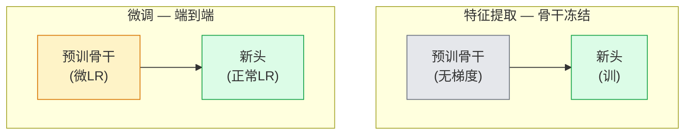

# 迁移学习和微调

> 别人花百万GPU小时教网络边、纹理和物体部分像什么。你应借那些特征前训自己。

**类型:** 构建
**语言:** Python
**前置要求:** 阶段4课程03(CNN)，阶段4课程04(图像分类)
**时间:** ~75分钟

## 学习目标

- 区特征提取和微调并基于数据集大小、域距离和算预算选对
- 加载预训骨干、替其分类头、仅训头工作基线少于20行
- 渐进解冻层带判别学习率使早通用特征更小更新晚任务特定
- 诊断三常见失败:未冻结块太高LR特征漂移、小数据集BN统计崩溃、灾难遗忘

## 问题背景

训ResNet-50于ImageNet约2,000 GPU小时。少团队有那预算每任务。几乎每团队实产是预训骨干带新头于数百或数千任务特定图像训。

这非捷径。任ImageNet训CNN首卷积块学边和类Gabor滤波器。下几块学纹理和简模式。中块学物体部分。末块学组合开始看像1,000 ImageNet类。那层级首90%几乎不变转移医学成像、工业检、卫星数据和每其他视觉任务 — 因自然有有限边和纹理词汇。末10%是你实际训。

迁移对有三bug等你:过高学习率毁预训特征、冻结太多饿模型信息、让批归一化运行统计漂向网络未学小数据集。这课走每它们于目的。

## 概念讲解

### 特征提取 vs 微调

两模式，由你信预训特征多少和你有多少数据选。



经验规则:

| 数据集大小 | 域距离 | 配方 |
|------------|--------|------|
| < 1k图像 | 近ImageNet | 冻骨干，仅训头 |
| 1k-10k | 近 | 冻首2-3阶段，微调余 |
| 10k-100k | 任 | 端到端微调带判别LR |
| 100k+ | 远 | 微调一切;考虑从零训若域够远 |

"近ImageNet"粗意自然RGB照带物体内容。医CT扫描、俯视卫星图像和显微镜是远域 — 特征仍帮，但你需让更多层适应。

### 为何冻结工作

CNN学ImageNet特征非专于1,000类。它们专于自然图像统计:特定方向边、纹理、对比模式、形状基元。那些统计稳跨几乎每人可视域。那为何训于ImageNet模型仅新线性头(骨干无微调)CIFAR-10零_shot达80%+精度。头学哪些已学特征为此任务权重。

### 判别学习率

当你解冻，早层应训慢于晚层。早层编码通用特征你要保;晚层编码任务特定结构你要移多。

```
典型配方:

  阶段0 (stem + 首组): lr = base_lr / 100    (大固定)
  阶段1:                       lr = base_lr / 10
  阶段2:                       lr = base_lr / 3
  阶段3 (末骨干组): lr = base_lr
  头:                          lr = base_lr  (或微高)
```

PyTorch这只是参数组列表传优化器。一模型，五学习率，零额外代码。

### 批归一化问题

BN层持`running_mean`和`running_var`缓冲算于ImageNet。若你任务有不同像素分布 — 不同光、不同传感器、不同色空间 — 那些缓冲错。三选项偏好序:

1. **微调BN训练模式。** 让BN随其他更新运行统计。任务数据集中等大小(>= 5k例)默认选择。
2. **冻结BN评估模式。** 保ImageNet统计仅训权重。当数据集小BN移动平均噪时正确。
3. **替BN为GroupNorm。** 完除移动平均问题。用于检测和分割骨干每GPU批大小小处。

这错静默降精度5-15%。

### 头设计

分类头是1-3线性层加可选dropout。每torchvision骨干船默认头你替:

```
backbone.fc = nn.Linear(backbone.fc.in_features, num_classes)          # ResNet
backbone.classifier[1] = nn.Linear(..., num_classes)                    # EfficientNet, MobileNet
backbone.heads.head = nn.Linear(..., num_classes)                       # torchvision ViT
```

小数据集，单线性层常够。加隐藏层(Linear -> ReLU -> Dropout -> Linear)帮当任务分布远骨干训分布。

### 层级LR衰减

现代微调(BEiT、DINOv2、ViT-B微调)用平滑版判别LR。非分层入阶段，给每层微小LR于上:

```
lr_layer_k = base_lr * decay^(L - k)
```

decay = 0.75和L = 12 transformer块，首块训于`0.75^11 ≈ 0.04x`头LR。对transformer微调更重要CNN，那里阶段分组LR常够。

### 评估什么

迁移学习跑需两数你从零跑不追:

- **仅预训精度** — 骨干冻结头精度。这是你地板。
- **微调精度** — 端到端训练后同模型。这是你天花板。

若微调少于仅预训，你有学习率或BN bug。总打印两者。

## 构建

### 步骤1: 加载预训骨干并检查

```python
import torch
import torch.nn as nn
from torchvision.models import resnet18, ResNet18_Weights

backbone = resnet18(weights=ResNet18_Weights.IMAGENET1K_V1)
print(backbone)
print()
print("分类头:", backbone.fc)
print("特征维:", backbone.fc.in_features)
```

`ResNet18`有四阶段(`layer1..layer4`)加stem和`fc`头。每torchvision分类骨干有类结构。

### 步骤2: 特征提取 — 冻一切，替头

```python
def make_feature_extractor(num_classes=10):
    model = resnet18(weights=ResNet18_Weights.IMAGENET1K_V1)
    for p in model.parameters():
        p.requires_grad = False
    model.fc = nn.Linear(model.fc.in_features, num_classes)
    return model

model = make_feature_extractor(num_classes=10)
trainable = sum(p.numel() for p in model.parameters() if p.requires_grad)
frozen = sum(p.numel() for p in model.parameters() if not p.requires_grad)
print(f"可训: {trainable:>10,}")
print(f"冻结:    {frozen:>10,}")
```

仅`model.fc`可训。骨干是冻结特征提取器。

### 步骤3: 判别微调

建阶段特定学习率参数组工具。

```python
def discriminative_param_groups(model, base_lr=1e-3, decay=0.3):
    stages = [
        ["conv1", "bn1"],
        ["layer1"],
        ["layer2"],
        ["layer3"],
        ["layer4"],
        ["fc"],
    ]
    groups = []
    for i, names in enumerate(stages):
        lr = base_lr * (decay ** (len(stages) - 1 - i))
        params = [p for n, p in model.named_parameters()
                  if any(n.startswith(k) for k in names)]
        if params:
            groups.append({"params": params, "lr": lr, "name": "_".join(names)})
    return groups

model = resnet18(weights=ResNet18_Weights.IMAGENET1K_V1)
model.fc = nn.Linear(model.fc.in_features, 10)
for p in model.parameters():
    p.requires_grad = True

groups = discriminative_param_groups(model)
for g in groups:
    print(f"{g['name']:>10s}  lr={g['lr']:.2e}  参数={sum(p.numel() for p in g['params']):>8,}")
```

`decay=0.3`意每阶段训于下阶段30%率。`fc`得`base_lr`，`layer4`得`0.3 * base_lr`，`conv1`得`0.3^5 * base_lr ≈ 0.00243 * base_lr`。听极;经验上它工作。

### 步骤4: 批归一化处理

冻结BN运行统计不冻结其权重助手。

```python
def freeze_bn_stats(model):
    for m in model.modules():
        if isinstance(m, (nn.BatchNorm1d, nn.BatchNorm2d, nn.BatchNorm3d)):
            m.eval()
            for p in m.parameters():
                p.requires_grad = False
    return model
```

每epoch始调它于你设`model.train()`后。`model.train()`翻一切训练模式;这仅对BN层逆转。

### 步骤5: 最小端到端微调循环

```python
from torch.optim import SGD
from torch.utils.data import DataLoader
from torch.optim.lr_scheduler import CosineAnnealingLR
import torch.nn.functional as F

def fine_tune(model, train_loader, val_loader, device, epochs=5, base_lr=1e-3, freeze_bn=False):
    model = model.to(device)
    groups = discriminative_param_groups(model, base_lr=base_lr)
    optimizer = SGD(groups, momentum=0.9, weight_decay=1e-4, nesterov=True)
    scheduler = CosineAnnealingLR(optimizer, T_max=epochs)

    for epoch in range(epochs):
        model.train()
        if freeze_bn:
            freeze_bn_stats(model)
        tr_loss, tr_correct, tr_total = 0.0, 0, 0
        for x, y in train_loader:
            x, y = x.to(device), y.to(device)
            logits = model(x)
            loss = F.cross_entropy(logits, y, label_smoothing=0.1)
            optimizer.zero_grad()
            loss.backward()
            optimizer.step()
            tr_loss += loss.item() * x.size(0)
            tr_total += x.size(0)
            tr_correct += (logits.argmax(-1) == y).sum().item()
        scheduler.step()

        model.eval()
        va_total, va_correct = 0, 0
        with torch.no_grad():
            for x, y in val_loader:
                x, y = x.to(device), y.to(device)
                pred = model(x).argmax(-1)
                va_total += x.size(0)
                va_correct += (pred == y).sum().item()
        print(f"epoch {epoch}  训 {tr_loss/tr_total:.3f}/{tr_correct/tr_total:.3f}  "
              f"验 {va_correct/va_total:.3f}")
    return model
```

上配方5 epochs于CIFAR-10将`ResNet18-IMAGENET1K_V1`从~70%零shot线性探精度到~93%微调精度。单头无触骨干将平台86%。

### 步骤6: 渐进解冻

每epoch从末向始解冻一阶段计划。减特征漂移代价额外epochs。

```python
def progressive_unfreeze_schedule(model):
    stages = ["layer4", "layer3", "layer2", "layer1"]
    yielded = set()

    def start():
        for p in model.parameters():
            p.requires_grad = False
        for p in model.fc.parameters():
            p.requires_grad = True

    def unfreeze(epoch):
        if epoch < len(stages):
            name = stages[epoch]
            yielded.add(name)
            for n, p in model.named_parameters():
                if n.startswith(name):
                    p.requires_grad = True
            return name
        return None

    return start, unfreeze
```

首epoch前调`start()`一次。每epoch始调`unfreeze(epoch)`。可训参数集改时重建优化器，否则冻结参数仍持缓存矩混淆它。

## 使用

大多实任务，`torchvision.models` + 三行够。上重机于你遇库默认不能修问题。

```python
from torchvision.models import resnet50, ResNet50_Weights

model = resnet50(weights=ResNet50_Weights.IMAGENET1K_V2)
model.fc = nn.Linear(model.fc.in_features, num_classes)
optimizer = torch.optim.AdamW(model.parameters(), lr=1e-4, weight_decay=1e-4)
```

两其他生产级默认:

- `timm`船~800预训视觉骨干带一致API(`timm.create_model("resnet50", pretrained=True, num_classes=10)`)。对任超越torchvision动物园微调，它是标准。
- 对transformer，`transformers.AutoModelForImageClassification.from_pretrained(name, num_labels=N)`给你ViT / BEiT / DeiT同加载语义文本模型。

## 交付成果

本课程产:

- `outputs/prompt-fine-tune-planner.md` — 基数据集大小、域距离和算预算选特征提取 vs 渐进 vs 端到端微调提示词
- `outputs/skill-freeze-inspector.md` — 给PyTorch模型，报告哪些参数可训、哪些BN层评估模式、优化器是否实被喂可训参数技能

## 练习题

1. **(易)** 训`ResNet18`为线性探(骨干冻结)和全微调于同合成CIFAR数据集。并报两精度。解释哪差告特征转移好哪告不好。

2. **(中)** 故意引入bug:骨干阶段设`base_lr = 1e-1`而非头。示训练损失爆，然后用`discriminative_param_groups`助手恢。录每阶段始分歧LR。

3. **(难)** 取医学成像数据集(如CheXpert-small、PatchCamelyon或HAM10000)比三模式: ImageNet预训冻结骨干 + 线性头; ImageNet预训端到端微调; 从零训。报每精度和算代价。何数据集大小从零训竞？

## 关键术语

| 术语 | 人们怎么说 | 实际含义 |
|------|----------------|----------------------|
| 特征提取 | "冻结训头" | 骨干参数冻结，仅新分类头收梯度 |
| 微调 | "端到端重训" | 全参数可训，常比从零训小LR |
| 判别LR | "早层小LR" | 优化器参数组早阶段LR是晚阶段分数 |
| 层级LR衰减 | "平滑LR梯度" | 每层LR乘decay^(L - k);transformer微调常见 |
| 灾难遗忘 | "模型丢ImageNet" | 过高LR在头梯度稳前覆写预训特征 |
| BN统计漂移 | "运行均值错" | BN running_mean/var算于不同分布当前任务，静默损精度 |
| 线性探 | "冻结骨干 + 线性头" | 预训特征评估 — 冻结表示上最佳线性分类器精度 |
| 灾难崩溃 | "一切预测一类" | 发生当微调LR高到毁特征在头梯度稳前 |

## 延伸阅读

- [How transferable are features in deep neural networks? (Yosinski et al., 2014)](https://arxiv.org/abs/1411.1792) — 量化特征跨层可转移性论文
- [Universal Language Model Fine-tuning (ULMFiT, Howard & Ruder, 2018)](https://arxiv.org/abs/1801.06146) — 原判别LR / 渐进解冻配方;想法直转视觉
- [timm文档](https://huggingface.co/docs/timm) — 现代视觉骨干和其训用精确微调默认参考
- [A Simple Framework for Linear-Probe Evaluation (Kornblith et al., 2019)](https://arxiv.org/abs/1805.08974) — 为何线性探精度重要和如何正确报