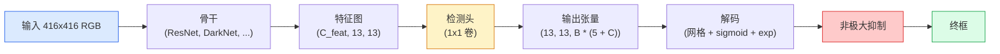

# 目标检测 — 从零YOLO

> 检测是分类加回归，在特征图的每个位置运行，然后用非极大抑制清理。

**类型:** 构建
**语言:** Python
**前置要求:** 阶段4课程03(CNN)，阶段4课程04(图像分类)，阶段4课程05(迁移学习)
**时间:** ~75分钟

## 学习目标

- 解释网格和锚设计转检测为密集预测问题并陈述输出张量每数意味
- 算框间交并比并从零实现非极大抑制
- 在预训骨干上建最小YOLO风格头，含分类、目标度和框回归损失
- 读检测指标行(precision@0.5、recall、mAP@0.5、mAP@0.5:0.95)并选下扭何旋钮

## 问题背景

分类说"这图像是狗"。检测说"像素(112, 40, 280, 210)有狗，像素(400, 180, 560, 310)有猫，帧无他"。那结构改变 — 预测可变数标签框而非每图像一标签 — 是每自动驾驶系统、每监控产品、每文档布局解析器和每工厂视觉线依赖。

检测也是视觉每工程权衡同时现处。你要准框(回归头)、每框对类(分类头)、模型知何时无物检(目标度评分)、每真物仅一预测(非极大抑制)。缺任这些管道漏物、报幻框或预测同物十五次稍不同位。

YOLO(You Only Look Once, Redmon等 2016)是设计使全实时跑通过单卷积网络前向，同结构决策仍是现代检测器(YOLOv8、YOLOv9、YOLO-NAS、RT-DETR)骨干。学核心每变种成同部分重排。

## 概念讲解

### 检测为密集预测

分类器输每图像C数。YOLO风格检测器输每图像`(S x S x (5 + C))`数，S是空间网格大小。



每`S * S`网格单元预测`B`框。每框:

- 4数述几何: `tx, ty, tw, th`。
- 1数是目标度评分: "此单元有物体中心否？"
- C数是类概率。

每单元总: `B * (5 + C)`。VOC用`S=13, B=2, C=20`，那是每单元50数。

### 为何网格和锚

纯回归会预每物`(x, y, w, h)`为绝对坐标。那对卷积网络难因移图像不应移全预测同量 — 每物空间锚。网格答通过分每真框给其中心落网格单元;仅那单元责那物。

锚解二问题。3x3卷积难从16像素感受野特征单元回出500像素宽框。替代，我们预定义`B`先验框形状(锚)每单元预每锚小delta。模型学选对锚微调而非从零回归。

```
锚框先验(416x416输入例):

  小:   (30,  60)
  中:  (75,  170)
  大:   (200, 380)

每网格单元，每锚发(tx, ty, tw, th, obj, c_1, ..., c_C)。
```

现代检测器常用FPN带每分辨率不同锚集 — 小锚浅高分辨率图、大锚深低分辨率图。同想法，更多尺度。

### 解码预测

原`tx, ty, tw, th`非框坐标;它们是绘前变换回归目标:

```
中心 x  = (sigmoid(tx) + cell_x) * stride
中心 y  = (sigmoid(ty) + cell_y) * stride
宽     = anchor_w * exp(tw)
高    = anchor_h * exp(th)
```

`sigmoid`保中心偏移内单元。`exp`让宽从锚自由缩无符号翻。`stride`缩网格坐标回像素。这解码步同于每YOLO版本自v2。

### IoU

检测两框间通用相似度量:

```
IoU(A, B) = area(A intersect B) / area(A union B)
```

IoU = 1意同;IoU = 0意无重叠。预测和真框IoU决定预测计为真阳(典型IoU >= 0.5)。两预测间IoU是NMS去重用。

### 非极大抑制

训于相邻锚卷积网络常预同物重叠框。NMS保最高置信预测删任其他IoU超阈值预测。

```
NMS(boxes, scores, iou_threshold):
    按评分降序框
    keep = []
    while 框不空:
        选最高评分框，加keep
        移每框IoU > iou_threshold对选框
    return keep
```

典型阈值:0.45目标检测。近检测器替标准NMS为`soft-NMS`、`DIoU-NMS`或直接学抑制(RT-DETR)但结构目的同。

### 损失

YOLO损失是三损失加权加:

```
L = lambda_coord * L_box(pred, target, where obj=1)
  + lambda_obj   * L_obj(pred, 1,     where obj=1)
  + lambda_noobj * L_obj(pred, 0,     where obj=0)
  + lambda_cls   * L_cls(pred, target, where obj=1)
```

仅含物单元贡献框回归和分类损失。无物单元仅贡献目标度损失(教模型静默)。`lambda_noobj`常小(~0.5)因大多单元空会否则主导总损失。

现代变种换MSE框损失为CIoU / DIoU(直接优化IoU)、类不平衡用focal损失、质量focal损失平目标度。三组件结构不变。

### 检测指标

精度不转检测。四数转:

- **Precision@IoU=0.5** — 计为阳预测中，多少实对。
- **Recall@IoU=0.5** — 真实物体中，多少我们找。
- **AP@0.5** — IoU阈值0.5精度-召回曲线面积;每类一数。
- **mAP@0.5:0.95** — AP于IoU阈值0.5, 0.55, ..., 0.95平均。COCO指标;严最信息。

报全四。mAP@0.5强mAP@0.5:0.95弱检测器定位粗不紧;用更好框回归损失修。高精度低召回检测器太保守;降置信阈值或增目标度权重。

## 构建

### 步骤1: IoU

全课主力。工作于`(x1, y1, x2, y2)`格式两框数组。

```python
import numpy as np

def box_iou(boxes_a, boxes_b):
    ax1, ay1, ax2, ay2 = boxes_a[:, 0], boxes_a[:, 1], boxes_a[:, 2], boxes_a[:, 3]
    bx1, by1, bx2, by2 = boxes_b[:, 0], boxes_b[:, 1], boxes_b[:, 2], boxes_b[:, 3]

    inter_x1 = np.maximum(ax1[:, None], bx1[None, :])
    inter_y1 = np.maximum(ay1[:, None], by1[None, :])
    inter_x2 = np.minimum(ax2[:, None], bx2[None, :])
    inter_y2 = np.minimum(ay2[:, None], by2[None, :])

    inter_w = np.clip(inter_x2 - inter_x1, 0, None)
    inter_h = np.clip(inter_y2 - inter_y1, 0, None)
    inter = inter_w * inter_h

    area_a = (ax2 - ax1) * (ay2 - ay1)
    area_b = (bx2 - bx1) * (by2 - by1)
    union = area_a[:, None] + area_b[None, :] - inter
    return inter / np.clip(union, 1e-8, None)
```

返`(N_a, N_b)`配对IoU矩阵。对单真框用使一数组形状`(1, 4)`。

### 步骤2: 非极大抑制

```python
def nms(boxes, scores, iou_threshold=0.45):
    order = np.argsort(-scores)
    keep = []
    while len(order) > 0:
        i = order[0]
        keep.append(i)
        if len(order) == 1:
            break
        rest = order[1:]
        ious = box_iou(boxes[[i]], boxes[rest])[0]
        order = rest[ious <= iou_threshold]
    return np.array(keep, dtype=np.int64)
```

确定性，`O(N log N)`来自排序，合`torchvision.ops.nms`行为于同输入。

### 步骤3: 框编码和解码

像素坐标和网络实回归`(tx, ty, tw, th)`目标间转换。

```python
def encode(box_xyxy, cell_x, cell_y, stride, anchor_wh):
    x1, y1, x2, y2 = box_xyxy
    cx = 0.5 * (x1 + x2)
    cy = 0.5 * (y1 + y2)
    w = x2 - x1
    h = y2 - y1
    tx = cx / stride - cell_x
    ty = cy / stride - cell_y
    tw = np.log(w / anchor_wh[0] + 1e-8)
    th = np.log(h / anchor_wh[1] + 1e-8)
    return np.array([tx, ty, tw, th])


def decode(tx_ty_tw_th, cell_x, cell_y, stride, anchor_wh):
    tx, ty, tw, th = tx_ty_tw_th
    cx = (sigmoid(tx) + cell_x) * stride
    cy = (sigmoid(ty) + cell_y) * stride
    w = anchor_wh[0] * np.exp(tw)
    h = anchor_wh[1] * np.exp(th)
    return np.array([cx - w / 2, cy - h / 2, cx + w / 2, cy + h / 2])


def sigmoid(x):
    return 1.0 / (1.0 + np.exp(-x))
```

测试:编码框后解码 — 你应回接近原(sigmoid逆不完全可逆当`tx`不在后sigmoid范围)。

### 步骤4: 最小YOLO头

特征图上一1x1卷积，重塑为`(B, S, S, num_anchors, 5 + C)`。

```python
import torch
import torch.nn as nn

class YOLOHead(nn.Module):
    def __init__(self, in_c, num_anchors, num_classes):
        super().__init__()
        self.num_anchors = num_anchors
        self.num_classes = num_classes
        self.conv = nn.Conv2d(in_c, num_anchors * (5 + num_classes), kernel_size=1)

    def forward(self, x):
        n, _, h, w = x.shape
        y = self.conv(x)
        y = y.view(n, self.num_anchors, 5 + self.num_classes, h, w)
        y = y.permute(0, 3, 4, 1, 2).contiguous()
        return y
```

输出形状: `(N, H, W, num_anchors, 5 + C)`。末维持`[tx, ty, tw, th, obj, cls_0, ..., cls_{C-1}]`。

### 步骤5: 真值分配

每真框，决定哪`(cell, anchor)`责。

```python
def assign_targets(boxes_xyxy, classes, anchors, stride, grid_size, num_classes):
    num_anchors = len(anchors)
    target = np.zeros((grid_size, grid_size, num_anchors, 5 + num_classes), dtype=np.float32)
    has_obj = np.zeros((grid_size, grid_size, num_anchors), dtype=bool)

    for box, cls in zip(boxes_xyxy, classes):
        x1, y1, x2, y2 = box
        cx, cy = 0.5 * (x1 + x2), 0.5 * (y1 + y2)
        gx, gy = int(cx / stride), int(cy / stride)
        bw, bh = x2 - x1, y2 - y1

        ious = np.array([
            (min(bw, aw) * min(bh, ah)) / (bw * bh + aw * ah - min(bw, aw) * min(bh, ah))
            for aw, ah in anchors
        ])
        best = int(np.argmax(ious))
        aw, ah = anchors[best]

        target[gy, gx, best, 0] = cx / stride - gx
        target[gy, gx, best, 1] = cy / stride - gy
        target[gy, gx, best, 2] = np.log(bw / aw + 1e-8)
        target[gy, gx, best, 3] = np.log(bh / ah + 1e-8)
        target[gy, gx, best, 4] = 1.0
        target[gy, gx, best, 5 + cls] = 1.0
        has_obj[gy, gx, best] = True
    return target, has_obj
```

锚选是"最佳形状IoU对真值" — 匹YOLOv2/v3分配廉价代理。v5和后用更精策略(任务对齐匹配、动态k)精炼同想法。

### 步骤6: 三损失

```python
def yolo_loss(pred, target, has_obj, lambda_coord=5.0, lambda_obj=1.0, lambda_noobj=0.5, lambda_cls=1.0):
    has_obj_t = torch.from_numpy(has_obj).bool()
    target_t = torch.from_numpy(target).float()

    # 框回归损失:仅物单元
    box_pred = pred[..., :4][has_obj_t]
    box_true = target_t[..., :4][has_obj_t]
    loss_box = torch.nn.functional.mse_loss(box_pred, box_true, reduction="sum")

    # 目标度损失
    obj_pred = pred[..., 4]
    obj_true = target_t[..., 4]
    loss_obj_pos = torch.nn.functional.binary_cross_entropy_with_logits(
        obj_pred[has_obj_t], obj_true[has_obj_t], reduction="sum")
    loss_obj_neg = torch.nn.functional.binary_cross_entropy_with_logits(
        obj_pred[~has_obj_t], obj_true[~has_obj_t], reduction="sum")

    # 分类损失于物单元
    cls_pred = pred[..., 5:][has_obj_t]
    cls_true = target_t[..., 5:][has_obj_t]
    loss_cls = torch.nn.functional.binary_cross_entropy_with_logits(
        cls_pred, cls_true, reduction="sum")

    total = (lambda_coord * loss_box
             + lambda_obj * loss_obj_pos
             + lambda_noobj * loss_obj_neg
             + lambda_cls * loss_cls)
    return total, {"box": loss_box.item(), "obj_pos": loss_obj_pos.item(),
                   "obj_neg": loss_obj_neg.item(), "cls": loss_cls.item()}
```

五超参数每YOLO教程或硬编码或扫。比重要: `lambda_coord=5, lambda_noobj=0.5`镜原YOLOv1论文仍工作为合理默认。

### 步骤7: 推理管道

解码原头输出、应用sigmoid/exp、目标度阈值、NMS。

```python
def postprocess(pred_tensor, anchors, stride, img_size, conf_threshold=0.25, iou_threshold=0.45):
    pred = pred_tensor.detach().cpu().numpy()
    grid_h, grid_w = pred.shape[1], pred.shape[2]
    num_anchors = len(anchors)

    boxes, scores, classes = [], [], []
    for gy in range(grid_h):
        for gx in range(grid_w):
            for a in range(num_anchors):
                tx, ty, tw, th, obj, *cls = pred[0, gy, gx, a]
                score = sigmoid(obj) * sigmoid(np.array(cls)).max()
                if score < conf_threshold:
                    continue
                cls_idx = int(np.argmax(cls))
                cx = (sigmoid(tx) + gx) * stride
                cy = (sigmoid(ty) + gy) * stride
                w = anchors[a][0] * np.exp(tw)
                h = anchors[a][1] * np.exp(th)
                boxes.append([cx - w / 2, cy - h / 2, cx + w / 2, cy + h / 2])
                scores.append(float(score))
                classes.append(cls_idx)

    if not boxes:
        return np.zeros((0, 4)), np.zeros((0,)), np.zeros((0,), dtype=int)
    boxes = np.array(boxes)
    scores = np.array(scores)
    classes = np.array(classes)
    keep = nms(boxes, scores, iou_threshold)
    return boxes[keep], scores[keep], classes[keep]
```

那是完整评估路径:头 -> 解码 -> 阈值 -> NMS。

## 使用

`torchvision.models.detection`船生产检测器带同概念结构。加载预训模型三行。

```python
import torch
from torchvision.models.detection import fasterrcnn_resnet50_fpn_v2

model = fasterrcnn_resnet50_fpn_v2(weights="DEFAULT")
model.eval()
with torch.no_grad():
    predictions = model([torch.randn(3, 400, 600)])
print(predictions[0].keys())
print(f"框:  {predictions[0]['boxes'].shape}")
print(f"评分: {predictions[0]['scores'].shape}")
print(f"标签: {predictions[0]['labels'].shape}")
```

对实时推理管道，`ultralytics`(YOLOv8/v9)是标准: `from ultralytics import YOLO; model = YOLO('yolov8n.pt'); model(img)`。模型内处理解码和NMS返你上建同`boxes / scores / labels`三元。

## 交付成果

本课程产:

- `outputs/prompt-detection-metric-reader.md` — 将`precision, recall, AP, mAP@0.5:0.95`行转为一行诊断和最有用下实验提示词
- `outputs/skill-anchor-designer.md` — 给真框数据集，`(w, h)`跑k-means返每FPN级锚集加盖统计你需选对锚数技能

## 练习题

1. **(易)** 实现`box_iou`并于1,000随机框对跑对`torchvision.ops.box_iou`。验最大绝对差低于`1e-6`。

2. **(中)** 移`yolo_loss`为用`CIoU`框损失而非MSE版本。于100图像合成数据集示CIoU同epochs收敛更优终mAP@0.5:0.95。

3. **(难)** 实现多尺度推理:同图像三分辨率喂模型、合框预测、末单NMS。测留存集上mAP提升对单尺度推理。

## 关键术语

| 术语 | 人们怎么说 | 实际含义 |
|------|----------------|----------------------|
| 锚 | "框先验" | 每网格单元预定义框形状，网络预delta而非绝对坐标 |
| IoU | "重叠" | 两框交并比;检测中通用相似度量 |
| NMS | "去重" | 保最高评分预测移超阈值重叠预测贪算法 |
| 目标度 | "这里有东西否" | 每锚每单元标量预是否有物体中心该单元 |
| 网格步幅 | "下采样因子" | 每网格单元像素;416-px输入13-grid头步幅32 |
| mAP | "均平均精度" | 精度-召回曲线下面积平均，于类和(对COCO)IoU阈值平均 |
| AP@0.5 | "PASCAL VOC AP" | IoU阈值0.5平均精度;指标宽松版 |
| mAP@0.5:0.95 | "COCO AP" | IoU阈值0.5..0.95步0.05平均;严版和现社区标准 |

## 延伸阅读

- [YOLOv1: You Only Look Once (Redmon et al., 2016)](https://arxiv.org/abs/1506.02640) — 创立论文;自每YOLO是此结构精炼
- [YOLOv3 (Redmon & Farhadi, 2018)](https://arxiv.org/abs/1804.02767) — 引多尺度FPN风格头论文;仍最清图
- [Ultralytics YOLOv8文档](https://docs.ultralytics.com) — 现生产参考;覆盖数据集格式、增强、训练配方
- [The Illustrated Guide to Object Detection (Jonathan Hui)](https://jonathan-hui.medium.com/object-detection-series-24d03a12f904) — 全检测器动物园最佳平英语导览;理解DETR、RetinaNet、FCOS和YOLO关系无价